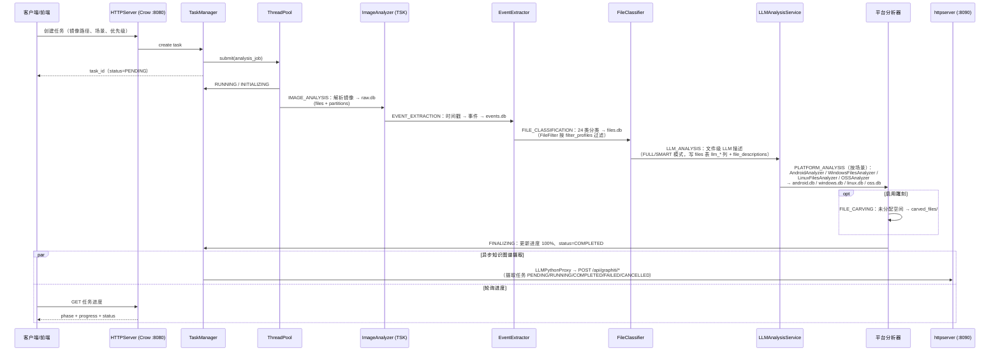
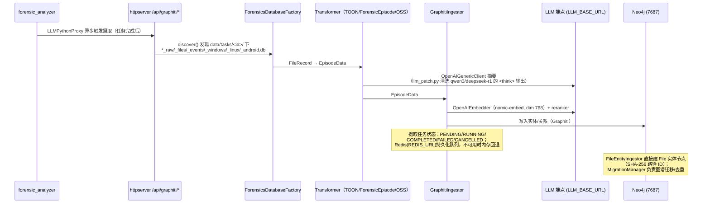
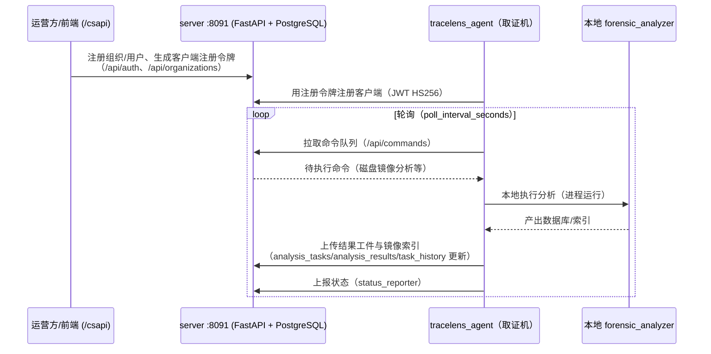

# 数据流架构

> 本文档以代码为准重写。所有任务阶段、状态机、目录布局均对应 `src/network/HTTPServer/` 与 `src/core/PathManager/` 中的实现。

## 1. 概述

TraceLens 有两条核心分析数据流（CLI 模式与 HTTP 任务模式），以及两条增值数据流（LLM/Graphiti 智能分析、C/S 分布式执行）。两种模式共享同一套分析器组件，区别在于编排入口与数据库输出位置：

| | CLI 模式 | HTTP 任务模式 |
|---|---------|--------------|
| 入口 | `src/main.cpp` → `AnalysisOrchestrator.cpp` | `HTTPserver` → `TaskManagerAnalysis.cpp` |
| 输出位置 | 镜像同目录 `<image>_raw.db` 等 | `data/tasks/<task_id>/raw.db` 等（`PathManager.getTaskDbPaths`） |
| 平台工件 | 并入 `<image>_files.db` | 独立 `android.db/windows.db/linux.db/oss.db` |
| 状态管理 | 进程同步执行 | TaskStatus/TaskPhase 状态机 + `data/tasks.json` 持久化 |

---

## 2. HTTP 任务模式（主数据流）

### 2.1 任务状态机

`src/network/HTTPServer/HTTPServerDataTypes.h`：

- **TaskStatus**: `PENDING → RUNNING → COMPLETED / FAILED / CANCELLED`
- **TaskPriority**: `LOW / NORMAL / HIGH / CRITICAL`
- **TaskPhase**: `INITIALIZING → IMAGE_ANALYSIS → EVENT_EXTRACTION → FILE_CLASSIFICATION → LLM_ANALYSIS → PLATFORM_ANALYSIS → FILE_CARVING → FINALIZING`
- **ForensicScenario**（一个任务可多场景顺序执行）: `ANDROID / WINDOWS / LINUX / SERVER_CLOUD`，由 `SceneDetector` 从 raw.db 自动检测

任务由 `ThreadPool` 执行（`THREAD_POOL_SIZE`，默认 4，最小 1，`ConfigManager.cpp:138`）；`TaskWatchdog` 每 60 秒检查一次，把超过 `TASK_WATCHDOG_STALE_MINUTES`（默认 30 分钟）无进展的 RUNNING 任务标记失败；任务列表持久化到 `data/tasks.json`。

### 2.2 任务流水线时序



### 2.3 任务阶段与数据库产出对应表

| 阶段（TaskPhase） | 执行组件 | 数据库产出 |
|------------------|---------|-----------|
| INITIALIZING | TaskManager 环境/路径准备 | `data/tasks/<task_id>/` 目录 |
| IMAGE_ANALYSIS | ImageAnalyzer（TSK，含 SceneDetector） | `raw.db`（files、partitions） |
| EVENT_EXTRACTION | EventExtractor | `events.db`（events + 专用事件表 + 视图） |
| FILE_CLASSIFICATION | FileFilter → FileClassifier | `files.db`（主 files 表 + 24 分类表 + 场景工件表） |
| LLM_ANALYSIS | LLMAnalysisService（文件级，FULL/SMART） | `files.db` 的 llm_* 列 + `file_descriptions` 表 |
| PLATFORM_ANALYSIS | Android/Windows/Linux/OSS 分析器（+ 各平台 LLM 服务、EventClusterAnalyzer 事件簇） | `android.db`（33 表）/ `windows.db`（32 表，含 dll_*）/ `linux.db`（73 表）/ `oss.db` |
| FILE_CARVING | FileCarver（可选） | `carved_files/` + carved_files 记录 |
| FINALIZING | TaskManager + LLMPythonProxy | 进度落盘、触发 Graphiti 摄取 |

任务目录布局（`PathManager.cpp`）：`data/tasks/<task_id>/` 下为 `raw.db`、`events.db`、`files.db`、`android.db`、`oss.db`、`windows.db`、`linux.db`，另有 `extracted_files/`（LLMScratch 提取目录）与 `carved_files/`。

---

## 3. CLI 模式数据流

入口：`src/CommandLineParser.cpp` 解析参数，`src/AnalysisOrchestrator.cpp` 编排。全量分析默认链与 HTTP 模式相同，但**平台工件并入 `<image>_files.db`**（场景工件表），不生成独立平台库。

```mermaid
flowchart LR
    A[./forensic_analyzer<br/>evidence.E01] --> B[ImageAnalyzer<br/>TSK 解析]
    B --> C[<image>_raw.db]
    C --> D[EventExtractor]
    D --> E[<image>_events.db]
    C --> F[FileClassifier]
    F --> G[<image>_files.db<br/>+ 平台场景工件并入]

    A -.->|独立子命令| S1[--index/--search<br/>Xapian 全文索引/搜索]
    A -.-> S2[--carve 文件雕刻]
    A -.-> S3[--extract-file/-ext/-all<br/>文件提取]
    A -.-> S4[--analyze-dlls[-only]<br/>→ <image>_dll.db]
    A -.-> S5[--android-analyze<br/>--android-source tsk|dir|zip|miui-backup]
    A -.-> S6[--wechat-password<br/>--backup-password[-stdin|-fd]]
    A -.-> S7[--windows-analyze]
    A -.-> S8[--linux-analyze]
    A -.-> S9[--memory-analyze --vol-symbols-dir<br/>Volatility3 → <image>_memory.db]
    A -.-> S10[--report/--report-path<br/>Markdown 报告]
    A -.-> S11[--dump-text/--dump-text-max-size<br/>文本导出]
    A -.-> S12[--xfs-mode auto|native|pure]
    A -.-> S13[--filter-profile 场景过滤]
    A -.-> S14[--key-dir/--key-password<br/>加密镜像解密]

    style C fill:#e8f5e9
    style E fill:#fff3e0
    style G fill:#e3f2fd
```

以上参数全部来自 `src/CommandLineParser.cpp` 的实际 `add_option` 列表。

---

## 4. LLM / Graphiti 数据流

### 4.1 C++ 侧 LLM 栈

`src/integration/LLMIntegration/`：`LLMClient`（cpp-httplib + OpenSSL，OpenAI 兼容 chat/listModels/tool-calling）→ `ModelRouter`（Priority/Capability/RoundRobin/LoadBalance/Fallback）。消费方：

- `LLMAnalysisService`：文件级描述（源码标 deprecated 注释，但仍为 TaskManager 活跃路径）
- `LinuxLLMAnalysisService` / `WindowsLLMAnalysisService` / `AndroidLLMAnalysisService`：平台工件级
- `DLLAnalyzerLLMService`：DLL 工件
- `EventClusterAnalyzer`：事件簇
- `MarkitdownProxy` → Python `/api/markitdown/*`

### 4.2 Graphiti 摄取流（python_service/graphiti_integration/）



---

## 5. C/S 分布式数据流

`server`（:8091，PostgreSQL + JWT）→ `tracelens_agent`（取证机）→ 本地 `forensic_analyzer`。



服务端数据模型（`migrations/postgresql/001_initial_schema.sql` 等 3 个迁移）：`organizations`、`users`、`clients`、`disk_images`、`command_queue`、`analysis_tasks`、`analysis_results`、`llm_analysis`、`task_history`、`registration_tokens`。API 前缀（`python_service/server/api/`）：`/api/auth`、`/api/organizations`、`/api/clients`、`/api/commands`、`/api/tasks`、以及 results 路由（与 tasks 同前缀 `/api/tasks`）。

---

## 6. 前端请求流

生产模式：React SPA 由 C++ 从 `web/dist` 托管，浏览器请求同一 8080 端口；`/api/reports`、`/api/graphiti`、`/api/llm`、`/api/office`、`/api/db`、`/api/wechat`、`/api/investigation` 等前缀在**开发模式**下由 Vite 代理到 8090（`web/vite.config.js`），`/csapi` 代理到 8091，其余 `/api` 与 `/tasks` 到 C++。

注意：C++ HTTPServer **未注册 OSSRoutes**（见 Overview.md 死代码表），前端 OSS 页面对 `/api/forensics/oss/*` 的调用在当前代码下会失败。

---

## 相关文档

- **[架构总览](./Overview.md)** - 三服务 + 代理整体架构
- **[数据库模式](./DatabaseSchema.md)** - 各阶段产出的表结构
- **[部署架构](./Deployment.md)** - 如何启动这些数据流

---

**最后更新**: 2026-08-23（以代码为准重写）
