# 数据流架构

## 1. 概述

本文档详细描述 ForensicsProject 中的数据流架构，包括取证分析管道、HTTP 服务数据流、知识图谱集成和 LLM 分析流程。

---

## 2. 核心取证分析管道

### 2.1 四步分析管道

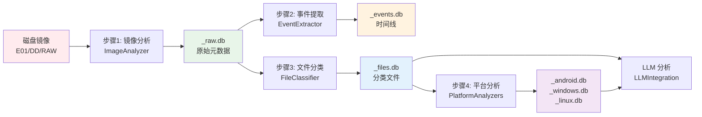

### 2.2 详细数据流图

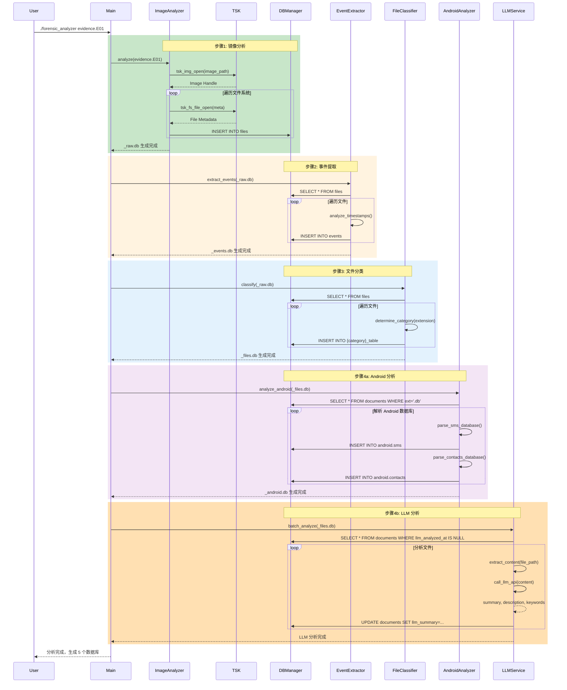

---

## 3. 镜像分析数据流

### 3.1 ImageAnalyzer 流程

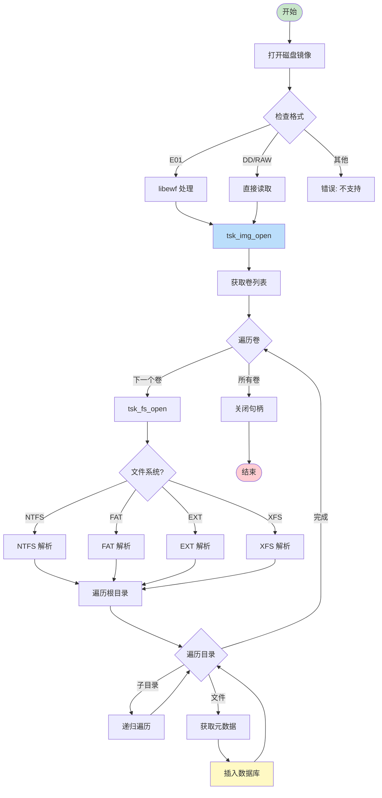

### 3.2 元数据提取流程

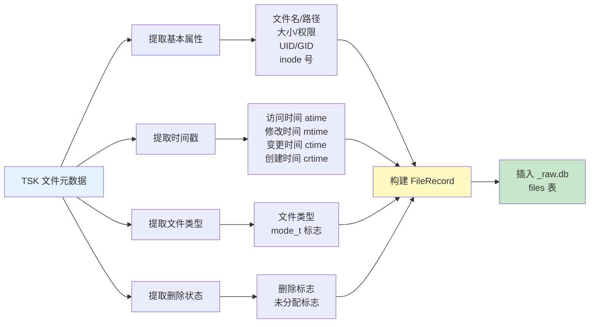

---

## 4. 事件提取数据流

### 4.1 EventExtractor 转换逻辑

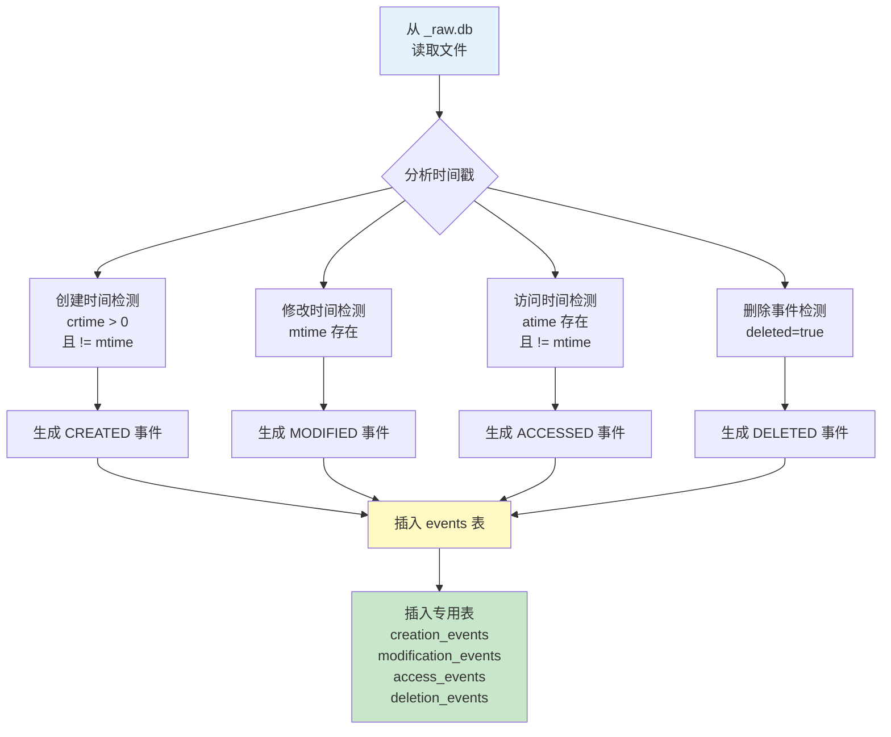

### 4.2 事件数据结构

**原始文件元数据 (_raw.db/files)**：
```sql
CREATE TABLE files (
    id INTEGER PRIMARY KEY,
    path TEXT NOT NULL,
    name TEXT NOT NULL,
    size INTEGER,
    type TEXT,
    deleted INTEGER DEFAULT 0,
    atime INTEGER,  -- 访问时间
    mtime INTEGER,  -- 修改时间
    ctime INTEGER,  -- 变更时间
    crtime INTEGER  -- 创建时间
);
```

**时间线事件 (_events.db/events)**：
```sql
CREATE TABLE events (
    id INTEGER PRIMARY KEY,
    timestamp INTEGER NOT NULL,
    event_type TEXT NOT NULL,  -- CREATED/MODIFIED/ACCESSED/DELETED
    file_id INTEGER,
    description TEXT,
    source_type TEXT,  -- filesystem/android/windows/linux
    metadata TEXT
);
```

**事件转换示例**：
```json
// 输入：原始文件
{
  "id": 1,
  "path": "/Users/john/Documents/report.docx",
  "name": "report.docx",
  "size": 1048576,
  "deleted": 0,
  "atime": 1705388400,  // 2024-01-15 10:00:00
  "mtime": 1705388400,
  "ctime": 1705388400,
  "crtime": 1705380000  // 2024-01-15 08:00:00
}

// 输出：时间线事件（3 个事件）
[
  {
    "timestamp": 1705380000,
    "event_type": "CREATED",
    "file_id": 1,
    "description": "Created report.docx",
    "source_type": "filesystem"
  },
  {
    "timestamp": 1705388400,
    "event_type": "MODIFIED",
    "file_id": 1,
    "description": "Modified report.docx",
    "source_type": "filesystem"
  },
  {
    "timestamp": 1705388400,
    "event_type": "ACCESSED",
    "file_id": 1,
    "description": "Accessed report.docx",
    "source_type": "filesystem"
  }
]
```

---

## 5. 文件分类数据流

### 5.1 FileClassifier 逻辑

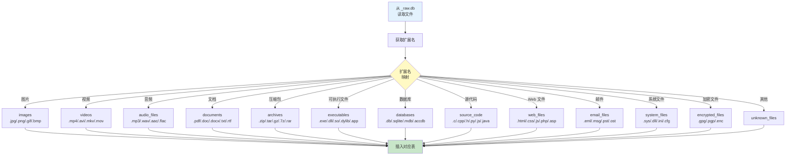

### 5.2 扩展名映射表

| 类别 | 扩展名 | 表名 |
|------|--------|------|
| **图片** | .jpg, .jpeg, .png, .gif, .bmp, .tiff, .webp, .svg | images |
| **视频** | .mp4, .avi, .mkv, .mov, .wmv, .flv, .webm | videos |
| **音频** | .mp3, .wav, .aac, .flac, .ogg, .wma | audio_files |
| **文档** | .pdf, .doc, .docx, .xls, .xlsx, .ppt, .pptx, .txt, .rtf, .odt | documents |
| **压缩包** | .zip, .tar, .gz, .7z, .rar, .bz2, .xz | archives |
| **可执行文件** | .exe, .dll, .so, .dylib, .app, .elf | executables |
| **数据库** | .db, .sqlite, .sqlite3, .mdb, .accdb | databases |
| **源代码** | .c, .cpp, .h, .hpp, .py, .js, .java, .go, .rs | source_code |
| **Web 文件** | .html, .htm, .css, .js, .php, .asp, .jsp | web_files |
| **邮件** | .eml, .msg, .pst, .ost, .mbox | email_files |
| **系统文件** | .sys, .dll, .ini, .cfg, .conf, .log | system_files |
| **加密文件** | .gpg, .pgp, .enc, .encrypted | encrypted_files |
| **其他** | 所有其他扩展名 | unknown_files |

---

## 6. 平台分析数据流

### 6.1 Android 分析流程

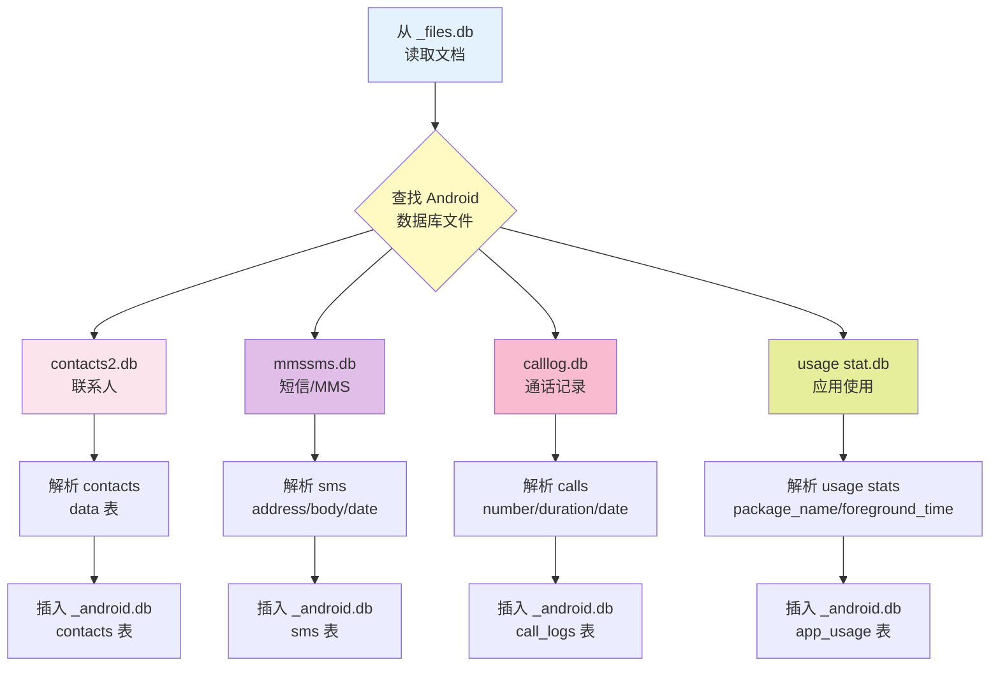

**Android 数据库路径映射**：
| 数据库类型 | 典型路径 | 表名 |
|-----------|---------|------|
| 联系人 | `/data/data/com.android.providers.contacts/databases/contacts2.db` | contacts |
| 短信/MMS | `/data/data/com.android.providers.telephony/databases/mmssms.db` | sms, mms |
| 通话记录 | `/data/data/com.android.providers.contacts/databases/calllog.db` | call_logs |
| 应用使用 | `/data/system/usagestats/` | app_usage |

### 6.2 Windows 分析流程

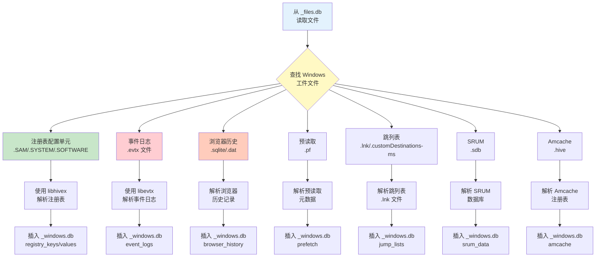

**Windows 工件路径映射**：
| 工件类型 | 典型路径 | 解析库 |
|---------|---------|--------|
| 注册表 SAM | `C:/Windows/System32/config/SAM` | libhivex |
| 注册表 SYSTEM | `C:/Windows/System32/config/SYSTEM` | libhivex |
| 注册表 SOFTWARE | `C:/Windows/System32/config/SOFTWARE` | libhivex |
| 注册表 NTUSER | `C:/Users/{user}/NTUSER.DAT` | libhivex |
| 事件日志 | `C:/Windows/System32/winevt/Logs/*.evtx` | libevtx |
| Chrome 历史 | `C:/Users/{user}/AppData/Local/Google/Chrome/User Data/Default/History` | SQLite |
| Firefox 历史 | `C:/Users/{user}/AppData/Roaming/Mozilla/Firefox/Profiles/*.default/places.sqlite` | SQLite |
| 预读取 | `C:/Windows/Prefetch/*.pf` | 自定义解析器 |
| 跳列表 | `C:/Users/{user}/AppData/Roaming/Microsoft/Windows/Recent/*.lnk` | 自定义解析器 |
| SRUM | `C:/Windows/System32/sru/SRUDB.dat` | 自定义解析器 |
| Amcache | `C:/Windows/AppCompat/Programs/Amcache.hve` | libhivex |

### 6.3 Linux 分析流程

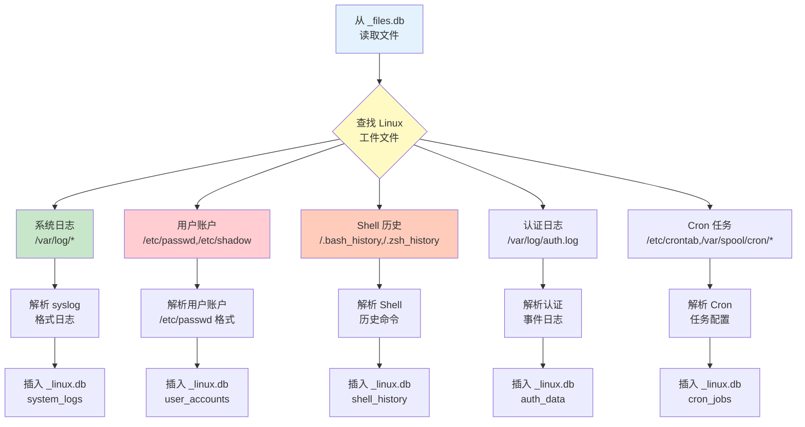

---

## 7. LLM 分析数据流

### 7.1 批量分析流程

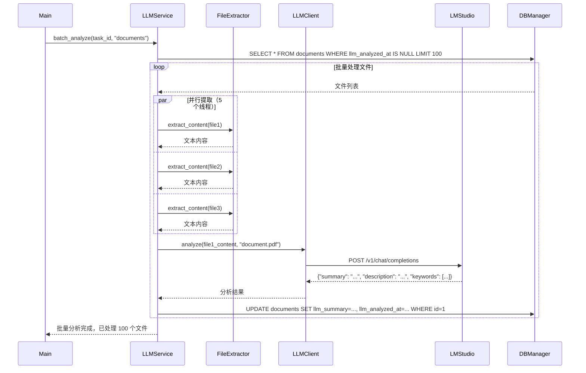

### 7.2 LLM 分析数据结构

**分析请求**：
```json
{
  "content": "这是一份保密协议，甲方与乙方同意...",
  "max_tokens": 1000,
  "model_type": "text",
  "extract": {
    "summary": true,
    "description": true,
    "keywords": true
  }
}
```

**分析响应**：
```json
{
  "success": true,
  "summary": "保密协议文档",
  "description": "这是一份甲方与乙方的保密协议，规定了双方在合作期间的保密义务...",
  "keywords": ["保密", "协议", "合同", "法律责任"],
  "model_used": "qwen2.5:7b",
  "tokens_used": 500,
  "analyzed_at": "2024-01-16T10:00:00Z"
}
```

**数据库更新**：
```sql
UPDATE documents
SET
    llm_summary = '保密协议文档',
    llm_description = '这是一份甲方与乙方的保密协议...',
    llm_keywords = '保密,协议,合同,法律责任',
    llm_analyzed_at = 1705388400,
    llm_model_used = 'qwen2.5:7b'
WHERE id = 1;
```

---

## 8. 知识图谱集成数据流

### 8.1 Graphiti 数据摄取流程

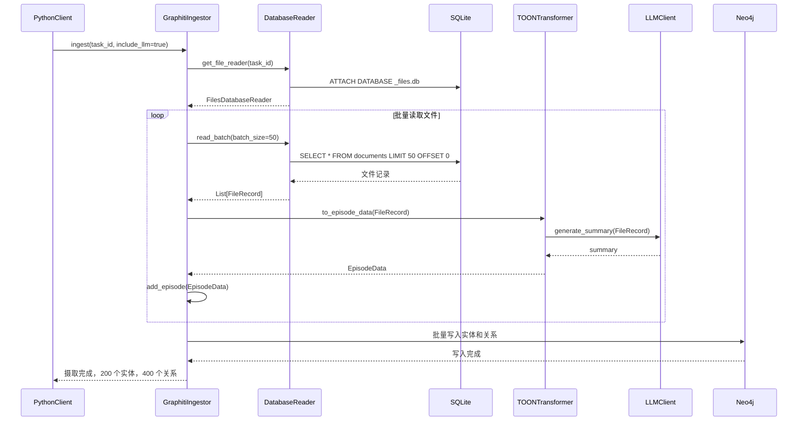

### 8.2 数据转换流程

**FileRecord → EpisodeData**：
```json
// 输入：FileRecord
{
  "id": 1,
  "name": "contract.pdf",
  "path": "/Users/john/Documents/contract.pdf",
  "size": 1048576,
  "category": "documents",
  "llm_summary": "法律合同文档",
  "llm_description": "甲方与乙方的服务合同...",
  "llm_keywords": ["合同", "法律", "服务"],
  "mtime": 1705388400
}

// 输出：EpisodeData
{
  "episode_id": "ep-1",
  "name": "contract.pdf",
  "summary": "法律合同文档",
  "summary_embedding": [0.1, 0.2, ...],
  "source": "ForensicsProject",
  "source_description": "Digital forensics analysis",
  "valid_at": 1705388400,
  "created_at": 1705400000,
  "observations": [
    {
      "name": "contract.pdf",
      "entity_type": "FILE",
      "attributes": {
        "file_path": "/Users/john/Documents/contract.pdf",
        "size": 1048576,
        "category": "documents"
      }
    },
    {
      "name": "/Users/john/Documents",
      "entity_type": "LOCATION",
      "attributes": {
        "directory": true
      }
    },
    {
      "name": "法律",
      "entity_type": "KEYWORD",
      "attributes": {}
    }
  ],
  "relationships": [
    {
      "source": "contract.pdf",
      "target": "/Users/john/Documents",
      "type": "LOCATED_AT",
      "attributes": {
        "confidence": 1.0
      }
    },
    {
      "source": "contract.pdf",
      "target": "法律",
      "type": "HAS_KEYWORD",
      "attributes": {
        "confidence": 0.95
      }
    }
  ]
}
```

### 8.3 Neo4j 图谱模式

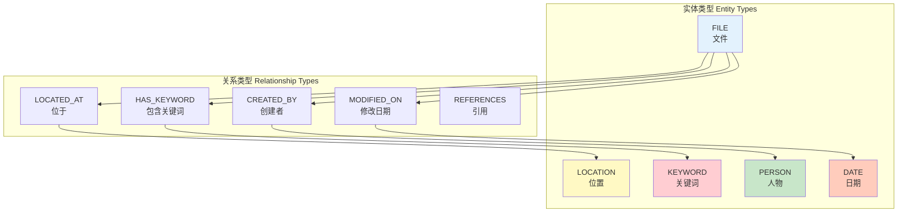

---

## 9. HTTP 服务数据流

### 9.1 C++ 服务请求处理

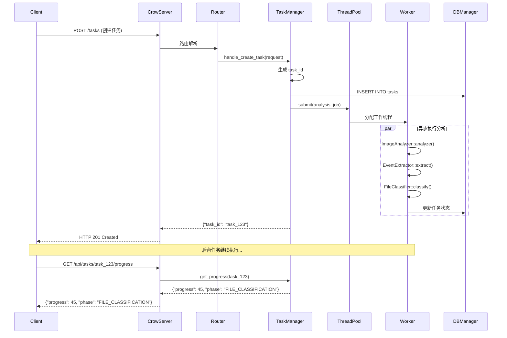

### 9.2 Python 服务请求处理

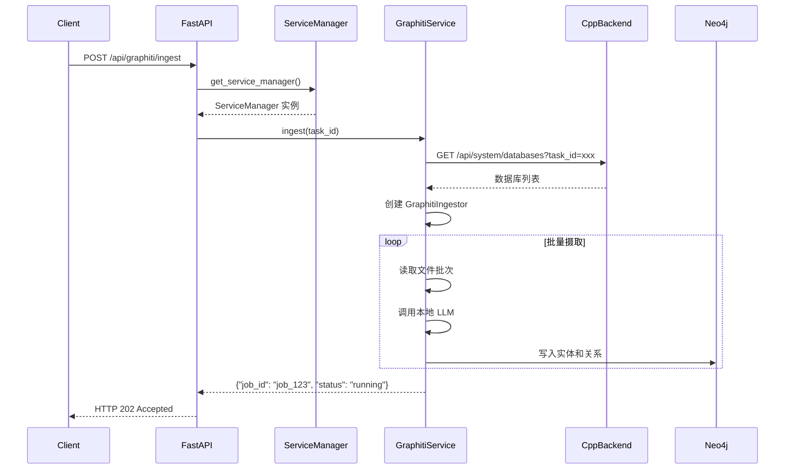

### 9.3 服务间通信

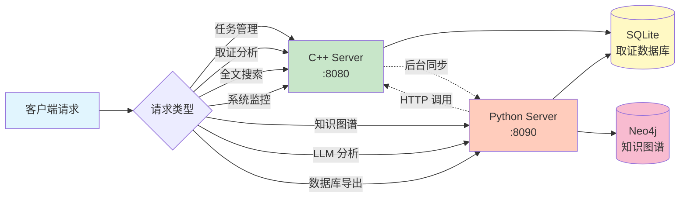

---

## 10. 数据导出流

### 10.1 TOON 格式导出

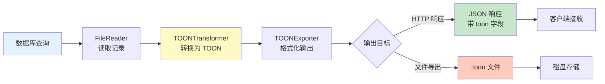

**TOON 格式示例**：
```
TOON.schema: name | path | category | size | mtime | llm_summary | llm_keywords
# records[2]
contract.pdf | /docs/contract.pdf | documents | 1048576 | 1705388400 | 法律合同 | 合同,法律
report.docx | /docs/report.docx | documents | 2048576 | 1705390000 | 年度报告 | 报告,年度
```

### 10.2 JSON 格式导出

```json
{
  "success": true,
  "format": "json",
  "data": [
    {
      "name": "contract.pdf",
      "path": "/docs/contract.pdf",
      "category": "documents",
      "size": 1048576,
      "mtime": 1705388400,
      "llm_summary": "法律合同",
      "llm_keywords": ["合同", "法律"]
    }
  ],
  "count": 1
}
```

---

## 相关文档

- **[架构总览](./Overview.md)** - 系统整体架构
- **[数据库模式](./DatabaseSchema.md)** - 数据库表结构
- **[LLM 集成](../modules/cpp/integration/LLMIntegration.md)** - LLM 服务集成
- **[知识图谱集成](../modules/python/graphiti_integration/GraphitiIngestor.md)** - Graphiti 数据摄取

---

**最后更新**: 2026-03-11
**维护者**: ymj68520
