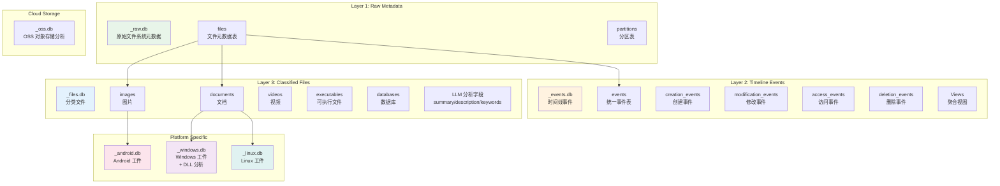
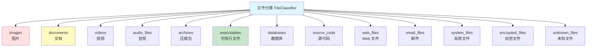
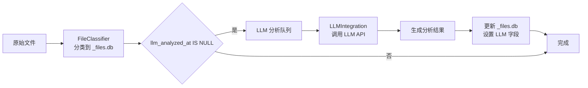

# 数据库模式设计

## 1. 概述

ForensicsProject 使用 **SQLite** 作为主要数据存储引擎，采用三层数据库架构设计，从原始文件系统元数据到结构化的取证分析结果，形成完整的数据链路。

### 核心设计理念

- **分层存储**：原始数据、事件、分类文件分开存储
- **模块化扩展**：平台特定分析（Android/Windows/Linux）独立数据库
- **LLM 集成**：所有文件表支持 LLM 分析字段
- **时间线导向**：所有数据包含时间戳，支持时间线重建
- **取证友好**：保留完整证据链（哈希、路径、时间戳）

---

## 2. 数据库架构

### 2.1 三层数据库设计



### 2.2 数据库文件命名规则

| 数据库类型 | 命名规则 | 示例 |
|-----------|---------|------|
| 原始数据库 | `{镜像名}_raw.db` | `evidence_E01_raw.db` |
| 事件数据库 | `{镜像名}_events.db` | `evidence_E01_events.db` |
| 文件数据库 | `{镜像名}_files.db` | `evidence_E01_files.db` |
| Android 数据库 | `{镜像名}_android.db` | `evidence_E01_android.db` |
| Windows 数据库 | `{镜像名}_windows.db` | `evidence_E01_windows.db` |
| Linux 数据库 | `{镜像名}_linux.db` | `evidence_E01_linux.db` |

---

## 3. _raw.db - 原始元数据数据库

### 3.1 核心表结构

#### files 表

```sql
CREATE TABLE IF NOT EXISTS files (
    id INTEGER PRIMARY KEY AUTOINCREMENT,
    inode INTEGER,                    -- inode 号
    name TEXT NOT NULL,               -- 文件名
    path TEXT NOT NULL,               -- 完整路径
    size INTEGER,                     -- 文件大小（字节）
    extension TEXT,                   -- 文件扩展名
    category TEXT,                    -- 文件分类（13 类）
    type TEXT,                        -- 文件类型
    mtime INTEGER,                    -- 修改时间（Unix 时间戳，毫秒）
    ctime INTEGER,                    -- 变更时间
    atime INTEGER,                    -- 访问时间
    crtime INTEGER,                   -- 创建时间
    is_deleted INTEGER DEFAULT 0,     -- 是否删除
    md5 TEXT,                        -- MD5 哈希

    -- 场景感知字段
    scene_type TEXT,                  -- 场景类型（如 financial, communication, browsing）
    scene_priority INTEGER DEFAULT 0, -- 场景优先级
    scene_relevant INTEGER DEFAULT 1, -- 场景相关性

    -- LLM 分析字段
    llm_summary TEXT,                 -- 摘要
    llm_description TEXT,             -- 描述
    llm_keywords TEXT,                -- 关键词（逗号分隔）
    llm_analyzed_at INTEGER,          -- 分析时间
    llm_model_used TEXT               -- 使用的模型
);
```

**字段说明**：

| 字段 | 类型 | 说明 | 取值示例 |
|------|------|------|---------|
| `inode` | INTEGER | 文件系统 inode 号 | 12345 |
| `mtime` | INTEGER | 最后修改时间（毫秒） | 1705388400000 |
| `category` | TEXT | 文件分类 | documents, images, executables |
| `is_deleted` | INTEGER | 是否已删除 | 0 = 否, 1 = 是 |
| `llm_summary` | TEXT | LLM 生成的摘要 | "保密协议文档" |
| `llm_keywords` | TEXT | 关键词列表 | "保密,协议,合同" |

#### partitions 表

```sql
CREATE TABLE IF NOT EXISTS partitions (
    id INTEGER PRIMARY KEY AUTOINCREMENT,
    partition_number INTEGER,
    start_sector INTEGER,
    end_sector INTEGER,
    sector_count INTEGER,
    filesystem_type TEXT,
    volume_label TEXT,
    total_size INTEGER,
    used_size INTEGER
);
```

### 3.2 索引设计

```sql
-- 性能优化索引
CREATE INDEX IF NOT EXISTS idx_files_path ON files(path);
CREATE INDEX IF NOT EXISTS idx_files_inode ON files(inode);
CREATE INDEX IF NOT EXISTS idx_files_deleted ON files(is_deleted);
CREATE INDEX IF NOT EXISTS idx_files_category ON files(category);
CREATE INDEX IF NOT EXISTS idx_files_mtime ON files(mtime);
CREATE INDEX IF NOT EXISTS idx_files_extension ON files(extension);
```

---

## 4. _events.db - 时间线事件数据库

### 4.1 核心表结构

#### events 表（统一事件表）

```sql
CREATE TABLE IF NOT EXISTS events (
    id INTEGER PRIMARY KEY AUTOINCREMENT,
    timestamp INTEGER NOT NULL,       -- 事件时间（毫秒）
    event_type TEXT NOT NULL,         -- 事件类型
    file_path TEXT NOT NULL,          -- 文件路径
    inode INTEGER,                     -- inode 号
    description TEXT,                  -- 事件描述
    file_size INTEGER,                 -- 文件大小
    file_type TEXT                    -- 文件类型
);
```

**事件类型**：

| 事件类型 | 说明 | 触发条件 |
|---------|------|---------|
| `CREATED` | 文件创建 | `crtime > 0` 且 `crtime != mtime` |
| `MODIFIED` | 文件修改 | `mtime` 存在且与 `crtime` 不同 |
| `ACCESSED` | 文件访问 | `atime` 存在且与 `mtime` 不同 |
| `DELETED` | 文件删除 | `is_deleted = 1` |
| `CHANGED` | 元数据变更 | `ctime` 与 `mtime` 不同 |

#### 专用事件表

```sql
-- 创建事件
CREATE TABLE IF NOT EXISTS creation_events (
    id INTEGER PRIMARY KEY AUTOINCREMENT,
    timestamp INTEGER NOT NULL,
    file_path TEXT NOT NULL,
    inode INTEGER,
    file_size INTEGER,
    file_type TEXT
);

-- 修改事件
CREATE TABLE IF NOT EXISTS modification_events (
    id INTEGER PRIMARY KEY AUTOINCREMENT,
    timestamp INTEGER NOT NULL,
    file_path TEXT NOT NULL,
    inode INTEGER,
    file_size INTEGER,
    file_type TEXT
);

-- 访问事件
CREATE TABLE IF NOT EXISTS access_events (
    id INTEGER PRIMARY KEY AUTOINCREMENT,
    timestamp INTEGER NOT NULL,
    file_path TEXT NOT NULL,
    inode INTEGER,
    file_size INTEGER,
    file_type TEXT
);

-- 删除事件
CREATE TABLE IF NOT EXISTS deletion_events (
    id INTEGER PRIMARY KEY AUTOINCREMENT,
    timestamp INTEGER NOT NULL,
    file_path TEXT NOT NULL,
    inode INTEGER,
    file_size INTEGER,
    file_type TEXT
);

-- 变更事件
CREATE TABLE IF NOT EXISTS change_events (
    id INTEGER PRIMARY KEY AUTOINCREMENT,
    timestamp INTEGER NOT NULL,
    file_path TEXT NOT NULL,
    inode INTEGER,
    file_size INTEGER,
    file_type TEXT
);
```

### 4.2 视图

#### timeline 视图

```sql
CREATE VIEW IF NOT EXISTS timeline AS
SELECT
    datetime(timestamp/1000, 'unixepoch') as event_time,
    event_type,
    file_path,
    inode,
    file_size,
    file_type,
    description
FROM events
ORDER BY timestamp DESC;
```

#### event_statistics 视图

```sql
CREATE VIEW IF NOT EXISTS event_statistics AS
SELECT
    event_type,
    COUNT(*) as event_count,
    MIN(timestamp) as first_event,
    MAX(timestamp) as last_event,
    datetime(MIN(timestamp)/1000, 'unixepoch') as first_event_time,
    datetime(MAX(timestamp)/1000, 'unixepoch') as last_event_time
FROM events
GROUP BY event_type;
```

#### hourly_activity 视图

```sql
CREATE VIEW IF NOT EXISTS hourly_activity AS
SELECT
    strftime('%Y-%m-%d %H:00:00', datetime(timestamp/1000, 'unixepoch')) as hour,
    event_type,
    COUNT(*) as event_count
FROM events
GROUP BY hour, event_type
ORDER BY hour DESC;
```

### 4.3 索引设计

```sql
-- 事件查询优化
CREATE INDEX IF NOT EXISTS idx_events_timestamp ON events(timestamp);
CREATE INDEX IF NOT EXISTS idx_events_type ON events(event_type);
CREATE INDEX IF NOT EXISTS idx_events_path ON events(file_path);
CREATE INDEX IF NOT EXISTS idx_events_inode ON events(inode);
```

---

## 5. _files.db - 分类文件数据库

### 5.1 文件分类体系

**13 类文件**：



### 5.2 分类表结构

所有分类表共享相同的结构模板：

```sql
-- 分类表模板
CREATE TABLE IF NOT EXISTS {category} (
    id INTEGER PRIMARY KEY AUTOINCREMENT,
    inode INTEGER,
    name TEXT,
    path TEXT,
    size INTEGER,
    extension TEXT,
    mtime INTEGER,
    ctime INTEGER,
    is_deleted INTEGER,
    md5 TEXT,

    -- LLM 分析字段
    llm_summary TEXT,
    llm_description TEXT,
    llm_keywords TEXT,
    llm_analyzed_at INTEGER,
    llm_model_used TEXT
);
```

**示例：documents 表**

```sql
CREATE TABLE IF NOT EXISTS documents (
    id INTEGER PRIMARY KEY AUTOINCREMENT,
    inode INTEGER,
    name TEXT,
    path TEXT,
    size INTEGER,
    extension TEXT,
    mtime INTEGER,
    ctime INTEGER,
    is_deleted INTEGER,
    md5 TEXT,
    llm_summary TEXT,
    llm_description TEXT,
    llm_keywords TEXT,
    llm_analyzed_at INTEGER,
    llm_model_used TEXT
);
```

### 5.3 扩展名映射

| 分类 | 扩展名 | 表名 |
|------|--------|------|
| **images** | .jpg, .jpeg, .png, .gif, .bmp, .tiff, .webp, .svg | images |
| **videos** | .mp4, .avi, .mkv, .mov, .wmv, .flv | videos |
| **audio_files** | .mp3, .wav, .aac, .flac, .ogg, .m4a | audio_files |
| **documents** | .pdf, .doc, .docx, .xls, .xlsx, .ppt, .pptx, .txt, .rtf | documents |
| **archives** | .zip, .tar, .gz, .7z, .rar, .bz2 | archives |
| **executables** | .exe, .dll, .so, .dylib, .app, .elf | executables |
| **databases** | .db, .sqlite, .sqlite3, .mdb, .accdb | databases |
| **source_code** | .c, .cpp, .h, .py, .js, .java, .go | source_code |
| **web_files** | .html, .htm, .css, .js, .php, .asp | web_files |
| **email_files** | .eml, .msg, .pst, .ost, .mbox | email_files |
| **system_files** | .sys, .dll, .ini, .cfg, .conf, .log | system_files |
| **encrypted_files** | .gpg, .pgp, .enc, .encrypted | encrypted_files |
| **unknown_files** | 其他扩展名 | unknown_files |

### 5.4 聚合视图

#### file_summary 视图

```sql
CREATE VIEW IF NOT EXISTS file_summary AS
SELECT
    'images' as category,
    COUNT(*) as count,
    SUM(size) as total_size,
    COUNT(CASE WHEN is_deleted = 1 THEN 1 END) as deleted_count
FROM images
UNION ALL
SELECT
    'documents' as category,
    COUNT(*) as count,
    SUM(size) as total_size,
    COUNT(CASE WHEN is_deleted = 1 THEN 1 END) as deleted_count
FROM documents
-- ... 其他 11 个分类
;
```

#### extension_statistics 视图

```sql
CREATE VIEW IF NOT EXISTS extension_statistics AS
SELECT
    extension,
    category,
    COUNT(*) as count,
    AVG(size) as avg_size,
    SUM(size) as total_size
FROM files
GROUP BY extension, category
ORDER BY count DESC;
```

---

## 6. _android.db - Android 工件数据库

### 6.1 核心表结构

#### sms_messages 表

```sql
CREATE TABLE IF NOT EXISTS sms_messages (
    id INTEGER PRIMARY KEY AUTOINCREMENT,
    thread_id INTEGER,               -- 会话 ID
    address TEXT,                    -- 电话号码
    person TEXT,                     -- 联系人姓名
    date INTEGER,                    -- 消息时间
    date_sent INTEGER,               -- 发送时间
    read INTEGER,                     -- 已读状态
    status INTEGER,                   -- 消息状态
    type INTEGER,                     -- 消息类型（1=收件, 2=发件）
    body TEXT,                       -- 短信内容
    service_center TEXT              -- 运营商
);
```

**消息类型**：
- `type = 1`：收件箱
- `type = 2`：已发送
- `type = 3`：草稿
- `type = 4`：发件箱
- `type = 5`：失败
- `type = 6`：排队

#### contacts 表

```sql
CREATE TABLE IF NOT EXISTS contacts (
    id INTEGER PRIMARY KEY AUTOINCREMENT,
    raw_contact_id INTEGER,
    display_name TEXT,
    phone_number TEXT,
    email TEXT,
    account_type TEXT,               -- 账户类型
    account_name TEXT                -- 账户名称
);
```

#### call_logs 表

```sql
CREATE TABLE IF NOT EXISTS call_logs (
    id INTEGER PRIMARY KEY AUTOINCREMENT,
    number TEXT,                     -- 电话号码
    date INTEGER,                    -- 通话时间
    duration INTEGER,                 -- 通话时长（秒）
    type INTEGER,                     -- 通话类型
    name TEXT,                       -- 联系人姓名
    geocoded_location TEXT           -- 地理位置
);
```

**通话类型**：
- `type = 1`：呼入
- `type = 2`：呼出
- `type = 3`：未接

#### installed_packages 表

```sql
CREATE TABLE IF NOT EXISTS installed_packages (
    id INTEGER PRIMARY KEY AUTOINCREMENT,
    package_name TEXT NOT NULL UNIQUE,
    code_path TEXT,
    native_library_path TEXT,
    first_install_time INTEGER,
    last_update_time INTEGER,
    version TEXT,
    installer TEXT
);
```

#### usage_stats 表

```sql
CREATE TABLE IF NOT EXISTS usage_stats (
    id INTEGER PRIMARY KEY AUTOINCREMENT,
    package_name TEXT,
    total_time_foreground INTEGER,   -- 前台使用时长（毫秒）
    last_time_used INTEGER,           -- 最后使用时间
    interval_start INTEGER            -- 统计间隔开始时间
);
```

#### whatsapp_messages 表

```sql
CREATE TABLE IF NOT EXISTS whatsapp_messages (
    id INTEGER PRIMARY KEY AUTOINCREMENT,
    sender TEXT,
    receiver TEXT,
    content TEXT,
    timestamp INTEGER,
    media_url TEXT,
    media_type TEXT
);
```

#### telegram_messages 表

```sql
CREATE TABLE IF NOT EXISTS telegram_messages (
    id INTEGER PRIMARY KEY AUTOINCREMENT,
    sender TEXT,
    receiver TEXT,
    content TEXT,
    timestamp INTEGER,
    media_url TEXT,
    media_type TEXT
);
```

#### wechat_messages 表

```sql
CREATE TABLE IF NOT EXISTS wechat_messages (
    id INTEGER PRIMARY KEY AUTOINCREMENT,
    sender TEXT,
    receiver TEXT,
    content TEXT,
    timestamp INTEGER,
    media_url TEXT,
    media_type TEXT,
    msg_type INTEGER DEFAULT 1,       -- 消息类型
    is_send INTEGER DEFAULT 0,        -- 是否发送
    chatroom_name TEXT,               -- 群聊名称
    sender_nickname TEXT,             -- 发送者昵称
    talker TEXT                       -- 对话者
);
```

#### wechat_contacts 表

```sql
CREATE TABLE IF NOT EXISTS wechat_contacts (
    id INTEGER PRIMARY KEY AUTOINCREMENT,
    username TEXT UNIQUE,
    nickname TEXT,
    remark TEXT,                       -- 备注名
    avatar_path TEXT,
    type INTEGER,
    chatroom_flag INTEGER DEFAULT 0    -- 是否群聊
);
```

#### wechat_chatrooms 表

```sql
CREATE TABLE IF NOT EXISTS wechat_chatrooms (
    id INTEGER PRIMARY KEY AUTOINCREMENT,
    chatroom_name TEXT UNIQUE,
    owner TEXT,
    member_list TEXT,                  -- 成员列表（JSON）
    member_count INTEGER,
    create_time INTEGER
);
```

#### wifi_networks 表

```sql
CREATE TABLE IF NOT EXISTS wifi_networks (
    id INTEGER PRIMARY KEY AUTOINCREMENT,
    ssid TEXT NOT NULL,
    pre_shared_key TEXT,               -- WiFi 密码
    key_mgmt TEXT,                     -- 加密方式
    last_connected INTEGER
);
```

#### chrome_history 表

```sql
CREATE TABLE IF NOT EXISTS chrome_history (
    id INTEGER PRIMARY KEY AUTOINCREMENT,
    url TEXT NOT NULL,
    title TEXT,
    visit_count INTEGER,
    last_visit_time INTEGER,
    typed_count INTEGER
);
```

#### system_logs 表

```sql
CREATE TABLE IF NOT EXISTS system_logs (
    id INTEGER PRIMARY KEY AUTOINCREMENT,
    timestamp INTEGER,
    log_level TEXT,
    tag TEXT,
    process TEXT,
    pid INTEGER,
    message TEXT,
    log_file TEXT,
    log_source TEXT
);
```

#### system_build_properties 表

```sql
CREATE TABLE IF NOT EXISTS system_build_properties (
    id INTEGER PRIMARY KEY AUTOINCREMENT,
    property_key TEXT NOT NULL UNIQUE,
    property_value TEXT
);
```

#### app_database_files 表

```sql
CREATE TABLE IF NOT EXISTS app_database_files (
    id INTEGER PRIMARY KEY AUTOINCREMENT,
    package_name TEXT NOT NULL,
    file_name TEXT NOT NULL,
    file_path TEXT NOT NULL,
    file_size INTEGER DEFAULT 0,
    UNIQUE(package_name, file_path)
);
```

### 6.2 Android 数据库路径映射

| 数据 | 典型路径 | 解析内容 |
|------|---------|---------|
| 通讯录 | `/data/data/com.android.providers.contacts/databases/contacts2.db` | contacts 表 |
| 短信/MMS | `/data/data/com.android.providers.telephony/databases/mmssms.db` | sms_messages 表 |
| 通话记录 | `/data/data/com.android.providers.contacts/databases/calllog.db` | call_logs 表 |
| 应用使用 | `/data/system/usagestats/` | usage_stats 表 |
| Chrome 历史 | `/data/data/com.android.chrome/app_chrome/Default/History` | chrome_history 表 |

---

## 7. _windows.db - Windows 工件数据库

### 7.1 核心表结构

#### registry_values 表

```sql
CREATE TABLE IF NOT EXISTS registry_values (
    id INTEGER PRIMARY KEY AUTOINCREMENT,
    hive_path TEXT,                   -- 配置单元文件路径
    hive_type TEXT,                   -- SAM/SYSTEM/SOFTWARE/NTUSER
    key_path TEXT,                    -- 注册表键路径
    value_name TEXT,                  -- 值名称
    value_type TEXT,                  -- 值类型
    value_data TEXT,                   -- 值数据
    last_modified INTEGER,             -- 最后修改时间
    forensic_importance TEXT          -- 取证重要性（HIGH/MEDIUM/LOW）
);
```

**配置单元类型**：
- `SAM`：用户账户数据库
- `SYSTEM`：系统配置
- `SOFTWARE`：软件配置
- `SECURITY`：安全策略
- `NTUSER.DAT`：用户配置

**值类型**：
- `REG_SZ`：字符串
- `REG_DWORD`：32 位整数
- `REG_QWORD`：64 位整数
- `REG_BINARY`：二进制数据
- `REG_MULTI_SZ`：多字符串
- `REG_EXPAND_SZ`：可扩展字符串

#### event_logs 表

```sql
CREATE TABLE IF NOT EXISTS event_logs (
    id INTEGER PRIMARY KEY AUTOINCREMENT,
    record_id INTEGER,                -- 记录 ID
    log_source TEXT,                  -- 日志来源
    event_id INTEGER,                 -- 事件 ID
    level TEXT,                       -- 日志级别
    timestamp INTEGER,                -- 事件时间
    source TEXT,                      -- 事件源
    message TEXT,                     -- 事件消息
    computer_name TEXT,               -- 计算机名
    user_sid TEXT,                    -- 用户 SID
    channel TEXT                      -- 事件通道
);
```

**关键事件 ID**：
- `4624`：账户登录成功
- `4625`：账户登录失败
- `4634`：账户注销
- `4720`：用户创建
- `4726`：用户删除
- `4728`：用户组成员变更

#### prefetch_files 表

```sql
CREATE TABLE IF NOT EXISTS prefetch_files (
    id INTEGER PRIMARY KEY AUTOINCREMENT,
    file_path TEXT,
    executable_name TEXT,
    executable_path TEXT,
    prefetch_hash TEXT,
    run_count INTEGER,                 -- 运行次数
    last_run_time INTEGER,            -- 最后运行时间
    creation_time INTEGER,
    referenced_files TEXT,            -- 引用的文件（JSON 数组）
    referenced_directories TEXT       -- 引用的目录（JSON 数组）
);
```

#### browser_history 表

```sql
CREATE TABLE IF NOT EXISTS browser_history (
    id INTEGER PRIMARY KEY AUTOINCREMENT,
    browser_name TEXT,                 -- 浏览器名称（chrome/edge/firefox）
    profile_name TEXT,
    url TEXT,
    title TEXT,
    visit_time INTEGER,                -- 访问时间（微秒）
    visit_duration INTEGER,            -- 停留时长（微秒）
    visit_count INTEGER,
    visit_type TEXT,
    is_redirect INTEGER,
    referrer TEXT
);
```

#### browser_downloads 表

```sql
CREATE TABLE IF NOT EXISTS browser_downloads (
    id INTEGER PRIMARY KEY AUTOINCREMENT,
    browser_name TEXT,
    profile_name TEXT,
    url TEXT,
    target_path TEXT,
    file_name TEXT,
    file_size INTEGER,
    start_time INTEGER,
    end_time INTEGER,
    state TEXT,
    mime_type TEXT,
    referrer TEXT,
    received_bytes INTEGER,
    danger_accepted INTEGER
);
```

#### browser_bookmarks 表

```sql
CREATE TABLE IF NOT EXISTS browser_bookmarks (
    id INTEGER PRIMARY KEY AUTOINCREMENT,
    browser_name TEXT,
    profile_name TEXT,
    url TEXT,
    title TEXT,
    folder_path TEXT,
    date_added INTEGER,
    date_modified INTEGER
);
```

#### browser_cookies 表

```sql
CREATE TABLE IF NOT EXISTS browser_cookies (
    id INTEGER PRIMARY KEY AUTOINCREMENT,
    browser_name TEXT,
    profile_name TEXT,
    domain TEXT,
    name TEXT,
    path TEXT,
    creation_time INTEGER,
    expiration_time INTEGER,
    last_access_time INTEGER,
    is_secure INTEGER,
    is_http_only INTEGER,
    is_persistent INTEGER,
    same_site TEXT
);
```

#### browser_logins 表

```sql
CREATE TABLE IF NOT EXISTS browser_logins (
    id INTEGER PRIMARY KEY AUTOINCREMENT,
    browser_name TEXT,
    profile_name TEXT,
    url TEXT,
    action_url TEXT,
    username TEXT,
    encrypted_password TEXT,
    date_created INTEGER,
    date_last_used INTEGER,
    times_used INTEGER
);
```

#### lnk_files 表

```sql
CREATE TABLE IF NOT EXISTS lnk_files (
    id INTEGER PRIMARY KEY AUTOINCREMENT,
    lnk_path TEXT,
    target_path TEXT,
    working_directory TEXT,
    arguments TEXT,
    icon_location TEXT,
    creation_time INTEGER,
    modification_time INTEGER,
    access_time INTEGER,
    target_size INTEGER,
    drive_type TEXT,
    volume_serial TEXT,
    description TEXT
);
```

#### jump_list_entries 表

```sql
CREATE TABLE IF NOT EXISTS jump_list_entries (
    id INTEGER PRIMARY KEY AUTOINCREMENT,
    app_id TEXT,
    entry_path TEXT,
    entry_name TEXT,
    access_time INTEGER,
    creation_time INTEGER,
    access_count INTEGER,
    is_pinned INTEGER
);
```

#### amcache_entries 表

```sql
CREATE TABLE IF NOT EXISTS amcache_entries (
    id INTEGER PRIMARY KEY AUTOINCREMENT,
    file_path TEXT,
    file_hash TEXT,
    file_name TEXT,
    company_name TEXT,
    product_name TEXT,
    product_version TEXT,
    file_description TEXT,
    file_size INTEGER,
    link_time INTEGER,
    last_modified INTEGER,
    language TEXT
);
```

#### srum_entries 表

```sql
CREATE TABLE IF NOT EXISTS srum_entries (
    id INTEGER PRIMARY KEY AUTOINCREMENT,
    app_name TEXT,
    user_name TEXT,
    timestamp INTEGER,
    bytes_received INTEGER,
    bytes_sent INTEGER,
    foreground_duration INTEGER,
    background_duration INTEGER,
    cpu_time_ms INTEGER
);
```

#### user_accounts 表

```sql
CREATE TABLE IF NOT EXISTS user_accounts (
    id INTEGER PRIMARY KEY AUTOINCREMENT,
    rid INTEGER,
    username TEXT,
    full_name TEXT,
    comment TEXT,
    last_login INTEGER,
    password_last_set INTEGER,
    account_expires INTEGER,
    account_flags TEXT,
    is_admin INTEGER,
    home_directory TEXT,
    profile_path TEXT
);
```

#### usb_devices 表

```sql
CREATE TABLE IF NOT EXISTS usb_devices (
    id INTEGER PRIMARY KEY AUTOINCREMENT,
    vendor_id TEXT,
    product_id TEXT,
    serial_number TEXT,
    device_description TEXT,
    friendly_name TEXT,
    device_class TEXT,
    first_connected INTEGER,
    last_connected INTEGER,
    last_drive_letter TEXT
);
```

#### recycle_bin 表

```sql
CREATE TABLE IF NOT EXISTS recycle_bin (
    id INTEGER PRIMARY KEY AUTOINCREMENT,
    recycle_file_path TEXT,
    original_path TEXT,
    file_name TEXT,
    deletion_time INTEGER,
    original_size INTEGER,
    user_sid TEXT
);
```

#### mft_entries 表

```sql
CREATE TABLE IF NOT EXISTS mft_entries (
    id INTEGER PRIMARY KEY AUTOINCREMENT,
    entry_number INTEGER,
    file_name TEXT,
    file_path TEXT,
    parent_entry INTEGER,
    logical_size INTEGER,
    physical_size INTEGER,
    creation_time INTEGER,
    modification_time INTEGER,
    access_time INTEGER,
    is_directory INTEGER,
    is_deleted INTEGER,
    has_ads INTEGER,
    permissions TEXT
);
```

#### windows_services 表

```sql
CREATE TABLE IF NOT EXISTS windows_services (
    id INTEGER PRIMARY KEY AUTOINCREMENT,
    service_name TEXT,
    display_name TEXT,
    image_path TEXT,
    start_type TEXT,
    service_type TEXT,
    account_name TEXT,
    description TEXT,
    is_running INTEGER
);
```

#### scheduled_tasks 表

```sql
CREATE TABLE IF NOT EXISTS scheduled_tasks (
    id INTEGER PRIMARY KEY AUTOINCREMENT,
    task_name TEXT,
    task_path TEXT,
    author TEXT,
    description TEXT,
    action_type TEXT,
    action_path TEXT,
    arguments TEXT,
    trigger_type TEXT,
    last_run_time INTEGER,
    next_run_time INTEGER,
    status TEXT,
    run_as TEXT
);
```

#### wifi_profiles 表

```sql
CREATE TABLE IF NOT EXISTS wifi_profiles (
    id INTEGER PRIMARY KEY AUTOINCREMENT,
    profile_name TEXT,
    ssid TEXT,
    connection_type TEXT,
    mac_address TEXT,
    first_connected INTEGER,
    last_connected INTEGER,
    dns_suffix TEXT,
    source_hive TEXT
);
```

#### rdp_connections 表

```sql
CREATE TABLE IF NOT EXISTS rdp_connections (
    id INTEGER PRIMARY KEY AUTOINCREMENT,
    server_address TEXT,
    username_hint TEXT,
    last_connection_time INTEGER,
    entry_type TEXT,
    source_hive TEXT
);
```

#### shimcache_entries 表

```sql
CREATE TABLE IF NOT EXISTS shimcache_entries (
    id INTEGER PRIMARY KEY AUTOINCREMENT,
    entry_path TEXT,
    last_modified_time INTEGER,
    entry_size INTEGER,
    execution_flag INTEGER,
    data_source TEXT,
    source_hive TEXT
);
```

#### user_assist_entries 表

```sql
CREATE TABLE IF NOT EXISTS user_assist_entries (
    id INTEGER PRIMARY KEY AUTOINCREMENT,
    user_sid TEXT,
    entry_guid TEXT,
    rot13_path TEXT,
    decoded_path TEXT,
    run_count INTEGER,
    focus_time INTEGER,
    last_run_time INTEGER,
    source_hive TEXT
);
```

#### shell_bag_entries 表

```sql
CREATE TABLE IF NOT EXISTS shell_bag_entries (
    id INTEGER PRIMARY KEY AUTOINCREMENT,
    user_sid TEXT,
    bag_type TEXT,
    slot_index INTEGER,
    path TEXT,
    short_name TEXT,
    created_time INTEGER,
    modified_time INTEGER,
    accessed_time INTEGER,
    source_hive TEXT
);
```

### 7.2 DLL 分析表

DLL 分析结果存储在 `_windows.db` 中，与 Windows 工件共用同一数据库。

#### dll_base_info 表

```sql
CREATE TABLE IF NOT EXISTS dll_base_info (
    id INTEGER PRIMARY KEY AUTOINCREMENT,
    inode INTEGER NOT NULL,
    name TEXT NOT NULL,
    path TEXT UNIQUE NOT NULL,
    size INTEGER,
    md5 TEXT,
    sha1 TEXT,
    sha256 TEXT,
    imp_hash TEXT,
    file_format TEXT,                  -- PE/ELF
    machine_type TEXT,
    compile_timestamp INTEGER,
    entry_point INTEGER,
    image_base INTEGER,
    is_dll INTEGER DEFAULT 1,
    file_version TEXT,
    product_version TEXT,
    company_name TEXT,
    signature_status TEXT,             -- 数字签名状态
    signer_name TEXT,
    mtime INTEGER,
    is_deleted INTEGER DEFAULT 0,
    threat_score INTEGER DEFAULT 0,    -- 威胁评分 0-100
    llm_summary TEXT,
    llm_description TEXT,
    llm_keywords TEXT,
    llm_analyzed_at INTEGER,
    llm_model_used TEXT
);
```

#### dll_sections 表

```sql
CREATE TABLE IF NOT EXISTS dll_sections (
    id INTEGER PRIMARY KEY AUTOINCREMENT,
    dll_id INTEGER NOT NULL,
    section_name TEXT NOT NULL,
    virtual_address INTEGER,
    virtual_size INTEGER,
    raw_data_size INTEGER,
    characteristics INTEGER,
    entropy REAL,                      -- 熵值（用于检测加壳）
    is_writeable INTEGER DEFAULT 0,
    is_executable INTEGER DEFAULT 0,
    FOREIGN KEY (dll_id) REFERENCES dll_base_info(id) ON DELETE CASCADE
);
```

#### dll_imports 表

```sql
CREATE TABLE IF NOT EXISTS dll_imports (
    id INTEGER PRIMARY KEY AUTOINCREMENT,
    dll_id INTEGER NOT NULL,
    imported_dll_name TEXT NOT NULL,
    imported_function TEXT,
    import_ordinal INTEGER,
    is_delayed INTEGER DEFAULT 0,
    FOREIGN KEY (dll_id) REFERENCES dll_base_info(id) ON DELETE CASCADE
);
```

#### dll_exports 表

```sql
CREATE TABLE IF NOT EXISTS dll_exports (
    id INTEGER PRIMARY KEY AUTOINCREMENT,
    dll_id INTEGER NOT NULL,
    function_name TEXT NOT NULL,
    export_ordinal INTEGER,
    export_rva INTEGER,
    FOREIGN KEY (dll_id) REFERENCES dll_base_info(id) ON DELETE CASCADE
);
```

#### dll_anomalies 表

```sql
CREATE TABLE IF NOT EXISTS dll_anomalies (
    id INTEGER PRIMARY KEY AUTOINCREMENT,
    dll_id INTEGER NOT NULL,
    anomaly_type TEXT NOT NULL,
    description TEXT,
    risk_level TEXT,                   -- HIGH/MEDIUM/LOW
    risk_score INTEGER,
    details TEXT,
    detected_at INTEGER,
    FOREIGN KEY (dll_id) REFERENCES dll_base_info(id) ON DELETE CASCADE
);
```

#### dll_dependencies 表

```sql
CREATE TABLE IF NOT EXISTS dll_dependencies (
    id INTEGER PRIMARY KEY AUTOINCREMENT,
    parent_dll_id INTEGER NOT NULL,
    child_dll_id INTEGER NOT NULL,
    depth INTEGER,
    is_resolved INTEGER DEFAULT 1,
    FOREIGN KEY (parent_dll_id) REFERENCES dll_base_info(id) ON DELETE CASCADE,
    FOREIGN KEY (child_dll_id) REFERENCES dll_base_info(id) ON DELETE CASCADE
);
```

#### dll_forensic_links 表

```sql
CREATE TABLE IF NOT EXISTS dll_forensic_links (
    id INTEGER PRIMARY KEY AUTOINCREMENT,
    dll_id INTEGER NOT NULL,
    link_type TEXT NOT NULL,           -- PREFETCH/REGISTRY/BROWSER
    source_id TEXT,
    source_data TEXT,
    detected_at INTEGER,
    FOREIGN KEY (dll_id) REFERENCES dll_base_info(id) ON DELETE CASCADE
);
```

---

## 8. _linux.db - Linux 工件数据库

Linux 分析数据库包含 **40+ 张表**，覆盖系统日志、用户账户、Shell 历史、网络连接、容器安全、Web 服务器、防火墙、审计等取证维度。

### 8.1 核心系统表

| 表名 | 说明 |
|------|------|
| `linux_log_entries` | 系统日志条目（syslog） |
| `linux_users` | 用户账户信息（/etc/passwd, /etc/shadow） |
| `linux_groups` | 用户组信息 |
| `linux_login_records` | 登录记录（/var/log/wtmp, btmp） |
| `linux_shell_history` | Shell 命令历史（bash, zsh） |
| `linux_cron_jobs` | 定时任务 |
| `linux_ssh_keys` | SSH 公钥 |
| `linux_ssh_known_hosts` | SSH 已知主机 |
| `linux_packages` | 已安装软件包 |
| `linux_network_connections` | 网络连接 |
| `linux_systemd_services` | Systemd 服务 |
| `linux_kernel_modules` | 内核模块 |

### 8.2 安全分析表

| 表名 | 说明 |
|------|------|
| `linux_firewall_rules` | 防火墙规则（iptables） |
| `linux_audit_logs` | 审计日志（auditd 原始记录） |
| `linux_audit_events` | 聚合审计事件（多行事件按 serial 分组） |
| `linux_tampering_findings` | 日志篡改检测结果 |
| `linux_setuid_files` | SetUID/SetGID 文件 |
| `linux_capabilities` | 文件能力（capabilities） |
| `linux_selinux_status` | SELinux 状态 |
| `linux_selinux_avc_denials` | SELinux AVC 拒绝记录 |
| `linux_apparmor_profiles` | AppArmor 配置文件 |
| `linux_apparmor_violations` | AppArmor 违规记录 |
| `linux_anomalies` | 异常检测结果 |
| `linux_security_bypass` | 安全绕过检测 |
| `linux_rule_matches` | 规则引擎匹配结果（ATT&CK 映射） |

### 8.3 浏览器和桌面表

| 表名 | 说明 |
|------|------|
| `linux_browser_profiles` | 浏览器配置文件 |
| `linux_browser_history` | 浏览器历史 |
| `linux_browser_cookies` | 浏览器 Cookies |
| `linux_browser_downloads` | 浏览器下载 |
| `linux_browser_bookmarks` | 浏览器书签 |
| `linux_recent_documents` | XDG 最近文档 |
| `linux_trash_entries` | XDG 回收站 |
| `linux_desktop_files` | 桌面快捷方式（.desktop） |

### 8.4 容器和云表

| 表名 | 说明 |
|------|------|
| `linux_docker_containers` | Docker 容器 |
| `linux_docker_images` | Docker 镜像 |
| `linux_docker_volumes` | Docker 卷 |
| `linux_podman_containers` | Podman 容器 |
| `linux_podman_pods` | Podman Pod |
| `linux_container_logs` | 容器运行时日志 |
| `linux_container_security_findings` | 容器安全发现 |
| `linux_cloud_logs` | 云服务商日志（AWS/Azure/GCP agent） |

### 8.5 Web 服务器和中间件表

| 表名 | 说明 |
|------|------|
| `linux_apache_access_logs` | Apache 访问日志 |
| `linux_apache_vhosts` | Apache 虚拟主机配置 |
| `linux_nginx_access_logs` | Nginx 访问日志 |
| `linux_nginx_server_blocks` | Nginx Server Block 配置 |
| `linux_web_error_logs` | Web 错误日志 |
| `linux_middleware_logs` | 中间件日志（Gunicorn, uWSGI, Tomcat） |
| `linux_modsecurity_logs` | ModSecurity WAF 日志 |

### 8.6 服务和基础设施日志表

| 表名 | 说明 |
|------|------|
| `linux_database_logs` | 数据库服务日志（MySQL, PostgreSQL, MongoDB, Redis） |
| `linux_database_security_findings` | 数据库安全发现 |
| `linux_email_logs` | 邮件服务日志（Postfix, Exim, Dovecot） |
| `linux_email_security_findings` | 邮件安全发现 |
| `linux_vpn_logs` | VPN 日志（OpenVPN, WireGuard） |
| `linux_vpn_security_findings` | VPN 安全发现 |
| `linux_firewall_logs` | 防火墙日志（UFW, firewalld） |
| `linux_security_product_logs` | 安全产品日志（fail2ban, ClamAV, rkhunter） |
| `linux_security_product_findings` | 安全产品发现 |
| `linux_package_logs` | 包管理器操作日志 |
| `linux_suspicious_packages` | 可疑软件包 |

### 8.7 时间线和关联分析表

| 表名 | 说明 |
|------|------|
| `linux_correlated_events` | 关联事件 |
| `linux_attack_chains` | 攻击链 |
| `linux_timeline_events` | 重建时间线事件 |
| `linux_timeline_gaps` | 时间线空白（可能的日志清除） |
| `linux_journal_entries` | Systemd Journal 日志 |
| `linux_boot_sessions` | 启动会话 |
| `linux_journal_anomalies` | Journal 异常 |
| `linux_persistence_entries` | 持久化机制（cron, systemd, rc.local 等） |

### 8.8 外设和扩展历史表

| 表名 | 说明 |
|------|------|
| `linux_usb_events` | USB 设备事件 |
| `linux_mount_entries` | 挂载条目 |
| `linux_extended_history` | 扩展命令历史（Python, MySQL, Git, Docker, Kube） |
| `linux_account_security_findings` | 账户安全发现 |
| `linux_ssh_security_findings` | SSH 安全发现 |

### 8.9 典型 DDL 示例

#### linux_log_entries 表

```sql
CREATE TABLE IF NOT EXISTS linux_log_entries (
    id INTEGER PRIMARY KEY AUTOINCREMENT,
    log_file TEXT,
    timestamp TEXT,
    unix_timestamp INTEGER,
    hostname TEXT,
    process TEXT,
    pid INTEGER,
    message TEXT,
    level TEXT,
    facility TEXT,
    llm_summary TEXT,
    llm_description TEXT,
    llm_keywords TEXT,
    llm_analyzed_at INTEGER,
    llm_model_used TEXT
);
```

#### linux_audit_events 表

```sql
CREATE TABLE IF NOT EXISTS linux_audit_events (
    id INTEGER PRIMARY KEY AUTOINCREMENT,
    event_id TEXT UNIQUE,
    timestamp INTEGER,
    serial_number INTEGER,
    syscall INTEGER,
    syscall_name TEXT,
    success INTEGER,
    exit_code INTEGER,
    pid INTEGER,
    ppid INTEGER,
    uid INTEGER,
    gid INTEGER,
    euid INTEGER,
    auid INTEGER,
    session_id INTEGER,
    exe TEXT,
    comm TEXT,
    terminal TEXT,
    audit_key TEXT,
    event_type TEXT,
    severity INTEGER,
    path_list TEXT,
    raw_lines TEXT,
    parser_name TEXT,
    parser_version TEXT,
    source_file TEXT,
    llm_summary TEXT,
    llm_description TEXT,
    llm_keywords TEXT,
    llm_analyzed_at INTEGER,
    llm_model_used TEXT
);
```

#### linux_persistence_entries 表

```sql
CREATE TABLE IF NOT EXISTS linux_persistence_entries (
    id INTEGER PRIMARY KEY AUTOINCREMENT,
    persistence_type TEXT NOT NULL,    -- cron/systemd/rc_local/init_d/profile
    risk_level TEXT,
    file_path TEXT,
    entry_name TEXT,
    command TEXT,
    arguments TEXT,
    username TEXT,
    schedule TEXT,
    is_enabled INTEGER,
    is_suspicious INTEGER,
    suspicious_reason TEXT,
    raw_content TEXT,
    parser_name TEXT,
    source_file TEXT,
    llm_summary TEXT,
    llm_description TEXT,
    llm_keywords TEXT,
    llm_analyzed_at INTEGER,
    llm_model_used TEXT
);
```

---

## 9. _oss.db - OSS 对象存储分析数据库

OSS（Object Storage Service）分析数据库存储阿里云 OSS 的对象、访问日志和 Bucket 信息。

### 9.1 oss_objects 表

```sql
CREATE TABLE IF NOT EXISTS oss_objects (
    id INTEGER PRIMARY KEY AUTOINCREMENT,
    bucket TEXT NOT NULL,
    key TEXT NOT NULL,
    size INTEGER DEFAULT 0,
    etag TEXT,
    last_modified INTEGER,
    storage_class TEXT,                -- 标准/低频/归档
    content_type TEXT,
    owner TEXT,
    user_metadata TEXT,
    version_id TEXT,
    is_deleted INTEGER DEFAULT 0,
    md5_hash TEXT,
    analyzed_at INTEGER,
    llm_summary TEXT,
    llm_description TEXT,
    llm_keywords TEXT,
    llm_analyzed_at INTEGER,
    llm_model_used TEXT,
    llm_is_relevant INTEGER DEFAULT 1,
    UNIQUE(bucket, key, version_id)
);
```

### 9.2 oss_access_logs 表

```sql
CREATE TABLE IF NOT EXISTS oss_access_logs (
    id INTEGER PRIMARY KEY AUTOINCREMENT,
    request_id TEXT,
    timestamp INTEGER,
    operation TEXT,                    -- GET/PUT/DELETE/HEAD 等
    bucket TEXT,
    object_key TEXT,
    remote_ip TEXT,
    user_agent TEXT,
    accesser_id TEXT,
    http_status INTEGER,
    bytes_sent INTEGER,
    object_size INTEGER,
    time_taken_ms INTEGER,
    referer TEXT,
    host TEXT,
    signature_version TEXT,
    ssl_enabled INTEGER DEFAULT 0
);
```

### 9.3 oss_buckets 表

```sql
CREATE TABLE IF NOT EXISTS oss_buckets (
    id INTEGER PRIMARY KEY AUTOINCREMENT,
    name TEXT UNIQUE NOT NULL,
    region TEXT,
    endpoint TEXT,
    acl TEXT,
    owner TEXT,
    creation_date INTEGER,
    versioning_enabled INTEGER DEFAULT 0,
    logging_enabled INTEGER DEFAULT 0,
    storage_class TEXT,
    object_count INTEGER DEFAULT 0,
    total_size INTEGER DEFAULT 0,
    analyzed_at INTEGER
);
```

### 9.4 视图

```sql
CREATE VIEW IF NOT EXISTS oss_objects_summary AS
SELECT bucket, COUNT(*) as object_count, SUM(size) as total_size,
       MIN(last_modified) as oldest_modified, MAX(last_modified) as newest_modified
FROM oss_objects GROUP BY bucket;

CREATE VIEW IF NOT EXISTS oss_access_timeline AS
SELECT DATE(timestamp, 'unixepoch') as date, operation,
       COUNT(*) as operation_count, SUM(bytes_sent) as total_bytes
FROM oss_access_logs GROUP BY date, operation ORDER BY date, operation;
```

---

## 10. 数据库关系图

### 10.1 整体 ER 图

```mermaid
erDiagram
    FILES ||--o{ EVENTS : generates
    FILES ||--o{ CLASSIFIED_FILES : categorizes
    FILES ||--o{ LLM_ANALYSIS : has

    EVENTS }o--|| EVENT_TYPES : has
    EVENTS ||--|| FILE_METADATA : references

    CLASSIFIED_FILES ||--o{ LLM_ANALYSIS : has
    CLASSIFIED_FILES ||--o{ ANDROID_ARTIFACTS : references
    CLASSIFIED_FILES ||--o{ WINDOWS_ARTIFACTS : references
    CLASSIFIED_FILES ||--o{ LINUX_ARTIFACTS : references

    FILES {
        inode INTEGER PK
        path TEXT
        name TEXT
        size INTEGER
        mtime INTEGER
        is_deleted INTEGER
    }

    EVENTS {
        id INTEGER PK
        timestamp INTEGER
        event_type TEXT
        file_path TEXT
        inode FK
    }

    CLASSIFIED_FILES {
        id INTEGER PK
        inode INTEGER
        category TEXT
        path TEXT
        llm_summary TEXT
    }

    LLM_ANALYSIS {
        file_id INTEGER FK
        summary TEXT
        description TEXT
        keywords TEXT
    }
```

### 10.2 跨数据库关联

虽然数据存储在多个数据库文件中，但通过 `inode` 和 `path` 字段可以跨库关联：

```sql
-- 跨数据库查询示例（需要 ATTACH DATABASE）
ATTACH DATABASE 'evidence_files.db' as files_db;

SELECT
    e.timestamp,
    e.event_type,
    f.name,
    f.size,
    f.category,
    f.llm_summary
FROM evidence_events.db.events e
JOIN files_db.documents f ON e.inode = f.inode
WHERE e.timestamp > 1704067200000
ORDER BY e.timestamp DESC;
```

---

## 11. LLM 集成字段

### 11.1 LLM 字段定义

所有文件表都包含以下 LLM 分析字段：

```sql
llm_summary TEXT,          -- 文件摘要（100-500 字）
llm_description TEXT,     -- 详细描述（500-2000 字）
llm_keywords TEXT,        -- 关键词（逗号分隔）
llm_analyzed_at INTEGER,  -- 分析完成时间（Unix 时间戳）
llm_model_used TEXT       -- 使用的 LLM 模型名称
```

### 11.2 LLM 分析工作流



### 11.3 LLM 数据示例

```json
{
  "llm_summary": "保密协议文档",
  "llm_description": "甲方与乙方的保密协议，规定了双方在合作期间的保密义务、保密信息的范围、违约责任等条款。",
  "llm_keywords": "保密,协议,合同,法律责任,违约责任",
  "llm_analyzed_at": 1705388400,
  "llm_model_used": "qwen2.5:7b"
}
```

---

## 12. 数据库优化

### 12.1 索引策略

**查询优化原则**：
- 为所有 `WHERE` 条件字段创建索引
- 为所有 `JOIN` 字段创建索引
- 为时间范围查询创建复合索引

**复合索引示例**：

```sql
-- 时间 + 类型复合索引
CREATE INDEX idx_events_timestamp_type ON events(timestamp, event_type);

-- 路径 + 删除状态复合索引
CREATE INDEX idx_files_path_deleted ON files(path, is_deleted);

-- 类别 + 时间复合索引
CREATE INDEX idx_docs_category_mtime ON documents(category, mtime);
```

### 12.2 WAL 模式

启用 WAL（Write-Ahead Logging）提升并发性能：

```cpp
// 在 DatabaseManager 中启用
sqlite3_exec(db, "PRAGMA journal_mode=WAL;", nullptr, nullptr);
sqlite3_exec(db, "PRAGMA synchronous=NORMAL;", nullptr, nullptr);
```

### 12.3 批量插入优化

使用事务批量插入提升性能：

```cpp
// 开始事务
sqlite3_exec(db, "BEGIN TRANSACTION;", nullptr, nullptr);

// 批量插入
for (const auto& file : files) {
    insert_file(db, file);
}

// 提交事务
sqlite3_exec(db, "COMMIT;", nullptr, nullptr);
```

---

## 13. 数据库迁移

### 13.1 版本控制

```sql
CREATE TABLE IF NOT EXISTS schema_version (
    version INTEGER PRIMARY KEY,
    applied_at INTEGER,
    description TEXT
);

-- 初始版本
INSERT INTO schema_version (version, applied_at, description)
VALUES (1, strftime('%s', 'now'), 'Initial schema');
```

### 13.2 迁移脚本

**v1 → v2：添加 LLM 字段**：

```sql
ALTER TABLE files ADD COLUMN llm_summary TEXT;
ALTER TABLE files ADD COLUMN llm_description TEXT;
ALTER TABLE files ADD COLUMN llm_keywords TEXT;
ALTER TABLE files ADD COLUMN llm_analyzed_at INTEGER;
ALTER TABLE files ADD COLUMN llm_model_used TEXT;
UPDATE schema_version SET version = 2, applied_at = strftime('%s', 'now');
```

**v2 → v3：添加场景感知字段**：

```sql
ALTER TABLE files ADD COLUMN scene_type TEXT;
ALTER TABLE files ADD COLUMN scene_priority INTEGER DEFAULT 0;
ALTER TABLE files ADD COLUMN scene_relevant INTEGER DEFAULT 1;
UPDATE schema_version SET version = 3, applied_at = strftime('%s', 'now');
```

**v3 → v4：添加 DLL 分析表**（见 7.2 节 DLL 分析表 DDL）

**v3 → v4：添加 Linux 分析表**（见第 8 节 _linux.db 表 DDL）

**v3 → v4：添加 OSS 分析表**（见第 9 节 _oss.db 表 DDL）

---

## 14. 数据完整性

### 14.1 约束定义

```sql
-- 主键约束
PRIMARY KEY (id)

-- 唯一约束
UNIQUE (inode, path)  -- files 表
UNIQUE (package_name)  -- installed_packages 表

-- 外键约束（部分实现）
FOREIGN KEY (inode) REFERENCES files(inode)
```

### 14.2 触发器

```sql
-- 自动更新时间戳触发器
CREATE TRIGGER update_timestamp
AFTER UPDATE ON files
BEGIN
    UPDATE files SET ctime = strftime('%s', 'now') * 1000
    WHERE id = NEW.id;
END;
```

### 14.3 数据验证

**文件大小验证**：
```sql
-- 检查异常大小的文件
SELECT path, size
FROM files
WHERE size > 107374182400  -- 大于 100GB
   OR size < 0;
```

**时间戳验证**：
```sql
-- 检查时间戳异常
SELECT path, mtime, ctime
FROM files
WHERE mtime > ctime
   OR crtime > mtime;
```

---

## 15. 查询示例

### 15.1 常用查询

**查找最近修改的文档**：
```sql
SELECT name, path, size, mtime, llm_summary
FROM documents
WHERE mtime > 1704067200000
ORDER BY mtime DESC;
```

**查找可疑的大文件**：
```sql
SELECT name, path, size, category
FROM files
WHERE size > 104857600  -- 大于 100MB
  AND (path LIKE '%Temp%' OR path LIKE '%AppData%')
ORDER BY size DESC;
```

**时间线事件统计**：
```sql
SELECT
    datetime(timestamp/1000, 'unixepoch') as hour,
    event_type,
    COUNT(*) as count
FROM events
WHERE timestamp > 1704067200000
GROUP BY hour, event_type
ORDER BY hour DESC;
```

**跨库关联查询**：
```sql
ATTACH DATABASE 'evidence_files.db' as files_db;

SELECT
    e.timestamp,
    e.event_type,
    f.name,
    f.category,
    f.llm_summary
FROM events e
JOIN files_db.documents f ON e.inode = f.inode
WHERE e.event_type = 'DELETED'
  AND f.category = 'documents'
ORDER BY e.timestamp DESC;
```

---

## 相关文档

- **[数据流架构](./DataFlow.md)** - 数据在数据库间的流动
- **[DatabaseManager 模块](../modules/cpp/core/DatabaseManager.md)** - 数据库操作核心
- **[EventExtractor 模块](../modules/cpp/core/EventExtractor.md)** - 事件提取器
- **[FileClassifier 模块](../modules/cpp/core/FileClassifier.md)** - 文件分类引擎

---

**最后更新**: 2026-06-06
**维护者**: ymj68520
