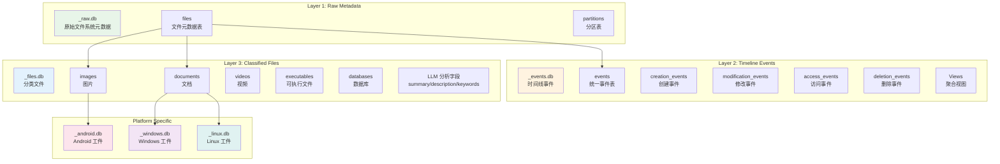
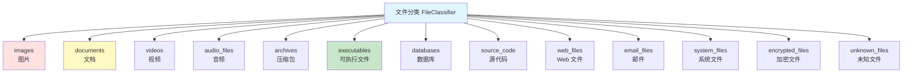
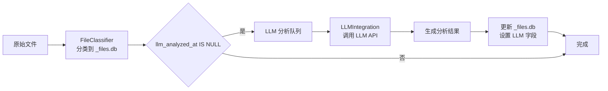

# 数据库模式设计

## 1. 概述

ForensicsProject 使用 **SQLite** 作为主要数据存储引擎，采用三层数据库架构设计，从原始文件系统元数据到结构化的取证分析结果，形成完整的数据链路。

### 核心设计理念

- **分层存储**：原始数据、事件、分类文件分开存储
- **模块化扩展**：平台特定分析（Android/Windows/Linux）独立数据库
- **LLM 集成**：所有文件表支持 LLM 分析字段
- **时间线导向**：所有数据包含时间戳，支持时间线重建
- **取证友好**：保留完整证据链（哈希、路径、时间戳）

---

## 2. 数据库架构

### 2.1 三层数据库设计



### 2.2 数据库文件命名规则

| 数据库类型 | 命名规则 | 示例 |
|-----------|---------|------|
| 原始数据库 | `{镜像名}_raw.db` | `evidence_E01_raw.db` |
| 事件数据库 | `{镜像名}_events.db` | `evidence_E01_events.db` |
| 文件数据库 | `{镜像名}_files.db` | `evidence_E01_files.db` |
| Android 数据库 | `{镜像名}_android.db` | `evidence_E01_android.db` |
| Windows 数据库 | `{镜像名}_windows.db` | `evidence_E01_windows.db` |
| Linux 数据库 | `{镜像名}_linux.db` | `evidence_E01_linux.db` |

---

## 3. _raw.db - 原始元数据数据库

### 3.1 核心表结构

#### files 表

```sql
CREATE TABLE IF NOT EXISTS files (
    id INTEGER PRIMARY KEY AUTOINCREMENT,
    inode INTEGER,                    -- inode 号
    name TEXT NOT NULL,               -- 文件名
    path TEXT NOT NULL,               -- 完整路径
    size INTEGER,                     -- 文件大小（字节）
    extension TEXT,                   -- 文件扩展名
    category TEXT,                    -- 文件分类（13 类）
    type TEXT,                        -- 文件类型
    mtime INTEGER,                    -- 修改时间（Unix 时间戳，毫秒）
    ctime INTEGER,                    -- 变更时间
    atime INTEGER,                    -- 访问时间
    crtime INTEGER,                   -- 创建时间
    is_deleted INTEGER DEFAULT 0,     -- 是否删除
    md5 TEXT,                        -- MD5 哈希

    -- LLM 分析字段
    llm_summary TEXT,                 -- 摘要
    llm_description TEXT,             -- 描述
    llm_keywords TEXT,                -- 关键词（逗号分隔）
    llm_analyzed_at INTEGER,          -- 分析时间
    llm_model_used TEXT               -- 使用的模型
);
```

**字段说明**：

| 字段 | 类型 | 说明 | 取值示例 |
|------|------|------|---------|
| `inode` | INTEGER | 文件系统 inode 号 | 12345 |
| `mtime` | INTEGER | 最后修改时间（毫秒） | 1705388400000 |
| `category` | TEXT | 文件分类 | documents, images, executables |
| `is_deleted` | INTEGER | 是否已删除 | 0 = 否, 1 = 是 |
| `llm_summary` | TEXT | LLM 生成的摘要 | "保密协议文档" |
| `llm_keywords` | TEXT | 关键词列表 | "保密,协议,合同" |

#### partitions 表

```sql
CREATE TABLE IF NOT EXISTS partitions (
    id INTEGER PRIMARY KEY AUTOINCREMENT,
    partition_number INTEGER,
    start_sector INTEGER,
    end_sector INTEGER,
    sector_count INTEGER,
    filesystem_type TEXT,
    volume_label TEXT,
    total_size INTEGER,
    used_size INTEGER
);
```

### 3.2 索引设计

```sql
-- 性能优化索引
CREATE INDEX IF NOT EXISTS idx_files_path ON files(path);
CREATE INDEX IF NOT EXISTS idx_files_inode ON files(inode);
CREATE INDEX IF NOT EXISTS idx_files_deleted ON files(is_deleted);
CREATE INDEX IF NOT EXISTS idx_files_category ON files(category);
CREATE INDEX IF NOT EXISTS idx_files_mtime ON files(mtime);
CREATE INDEX IF NOT EXISTS idx_files_extension ON files(extension);
```

---

## 4. _events.db - 时间线事件数据库

### 4.1 核心表结构

#### events 表（统一事件表）

```sql
CREATE TABLE IF NOT EXISTS events (
    id INTEGER PRIMARY KEY AUTOINCREMENT,
    timestamp INTEGER NOT NULL,       -- 事件时间（毫秒）
    event_type TEXT NOT NULL,         -- 事件类型
    file_path TEXT NOT NULL,          -- 文件路径
    inode INTEGER,                     -- inode 号
    description TEXT,                  -- 事件描述
    file_size INTEGER,                 -- 文件大小
    file_type TEXT                    -- 文件类型
);
```

**事件类型**：

| 事件类型 | 说明 | 触发条件 |
|---------|------|---------|
| `CREATED` | 文件创建 | `crtime > 0` 且 `crtime != mtime` |
| `MODIFIED` | 文件修改 | `mtime` 存在且与 `crtime` 不同 |
| `ACCESSED` | 文件访问 | `atime` 存在且与 `mtime` 不同 |
| `DELETED` | 文件删除 | `is_deleted = 1` |
| `CHANGED` | 元数据变更 | `ctime` 与 `mtime` 不同 |

#### 专用事件表

```sql
-- 创建事件
CREATE TABLE IF NOT EXISTS creation_events (
    id INTEGER PRIMARY KEY AUTOINCREMENT,
    timestamp INTEGER NOT NULL,
    file_path TEXT NOT NULL,
    inode INTEGER,
    file_size INTEGER,
    file_type TEXT
);

-- 修改事件
CREATE TABLE IF NOT EXISTS modification_events (
    id INTEGER PRIMARY KEY AUTOINCREMENT,
    timestamp INTEGER NOT NULL,
    file_path TEXT NOT NULL,
    inode INTEGER,
    file_size INTEGER,
    file_type TEXT
);

-- 访问事件
CREATE TABLE IF NOT EXISTS access_events (
    id INTEGER PRIMARY KEY AUTOINCREMENT,
    timestamp INTEGER NOT NULL,
    file_path TEXT NOT NULL,
    inode INTEGER,
    file_size INTEGER,
    file_type TEXT
);

-- 删除事件
CREATE TABLE IF NOT EXISTS deletion_events (
    id INTEGER PRIMARY KEY AUTOINCREMENT,
    timestamp INTEGER NOT NULL,
    file_path TEXT NOT NULL,
    inode INTEGER,
    file_size INTEGER,
    file_type TEXT
);
```

### 4.2 视图

#### timeline 视图

```sql
CREATE VIEW IF NOT EXISTS timeline AS
SELECT
    datetime(timestamp/1000, 'unixepoch') as event_time,
    event_type,
    file_path,
    inode,
    file_size,
    file_type,
    description
FROM events
ORDER BY timestamp DESC;
```

#### event_statistics 视图

```sql
CREATE VIEW IF NOT EXISTS event_statistics AS
SELECT
    event_type,
    COUNT(*) as event_count,
    MIN(timestamp) as first_event,
    MAX(timestamp) as last_event,
    datetime(MIN(timestamp)/1000, 'unixepoch') as first_event_time,
    datetime(MAX(timestamp)/1000, 'unixepoch') as last_event_time
FROM events
GROUP BY event_type;
```

#### hourly_activity 视图

```sql
CREATE VIEW IF NOT EXISTS hourly_activity AS
SELECT
    strftime('%Y-%m-%d %H:00:00', datetime(timestamp/1000, 'unixepoch')) as hour,
    event_type,
    COUNT(*) as event_count
FROM events
GROUP BY hour, event_type
ORDER BY hour DESC;
```

### 4.3 索引设计

```sql
-- 事件查询优化
CREATE INDEX IF NOT EXISTS idx_events_timestamp ON events(timestamp);
CREATE INDEX IF NOT EXISTS idx_events_type ON events(event_type);
CREATE INDEX IF NOT EXISTS idx_events_path ON events(file_path);
CREATE INDEX IF NOT EXISTS idx_events_inode ON events(inode);
```

---

## 5. _files.db - 分类文件数据库

### 5.1 文件分类体系

**13 类文件**：



### 5.2 分类表结构

所有分类表共享相同的结构模板：

```sql
-- 分类表模板
CREATE TABLE IF NOT EXISTS {category} (
    id INTEGER PRIMARY KEY AUTOINCREMENT,
    inode INTEGER,
    name TEXT,
    path TEXT,
    size INTEGER,
    extension TEXT,
    mtime INTEGER,
    ctime INTEGER,
    is_deleted INTEGER,
    md5 TEXT,

    -- LLM 分析字段
    llm_summary TEXT,
    llm_description TEXT,
    llm_keywords TEXT,
    llm_analyzed_at INTEGER,
    llm_model_used TEXT
);
```

**示例：documents 表**

```sql
CREATE TABLE IF NOT EXISTS documents (
    id INTEGER PRIMARY KEY AUTOINCREMENT,
    inode INTEGER,
    name TEXT,
    path TEXT,
    size INTEGER,
    extension TEXT,
    mtime INTEGER,
    ctime INTEGER,
    is_deleted INTEGER,
    md5 TEXT,
    llm_summary TEXT,
    llm_description TEXT,
    llm_keywords TEXT,
    llm_analyzed_at INTEGER,
    llm_model_used TEXT
);
```

### 5.3 扩展名映射

| 分类 | 扩展名 | 表名 |
|------|--------|------|
| **images** | .jpg, .jpeg, .png, .gif, .bmp, .tiff, .webp, .svg | images |
| **videos** | .mp4, .avi, .mkv, .mov, .wmv, .flv | videos |
| **audio_files** | .mp3, .wav, .aac, .flac, .ogg, .m4a | audio_files |
| **documents** | .pdf, .doc, .docx, .xls, .xlsx, .ppt, .pptx, .txt, .rtf | documents |
| **archives** | .zip, .tar, .gz, .7z, .rar, .bz2 | archives |
| **executables** | .exe, .dll, .so, .dylib, .app, .elf | executables |
| **databases** | .db, .sqlite, .sqlite3, .mdb, .accdb | databases |
| **source_code** | .c, .cpp, .h, .py, .js, .java, .go | source_code |
| **web_files** | .html, .htm, .css, .js, .php, .asp | web_files |
| **email_files** | .eml, .msg, .pst, .ost, .mbox | email_files |
| **system_files** | .sys, .dll, .ini, .cfg, .conf, .log | system_files |
| **encrypted_files** | .gpg, .pgp, .enc, .encrypted | encrypted_files |
| **unknown_files** | 其他扩展名 | unknown_files |

### 5.4 聚合视图

#### file_summary 视图

```sql
CREATE VIEW IF NOT EXISTS file_summary AS
SELECT
    'images' as category,
    COUNT(*) as count,
    SUM(size) as total_size,
    COUNT(CASE WHEN is_deleted = 1 THEN 1 END) as deleted_count
FROM images
UNION ALL
SELECT
    'documents' as category,
    COUNT(*) as count,
    SUM(size) as total_size,
    COUNT(CASE WHEN is_deleted = 1 THEN 1 END) as deleted_count
FROM documents
-- ... 其他 11 个分类
;
```

#### extension_statistics 视图

```sql
CREATE VIEW IF NOT EXISTS extension_statistics AS
SELECT
    extension,
    category,
    COUNT(*) as count,
    AVG(size) as avg_size,
    SUM(size) as total_size
FROM files
GROUP BY extension, category
ORDER BY count DESC;
```

---

## 6. _android.db - Android 工件数据库

### 6.1 核心表结构

#### sms_messages 表

```sql
CREATE TABLE IF NOT EXISTS sms_messages (
    id INTEGER PRIMARY KEY AUTOINCREMENT,
    thread_id INTEGER,               -- 会话 ID
    address TEXT,                    -- 电话号码
    person TEXT,                     -- 联系人姓名
    date INTEGER,                    -- 消息时间
    date_sent INTEGER,               -- 发送时间
    read INTEGER,                     -- 已读状态
    status INTEGER,                   -- 消息状态
    type INTEGER,                     -- 消息类型（1=收件, 2=发件）
    body TEXT,                       -- 短信内容
    service_center TEXT              -- 运营商
);
```

**消息类型**：
- `type = 1`：收件箱
- `type = 2`：已发送
- `type = 3`：草稿
- `type = 4`：发件箱
- `type = 5`：失败
- `type = 6`：排队

#### contacts 表

```sql
CREATE TABLE IF NOT EXISTS contacts (
    id INTEGER PRIMARY KEY AUTOINCREMENT,
    raw_contact_id INTEGER,
    display_name TEXT,
    phone_number TEXT,
    email TEXT,
    account_type TEXT,               -- 账户类型
    account_name TEXT                -- 账户名称
);
```

#### call_logs 表

```sql
CREATE TABLE IF NOT EXISTS call_logs (
    id INTEGER PRIMARY KEY AUTOINCREMENT,
    number TEXT,                     -- 电话号码
    date INTEGER,                    -- 通话时间
    duration INTEGER,                 -- 通话时长（秒）
    type INTEGER,                     -- 通话类型
    name TEXT,                       -- 联系人姓名
    geocoded_location TEXT           -- 地理位置
);
```

**通话类型**：
- `type = 1`：呼入
- `type = 2`：呼出
- `type = 3`：未接

#### installed_packages 表

```sql
CREATE TABLE IF NOT EXISTS installed_packages (
    id INTEGER PRIMARY KEY AUTOINCREMENT,
    package_name TEXT NOT NULL UNIQUE,
    code_path TEXT,
    native_library_path TEXT,
    first_install_time INTEGER,
    last_update_time INTEGER,
    version TEXT,
    installer TEXT
);
```

#### usage_stats 表

```sql
CREATE TABLE IF NOT EXISTS usage_stats (
    id INTEGER PRIMARY KEY AUTOINCREMENT,
    package_name TEXT,
    total_time_foreground INTEGER,   -- 前台使用时长（毫秒）
    last_time_used INTEGER,           -- 最后使用时间
    interval_start INTEGER            -- 统计间隔开始时间
);
```

### 6.2 Android 数据库路径映射

| 数据 | 典型路径 | 解析内容 |
|------|---------|---------|
| 通讯录 | `/data/data/com.android.providers.contacts/databases/contacts2.db` | contacts 表 |
| 短信/MMS | `/data/data/com.android.providers.telephony/databases/mmssms.db` | sms_messages 表 |
| 通话记录 | `/data/data/com.android.providers.contacts/databases/calllog.db` | call_logs 表 |
| 应用使用 | `/data/system/usagestats/` | usage_stats 表 |
| Chrome 历史 | `/data/data/com.android.chrome/app_chrome/Default/History` | chrome_history 表 |

---

## 7. _windows.db - Windows 工件数据库

### 7.1 核心表结构

#### registry_values 表

```sql
CREATE TABLE IF NOT EXISTS registry_values (
    id INTEGER PRIMARY KEY AUTOINCREMENT,
    hive_path TEXT,                   -- 配置单元文件路径
    hive_type TEXT,                   -- SAM/SYSTEM/SOFTWARE/NTUSER
    key_path TEXT,                    -- 注册表键路径
    value_name TEXT,                  -- 值名称
    value_type TEXT,                  -- 值类型
    value_data TEXT,                   -- 值数据
    last_modified INTEGER,             -- 最后修改时间
    forensic_importance TEXT          -- 取证重要性（HIGH/MEDIUM/LOW）
);
```

**配置单元类型**：
- `SAM`：用户账户数据库
- `SYSTEM`：系统配置
- `SOFTWARE`：软件配置
- `SECURITY`：安全策略
- `NTUSER.DAT`：用户配置

**值类型**：
- `REG_SZ`：字符串
- `REG_DWORD`：32 位整数
- `REG_QWORD`：64 位整数
- `REG_BINARY`：二进制数据
- `REG_MULTI_SZ`：多字符串
- `REG_EXPAND_SZ`：可扩展字符串

#### event_logs 表

```sql
CREATE TABLE IF NOT EXISTS event_logs (
    id INTEGER PRIMARY KEY AUTOINCREMENT,
    record_id INTEGER,                -- 记录 ID
    log_source TEXT,                  -- 日志来源
    event_id INTEGER,                 -- 事件 ID
    level TEXT,                       -- 日志级别
    timestamp INTEGER,                -- 事件时间
    source TEXT,                      -- 事件源
    message TEXT,                     -- 事件消息
    computer_name TEXT,               -- 计算机名
    user_sid TEXT,                    -- 用户 SID
    channel TEXT                      -- 事件通道
);
```

**关键事件 ID**：
- `4624`：账户登录成功
- `4625`：账户登录失败
- `4634`：账户注销
- `4720`：用户创建
- `4726`：用户删除
- `4728`：用户组成员变更

#### prefetch_files 表

```sql
CREATE TABLE IF NOT EXISTS prefetch_files (
    id INTEGER PRIMARY KEY AUTOINCREMENT,
    file_path TEXT,
    executable_name TEXT,
    executable_path TEXT,
    prefetch_hash TEXT,
    run_count INTEGER,                 -- 运行次数
    last_run_time INTEGER,            -- 最后运行时间
    creation_time INTEGER,
    referenced_files TEXT,            -- 引用的文件（JSON 数组）
    referenced_directories TEXT       -- 引用的目录（JSON 数组）
);
```

#### browser_history 表

```sql
CREATE TABLE IF NOT EXISTS browser_history (
    id INTEGER PRIMARY KEY AUTOINCREMENT,
    browser_name TEXT,                 -- 浏览器名称（chrome/edge/firefox）
    profile_name TEXT,
    url TEXT,
    title TEXT,
    visit_time INTEGER,                -- 访问时间（微秒）
    visit_duration INTEGER,            -- 停留时长（微秒）
    visit_count INTEGER,
    visit_type TEXT,
    is_redirect INTEGER,
    referrer TEXT
);
```

#### browser_downloads 表

```sql
CREATE TABLE IF NOT EXISTS browser_downloads (
    id INTEGER PRIMARY KEY AUTOINCREMENT,
    browser_name TEXT,
    profile_name TEXT,
    url TEXT,
    target_path TEXT,
    file_size INTEGER,
    start_time INTEGER,
    end_time INTEGER,
    danger_type INTEGER,                -- 危险文件类型
    mime_type TEXT,
    state TEXT                         -- 下载状态
);
```

---

## 8. 数据库关系图

### 8.1 整体 ER 图

```mermaid
erDiagram
    FILES ||--o{ EVENTS : generates
    FILES ||--o{ CLASSIFIED_FILES : categorizes
    FILES ||--o{ LLM_ANALYSIS : has

    EVENTS }o--|| EVENT_TYPES : has
    EVENTS ||--|| FILE_METADATA : references

    CLASSIFIED_FILES ||--o{ LLM_ANALYSIS : has
    CLASSIFIED_FILES ||--o{ ANDROID_ARTIFACTS : references
    CLASSIFIED_FILES ||--o{ WINDOWS_ARTIFACTS : references
    CLASSIFIED_FILES ||--o{ LINUX_ARTIFACTS : references

    FILES {
        inode INTEGER PK
        path TEXT
        name TEXT
        size INTEGER
        mtime INTEGER
        is_deleted INTEGER
    }

    EVENTS {
        id INTEGER PK
        timestamp INTEGER
        event_type TEXT
        file_path TEXT
        inode FK
    }

    CLASSIFIED_FILES {
        id INTEGER PK
        inode INTEGER
        category TEXT
        path TEXT
        llm_summary TEXT
    }

    LLM_ANALYSIS {
        file_id INTEGER FK
        summary TEXT
        description TEXT
        keywords TEXT
    }
```

### 8.2 跨数据库关联

虽然数据存储在多个数据库文件中，但通过 `inode` 和 `path` 字段可以跨库关联：

```sql
-- 跨数据库查询示例（需要 ATTACH DATABASE）
ATTACH DATABASE 'evidence_files.db' as files_db;

SELECT
    e.timestamp,
    e.event_type,
    f.name,
    f.size,
    f.category,
    f.llm_summary
FROM evidence_events.db.events e
JOIN files_db.documents f ON e.inode = f.inode
WHERE e.timestamp > 1704067200000
ORDER BY e.timestamp DESC;
```

---

## 9. LLM 集成字段

### 9.1 LLM 字段定义

所有文件表都包含以下 LLM 分析字段：

```sql
llm_summary TEXT,          -- 文件摘要（100-500 字）
llm_description TEXT,     -- 详细描述（500-2000 字）
llm_keywords TEXT,        -- 关键词（逗号分隔）
llm_analyzed_at INTEGER,  -- 分析完成时间（Unix 时间戳）
llm_model_used TEXT       -- 使用的 LLM 模型名称
```

### 9.2 LLM 分析工作流



### 9.3 LLM 数据示例

```json
{
  "llm_summary": "保密协议文档",
  "llm_description": "甲方与乙方的保密协议，规定了双方在合作期间的保密义务、保密信息的范围、违约责任等条款。",
  "llm_keywords": "保密,协议,合同,法律责任,违约责任",
  "llm_analyzed_at": 1705388400,
  "llm_model_used": "qwen2.5:7b"
}
```

---

## 10. 数据库优化

### 10.1 索引策略

**查询优化原则**：
- 为所有 `WHERE` 条件字段创建索引
- 为所有 `JOIN` 字段创建索引
- 为时间范围查询创建复合索引

**复合索引示例**：

```sql
-- 时间 + 类型复合索引
CREATE INDEX idx_events_timestamp_type ON events(timestamp, event_type);

-- 路径 + 删除状态复合索引
CREATE INDEX idx_files_path_deleted ON files(path, is_deleted);

-- 类别 + 时间复合索引
CREATE INDEX idx_docs_category_mtime ON documents(category, mtime);
```

### 10.2 WAL 模式

启用 WAL（Write-Ahead Logging）提升并发性能：

```cpp
// 在 DatabaseManager 中启用
sqlite3_exec(db, "PRAGMA journal_mode=WAL;", nullptr, nullptr);
sqlite3_exec(db, "PRAGMA synchronous=NORMAL;", nullptr, nullptr);
```

### 10.3 批量插入优化

使用事务批量插入提升性能：

```cpp
// 开始事务
sqlite3_exec(db, "BEGIN TRANSACTION;", nullptr, nullptr);

// 批量插入
for (const auto& file : files) {
    insert_file(db, file);
}

// 提交事务
sqlite3_exec(db, "COMMIT;", nullptr, nullptr);
```

---

## 11. 数据库迁移

### 11.1 版本控制

```sql
CREATE TABLE IF NOT EXISTS schema_version (
    version INTEGER PRIMARY KEY,
    applied_at INTEGER,
    description TEXT
);

-- 初始版本
INSERT INTO schema_version (version, applied_at, description)
VALUES (1, strftime('%s', 'now'), 'Initial schema');
```

### 11.2 迁移脚本

**添加 LLM 字段**：

```sql
-- v1 → v2 迁移
ALTER TABLE files ADD COLUMN llm_summary TEXT;
ALTER TABLE files ADD COLUMN llm_description TEXT;
ALTER TABLE files ADD COLUMN llm_keywords TEXT;
ALTER TABLE files ADD COLUMN llm_analyzed_at INTEGER;
ALTER TABLE files ADD COLUMN llm_model_used TEXT;

-- 更新版本
UPDATE schema_version SET version = 2, applied_at = strftime('%s', 'now');
```

---

## 12. 数据完整性

### 12.1 约束定义

```sql
-- 主键约束
PRIMARY KEY (id)

-- 唯一约束
UNIQUE (inode, path)  -- files 表
UNIQUE (package_name)  -- installed_packages 表

-- 外键约束（部分实现）
FOREIGN KEY (inode) REFERENCES files(inode)
```

### 12.2 触发器

```sql
-- 自动更新时间戳触发器
CREATE TRIGGER update_timestamp
AFTER UPDATE ON files
BEGIN
    UPDATE files SET ctime = strftime('%s', 'now') * 1000
    WHERE id = NEW.id;
END;
```

### 12.3 数据验证

**文件大小验证**：
```sql
-- 检查异常大小的文件
SELECT path, size
FROM files
WHERE size > 107374182400  -- 大于 100GB
   OR size < 0;
```

**时间戳验证**：
```sql
-- 检查时间戳异常
SELECT path, mtime, ctime
FROM files
WHERE mtime > ctime
   OR crtime > mtime;
```

---

## 13. 查询示例

### 13.1 常用查询

**查找最近修改的文档**：
```sql
SELECT name, path, size, mtime, llm_summary
FROM documents
WHERE mtime > 1704067200000
ORDER BY mtime DESC;
```

**查找可疑的大文件**：
```sql
SELECT name, path, size, category
FROM files
WHERE size > 104857600  -- 大于 100MB
  AND (path LIKE '%Temp%' OR path LIKE '%AppData%')
ORDER BY size DESC;
```

**时间线事件统计**：
```sql
SELECT
    datetime(timestamp/1000, 'unixepoch') as hour,
    event_type,
    COUNT(*) as count
FROM events
WHERE timestamp > 1704067200000
GROUP BY hour, event_type
ORDER BY hour DESC;
```

**跨库关联查询**：
```sql
ATTACH DATABASE 'evidence_files.db' as files_db;

SELECT
    e.timestamp,
    e.event_type,
    f.name,
    f.category,
    f.llm_summary
FROM events e
JOIN files_db.documents f ON e.inode = f.inode
WHERE e.event_type = 'DELETED'
  AND f.category = 'documents'
ORDER BY e.timestamp DESC;
```

---

## 相关文档

- **[数据流架构](./DataFlow.md)** - 数据在数据库间的流动
- **[DatabaseManager 模块](../modules/cpp/core/DatabaseManager.md)** - 数据库操作核心
- **[EventExtractor 模块](../modules/cpp/core/EventExtractor.md)** - 事件提取器
- **[FileClassifier 模块](../modules/cpp/core/FileClassifier.md)** - 文件分类引擎

---

**最后更新**: 2026-03-11
**维护者**: ymj68520
