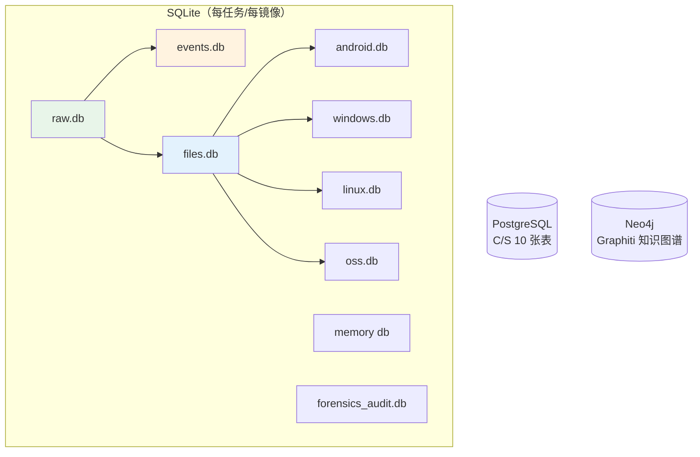
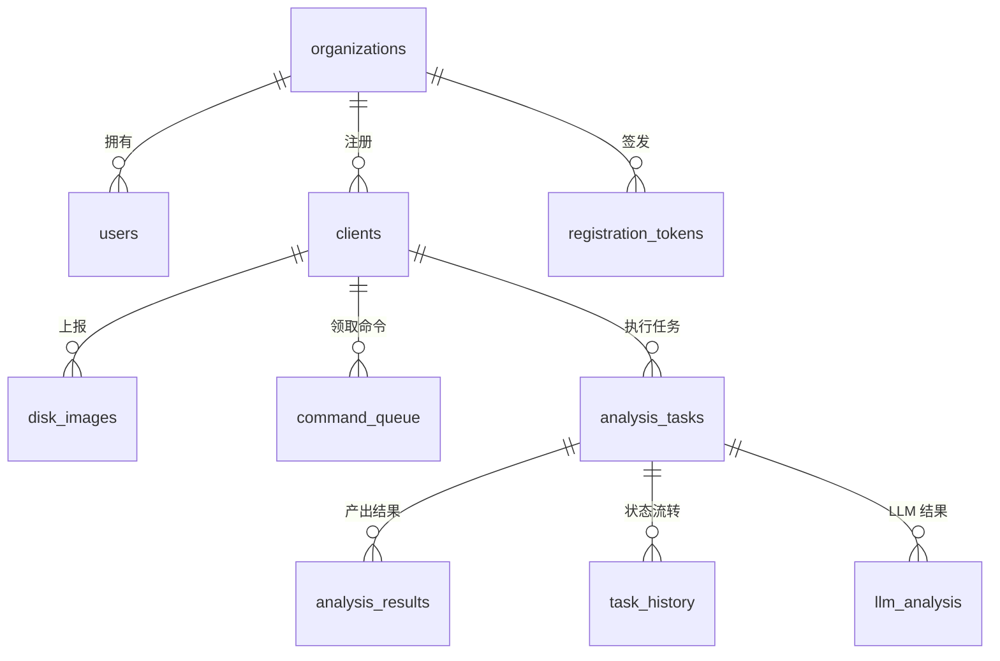

# 数据库模式设计

> 本文档是**参考手册**：所有表名均直接取自源码中的建表 SQL，每个库标注其 schema 定义位置。想理解"为什么分这么多库、谁在什么时候写它们"，先读下面两节，再按需查表。**注意：旧文档称文件分类为 13 类，实际代码为 24 张分类表**（`FileClassifier.cpp` 的 `FileCategory` 枚举）。

## 1. 先讲道理：这套 schema 的三个设计决定

**决定一：SQLite，每任务一组文件，而不是一个中心库。** 取证分析天然是"一镜像一世界"：任务之间没有共享数据，删除任务应当干净利落，并发分析不该互相锁库。每任务一个目录、一组 .db 文件，让隔离、清理、拷贝归档都退化成文件系统操作。代价是跨任务查询要靠上层（Python 案件分析、Neo4j 图谱）聚合——这正是它们的职责。

**决定二：库之间是派生关系，不是引用关系。** raw.db 是唯一事实来源；events.db / files.db / 各平台库都是从它（或它的下游）派生的"观点"。库与库之间**没有外键**，只靠 `inode`/`path`/`partition_num` 逻辑对齐——这让每层可以独立重建（重跑分类不必重新解析镜像），也让 schema 演进互不拖累。跨库查询用 `ATTACH DATABASE`（见第 10 节）。

**决定三：schema 就是代码（SQL-as-headers）。** 所有建表语句集中在 `src/core/DatabaseManager/SQL/` 的头文件里，以常量形式被分析器引用。改表结构必须过编译，schema 与消费代码不会漂移；想知道任何库长什么样，直接去对应头文件读，本文档只是它的导航。

理解这三条，下面的表清单就不是一盘散沙，而是一条派生链的分层快照：

```
raw.db（事实） ──► events.db（时间线观点）      ┐
              └─► files.db（分拣+LLM 观点） ──► android/windows/linux/oss.db（平台语义观点）
```

### 数据库产出位置

| 模式 | 位置 | 说明 |
|------|------|------|
| HTTP 任务 | `data/tasks/<task_id>/` | `raw.db`、`events.db`、`files.db`、`android.db`、`windows.db`、`linux.db`、`oss.db`（SERVER_CLOUD 场景的 linux_* 工件库，见第 8 节同名澄清；`PathManager.cpp getTaskDbPaths`） |
| CLI 模式 | 镜像同目录 | `<image>_raw.db`、`<image>_events.db`、`<image>_files.db`（平台工件并入 files.db）、`<image>_dll.db`（`--analyze-dlls`）、`<image>_memory.db`（`--memory-analyze`） |
| 审计 | `data/audit/forensics_audit.db` | `PathManager.h:73`；`AUDIT_LOG_DB` 可覆盖 |
| 任务状态 | `data/tasks.json` | TaskPersistence |
| C/S | PostgreSQL（`DATABASE_URL`） | 3 个迁移（`migrations/postgresql/`） |



---

## 2. raw.db — 原始元数据（事实层）

定义位置：`src/core/DatabaseManager/DatabaseManager.cpp`

设计意图：**忠实记录，不加观点**。ImageAnalyzer 把 TSK 看到的一切原样落库——它是唯一不可重建的库（重建等于重新解析镜像），也是所有下游阶段的输入和最终对质的依据。

| 表 | 用途 |
|----|------|
| `files` | 完整文件系统元数据（路径、大小、时间戳、删除标志、md5、`partition_num` 等） |
| `partitions` | 分区信息（起始/结束扇区、文件系统类型等） |

raw.db 是后续所有阶段的唯一输入源（事件提取、文件分类、场景检测均读它）。

---

## 3. events.db — 时间线事件（叙事层）

定义位置：`src/core/DatabaseManager/SQL/event_extractor_sql.h`

设计意图：把"每文件四个时间戳"的矩阵翻译成"某时刻发生了某事"的事件流。主表 + 五张按类型分表是查询优化（时间线页常按类型过滤），视图（`timeline`/`hourly_activity` 等）把常用聚合固化在库里，让路由层查询保持简单。

**表**：

| 表 | 用途 |
|----|------|
| `events` | 统一时间线事件主表 |
| `creation_events` / `modification_events` / `access_events` / `change_events` / `deletion_events` | 按事件类型分表 |
| `system_events` | 系统事件 |
| `event_correlations` | 事件关联表。注意：关联由 `EventCorrelationEngine` 生成，而该引擎当前**未接入任务流水线**（`EventExtractor::analyzeEventCorrelations()` 无生产调用方），生产任务中此表通常为空 |

**视图**：`timeline`、`event_statistics`、`hourly_activity`、`system_event_view`、`event_correlation_view`、`enhanced_timeline`、`enhanced_event_statistics`。

---

## 4. files.db — 文件分类与场景（分拣层）

定义位置：`src/core/DatabaseManager/SQL/file_classifier_sql.h`、`FileClassifier.cpp`、`LLMAnalysisService.cpp`

设计意图：回答"几十万个文件里哪些值得看"。分类是手段，场景优先级和 LLM 结论才是目的——所以 LLM 列和场景列放在**每行都在**的主 `files` 表上，而 24 张分类表只是按类别物化的查询副本（由统一模板创建）。Python 侧重分析/报告/图谱也都落回这张主表。

### 4.1 主表与辅助表

| 表 | 用途 |
|----|------|
| `files`（主表） | 全部文件分类结果。含 `category`、LLM 列（`llm_summary`/`llm_description`/`llm_keywords`/`llm_analyzed_at`/`llm_model_used`）、场景列（`scene_type`/`scene_priority`/`scene_relevant`）、`partition_num` |
| `analysis_progress` | LLM 分析进度（task_id、total/completed_files、status 等） |
| `file_descriptions` | LLM 文件描述结果（含 `is_relevant`，`LLMAnalysisService.cpp:399` 建表） |
| `android_artifacts` / `windows_artifacts` / `linux_artifacts` | 场景工件表（CLI 模式下平台工件并入 files.db；file_classifier_sql.h 含其索引与查询） |

**重要**：LLM 列与场景列**只在主 `files` 表**上；24 张分类表由统一模板创建（`CREATE_CATEGORY_TABLE_TEMPLATE`），仅含基础列 + `partition_num`，不含 LLM/场景列。

### 4.2 24 张分类表（`FileClassifier.cpp` `FileCategory` → 表名）

| 分类表 | 分类表 | 分类表 | 分类表 |
|--------|--------|--------|--------|
| `images` | `videos` | `audio_files` | `documents` |
| `archives` | `executables` | `databases` | `source_code` |
| `web_files` | `email_files` | `system_files` | `encrypted_files` |
| `os_config_files` | `os_boot_files` | `os_libraries` | `fs_journal` |
| `fs_metadata` | `log_files` | `cache_files` | `temp_files` |
| `backup_files` | `font_files` | `certificates` | `unknown_files` |

**视图**：`file_summary`、`extension_statistics`、`deleted_files`、`scene_file_summary`。

---

## 5. android.db — Android 工件（33 张表）

定义位置：`src/core/DatabaseManager/SQL/android_analysis_sql.h`

| 分组 | 表 |
|------|-----|
| 通信 | `sms_messages`、`contacts`、`call_logs`、`whatsapp_messages`、`telegram_messages` |
| 微信 | `wechat_messages`、`wechat_contacts`、`wechat_chatrooms`、`wechat_owner_info`、`wechat_artifact_inventory`、`wechat_kv_records`、`wechat_sqlite_records`、`wechat_log_events` |
| QQNT | `qqnt_artifact_inventory`、`qqnt_kv_records`、`qqnt_sqlite_records`、`qqnt_log_events` |
| 设备与系统 | `system_build_properties`、`system_apps`、`framework_files`、`system_logs`、`device_identifiers`、`wifi_networks`、`chrome_history` |
| 应用 | `installed_packages`、`installed_apps`、`usage_stats`、`app_database_files`、`app_notes`、`app_db_inventory` |
| 备份与加密 | `miui_backup_manifest`、`encrypted_db_inventory` |
| 进度 | `android_analysis_progress` |

微信库解密（SQLCipher）支持 `--wechat-password`、`--backup-password[-stdin|-fd]`（避免密码进入 argv，见 Security.md）。

---

## 6. windows.db — Windows 工件 + DLL 分析（32 张表）

定义位置：`src/core/DatabaseManager/SQL/windows_analysis_sql_tables.h`

| 分组 | 表 |
|------|-----|
| 注册表与账户 | `registry_values`、`user_accounts` |
| 事件与痕迹 | `event_logs`、`prefetch_files`、`lnk_files`、`jump_list_entries`、`amcache_entries`、`shimcache_entries`、`user_assist_entries`、`shell_bag_entries`、`mft_entries` |
| 浏览器 | `browser_history`、`browser_downloads`、`browser_bookmarks`、`browser_cookies`、`browser_logins`、`browser_artifacts` |
| 系统组件 | `windows_services`、`scheduled_tasks`、`srum_entries`、`usb_devices`、`recycle_bin`、`wifi_profiles`、`rdp_connections` |
| DLL 分析 | `dll_base_info`、`dll_sections`、`dll_imports`、`dll_exports`、`dll_anomalies`、`dll_dependencies`、`dll_forensic_links` |
| 进度 | `windows_analysis_progress` |

DLL 分析表同时用于 CLI 独立输出 `<image>_dll.db`（`--analyze-dlls` 系列参数）。

---

## 7. linux.db — Linux 工件（73 张表）

定义位置：`src/core/DatabaseManager/SQL/linux_analysis_sql_tables.h`（全部 `linux_` 前缀）

| 分组 | 表 |
|------|-----|
| 系统基础（12） | `linux_log_entries`、`linux_users`、`linux_groups`、`linux_login_records`、`linux_shell_history`、`linux_cron_jobs`、`linux_ssh_keys`、`linux_ssh_known_hosts`、`linux_packages`、`linux_network_connections`、`linux_systemd_services`、`linux_kernel_modules` |
| 安全与合规（19） | `linux_firewall_rules`、`linux_audit_logs`、`linux_audit_events`、`linux_tampering_findings`、`linux_setuid_files`、`linux_capabilities`、`linux_selinux_status`、`linux_selinux_avc_denials`、`linux_apparmor_profiles`、`linux_apparmor_violations`、`linux_security_bypass`、`linux_rule_matches`、`linux_account_security_findings`、`linux_ssh_security_findings`、`linux_database_security_findings`、`linux_email_security_findings`、`linux_vpn_security_findings`、`linux_security_product_findings`、`linux_container_security_findings` |
| 浏览器与桌面（8） | `linux_browser_profiles`、`linux_browser_history`、`linux_browser_cookies`、`linux_browser_downloads`、`linux_browser_bookmarks`、`linux_recent_documents`、`linux_trash_entries`、`linux_desktop_files` |
| 容器与云（7） | `linux_docker_containers`、`linux_docker_images`、`linux_docker_volumes`、`linux_podman_containers`、`linux_podman_pods`、`linux_container_logs`、`linux_cloud_logs` |
| Web 与中间件（7） | `linux_apache_access_logs`、`linux_apache_vhosts`、`linux_nginx_access_logs`、`linux_nginx_server_blocks`、`linux_web_error_logs`、`linux_middleware_logs`、`linux_modsecurity_logs` |
| 服务日志（8） | `linux_database_logs`、`linux_email_logs`、`linux_vpn_logs`、`linux_firewall_logs`、`linux_security_product_logs`、`linux_package_logs`、`linux_suspicious_packages`、`linux_journal_entries` |
| 时间线与关联（6） | `linux_correlated_events`、`linux_attack_chains`、`linux_timeline_events`、`linux_timeline_gaps`、`linux_anomalies`、`linux_journal_anomalies` |
| 持久化与外设（5） | `linux_persistence_entries`、`linux_boot_sessions`、`linux_usb_events`、`linux_mount_entries`、`linux_extended_history` |
| 进度（1） | `linux_analysis_progress` |

---

## 8. 其他 SQLite 库

| 库/表 | 定义位置 | 用途 |
|-------|---------|------|
| 内存分析库（`<image>_memory.db`）：`processes`、`network_connections`、`bash_history`、`boot_info`、`cmdline`、`analysis_meta` | `src/core/DatabaseManager/SQL/memory_analysis_sql_tables.h` | Volatility3 内存取证结果 |
| `oss_objects`、`oss_access_logs`、`oss_buckets`（+ 视图 `oss_objects_summary`、`oss_access_timeline`） | `src/core/DatabaseManager/SQL/oss_sql.h` | 阿里云 OSS 对象存储取证。注意：OSSAnalyzer 当前**无生产调用方**（消费路由未注册，仅单测调用），这些表不会在任务产出中出现；任务目录里的 `oss.db` 是 SERVER_CLOUD 场景由 LinuxFilesAnalyzer 写入的 `linux_*` 表族，与此同名不同物 |
| `event_chains`、`event_chain_nodes`、`causal_relationships` | `src/core/EventCorrelationEngine/Detail/EventCorrelationEngineCore.cpp` | 事件因果链分析（写入 events.db）。同 `event_correlations`：引擎未接入生产流水线，任务产出中通常为空 |
| `carved_files` | `src/analyzers/FileCarving/FileCarver.cpp:575` | 雕刻恢复文件记录 |
| `db_sessions`、`db_tables`、`db_records`、`db_artifacts`、`db_users` | `src/analyzers/DatabaseAnalyzer/Database/DBAnalysisDatabase.cpp` | 数据库取证。注意：DatabaseAnalyzer 当前无 CLI/流水线入口（仅单测调用），任务产出中不出现 |
| 审计日志（`forensics_audit.db`） | `src/core/AuditLog/` | 见 Security.md |

---

## 9. C/S PostgreSQL（server :8091）

迁移文件：`migrations/postgresql/001_initial_schema.sql`、`002_command_task_fk.sql`、`003_fix_super_admin_seed_credentials.sql`。



| 表 | 用途 |
|----|------|
| `organizations` | 多租户组织 |
| `users` | 服务端用户（JWT 登录） |
| `clients` | 注册的取证机代理（tracelens_agent） |
| `registration_tokens` | 客户端注册令牌 |
| `disk_images` | 代理上报的磁盘镜像 |
| `command_queue` | 下发给代理的命令队列 |
| `analysis_tasks` | 分析任务 |
| `analysis_results` | 任务结果工件 |
| `llm_analysis` | LLM 分析结果 |
| `task_history` | 任务状态历史 |

---

## 10. 跨库关联

各 SQLite 库之间通过 `inode`、`path`、`partition_num` 等字段逻辑关联（无外键约束）。查询时用 `ATTACH DATABASE`，例如：

```sql
ATTACH DATABASE 'data/tasks/<task_id>/files.db' AS f;
SELECT e.timestamp, e.event_type, f.name, f.category, f.llm_summary
FROM events e JOIN f.files f ON e.inode = f.inode
ORDER BY e.timestamp DESC;
```

Python 侧 `graphiti_integration/database_reader/` 以同样方式发现并读取这些库做图谱摄取。

---

## 相关文档

- **[数据流架构](./DataFlow.md)** - 各库由哪些流水线阶段产出
- **[架构总览](./Overview.md)** - 数据库分层与任务目录
- **[安全设计](./Security.md)** - 审计库与凭据处理

---

**最后更新**: 2026-08-23（解释式重写：开场补充三个设计决定，各库补设计意图；表清单以代码为准）
