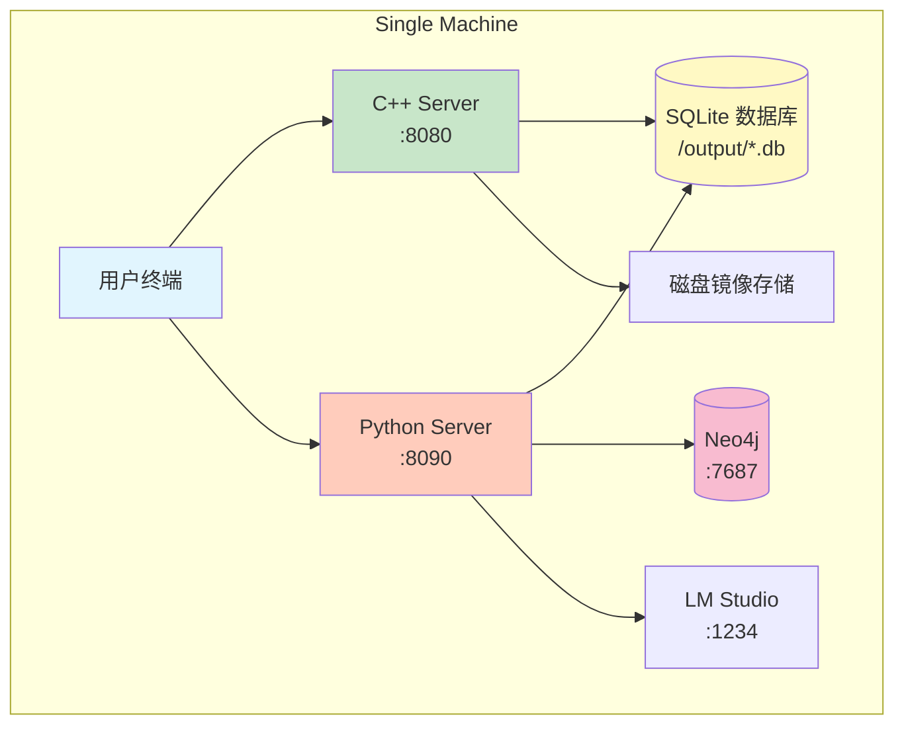

# 部署架构

## 1. 概述

本文档详细说明 ForensicsProject 的部署架构、部署选项、扩展性设计和运维管理。

---

## 2. 部署架构

### 2.1 单机部署

**适用场景**：
- 开发和测试环境
- 小规模取证分析
- 演示和培训

**架构图**：



**系统要求**：
- **CPU**：4 核心以上推荐
- **内存**：8GB 最低，16GB 推荐
- **磁盘**：SSD 推荐，至少 100GB 可用空间
- **操作系统**：Ubuntu 20.04+、Debian 11+、CentOS 7+

**部署步骤**：
```bash
# 1. 编译项目
mkdir build && cd build
cmake .. -DCMAKE_BUILD_TYPE=Release
cmake --build . -j$(nproc)

# 2. 启动 Neo4j（可选）
sudo systemctl start neo4j

# 3. 启动 LLM Studio（可选）
lm-studio &

# 4. 启动 C++ 服务
./build/forensic_analyzer --http-server 8080

# 5. 启动 Python 服务
cd python_service && python -m httpserver.main
```

### 2.2 分布式部署

**适用场景**：
- 生产环境
- 大规模分析任务
- 高可用性要求
- 多用户并发访问

**架构图**：



```mermaid
graph TB
    subgraph "负载均衡层"
        LB[Nginx/HAProxy<br/>:80/:443]
    end

    subgraph "应用层"
        CPP1[C++ Server 1<br/>:8080]
        CPP2[C++ Server 2<br/>:8081]
        PY1[Python Server 1<br/>:8090]
        PY2[Python Server 2<br/>:8091]
    end

    subgraph "存储层"
        SQLITE[(SQLite 文件存储<br/>NFS/GlusterFS)]
        NEO4J[(Neo4j 集群<br/>3 节点)]
        LLM[LLM 服务集群<br/>LM Studio/Ollama]
    end

    subgraph "存储层"
        FILES[磁盘镜像存储<br/>S3/MinIO]
        EXTRACT[提取文件存储<br/>NFS]
    end

    LB --> CPP1
    LB --> CPP2
    LB --> PY1
    LB --> PY2

    CPP1 --> SQLITE
    CPP2 --> SQLITE
    PY1 --> NEO4J
    PY2 --> NEO4J

    PY1 --> LLM
    PY2 --> LLM

    CPP1 --> FILES
    CPP2 --> FILES
    CPP1 --> EXTRACT
    CPP2 --> EXTRACT

    style LB fill:#37474f
    style CPP1 fill:#c8e6c9
    style CPP2 fill:#c8e6c9
    style PY1 fill:#ffccbc
    style PY2 fill:#ffccbc
```

**Nginx 配置示例**：

```nginx
upstream cpp_backend {
    least_conn;
    server 192.168.1.10:8080;
    server 192.168.1.11:8080;
    server 192.168.1.12:8080;
}

upstream python_backend {
    least_conn;
    server 192.168.1.20:8090;
    server 192.168.1.21:8090;
}

server {
    listen 80;
    server_name forensics.example.com;

    # C++ 服务
    location /api/forensics/ {
        proxy_pass http://cpp_backend;
        proxy_set_header Host $host;
        proxy_set_header X-Real-IP $remote_addr;
        proxy_set_header X-Forwarded-For $proxy_add_x_forwarded_for;
        proxy_connect_timeout 300s;
        proxy_read_timeout 300s;
    }

    # Python 服务
    location /api/graphiti/ {
        proxy_pass http://python_backend;
        proxy_set_header Host $host;
        proxy_set_header X-Real-IP $remote_addr;
        proxy_connect_timeout 300s;
        proxy_read_timeout 300s;
    }

    # LLM 分析
    location /api/llm/ {
        proxy_pass http://python_backend;
    }
}
```

### 2.3 Kubernetes 部署

**适用场景**：
- 云原生环境
- 容器化部署
- 自动扩缩容
- 多租户隔离

**部署架构图**：

```mermaid
graph TB
    subgraph "Kubernetes Cluster"
        INGRESS[Ingress Controller<br/>Nginx/Traefik]

        subgraph "Services"
            CPP_SVC[C++ Service<br/>3 Pods]
            PY_SVC[Python Service<br/>2 Pods]
        end

        subgraph "C++ Deployment"
            CPP_POD1[cpp-1]
            CPP_POD2[cpp-2]
            CPP_POD3[cpp-3]
        end

        subgraph "Python Deployment"
            PY_POD1[python-1]
            PY_POD2[python-2]
        end

        subgraph "StatefulSets"
            NEO4J[Neo4j<br/>StatefulSet]
        end

        subgraph "Volumes"
            PVC1[证据存储 PVC<br/>ReadWriteMany]
            PVC2[输出数据 PVC<br/>ReadWriteMany]
            PVC3[Neo4j 数据 PVC<br/>ReadWriteOnce]
        end

        INGRESS --> CPP_SVC
        INGRESS --> PY_SVC

        CPP_SVC --> CPP_POD1
        CPP_SVC --> CPP_POD2
        CPP_SVC --> CPP_POD3

        PY_SVC --> PY_POD1
        PY_SVC --> PY_POD2

        PY_POD1 --> NEO4J
        PY_POD2 --> NEO4J

        CPP_POD1 --> PVC1
        CPP_POD2 --> PVC1
        CPP_POD3 --> PVC1
        PY_POD1 --> PVC2
        PY_POD2 --> PVC2

        NEO4J --> PVC3
    end

    style INGRESS fill:#37474f
    style CPP_SVC fill:#c8e6c9
    style PY_SVC fill:#ffccbc
    style NEO4J fill:#f8bbd0
```



**Kubernetes 清单**：

```yaml
# cpp-deployment.yaml
apiVersion: apps/v1
kind: Deployment
metadata:
  name: cpp-server
  namespace: forensics
spec:
  replicas: 3
  selector:
    matchLabels:
      app: cpp-server
  template:
    metadata:
      labels:
        app: cpp-server
    spec:
      containers:
      - name: cpp-server
        image: forensics/cpp-server:latest
        ports:
        - containerPort: 8080
        env:
        - name: LOG_LEVEL
          value: "INFO"
        volumeMounts:
        - name: evidence-storage
          mountPath: /evidence
        - name: output-storage
          mountPath: /output
        resources:
          requests:
            memory: "2Gi"
            cpu: "1000m"
          limits:
            memory: "4Gi"
            cpu: "2000m"
        livenessProbe:
          httpGet:
            path: /api/health/live
            port: 8080
          initialDelaySeconds: 30
          periodSeconds: 10
        readinessProbe:
          httpGet:
            path: /api/health/ready
            port: 8080
          initialDelaySeconds: 10
          periodSeconds: 5
      volumes:
      - name: evidence-storage
        persistentVolumeClaim:
          claimName: evidence-pvc
      - name: output-storage
        persistentVolumeClaim:
          claimName: output-pvc
---
apiVersion: v1
kind: Service
metadata:
  name: cpp-server
  namespace: forensics
spec:
  selector:
    app: cpp-server
  ports:
  - port: 8080
    targetPort: 8080
  type: ClusterIP
---
apiVersion: v1
kind: PersistentVolumeClaim
metadata:
  name: evidence-pvc
  namespace: forensics
spec:
  accessModes: [ReadWriteMany]
  resources:
    requests:
      storage: 1Ti
  storageClassName: nfs-storage
```

---

## 3. 扩展性设计

### 3.1 水平扩展

**C++ 服务扩展**：
- 无状态设计，可无限水平扩展
- SQLite 数据库通过 NFS 共享
- 任务通过 TaskManager 调度

**扩展策略**：
```bash
# 增加 C++ 服务副本
kubectl scale deployment cpp-server --replicas=5

# 自动扩缩容
kubectl autoscale deployment cpp-server --min=2 --max=10 --cpu-percent=70
```

**Python 服务扩展**：
- 无状态设计，可水平扩展
- Neo4j 连接池管理
- 会话亲和性（如需要）

### 3.2 垂直扩展

**资源配置**：

| 组件 | 最小资源 | 推荐资源 | 最大资源 |
|------|---------|---------|---------|
| **C++ Server** | 2C/4G | 4C/8G | 8C/16G |
| **Python Server** | 1C/2G | 2C/4G | 4C/8G |
| **Neo4j** | 2C/4G | 4C/8G | 16C/32G |
| **LM Studio** | 4C/8G | 8C/16G | 16C/32G |

**性能调优**：
```cpp
// 增加线程池大小
size_t thread_pool_size = std::max(8, (int)std::thread::hardware_concurrency() * 2);

// 增加数据库连接池
size_t connection_pool_size = 8;
```

### 3.3 存储扩展

**共享存储方案**：

| 方案 | 优点 | 缺点 | 适用场景 |
|------|------|------|---------|
| **NFS** | 简单易用 | 性能较低 | 小规模部署 |
| **GlusterFS** | 高性能 | 配置复杂 | 中等规模 |
| **CephFS** | 高可用、可扩展 | 复杂度高 | 大规模部署 |
| **AWS EFS** | 托管服务 | 成本较高 | AWS 环境 |

**NFS 配置示例**：
```bash
# NFS 服务器
sudo apt-get install nfs-kernel-server
sudo mkdir /shared/forensics
sudo chmod 777 /shared/forensics

# /etc/exports
/shared/forensics *(rw,sync,no_subtree_check)

# NFS 客户端
sudo mount -t nfs nfs-server:/shared/forensics /mnt/forensics
```

---

## 4. 高可用性

### 4.1 服务冗余

**负载均衡健康检查**：

```nginx
upstream cpp_backend {
    server 192.168.1.10:8080 max_fails=3 fail_timeout=30s;
    server 192.168.1.11:8080 max_fails=3 fail_timeout=30s;
    server 192.168.1.12:8080 max_fails=3 fail_timeout=30s;
}
```

### 4.2 数据库高可用

**Neo4j 集群配置**：

```yaml
# docker-compose.yml
version: '3'
services:
  neo4j:
    image: neo4j:5.15-enterprise
    ports:
      - "7474:7474"
      - "7687:7687"
    environment:
      - NEO4J_dbms_mode=CORE
      - NEO4J_causal__clustering__discovery__type=LIST
      - NEO4J_causal__clustering__discovery__advertised__address=neo4j1:7687
      - NEO4J_causal__clustering__discovery__initial__discovery__members=neo4j1:7687,neo4j2:7687,neo4j3:7687
      - NEO4J_causal__clustering__discovery__expected__cluster_size=3
    volumes:
      - neo4j_data:/data
volumes:
  neo4j_data:
```

### 4.3 备份与恢复

**数据库备份脚本**：

```bash
#!/bin/bash
# backup.sh

BACKUP_DIR="/backup/forensics"
DATE=$(date +%Y%m%d_%H%M%S)

# 备份 SQLite 数据库
find /output -name "*.db" -exec cp {} "$BACKUP_DIR/sqlite/"_$DATE \;

# 备份 Neo4j
neo4j-admin backup --backup=/backup/neo4j/"$DATE" --from=single

# 备份用户提取文件
tar -czf "$BACKUP_DIR/extracted_"$DATE".tar.gz /extracted_files/

# 清理 30 天前的备份
find $BACKUP_DIR -mtime +30 -delete
```

---

## 5. 监控与告警

### 5.1 健康检查

**C++ 服务健康检查**：
```bash
# 存活探针
curl http://localhost:8080/api/health/live

# 就绪探针
curl http://localhost:8080/api/health/ready

# 依赖健康检查
curl http://localhost:8080/api/health/dependencies
```

**响应示例**：
```json
{
  "status": "healthy",
  "services": {
    "cpp_backend": {"status": "healthy"},
    "database": {"status": "healthy"},
    "task_manager": {"status": "healthy"}
  }
}
```

### 5.2 Prometheus 监控

**Prometheus 配置**：

```yaml
# prometheus.yml
global:
  scrape_interval: 15s

scrape_configs:
  - job_name: 'forensics-cpp'
    static_configs:
      - targets: ['localhost:8080']
    metrics_path: /metrics

  - job_name: 'forensics-python'
    static_configs:
      - targets: ['localhost:8090']
    metrics_path: /metrics
```

**关键指标**：
- `forensics_tasks_total`：总任务数
- `forensics_tasks_active`：活跃任务数
- `forensics_analysis_duration_seconds`：分析耗时
- `forensics_database_size_bytes`：数据库大小

### 5.3 日志聚合

**ELK Stack 集成**：

```yaml
# Filebeat 配置
filebeat.inputs:
- type: log
  enabled: true
  paths:
    - /var/log/forensics/cpp/*.log
    - /var/log/forensics/python/*.log

output.elasticsearch:
  hosts: ["localhost:9200"]
  index: "forensics-%{+yyyy.MM.dd}"
```

---

## 6. 安全加固

### 6.1 网络安全

**防火墙规则**：

```bash
# 只允许必要的端口
sudo ufw allow 80/tcp
sudo ufw allow 443/tcp
sudo ufw allow 8080/tcp
sudo ufw allow 8090/tcp
sudo ufw enable
```

**TLS/SSL 配置**：

```nginx
server {
    listen 443 ssl http2;
    server_name forensics.example.com;

    ssl_certificate /etc/letsencrypt/live/forensics.example.com/fullchain.pem;
    ssl_certificate_key /etc/letsencrypt/live/forensics.example.com/privkey.pem;

    ssl_protocols TLSv1.2 TLSv1.3;
    ssl_ciphers HIGH:!aNULL:!MD5;
    ssl_prefer_server_ciphers on;
}
```

### 6.2 访问控制

**API 认证**（待实现）：

```cpp
// JWT 认证中间件
bool authenticate_jwt(const crow::request& req) {
    std::string auth_header = req.get_header_value("Authorization");

    if (auth_header.substr(0, 7) == "Bearer ") {
        std::string token = auth_header.substr(7);
        return validate_jwt_token(token);
    }
    return false;
}
```

**API 密钥配置**：

```bash
# .env
CPP_API_KEY=your-api-key-here
PYTHON_API_KEY=your-api-key-here
```

### 6.3 审计日志

**完整审计日志**：

```json
{
  "timestamp": "2024-01-16T10:00:00Z",
  "user": "admin",
  "action": "TASK_CREATED",
  "resource": "task_abc123",
  "ip_address": "192.168.1.100",
  "user_agent": "Mozilla/5.0...",
  "result": "success"
}
```

---

## 7. 性能优化

### 7.1 缓存策略

**Redis 缓存层**（可选）：

```python
# Python 服务缓存
import redis

cache = redis.Redis(host='localhost', port=63799, decode_responses=True)

def get_task_results(task_id: str):
    # 先查缓存
    cached = cache.get(f"task:{task_id}:results")
    if cached:
        return json.loads(cached)

    # 缓存未命中，查询数据库
    results = query_database(task_id)
    cache.setex(f"task:{task_id}:results", 3600, json.dumps(results))
    return results
```

### 7.2 数据库优化

**连接池配置**：

```cpp
// 增加连接池大小
const int MAX_CONNECTIONS = 8;
const int CACHE_SIZE_KB = 64000;  // 64MB

// 配置 SQLite
sqlite3_exec(db, "PRAGMA cache_size=-64000;", nullptr, nullptr);
sqlite3_exec(db, "PRAGMA page_size=4096;", nullptr, nullptr);
sqlite3_exec(db, "PRAGMA journal_mode=WAL;", nullptr, nullptr);
```

### 7.3 异步处理

**任务队列优化**：

```cpp
// 任务优先级队列
class PriorityTaskQueue {
    std::priority_queue<
        Task,
        std::vector<Task>,
        TaskComparator
    > queue_;

    void enqueue(const Task& task) {
        queue_.push(task);
    }

    Task dequeue() {
        Task task = queue_.top();
        queue_.pop();
        return task;
    }
};
```

---

## 8. 容量规划

### 8.1 容量估算

**单任务分析资源消耗**：

| 镜像大小 | 分析时间 | CPU 使用 | 内存使用 | 磁盘 I/O |
|---------|---------|---------|---------|---------|
| 50GB | 30-60 分钟 | 200% | 4GB | 中等 |
| 100GB | 60-120 分钟 | 300% | 6GB | 中等 |
| 500GB | 4-8 小时 | 400% | 8GB | 高 |
| 1TB | 8-16 小时 | 400% | 12GB | 高 |

**并发处理能力**：
- **C++ 服务**：支持 5-10 个并发分析任务
- **Python 服务**：支持 50-100 个并发 API 请求

### 8.2 扩展建议

**小规模**（< 10 个分析任务/天）：
- 单机部署
- 2 个 C++ 服务实例
- 1 个 Python 服务实例
- 单节点 Neo4j

**中等规模**（10-50 个任务/天）：
- 3 个 C++ 服务实例
- 2 个 Python 服务实例
- 3 节点 Neo4j 集群

**大规模**（> 50 个任务/天）：
- 5+ 个 C++ 服务实例
- 3+ 个 Python 服务实例
- 5 节点 Neo4j 集群
- 分布式文件存储（GlusterFS/CephFS）

---

## 9. 灾难恢复

### 9.1 备份策略

**备份方案**：

| 备份类型 | 频率 | 保留期 | 存储位置 |
|---------|------|--------|---------|
| 数据库备份 | 每日 | 30 天 | 远程存储 |
| 配置备份 | 每周 | 永久 | 版本控制 |
| 镜像备份 | 按需 | 永久 | 冷存储 |

### 9.2 恢复流程

**服务恢复**：

```bash
# 1. 恢复数据库
cp /backup/latest/*.db /output/

# 2. 重启服务
sudo systemctl restart cpp-server
sudo systemctl restart python-server

# 3. 验证服务
curl http://localhost:8080/api/health
curl http://localhost:8090/health
```

**数据恢复**：

```bash
# 从备份恢复特定任务的数据
sqlite3 backup_evidence_files.db <<EOF
ATTACH DATABASE 'evidence_files.db';

-- 恢复文件记录
INSERT INTO evidence_files.main.files
SELECT * FROM backup_files.files
WHERE inode IN (SELECT inode FROM backup_files.files WHERE name LIKE '%.confidential%');
EOF
```

---

## 相关文档

- **[架构总览](./Overview.md)** - 系统整体架构
- **[安全设计](./Security.md)** - 安全架构和访问控制
- **[快速入门](../getting-started/QuickStart.md)** - 部署和首次使用

---

**最后更新**: 2026-03-11
**维护者**: ymj68520
