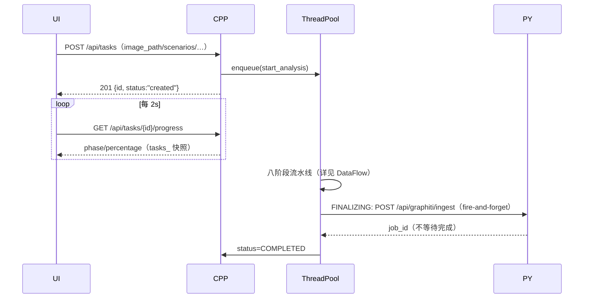
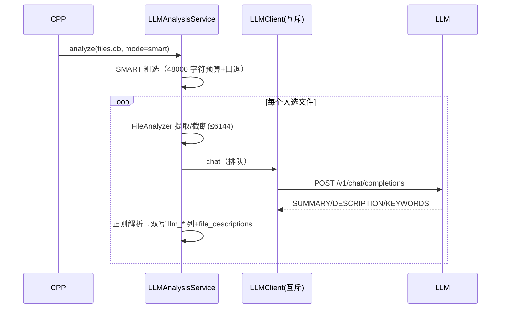
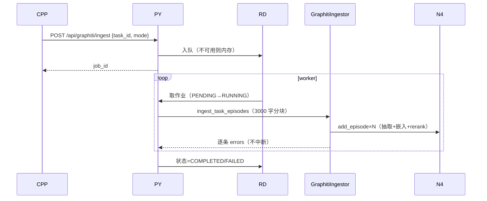
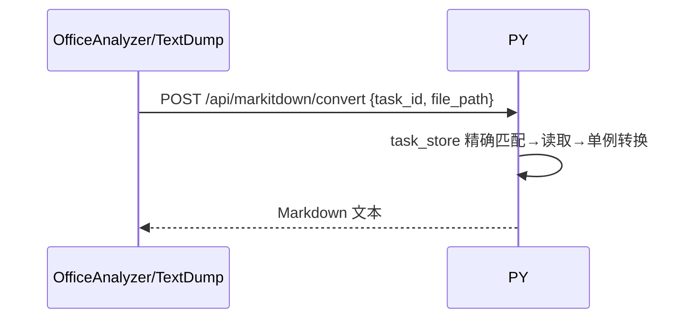

# 交互时序集

> 九个关键场景的端到端时序（谁调谁、带什么、失败怎样）。每图后附"逐站要点"表。组件缩写：UI=前端、CPP=C++ 服务、PY=Python 服务、CS=C/S、AG=agent、N4=Neo4j、LLM=LLM 端点、RD=Redis。

## 场景 1：创建任务并轮询到完成

| 站 | 要点 | 失败表现 |
|----|------|---------|
| 创建 | 字段小写；场景可空（自动检测） | 400 校验/镜像不可达即时失败 |
| 轮询 | 读 tasks_ 快照不阻塞分析 | 进度停→看门狗 30 分钟兜底 |
| 摄取触发 | try/catch 吞异常 | Python 挂时任务照样 completed |

## 场景 2：文件级 LLM 分析（smart 模式）

要点：LLMClient 互斥使循环实际串行（本地端点保护）；4xx 也重试（共 4 次尝试）；解析失败不重试只记日志。

## 场景 3：Graphiti 摄取作业全生命周期

要点：取消非抢占（RUNNING 完成会覆盖 CANCELLED）；episode 渲染走 text；llm_patch 必须先导入。

## 场景 4：调查工作台"分析→采纳→事件→报告"

| 步 | 调用 | 契约点 |
|----|------|--------|
| 1 提交分析 | POST /api/investigation/analyses | 202 + analysis_id 轮询 |
| 2 评审 | POST …/analyses/{id}/review | accept/reject 定终态 |
| 3 建事件 | POST /api/investigation/events | 证据键冻结语法 |
| 4 绑证据 | POST …/events/{id}/evidence | file:/cluster: 两种 |
| 5 刷新版本 | POST …/events/{id}/refresh | 新版本进版本链 |
| 6 报告证据 | PUT workbench report-evidence | 只接受已采纳分析 |
| 7 生成报告 | POST /api/reports/generate | 202+input_hash 幂等 |
| 8 发布 | POST …/final-reports/{id}/publish | 带完整性哈希 |

固定 409 的端点见 Investigation 路由文档（契约边界非故障）。

## 场景 5：markitdown 转换（C++ 发起）

要点：task_id 门控（fail-closed）；批量走 batch-convert（Semaphore 4、防自毁检查）；C++ 侧白名单先行（.img/.dd 会令 Python 500 的教训）。

## 场景 6：C/S 一次 analyze_disk 全程

| 步 | 实体 | 动作/端点 |
|----|------|----------|
| 1 | 管理员 | POST /api/auth/login → JWT(user) |
| 2 | 管理员 | POST /api/organizations/{id}/registration-tokens |
| 3 | AG | POST /api/clients/register（令牌）→ JWT(client,30d) |
| 4 | AG | GET /api/commands/poll → analyze_disk |
| 5 | AG | 本地 forensic_analyzer（--db-dir/--no-ai/--overwrite+平台旗标） |
| 6 | AG | POST /api/tasks/{id}/results（先验后写） |
| 7 | AG | 状态上报；server 更新 tasks/history |

要点：仅 analyze_disk 真执行；retry_count 无消费；TTL 靠 expire 端点。

## 场景 7：前端知识图谱检索

UI→PY：POST /api/graphiti/search {task_id, query}→PY 调 Graphiti 混合检索（RRF）→失败退化 Neo4j CONTAINS→结果三段（实体/关系/episode）→前端 force-graph 渲染。任务图谱删除后再检索=空集（隔离性验证手段）。

## 场景 8：全文检索

UI→CPP：GET /api/search/fulltext?q&index→围栏校验→Xapian 解析（布尔/通配符/短语/path:/ext:）→mset 分页→JSON（手拼，路径含引号的已知坑）。

## 场景 9：报告生成幂等重放

两次同 envelope 的 POST /generate → 第二次命中 input_hash→返回同一 generation（不重跑）→适合"重试按钮"场景；改任何输入字段=新 hash=真重跑。

---

## 10. 调试每条时序的观察点

| 时序 | C++日志 | Python日志 | 审计/DB | 前端可见 |
|---|---|---|---|---|
| 创建任务 | create/start | cpp backend request | task created | tasks table |
| 阶段推进 | phase message | — | progress snapshot | progress bar |
| LLM 文件 | model/request | — | files llm_* | files page |
| Graphiti | trigger/job id | worker/episode errors | GRAPHITI_INGESTION | graph page |
| 报告 | export/generation | generation executor | input_hash | report workspace |
| 调查 | — | analysis/review | v7 store | workbench |
| C/S poll | agent client | command status | queue/history | distributed page |

## 11. 契约失败的定位顺序

1. **字段没被读**：检查请求模型/handler JSON key；
2. **状态没终止**：检查大小写与终态集合；
3. **数据有但页面空**：检查 axios client 是否走对服务与 vite 前缀；
4. **数据库有表没行**：检查生产调用方是否存在，不要只看 DDL；
5. **任务成功图谱空**：检查 fire-and-forget job，而不是重跑分析；
6. **报告生成重复**：对比 input_hash 与 envelope；
7. **删除后又写**：抓删除时间、worker 日志与 D4b guard。
**最后更新**: 2026-08-24（新建：交互时序集）
