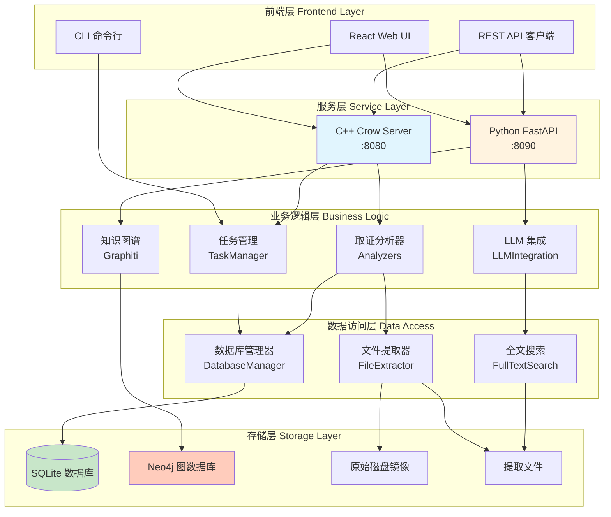
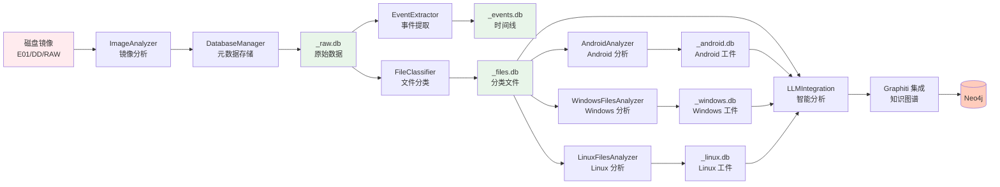
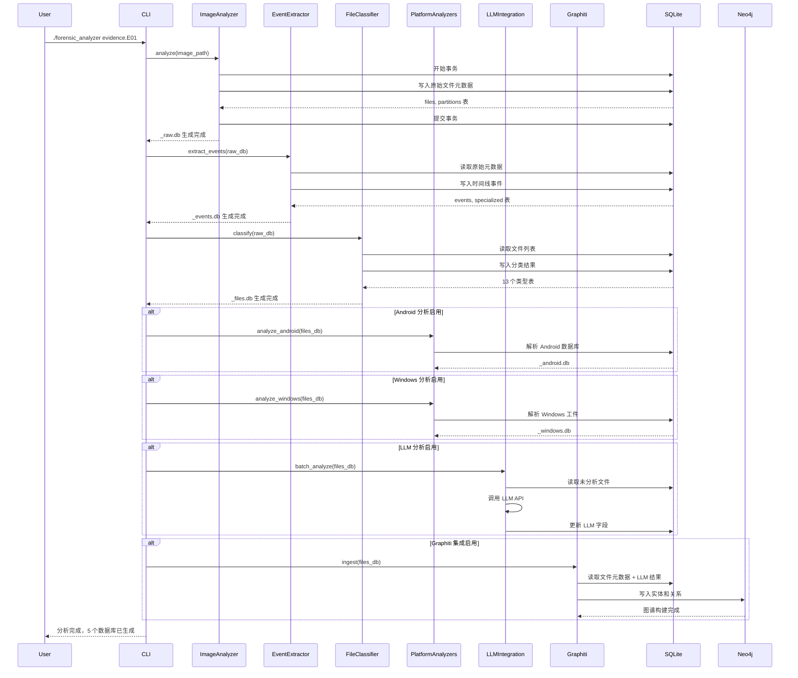
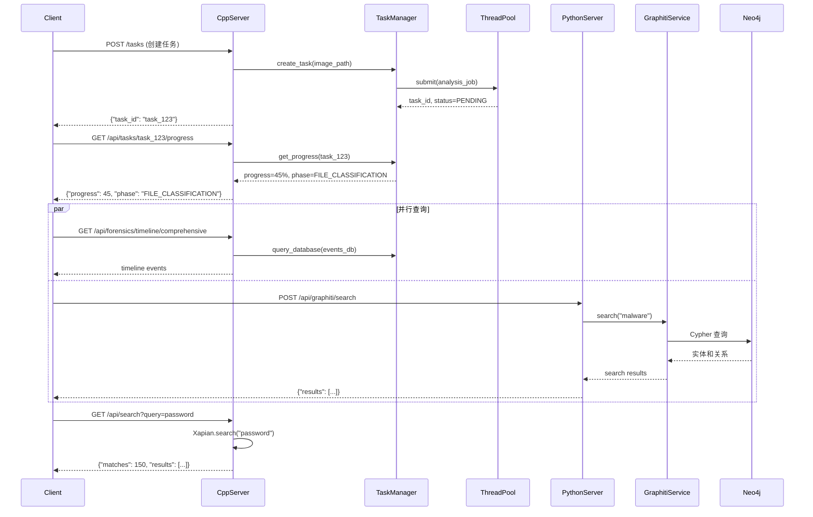
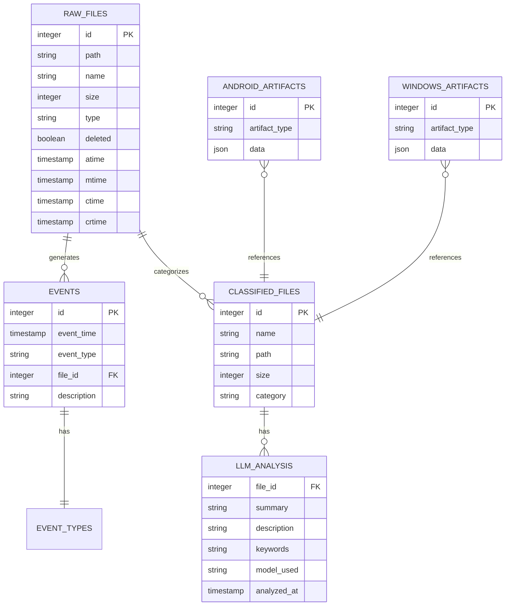
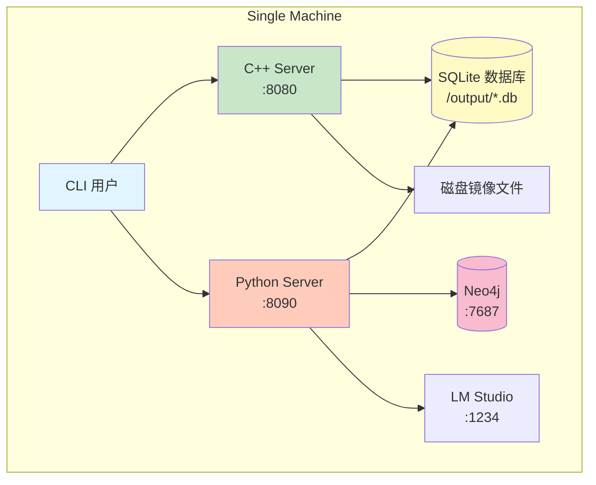

# 项目架构总览

## 1. 系统概述

ForensicsProject 是一个**数字取证磁盘镜像分析工具**，使用现代 C++20 构建，基于 The Sleuth Kit (TSK) 4.14.0，支持多种磁盘镜像格式和跨平台文件系统分析。

### 核心价值

- **全面取证能力**：支持 Android、Windows、Linux 平台取证分析
- **高性能处理**：C++20 核心引擎 + 多线程并行处理
- **智能分析**：LLM 驱动的文件分析和知识图谱集成
- **灵活输出**：多种数据库格式 + TOON 导出优化 LLM 提示
- **双服务架构**：C++ 高性能服务 + Python 可扩展服务

### 技术栈

**C++ 后端**：
- C++20 标准、GCC 11.4.0+ / Clang 13+
- The Sleuth Kit 4.14.0（磁盘镜像分析）
- SQLite 3.x（元数据存储）
- Xapian（全文搜索）
- Crow 框架（HTTP 服务器）

**Python 服务**：
- Python 3.10+
- FastAPI（HTTP 服务器）
- Graphiti + Neo4j（知识图谱）
- httpx（异步 HTTP 客户端）
- OpenAI API 兼容客户端（LLM 集成）

**数据库**：
- SQLite 3.x（事务型元数据存储）
- Neo4j 5.x（知识图谱后端）

**外部集成**：
- OpenAI 兼容 API（LM Studio、本地模型）
- POPPLER（PDF 解析）
- libolecf（Office 文档）

---

## 2. 整体架构

### 系统分层架构



### 核心管道架构



---

## 3. 模块架构

### 核心模块依赖图

```mermaid
graph TD
    A[main.cpp<br/>主程序] --> B[ImageAnalyzer<br/>镜像分析]

    A --> C[EventExtractor<br/>事件提取]
    A --> D[FileClassifier<br/>文件分类]
    A --> E[AndroidAnalyzer<br/>Android 分析]
    A --> F[WindowsFilesAnalyzer<br/>Windows 分析]
    A --> G[LinuxFilesAnalyzer<br/>Linux 分析]

    B --> H[DatabaseManager<br/>数据库管理]
    C --> H
    D --> H
    E --> H
    F --> H
    G --> H

    H --> I[SQLiteHelper<br/>SQLite 助手]

    A --> J[HTTPServer<br/>HTTP 服务器]
    J --> K[TaskManager<br/>任务管理]
    J --> L[TaskRoutes<br/>任务路由]
    J --> M[ForensicsRoutes<br/>取证路由]
    J --> N[SearchRoutes<br/>搜索路由]
    J --> O[SystemRoutes<br/>系统路由]

    A --> P[FullTextSearch<br/>全文搜索]
    A --> Q[FileCarving<br/>文件雕刻]
    A --> R[LLMIntegration<br/>LLM 集成]

    style A fill:#37474f
    style H fill:#1976d2
    style J fill:#388e3c
```



### 模块职责划分

| 模块类别 | 模块名称 | 核心职责 | 依赖 |
|---------|---------|---------|------|
| **分析器** | ImageAnalyzer | 磁盘镜像解析、文件系统遍历 | TSK, DatabaseManager |
| **分析器** | EventExtractor | 从元数据生成时间线事件 | DatabaseManager |
| **分析器** | FileClassifier | 按类型分类文件（13 类） | DatabaseManager |
| **分析器** | AndroidAnalyzer | Android 数据库解析 | DatabaseManager |
| **分析器** | WindowsFilesAnalyzer | Windows 注册表、事件日志、工件解析 | DatabaseManager |
| **分析器** | LinuxFilesAnalyzer | Linux 日志、用户数据解析 | DatabaseManager |
| **分析器** | FileCarving | 从未分配空间恢复删除文件 | DatabaseManager |
| **基础设施** | DatabaseManager | SQLite 数据库操作和模式管理 | SQLite3 |
| **基础设施** | FullTextSearch | Xapian 全文索引和搜索 | Xapian |
| **基础设施** | TOONExporter | TOON 格式导出（LLM 优化） | DatabaseManager |
| **基础设施** | Logger | 日志系统 | - |
| **基础设施** | ThreadPool | 线程池并行执行 | - |
| **基础设施** | AuditLog | 审计日志 | DatabaseManager |
| **网络** | HTTPServer | Crow HTTP 服务器核心 | Crow, TaskManager |
| **网络** | TaskManager | 异步任务生命周期管理 | HTTPServer, ThreadPool |
| **网络** | TaskRoutes | 任务管理 REST API | TaskManager |
| **网络** | ForensicsRoutes | 取证分析 REST API | DatabaseManager |
| **网络** | SearchRoutes | 全文搜索 REST API | FullTextSearch |
| **网络** | SystemRoutes | 系统监控 REST API | TaskManager |
| **集成** | LLMIntegration | OpenAI 兼容 API 客户端 | httpx (via MCP) |
| **集成** | ModelRouter | 多模型路由和负载均衡 | LLMIntegration |

---

## 4. 数据流架构

### 取证分析数据流



### HTTP 服务请求流



---

## 5. 数据库架构

### 三层数据库设计

```mermaid
graph TB
    subgraph "Layer 1: Raw Metadata"
        A[_raw.db<br/>原始文件系统元数据]
        A1[files<br/>文件元数据表]
        A2[partitions<br/>分区表]
    end

    subgraph "Layer 2: Timeline Events"
        B[_events.db<br/>时间线事件]
        B1[events<br/>统一事件表]
        B2[creation_events<br/>创建事件]
        B3[modification_events<br/>修改事件]
        B4[access_events<br/>访问事件]
        B5[change_events<br/>变更事件]
        B6[deletion_events<br/>删除事件]
        B7[Views<br/>聚合视图]
    end

    subgraph "Layer 3: Classified Files"
        C[_files.db<br/>分类文件]
        C1[images<br/>图片]
        C2[videos<br/>视频]
        C3[audio_files<br/>音频]
        C4[documents<br/>文档]
        C5[archives<br/>压缩包]
        C6[executables<br/>可执行文件]
        C7[databases<br/>数据库]
        C8[source_code<br/>源代码]
        C9[web_files<br/>Web 文件]
        C10[email_files<br/>邮件]
        C11[system_files<br/>系统文件]
        C12[encrypted_files<br/>加密文件]
        C13[unknown_files<br/>未知文件]
        C14[LLM 分析字段<br/>llm_summary/description/keywords]
    end

    subgraph "Platform Specific"
        D[_android.db<br/>Android 工件]
        D1[sms<br/>短信]
        D2[contacts<br/>联系人]
        D3[call_logs<br/>通话记录]
        D4[app_usage<br/>应用使用]
        D5[device_info<br/>设备信息]

        E[_windows.db<br/>Windows 工件]
        E1[registry_keys<br/>注册表键]
        E2[event_logs<br/>事件日志]
        E3[browser_history<br/>浏览器历史]
        E4[prefetch<br/>预读取]
        E5[srum_data<br/>SRUM 数据]

        F[_linux.db<br/>Linux 工件]
        F1[system_logs<br/>系统日志]
        F2[user_accounts<br/>用户账户]
        F3[shell_history<br/>Shell 历史]
        F4[auth_data<br/>认证数据]
    end

    A1 --> B1
    A1 --> C1
    A1 --> C2
    A1 --> C3
    A1 --> C4
    A1 --> C5
    A1 --> C6
    A1 --> C7
    A1 --> C8
    A1 --> C9
    A1 --> C10
    A1 --> C11
    C4 --> D
    C11 --> E
    C11 --> F

    style A fill:#e8f5e9
    style B fill:#fff3e0
    style C fill:#e3f2fd
    style D fill:#fce4ec
    style E fill:#f3e5f5
    style F fill:#e0f2f1
```



### 数据库关系图



---

## 6. 部署架构

### 单机部署



### 分布式部署

```mermaid
graph TB
    subgraph "负载均衡层"
        LB[Nginx / HAProxy]
    end

    subgraph "应用层"
        CPP1[C++ Server 1<br/>:8080]
        CPP2[C++ Server 2<br/>:8081]
        PY1[Python Server 1<br/>:8090]
        PY2[Python Server 2<br/>:8091]
    end

    subgraph "数据层"
        SQLITE[(SQLite 文件存储<br/>NFS)]
        NEO4J[(Neo4j 集群)]
        LLM[LLM 服务集群<br/>LM Studio]
    end

    subgraph "存储层"
        FILES[磁盘镜像存储<br/>S3/MinIO]
        EXTRACTED[提取文件存储<br/>NFS]
    end

    LB --> CPP1
    LB --> CPP2
    LB --> PY1
    LB --> PY2

    CPP1 --> SQLITE
    CPP2 --> SQLITE
    CPP1 --> FILES
    CPP2 --> FILES

    PY1 --> NEO4J
    PY2 --> NEO4J
    PY1 --> SQLITE
    PY2 --> SQLITE

    PY1 --> LLM
    PY2 --> LLM

    CPP1 --> EXTRACTED
    CPP2 --> EXTRACTED

    style LB fill:#37474f
    style CPP1 fill:#c8e6c9
    style CPP2 fill:#c8e6c9
    style PY1 fill:#ffccbc
    style PY2 fill:#ffccbc
```



### Kubernetes 部署

```yaml
# 典型的 Kubernetes 部署架构
apiVersion: v1
kind: Namespace
metadata:
  name: forensics

---
# C++ Server Deployment
apiVersion: apps/v1
kind: Deployment
metadata:
  name: cpp-server
  namespace: forensics
spec:
  replicas: 3
  selector:
    matchLabels:
      app: cpp-server
  template:
    metadata:
      labels:
        app: cpp-server
    spec:
      containers:
      - name: cpp-server
        image: forensics/cpp-server:latest
        ports:
        - containerPort: 8080
        env:
        - name: LOG_LEVEL
          value: "INFO"
        volumeMounts:
        - name: evidence-storage
          mountPath: /evidence
        - name: output-storage
          mountPath: /output
        livenessProbe:
          httpGet:
            path: /api/health/live
            port: 8080
          initialDelaySeconds: 30
          periodSeconds: 10
        readinessProbe:
          httpGet:
            path: /api/health/ready
            port: 8080
          initialDelaySeconds: 5
          periodSeconds: 5
      volumes:
      - name: evidence-storage
        persistentVolumeClaim:
          claimName: evidence-pvc
      - name: output-storage
        persistentVolumeClaim:
          claimName: output-pvc

---
# Python Server Deployment
apiVersion: apps/v1
kind: Deployment
metadata:
  name: python-server
  namespace: forensics
spec:
  replicas: 2
  selector:
    matchLabels:
      app: python-server
  template:
    metadata:
      labels:
        app: python-server
    spec:
      containers:
      - name: python-server
        image: forensics/python-server:latest
        ports:
        - containerPort: 8090
        env:
        - name: CPP_BACKEND_URL
          value: "http://cpp-server:8080"
        - name: NEO4J_URI
          valueFrom:
            secretKeyRef:
              name: neo4j-credentials
              key: uri
        readinessProbe:
          httpGet:
            path: /health/ready
            port: 8090
          initialDelaySeconds: 5
          periodSeconds: 5

---
# Neo4j StatefulSet
apiVersion: apps/v1
kind: StatefulSet
metadata:
  name: neo4j
  namespace: forensics
spec:
  serviceName: neo4j
  replicas: 1
  selector:
    matchLabels:
      app: neo4j
  template:
    metadata:
      labels:
        app: neo4j
    spec:
      containers:
      - name: neo4j
        image: neo4j:5.15-enterprise
        ports:
        - containerPort: 7474
        - containerPort: 7687
        env:
        - name: NEO4J_AUTH
          value: "neo4j/password"
        volumeMounts:
        - name: neo4j-data
          mountPath: /data
  volumeClaimTemplates:
  - metadata:
      name: neo4j-data
    spec:
      accessModes: [ "ReadWriteOnce" ]
      resources:
        requests:
          storage: 10Gi

---
# Services
apiVersion: v1
kind: Service
metadata:
  name: cpp-server
  namespace: forensics
spec:
  selector:
    app: cpp-server
  ports:
  - port: 8080
    targetPort: 8080
  type: ClusterIP

---
apiVersion: v1
kind: Service
metadata:
  name: python-server
  namespace: forensics
spec:
  selector:
    app: python-server
  ports:
  - port: 8090
    targetPort: 8090
  type: ClusterIP

---
apiVersion: v1
kind: Service
metadata:
  name: neo4j
  namespace: forensics
spec:
  selector:
    app: neo4j
  ports:
  - name: http
    port: 7474
    targetPort: 7474
  - name: bolt
    port: 7687
    targetPort: 7687
  clusterIP: None
```

---

## 7. 扩展性设计

### 水平扩展

**C++ 服务扩展**：
- 无状态设计，可无限水平扩展
- SQLite 数据库通过 NFS 共享
- 负载均衡器分发请求

**Python 服务扩展**：
- 无状态设计，可水平扩展
- Neo4j 通过 bolt:// 协议访问
- 连接池管理数据库连接

### 垂直扩展

**资源优化**：
- 线程池大小可配置（默认：硬件并发数）
- 数据库连接池大小可配置
- HTTP 服务器并发连接数可配置

**性能调优参数**：
```cpp
// ThreadPool
size_t thread_pool_size = std::thread::hardware_concurrency();

// DatabaseManager
size_t connection_pool_size = 4; // 每个 SQLite 连接池大小
size_t max_connections = 16;     // 最大连接数

// HTTPServer
int server_threads = 8;          // Crow 服务器线程数
```

### 插件化架构

**分析器扩展**：
```cpp
// 新分析器接口
class IAnalyzer {
public:
    virtual void analyze(const std::string& image_path,
                       const std::string& output_db) = 0;
    virtual std::string getName() const = 0;
};

// 注册新分析器
class CustomAnalyzer : public IAnalyzer {
public:
    void analyze(const std::string& image_path,
                const std::string& output_db) override {
        // 自定义分析逻辑
    }

    std::string getName() const override {
        return "CustomAnalyzer";
    }
};

// 在 main.cpp 中注册
// analyzer_registry.register<CustomAnalyzer>();
```

**Python 服务扩展**：
```python
# 新服务接口
class BaseService:
    def initialize(self):
        raise NotImplementedError

    async def health_check(self) -> bool:
        raise NotImplementedError

    async def shutdown(self):
        raise NotImplementedError

# 注册新服务
class CustomService(BaseService):
    async def initialize(self):
        # 初始化逻辑
        pass

# 在 service_manager.py 中注册
# self._custom_service = CustomService(self.settings)
```

---

## 8. 安全架构

### 数据完整性

**校验和验证**：
- 文件提取时计算 MD5/SHA256 哈希
- 数据库事务保证 ACID 特性
- 审计日志记录所有操作

**证据链**：
```json
{
  "chain_of_custody": {
    "evidence_id": "EVID-001",
    "acquired_at": "2024-01-15T10:00:00Z",
    "acquired_by": "Officer Smith",
    "hash": "a1b2c3d4...",
    "analysis_started_at": "2024-01-15T11:00:00Z",
    "analysis_completed_at": "2024-01-15T12:00:00Z",
    "analyst": "Dr. Forensics",
    "audit_log": "/output/audit.log"
  }
}
```

### 访问控制

**认证机制（待实现）**：
- JWT Token 认证
- API Key 认证
- OAuth 2.0 集成

**授权模型**：
```cpp
enum class Permission {
    READ_EVIDENCE,
    WRITE_EVIDENCE,
    DELETE_EVIDENCE,
    ANALYZE_EVIDENCE,
    EXPORT_RESULTS,
    MANAGE_TASKS
};

struct User {
    std::string username;
    std::vector<Permission> permissions;
};
```

### 审计日志

**日志级别**：
- `DEBUG` - 调试信息
- `INFO` - 一般信息
- `WARNING` - 警告信息
- `ERROR` - 错误信息
- `AUDIT` - 审计信息（所有关键操作）

**审计事件**：
```json
{
  "timestamp": "2024-01-16T10:00:00Z",
  "user": "admin",
  "action": "TASK_CREATED",
  "resource": "task_abc123",
  "details": {
    "image_path": "/evidence/case001.E01",
    "priority": "HIGH"
  },
  "ip_address": "192.168.1.100",
  "user_agent": "Mozilla/5.0..."
}
```

---

## 9. 性能优化

### 并发处理

**多线程架构**：
- HTTP 服务器：多线程处理请求（Crow 框架）
- 任务执行：线程池并行处理
- 数据库操作：连接池 + 事务批处理

**异步任务**：
```cpp
// TaskManager 使用 futures
std::future<AnalysisResult> future =
    task_manager.create_task_async(image_path);

// 非阻塞获取状态
if (future.wait_for(std::chrono::seconds(0)) == std::future_status::ready) {
    auto result = future.get();
}
```

### 数据库优化

**批量插入**：
```cpp
// 使用事务批量插入
sqlite3_exec(db, "BEGIN TRANSACTION;", nullptr, nullptr, nullptr);

for (const auto& file : files) {
    insert_file(db, file);
}

sqlite3_exec(db, "COMMIT;", nullptr, nullptr, nullptr);
```

**索引优化**：
```sql
-- _raw.db 索引
CREATE INDEX idx_files_path ON files(path);
CREATE INDEX idx_files_deleted ON files(deleted);

-- _events.db 索引
CREATE INDEX idx_events_timestamp ON events(timestamp);
CREATE INDEX idx_events_type ON events(event_type);

-- _files.db 索引
CREATE INDEX idx_documents_name ON documents(name);
CREATE INDEX idx_documents_size ON documents(size);
```

**WAL 模式**：
```cpp
// 启用 WAL 模式提高并发
sqlite3_exec(db, "PRAGMA journal_mode=WAL;", nullptr, nullptr, nullptr);
sqlite3_exec(db, "PRAGMA synchronous=NORMAL;", nullptr, nullptr, nullptr);
```

### 内存优化

**流式处理**：
```cpp
// 使用回调处理大型结果集
void process_files_callback(sqlite3_stmt* stmt,
                            std::function<void(const File&)> callback) {
    while (sqlite3_step(stmt) == SQLITE_ROW) {
        File file = parse_file(stmt);
        callback(file);
    }
}
```

**分页查询**：
```cpp
// 限制查询结果大小
std::string query =
    "SELECT * FROM files "
    "LIMIT " + std::to_string(limit) +
    " OFFSET " + std::to_string(offset);
```

---

## 10. 监控与运维

### 健康检查

**服务健康**：
- `/api/health` - 基础健康检查
- `/api/health/live` - Kubernetes 存活探针
- `/api/health/ready` - Kubernetes 就绪探针
- `/api/health/dependencies` - 依赖服务状态

**任务监控**：
```json
{
  "active_tasks": 5,
  "queued_tasks": 10,
  "completed_tasks": 150,
  "failed_tasks": 3,
  "average_duration_seconds": 450
}
```

### 日志聚合

**结构化日志**：
```json
{
  "timestamp": "2024-01-16T10:00:00Z",
  "level": "INFO",
  "logger": "TaskManager",
  "message": "Task started",
  "context": {
    "task_id": "task_abc123",
    "image_path": "/evidence/case001.E01"
  }
}
```

**日志轮转**：
```cpp
// 日志文件轮转配置
struct LogConfig {
    std::string log_dir = "/var/log/forensics";
    size_t max_file_size = 100 * 1024 * 1024; // 100 MB
    int max_files = 10; // 保留 10 个日志文件
    int compression_level = 6; // gzip 压缩级别
};
```

### 性能指标

**关键指标**：
- 任务吞吐量（任务/分钟）
- 平均任务持续时间
- 数据库查询延迟
- HTTP 请求响应时间
- 内存使用率
- CPU 使用率
- 磁盘 I/O

**Prometheus 集成**（待实现）：
```cpp
// Prometheus metrics 导出
#include <prometheus/registry.h>

auto registry = std::make_shared<prometheus::Registry>();
auto& task_counter = prometheus::BuildCounter()
    .Name("forensics_tasks_total")
    .Register(*registry);
```

---

## 相关文档

- **[数据流架构](./DataFlow.md)** - 详细的数据流分析
- **[数据库模式](./DatabaseSchema.md)** - 完整数据库模式设计
- **[部署架构](./Deployment.md)** - 部署选项和扩展性
- **[安全设计](./Security.md)** - 安全架构和访问控制

---

**最后更新**: 2026-03-11
**维护者**: ymj68520
