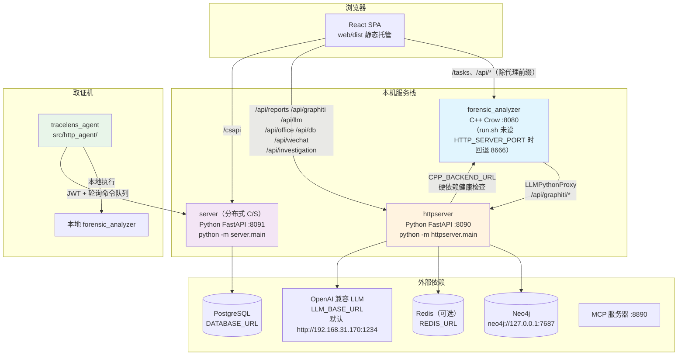
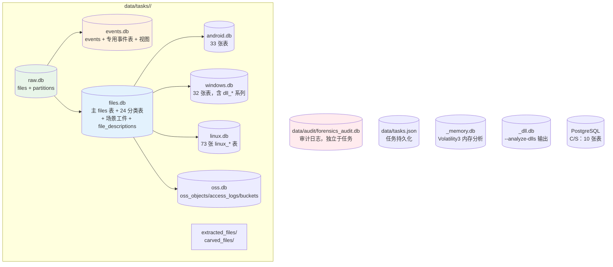

# 项目架构总览（TraceLens）

> 本文档以代码为准重写。项目对外名称为 **TraceLens**（GitHub: ymj68520/TraceLens，MIT 协议），主 C++ 二进制名为 `forensic_analyzer`。

## 1. 系统概述

TraceLens 是一个**数字取证磁盘镜像分析平台**，由 C++20 取证分析引擎 + Python FastAPI 智能分析服务 + React Web 前端组成，并可选部署分布式 C/S 模式（PostgreSQL 服务端 + 取证机代理）。

### 核心能力

- **镜像解析**：基于 The Sleuth Kit (TSK) 4.14.0 解析 E01/DD/RAW 等镜像，支持 NTFS/FAT/EXT/XFS 文件系统与多分区
- **取证流水线**：镜像分析 → 场景检测 → 事件提取 → 文件分类 → LLM 描述 → 平台分析（Android/Windows/Linux/云）→ 可选文件雕刻
- **智能分析**：OpenAI 兼容 LLM 文件/工件/事件簇分析，Graphiti 知识图谱（Neo4j 后端）摄取与查询
- **双运行模式**：CLI 单次分析 + HTTP 异步任务（线程池、任务看护、持久化）
- **报告与工作台**：Markdown 取证报告、调查工作台（investigation/workbench）、微信关系图、文档转换（markitdown）

### 技术栈

**C++ 后端**（`src/`）：
- C++20、CMake ≥ 3.20（Release 构建）
- The Sleuth Kit 4.14.0（源码编译安装，见 `setup.sh` Step 3）
- Crow（HTTP 服务器，asio `io_context`，见 `src/main.cpp`）
- SQLite3（可选 SQLCipher）、Xapian（全文搜索）、Poppler（PDF）、Boost
- cpp-httplib（LLM HTTP 客户端）+ OpenSSL、cpp-mcp（MCP 服务器，`libs/cpp-mcp`）

**Python 服务**（`python_service/`）：
- Python 3.10+、FastAPI、httpx
- graphiti-core + Neo4j 5（知识图谱）
- markitdown（文档转 Markdown）、volatility3（内存取证）

**Web 前端**（`web/`）：
- React 18 + Vite 5 + Redux Toolkit + Tailwind
- 开发端口 3000（`web/vite.config.js`），生产构建产物 `web/dist` 由 C++ 服务静态托管

---

## 2. 整体架构

### 三服务 + 代理架构

要点（均有代码依据）：

| 组件 | 入口 | 端口 | 说明 |
|------|------|------|------|
| `forensic_analyzer` | `src/main.cpp` | 8080（`--http-server` 默认，`CommandLineParser.cpp:189`；`.env` `HTTP_SERVER_PORT=8080`） | 取证分析核心 + 任务管理 + 静态托管 `web/dist`（`HTTPserver.cpp:120`，相对二进制的 `web/dist`） |
| `httpserver` | `python_service/httpserver/main.py` | 8090（`PYTHON_HTTP_PORT`） | LLM 分析、Graphiti 摄取/查询、报告生成、调查工作台、markitdown、微信关系图、Office 解析、案件多镜像分析 |
| `server` | `python_service/server/main.py` | 8091（`PORT`） | 分布式 C/S：PostgreSQL + JWT（HS256），管理组织/客户端/命令队列/任务/结果 |
| `tracelens_agent` | `src/http_agent/http_agent_main.cpp` | 出站连接 | 部署在取证机，JWT 认证轮询 8091 命令队列，本地执行 `forensic_analyzer` 并上传结果/索引 |

`httpserver` 启动有分层超时（`PYTHON_STARTUP_TIMEOUT=30s` 总预算；`CPP_STARTUP_REQUEST_TIMEOUT=5s`、`NEO4J_CONNECT_TIMEOUT=5s`、`OPTIONAL_SERVICE_INIT_TIMEOUT=12s`）。依赖健康分级：**C++ 为硬依赖，Neo4j/LLM/Redis 为可选**；C++ 不可达时 readiness=false 但服务仍启动（降级运行）。

### 前端开发代理（`web/vite.config.js`）

| 前缀 | 目标 |
|------|------|
| `/csapi` | http://localhost:8091（去前缀） |
| `/tasks` | C++（`HTTP_SERVER_PORT` 或 8080） |
| `/api/reports` `/api/graphiti` `/api/llm` `/api/office` `/api/db` `/api/wechat` `/api/investigation` | http://localhost:8090 |
| 其余 `/api` | C++ |

---

## 3. 模块架构

### 核心模块依赖图

```mermaid
graph TD
    MAIN[main.cpp] --> CLI[CommandLineParser<br/>CLI 参数解析]
    MAIN --> HTTP[HTTPServer<br/>Crow 路由 + 静态托管]
    MAIN --> ORCH[AnalysisOrchestrator<br/>CLI 全量分析编排]

    HTTP --> TM[TaskManager<br/>+ TaskManagerAnalysis<br/>异步任务流水线]
    HTTP --> ROUTES[routes/<br/>Task/Forensics/Search/Scene/<br/>DLL/Case/Memory 等 29+ 路由文件]
    HTTP --> SQLITEH[SQLiteHelper<br/>数据库查询]

    TM --> THREADS[ThreadPool<br/>THREAD_POOL_SIZE 默认 4]
    TM --> WATCH[TaskWatchdog<br/>60s 循环标记僵死任务]
    TM --> PERSIST[TaskPersistence<br/>data/tasks.json]

    ORCH --> PIPE[分析流水线]
    TM --> PIPE

    PIPE --> IA[ImageAnalyzer<br/>TSK 镜像解析]
    PIPE --> SD[SceneDetector<br/>从 raw.db 检测场景]
    PIPE --> FF[FileFilter<br/>config/filter_profiles]
    PIPE --> EE[EventExtractor]
    PIPE --> FC[FileClassifier<br/>24 类分类表]
    PIPE --> LAS[LLMAnalysisService<br/>文件级 LLM]
    PIPE --> ECA[EventClusterAnalyzer<br/>LLM 事件簇]
    PIPE --> PLAT[AndroidAnalyzer<br/>WindowsFilesAnalyzer<br/>LinuxFilesAnalyzer<br/>OSSAnalyzer]
    PIPE --> CARVE[FileCarver 可选]
    PIPE --> PROXY[LLMPythonProxy<br/>→ Python /api/graphiti]

    ROUTES --> AUDIT[AuditLog<br/>data/audit/forensics_audit.db]

    style MAIN fill:#37474f
    style HTTP fill:#388e3c
    style TM fill:#388e3c
    style PIPE fill:#1976d2
```

### 模块职责表

| 类别 | 模块（代码位置） | 职责 | 状态 |
|------|-----------------|------|------|
| 编排 | `src/AnalysisOrchestrator.cpp` | CLI 模式全量分析编排（平台工件并入 `<image>_files.db`） | 活跃 |
| 编排 | `src/network/HTTPServer/TaskManagerAnalysis.cpp` | HTTP 任务流水线（阶段见 DataFlow.md） | 活跃 |
| 分析器 | `src/analyzers/ImageAnalyzer/` | TSK 镜像解析、文件系统遍历、XFS（auto/native/pure 模式）、加密镜像解密（`--key-dir/--key-password`） | 活跃 |
| 分析器 | `src/core/EventExtractor/` | 从 raw.db 时间戳生成时间线事件 | 活跃 |
| 分析器 | `src/core/DatabaseManager/FileClassifier/` | 文件分类（**24 张分类表**） | 活跃 |
| 分析器 | `src/analyzers/AndroidAnalyzer/` | Android 工件（短信/联系人/通话/微信/QQNT/MIUI 备份等） | 活跃 |
| 分析器 | `src/analyzers/WindowsFilesAnalyzer/` | 注册表/事件日志/Prefetch/Amcache/LNK/SRUM/浏览器/MFT/服务等 | 活跃 |
| 分析器 | `src/analyzers/LinuxFilesAnalyzer/` | Linux 全面取证（73 张 linux_* 表） | 活跃 |
| 分析器 | `src/analyzers/DLLAnalyzer/` | PE/ELF 分析、异常检测、依赖、威胁评分 | 活跃（表写入 windows.db） |
| 分析器 | `src/analyzers/OSSAnalyzer/` | 阿里云 OSS 对象存储取证（oss.db） | 分析器活跃 |
| 分析器 | `src/analyzers/DatabaseAnalyzer/` | 数据库取证（db_sessions 等表） | 活跃 |
| 分析器 | `src/analyzers/FileCarving/FileCarver.cpp` | 未分配空间雕刻（carved_files 表） | 活跃（可选阶段） |
| 分析器 | `src/analyzers/VisionAnalyzer`（`src/analyzers/VisionAnalysis/`） | 视觉分析 | **死代码**：已编译进二进制但无任何调用方 |
| 分析器 | `src/integration/AndroidAdbExtractor` | ADB 设备提取 | **死代码**：不在 CMake `LIB_SOURCES`，未编译 |
| 基础设施 | `src/core/DatabaseManager/` | SQLite 模式管理（SQL 头文件集中定义） | 活跃 |
| 基础设施 | `src/core/PathManager/` | 任务目录/数据库路径管理 | 活跃 |
| 基础设施 | `src/core/ConfigManager/` | .env 配置（cpp-dotenv） | 活跃 |
| 基础设施 | `src/core/AuditLog/` | 审计日志（WAL、写缓冲、LRU 读缓存、轮转、JSON/CSV 导出） | 活跃 |
| 基础设施 | `src/core/EventCorrelationEngine/` | 事件关联与因果链（event_chains 等） | 活跃 |
| 基础设施 | `src/core/TOONExporter/` | TOON 格式导出 | 活跃 |
| 基础设施 | 全文搜索（Xapian） | `--index/--search` 与搜索路由 | 活跃 |
| LLM | `src/integration/LLMIntegration/LLMClient` | OpenAI 兼容 chat/listModels/tool-calling（cpp-httplib + OpenSSL） | 活跃 |
| LLM | `src/integration/LLMIntegration/ModelRouter` | Priority/Capability/RoundRobin/LoadBalance/Fallback 路由 | 活跃 |
| LLM | `LLMAnalysisService`（HTTPServer 目录） | 文件级 LLM 描述（标 deprecated 注释，但仍为 TaskManager 活跃路径，FULL/SMART 模式） | 活跃 |
| LLM | `Linux/Windows/AndroidLLMAnalysisService` | 平台工件级 LLM 分析 | 活跃 |
| LLM | `EventClusterAnalyzer` | LLM 事件簇分析 | 活跃 |
| LLM | `LLMPythonProxy` | 调 Python `/api/graphiti/*`（Graphiti 摄取任务） | 活跃 |
| LLM | `MarkitdownProxy` | 调 Python `/api/markitdown/*` | 活跃 |
| LLM | `LLMScratch` | 每任务临时提取目录管理 | 活跃 |
| 集成 | `src/integration/LLMIntegration/MCPIntegration` | MCP 服务器（端口 8890，`MCP_SERVER_PORT`） | 活跃 |
| 代理 | `src/http_agent/`（独立 CMake 目标 `tracelens_agent`） | 轮询 C/S 命令、本地执行、结果/索引上传 | 活跃 |
| 路由 | `src/network/HTTPServer/routes/OSS*.cpp` | OSS REST 端点 | **死代码**：编译但 `HTTPserver.cpp` 从未实例化/注册 OSSRoutes，运行时**不存在** `/api/forensics/oss/*` 端点；`OSSRoutes_new.cpp` 未编译。前端 OSS 页面调用会失败（OSSAnalyzer 本身在任务流水线中仍产出 oss.db） |

---

## 4. 数据库分层概览

详细 schema 见 [DatabaseSchema.md](./DatabaseSchema.md)。每个 HTTP 任务在 `data/tasks/<task_id>/` 下产出独立数据库（`PathManager.cpp getTaskDbPaths`）：

CLI 模式输出 `<image>_raw.db`、`<image>_events.db`、`<image>_files.db` 等（平台工件并入 `<image>_files.db`）；HTTP 任务模式输出到任务目录。另有 `<image>_dll.db`（`--analyze-dlls`）、`<image>_memory.db`（`--memory-analyze`）。

---

## 5. 扩展点

**新增分析器**：在 `src/analyzers/` 实现后加入 `CMakeLists.txt` 的 `LIB_SOURCES`，在 `TaskManagerAnalysis.cpp`（HTTP 流水线）与 `AnalysisOrchestrator.cpp`（CLI 链）接入，并在 `src/core/DatabaseManager/SQL/` 添加建表 SQL。

**新增场景过滤配置**：`config/filter_profiles/` 下现有 4 个 JSON（`data_breach.json`、`general_forensics.json`、`telecom_fraud.json`、`virus_intrusion.json`），经 `FileFilter` 加载，`--filter-profile` 指定。

**新增 Python 能力**：`python_service/httpserver/routes/` 添加 FastAPI 路由模块并在 `main.py:_register_routes()` 注册；如需前端访问，同步在 `web/vite.config.js` 增加代理前缀。

**LLM 多模型**：通过 `ModelRouter` 策略（Priority/Capability/RoundRobin/LoadBalance/Fallback）配置多个 OpenAI 兼容端点。

**Graphiti 数据源**：`python_service/graphiti_integration/forensic_data_types.py` + `ForensicsDatabaseFactory.discover()` 自动发现 C++ 产出的 `*_raw/_files/_events/_windows/_linux/_android.db`，新增源可实现新 Transformer（参照 `TOONTransformer`/`ForensicEpisodeTransformer`/`OSSTransformer`）。

---

## 相关文档

- **[数据流架构](./DataFlow.md)** - CLI/HTTP 两条数据流与 C/S 分布式数据流
- **[数据库模式](./DatabaseSchema.md)** - 各库完整表清单
- **[部署架构](./Deployment.md)** - 单机/开发/分布式部署
- **[安全设计](./Security.md)** - 真实安全机制与边界

---

**最后更新**: 2026-08-23（以代码为准重写）
