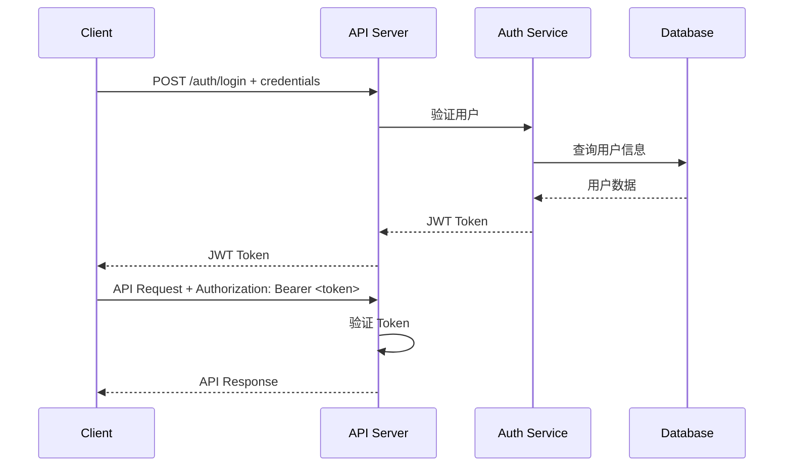
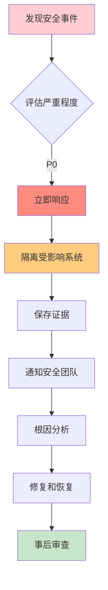

# 安全设计

## 1. 概述

本文档详细说明 ForensicsProject 的安全架构、访问控制、数据保护和合规性要求。

---

## 2. 安全威胁模型

### 2.1 威胁分析

| 威胁类型 | 描述 | 风险等级 | 缓解措施 |
|---------|------|---------|---------|
| **未授权访问** | 未授权用户访问取证数据 | 🔴 高 | 认证/授权、TLS 加密 |
| **数据篡改** | 分析结果被恶意修改 | 🔴 高 | 完整性校验、审计日志 |
| **数据泄露** | 敏感取证信息外泄 | 🔴 高 | 访问控制、加密存储 |
| **拒绝服务** | 服务被攻击导致不可用 | 🟡 中 | 速率限制、资源限制 |
| **特权提升** | 攻击者获取管理员权限 | 🔴 高 | 最小权限原则、容器隔离 |
| **注入攻击** | SQL 注入、命令注入 | 🟡 中 | 参数化查询、输入验证 |

### 2.2 安全边界

**信任边界**：
- **内部网络**：C++ 服务、Python 服务、Neo4j、LLM 服务
- **外部网络**：用户浏览器、API 客户端
- **存储系统**：SQLite 数据库、Neo4j 图数据库、文件存储

**攻击面**：
- HTTP/HTTPS 端口（8080、8090）
- REST API 端点
- 文件上传/下载接口
- 数据库连接

---

## 3. 访问控制

### 3.1 认证机制

#### JWT Token 认证（推荐）

**Token 结构**：
```json
{
  "sub": "user_123",
  "name": "John Doe",
  "role": "forensic_analyst",
  "permissions": ["read:all", "write:tasks", "analyze:evidence"],
  "iat": 1705388400,
  "exp": 1705474800
}
```

**认证流程**：



**实现示例**：

```cpp
// C++ JWT 验证中间件
class JWTAuthMiddleware {
public:
    bool authenticate(const crow::request& req) {
        std::string auth_header = req.get_header_value("Authorization");

        if (auth_header.empty() || auth_header.substr(0, 7) != "Bearer ") {
            return false;
        }

        std::string token = auth_header.substr(7);
        return validate_token(token);
    }

    std::string get_user_id(const crow::request& req) {
        // 从 token 中解析 user_id
        return extract_user_from_token(req);
    }
};
```

#### API Key 认证（简单场景）

**配置方式**：

```bash
# .env
API_KEYS=key1,key2,key3
```

**使用方式**：

```bash
# 客户端请求
curl -H "X-API-Key: key1" http://localhost:8080/api/tasks
```

**服务端验证**：

```cpp
bool validate_api_key(const crow::request& req) {
    std::string api_key = req.get_header_value("X-API-Key");
    std::string valid_keys = get_config("API_KEYS");

    return valid_keys.find(api_key) != std::string::npos;
}
```

### 3.2 授权模型

#### 基于角色的访问控制（RBAC）

**角色定义**：

| 角色 | 描述 | 权限 |
|------|------|------|
| `admin` | 系统管理员 | 全部权限 |
| `forensic_analyst` | 取证分析师 | 读取、创建任务、分析数据 |
| `viewer` | 只读用户 | 仅查看权限 |
| `operator` | 运维人员 | 系统运维、日志查看 |

**权限矩阵**：

| 操作 | admin | analyst | viewer | operator |
|------|-------|---------|--------|---------|
| 创建任务 | ✅ | ✅ | ❌ | ❌ |
| 取消任务 | ✅ | 仅自己的 | ❌ | ❌ |
| 删除数据 | ✅ | ❌ | ❌ | ❌ |
| 导出结果 | ✅ | ✅ | ✅ | ❌ |
| 查看日志 | ✅ | ❌ | ❌ | ✅ |
| 系统配置 | ✅ | ❌ | ❌ | ✅ |

**权限检查示例**：

```python
# Python 服务权限装饰器
from functools import wraps

def require_permission(permission: str):
    def decorator(f):
        @wraps(f)
        async def wrapper(request, *args, **kwargs):
            # 验证 JWT
            user = get_current_user(request)
            if not user:
                raise HTTPException(401, "未授权")

            # 检查权限
            if permission not in user.get("permissions", []):
                raise HTTPException(403, "权限不足")

            return await f(request, *args, **kwargs)
        return wrapper
    return decorator

# 使用示例
@app.post("/api/tasks")
@require_permission("create:tasks")
async def create_task(request: Request):
    ...
```

### 3.3 资源级权限

**细粒度权限**：

```python
# 任务级权限
user.permissions.append("task:read:task_123")
user.permissions.append("task:write:task_123")
user.permissions.append("task:delete:task_123")

# 数据库级权限
user.permissions.append("database:read:evidence_E01")
user.permissions.append("database:export:evidence_E01")
```

---

## 4. 数据保护

### 4.1 加密存储

**传输加密**：

```nginx
server {
    listen 443 ssl http2;

    ssl_certificate /etc/letsencrypt/live/forensics.example.com/fullchain.pem;
    ssl_certificate_key /etc/letsencrypt/live/forensics.example.com/privkey.pem;

    ssl_protocols TLSv1.2 TLSv1.3;
    ssl_ciphers 'ECDHE-ECDSA-AES128-GCM-SHA256:ECDHE-RSA-AES128-GCM-SHA256';
    ssl_prefer_server_ciphers on;
}
```

**存储加密**（可选）：

```cpp
// SQLite 数据库加密
#include "sqlite3.h"

sqlite3* db;
sqlite3_open("encrypted.db", &db);

// 设置加密密钥
sqlite3_key = "your-encryption-key";
sqlite3_exec(db, "PRAGMA key = 'x''';", nullptr, nullptr);

// 启用 SQLCipher 扩展
sqlite3_exec(db, "SELECT sqlcipher('x''');", nullptr, nullptr);
```

### 4.2 数据脱敏

**敏感字段处理**：

```cpp
// 手机号脱敏
std::string mask_phone_number(const std::string& phone) {
    if (phone.length() < 7) return "***";
    return phone.substr(0, 3) + "****" + phone.substr(phone.length() - 4);
}

// 输出：138****1234
```

**导出数据时的脱敏**：

```python
def mask_sensitive_data(data: dict) -> dict:
    """导出时脱敏敏感信息"""
    if "phone_number" in data:
        data["phone_number"] = mask_phone(data["phone_number"])
    if "email" in data:
        data["email"] = mask_email(data["email"])
    if "name" in data:
        data["name"] = data["name"][0] + "***"
    return data
```

### 4.3 数据完整性

**哈希校验**：

```cpp
// 文件哈希存储
struct FileRecord {
    // ... 其他字段
    std::string md5;
    std::string sha256;
};

// 计算文件哈希
std::string calculate_sha256(const std::string& file_path) {
    std::ifstream file(file_path, std::ios::binary);
    std::vector<uint8_t> hash(32, 0);

    mbedtls_sha256_context ctx;
    mbedtls_sha256_init(&ctx);

    char buffer[4096];
    while (file.read(buffer, sizeof(buffer))) {
        mbedtls_sha256_update(&ctx, (const unsigned char*)buffer, file.gcount());
    }

    mbedtls_sha256_finish(&ctx, hash.data());

    std::stringstream ss;
    for (auto byte : hash) {
        ss << std::hex << std::setw(2) << std::setfill('0') << (int)byte;
    }
    return ss.str();
}
```

---

## 5. 审计日志

### 5.1 审计事件

**关键审计事件**：

```sql
CREATE TABLE audit_log (
    id INTEGER PRIMARY KEY AUTOINCREMENT,
    timestamp INTEGER NOT NULL,
    user_id TEXT,
    username TEXT,
    action TEXT NOT NULL,
    resource_type TEXT,      -- task/database/file
    resource_id TEXT,
    ip_address TEXT,
    user_agent TEXT,
    request_id TEXT,
    status TEXT,               -- success/failure
    error_message TEXT,
    additional_data TEXT       -- JSON 格式的额外数据
);
```

**审计事件类型**：

| 事件类型 | 说明 |
|---------|------|
| `TASK_CREATED` | 创建分析任务 |
| `TASK_CANCELLED` | 取消任务 |
| `TASK_COMPLETED` | 任务完成 |
| `FILE_EXTRACTED` | 提取文件 |
| `DATABASE_ACCESSED` | 访问数据库 |
| `USER_LOGGED_IN` | 用户登录 |
| `USER_LOGGED_OUT` | 用户登出 |
| `PERMISSION_CHANGED` | 权限变更 |
| `DATA_EXPORTED` | 导出数据 |

### 5.2 审计日志查询

**查询示例**：

```sql
-- 查询特定用户的所有操作
SELECT * FROM audit_log
WHERE user_id = 'user_123'
ORDER BY timestamp DESC;

-- 查询敏感数据访问
SELECT * FROM audit_log
WHERE action IN ('DATABASE_ACCESSED', 'FILE_EXTRACTED', 'DATA_EXPORTED')
ORDER BY timestamp DESC;

-- 查询失败的操作
SELECT * FROM audit_log
WHERE status = 'failure'
ORDER BY timestamp DESC;

-- 查询特定时间范围的活动
SELECT * FROM audit_log
WHERE timestamp BETWEEN 1704067200000 AND 170467239999
ORDER BY timestamp DESC;
```

---

## 6. 网络安全

### 6.1 输入验证

**SQL 注入防护**：

```cpp
// 使用参数化查询
std::string query = "SELECT * FROM files WHERE path = ?";
sqlite3_stmt* stmt;
sqlite3_prepare_v2(db, query.c_str(), -1, &stmt, nullptr);

// 绑定参数
sqlite3_bind_text(stmt, 1, file_path.c_str(), -1, SQLITE_TRANSIENT);

// 执行查询
sqlite3_step(stmt);
```

**路径遍历防护**：

```cpp
// 验证文件路径
bool is_safe_path(const std::string& path) {
    // 检查路径遍历
    if (path.find("..") != std::string::npos) return false;

    // 检查绝对路径
    if (!path.empty() && path[0] == '/') return false;

    return true;
}
```

**文件上传限制**：

```python
from fastapi import UploadFile, HTTPException

# 文件类型白名单
ALLOWED_EXTENSIONS = {".pdf", ".doc", ".docx", ".txt", ".jpg", ".png"}

# 文件大小限制
MAX_FILE_SIZE = 100 * 1024 * 1024  # 100MB

@app.post("/api/upload")
async def upload_file(file: UploadFile = File(...)):
    # 验证文件扩展名
    file_ext = os.path.splitext(file.filename)[1].lower()
    if file_ext not in ALLOWED_EXTENSIONS:
        raise HTTPException(400, f"不支持的文件类型: {file_ext}")

    # 验证文件大小
    contents = await file.read()
    if len(contents) > MAX_FILE_SIZE:
        raise HTTPException(400, "文件大小超过限制")

    # 保存文件
    safe_filename = secure_filename(file.filename)
    file_path = f"/uploads/{safe_filename}"

    with open(file_path, "wb") as f:
        f.write(contents)

    return {"filename": safe_filename, "path": file_path}
```

### 6.2 速率限制

**Nginx 速率限制配置**：

```nginx
# 定义速率限制区域
limit_req_zone $binary_remote_addr zone=limit:10m rate=10r/s;

server {
    location /api/ {
        # 限制每个 IP 每秒 10 个请求
        limit_req zone=limit burst=20 nodelay;

        # 限制下载速率
        limit_rate_after 10m;
        limit_rate 1m;

        proxy_pass http://python_backend;
    }
}
```

**FastAPI 速率限制**：

```python
from slowapi import Limiter

limiter = Limiter(key_func=get_remote_address)

@app.post("/api/llm/analyze")
@limiter.limit("10/minute")  # 每分钟 10 次
async def analyze_llm(request: Request):
    pass
```

---

## 7. 容器安全

### 7.1 容器隔离

**非特权用户运行**：

```dockerfile
FROM ubuntu:22.04

# 创建非 root 用户
RUN useradd -m -u 1000 forensics

# 切换到非 root 用户
USER forensics

# 只开放必要端口
EXPOSE 8080
```

**只读根文件系统**：

```dockerfile
# 使用只读根文件系统
RUN --mount=type=bind,source=/,target=/root,readonly,bind-propagation=rslave \
    chroot --skip-chdir / /bin/sh -c "echo 'read-only root'"
```

**资源限制**：

```yaml
# Kubernetes 资源限制
resources:
  requests:
    memory: "2Gi"
    cpu: "1000m"
  limits:
    memory: "4Gi"
    cpu: "2000m"
```

### 7.2 安全扫描

**镜像扫描**：

```bash
# 使用 Trivy 扫描镜像
trivy image forensics/cpp-server:latest

# 使用 Grype 扫描漏洞
grype forensics/cpp-server:latest
```

**运行时安全**：

```bash
# 使用 Falco 监控容器运行时安全
falco --event-source=<events_file>
```

---

## 8. 合规性

### 8.1 取证合规

**证据链完整性**：

```json
{
  "chain_of_custody": {
    "evidence_id": "EVID-001",
    "acquired_at": "2024-01-15T10:00:00Z",
    "acquired_by": "Officer Smith",
    "acquisition_method": "Physical Extraction",
    "tool_used": "ForensicsProject v1.0",
    "hash": "sha256:a1b2c3d4e5f6...",
    "analysis_started_at": "2024-01-15T11:00:00Z",
    "analyst": "Dr. Forensics"
  }
}
```

**证据处理最佳实践**：

1. **只读访问**：分析过程中不修改原始镜像
2. **哈希验证**：分析前后验证镜像哈希
3. **审计日志**：记录所有操作
4. **证据隔离**：分析结果与原始数据分离存储

### 8.2 数据保护法规

**GDPR 合规**（欧盟）：

```cpp
// 数据匿名化
struct GDPRCompliance {
    // 个人数据标识符
    std::vector<std::string> personal_identifiers = {
        "full_name",
        "email",
        "phone_number",
        "ip_address",
        "mac_address"
    };

    // 匿名化函数
    std::string anonymize(const std::string& data, const std::string& identifier) {
        if (identifier == "email") {
            return mask_email(data);
        }
        // ...
    }
};
```

**数据保留策略**：

```python
# 自动删除过期数据
def cleanup_old_data():
    retention_days = 365  # 1 年

    cutoff_time = int(time.time() * 1000) - (retention_days * 86400000)

    db.execute("""
        DELETE FROM audit_log
        WHERE timestamp < ?
    """, [cutoff_time])
```

---

## 9. 安全配置清单

### 9.1 生产环境检查表

**必须**：
- ✅ 启用 HTTPS/TLS
- ✅ 配置认证和授权
- ✅ 启用审计日志
- ✅ 限制网络访问（防火墙）
- ✅ 定期备份数据
- ✅ 更新依赖库
- ✅ 使用非特权用户运行服务

**建议**：
- ✅ 启用速率限制
- ✅ 配置容器资源限制
- ✅ 实施安全扫描
- ✅ 使用 secrets 管理敏感信息
- ✅ 配置日志聚合

### 9.2 安全配置示例

**完整配置示例**：

```yaml
# docker-compose.security.yml
version: '3.8'

services:
  cpp-server:
    image: forensics/cpp-server:latest
    environment:
      - LOG_LEVEL=WARNING  # 减少日志记录
      - ENABLE_AUTH=true   # 启用认证
      - JWT_SECRET=${JWT_SECRET}
      - API_KEYS=${API_KEYS}
    ports:
      - "8080:8080"
    volumes:
      - ./config:/config:ro
      - /output:/output
    deploy:
      resources:
        limits:
          cpus: '2'
          memory: 4G
    security_opt:
      - no-new-privileges:true
      - read-only:true
    networks:
      - forensics_internal

  python-server:
    image: forensics/python-server:latest
    environment:
      - ENABLE_AUTH=true
      - JWT_SECRET=${JWT_SECRET}
      - RATE_LIMIT=100/hour
    depends_on:
      - cpp-server
    networks:
      - forensics_internal

networks:
  forensics_internal:
    internal: true
```

---

## 10. 安全事件响应

### 10.1 安全事件分类

**事件等级**：

| 等级 | 描述 | 响应时间 |
|------|------|---------|
| **P0 - 严重** | 系统被入侵、数据泄露 | 立即（< 15 分钟） |
| **P1 - 高** | 未授权访问、特权提升 | 1 小时 |
| **P2 - 中** | 扫描探测、暴力破解 | 4 小时 |
| **P3 - 低** | 配置错误、异常访问 | 24 小时 |

### 10.2 响应流程

**P0 事件响应流程**：



**响应脚本**：

```bash
#!/bin/bash
# security-incident-response.sh

echo "=== 安全事件响应 ==="

# 1. 隔离受影响系统
echo "[1/6] 隔离系统..."
sudo iptables -A INPUT -s 192.168.1.0/24 -j DROP
sudo systemctl stop forensics-cpp
sudo systemctl stop forensics-python

# 2. 保存证据
echo "[2/6] 保存证据..."
TIMESTAMP=$(date +%Y%m%d_%H%M%S)
mkdir -p /security/evidence_$TIMESTAMP

# 保存日志
cp /var/log/forensics/*.log /security/evidence_$TIMESTAMP/

# 保存数据库
cp /output/*.db /security/evidence_$TIMESTAMP/

# 保存配置
cp /etc/forensics/* /security/evidence_$TIMESTAMP/

# 3. 检查系统
echo "[3/6] 检查异常进程..."
ps aux | grep -v forensics | grep -v "\[" | awk '{print $11}' | sort | uniq

# 4. 检查网络连接
echo "[4/6] 检查网络连接..."
netstat -tulpn | grep LISTEN

# 5. 生成报告
echo "[5/6] 生成事件报告..."
# ... 生成报告逻辑 ...

# 6. 通知管理员
echo "[6/6] 通知管理员..."
# ... 发送通知逻辑 ...
```

---

## 相关文档

- **[架构总览](./Overview.md)** - 系统整体架构
- **[部署架构](./Deployment.md)** - 部署和扩展性
- **[审计日志模块](../modules/cpp/core/AuditLog.md)** - 审计日志实现

---

**最后更新**: 2026-03-11
**维护者**: ymj68520
