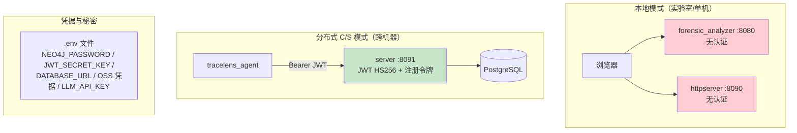

# 安全设计

> 本文档以代码为准重写，只描述**实际存在**的安全机制。旧文档中的 Permission 枚举、chain_of_custody JSON 结构、本地服务 JWT/API Key 计划等在代码中不存在，已删除。

## 1. 安全边界与认证现状

**必须明确的现状**：

- 本地三服务（8080 / 8090 / 8091 中前两个）**均无认证**。前端 `/login` 页面（`web/src/pages/Login.jsx`）是 mock 登录：直接写入 `localStorage` 一个 `mock_jwt_token_<timestamp>`，不校验任何凭据，服务端也没有对应认证端点
- 8091 的 C/S server 是仓库中**唯一有真实认证**的服务：JWT（`JWT_ALGORITHM=HS256`，`JWT_SECRET_KEY`）+ 一次性客户端注册令牌（`registration_tokens` 表），`tracelens_agent` 用 JWT 访问
- 因此外部暴露端口前必须自行加反向代理/网络隔离；默认部署假定运行在受信任的内网

## 2. 审计日志（AuditLog）

实现：`src/core/AuditLog/`（数据类型 `AuditLogDataTypes.h`，引擎 `AuditLog.cpp`）。

- **存储**：SQLite `forensics_audit.db`（默认 `data/audit/forensics_audit.db`，`PathManager.h:73`；可用 `AUDIT_LOG_DB` 覆盖，`main.cpp:70`），独立于任务分析库
- **工程特性**（均在代码中实现）：
  - WAL 日志模式
  - 异步写缓冲（`AUDIT_LOG_CACHE_SIZE`，默认 100，`main.cpp:71`）
  - LRU 读缓存
  - 日志轮转与保留清理
  - JSON/CSV 导出（`exportToFile`）

审计记录覆盖任务创建/删除、文件提取等关键操作，为取证操作留痕。

## 3. 凭据管理

- 全部凭据经 `.env` 配置（cpp-dotenv / pydantic-settings 读取），代码不内置秘密
- `.env.example` 明确提示需轮换：`NEO4J_PASSWORD=change-me`、`JWT_SECRET_KEY=change-me-generate-a-unique-secret`、`DATABASE_URL` 中的数据库口令
- `run.sh` 在 source `.env` 前过滤 `PYTHON_CORS_ORIGINS` 行（C++ dotenv 无法解析 JSON 数组值，保留会在 C++ 侧产生解析告警）
- CORS 通过 `PYTHON_CORS_ORIGINS`（默认 `["*"]`）控制，生产环境应收紧

## 4. 敏感口令的进程级保护

微信/备份库为 SQLCipher 加密数据库，解密需要口令。CLI 提供三种传入方式（`src/CommandLineParser.cpp`）：

| 参数 | 口令来源 | 暴露风险 |
|------|---------|---------|
| `--backup-password` | argv | 可被 `ps`/shell history 观测（不推荐） |
| `--backup-password-stdin` | 标准输入 | 不进 argv |
| `--backup-password-fd` | 文件描述符 | 不进 argv，适合管道/进程间传递 |

同类还有 `--key-password-stdin`（加密镜像密钥口令）与 `--wechat-password`。实现侧 `WeChatDecryptor.cpp` 直接消费这些口令。

## 5. 路径与资源隔离

以下机制均在代码中实现，防止路径穿越与跨任务数据泄漏：

- **FTS 路径限制**（`src/network/HTTPServer/routes/SearchRoutes.cpp`）：全文搜索默认只允许 PathManager 数据目录，操作员可通过 `FTS_ALLOWED_ROOT` 环境变量显式放宽；越界请求返回提示而非放行
- **markitdown workspace 隔离**（`python_service/httpserver/routes/markitdown.py`）：转换请求必须提供 `task_id` 或 `workspace_root`，文件访问被约束在任务工作区内
- **task_store 精确匹配路径解析（fail-closed）**：httpserver 各路由（office/multi_analysis/dll/llm 等）通过 task_store 解析任务路径，解析失败即拒绝，不回退到宽松匹配
- **任务删除后的终止写保护、TOCTOU 防复活**：删除任务时先做活性检查再清理，竞态窗口内 fail-closed（`docs/hardening/d4b-lifecycle-resource-fixes.md` 记录设计与测试，代码已实现）
- **PEM 临时文件安全处理**：证书等临时文件在用后清理（同上 d4b 文档 F 节 "Graphiti and PEM Cleanup"）
- **LLMScratch**：每任务独立临时提取目录，任务结束清理

## 6. 网络与传输

- LLM 客户端（`LLMClient`，cpp-httplib + OpenSSL）与 Python httpx 支持 HTTPS 端点；实际是否加密取决于 `LLM_BASE_URL` / `NEO4J_URI` 等配置的目标协议
- Neo4j Bolt、Redis、PostgreSQL 连接串均支持带凭据的标准 URI（`neo4j://`、`redis://`、`postgresql://`）
- 服务本身不内置 TLS 终止；如需对外提供 HTTPS，应在反向代理层做（仓库未提供该配置）

## 7. 数据完整性与取证严谨性

- SQLite 事务 + WAL（`DB_JOURNAL_MODE=WAL`）保证写入完整性
- 文件记录保留原始路径、时间戳（atime/mtime/ctime/crtime）、md5、inode、partition_num 等取证字段（raw.db files 表）
- 任务生命周期状态机（PENDING/RUNNING/COMPLETED/FAILED/CANCELLED）+ TaskWatchdog 僵死任务检测 + `data/tasks.json` 持久化，避免任务状态不明
- `linux_tampering_findings`、`linux_timeline_gaps` 等分析表用于检测日志篡改与时间线空白

## 8. 安全注意事项（如实陈述）

- 本地服务无认证：8080/8090 能触达的任何人都可以创建任务、读取分析结果、触发 LLM 调用。部署时务必限制网络可达范围
- 前端 mock 登录不提供任何安全边界
- `PYTHON_CORS_ORIGINS` 默认 `["*"]`
- OSS 凭据（`OSS_ACCESS_KEY_ID/SECRET`）明文存放于 `.env`，注意文件权限
- MCP 服务器路径白名单 `MCP_ALLOWED_PATHS` 留空时允许所有路径（`.env.example`），按需收紧

---

## 相关文档

- **[架构总览](./Overview.md)** - 服务边界与端口
- **[部署架构](./Deployment.md)** - 端口暴露与依赖配置
- `docs/hardening/d4b-lifecycle-resource-fixes.md` - 生命周期与资源清理加固记录
- `src/core/AuditLog/README.md` / `IMPLEMENTATION.md` - 审计日志模块文档

---

## 附：部署安全检查单（可勾选）

- [ ] JWT_SECRET_KEY 已改且 ≥32 字符随机值（server 与 agent 两侧一致）
- [ ] NEO4J_PASSWORD 已改（驱动连接与 Neo4j 服务一致）
- [ ] .env 权限 600、不含示例值（change-me/admin123 全清）
- [ ] 8080/8090/8091/7687/5432 仅监听可信网段（或 127.0.0.1）
- [ ] LLM_BASE_URL 指向内网端点（证据内容不出网红线）
- [ ] 注册令牌按批签发、用后过期（registration_tokens 有 max/expiry）
- [ ] PG 002/003 迁移已手工应用（super_admin 口令已轮换）
- [ ] /api/system/logs 与 /api/docs 的暴露面已被网络层覆盖（本地无认证现状）
- [ ] FTS_ALLOWED_ROOT 与 DATA_DIR 一致（未放宽）
- [ ] 审计库纳入备份且路径已知（CWD 陷阱：run.sh 下在 build/）
未勾项的影响与补偿措施见 [ThreatModel](./ThreatModel.md) 对应边界行。
**最后更新**: 2026-08-23（以代码为准重写）
