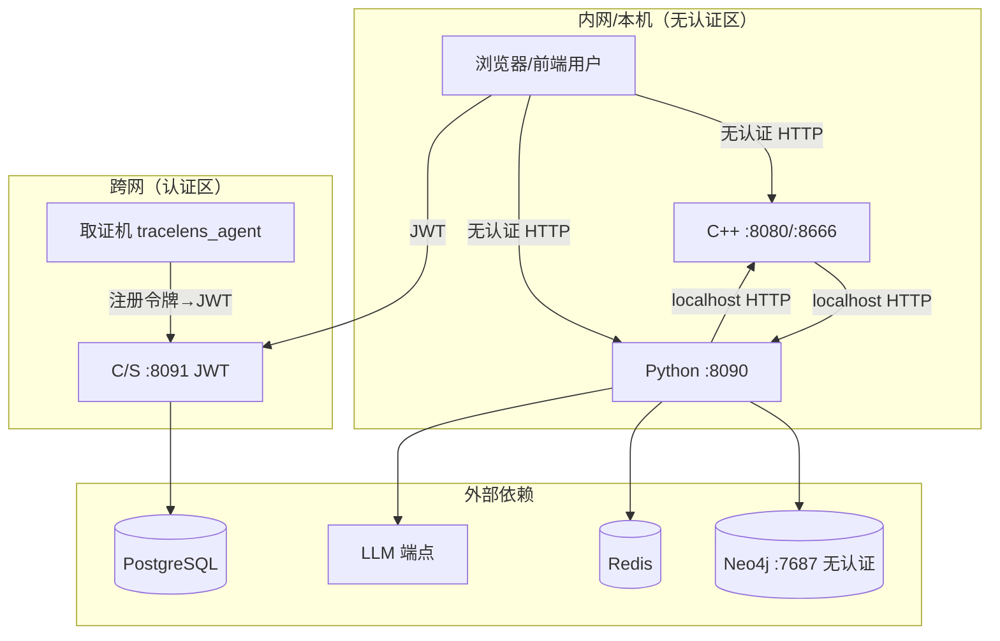

# 威胁模型

> 回答一个问题：**如果有人想攻击或滥用这套取证系统，从哪里下手，我们挡住了什么、没挡住什么。** 依据 [Security.md](./Security.md)、docs/security/ 与 docs/hardening/ 存档的结论和当前代码，均给出锚点。定位假设（ADR-3）：**单机/内网取证工作站**——离开这个假设，"残留风险"列会整体升级。

## 1. 信任边界图

五条边界：①浏览器↔本地双服务（无认证）；②C++↔Python（localhost 明文）；③agent↔C/S（JWT）；④服务↔外部依赖（Neo4j/Redis 本机、LLM 明文出网）；⑤运维↔主机（文件权限）。

## 2. 逐边界威胁表

### 边界①：未认证的本地 API（最主要的现实威胁面）

| 威胁 | 现实性 | 现有缓解 | 残留风险 |
|------|--------|---------|---------|
| 内网横向者直调 API 读任务证据（/api/forensics/*、/api/db/*） | 高（无认证即无门槛） | 单机定位+网络隔离是**唯一**防线（Security.md 明示） | 同网段任何主机可全量读证据 |
| 路径穿越读任意文件（extract/markitdown/db） | 中 | task_store fail-closed 精确匹配（task_store.py）、extract 强制相对路径拒 `..`/绝对（FileExtractionRoutes）、markitdown workspace 门控、FTS `FTS_ALLOWED_ROOT` 围栏 | 防御分散在各路由，新路由容易漏（配方清单里有提醒） |
| Swagger 暴露端点面（/api/docs） | 低 | 只是信息暴露 | 无 |
| /api/system/logs 无鉴权读服务日志 | 中 | 无 | 日志可能含路径/任务名等敏感上下文（SecurityHardening 清单已列） |

### 边界②：C++↔Python localhost HTTP

| 威胁 | 现实性 | 缓解 | 残留 |
|------|--------|------|------|
| 本机其他进程伪装对端（SSRF 型） | 低（需已立足本机） | 仅监听 0.0.0.0 但约定 localhost 互调；PYTHON_SERVICE_URL 可收紧 | 默认绑定 0.0.0.0——多用户主机上应收紧为 127.0.0.1（运维清单项） |
| Graphiti 摄取被伪造（污染图谱） | 低 | 摄取走 task_store 校验任务归属 | 伪造任务的 job 无法防止（同边界①） |

### 边界③：agent↔C/S（JWT）

| 威胁 | 现实性 | 缓解 | 残留 |
|------|--------|------|------|
| 伪造 agent 注册 | 中 | registration_tokens（可过期/限量，表级 CHECK） | 令牌泄露窗口内可注册；无吊销列表 |
| JWT 伪造 | 取决于密钥强度 | HS256 单密钥、token 0600 权限硬校验（http_agent） | JWT_SECRET_KEY 默认 change-me 未改=形同虚设（运维清单第一项） |
| 越 org 操作 | 低 | 路由层 org_id 比较；`require_permission` 是**存根**（super_admin 直通+TODO，server/Services.md） | RBAC 未实装，靠约定 |
| 结果伪造（上传假 results） | 中 | 结果按 task FK 归属；无内容签名 | 信任模型假设"取证机可信"，被控 agent 可污染 |

### 边界④：外部依赖

| 威胁 | 现实性 | 缓解 | 残留 |
|------|--------|------|------|
| Neo4j/Redis 无认证被内网直连 | 中 | 默认本机监听 | Neo4j 密码用于驱动连接，网络层仍信本机；Redis 无 TLS |
| LLM 端点明文出网（证据内容过网） | 高 | 端点可指内网（LM Studio 默认即内网部署） | 指向公端点时**证据内容出网**——部署红线，SecurityHardening 有警示 |
| PG 凭据明文 .env | 低 | 文件权限防线 | 与所有 .env 密钥同命运 |

### 边界⑤：注入与实现层

| 威胁 | 现实性 | 缓解 | 残留 |
|------|--------|------|------|
| SQL 注入 | 低 | SQLite 侧全参数化 + `is_readonly_select` 只读判定（SQLiteHelper）；PG 侧 ORM | 手拼点已知两处（FullTextSearch 的 data JSON 手拼——路径含引号会坏；AuditLog CSV 导出未转义） |
| 命令注入 | 中 | 绝大多数外部工具走 fork/exec 数组 | OfficeAnalyzer 的 antiword popen 单引号包裹是**已知隐患**（模块文档已标） |
| 错误信息泄漏 | 低 | Python 固定文案 500/异常只回类名/Redis URL 掩码（D1 纪律） | 个别路由 str(e) 直泄（HTTPRoutes 文档的瑕疵清单） |
| XSS/CSRF | 低（内网+无Cookie凭据） | CORS 全开但无凭据依赖；报告 HTML 有 CSP | mock token 不构成凭据 |

## 3. 资产与最弱环节排序（前五）

1. **任务库证据文件**（data/tasks/**）——机密性+完整性都是最高资产；防线只剩"主机不被立足"。
2. **.env 密钥集**（NEO4J/JWT/PG/LLM key）——单文件失守=边界③④全穿。
3. **审计库完整性**（forensics_audit.db）——它是"系统判断可复核"的根；当前无签名，root 可改。
4. **Neo4j 图谱**——污染即误导调查；无写鉴权。
5. **LLM 端点凭据/内容**——出网即证据泄露。

## 4. 已拒绝的缓解（及为什么）

- **本地服务加认证**：拒绝——单机工具的认证会制造假安全感且拖慢取证节奏；正确做法是网络隔离（ADR-3）。
- **任务库加密静态存储**：拒绝（当前）——SQLite+SQLCipher 只用于微信证据解密输入；全库加密与"删除即删目录、文件级备份"的运维模型冲突，待有真实多用户需求再议。
- **agent 上传内容签名**：未做——信任模型停在"取证机可信"；若部署到不受控场地，此项升级为必做。

## 5. 给部署者的三句话

1. 把 `JWT_SECRET_KEY`/`NEO4J_PASSWORD` 从 change-me 改掉，`.env` chmod 600——这是性价比最高的两分钟。
2. 8080/8090/8091 与 7687 只暴露给可信网段；LLM_BASE_URL 永远指向内网端点。
3. 接受"同网段=可读证据"的模型前，先读 [Security.md](./Security.md) 的定位假设一节。

---

**最后更新**: 2026-08-24（新建：威胁模型）
