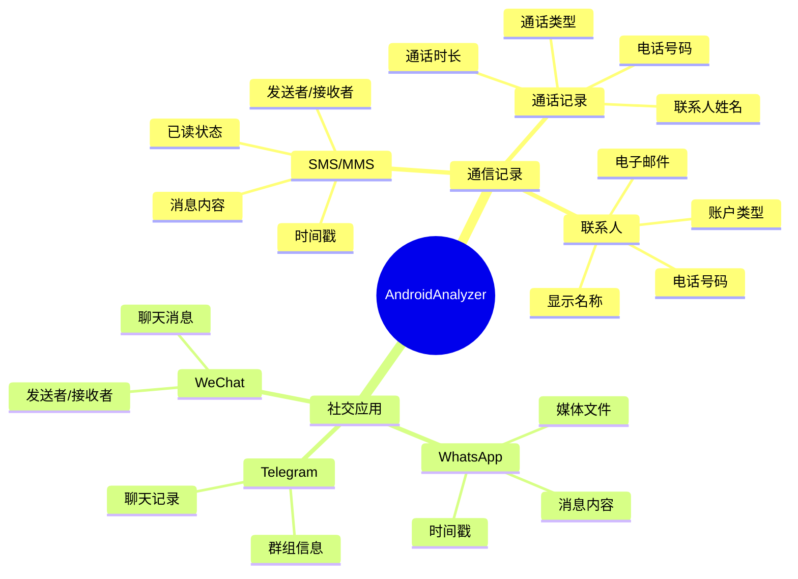
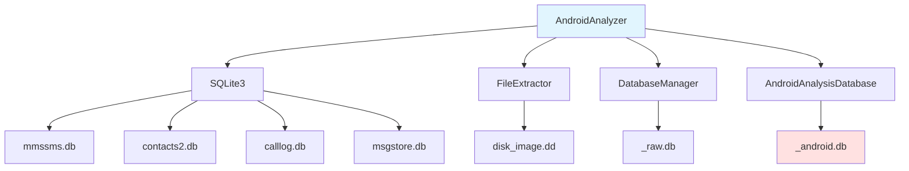
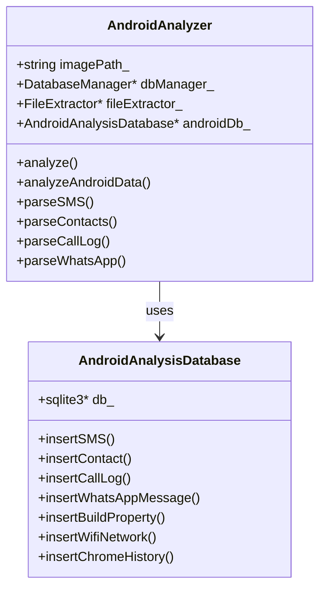
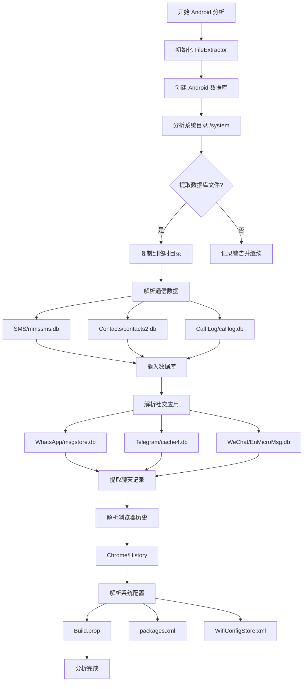

# AndroidAnalyzer 模块文档

## 1. 模块背景

### 业务背景

移动设备取证是数字取证的重要分支，Android 设备占据了全球移动市场的大份额。调查人员需要从 Android 设备中提取关键证据：

**核心需求**：
- **通信记录**：SMS、MMS、通话记录，揭示联系人网络
- **社交媒体**：WhatsApp、Telegram、WeChat 等聊天应用
- **用户活动**：应用使用频率、最后使用时间
- **设备信息**：设备型号、系统版本、安全配置
- **网络足迹**：WiFi 配置、浏览器历史

**解决挑战**：
- **数据分散**：关键信息存储在多个 SQLite 数据库中
- **应用多样性**：不同应用使用不同的数据格式
- **权限限制**：某些数据需要 root 权限才能访问
- **加密保护**：现代 Android 设备的加密存储
- **版本差异**：不同 Android 版本的文件结构差异

### 技术背景

**为什么需要专门的 Android 分析器？**

| 数据源 | 传统文件系统分析 | Android 专门分析 |
|--------|---------------------|-----------------|
| 通信记录 | 仅文件元数据 | 提取完整内容和元数据 |
| 应用数据 | 无法访问 | 解析应用数据库 |
| 系统配置 | 部分可见 | 完整 build.prop 解析 |
| 用户行为 | 有限信息 | 详细使用统计 |

**技术选型**：

1. **SQLite 直接解析**：
   - 直接读取 `.db` 文件
   - 执行 SQL 查询提取结构化数据
   - 避免文件系统层面的复杂性

2. **FileExtractor 集成**：
   - 复用核心文件提取功能
   - 从磁盘镜像中定位数据库文件
   - 支持分区偏移量处理

3. **模块化解析器**：
   - 每种应用/数据类型专用解析器
   - 独立的数据结构定义
   - 可扩展架构

## 2. 模块功能

### 核心功能

#### 1. 通信数据分析



#### 2. 系统信息提取

**build.prop 分析**：
- **设备信息**：制造商、型号、品牌、产品
- **系统配置**：SDK 版本、安全补丁级别
- **安全评估**：ADB 状态、调试模式、安全标志
- **指纹信息**：设备唯一标识符

**WiFi 配置**：
- SSID 和预共享密钥
- 密钥管理类型
- 最后连接时间

**已安装应用**：
- 包名和版本
- 安装路径和 APK 信息
- 首次安装和最后更新时间
- 安装者信息

**使用统计**：
- 前台使用时长
- 最后使用时间
- 数据和时间间隔

#### 3. 浏览器历史

**Chrome 历史记录**：
- URL 和页面标题
- 访问次数和最后访问时间
- 输入次数统计

### 边界与限制

**功能边界**：
- ❌ 不支持加密应用数据（需要额外解密）
- ❌ 不恢复已删除的应用数据（需要文件雕刻）
- ❌ 不解析二进制应用数据（如应用缓存）
- ❌ 不支持所有聊天应用（仅限主流应用）

**已知限制**：
| 限制 | 影响 | 缓解方法 |
|------|------|----------|
| 需要 root 权限 | 某些数据无法访问 | 使用文件系统镜像 |
| 数据库损坏 | 解析可能失败 | 错误处理和日志记录 |
| 应用版本差异 | 数据库结构可能变化 | 多版本支持 |
| 加密存储 | 无法直接读取 | 报告并跳过 |

**性能指标**（参考配置）：
- SMS 提取：~1000 条/秒
- 联系人提取：~2000 条/秒
- 应用列表提取：~500 个/秒
- 完整分析：~5-15 分钟（取决于数据量）

## 3. 模块使用的库

### 依赖库清单

| 库名称 | 版本 | 用途 | 许可证 |
|--------|------|------|--------|
| **SQLite3** | 3.35.0+ | Android 数据库解析 | Public Domain |
| **FileExtractor** | 内部模块 | 文件提取 | - |
| **DatabaseManager** | 内部模块 | 数据库操作 | - |

### 依赖关系图



## 4. 模块实现方式

### 架构设计



### 核心类说明

#### AndroidAnalyzer（主分析器）
**职责**：
- 协调所有 Android 数据提取
- 调用 FileExtractor 提取数据库文件
- 调用专用解析器处理数据
- 将结果存储到 Android 分析数据库

**关键方法**：
```cpp
class AndroidAnalyzer {
public:
    AndroidAnalyzer(const std::string& imagePath, DatabaseManager* dbManager);

    // 初始化
    bool initialize();

    // 主分析方法
    void analyzeAndroidData();
    void analyzeSystemDirectory(const std::string& systemPath);

    // 数据解析方法
    void parseSMS(const std::string& dbPath);
    void parseContacts(const std::string& dbPath);
    void parseCallLog(const std::string& dbPath);
    std::vector<ChatMessage> parseWhatsApp(const std::string& dbPath);
    std::vector<ChatMessage> parseTelegram(const std::string& dbPath);
    std::vector<ChatMessage> parseWeChat(const std::string& dbPath);
    void parseChromeHistory(const std::string& dbPath);

    // 系统配置
    bool parseWifiConfig(const std::string& configPath);
    BuildPropAnalysisResult analyzeBuildPropFile(const std::string& buildPropPath);

private:
    std::string imagePath_;
    std::string outputDbPath_;
    DatabaseManager* dbManager_;
    std::unique_ptr<FileExtractor> fileExtractor_;
    std::unique_ptr<AndroidAnalysisDatabase> androidDb_;
};
```

### 关键流程



### 数据结构

**输入数据**（Android 数据库）：

**SMS 表结构**：
```sql
CREATE TABLE sms (
    _id INTEGER PRIMARY KEY,
    thread_id INTEGER,
    address TEXT,
    person TEXT,
    date INTEGER,
    date_sent INTEGER,
    read INTEGER,
    status INTEGER,
    type INTEGER,
    body TEXT,
    service_center TEXT
);
```

**输出数据**（Android 分析数据库）：

```cpp
// 聊天消息
struct ChatMessage {
    std::string sender;
    std::string receiver;
    std::string content;
    std::string timestamp;
    std::string media_url;
    std::string media_type;
    std::string app_name;  // whatsapp, telegram, wechat
};

// WiFi 网络
struct WifiNetwork {
    std::string ssid;
    std::string pre_shared_key;
    std::string key_mgmt;
    int64_t last_connected;
};

// 设备信息
struct DeviceInfo {
    std::string manufacturer;
    std::string brand;
    std::string model;
    std::string device;
    std::string product;
    std::string fingerprint;
    std::string security_patch_level;
    int sdk_version;
};
```

## 5. API 调用

### C++ API

```cpp
#include "analyzers/AndroidAnalyzer/AndroidAnalyzer.h"

// 创建分析器
auto dbManager = std::make_unique<DatabaseManager>("evidence_raw.db");
AndroidAnalyzer analyzer("android_image.img", dbManager.get());

// 初始化
if (!analyzer.initialize()) {
    std::cerr << "初始化失败" << std::endl;
    return 1;
}

// 执行分析
analyzer.analyzeAndroidData();

std::cout << "Android 分析完成" << std::endl;
```

### 命令行 API

```bash
# Android 分析（通过主程序）
./forensic_analyzer android_image.img --android-analyze

# 输出数据库：android_image_android.db
```

### REST API

**通过 HTTP 服务器查询 Android 数据**：

```bash
# Android 通信摘要
curl "http://localhost:8080/api/forensics/android/communication?task_id=task_abc123"

# 应用使用统计
curl "http://localhost:8080/api/forensics/android/app-usage?task_id=task_abc123"

# 设备信息
curl "http://localhost:8080/api/forensics/android/device-info?task_id=task_abc123"

# 媒体文件分析
curl "http://localhost:8080/api/forensics/android/media-analysis?task_id=task_abc123"
```

**响应示例**：
```json
{
  "success": true,
  "sms_messages": 1523,
  "contacts": 842,
  "call_logs": 342,
  "whatsapp_messages": 5634,
  "device_info": {
    "manufacturer": "Samsung",
    "model": "SM-G998B",
    "android_version": "11",
    "security_patch": "2024-01-01"
  }
}
```

## 6. 二次开发

### 扩展点

#### 1. 添加新的聊天应用解析器

**位置**：`AndroidDataParsers.cpp`

**示例**：添加 Signal 解析

```cpp
std::vector<ChatMessage> AndroidAnalyzer::parseSignal(const std::string& dbPath) {
    std::vector<ChatMessage> messages;

    // Signal 数据库路径
    std::string signalDbPath = findInImage(
        "data/data/org.thoughtcrime.securesms/database/"
    );

    if (signalDbPath.empty()) {
        LOG_WARNING("Signal database not found");
        return messages;
    }

    // 提取数据库
    std::string extractedPath = getExtractPath("signal.db");
    if (!extractFileToPath(signalDbPath, extractedPath)) {
        return messages;
    }

    // 解析 Signal 数据库
    sqlite3* db;
    if (sqlite3_open(extractedPath.c_str(), &db) == SQLITE_OK) {
        const char* sql = R"(
            SELECT m.body AS content,
                   m.date AS timestamp,
                   m.address AS address
            FROM mms m
            ORDER BY m.date DESC
        )";

        sqlite3_stmt* stmt;
        sqlite3_prepare_v2(db, sql, -1, &stmt, nullptr);

        while (sqlite3_step(stmt) == SQLITE_ROW) {
            ChatMessage msg;
            msg.app_name = "signal";
            msg.content = reinterpret_cast<const char*>(
                sqlite3_column_text(stmt, 0)
            );
            msg.timestamp = reinterpret_cast<const char*>(
                sqlite3_column_text(stmt, 1)
            );
            msg.sender = reinterpret_cast<const char*>(
                sqlite3_column_text(stmt, 2)
            );

            messages.push_back(msg);
        }

        sqlite3_finalize(stmt);
    }

    sqlite3_close(db);
    return messages;
}
```

#### 2. 添加安全分析功能

**位置**：创建 `AndroidSecurityAnalyzer.cpp`

```cpp
class AndroidSecurityAnalyzer {
public:
    struct SecurityRisk {
        std::string category;      // adb_enabled, debug_mode, etc.
        std::string description;
        std::string severity;      // HIGH, MEDIUM, LOW
        std::string recommendation;
    };

    std::vector<SecurityRisk> analyzeSecurity(const DeviceInfo& device,
                                            const SecurityConfig& config) {
        std::vector<SecurityRisk> risks;

        // 检查 ADB 状态
        if (config.adb_enabled) {
            SecurityRisk risk;
            risk.category = "adb_enabled";
            risk.description = "Android Debug Bridge 已启用";
            risk.severity = "HIGH";
            risk.recommendation = "禁用 ADB 以防止未授权访问";
            risks.push_back(risk);
        }

        // 检查调试模式
        if (config.debug_enabled) {
            SecurityRisk risk;
            risk.category = "debug_mode";
            risk.description = "系统调试模式已启用";
            risk.severity = "MEDIUM";
            risk.recommendation = "在生产环境中禁用调试模式";
            risks.push_back(risk);
        }

        // 检查锁屏状态
        if (!config.screen_lock_enabled) {
            SecurityRisk risk;
            risk.category = "no_screen_lock";
            risk.description = "未启用锁屏";
            risk.severity = "HIGH";
            risk.recommendation = "启用 PIN/图案/密码锁屏";
            risks.push_back(risk);
        }

        return risks;
    }
};
```

### 添加新功能的步骤

#### 完整示例：添加应用分类分析

**步骤 1**：定义数据结构
```cpp
// AndroidDataTypes.h
struct AppCategory {
    enum class Type {
        COMMUNICATION,      // 通讯类
        SOCIAL,            // 社交类
        PRODUCTIVITY,       // 生产力
        ENTERTAINMENT,      // 娱乐类
        UTILITY,           // 工具类
        SYSTEM,            // 系统类
        GAME,              // 游戏类
        FINANCE,           // 金融类
        SHOPPING,          // 购物类
        UNKNOWN
    };

    std::string package_name;
    Type category;
    std::string category_name;
    std::string description;
};
```

**步骤 2**：创建分类数据库
```cpp
// android_analysis_sql.h
static const char* CREATE_APP_CATEGORIES_TABLE = R"(
CREATE TABLE IF NOT EXISTS app_categories (
    id INTEGER PRIMARY KEY AUTOINCREMENT,
    package_name TEXT NOT NULL UNIQUE,
    category TEXT,
    category_name TEXT,
    description TEXT,
    is_system_app INTEGER DEFAULT 0
);
)";
```

**步骤 3**：实现分类逻辑
```cpp
// AndroidAnalyzer.cpp
std::vector<AppCategory> AndroidAnalyzer::categorizeApps() {
    std::vector<AppCategory> categories;

    // 查询已安装应用
    const char* sql = "SELECT package_name, version FROM installed_packages";
    sqlite3_stmt* stmt;
    sqlite3_prepare_v2(db_, sql, -1, &stmt, nullptr);

    while (sqlite3_step(stmt) == SQLITE_ROW) {
        AppCategory app;
        app.package_name = reinterpret_cast<const char*>(
            sqlite3_column_text(stmt, 0)
        );

        // 基于包名分类
        app.category = classifyPackage(app.package_name);
        app.category_name = getCategoryName(app.category);
        app.description = getCategoryDescription(app.package_name);

        categories.push_back(app);
    }

    sqlite3_finalize(stmt);
    return categories;
}

AppCategory::Type AndroidAnalyzer::classifyPackage(const std::string& packageName) {
    // 通讯类应用
    if (startsWith(packageName, "com.whatsapp") ||
        startsWith(packageName, "com.facebook") ||
        startsWith(packageName, "com.tencent.mm")) {
        return AppCategory::Type::COMMUNICATION;
    }

    // 社交类应用
    if (startsWith(packageName, "com.instagram") ||
        startsWith(packageName, "com.twitter")) {
        return AppCategory::Type::SOCIAL;
    }

    // 游戏类应用
    if (startsWith(packageName, "com.tencent.igame") ||
        startsWith(packageName, "com.kingnet")) {
        return AppCategory::Type::GAME;
    }

    // 默认
    return AppCategory::Type::UNKNOWN;
}
```

## 7. 其他

### 测试

**单元测试**：
```
tests/UnitTest/test_android_analyzer_gtest.cpp
```

**运行测试**：
```bash
cd build
./test_android_analyzer
```

### 配置

**相关配置**：
- Android 镜像路径
- 数据库输出路径
- 文件提取目录

### 故障排查

| 问题 | 可能原因 | 解决方法 |
|------|----------|----------|
| **数据库未找到** | Android 镜像不是标准的文件系统 | 检查镜像格式 |
| **权限拒绝** | 无法访问系统文件 | 使用 root 权限 |
| **解析失败** | 数据库文件损坏 | 检查数据库完整性 |

### 相关模块

- **[FileExtractor](../core/FileExtractor.md)** - 文件提取
- **[DatabaseManager](../core/DatabaseManager.md)** - 数据库管理

### 参考资源

- [Android 数据库结构](https://www.androidosx.com/)
- [SQLite 文档](https://www.sqlite.org/docs.html)

### 变更历史

| 版本 | 日期 | 变更内容 | 作者 |
|------|------|----------|------|
| 1.0.0 | 2024-01-10 | 初始版本 | Forensics Team |

---

**最后更新**: 2026-03-11
**维护者**: ymj68520
