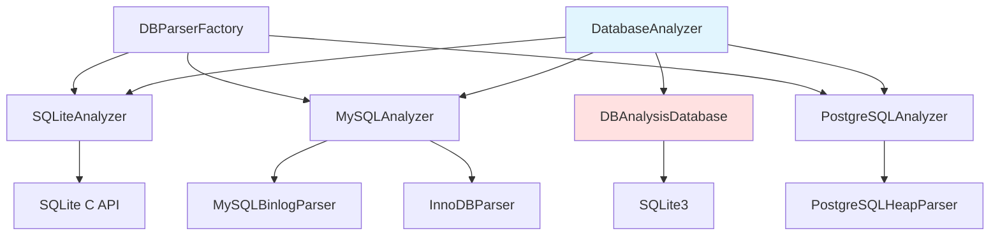
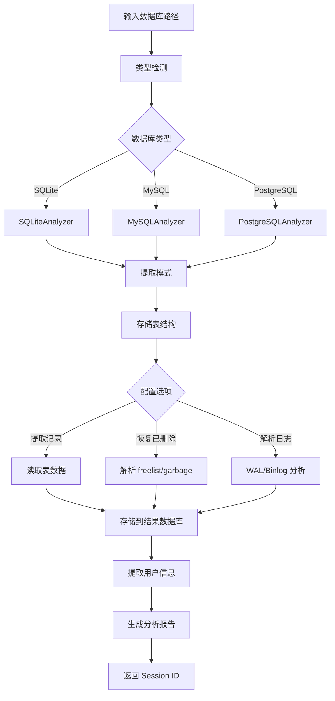

# DatabaseAnalyzer 模块文档

## 1. 模块背景

### 业务背景

数据库文件是应用和系统的核心数据存储，包含关键业务信息和用户数据。在数字取证中，数据库分析能力至关重要：

**核心需求**：
- **多格式支持**：SQLite、MySQL、PostgreSQL 等主流数据库
- **结构提取**：获取数据库模式、表结构、字段定义
- **数据恢复**：恢复已删除的记录和事务历史
- **日志分析**：解析二进制日志和 WAL 文件
- **用户信息**：提取数据库用户和权限信息

**解决挑战**：
- **格式复杂性**：不同数据库的文件格式差异大
- **已删除数据**：从数据文件中恢复已删除记录
- **加密数据**：处理加密的数据库文件
- **大规模数据**：高效处理大型数据库

### 技术背景

**支持的数据库格式**：
```
┌─────────────────┬──────────────────┬─────────────────┐
│    SQLite       │     MySQL        │   PostgreSQL    │
├─────────────────┼──────────────────┼─────────────────┤
│ .sqlite, .db    │ 数据目录         │ 数据目录         │
│ WAL 文件        │ .frm, .ibd       │ base/ 子目录     │
│ Freelist 分析   │ Binlog           │ WAL 日志         │
│ 应用识别        │ 用户权限         │ Heap 元组        │
└─────────────────┴──────────────────┴─────────────────┘
```

**解析器架构**：策略模式，可扩展的解析器接口

## 2. 模块功能

### 核心功能

#### 1. SQLite 数据库分析

**支持格式**：`.sqlite`, `.db`, `.sqlite3`, `.db3`

**分析能力**：
- **完整模式提取**：表结构、索引、视图、触发器
- **记录读取**：支持分页、限制、偏移
- **已删除记录恢复**：通过 freelist 分析
- **WAL 日志解析**：事务历史分析
- **应用类型检测**：识别浏览器、应用数据库

```cpp
DatabaseAnalyzer analyzer;
analyzer.initialize("analysis_results.db");

// 自动检测并分析
auto sessionId = analyzer.analyze("user_data.sqlite");

// 获取表信息
auto tables = analyzer.getTables(sessionId);
for (const auto& table : tables) {
    std::cout << "表: " << table.name
              << " (" << table.rowCount << " 行)" << std::endl;
}

// 获取记录
auto records = analyzer.getRecords(sessionId, "users", 1000);
```

**页面级分析**：
- 页大小（通常 4KB）
- 自由页统计
- 数据库编码（UTF-8/UTF-16）
- 用户版本号

#### 2. MySQL 数据目录分析

**分析目标**：MySQL 数据目录（通常 `/var/lib/mysql/`）

**文件类型**：
- `.frm`：表结构文件
- `.ibd`：InnoDB 表空间
- `ibdata1`：系统表空间
- `.MYD/.MYI`：MyISAM 数据和索引
- `binlog.*`：二进制日志

**分析能力**：
- **表结构提取**：解析 `.frm` 文件
- **用户账户**：从 `mysql.user` 表提取
- **配置分析**：解析 `my.cnf`、`my.ini`
- **Binlog 解析**：通过 `MySQLBinlogParser`

```cpp
// MySQL 数据目录分析
DatabaseAnalyzer analyzer;
analyzer.initialize("mysql_analysis.db");

auto sessionId = analyzer.analyze(
    "/var/lib/mysql/",
    DatabaseType::MYSQL
);

// 获取数据库用户
auto users = analyzer.getUsers(sessionId);
for (const auto& user : users) {
    std::cout << "用户: " << user.username
              << " 主机: " << user.host << std::endl;
}
```

#### 3. PostgreSQL 数据目录分析

**分析目标**：PostgreSQL 数据目录（通常 `/var/lib/postgresql/`）

**文件类型**：
- `base/`：数据库文件目录
- `global/`：全局表
- `pg_wal/`：WAL 日志
- `postgresql.conf`：配置文件

**分析能力**：
- **数据库 OID 映射**：识别数据库
- **表文件信息**：提取表结构和统计
- **Heap 元组解析**：直接读取表数据
- **已删除元组恢复**：Dead tuple 分析

```cpp
// PostgreSQL 分析
auto sessionId = analyzer.analyze(
    "/var/lib/postgresql/14/main/",
    DatabaseType::POSTGRESQL
);

auto artifacts = analyzer.getArtifacts(sessionId);
for (const auto& artifact : artifacts) {
    if (artifact.type == ArtifactType::PG_DEAD_TUPLE) {
        std::cout << "发现已删除元组" << std::endl;
    }
}
```

#### 4. 已删除记录恢复

**SQLite**：
- 解析 freelist（自由页链表）
- 定位未覆写的已删除记录
- 恢复原始数据内容

**MySQL (InnoDB)**：
- 扫描垃圾记录（purge）
- 分析删除标记的记录
- 从页面中提取数据

**PostgreSQL**：
- 分析 dead tuple
- 提取未清理的已删除行
- 保留 MVCC 版本信息

```cpp
DBAnalysisOptions options;
options.extractDeletedRecords = true;
options.maxDeletedRecords = 10000;

analyzer.setOptions(options);
auto sessionId = analyzer.analyze("deleted_records.db");

auto artifacts = analyzer.getArtifacts(sessionId);
for (const auto& artifact : artifacts) {
    if (artifact.type == ArtifactType::DELETED_RECORD) {
        std::cout << "已恢复记录: " << artifact.description << std::endl;
    }
}
```

#### 5. 日志文件分析

**SQLite WAL**：
- 事务历史
- 未提交更改
- 回滚数据

**MySQL Binlog**：
- 查询事件
- 行级变更（INSERT/UPDATE/DELETE）
- 事务边界
- 时间范围过滤

```cpp
// 配置日志分析
DBAnalysisOptions options;
options.parseWAL = true;
options.parseBinaryLogs = true;

analyzer.setOptions(options);
analyzer.analyze("database_with_logs.db");

// 获取日志条目
auto artifacts = analyzer.getArtifacts(sessionId);
for (const auto& artifact : artifacts) {
    if (artifact.type == ArtifactType::BINLOG_EVENT) {
        std::cout << "Binlog 事件: " << artifact.description << std::endl;
    }
}
```

#### 6. 用户账户提取

**提取信息**：
- 用户名和主机
- 权限和角色
- 密码哈希（不破解）
- 最后登录时间

```cpp
auto users = analyzer.getUsers(sessionId);

for (const auto& user : users) {
    std::cout << "用户: " << user.username
              << "@" << user.host << std::endl;
    std::cout << "权限: " << user.privileges << std::endl;
    std::cout << "密码哈希: " << user.passwordHash << std::endl;
}
```

### 边界与限制

**功能边界**：
- ❌ 不恢复加密数据库（需先解密）
- ❌ 不执行 SQL 查询（只读分析）
- ❌ 不修改源数据库
- ❌ 不支持所有数据库类型（当前仅 3 种）

**已知限制**：
| 限制 | 影响 | 缓解方法 |
|------|------|----------|
| SQLite vacuum | Freelist 已清空 | 使用 WAL 分析 |
| MySQL InnoDB | 页面结构复杂 | 部分恢复 |
| PostgreSQL | 需要理解内部格式 | 官方文档参考 |
| 大型数据库 | 分析时间长 | 分批处理 |

**性能指标**：
- **SQLite 小型数据库**：< 1 秒
- **MySQL 数据目录**：1-5 分钟
- **大型数据库**：取决于数据量和表数量

## 3. 模块使用的库

### 依赖库清单

| 库名称 | 版本 | 用途 |
|--------|------|------|
| **SQLite3** | 3.35.0+ | SQLite 数据库解析 |
| **Internal Parsers** | - | MySQL/PostgreSQL 解析 |

### 内部依赖

- **DatabaseManager** - 数据库基础设施
- **Logger** - 日志系统
- **AuditLog** - 审计日志

### 依赖关系图



## 4. 模块实现方式

### 核心类

```cpp
class DatabaseAnalyzer {
public:
    // 初始化
    bool initialize(const std::string& outputDbPath);

    // 主分析入口
    std::string analyze(const std::string& path);
    std::string analyze(const std::string& path, DatabaseType type);

    // 目录扫描
    std::vector<std::string> scanDirectory(
        const std::string& directory,
        bool recursive = true
    );

    // 查询方法
    std::vector<DBTableInfo> getTables(const std::string& sessionId);
    std::vector<DBRecordInfo> getRecords(
        const std::string& sessionId,
        const std::string& tableName,
        int limit = -1,
        int offset = 0
    );
    std::vector<DBArtifact> getArtifacts(const std::string& sessionId);
    std::vector<DBUserInfo> getUsers(const std::string& sessionId);

    // 配置
    void setOptions(const DBAnalysisOptions& options);
    void setProgressCallback(ProgressCallback callback);

private:
    DBAnalysisDatabase resultDb_;
    DBParserFactory parserFactory_;
    DBAnalysisOptions options_;
};
```

### 解析器接口

```cpp
class IDBParser {
public:
    virtual ~IDBParser() = default;

    // 初始化
    virtual bool open(const std::string& path) = 0;

    // 模式提取
    virtual std::vector<DBTableInfo> getTables() = 0;

    // 数据提取
    virtual std::vector<DBRecordInfo> getRecords(
        const std::string& tableName,
        int limit,
        int offset
    ) = 0;

    // 取证功能
    virtual std::vector<DBArtifact> extractArtifacts(
        const DBAnalysisOptions& options
    ) = 0;

    virtual std::vector<DBRecordInfo> recoverDeletedRecords(
        int maxRecords
    ) = 0;

    virtual std::vector<DBUserInfo> getUsers() = 0;

    // 关闭
    virtual void close() = 0;

    // 类型
    virtual DatabaseType getType() const = 0;
};
```

### 数据结构

```cpp
enum class DatabaseType {
    UNKNOWN = 0,
    SQLITE,
    MYSQL,
    POSTGRESQL,
    MARIADB,     // 保留
    ORACLE,      // 保留
    MSSQL,       // 保留
    MONGODB,     // 保留
    LEVELDB,     // 保留
    ROCKSDB      // 保留
};

enum class ArtifactType {
    UNKNOWN = 0,
    DELETED_RECORD,      // SQLite freelist, InnoDB garbage
    WAL_ENTRY,           // SQLite Write-Ahead Log
    BINLOG_EVENT,        // MySQL binary log events
    INNODB_PAGE,         // InnoDB page data
    INNODB_DELETED,      // InnoDB deleted records
    PG_HEAP_TUPLE,       // PostgreSQL heap tuples
    PG_DEAD_TUPLE,       // PostgreSQL dead tuples
    CONFIG_ENTRY,        // Database configuration
    USER_ACCOUNT,        // User account information
    TRANSACTION_LOG      // Transaction log entries
};

struct DBTableInfo {
    std::string name;
    std::string schema;                  // Schema 名称 (MySQL/PG)
    int64_t rowCount = 0;
    int64_t sizeBytes = 0;
    std::vector<DBColumnInfo> columns;
    std::vector<DBIndexInfo> indexes;
    std::string createStatement;
    std::string engine;                  // 存储引擎
    std::string collation;
};

struct DBRecordInfo {
    std::string tableName;
    int64_t rowId = 0;
    std::map<std::string, std::string> values;  // 列值
    bool isDeleted = false;
    int64_t pageNumber = 0;
    int64_t cellOffset = 0;
};

struct DBArtifact {
    ArtifactType type;
    std::string source;
    std::string description;
    std::map<std::string, std::string> data;
    int64_t pageNumber = 0;
    int64_t offset = 0;
    int64_t timestamp = 0;
    std::string rawData;  // Hex/Base64
};

struct DBUserInfo {
    std::string username;
    std::string host;
    std::string privileges;
    std::string passwordHash;
    int64_t lastLogin = 0;
};
```

### 分析流程



### SQLite Freelist 分析

```cpp
// SQLiteAnalyzer.cpp
std::vector<DBRecordInfo> SQLiteAnalyzer::recoverDeletedRecords(
    int maxRecords) {

    std::vector<DBRecordInfo> deletedRecords;

    // 1. 读取数据库头
    SQLiteHeader header = readHeader();

    // 2. 获取 freelist trunk 页面
    uint32_t freelistTrunk = header.freelistTrunkPage;

    while (freelistTrunk != 0 && deletedRecords.size() < maxRecords) {
        // 3. 读取 trunk 页面
        std::vector<uint8_t> trunkPage = readPage(freelistTrunk);

        // 4. 解析自由页指针
        uint32_t nextTrunk;
        std::vector<uint32_t> leafPages;
        parseTrunkPage(trunkPage, nextTrunk, leafPages);

        // 5. 检查自由页是否有未覆写数据
        for (uint32_t leafPage : leafPages) {
            std::vector<uint8_t> pageData = readPage(leafPage);

            // 尝试解析页面内容
            auto records = parsePageContent(leafPage, pageData);
            deletedRecords.insert(deletedRecords.end(),
                                 records.begin(),
                                 records.end());

            if (deletedRecords.size() >= maxRecords) break;
        }

        freelistTrunk = nextTrunk;
    }

    return deletedRecords;
}
```

## 5. API 调用

### C++ API

```cpp
#include "analyzers/DatabaseAnalyzer/DatabaseAnalyzer.h"

// 1. 基础分析
DatabaseAnalyzer analyzer;
analyzer.initialize("analysis_results.db");

// 2. SQLite 分析
auto sqliteSession = analyzer.analyze("application_data.sqlite");

auto tables = analyzer.getTables(sqliteSession);
for (const auto& table : tables) {
    std::cout << "表: " << table.name
              << " 行数: " << table.rowCount << std::endl;

    // 获取表记录
    auto records = analyzer.getRecords(
        sqliteSession,
        table.name,
        1000  // 限制 1000 行
    );
}

// 3. MySQL 数据目录分析
auto mysqlSession = analyzer.analyze(
    "/var/lib/mysql/",
    DatabaseType::MYSQL
);

auto mysqlUsers = analyzer.getUsers(mysqlSession);
for (const auto& user : mysqlUsers) {
    std::cout << "MySQL 用户: " << user.username
              << "@" << user.host << std::endl;
}

// 4. PostgreSQL 分析
auto pgSession = analyzer.analyze(
    "/var/lib/postgresql/14/main/",
    DatabaseType::POSTGRESQL
);

// 5. 已删除记录恢复
DBAnalysisOptions options;
options.extractDeletedRecords = true;
options.maxDeletedRecords = 5000;

analyzer.setOptions(options);
auto session = analyzer.analyze("deleted_records.db");

auto artifacts = analyzer.getArtifacts(session);
for (const auto& artifact : artifacts) {
    if (artifact.type == ArtifactType::DELETED_RECORD) {
        std::cout << "已恢复: " << artifact.description << std::endl;
    }
}

// 6. 日志分析
DBAnalysisOptions logOptions;
options.parseWAL = true;
options.parseBinaryLogs = true;

analyzer.setOptions(logOptions);
analyzer.analyze("database_with_logs.db");

// 7. 批量扫描目录
auto dbFiles = analyzer.scanDirectory("/evidence/databases/", true);
for (const auto& dbPath : dbFiles) {
    std::cout << "发现数据库: " << dbPath << std::endl;
    auto sessionId = analyzer.analyze(dbPath);
}
```

### 命令行 API

```bash
# SQLite 分析
./forensic_analyzer --database-analyze data.sqlite

# MySQL 数据目录
./forensic_analyzer --database-analyze /var/lib/mysql/ --type mysql

# PostgreSQL 数据目录
./forensic_analyzer --database-analyze /var/lib/postgresql/ --type postgresql

# 已删除记录恢复
./forensic_analyzer --database-analyze data.db --recover-deleted --max-records 10000

# 扫描目录
./forensic_analyzer --database-scan /evidence/
```

### REST API（未来支持）

```bash
# 分析数据库
curl -X POST http://localhost:8080/api/forensics/database/analyze \
  -H "Content-Type: application/json" \
  -d '{"path": "/path/to/database.sqlite"}'

# 查询表信息
curl "http://localhost:8080/api/forensics/database/tables?session_id=xxx"

# 查询记录
curl "http://localhost:8080/api/forensics/database/records?session_id=xxx&table=users&limit=100"

# 获取取证工件
curl "http://localhost:8080/api/forensics/database/artifacts?session_id=xxx"
```

## 6. 二次开发

### 添加新的数据库类型支持

```cpp
// 1. 实现解析器接口
class OracleAnalyzer : public IDBParser {
public:
    bool open(const std::string& path) override {
        // Oracle 数据库文件打开逻辑
        return true;
    }

    std::vector<DBTableInfo> getTables() override {
        // Oracle 表结构提取
        return {};
    }

    std::vector<DBRecordInfo> getRecords(
        const std::string& tableName,
        int limit,
        int offset
    ) override {
        // Oracle 记录提取
        return {};
    }

    DatabaseType getType() const override {
        return DatabaseType::ORACLE;
    }
};

// 2. 注册到工厂
DBParserFactory::registerParser<OracleAnalyzer>(DatabaseType::ORACLE);
```

### 自定义记录过滤

```cpp
// 配置表包含/排除
DBAnalysisOptions options;

options.includeTables = {"users", "logs", "transactions"};
options.excludeTables = {"temp_*", "cache_*"};

options.maxRecordsPerTable = 5000;

analyzer.setOptions(options);
```

### 扩展工件提取

```cpp
// 自定义工件提取器
class CustomArtifactExtractor {
public:
    std::vector<DBArtifact> extractMalwareIndicators(
        const std::string& sessionId) {

        std::vector<DBArtifact> indicators;

        // 查询可疑记录
        auto suspiciousRecords = querySuspiciousRecords(sessionId);

        for (const auto& record : suspiciousRecords) {
            DBArtifact artifact;
            artifact.type = ArtifactType::UNKNOWN;  // 自定义类型
            artifact.description = "可疑 SQL 注入模式";
            artifact.source = record.tableName;
            artifact.data["query"] = record.values["query"];
            artifact.data["timestamp"] = record.values["created_at"];

            indicators.push_back(artifact);
        }

        return indicators;
    }
};
```

## 7. 其他

### 测试

```bash
cd build
# 运行单元测试
./test_database_analyzer

# 测试 SQLite 解析
./test_database_analyzer --test-sqlite ../test_data/test.db

# 测试 MySQL 解析
./test_database_analyzer --test-mysql ../test_data/mysql_dir/

# 测试 PostgreSQL 解析
./test_database_analyzer --test-postgresql ../test_data/pg_dir/
```

### 故障排查

| 问题 | 可能原因 | 解决方法 |
|------|----------|----------|
| 无法打开数据库 | 文件损坏或加密 | 检查文件完整性 |
| Freelist 为空 | 已执行 vacuum | 使用 WAL 分析 |
| 表结构错误 | 版本不兼容 | 更新解析器 |
| 权限被拒绝 | 需要管理员权限 | 使用 sudo |

### 性能优化

**大型数据库处理**：
```cpp
// 分批处理
DBAnalysisOptions options;
options.maxRecordsPerTable = 10000;

// 并行分析
ThreadPool pool(4);
std::vector<std::future<std::string>> futures;

for (const auto& dbPath : dbFiles) {
    futures.push_back(pool.enqueue([&analyzer, dbPath]() {
        return analyzer.analyze(dbPath);
    }));
}
```

**内存优化**：
- 使用事务批量插入
- 限制单表记录数
- 流式处理大型结果集

### 安全考虑

**敏感数据处理**：
- 密码哈希不破解
- 加密数据库记录状态
- 审计日志记录所有操作

**Chain of Custody**：
- 记录分析时间戳
- 计算文件哈希
- 生成分析报告

### 相关模块

- **[DatabaseManager](../core/DatabaseManager.md)** - 数据库管理核心
- **[FileClassifier](../core/FileClassifier.md)** - 数据库文件识别
- **[AuditLog](../core/AuditLog.md)** - 审计日志

### 参考资源

- [SQLite 文件格式](https://www.sqlite.org/fileformat.html)
- [MySQL InnoDB 结构](https://dev.mysql.com/doc/internals/en/)
- [PostgreSQL 存储管理](https://www.postgresql.org/docs/current/storage.html)

### 未来增强

**计划支持**：
- MariaDB
- Oracle Database
- Microsoft SQL Server
- MongoDB
- LevelDB/RocksDB

**高级功能**：
- 加密数据库解密
- 直接数据库连接（daemon 模式）
- SQL 查询执行
- 数据完整性验证

---

**最后更新**: 2026-03-11
**维护者**: ymj68520
