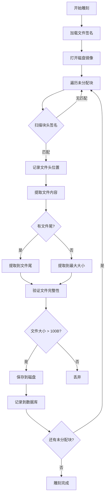

# 文件雕刻 (FileCarving) 模块文档

## 1. 模块背景

### 业务背景

在数字取证调查中，已被删除的文件往往包含关键证据。文件雕刻（File Carving）技术可以从磁盘镜像的未分配空间中恢复这些文件。

**核心挑战**：
- **数据恢复**：从已删除但未覆写的数据区域恢复文件
- **格式识别**：通过文件头/尾魔数识别文件类型
- **完整性验证**：确保恢复的文件可用
- **大规模处理**：TB 级镜像的高效处理

### 技术背景

**雕刻原理**：
1. **魔数匹配**：文件头（header）和文件尾（footer）的固定字节序列
2. **未分配空间**：仅处理未分配的磁盘块，提高效率
3. **智能提取**：从匹配位置到文件尾（或最大大小）提取数据

**支持格式**：30+ 种文件类型，包括图片、文档、压缩包、音频、视频等

## 2. 模块功能

### 支持的文件类型

#### 图片格式 (7 种)
- JPEG, PNG, GIF, BMP, WebP, TIFF, ICO

#### 文档格式 (1 种)
- PDF

#### 压缩格式 (6 种)
- ZIP, RAR (4.x/5.0), 7-Zip, GZIP, BZIP2, XZ

#### 音频格式 (5 种)
- MP3, WAV, FLAC, OGG, AAC

#### 视频格式 (4 种)
- MP4/MOV, AVI, MKV/WebM, FLV

#### 数据库格式 (1 种)
- SQLite

#### 可执行格式 (2 种)
- ELF, PE (Windows)

#### 邮件格式 (1 种)
- PST

### 核心功能

```cpp
// 使用示例
FileCarver carver;
carver.setProgressCallback(callback);
carver.setDatabasePath("carving_log.db");
carver.setValidationEnabled(true);

int recovered = carver.carve("disk_image.dd", "./recovered/");
```

## 3. 模块使用的库

**外部依赖**：
- **The Sleuth Kit (TSK)** - 未分配空间遍历

**内部依赖**：
- **SQLite3** - 雕刻日志数据库
- **AuditLog** - 审计日志

## 4. 模块实现方式

### 架构设计

```cpp
class FileCarver {
public:
    // 主雕刻方法
    int carve(const std::string& imagePath, const std::string& outputDir);

    // 配置方法
    void setProgressCallback(ProgressCallback callback);
    void setDatabasePath(const std::string& dbPath);
    void setValidationEnabled(bool enabled);

    // 自定义签名
    void addSignature(const CarvingSignature& signature);

    // 查询结果
    std::vector<CarvedFileInfo> getCarvedFiles() const;
    CarvingStatistics getStatistics() const;

private:
    std::vector<CarvingSignature> signatures_;
    std::vector<CarvedFileInfo> carvedFiles_;
    CarvingStatistics statistics_;
};
```

### 雕刻流程



### 文件签名定义

```cpp
// JPEG 签名示例
CarvingSignature jpegSig;
jpegSig.name = "JPEG";
jpegSig.extension = ".jpg";
jpegSig.header = {0xFF, 0xD8, 0xFF};  // 魔数
jpegSig.footer = {0xFF, 0xD9};         // 文件尾
jpegSig.maxSize = 10 * 1024 * 1024;     // 10MB

// ZIP 签名示例
CarvingSignature zipSig;
zipSig.name = "ZIP";
zipSig.extension = ".zip";
zipSig.header = {0x50, 0x4B, 0x03, 0x04};  // PK..
zipSig.footer = {0x50, 0x4B, 0x05, 0x06};  // PK..
zipSig.maxSize = 500 * 1024 * 1024;    // 500MB
```

## 5. API 调用

### C++ API

```cpp
#include "analyzers/FileCarving/FileCarver.h"

// 创建雕刻器
FileCarver carver;

// 设置进度回调
carver.setProgressCallback([](int current, int total, const std::string& phase) {
    std::cout << "进度: " << current << "/" << total
              << " (" << phase << ")" << std::endl;
});

// 启用数据库日志
carver.setDatabasePath("carving_log.db");

// 启用文件验证
carver.setValidationEnabled(true);

// 执行雕刻
int recoveredCount = carver.carve("disk_image.dd", "./recovered/");

std::cout << "恢复文件数: " << recoveredCount << std::endl;

// 获取统计信息
auto stats = carver.getStatistics();
std::cout << "总字节数: " << stats.totalBytesCarved << std::endl;
std::cout << "有效文件: " << stats.validFiles << std::endl;
```

### 命令行 API

```bash
# 基础雕刻
./forensic_analyzer disk_image.dd --carve

# 指定输出目录
./forensic_analyzer disk_image.dd --carve --carve-out ./recovered_files

# 结合数据库日志
./forensic_analyzer disk_image.dd --carve --db-path carving_audit.db
```

## 6. 二次开发

### 添加新的文件签名

```cpp
// 示例：添加 FLV 视频格式签名
FileCarver carver;

CarvingSignature flvSig;
flvSig.name = "FLV";
flvSig.extension = ".flv";
flvSig.header = {0x46, 0x4C, 0x56};  // FLV
flvSig.maxSize = 500 * 1024 * 1024;       // 500MB

carver.addSignature(flvSig);
```

### 自定义验证逻辑

```cpp
// 扩展文件验证
class CustomFileValidator {
public:
    static bool validate(const std::string& filePath,
                          const std::vector<uint8_t>& content) {
        // 自定义验证逻辑
        if (filePath.ends_with(".jpg")) {
            return validateJPEG(content);
        } else if (filePath.ends_with(".png")) {
            return validatePNG(content);
        }
        return true;  // 默认通过
    }
};
```

## 7. 其他

### 性能指标

- **处理速度**：~2-4 小时/500GB SSD
- **内存占用**：<100MB
- **恢复率**：取决于覆写情况

### 故障排查

| 问题 | 解决方法 |
|------|----------|
| 无文件恢复 | 检查是否有未分配空间 |
| 大量无效文件 | 调整最小文件大小阈值 |
| 内存不足 | 分批处理或增加交换空间 |

### 参考资源

- [文件雕刻原理](https://en.wikipedia.org/wiki/File_carving)

---

**最后更新**: 2026-03-11
**维护者**: ymj68520
