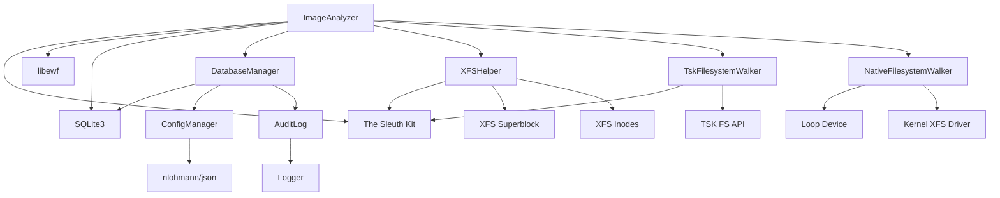
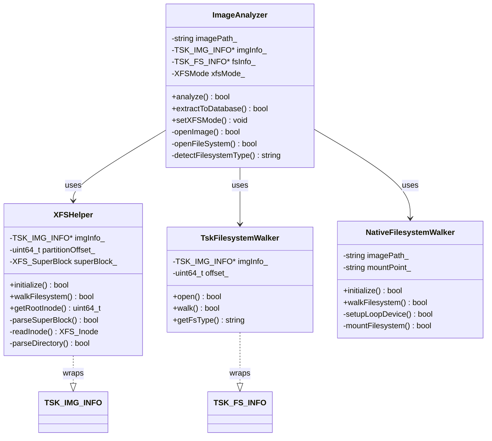
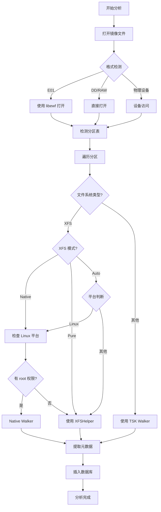
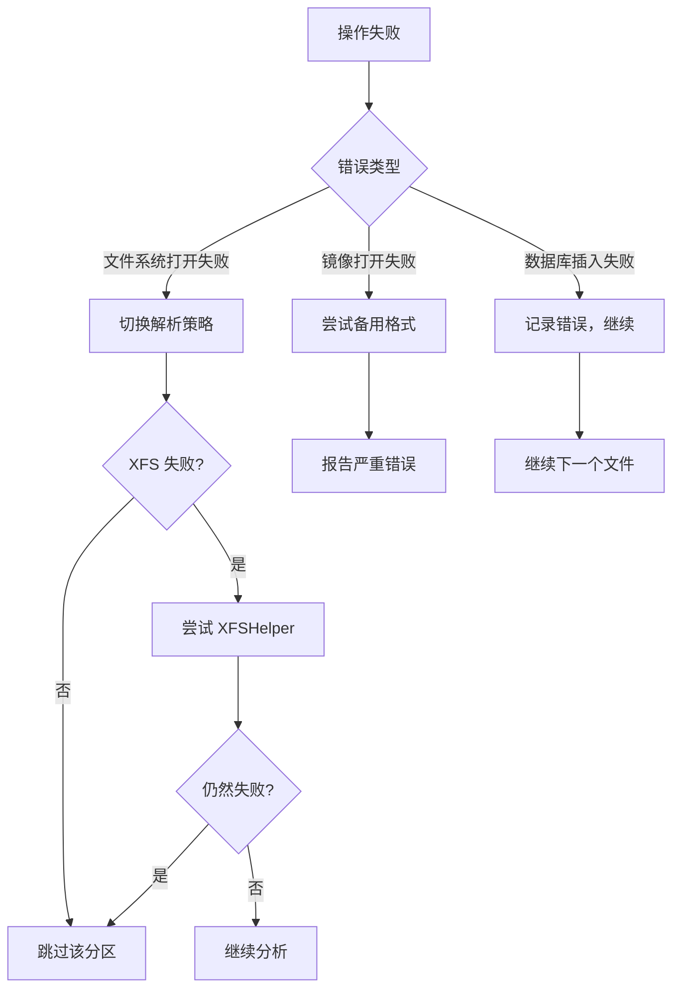

# ImageAnalyzer 模块文档

## 1. 模块背景

### 业务背景

在数字取证调查中，分析人员需要对磁盘镜像进行深入的文件系统级分析。传统工具存在以下痛点：

**核心问题**：
- **格式碎片化**：E01（EnCase）、DD/RAW、多种物理设备格式缺乏统一处理
- **XFS 文件系统支持不足**：The Sleuth Kit (TSK) 对 XFS 的跨平台支持存在严重缺陷
- **性能瓶颈**：大型磁盘镜像（TB 级别）处理效率低下
- **元数据丢失**：删除文件的元数据恢复不完整
- **跨平台兼容性**：Windows/Linux/macOS 分析结果不一致

**解决方案**：
ImageAnalyzer 模块作为取证分析管道的第一步，负责：
1. 统一处理多种磁盘镜像格式（E01、DD、RAW）
2. 提供增强的 XFS 文件系统支持（三种解析模式）
3. 完整提取文件系统元数据（含删除文件）
4. 为后续分析（分类、时间线、平台分析）提供标准化数据源

**在整体架构中的定位**：
```
磁盘镜像 → ImageAnalyzer → _raw.db → FileClassifier/EventExtractor/平台分析器
```

### 技术背景

**技术选型考虑**：

| 技术方案 | 优势 | 劣势 | 选择理由 |
|---------|------|------|----------|
| **The Sleuth Kit (TSK)** | 业界标准，支持多文件系统 | XFS 支持不稳定，性能一般 | 选为默认引擎 |
| **自定义 XFS 解析器** | 完全控制，跨平台一致 | 开发成本高，功能有限 | 实现为 Pure 模式 |
| **Linux 原生挂载** | 性能最佳，功能完整 | 仅限 Linux，需要 sudo | 实现为 Native 模式 |
| **libewf** | E01 格式标准库 | 仅支持 E01 | E01 格式必需 |

**为什么不用纯 TSK？**
- TSK 对 XFS 的支持在不同平台上差异巨大
- 某些 XFS 特性（如 B+tree 目录）在 TSK 中实现不完整
- 性能瓶颈：TB 级镜像分析耗时过长

**设计理念**：
- **渐进式降级**：Auto 模式自动选择最佳解析方法
- **跨平台优先**：Pure 模式确保非 Linux 平台也能分析 XFS
- **性能与准确性平衡**：Native 模式提供生产级性能

## 2. 模块功能

### 核心功能

#### 1. 多格式镜像支持

```cpp
// 支持的镜像格式
ImageAnalyzer analyzer("evidence.E01");     // EnCase E01 格式
ImageAnalyzer analyzer("disk.dd");          // DD/RAW 格式
ImageAnalyzer analyzer("/dev/sda");         // 物理设备直接访问
```

**特性**：
- 自动格式检测（无需手动指定）
- E01 压缩和分段支持
- 大文件处理（>2GB，使用 64 位偏移量）
- Unicode 路径支持（Windows）

#### 2. 跨平台文件系统支持

| 文件系统类型 | 支持平台 | TSK 支持 | 自定义支持 |
|-------------|----------|----------|-----------|
| NTFS | 全平台 | ✅ | ❌ |
| FAT12/16/32/exFAT | 全平台 | ✅ | ❌ |
| EXT2/3/4 | 全平台 | ✅ | ❌ |
| HFS/HFS+ | 全平台 | ✅ | ❌ |
| XFS | **增强** | ⚠️ | ✅ |

#### 3. XFS 增强支持（核心亮点）

```bash
# 三种 XFS 解析模式
forensic_analyzer image.dd --xfs-mode auto      # 智能选择（推荐）
sudo forensic_analyzer image.dd --xfs-mode native  # Linux 原生挂载
forensic_analyzer image.dd --xfs-mode pure      # 纯软件解析
```

**模式对比**：

| 模式 | 平台 | 性能 | 功能完整度 | 权限要求 |
|------|------|------|-----------|----------|
| Auto | 全平台 | ⭐⭐⭐⭐ | ⭐⭐⭐⭐ | 无 |
| Native | Linux 仅 | ⭐⭐⭐⭐⭐ | ⭐⭐⭐⭐⭐ | sudo |
| Pure | 全平台 | ⭐⭐⭐ | ⭐⭐⭐ | 无 |

#### 4. 元数据完整提取

```cpp
// 提取的元数据字段
struct FileRecord {
    int64_t inode;          // inode 编号
    std::string path;       // 完整路径
    std::string name;       // 文件名
    int64_t size;           // 文件大小
    int64_t atime;          // 访问时间
    int64_t mtime;          // 修改时间
    int64_t ctime;          // 元数据变更时间
    int64_t crtime;         // 创建时间（NTFS）
    std::string type;       // 文件类型（REG/DIR/LNK）
    std::string md5;        // MD5 校验和
    int isDeleted;          // 删除标记
    int isAllocated;        // 分配状态
    std::string permissions;// 权限（rwxrwxrwx）
    int uid;                // 用户 ID
    int gid;                // 组 ID
};
```

#### 5. 删除文件识别

- **未分配文件检测**：识别已删除但数据未覆写的文件
- **元数据恢复**：保留删除时间、原始路径等关键信息
- **时间线支持**：为 EventExtractor 提供删除事件源数据

### 边界与限制

**功能边界**：
- ❌ 不支持加密文件系统（需先解密镜像）
- ❌ 不支持 RAID 重组（需预处理）
- ❌ 不执行文件内容提取（由 FileExtractor 负责）
- ❌ 不解析文件系统内部结构（如 MFT 详情）

**已知限制**：
| 限制 | 影响 | 缓解方法 |
|------|------|----------|
| XFS Pure 模式不支持大型 B+tree 目录 | 部分文件无法遍历 | 使用 Native 模式 |
| E01 格式需要完整索引文件 | 分段文件丢失导致无法打开 | 确保所有分段文件完整 |
| 大型镜像内存占用高 | 可能需要 16GB+ 内存 | 增加交换空间或分批处理 |

**性能指标**（参考配置：8核 CPU，32GB RAM）：
- 100GB NTFS 镜像：约 30-45 分钟
- 1TB XFS 镜像（Native 模式）：约 2-3 小时
- 500GB EXT4 镜像：约 1-1.5 小时

## 3. 模块使用的库

### 依赖库清单

| 库名称 | 版本 | 用途 | 许可证 | 官网 |
|--------|------|------|--------|------|
| **The Sleuth Kit** | 4.14.0 | 磁盘镜像解析引擎 | IBM Public License | https://www.sleuthkit.org/ |
| **libewf** | 20171204 | E01 格式支持 | LGPLv3+ | https://github.com/libyal/libewf |
| **SQLite3** | 3.35.0+ | 元数据存储 | Public Domain | https://www.sqlite.org/ |
| **nlohmann/json** | 3.11.2 | 配置管理 | MIT | https://github.com/nlohmann/json |
| **Boost.System** | 1.74+ | 系统调用封装 | Boost Software License | https://www.boost.org/ |

**Linux 系统库**（Native 模式专用）：
- `loop-control` 和 `loop` 设备驱动
- `mount()` 系统调用
- `dirent.h` 和 `sys/stat.h`

### 依赖关系图



**依赖说明**：
- **硬依赖**：The Sleuth Kit、libewf、SQLite3
- **软依赖**：Boost（可选，用于高级功能）
- **平台依赖**：Native 模式仅限 Linux

## 4. 模块实现方式

### 架构设计



### 核心类说明

#### ImageAnalyzer（主控制器）
**职责**：
- 镜像文件打开和验证
- 文件系统类型检测
- 解析策略选择（XFS vs TSK vs Native）
- 数据库插入协调

**关键决策点**：
```cpp
if (filesystemType == "XFS" && xfsMode_ == XFSMode::Auto) {
    #ifdef __linux__
        return useNativeMount();  // Linux: 优先使用原生挂载
    #else
        return useXFSHelper();    // Windows/macOS: 使用自定义解析器
    #endif
}
```

#### XFSHelper（XFS 自定义解析器）
**职责**：
- 直接读取 XFS 超级块和 inode
- 解析 XFS 目录结构（local、extent、btree）
- 大端序转换（XFS 使用大端序）

**技术亮点**：
- **字节序转换**：自动处理大端序到主机字节序
- **直接磁盘访问**：绕过 TSK 的 XFS 限制
- **跨平台兼容**：纯 C++ 实现，无平台特定代码

#### TskFilesystemWalker（TSK 包装器）
**职责**：
- 封装 TSK 的文件系统遍历 API
- 处理标准文件系统（NTFS、FAT、EXT）
- 提供统一的回调接口

**回调模式**：
```cpp
walker->walk([](const FileRecord& record) {
    // 处理每个文件记录
    return true;  // 返回 false 终止遍历
});
```

#### NativeFilesystemWalker（Linux 原生挂载）
**职责**：
- 设置 loop 设备
- 挂载文件系统（只读）
- 使用 POSIX API 遍历文件

**安全机制**：
- 只读挂载（`MS_RDONLY` 标志）
- 自动卸载和清理（RAII 模式）
- 权限检查（需要 root）

### 关键流程



**错误处理流程**：


### 数据结构

**输入数据**：
```cpp
// 镜像路径（输入）
string imagePath = "/path/to/disk_image.E01";

// XFS 模式（可选配置）
XFSMode xfsMode = XFSMode::Auto;
```

**中间数据结构**：
```cpp
// TSK 内部结构
TSK_IMG_INFO* imgInfo_;      // 镜像信息
TSK_VS_INFO* vsInfo_;        // 卷系统信息
TSK_FS_INFO* fsInfo_;        // 文件系统信息

// XFS 专用结构
struct XFS_SuperBlock {
    uint32_t magic;           // 0x58465342 ("XFSB")
    uint32_t block_size;      // 块大小
    uint64_t root_inode;      // 根目录 inode
    // ... 更多字段
};

struct XFS_Inode {
    uint64_t inode_number;
    uint64_t modification_time;
    uint64_t file_size;
    uint8_t format;           // 目录格式
    // ... 更多字段
};
```

**输出数据**：
```cpp
// FileRecord（标准化文件元数据）
struct FileRecord {
    int64_t inode;
    std::string name;
    std::string path;
    int64_t size;
    int64_t atime, mtime, ctime, crtime;
    std::string type;  // "REG", "DIR", "LNK", "FIFO"
    std::string md5;
    int is_deleted;
    int is_allocated;
    std::string permissions;
    int uid, gid;
};

// PartitionInfo（分区信息）
struct PartitionInfo {
    int partition_num;
    int64_t start_offset;
    int64_t length;
    std::string description;
    std::string fs_type;
};
```

## 5. API 调用

### C++ API

#### 基础用法

```cpp
#include "analyzers/ImageAnalyzer/ImageAnalyzer.h"
#include "core/DatabaseManager/DatabaseManager.h"

int main() {
    // 1. 创建 ImageAnalyzer 实例
    ImageAnalyzer analyzer("evidence.dd");

    // 2. 设置 XFS 模式（可选）
    analyzer.setXFSMode(XFSMode::Auto);  // 推荐

    // 3. 执行分析
    if (!analyzer.analyze()) {
        std::cerr << "分析失败" << std::endl;
        return 1;
    }

    // 4. 提取到数据库
    std::string dbPath = "evidence_raw.db";
    if (!analyzer.extractToDatabase(dbPath)) {
        std::cerr << "数据库导出失败" << std::endl;
        return 1;
    }

    std::cout << "分析完成！数据库: " << dbPath << std::endl;
    return 0;
}
```

#### 高级用法

```cpp
// 获取 TSK 结构（用于高级操作）
TSK_IMG_INFO* imgInfo = analyzer.getImageInfo();
TSK_FS_INFO* fsInfo = analyzer.getFileSystemInfo();

// 检查是否为 XFS
bool isXFS = (fsInfo != nullptr && fsInfo->ftype == TSK_FS_TYPE_XFS);

// 访问分区信息
const auto& partitions = analyzer.getPartitionList();
for (const auto& part : partitions) {
    std::cout << "分区 " << part.partition_num << ": "
              << part.description << " ("
              << part.fs_type << ")" << std::endl;
}
```

#### 错误处理

```cpp
try {
    ImageAnalyzer analyzer("corrupted_image.E01");

    if (!analyzer.analyze()) {
        // 获取详细错误信息
        const char* tskError = tsk_error_get();
        std::cerr << "TSK 错误: " << tskError << std::endl;

        // 尝试备用方法
        analyzer.setXFSMode(XFSMode::Pure);
        if (!analyzer.analyze()) {
            throw std::runtime_error("无法分析镜像");
        }
    }
} catch (const std::exception& e) {
    std::cerr << "异常: " << e.what() << std::endl;
    return 1;
}
```

### 命令行 API

```bash
# 基础分析
./forensic_analyzer disk_image.dd

# 指定 XFS 模式
./forensic_analyzer xfs_disk.dd --xfs-mode native
sudo ./forensic_analyzer xfs_disk.dd --xfs-mode native  # Native 模式需要 sudo

# 指定输出目录
./forensic_analyzer image.dd --db-dir /output/path

# 完整分析管道
./forensic_analyzer image.dd --android-analyze --windows-analyze --linux-analyze
```

### REST API（通过 HTTP 服务器）

```bash
# 创建分析任务
curl -X POST http://localhost:8080/api/tasks \
  -H "Content-Type: application/json" \
  -d '{
    "image_path": "/path/to/disk_image.dd",
    "xfs_mode": "auto",
    "priority": "normal"
  }'

# 响应
{
  "task_id": "task_abc123",
  "status": "PENDING",
  "message": "任务已创建"
}

# 查询任务进度
curl http://localhost:8080/api/tasks/task_abc123

# 响应
{
  "task_id": "task_abc123",
  "status": "RUNNING",
  "phase": "IMAGE_ANALYSIS",
  "progress": 45.5,
  "message": "正在分析文件系统..."
}
```

### API 参数说明

| 参数名 | 类型 | 必填 | 说明 | 可选值 |
|--------|------|------|------|--------|
| `image_path` | string | ✅ | 磁盘镜像路径 | 绝对路径 |
| `xfs_mode` | string | ❌ | XFS 解析模式 | `auto`, `native`, `pure` |
| `db_dir` | string | ❌ | 数据库输出目录 | 默认：当前目录 |
| `priority` | string | ❌ | 任务优先级 | `low`, `normal`, `high`, `critical` |

### 返回值说明

**REST API 响应格式**：
```json
{
  "success": true,
  "task_id": "task_abc123",
  "database_path": "/output/disk_image_raw.db",
  "file_count": 52341,
  "partition_count": 3,
  "duration_seconds": 2345.6
}
```

**错误响应**：
```json
{
  "success": false,
  "error_code": "IMAGE_OPEN_FAILED",
  "message": "无法打开镜像文件：权限被拒绝",
  "details": "Error: Permission denied accessing /path/to/image.dd"
}
```

## 6. 二次开发

### 扩展点

#### 1. 添加新的镜像格式支持

**位置**：`src/analyzers/ImageAnalyzer/ImageAnalyzer.cpp`

**方法**：修改 `openImage()` 函数

```cpp
bool ImageAnalyzer::openImage() {
    // 现有代码
    if (imagePath_.find(".E01") != std::string::npos ||
        imagePath_.find(".e01") != std::string::npos) {
        imgInfo_ = tsk_img_open(1, &imagePathCstr, TSK_IMG_TYPE_EWF_EWF, 0);
    } else {
        imgInfo_ = tsk_img_open(1, &imagePathCstr, TSK_IMG_TYPE_RAW, 0);
    }

    // 新增：支持自定义格式
    else if (imagePath_.find(".custom") != std::string::npos) {
        imgInfo_ = tsk_img_open(1, &imagePathCstr,
                                TSK_IMG_TYPE_CUSTOM, 0);  // 需要在 TSK 中注册
    }

    return imgInfo_ != nullptr;
}
```

**注意事项**：
- 需要修改 TSK 源码或编写自定义镜像处理库
- 遵循 TSK 的镜像处理接口规范

#### 2. 添加新的文件系统支持

**位置**：创建新的 `src/analyzers/ImageAnalyzer/CustomFSHelper.h` 和 `.cpp`

**示例**：支持 ZFS 文件系统

```cpp
// CustomFSHelper.h
#pragma once
#include "ImageAnalyzerDataTypes.h"
#include <tsk/libtsk.h>

class CustomFSHelper {
public:
    explicit CustomFSHelper(TSK_IMG_INFO* imgInfo, uint64_t partitionOffset);
    ~CustomFSHelper();

    bool initialize();
    bool walkFilesystem(FileCallback callback);
    std::string getFilesystemName() const;

private:
    TSK_IMG_INFO* imgInfo_;
    uint64_t partitionOffset_;

    // ZFS 专用结构
    struct ZFS_SuperBlock {
        uint64_t magic;
        uint64_t version;
        // ... 更多字段
    };

    bool parseSuperBlock();
    bool readInode(uint64_t inodeNum, ZFS_Inode& inode);
    bool parseDirectory(uint64_t dirInode, FileCallback callback);
};
```

**集成点**：修改 `ImageAnalyzer::openFileSystem()`

```cpp
bool ImageAnalyzer::openFileSystem(TSK_VS_PART_INFO* part) {
    // 检测文件系统类型
    std::string fsType = detectFilesystemType(part);

    if (fsType == "ZFS") {
        customFSHelper_ = std::make_unique<CustomFSHelper>(imgInfo_, part->start);
        if (customFSHelper_->initialize()) {
            return true;
        }
    }

    // 回退到 TSK
    fsInfo_ = tsk_fs_open_img(imgInfo_, part->start, TSK_FS_TYPE_DETECT);
    return fsInfo_ != nullptr;
}
```

#### 3. 自定义元数据提取

**位置**：修改 `extractToDatabase()` 方法

```cpp
bool ImageAnalyzer::extractToDatabase(const std::string& dbPath) {
    DatabaseManager dbManager(dbPath);
    if (!dbManager.initialize()) return false;

    // 自定义元数据字段
    auto callback = [&](const FileRecord& record) {
        // 添加自定义字段
        FileRecord enhancedRecord = record;
        enhancedRecord.customField = calculateCustomMetadata(record);

        // 插入数据库
        dbManager.insertFileRecord(enhancedRecord);

        return true;  // 继续遍历
    };

    // 执行遍历
    return walkFilesystem(callback);
}
```

### 添加新功能的步骤

#### 步骤 1：定义数据结构

在 `ImageAnalyzerDataTypes.h` 中添加新结构：

```cpp
// 新增：扩展文件元数据
struct ExtendedFileRecord : public FileRecord {
    std::string digitalSignature;    // 数字签名
    std::vector<std::string> alternateStreams;  // NTFS 备用流
    std::map<std::string, std::string> extendedAttributes;  // 扩展属性
};
```

#### 步骤 2：实现提取逻辑

在对应的 Helper 类中实现：

```cpp
bool XFSHelper::extractExtendedAttributes(uint64_t inodeNum,
                                         ExtendedFileRecord& record) {
    // 读取扩展属性
    XFS_Inode inode;
    if (!readInode(inodeNum, inode)) {
        return false;
    }

    // 解析扩展属性
    for (const auto& attr : inode.extended_attributes) {
        record.extendedAttributes[attr.name] = attr.value;
    }

    return true;
}
```

#### 步骤 3：更新数据库模式

修改 `DatabaseManager` 的 SQL schema：

```sql
-- 添加新字段
ALTER TABLE files ADD COLUMN digital_signature TEXT;
ALTER TABLE files ADD COLUMN extended_attributes TEXT;  -- JSON 格式
```

#### 步骤 4：更新 API 接口

修改 HTTP 服务器响应：

```cpp
// routes/ForensicsRoutes.cpp
crow::json::wvalue response = {
    {"inode", record.inode},
    {"path", record.path},
    {"digital_signature", record.digitalSignature},
    {"extended_attributes", crow::json::load(record.extendedAttributes)}
};
```

### 代码示例

#### 完整的自定义分析器

```cpp
// CustomAnalyzer.h
#pragma once
#include "ImageAnalyzer.h"
#include "core/DatabaseManager/DatabaseManager.h"

class CustomAnalyzer : public ImageAnalyzer {
public:
    explicit CustomAnalyzer(const std::string& imagePath);

    // 自定义分析功能
    bool analyzeWithFilter(const std::function<bool(const FileRecord&)>& filter);
    bool extractOnlyDeleted();
    bool extractBySizeRange(int64_t minSize, int64_t maxSize);

private:
    bool customExtract(const std::function<bool(const FileRecord&)>& predicate);
};

// CustomAnalyzer.cpp
#include "CustomAnalyzer.h"

bool CustomAnalyzer::extractOnlyDeleted() {
    return customExtract([](const FileRecord& record) {
        return record.is_deleted == 1;
    });
}

bool CustomAnalyzer::extractBySizeRange(int64_t minSize, int64_t maxSize) {
    return customExtract([minSize, maxSize](const FileRecord& record) {
        return record.size >= minSize && record.size <= maxSize;
    });
}

bool CustomAnalyzer::customExtract(
    const std::function<bool(const FileRecord&)>& predicate) {

    DatabaseManager dbManager(getDefaultDbPath());
    if (!dbManager.initialize()) return false;

    auto callback = [&](const FileRecord& record) {
        if (predicate(record)) {
            return dbManager.insertFileRecord(record);
        }
        return true;
    };

    return ImageAnalyzer::walkFilesystem(callback);
}
```

### 最佳实践

#### 性能优化

**1. 批量数据库插入**：
```cpp
// 错误：逐条插入
for (const auto& file : files) {
    dbManager.insertFileRecord(file);  // 每次 I/O
}

// 正确：批量事务
dbManager.beginTransaction();
for (const auto& file : files) {
    dbManager.insertFileRecord(file);
    if (++count % 1000 == 0) {
        dbManager.commit();  // 每 1000 条提交一次
        dbManager.beginTransaction();
    }
}
dbManager.commit();
```

**2. 避免不必要的字符串拷贝**：
```cpp
// 错误：多次拷贝
std::string path = record.path;
std::string name = record.name;
processFile(path, name);

// 正确：使用 const 引用
const std::string& path = record.path;
const std::string& name = record.name;
processFile(path, name);
```

**3. 预分配内存**：
```cpp
std::vector<FileRecord> records;
records.reserve(100000);  // 预分配容量
```

#### 常见陷阱

**1. TSK 资源泄漏**：
```cpp
// 错误：忘记释放
TSK_FS_INFO* fsInfo = tsk_fs_open_img(...);
// 忘记调用 tsk_fs_close(fsInfo);

// 正确：使用 RAII
struct FSInfoGuard {
    TSK_FS_INFO* info;
    explicit FSInfoGuard(TSK_FS_INFO* fs) : info(fs) {}
    ~FSInfoGuard() { if (info) tsk_fs_close(info); }
};
```

**2. 字节序转换错误**：
```cpp
// 错误：假设 XFS 是小端序
uint32_t value = xfsInode->magic;

// 正确：显式转换
uint32_t value = be32toh(xfsInode->magic);  // 大端序转主机序
```

**3. 线程安全问题**：
```cpp
// 错误：多线程共享 TSK 结构
std::thread t1([&]() { tsk_fs_dir_walk(fsInfo, ...); });
std::thread t2([&]() { tsk_fs_dir_walk(fsInfo, ...); });  // 竞争！

// 正确：每个线程独立实例
std::thread t1([&]() {
    TSK_FS_INFO* fsInfo1 = tsk_fs_open_img(...);
    tsk_fs_dir_walk(fsInfo1, ...);
});
```

#### 调试技巧

**1. 启用详细日志**：
```cpp
Logger::instance().setLevel(LogLevel::DEBUG);
Logger::instance().setOutput(LogOutput::FILE, "image_analyzer_debug.log");
```

**2. TSK 错误信息**：
```cpp
if (!imgInfo_) {
    std::cerr << "TSK 错误: " << tsk_error_get() << std::endl;
    std::cerr << "错误代码: " << tsk_error_get_errno() << std::endl;
}
```

**3. 进度追踪**：
```cpp
size_t totalFiles = 0;
auto callback = [&](const FileRecord& record) {
    if (++totalFiles % 1000 == 0) {
        std::cout << "已处理: " << totalFiles << " 个文件\r" << std::flush;
    }
    return true;
};
```

## 7. 其他

### 测试

**单元测试位置**：
```
tests/UnitTest/test_image_analyzer_gtest.cpp
```

**关键测试用例**：
```cpp
TEST(ImageAnalyzerTest, OpenE01Image) {
    ImageAnalyzer analyzer("test_data/test.E01");
    EXPECT_TRUE(analyzer.analyze());
}

TEST(ImageAnalyzerTest, XFSNativeMode) {
    ImageAnalyzer analyzer("test_data/xfs_disk.dd");
    analyzer.setXFSMode(XFSMode::Native);
    EXPECT_TRUE(analyzer.analyze());
}

TEST(ImageAnalyzerTest, ExtractToDatabase) {
    ImageAnalyzer analyzer("test_data/test.dd");
    ASSERT_TRUE(analyzer.analyze());

    std::string dbPath = "test_output.db";
    EXPECT_TRUE(analyzer.extractToDatabase(dbPath));

    // 验证数据库内容
    DatabaseManager dbManager(dbPath);
    EXPECT_GT(dbManager.getFileCount(), 0);
}
```

**运行测试**：
```bash
cd build
./test_image_analyzer --gtest_filter="ImageAnalyzerTest.*"
```

**集成测试**：
```bash
# Android 镜像测试
bash tests/create_android_image.sh

# E01 镜像 HTTP 测试
bash tests/test_e01_http.sh
```

### 配置

**配置文件位置**：
- 环境变量：`.env` 文件
- 代码加载：`ConfigManager::instance().load(".env")`

**相关配置项**：
```env
# XFS 模式（默认）
XFS_MODE=auto

# 数据库配置
DB_DIR=data
DB_BUSY_TIMEOUT_MS=5000

# 日志配置
LOG_LEVEL=INFO
LOG_OUTPUT=FILE
LOG_FILE=debug.log

# 性能配置
MAX_IMAGE_SIZE_GB=1000
BATCH_INSERT_SIZE=1000
```

**运行时配置**：
```cpp
// 程序化设置
ImageAnalyzer analyzer("image.dd");
analyzer.setXFSMode(XFSMode::Native);
ConfigManager::instance().set("DB_DIR", "/custom/output");
```

### 故障排查

| 问题 | 可能原因 | 解决方法 |
|------|----------|----------|
| **无法打开 E01 文件** | 缺少 `.e01` 索引文件 | 确保所有分段文件完整：`image.E01`, `image.E02`, ... |
| **XFS 解析失败** | Native 模式无 root 权限 | 使用 `sudo` 运行或切换到 Pure 模式 |
| **内存不足** | 镜像过大，内存占用高 | 增加交换空间或使用更大的机器 |
| **分析速度慢** | Pure 模式性能瓶颈 | 在 Linux 上使用 Native 模式 |
| **数据库插入失败** | 磁盘空间不足或权限问题 | 检查磁盘空间和文件权限 |
| **TSK 版本不兼容** | 编译时 TSK 版本与运行时不同 | 重新编译项目，确保使用 TSK 4.14.0 |
| **分区检测错误** | 镜像分区表损坏 | 使用 `tsk_vs_open()` 的 `TSK_VS_TYPE_DETECT` 参数 |

**调试命令**：
```bash
# 检查镜像文件
ewfinfo image.E01

# 验证 XFS 超级块
sudo xfs_db -c "sb" -c "print" /dev/loop0

# 检查数据库完整性
sqlite3 evidence_raw.db "PRAGMA integrity_check;"

# 查看分区信息
fdisk -l disk_image.dd
```

### 相关模块

- **[DatabaseManager](../../core/DatabaseManager.md)** - 数据库管理，存储提取的元数据
- **[FileClassifier](../../core/FileClassifier.md)** - 文件分类，处理 ImageAnalyzer 的输出
- **[EventExtractor](../../core/EventExtractor.md)** - 事件提取，从元数据生成时间线
- **[AndroidAnalyzer](../AndroidAnalyzer.md)** - Android 分析，基于 ImageAnalyzer 数据
- **[WindowsFilesAnalyzer](../WindowsFilesAnalyzer.md)** - Windows 分析，基于 ImageAnalyzer 数据
- **[LinuxFilesAnalyzer](../LinuxFilesAnalyzer.md)** - Linux 分析，基于 ImageAnalyzer 数据

### 参考资源

**官方文档**：
- [The Sleuth Kit API 文档](https://www.sleuthkit.org/sleuthkit/docs/api-docs/)
- [libewf 文档](https://github.com/libyal/libewf)
- [SQLite 文档](https://www.sqlite.org/docs.html)

**相关标准**：
- [EnCase E01 格式规范](https://www.enase.com/)
- [XFS 文件系统规范](https://xfs.org/docs/xfs-dev-reference/XFS_Filesystem_Structure.html)

**推荐阅读**：
- "File System Forensic Analysis" by Brian Carrier
- "The Sleuth Kit Investigator's Guide"
- [XFS 维基百科](https://en.wikipedia.org/wiki/XFS)

### 变更历史

| 版本 | 日期 | 变更内容 | 作者 |
|------|------|----------|------|
| 1.0.0 | 2024-01-15 | 初始版本，基础镜像分析功能 | Forensics Team |
| 1.1.0 | 2024-03-20 | 添加 XFS Pure 模式支持 | Forensics Team |
| 1.2.0 | 2024-06-10 | 添加 Native 模式和 Auto 选择 | Forensics Team |
| 1.3.0 | 2024-09-05 | 性能优化，批量数据库插入 | Forensics Team |
| 1.4.0 | 2024-11-22 | 增强错误处理和恢复机制 | Forensics Team |
| 2.0.0 | 2025-01-10 | 重构为模块化架构，分离 Walker 类 | Forensics Team |

---

**最后更新**: 2026-03-11
**维护者**: ymj68520
**联系方式**: 见项目 GitHub 仓库
