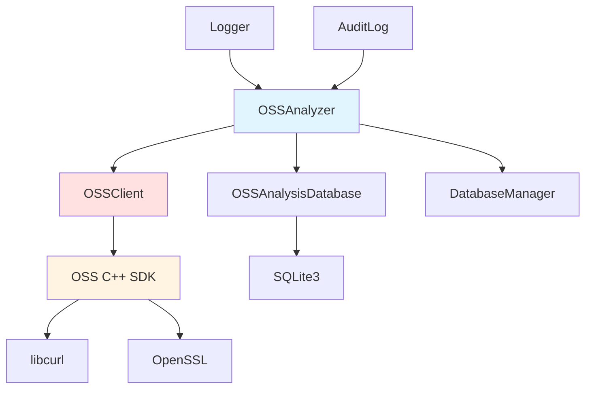
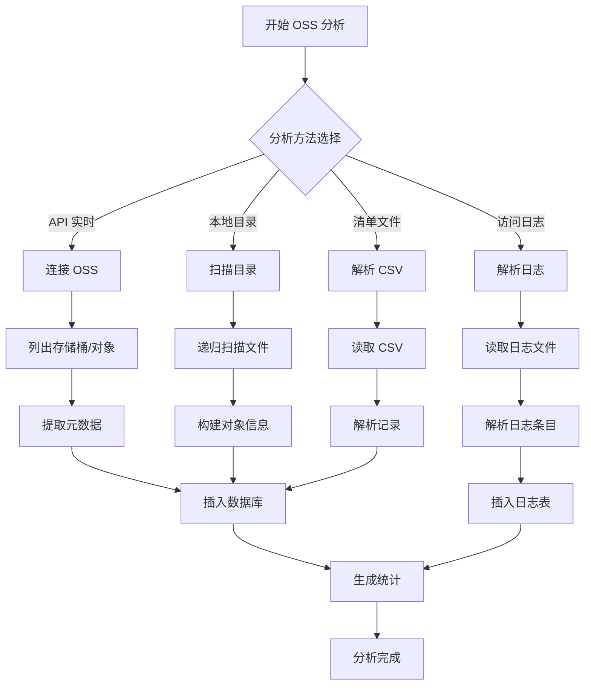

# OSSAnalyzer 模块文档

## 1. 模块背景

### 业务背景

云存储已成为企业和个人数据存储的主要方式。在数字取证调查中，需要从云存储中提取和分析数据：

**核心需求**：
- **云端数据获取**：直接访问阿里云 OSS 存储桶
- **离线数据分析**：处理已导出的 OSS 数据
- **访问日志分析**：重建用户操作时间线
- **多模式支持**：API 直连、本地目录、清单文件、访问日志

**解决挑战**：
- **认证管理**：支持多种认证方式（AK/SK、STS、RAM Role）
- **大规模数据**：处理包含数百万对象的存储桶
- **网络依赖**：API 分析需要稳定网络连接
- **取证完整性**：确保数据获取的完整性和可追溯性

### 技术背景

**阿里云 OSS C++ SDK**：
- 官方 C++ SDK 提供 API 访问能力
- 支持多种认证方式和代理配置
- 提供对象、存储桶、日志操作接口

**取证分析模式**：
```
云端数据 → API 分析 / 导出分析 / 日志分析
          ↓
     SQLite 数据库 (_oss.db)
          ↓
    统计分析 / 时间线重建
```

## 2. 模块功能

### 核心功能

#### 1. API 实时分析

**功能描述**：直接连接阿里云 OSS 进行实时数据分析

```cpp
OSSConnectionConfig config;
config.endpoint = "oss-cn-hangzhou.aliyuncs.com";
config.accessKeyId = "your-access-key-id";
config.accessKeySecret = "your-access-key-secret";

OSSAnalyzer analyzer(config, dbManager);
analyzer.analyzeFromAPI("my-bucket", "prefix/");
```

**提取数据**：
- 存储桶信息（区域、ACL、版本控制）
- 对象元数据（大小、类型、ETag、最后修改时间）
- 用户自定义元数据
- 对象版本信息

**优势**：
- 实时数据，完整元数据
- 无需预先导出
- 支持前缀过滤

**限制**：
- 需要网络连接和有效认证
- 受 API 速率限制
- 成本考虑（请求费用）

#### 2. 本地目录分析

**功能描述**：分析已导出到本地的 OSS 数据

```cpp
analyzer.analyzeFromLocalDirectory(
    "/path/to/exported/oss/data",
    "original-bucket-name"
);
```

**使用场景**：
- 离线分析环境
- 大规模数据一次性导出
- 避免网络依赖

**数据要求**：
- 保持原始目录结构
- 文件路径映射为对象 Key

#### 3. 清单文件分析

**功能描述**：解析 OSS 清单（Inventory）CSV 文件

```cpp
analyzer.analyzeFromInventory("/path/to/inventory.csv");
```

**清单格式**：
```csv
Bucket,Key,Size,LastModified,ETag,StorageClass
my-bucket,path/to/file.jpg,102400,2024-01-01T00:00:00Z,"abc123",Standard
```

**优势**：
- 结构化数据，易于解析
- 包含完整对象列表
- 支持定期清单

**限制**：
- 需要预先配置清单功能
- CSV 格式限制

#### 4. 访问日志分析

**功能描述**：分析 OSS 访问日志，重建操作时间线

**本地日志**：
```cpp
analyzer.analyzeAccessLogs("/path/to/log/files/");
```

**远程日志**：
```cpp
analyzer.fetchAndAnalyzeAccessLogs(
    "my-bucket",
    startTime,  // Unix 时间戳
    endTime
);
```

**提取信息**：
- 操作类型（GetObject, PutObject, DeleteObject）
- 请求时间戳
- 客户端 IP 和 User-Agent
- HTTP 状态码
- 传输字节数
- 请求耗时

**应用场景**：
- 数据泄露调查
- 异常访问检测
- 用户行为分析
- 取证时间线重建

#### 5. 统计分析

**功能描述**：生成多维度的存储统计信息

```cpp
auto summary = analyzer.getAnalysisSummary();

// 返回结构：
// - totalObjects: 对象总数
// - totalSize: 总大小（字节）
// - objectsByStorageClass: 各存储类别的对象数
// - objectsByExtension: 各扩展名的对象数
// - operationCounts: 操作类型统计
```

**统计维度**：
- **存储类别**：Standard, IA, Archive, Cold Archive
- **文件类型**：按扩展名分组
- **时间分布**：按修改时间分组
- **访问频率**：基于日志分析

### 边界与限制

**功能边界**：
- ❌ 不支持对象内容下载（仅元数据）
- ❌ 不修改云端数据（只读分析）
- ❌ 不恢复已删除对象（需版本控制）
- ❌ 不处理加密对象（元数据仅）

**已知限制**：
| 限制 | 影响 | 缓解方法 |
|------|------|----------|
| API 速率限制 | 大存储桶分析耗时 | 分页处理，增加超时 |
| 网络依赖 | 离线环境无法使用 | 使用本地目录模式 |
| 认证要求 | 需要有效凭证 | 使用临时凭证或导出数据 |
| 成本考虑 | API 请求产生费用 | 批量操作，减少请求 |

**性能指标**：
- **API 分析**：~1000 对象/分钟（取决于网络）
- **数据库插入**：~10,000 记录/秒
- **内存占用**：~50MB 基线 + ~1MB/1000 对象

## 3. 模块使用的库

### 依赖库清单

| 库名称 | 版本 | 用途 | 许可证 |
|--------|------|------|--------|
| **Alibaba Cloud OSS C++ SDK** | latest | OSS API 访问 | Apache 2.0 |
| **libcurl** | latest | HTTP 客户端 | MIT/X |
| **OpenSSL** | latest | 加密通信 | Apache 2.0 |
| **SQLite3** | 3.35.0+ | 结果数据库 | Public Domain |

### 内部依赖

- **DatabaseManager** - 数据库基础设施
- **Logger** - 日志系统
- **AuditLog** - 审计日志
- **ConfigManager** - 配置管理

### 依赖关系图



## 4. 模块实现方式

### 核心类

```cpp
class OSSAnalyzer {
public:
    // 构造函数
    OSSAnalyzer(const OSSConnectionConfig& config, DatabaseManager* dbManager);

    // 初始化
    bool initialize();

    // 主分析入口
    void analyzeOSSData();  // 自动检测方法

    // 分析方法
    bool analyzeFromAPI(const std::string& bucketName = "",
                       const std::string& prefix = "");
    bool analyzeFromLocalDirectory(const std::string& localDir,
                                  const std::string& bucketName = "local");
    bool analyzeFromInventory(const std::string& csvPath);
    bool analyzeAccessLogs(const std::string& logPath);
    bool fetchAndAnalyzeAccessLogs(const std::string& bucketName,
                                  int64_t startTime = 0,
                                  int64_t endTime = 0);

    // 查询方法
    std::vector<OSSObjectInfo> getAllObjects();
    std::vector<OSSObjectInfo> getObjectsByBucket(const std::string& bucket);
    std::vector<OSSObjectInfo> getObjectsByExtension(const std::string& extension);
    std::vector<OSSAccessLogEntry> getAccessLogs(int64_t startTime = 0,
                                                int64_t endTime = 0);
    OSSAnalysisSummary getAnalysisSummary();

    // 配置
    void setOutputDbPath(const std::string& path);
    void setProgressCallback(ProgressCallback callback);
    std::string getLastError() const;

private:
    OSSConnectionConfig config_;
    std::unique_ptr<OSSClient> client_;
    std::unique_ptr<OSSAnalysisDatabase> ossDb_;
    DatabaseManager* dbManager_;
};
```

### OSSClient 类

```cpp
class OSSClient {
public:
    OSSClient(const OSSConnectionConfig& config);

    // 存储桶操作
    std::vector<OSSBucketInfo> listBuckets();
    OSSBucketInfo getBucketInfo(const std::string& bucketName);
    bool getBucketLogging(std::string& loggingBucket, std::string& loggingPrefix);

    // 对象操作
    std::vector<OSSObjectInfo> listObjects(const std::string& bucketName,
                                          const std::string& prefix = "",
                                          const std::string& marker = "",
                                          int maxKeys = 1000);
    int64_t listAllObjects(const std::string& bucketName,
                          const std::string& prefix,
                          ObjectListCallback callback,
                          ProgressCallback progressCallback = nullptr);
    OSSObjectInfo getObjectMeta(const std::string& bucketName,
                               const std::string& objectKey);
    bool downloadObject(const std::string& bucketName,
                       const std::string& objectKey,
                       const std::string& localPath,
                       ProgressCallback progressCallback = nullptr);

    // 访问日志操作
    std::vector<OSSObjectInfo> listAccessLogFiles(const std::string& loggingBucket,
                                                 const std::string& loggingPrefix,
                                                 int64_t startTime = 0,
                                                 int64_t endTime = 0);

    // 错误处理
    std::string getLastError() const;

private:
    class Impl;
    std::unique_ptr<Impl> impl_;  // PIMPL 模式
};
```

### 数据结构

```cpp
struct OSSConnectionConfig {
    std::string accessKeyId;
    std::string accessKeySecret;
    std::string securityToken;        // STS token (可选)
    std::string endpoint;
    std::string bucket;
    std::string region;

    int connectTimeoutMs = 10000;
    int requestTimeoutMs = 30000;
    int maxConnections = 16;

    bool useProxy = false;
    std::string proxyHost;
    int proxyPort = 0;

    bool enableCrc = true;
    bool enableMD5 = false;
};

struct OSSObjectInfo {
    std::string key;                    // 对象 Key
    std::string bucket;                 // 存储桶名称
    int64_t size = 0;                   // 大小（字节）
    std::string etag;                   // ETag
    int64_t lastModified = 0;           // 最后修改时间
    std::string storageClass;           // 存储类别
    std::string contentType;            // MIME 类型
    std::string owner;                  // 所有者
    std::map<std::string, std::string> userMeta;  // 用户元数据

    // 分析字段
    int64_t analyzedAt = 0;
    std::string md5Hash;
    bool isDeleted = false;
    std::string versionId;
};

struct OSSAccessLogEntry {
    std::string requestId;
    int64_t timestamp = 0;
    std::string operation;              // GetObject/PutObject/etc
    std::string bucket;
    std::string objectKey;
    std::string remoteIP;
    std::string userAgent;
    std::string accesserId;
    int httpStatus = 0;
    int64_t bytesSent = 0;
    int64_t objectSize = 0;
    int64_t timeTakenMs = 0;
    std::string referer;
    std::string host;
    std::string signatureVersion;
    bool sslEnabled = false;
};

struct OSSAnalysisSummary {
    int64_t totalObjects = 0;
    int64_t totalSize = 0;
    std::map<std::string, int64_t> objectsByStorageClass;
    std::map<std::string, int64_t> objectsByExtension;
    std::map<std::string, int64_t> operationCounts;
    std::map<std::string, int64_t> accessByIP;
};
```

### 数据库模式

```sql
-- 对象表
CREATE TABLE oss_objects (
    id INTEGER PRIMARY KEY AUTOINCREMENT,
    bucket TEXT NOT NULL,
    key TEXT NOT NULL,
    size INTEGER DEFAULT 0,
    etag TEXT,
    last_modified INTEGER,
    storage_class TEXT,
    content_type TEXT,
    owner TEXT,
    user_metadata TEXT,              -- JSON 格式
    version_id TEXT,
    is_deleted INTEGER DEFAULT 0,
    md5_hash TEXT,
    analyzed_at INTEGER,
    UNIQUE(bucket, key, version_id)
);

-- 访问日志表
CREATE TABLE oss_access_logs (
    id INTEGER PRIMARY KEY AUTOINCREMENT,
    request_id TEXT,
    timestamp INTEGER,
    operation TEXT,
    bucket TEXT,
    object_key TEXT,
    remote_ip TEXT,
    user_agent TEXT,
    accesser_id TEXT,
    http_status INTEGER,
    bytes_sent INTEGER,
    object_size INTEGER,
    time_taken_ms INTEGER,
    referer TEXT,
    host TEXT,
    signature_version TEXT,
    ssl_enabled INTEGER DEFAULT 0
);

-- 存储桶表
CREATE TABLE oss_buckets (
    id INTEGER PRIMARY KEY AUTOINCREMENT,
    name TEXT UNIQUE NOT NULL,
    region TEXT,
    endpoint TEXT,
    acl TEXT,
    owner TEXT,
    creation_date INTEGER,
    versioning_enabled INTEGER DEFAULT 0,
    logging_enabled INTEGER DEFAULT 0,
    logging_bucket TEXT,
    logging_prefix TEXT,
    storage_class TEXT,
    object_count INTEGER DEFAULT 0,
    total_size INTEGER DEFAULT 0,
    analyzed_at INTEGER
);
```

### 分析流程



## 5. API 调用

### C++ API

```cpp
#include "analyzers/OSSAnalyzer/OSSAnalyzer.h"
using namespace ForensicAnalyzer::OSS;

// 1. 配置连接
OSSConnectionConfig config;
config.endpoint = "oss-cn-hangzhou.aliyuncs.com";
config.accessKeyId = "your-access-key-id";
config.accessKeySecret = "your-access-key-secret";
config.bucket = "my-bucket";
config.region = "oss-cn-hangzhou";

// 2. 创建分析器
OSSAnalyzer analyzer(config, dbManager);
analyzer.setOutputDbPath("oss_analysis.db");

// 3. 设置进度回调
analyzer.setProgressCallback([](const std::string& phase,
                                int64_t current,
                                int64_t total) {
    std::cout << "进度: " << phase
              << " - " << current << "/" << total << std::endl;
});

// 4. 初始化
if (!analyzer.initialize()) {
    std::cerr << "初始化失败: " << analyzer.getLastError() << std::endl;
    return 1;
}

// 5. API 分析
analyzer.analyzeFromAPI("my-bucket", "images/");

// 6. 查询结果
auto allObjects = analyzer.getAllObjects();
std::cout << "总对象数: " << allObjects.size() << std::endl;

auto images = analyzer.getObjectsByExtension(".jpg");
std::cout << "JPEG 文件数: " << images.size() << std::endl;

// 7. 访问日志分析
analyzer.fetchAndAnalyzeAccessLogs("my-bucket",
                                   startTime,  // 开始时间戳
                                   endTime);    // 结束时间戳

// 8. 统计分析
auto summary = analyzer.getAnalysisSummary();
std::cout << "总对象: " << summary.totalObjects << std::endl;
std::cout << "总大小: " << summary.totalSize << " 字节" << std::endl;

for (const auto& [storageClass, count] : summary.objectsByStorageClass) {
    std::cout << storageClass << ": " << count << " 对象" << std::endl;
}
```

### 命令行 API

```bash
# API 分析（未来支持）
./forensic_analyzer --oss-analyze --bucket my-bucket --prefix images/

# 本地目录分析
./forensic_analyzer --oss-local /path/to/export --bucket my-bucket

# 清单文件分析
./forensic_analyzer --oss-inventory inventory.csv

# 访问日志分析
./forensic_analyzer --oss-logs /path/to/logs/
```

### 配置文件

```env
# .env 配置
OSS_ENDPOINT=oss-cn-hangzhou.aliyuncs.com
OSS_ACCESS_KEY_ID=your-access-key-id
OSS_ACCESS_KEY_SECRET=your-access-key-secret
OSS_BUCKET=default-bucket-name
OSS_REGION=oss-cn-hangzhou

OSS_CONNECT_TIMEOUT=10000
OSS_REQUEST_TIMEOUT=30000
OSS_MAX_CONNECTIONS=16

OSS_PROXY_HOST=proxy.example.com
OSS_PROXY_PORT=8080
```

### 认证方式

**AK/SK 认证**（长期凭证）：
```cpp
config.accessKeyId = "LTAI5t...";
config.accessKeySecret = "xxx...";
```

**STS Token 认证**（临时凭证）：
```cpp
config.accessKeyId = "STS.xxx...";
config.accessKeySecret = "xxx...";
config.securityToken = "CAESxxx...";
```

**ECS RAM Role**（无密码）：
```cpp
config.useEcsRamRole = true;
config.roleName = "oss-access-role";
```

**匿名访问**（公共存储桶）：
```cpp
config.accessKeyId.clear();
config.accessKeySecret.clear();
```

## 6. 二次开发

### 添加新的分析模式

```cpp
// 示例：添加跨区域复制分析
class OSSAnalyzer {
public:
    // 新增：分析跨区域复制配置
    bool analyzeReplication(const std::string& bucketName) {
        // 获取复制配置
        auto replicationConfig = client_->getBucketReplication(bucketName);

        // 分析复制规则
        for (const auto& rule : replicationConfig.rules) {
            // 存储到数据库
            ossDb_->insertReplicationRule(rule);
        }

        return true;
    }

    // 新增：分析生命周期规则
    bool analyzeLifecycle(const std::string& bucketName) {
        auto lifecycleConfig = client_->getBucketLifecycle(bucketName);

        for (const auto& rule : lifecycleConfig.rules) {
            ossDb_->insertLifecycleRule(rule);
        }

        return true;
    }
};
```

### 自定义日志解析器

```cpp
// 扩展访问日志解析
class CustomAccessLogParser {
public:
    static std::vector<OSSAccessLogEntry> parseLogLine(
        const std::string& line) {

        OSSAccessLogEntry entry;
        std::istringstream iss(line);
        std::string field;

        // 解析 OSS 日志格式
        // 示例: "bucket-name [10/Mar/2024:00:00:00 +0000] ..."
        std::getline(iss, entry.bucket, ' ');
        std::getline(iss, field, '[');
        std::getline(iss, field, ']');
        entry.timestamp = parseTimestamp(field);

        // 继续解析其他字段...

        return {entry};
    }

private:
    static int64_t parseTimestamp(const std::string& ts) {
        // "10/Mar/2024:00:00:00 +0000" -> Unix timestamp
        std::tm tm = {};
        std::istringstream iss(ts);
        iss >> std::get_time(&tm, "%d/%b/%Y:%H:%M:%S");
        return std::mktime(&tm);
    }
};
```

### 集成到主分析流程

```cpp
// main.cpp
if (classifyResult.category == FileCategory::CLOUD_FILES ||
    sourceType == AnalysisSourceType::OSS_BUCKET) {

    OSSAnalyzer ossAnalyzer(config, &dbManager);
    ossAnalyzer.setOutputDbPath(outputBase + "_oss.db");
    ossAnalyzer.setProgressCallback(progressCallback);

    if (ossAnalyzer.initialize()) {
        ossAnalyzer.analyzeOSSData();
    }
}
```

### 批处理优化

```cpp
// 批量插入优化
bool OSSAnalysisDatabase::insertObjects(
    const std::vector<OSSObjectInfo>& objects) {

    const int batchSize = 1000;
    beginTransaction();

    for (size_t i = 0; i < objects.size(); i += batchSize) {
        size_t end = std::min(i + batchSize, objects.size());

        for (size_t j = i; j < end; ++j) {
            insertObject(objects[j]);
        }

        // 每批提交一次
        commit();
        beginTransaction();
    }

    commit();
    return true;
}
```

## 7. 其他

### 测试

```cpp
// tests/test_oss_analyzer.cpp
TEST(OSSAnalyzerTest, LocalDirectoryAnalysis) {
    OSSConnectionConfig config;
    OSSAnalyzer analyzer(config, dbManager);

    bool success = analyzer.analyzeFromLocalDirectory(
        "/test/data/oss-export",
        "test-bucket"
    );

    EXPECT_TRUE(success);

    auto objects = analyzer.getAllObjects();
    EXPECT_GT(objects.size(), 0);
}

TEST(OSSAnalyzerTest, LogParsing) {
    OSSAnalyzer analyzer(config, dbManager);
    bool success = analyzer.analyzeAccessLogs("/test/data/logs/");

    EXPECT_TRUE(success);

    auto logs = analyzer.getAccessLogs();
    EXPECT_GT(logs.size(), 0);
}
```

### 故障排查

| 问题 | 可能原因 | 解决方法 |
|------|----------|----------|
| 认证失败 | 凭证错误或过期 | 检查 AK/SK，使用 STS token |
| 连接超时 | 网络问题或防火墙 | 增加超时值，配置代理 |
| 数据库锁定 | 并发写入冲突 | 使用事务，减少并发 |
| 内存不足 | 对象数量过多 | 分页处理，增加批处理间隔 |

### 安全建议

**凭证管理**：
- 使用环境变量存储密钥
- 优先使用 STS 临时凭证
- 启用 RAM 角色减少凭证暴露

**访问控制**：
- 遵循最小权限原则
- 使用 IP 白名单
- 启用 MFA（多因素认证）

**审计日志**：
- 记录所有 API 操作
- 监控异常访问模式
- 定期审查日志

### 相关模块

- **[FileClassifier](../core/FileClassifier.md)** - 文件分类（云端文件）
- **[DatabaseManager](../core/DatabaseManager.md)** - 数据库管理
- **[AuditLog](../core/AuditLog.md)** - 审计日志

### 参考资源

- [阿里云 OSS C++ SDK](https://help.aliyun.com/document_detail/32099.html)
- [OSS 访问日志](https://help.aliyun.com/document_detail/31770.html)
- [OSS API 文档](https://help.aliyun.com/document_detail/32068.html)

---

**最后更新**: 2026-03-11
**维护者**: ymj68520
