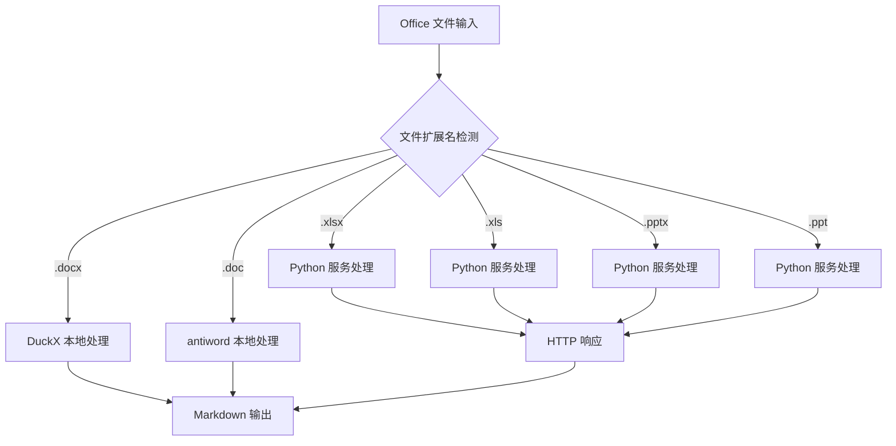

# OfficeAnalyzer 模块文档

## 1. 模块背景

### 业务背景

Office 文档（Word、Excel、PowerPoint）是企业环境中最重要的文件类型。取证调查人员需要：

**核心需求**：
- **文本提取**：从各种 Office 格式提取可搜索文本
- **格式兼容**：支持新旧 Office 格式（DOC/DOCX, XLS/XLSX, PPT/PPTX）
- **元数据提取**：作者、修改时间、版本信息
- **批量处理**：处理大量文档文件

### 技术背景

**双架构设计**：
- **C++ 本地处理**：DOCX (DuckX)、DOC (antiword)
- **Python 远程处理**：XLSX/XLS (openpyxl/xlrd)、PPTX/PPT (python-pptx/catkpt)

**格式转换**：
- 统一输出为 Markdown 格式
- 保留基本文档结构（段落、表格、幻灯片）
- 便于 LLM 分析和全文搜索

## 2. 模块功能

### 支持的格式

| 格式 | 处理方式 | 库/工具 |
|------|---------|---------|
| **DOCX** | C++ 本地 | DuckX |
| **DOC** | C++ 本地 | antiword |
| **XLSX** | Python 远程 | openpyxl |
| **XLS** | Python 远程 | xlrd |
| **PPTX** | Python 远程 | python-pptx |
| **PPT** | Python 远程 | catppt |

### 核心功能

```cpp
OfficeAnalyzer analyzer;

// 自动检测格式并处理
std::string content = analyzer.analyze("/path/to/document.docx");

// 保存到文件
std::string outputPath = analyzer.analyzeToFile("/path/to/spreadsheet.xlsx",
                                                 "/output/dir");
```

## 3. 模块使用的库

| 库名称 | 版本 | 用途 |
|--------|------|------|
| **DuckX** | latest | DOCX 解析 |
| **antiword** | latest | DOC 转换 |
| **libcurl** | latest | HTTP 客户端 |
| **nlohmann/json** | 3.11.2 | JSON 处理 |

**Python 服务依赖**（通过 HTTP）：
- openpyxl, xlrd, python-pptx, catppt

## 4. 模块实现方式

### 架构设计



### 核心类

```cpp
class OfficeAnalyzer {
public:
    OfficeAnalyzer();
    ~OfficeAnalyzer();

    // 统一分析接口
    std::string analyze(const std::string& filePath);
    std::string analyzeToFile(const std::string& filePath,
                               const std::string& outputDir = "");

    // Python 服务配置
    void setPythonServiceUrl(const std::string& url);

private:
    // 本地处理
    std::string analyzeDocx(const std::string& filePath);
    std::string analyzeDoc(const std::string& filePath);

    // 远程处理
    std::string analyzeXlsx(const std::string& filePath);
    std::string analyzeXls(const std::string& filePath);
    std::string analyzePptx(const std::string& filePath);
    std::string analyzePpt(const std::string& filePath);

    // HTTP 通信
    std::string callPythonService(const std::string& filePath);
    std::string execCommand(const std::string& cmd);

    std::string pythonServiceUrl_;  // 默认: "http://localhost:8090"
};
```

## 5. API 调用

### C++ API

```cpp
#include "analyzers/OfficeAnalyzer/OfficeAnalyzer.h"

OfficeAnalyzer analyzer;

// 处理 DOCX（本地）
std::string docxContent = analyzer.analyze("/path/to/report.docx");

// 处理 XLSX（远程）
std::string xlsxContent = analyzer.analyze("/path/to/spreadsheet.xlsx");

// 保存到文件
std::string outputPath = analyzer.analyzeToFile("/path/to/document.docx",
                                                   "./output");
```

### 命令行使用

Office 分析器通过文件分类器自动调用：
```bash
# 文件分类自动处理 Office 文件
./forensic_analyzer disk_image.dd --classify-files
```

### Python 服务 API

```bash
# 直接调用 Python 服务
curl -X POST http://localhost:8090/api/office/parse \
  -H "Content-Type: application/json" \
  -d '{"file_path": "/path/to/document.xlsx"}'
```

## 6. 二次开发

### 添加 ODT 支持

```cpp
std::string OfficeAnalyzer::analyzeOdt(const std::string& filePath) {
    // ODT (OpenDocument Text) 解析
    // 可以使用 libreoffice 或自定义解析器

    std::string cmd = "libreoffice --headless --convert-to-txt:txt " +
                    filePath + " /tmp/output.txt";

    std::string result = execCommand(cmd);

    // 读取转换后的文本
    std::ifstream ifs("/tmp/output.txt");
    std::string content((std::istreambuf_iterator<char>(ifs),
                     std::istreambuf_iterator<char>());

    return content;
}
```

## 7. 其他

### 配置

**Python 服务 URL**：
```cpp
OfficeAnalyzer analyzer;
analyzer.setPythonServiceUrl("http://localhost:8090");  // 默认值
```

### 性能

- **DOCX 处理**：~100 页/秒
- **Excel 处理**：取决于 Python 服务和网络延迟
- **批量处理**：支持多文件并行处理

### 限制

- ❌ 不提取文档元数据
- ❌ 不保留复杂格式
- ❌ 依赖 Python 服务（Excel/PowerPoint）

### 相关模块

- **[FileClassifier](../core/FileClassifier.md)** - 文件分类集成

---

**最后更新**: 2026-03-11
**维护者**: ymj68520
