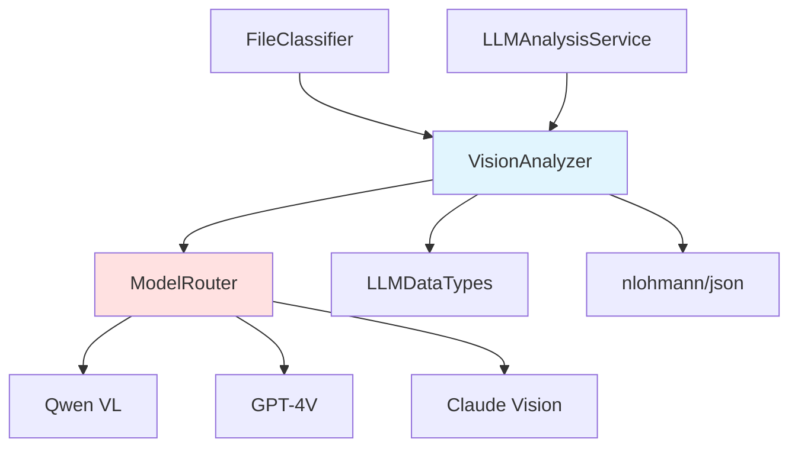
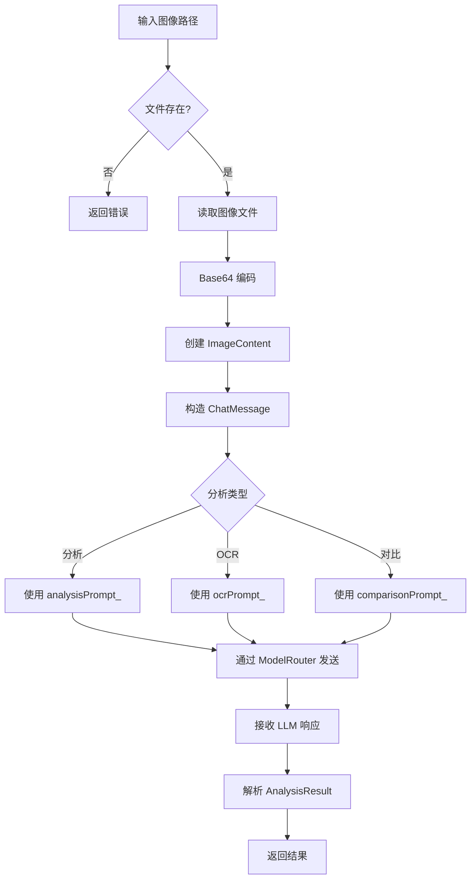
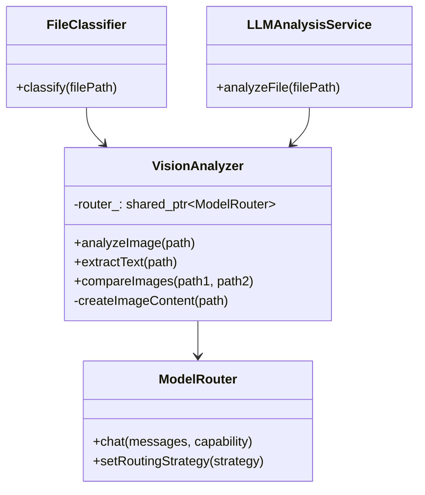

# VisionAnalysis 模块文档

## 1. 模块背景

### 业务背景

在数字取证调查中，图像和视频文件往往包含重要证据信息。传统的图像分析依赖于人工审查，效率低下且容易遗漏关键信息。

**核心需求**：
- **自动图像理解**：提取图像中的物体、场景、文字内容
- **OCR 文字识别**：从截图、照片中提取文字证据
- **图像对比分析**：检测图像修改、版本差异
- **批量处理能力**：处理大量图像文件的高效方案

**解决挑战**：
- **语义理解**：不仅识别像素，更理解图像含义
- **多语言 OCR**：支持中文、英文等多种语言文字提取
- **视频分析**：从视频中提取关键帧进行分析
- **LLM 集成**：利用视觉语言模型进行智能分析

### 技术背景

**视觉 LLM 技术演进**：
- **传统 CV**：OpenCV、特征提取、模式匹配
- **深度学习**：CNN、目标检测、图像分类
- **视觉 LLM**：Qwen VL、GPT-4V、多模态理解

**技术选型**：
- **ModelRouter 集成**：多模型路由和降级策略
- **Base64 编码**：图像数据转换为 LLM 可接受格式
- **OpenAI 兼容 API**：统一接口兼容多种视觉模型

## 2. 模块功能

### 核心功能

#### 1. 图像分析

**功能描述**：对图像文件进行深度语义分析

**支持格式**：
- JPEG/JPG, PNG, BMP, GIF
- WebP, TIFF/TIF
- 自动 MIME 类型检测

**分析能力**：
```cpp
AnalysisResult result = analyzer.analyzeImage("photo.jpg");

// 返回结构包含：
// - description: 详细描述（场景、物体、人物、活动）
// - summary: 简洁摘要
// - tokensUsed: 消耗的 token 数量
// - analysisTimeMs: 分析耗时
```

**提取内容**：
- 场景描述（室内/室外、时间、天气）
- 物体识别（人物、车辆、工具、文档）
- 文字内容（通过 OCR）
- 情感分析（表情、氛围）
- 技术细节（拍摄角度、光照条件）

#### 2. OCR 文字提取

**功能描述**：从图像中提取文字内容

**特性**：
- **多语言支持**：中文、英文、日文、韩文等
- **布局保持**：保留文字位置信息
- **格式保留**：识别表格、列表结构

```cpp
std::string text = analyzer.extractText("screenshot.png");

// 输出示例：
// "应用程序菜单
//  文件 | 编辑 | 查看
//
//  [确定]  [取消]"
```

**应用场景**：
- 截图分析（应用程序界面、网页）
- 文档照片识别
- 车牌、证件识别
- 手写文字识别

#### 3. 图像对比

**功能描述**：比较两张图像的相似性和差异

```cpp
std::string diff = analyzer.compareImages("original.jpg", "modified.jpg");

// 返回对比结果：
// - 相似区域描述
// - 差异点详细说明
// - 修改痕迹分析
```

**对比维度**：
- 内容变化（新增、删除、修改的对象）
- 视觉差异（颜色、光照、角度）
- 编辑痕迹（裁剪、拼接、滤镜）
- 元数据对比（分辨率、文件大小）

**应用场景**：
- 图像篡改检测
- 版本变化分析
- PS 图鉴别
- 证据完整性验证

#### 4. 视频分析

**功能描述**：从视频中提取关键帧并分析

```cpp
AnalysisResult result = analyzer.analyzeVideo("surveillance.mp4", 5);

// 参数：视频路径、最大提取帧数
```

**处理流程**：
1. 帧采样（均匀间隔或场景变化检测）
2. 关键帧提取
3. 逐帧视觉分析
4. 时间线生成

**当前状态**：框架已实现，需集成 ffmpeg/OpenCV

#### 5. 批量分析

**功能描述**：并行处理多个图像文件

```cpp
std::vector<std::string> images = {
    "photo1.jpg", "photo2.png", "photo3.jpg"
};

auto results = analyzer.analyzeBatch(images);

// 返回每个图像的分析结果
```

**性能优化**：
- 并行处理（默认 10 并发）
- 进度回调支持
- 错误隔离（单个失败不影响其他）

#### 6. 自定义提示分析

**功能描述**：使用自定义提示进行针对性分析

```cpp
std::string customPrompt = "请详细描述图像中的所有文字内容和其布局";
AnalysisResult result = analyzer.analyzeWithPrompt("document.jpg", customPrompt);
```

**预设提示**：
- `analysisPrompt_`：通用图像分析
- `ocrPrompt_`：OCR 文字提取
- `comparisonPrompt_`：图像对比
- `videoPrompt_`：视频分析

### 边界与限制

**功能边界**：
- ❌ 不支持实时视频流分析
- ❌ 不提取图像元数据（EXIF、GPS）
- ❌ 不做人脸识别（隐私限制）
- ❌ 视频分析需要外部依赖（ffmpeg/OpenCV）

**已知限制**：
| 限制 | 影响 | 缓解方法 |
|------|------|----------|
| LLM 依赖 | 需要运行 LLM 服务 | 配置本地模型 |
| 文件大小 | 大图像编码耗时 | 限制最大 10MB |
| 处理速度 | 约 30 秒/图像 | 批量并行处理 |
| 准确性 | 依赖模型能力 | 选择高质量模型 |

**性能指标**：
- **图像编码**：~100-500ms（取决于图像大小）
- **LLM 分析**：~20-40 秒（CPU 模式）
- **批量处理**：10 并发默认
- **Token 消耗**：~500-2000 tokens/图像

## 3. 模块使用的库

### 依赖库清单

| 库名称 | 版本 | 用途 |
|--------|------|------|
| **LLMIntegration/ModelRouter** | latest | 多模型路由 |
| **nlohmann/json** | 3.11.2 | JSON 响应处理 |
| **std::filesystem** | C++17 | 文件操作 |

### LLM 模型依赖

**推荐模型**：
- **Qwen3 VL**：阿里通义千问视觉模型
- **GPT-4V**：OpenAI 视觉模型
- **Claude 3.5 Sonnet**：Anthropic 视觉模型

**部署选项**：
- **本地**：LM Studio, Ollama
- **云端**：OpenAI API, Azure OpenAI

### 依赖关系图



## 4. 模块实现方式

### 核心类

```cpp
class VisionAnalyzer {
public:
    // 构造函数
    VisionAnalyzer(std::shared_ptr<ModelRouter> router);

    // 核心分析方法
    AnalysisResult analyzeImage(const std::string& imagePath);
    std::string extractText(const std::string& imagePath);
    std::string describeImage(const std::string& imagePath);
    std::string compareImages(const std::string& imagePath1,
                             const std::string& imagePath2);

    // 高级分析
    AnalysisResult analyzeWithPrompt(const std::string& imagePath,
                                    const std::string& prompt);
    AnalysisResult analyzeVideo(const std::string& videoPath,
                               int maxFrames = 5);
    std::vector<AnalysisResult> analyzeBatch(
        const std::vector<std::string>& imagePaths);

    // 工具方法
    static bool isSupportedImage(const std::string& filePath);
    static std::string getMimeType(const std::string& filePath);

private:
    // 图像编码
    ImageContent createImageContent(const std::string& imagePath);
    std::string base64Encode(const std::vector<uint8_t>& data);

    // 成员变量
    std::shared_ptr<ModelRouter> router_;
    std::string analysisPrompt_;      // 通用分析提示
    std::string ocrPrompt_;           // OCR 提示
    std::string comparisonPrompt_;    // 对比提示
    std::string videoPrompt_;         // 视频提示
};
```

### 数据结构

```cpp
struct AnalysisResult {
    std::string description;      // 详细描述
    std::string summary;           // 简洁摘要
    std::string filePath;         // 源文件路径
    std::string fileType;         // MIME 类型
    uint64_t fileSize;           // 文件大小
    std::string modelUsed;        // 使用的模型
    int tokensUsed;              // Token 消耗
    double analysisTimeMs;       // 分析耗时
    bool success;                // 成功标志
    std::string errorMessage;    // 错误信息
};

struct ImageContent {
    std::string type;             // "image_url"
    struct {
        std::string url;          // "data:image/jpeg;base64,..."
    } image_url;
};
```

### 关键流程



### Base64 编码实现

```cpp
// VisionAnalyzer.cpp:16-61
std::string VisionAnalyzer::base64Encode(const std::vector<uint8_t>& data) {
    const char* alphabet =
        "ABCDEFGHIJKLMNOPQRSTUVWXYZabcdefghijklmnopqrstuvwxyz0123456789+/";

    std::string result;
    result.reserve(((data.size() + 2) / 3) * 4);

    for (size_t i = 0; i < data.size(); i += 3) {
        uint32_t value = data[i] << 16;
        if (i + 1 < data.size()) value |= data[i + 1] << 8;
        if (i + 2 < data.size()) value |= data[i + 2];

        result.push_back(alphabet[(value >> 18) & 0x3F]);
        result.push_back(alphabet[(value >> 12) & 0x3F]);
        result.push_back((i + 1 < data.size()) ? alphabet[(value >> 6) & 0x3F] : '=');
        result.push_back((i + 2 < data.size()) ? alphabet[value & 0x3F] : '=');
    }

    return result;
}
```

### 集成架构



## 5. API 调用

### C++ API

```cpp
#include "analyzers/VisionAnalysis/VisionAnalyzer.h"
#include "integration/LLMIntegration/ModelRouter.h"

// 1. 创建 ModelRouter
auto router = std::make_shared<ModelRouter>();
router->loadConfig(".env");  // 加载 LLM 配置

// 2. 创建 VisionAnalyzer
VisionAnalyzer analyzer(router);

// 3. 图像分析
AnalysisResult result = analyzer.analyzeImage("/path/to/photo.jpg");
if (result.success) {
    std::cout << "描述: " << result.description << std::endl;
    std::cout << "摘要: " << result.summary << std::endl;
    std::cout << "模型: " << result.modelUsed << std::endl;
    std::cout << "耗时: " << result.analysisTimeMs << " ms" << std::endl;
}

// 4. OCR 文字提取
std::string text = analyzer.extractText("/path/to/screenshot.png");
std::cout << "提取的文字:\n" << text << std::endl;

// 5. 图像对比
std::string diff = analyzer.compareImages(
    "/path/to/original.jpg",
    "/path/to/modified.jpg"
);
std::cout << "差异分析:\n" << diff << std::endl;

// 6. 批量分析
std::vector<std::string> images = {
    "/evidence/photo1.jpg",
    "/evidence/photo2.jpg",
    "/evidence/photo3.jpg"
};
auto results = analyzer.analyzeBatch(images);
for (const auto& r : results) {
    std::cout << r.filePath << ": " << r.summary << std::endl;
}

// 7. 自定义提示分析
std::string customPrompt =
    "请详细描述图像中的所有车辆（品牌、颜色、车牌号）";
AnalysisResult custom = analyzer.analyzeWithPrompt("/path/to/scene.jpg", customPrompt);
```

### 集成到文件分析

```cpp
// FileClassifier 自动路由图像文件
if (VisionAnalyzer::isSupportedImage(filePath)) {
    VisionAnalyzer visionAnalyzer(router);
    auto result = visionAnalyzer.analyzeImage(filePath);
    // 存储到数据库
}
```

### REST API（通过 HTTPServer）

```bash
# 图像分析
curl -X POST http://localhost:8080/api/forensics/vision/analyze \
  -H "Content-Type: application/json" \
  -d '{"image_path": "/path/to/photo.jpg"}'

# OCR 文字提取
curl -X POST http://localhost:8080/api/forensics/vision/ocr \
  -H "Content-Type: application/json" \
  -d '{"image_path": "/path/to/screenshot.png"}'

# 图像对比
curl -X POST http://localhost:8080/api/forensics/vision/compare \
  -H "Content-Type: application/json" \
  -d '{
    "image_path1": "/path/to/original.jpg",
    "image_path2": "/path/to/modified.jpg"
  }'
```

### 配置文件

```env
# .env 配置
LLM_BASE_URL=http://localhost:1234
LLM_MODEL=qwen-vl-plus
LLM_MAX_TOKENS=4096
LLM_TIMEOUT=60000

# VisionAnalyzer 特定配置
VISION_MAX_IMAGE_SIZE=10485760    # 10MB
VISION_BATCH_SIZE=10
VISION_ENABLE_OCR=true
```

## 6. 二次开发

### 添加新的图像格式支持

```cpp
// VisionAnalyzer.cpp
bool VisionAnalyzer::isSupportedImage(const std::string& filePath) {
    static const std::vector<std::string> supportedExtensions = {
        ".jpg", ".jpeg", ".png", ".gif", ".bmp",
        ".webp", ".tiff", ".tif",
        ".heic", ".heif", ".avif"  // 新增格式
    };

    std::string ext = getFileExtension(filePath);
    std::transform(ext.begin(), ext.end(), ext.begin(), ::tolower);

    return std::find(supportedExtensions.begin(),
                    supportedExtensions.end(),
                    ext) != supportedExtensions.end();
}

std::string VisionAnalyzer::getMimeType(const std::string& filePath) {
    std::string ext = getFileExtension(filePath);
    // 添加新格式的 MIME 类型映射
    if (ext == ".heic" || ext == ".heif") return "image/heic";
    if (ext == ".avif") return "image/avif";
    // ...
}
```

### 自定义分析提示

```cpp
class CustomVisionAnalyzer : public VisionAnalyzer {
public:
    CustomVisionAnalyzer(std::shared_ptr<ModelRouter> router)
        : VisionAnalyzer(router) {
        // 自定义专用提示
        setFaceAnalysisPrompt("描述图像中所有人物的年龄、性别、表情、服装");
        setVehicleAnalysisPrompt("识别所有车辆的类型、颜色、品牌、车牌号");
    }

    AnalysisResult analyzeFaces(const std::string& imagePath) {
        return analyzeWithPrompt(imagePath, faceAnalysisPrompt_);
    }

    AnalysisResult analyzeVehicles(const std::string& imagePath) {
        return analyzeWithPrompt(imagePath, vehicleAnalysisPrompt_);
    }

private:
    std::string faceAnalysisPrompt_;
    std::string vehicleAnalysisPrompt_;
};
```

### 视频帧提取实现

```cpp
// 集成 OpenCV 或 ffmpeg
AnalysisResult VisionAnalyzer::analyzeVideo(const std::string& videoPath,
                                           int maxFrames) {
    // 使用 OpenCV 提取关键帧
    cv::VideoCapture cap(videoPath);
    if (!cap.isOpened()) {
        return AnalysisResult{.success = false, .errorMessage = "无法打开视频"};
    }

    int totalFrames = cap.get(cv::CAP_PROP_FRAME_COUNT);
    int frameStep = std::max(1, totalFrames / maxFrames);

    std::vector<std::string> frameDescriptions;

    for (int i = 0; i < totalFrames; i += frameStep) {
        cap.set(cv::CAP_PROP_POS_FRAMES, i);
        cv::Mat frame;
        cap.read(frame);

        // 保存帧为临时文件
        std::string tempFramePath = saveTempFrame(frame, i);

        // 分析帧
        auto result = analyzeImage(tempFramePath);
        frameDescriptions.push_back(result.description);

        // 清理临时文件
        std::filesystem::remove(tempFramePath);
    }

    // 汇总所有帧的分析结果
    AnalysisResult finalResult;
    finalResult.description = aggregateFrameDescriptions(frameDescriptions);
    return finalResult;
}
```

### 性能优化：并行批量处理

```cpp
std::vector<AnalysisResult> VisionAnalyzer::analyzeBatch(
    const std::vector<std::string>& imagePaths) {

    const size_t batchSize = 10;  // 配置化
    std::vector<AnalysisResult> results;
    results.reserve(imagePaths.size());

    // 使用 ThreadPool 并行处理
    for (size_t i = 0; i < imagePaths.size(); i += batchSize) {
        size_t end = std::min(i + batchSize, imagePaths.size());
        std::vector<std::future<AnalysisResult>> futures;

        for (size_t j = i; j < end; ++j) {
            futures.push_back(
                ThreadPool::instance().enqueue([this, &imagePaths, j]() {
                    return this->analyzeImage(imagePaths[j]);
                })
            );
        }

        // 收集结果
        for (auto& future : futures) {
            results.push_back(future.get());
        }
    }

    return results;
}
```

## 7. 其他

### 测试

```cpp
// tests/llm_files_test.cpp
TEST(VisionAnalyzerTest, AnalyzeImage) {
    auto router = std::make_shared<ModelRouter>();
    VisionAnalyzer analyzer(router);

    auto result = analyzer.analyzeImage("test_image.jpg");
    EXPECT_TRUE(result.success);
    EXPECT_FALSE(result.description.empty());
}

TEST(VisionAnalyzerTest, ExtractText) {
    VisionAnalyzer analyzer(router);
    std::string text = analyzer.extractText("screenshot.png");
    EXPECT_FALSE(text.empty());
    EXPECT_TRUE(text.contains("菜单"));  // 验证特定文字
}

TEST(VisionAnalyzerTest, CompareImages) {
    VisionAnalyzer analyzer(router);
    std::string diff = analyzer.compareImages("original.jpg", "modified.jpg");
    EXPECT_FALSE(diff.empty());
}
```

### 故障排查

| 问题 | 可能原因 | 解决方法 |
|------|----------|----------|
| LLM 无响应 | 服务未启动 | 检查 LLM 服务状态 |
| Base64 编码失败 | 文件过大 | 限制图像大小 |
| 分析结果为空 | 提示不合适 | 调整分析提示 |
| 批量处理超时 | 并发数过高 | 减少 batch size |

### 配置调优

**性能优化**：
```env
VISION_MAX_IMAGE_SIZE=5242880     # 5MB 限制
VISION_BATCH_SIZE=5               # 减少并发
LLM_MAX_TOKENS=2048               # 减少 token
```

**质量优化**：
```env
VISION_MAX_IMAGE_SIZE=20971520    # 20MB 限制
LLM_MODEL=qwen-vl-max            # 使用高质量模型
LLM_MAX_TOKENS=8192               # 增加 token
```

### 相关模块

- **[LLMIntegration](../../integration/LLMIntegration.md)** - LLM 集成核心
- **[ModelRouter](../../integration/ModelRouter.md)** - 多模型路由
- **[FileClassifier](../../core/FileClassifier.md)** - 文件分类集成

### 参考资源

- [Qwen VL 模型文档](https://github.com/QwenLM/Qwen-VL)
- [OpenAI Vision API](https://platform.openai.com/docs/guides/vision)
- [Base64 编码标准](https://tools.ietf.org/html/rfc4648)

---

**最后更新**: 2026-03-11
**维护者**: ymj68520
