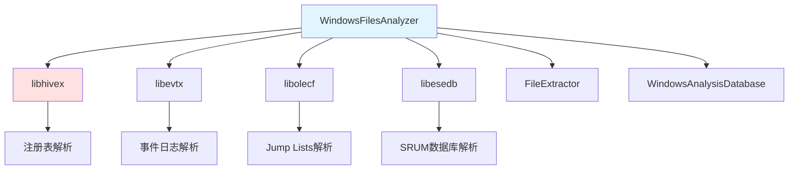
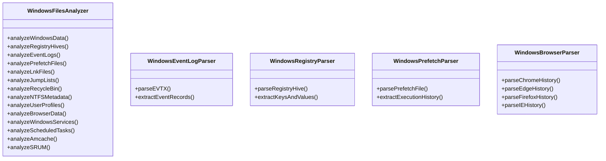
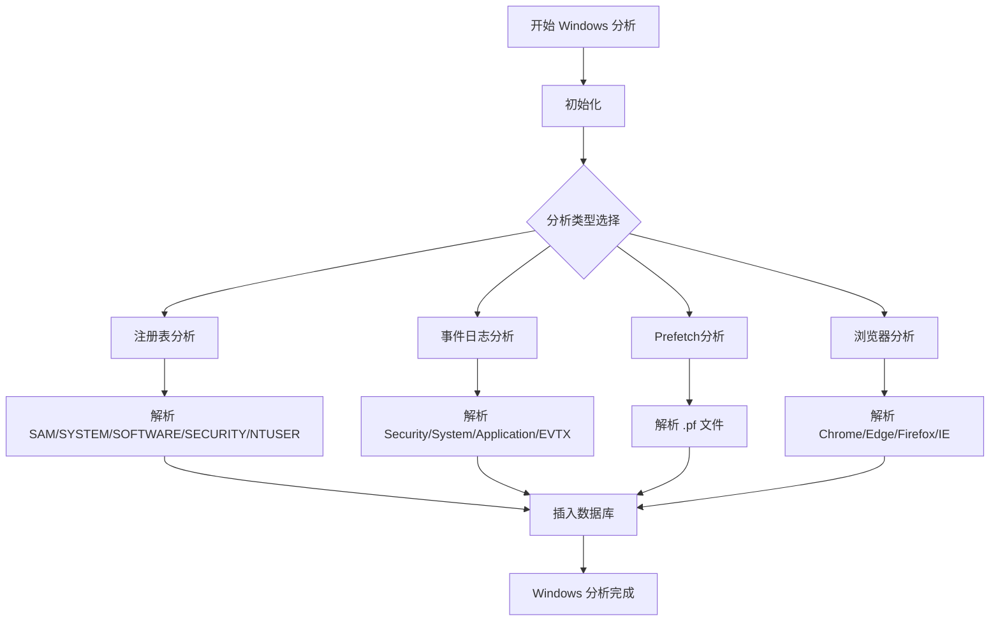

# WindowsFilesAnalyzer 模块文档

## 1. 模块背景

### 业务背景

Windows 系统占据了桌面操作系统的主导地位，Windows 取证是数字调查的核心技能。调查人员需要从 Windows 磁盘中提取：

**核心需求**：
- **注册表分析**：用户账户、软件安装、系统配置、USB 设备历史
- **事件日志**：登录事件、进程执行、系统崩溃、安全审计
- **程序执行**：Prefetch 文件、Amcache、Shimcache
- **用户活动**：浏览器历史、文件访问、最近使用的文档
- **系统元数据**：MFT 记录、回收站、快捷方式

**解决挑战**：
- **数据量巨大**：Windows 系统产生的日志和元数据非常庞大
- **格式复杂**：注册表配置单元、EVTX 事件日志、Prefetch 二进制格式
- **版本差异**：Windows XP 到 Windows 11 的格式变化
- **碎片化存储**：用户活动分散在多个位置

### 技术背景

**核心库**：
- **libhivex**：Windows 注册表解析（ hive 文件）
- **libevtx**：Windows 事件日志解析（.evtx 文件）
- **libolecf**：复合文档解析（Jump Lists）

**取证目标**：
```
Windows 镜像 → 注册表分析 + 事件日志 + 文件系统元数据 + 用户活动
           ↓
     _windows.db
```

## 2. 模块功能

### 核心功能

#### 1. 注册表分析

**支持的注册表配置单元**：
- **SAM**：用户账户、密码哈希、组信息
- **SYSTEM**：系统配置、服务、启动项、硬件信息
- **SOFTWARE**：安装软件、文件关联、用户设置
- **SECURITY**：安全策略、权限配置
- **NTUSER.DAT**：用户设置、应用程序配置

**提取的数据**：
- 用户账户信息（用户名、RID、登录时间）
- 安装的软件列表（名称、版本、安装时间）
- USB 设备连接历史（序列号、首次连接时间）
- 网络配置（RDP 连接、网络适配器）
- 自动启动程序（启动文件夹、计划任务）
- 最近打开的文档

#### 2. 事件日志分析

**支持的日志类型**：
- **Security**：登录/注销、对象访问、权限变更
- **System**：服务启动/停止、驱动加载
- **Application**：应用程序崩溃和挂起
- **PowerShell**：脚本执行、模块加载
- **Windows Defender**：恶意软件检测和隔离

**关键事件 ID**：
- **4624/4625**：账户登录成功/失败
- **4688**：进程创建
- **5156/5157**：网络连接

#### 3. 程序执行追踪

**Prefetch 分析**：
- 支持 Windows XP 到 Windows 11
- 执行次数统计
- 最后执行时间
- 加载的 DLL 和引用的文件
- 可执行文件路径

**Amcache 分析**：
- SHA-1 文件哈希
- 程序执行历史
- 文件链接时间戳
- 程序元数据（公司、产品、版本）

#### 4. 用户活动重建

**浏览器历史**：
- Google Chrome、Microsoft Edge、Mozilla Firefox、Internet Explorer
- URL 和标题
- 访问时间和次数
- 下载历史

**文件访问痕迹**：
- LNK 快捷方式（目标路径、工作目录）
- Jump Lists（固定和最近项目）
- 最近文档

**回收站分析**：
- 原始文件路径
- 删除时间戳
- 文件大小
- 删除用户 SID

### 边界与限制

**功能边界**：
- ❌ 不解析 BitLocker 加密分区（需先解密）
- ❌ 不恢复已删除的注册表单元（需要文件雕刻）
- ❌ 不处理 EFS 加密文件（需要 DPAPI 解密）
- ❌ 不支持 ReFS 专有特性（需要额外解析器）

**已知限制**：
| 限制 | 影响 | 缓解方法 |
|------|------|----------|
| 注册表损坏 | 部分配置单元无法读取 | 错误处理和日志 |
| 事件日志损坏 | 部分事件记录丢失 | 使用恢复模式 |
| 大型镜像 | 处理时间过长 | 分块处理 |
| 加密凭据 | 无法读取密码哈希 | 记录加密状态 |

**性能指标**：
- 注册表解析：~1000 键/秒
- 事件日志解析：~500 事件/秒
- 浏览器历史：~1000 记录/秒
- 完整分析：~30 分钟 - 2 小时（取决于镜像大小）

## 3. 模块使用的库

### 依赖库清单

| 库名称 | 版本 | 用途 | 许可证 |
|--------|------|------|--------|
| **libhivex** | latest | Windows 注册表解析 | LGPLv3+ |
| **libevtx** | latest | Windows 事件日志解析 | LGPLv3+ |
| **libolecf** | latest | 复合文档解析 | LGPLv3+ |
| **libesedb** | latest | ESE 数据库解析（SRUM） | LGPLv3+ |

### 依赖关系图



## 4. 模块实现方式

### 架构设计



### 核心类

```cpp
class WindowsFilesAnalyzer {
public:
    WindowsFilesAnalyzer(const std::string& imagePath, DatabaseManager* dbManager);

    // 初始化
    bool initialize();

    // 主分析入口
    void analyzeWindowsData();

    // 注册表分析
    void analyzeRegistryHives();

    // 事件日志分析
    void analyzeEventLogs();

    // Prefetch 文件分析
    void analyzePrefetchFiles();

    // LNK 文件分析
    void analyzeLnkFiles();

    // Jump Lists 分析
    void analyzeJumpLists();

    // 回收站分析
    void analyzeRecycleBin();

    // 浏览器数据分析
    void analyzeBrowserData();

private:
    std::string imagePath_;
    DatabaseManager* dbManager_;
    std::unique_ptr<WindowsAnalysisDatabase> windowsDb_;
    std::unique_ptr<FileExtractor> fileExtractor_;
};
```

### 关键流程



## 5. API 调用

### C++ API

```cpp
#include "analyzers/WindowsFilesAnalyzer/WindowsFilesAnalyzer.h"

// 创建分析器
auto dbManager = std::make_unique<DatabaseManager>("evidence_raw.db");
WindowsFilesAnalyzer analyzer("windows_image.E01", dbManager.get());

// 初始化
if (!analyzer.initialize()) {
    std::cerr << "初始化失败" << std::endl;
    return 1;
}

// 执行分析
analyzer.analyzeWindowsData();

std::cout << "Windows 分析完成" << std::endl;
```

### 命令行 API

```bash
# Windows 分析（通过主程序）
./forensic_analyzer windows_image.dd --windows-analyze

# 输出数据库：windows_image_windows.db
```

### REST API

```bash
# 用户账户信息
curl "http://localhost:8080/api/forensics/windows/users?task_id=task_abc123"

# 注册表查询
curl "http://localhost:8080/api/forensics/windows/registry?key_path=HKLM\\Software\\Microsoft"

# 浏览器历史
curl "http://localhost:8080/api/forensics/windows/browser-history?browser=chrome&task_id=task_abc123"

# 程序执行历史
curl "http://localhost:8080/api/forensics/windows/prefetch?task_id=task_abc123"
```

## 6. 二次开发

### 添加新的解析器

**示例**：添加 Windows 搜索历史解析器

```cpp
// WindowsSearchParser.h
#pragma once
#include <string>
#include <vector>

struct SearchHistoryItem {
    std::string url;
    std::string title;
    int64_t timestamp;
};

class WindowsSearchParser {
public:
    static std::vector<SearchHistoryItem> parseWindowsSearchDatabase(
        const std::string& dbPath);

private:
    static std::string extractDatabasePath(const std::string& imageRoot);
};
```

**集成到主分析器**：

```cpp
// WindowsFilesAnalyzer.cpp
void WindowsFilesAnalyzer::analyzeWindowsSearch() {
    // Windows Search 数据库路径
    std::string searchDbPath = findFileInImage(
        "Windows/EdpCnt.mdb"  // Windows 10/11
    );

    if (!searchDbPath.empty()) {
        // 提取数据库
        std::string extractedPath = getExtractPath("WindowsSearch.db");
        extractFileToPath(searchDbPath, extractedPath);

        // 解析搜索历史
        auto history = WindowsSearchParser::parseWindowsSearchDatabase(extractedPath);

        // 存入数据库
        for (const auto& item : history) {
            windowsDb_->insertSearchHistory(item);
        }
    }
}
```

## 7. 其他

### 测试

```bash
cd build
# 运行单元测试
ctest -R windows -V
```

### 配置

**相关配置**：
- Windows 镜像路径
- 数据库输出路径
- 解析器启用开关

### 故障排查

| 问题 | 可能原因 | 解决方法 |
|------|----------|----------|
| 注册表解析失败 | hive 文件损坏 | 使用 libhivex 恢复模式 |
| 事件日志为空 | 日志文件未找到 | 检查路径是否正确 |
| 浏览器历史缺失 | 浏览器配置文件位置 | 检查用户配置目录 |

### 相关模块

- **[FileExtractor](../core/FileExtractor.md)** - 文件提取
- **[DatabaseManager](../core/DatabaseManager.md)** - 数据库管理

### 参考资源

- [Windows 注册表结构](https://docs.microsoft.com/en-us/windows/win32/sysinfo/registry-registry-keys)
- [Windows 事件日志](https://docs.microsoft.com/en-us/windows/win32/events/event-logging/tracing)

---

**最后更新**: 2026-03-11
**维护者**: ymj68520
