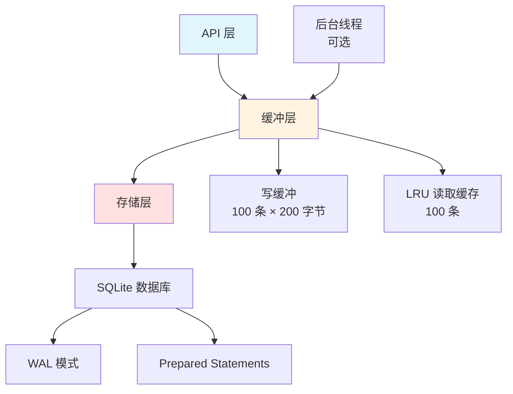

# AuditLog 模块文档

## 1. 模块背景

### 业务背景

在数字取证系统中，完整的审计日志是确保**证据链完整性**和**合规性**的关键组件。每个操作都需要可追溯的记录：

**核心需求**：
- **完整审计追踪**：记录所有关键操作（文件挂载、分析开始/结束、错误等）
- **任务生命周期**：跟踪每个分析任务的状态变化
- **法律合规**：满足取证标准和 chain of custody 要求
- **性能优化**：支持高频日志记录而不影响分析性能

**解决挑战**：
- **高并发写入**：多个线程同时记录日志
- **持久化存储**：确保日志在系统崩溃后不丢失
- **查询性能**：快速检索特定任务或时间范围的日志
- **存储管理**：日志轮转和自动清理

### 技术背景

**设计模式**：
- **Singleton Pattern**：全局唯一实例
- **Layered Architecture**：API 层 → 缓冲层 → 存储层
- **Performance Optimizations**：写缓冲、LRU 缓存、异步处理

**数据库技术**：
- **SQLite WAL 模式**：增强并发性能
- **Prepared Statements**：高效的批量插入
- **B-Tree Indexes**：快速查询索引

## 2. 模块功能

### 核心功能

#### 1. 结构化日志记录

**日志条目结构**：
```cpp
struct AuditLogEntry {
    int64_t id;                              // 自增主键
    std::string task_id;                     // 关联任务 ID
    std::chrono::system_clock::time_point timestamp;  // 高精度时间戳
    std::string action;                      // 操作类型
    std::string details;                     // 详细信息
    std::string user_id;                     // 可选用户标识
};
```

**记录方法**：
```cpp
// 基础日志
AuditLog::instance().log(task_id, "IMAGE_MOUNTED", "Image mounted successfully");

// 带用户 ID
AuditLog::instance().log(task_id, "FILE_EXTRACTED", "1000 files extracted", "analyst_1");

// 立即刷新缓冲
AuditLog::instance().flush();
```

#### 2. 任务日志查询

**按任务查询**：
```cpp
// 获取特定任务的所有日志
auto logs = AuditLog::instance().getTaskLogs("task_abc123");

// 分页查询
auto logs = AuditLog::instance().getTaskLogs("task_abc123", 100, 0);  // limit, offset
```

**按时间范围查询**：
```cpp
auto start = std::chrono::system_clock::now() - std::chrono::hours(24);
auto end = std::chrono::system_clock::now();

auto logs = AuditLog::instance().getLogsByTimeRange(start, end);
```

**按操作类型查询**：
```cpp
auto logs = AuditLog::instance().getLogsByAction("ERROR");
```

#### 3. 统计与监控

**统计信息**：
```cpp
auto stats = AuditLog::instance().getStatistics();

// 返回 JSON：
// {
//   "total_logs": 15234,
//   "tasks_count": 45,
//   "actions": {
//     "IMAGE_MOUNTED": 45,
//     "FILES_EXTRACTED": 45,
//     "ERROR": 3
//   }
// }
```

**日志计数**：
```cpp
int64_t totalLogs = AuditLog::instance().getLogCount();
int64_t taskLogs = AuditLog::instance().getLogCount("task_abc123");
```

#### 4. 维护操作

**日志清理**：
```cpp
// 清理 30 天前的日志
AuditLog::instance().cleanup(30);
```

**数据库轮转**：
```cpp
// 当数据库超过 100MB 时轮转
AuditLog::instance().rotate();

// 生成带时间戳的备份
// forensics_audit_20240311_143022.db
```

**导出功能**：
```cpp
// JSON 导出
AuditLog::instance().exportToFile("audit_report.json", "json");

// CSV 导出
AuditLog::instance().exportToFile("audit_report.csv", "csv");
```

### 边界与限制

**功能边界**：
- ❌ 不修改已写入的日志条目（审计不可变性）
- ❌ 不删除日志（仅通过 cleanup 按时间清理）
- ❌ 不支持分布式存储（单机 SQLite）

**已知限制**：
| 限制 | 影响 | 缓解方法 |
|------|------|----------|
| 单文件数据库 | 并发写入限制 | 使用 WAL 模式 |
| 无日志轮转自动化 | 需手动调用 rotate() | 定期任务调度 |
| 异步写入默认关闭 | 可能阻塞主线程 | 配置 async_write=true |

**性能指标**：
- **缓冲写入**：~0.1ms/条（内存）
- **批量插入**：~5ms/50 条（磁盘）
- **查询响应**：<1ms（有索引）

## 3. 模块使用的库

### 依赖库清单

| 库名称 | 版本 | 用途 |
|--------|------|------|
| **SQLite3** | 3.35.0+ | 持久化存储 |
| **nlohmann/json** | 3.11.2 | JSON 导出 |

### 数据库模式

```sql
CREATE TABLE IF NOT EXISTS audit_logs (
    id INTEGER PRIMARY KEY AUTOINCREMENT,
    task_id TEXT NOT NULL,
    timestamp INTEGER NOT NULL,           -- Unix 毫秒时间戳
    action TEXT NOT NULL,
    details TEXT,
    user_id TEXT,
    created_at INTEGER DEFAULT (cast(strftime('%s', 'now') as integer) * 1000)
);

CREATE INDEX IF NOT EXISTS idx_task_id ON audit_logs(task_id);
CREATE INDEX IF NOT EXISTS idx_timestamp ON audit_logs(timestamp);
CREATE INDEX IF NOT EXISTS idx_action ON audit_logs(action);
```

### 架构图



## 4. 模块实现方式

### 核心类

```cpp
class AuditLog {
public:
    // Singleton
    static AuditLog& instance(const AuditLogConfig& config = {});

    // 日志记录
    void log(const std::string& task_id,
             const std::string& action,
             const std::string& details,
             const std::string& user_id = "");

    // 刷新缓冲
    void flush();

    // 查询方法
    std::vector<AuditLogEntry> getTaskLogs(const std::string& task_id,
                                          int limit = 0, int offset = 0);
    std::vector<AuditLogEntry> getLogsByTimeRange(
        const std::chrono::system_clock::time_point& start,
        const std::chrono::system_clock::time_point& end,
        int limit = 0, int offset = 0);
    std::vector<AuditLogEntry> getLogsByAction(const std::string& action,
                                              int limit = 0, int offset = 0);

    // 统计
    nlohmann::json getStatistics();
    int64_t getLogCount(const std::string& task_id = "");

    // 维护
    void cleanup(int retention_days = -1);
    void rotate();
    void exportToFile(const std::string& output_path,
                     const std::string& format = "json");

private:
    AuditLog(const AuditLogConfig& config);
    ~AuditLog();

    // 内部方法
    void flushInternal();
    void startBackgroundThread();
    void stopBackgroundThread();

    // 配置
    AuditLogConfig config_;

    // 存储
    std::unique_ptr<SQLite::Database> db_;
    std::vector<AuditLogEntry> writeBuffer_;
    std::unordered_map<std::string, std::vector<AuditLogEntry>> readCache_;

    // 同步
    std::mutex writeMutex_;
    std::mutex cacheMutex_;
    std::condition_variable cv_;
    std::thread backgroundThread_;
    std::atomic<bool> stopFlag_{false};
};
```

### 配置结构

```cpp
struct AuditLogConfig {
    std::string db_path = "forensics_audit.db";
    size_t cache_size = 100;             // LRU 缓存大小
    size_t batch_size = 1;               // 批量写入阈值（默认 1=立即写）
    int flush_interval_seconds = 3;      // 自动刷新间隔
    bool async_write = false;            // 异步写入（默认关闭，安全优先）
    size_t max_db_size_mb = 100;         // 数据库轮转阈值
    int retention_days = 30;             // 日志保留天数
    bool enable_wal = true;              // WAL 模式
};
```

### 写缓冲实现

```cpp
void AuditLog::log(const std::string& task_id,
                  const std::string& action,
                  const std::string& details,
                  const std::string& user_id) {
    AuditLogEntry entry;
    entry.task_id = task_id;
    entry.timestamp = std::chrono::system_clock::now();
    entry.action = action;
    entry.details = details;
    entry.user_id = user_id;

    std::lock_guard<std::mutex> lock(writeMutex_);
    writeBuffer_.push_back(std::move(entry));

    // 达到批量阈值时刷新
    if (writeBuffer_.size() >= config_.batch_size) {
        flushInternal();
    }
}

void AuditLog::flushInternal() {
    if (writeBuffer_.empty()) return;

    try {
        // 开始事务
        db_->exec("BEGIN TRANSACTION");

        // 准备语句
        SQLite::Statement insert(*db_,
            "INSERT INTO audit_logs (task_id, timestamp, action, details, user_id) "
            "VALUES (?, ?, ?, ?, ?)"
        );

        // 批量插入
        for (const auto& entry : writeBuffer_) {
            int64_t timestampMs = std::chrono::duration_cast<std::chrono::milliseconds>(
                entry.timestamp.time_since_epoch()).count();

            insert.bind(1, entry.task_id);
            insert.bind(2, timestampMs);
            insert.bind(3, entry.action);
            insert.bind(4, entry.details);
            insert.bind(5, entry.user_id);
            insert.exec();
            insert.reset();
        }

        // 提交事务
        db_->exec("COMMIT");
        writeBuffer_.clear();

    } catch (const std::exception& e) {
        db_->exec("ROLLBACK");
        // 记录错误但不抛出异常
        std::cerr << "[AuditLog] Flush failed: " << e.what() << std::endl;
    }
}
```

### LRU 读取缓存

```cpp
std::vector<AuditLogEntry> AuditLog::getTaskLogs(const std::string& task_id,
                                                int limit, int offset) {
    // 先检查缓存
    {
        std::lock_guard<std::mutex> lock(cacheMutex_);
        auto it = readCache_.find(task_id);
        if (it != readCache_.end()) {
            // 缓存命中
            auto& cached = it->second;
            if (offset < cached.size()) {
                size_t end = (limit == 0) ? cached.size()
                                          : std::min(offset + limit, cached.size());
                return std::vector<AuditLogEntry>(
                    cached.begin() + offset,
                    cached.begin() + end
                );
            }
        }
    }

    // 缓存未命中，查询数据库
    std::vector<AuditLogEntry> results;
    // ... 数据库查询逻辑 ...

    // 更新缓存（LRU 淘汰）
    {
        std::lock_guard<std::mutex> lock(cacheMutex_);
        if (readCache_.size() >= config_.cache_size) {
            // 移除最旧的缓存
            auto oldest = std::min_element(readCache_.begin(), readCache_.end(),
                [](const auto& a, const auto& b) {
                    return a.second[0].timestamp < b.second[0].timestamp;
                });
            readCache_.erase(oldest);
        }
        readCache_[task_id] = results;
    }

    return results;
}
```

### 信号处理

```cpp
// 优雅关闭
static void signalHandler(int signal) {
    if (signal == SIGINT || signal == SIGTERM) {
        AuditLog::instance().flush();  // 刷新缓冲
        exit(0);
    }
}

// 构造函数中注册
std::signal(SIGINT, signalHandler);
std::signal(SIGTERM, signalHandler);
#ifdef SIGHUP
std::signal(SIGHUP, signalHandler);
#endif
```

## 5. API 调用

### C++ API

```cpp
#include "core/AuditLog/AuditLog.h"

// 1. 初始化（可选配置）
AuditLogConfig config;
config.db_path = "audit.db";
config.batch_size = 50;              // 每 50 条刷新一次
config.async_write = true;           // 启用异步写入
config.retention_days = 90;          // 保留 90 天

AuditLog::instance(config);

// 2. 记录日志
std::string taskId = "task_" + generateId();

AuditLog::instance().log(taskId, "CREATED", "Task created by analyst");
AuditLog::instance().log(taskId, "IMAGE_MOUNTED", "Disk image mounted: /evidence.dd");
AuditLog::instance().log(taskId, "ANALYSIS_STARTED", "File system analysis started");

// 3. 查询任务日志
auto logs = AuditLog::instance().getTaskLogs(taskId);
for (const auto& log : logs) {
    std::cout << "[" << log.action << "] " << log.details << std::endl;
}

// 4. 按操作类型查询
auto errors = AuditLog::instance().getLogsByAction("ERROR");
for (const auto& error : errors) {
    std::cout << "Error in task " << error.task_id << ": " << error.details << std::endl;
}

// 5. 时间范围查询
auto now = std::chrono::system_clock::now();
auto yesterday = now - std::chrono::hours(24);
auto recentLogs = AuditLog::instance().getLogsByTimeRange(yesterday, now);

// 6. 统计信息
auto stats = AuditLog::instance().getStatistics();
std::cout << "Total logs: " << stats["total_logs"] << std::endl;
std::cout << "Total tasks: " << stats["tasks_count"] << std::endl;

// 7. 维护操作
AuditLog::instance().flush();           // 手动刷新
AuditLog::instance().cleanup(30);        // 清理 30 天前日志
AuditLog::instance().rotate();           // 轮转数据库

// 8. 导出审计报告
AuditLog::instance().exportToFile("audit_report_2024.json", "json");
AuditLog::instance().exportToFile("audit_report_2024.csv", "csv");
```

### TaskManager 集成

```cpp
// TaskManager 自动记录任务生命周期
TaskManager::instance().createTask("analysis_task", {...});
// 自动记录：task_id, CREATED, "Task created"

TaskManager::instance().updateTaskStatus(task_id, TaskStatus::RUNNING);
// 自动记录：task_id, STATUS_CHANGE, "Status: RUNNING"

TaskManager::instance().cancelTask(task_id);
// 自动记录：task_id, CANCELLED, "Task cancelled by user"
```

### 配置示例

**开发环境**（快速调试）：
```cpp
AuditLogConfig config;
config.batch_size = 1;          // 立即写入
config.async_write = false;     // 同步模式
config.retention_days = 7;      // 短期保留
```

**生产环境**（高性能）：
```cpp
AuditLogConfig config;
config.batch_size = 100;        // 批量写入
config.async_write = true;      // 异步模式
config.flush_interval_seconds = 5;
config.retention_days = 365;    // 长期保留
config.max_db_size_mb = 500;    // 大容量
```

**高频环境**（超高性能）：
```cpp
AuditLogConfig config;
config.cache_size = 1000;       // 大缓存
config.batch_size = 1000;       // 大批量
config.async_write = true;
config.flush_interval_seconds = 1;  // 频繁刷新
```

## 6. 二次开发

### 添加自定义操作类型

```cpp
// 在应用代码中定义操作类型常量
namespace AuditActions {
    constexpr const char* MALWARE_DETECTED = "MALWARE_DETECTED";
    constexpr const char* SUSPICIOUS_FILE = "SUSPICIOUS_FILE";
    constexpr const char* DATA_EXFILTRATION = "DATA_EXFILTRATION";
}

// 使用自定义操作类型
AuditLog::instance().log(task_id, AuditActions::MALWARE_DETECTED,
                        "Malware signature found: trojan.gen");
```

### 扩展统计信息

```cpp
// 扩展 getStatistics() 方法
nlohmann::json AuditLog::getStatistics() {
    nlohmann::json stats;

    // 基础统计
    stats["total_logs"] = getLogCount();
    stats["tasks_count"] = /* 查询不重复任务数 */;

    // 操作类型分布
    SQLite::Statement query(*db_,
        "SELECT action, COUNT(*) as count FROM audit_logs GROUP BY action"
    );
    while (query.executeStep()) {
        std::string action = query.getColumn(0);
        int count = query.getColumn(1);
        stats["actions"][action] = count;
    }

    // 新增：按小时统计
    SQLite::Statement hourlyQuery(*db_,
        "SELECT strftime('%Y-%m-%d %H:00', timestamp/1000, 'unixepoch') as hour, "
        "COUNT(*) as count FROM audit_logs GROUP BY hour ORDER BY hour DESC LIMIT 24"
    );
    while (hourlyQuery.executeStep()) {
        std::string hour = hourlyQuery.getColumn(0);
        int count = hourlyQuery.getColumn(1);
        stats["hourly_distribution"][hour] = count;
    }

    return stats;
}
```

### 自定义导出格式

```cpp
// 添加 XML 导出
void AuditLog::exportToXML(const std::string& output_path) {
    auto logs = getTaskLogs("", 0, 0);  // 获取所有日志

    std::ofstream out(output_path);
    out << "<?xml version=\"1.0\" encoding=\"UTF-8\"?>\n";
    out << "<audit_logs>\n";

    for (const auto& log : logs) {
        int64_t timestampMs = std::chrono::duration_cast<std::chrono::milliseconds>(
            log.timestamp.time_since_epoch()).count();

        out << "  <entry>\n";
        out << "    <id>" << log.id << "</id>\n";
        out << "    <task_id>" << log.task_id << "</task_id>\n";
        out << "    <timestamp>" << timestampMs << "</timestamp>\n";
        out << "    <action>" << log.action << "</action>\n";
        out << "    <details>" << escapeXML(log.details) << "</details>\n";
        out << "    <user_id>" << log.user_id << "</user_id>\n";
        out << "  </entry>\n";
    }

    out << "</audit_logs>\n";
}
```

## 7. 其他

### 测试

```bash
cd build
./test_audit_log_gtest

# 运行特定测试
./test_audit_log_gtest --gtest_filter="AuditLogTest.BufferPerformance"
```

### 故障排查

| 问题 | 可能原因 | 解决方法 |
|------|----------|----------|
| 日志丢失 | 程序崩溃未刷新 | 使用信号处理器自动 flush |
| 性能下降 | 同步写入阻塞 | 启用 async_write |
| 数据库锁定 | 多进程访问 | 使用 WAL 模式 |
| 磁盘空间不足 | 日志未清理 | 定期调用 cleanup() |

### 最佳实践

1. **始终使用操作类型常量**：避免字符串拼写错误
2. **合理的批量大小**：根据日志频率调整 batch_size
3. **定期维护**：设置 cron 任务定期 cleanup 和 rotate
4. **异步写入谨慎使用**：生产环境建议默认关闭，确保数据安全
5. **监控数据库大小**：避免单个文件过大影响查询性能

### 相关模块

- **[TaskManager](../../network/TaskManager.md)** - 任务管理集成
- **[DatabaseManager](../core/DatabaseManager.md)** - 数据库操作
- **[Logger](../core/Logger.md)** - 应用日志

### 参考资源

- [SQLite WAL 模式](https://www.sqlite.org/wal.html)
- [数字取证标准](https://www.swgde.org/)

---

**最后更新**: 2026-03-11
**维护者**: ymj68520
