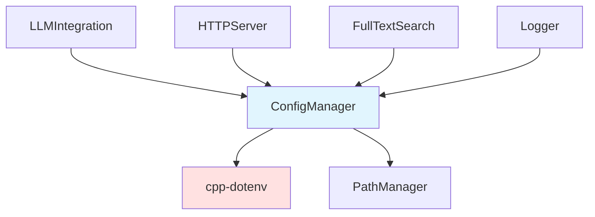

# ConfigManager 模块文档

## 1. 模块背景

### 业务背景

在数字取证分析系统中，集中化的配置管理是确保系统可维护性和灵活性的关键：

**核心需求**：
- **统一配置**：集中管理所有配置项
- **环境适配**：支持开发、测试、生产环境
- **类型安全**：提供类型化的配置访问
- **默认值**：合理的默认配置

**解决挑战**：
- **配置分散**：避免配置散布在代码各处
- **硬编码问题**：消除硬编码的配置值
- **环境差异**：不同环境使用不同配置
- **类型转换**：安全的类型转换和验证

### 技术背景

**配置文件格式**：
- **.env 文件**：简单的 KEY=VALUE 格式
- **cpp-dotenv 库**：第三方解析库

**设计模式**：
- **Singleton Pattern**：全局唯一配置实例
- **Meyer's Singleton**：C++11 线程安全保证

## 2. 模块功能

### 核心功能

#### 1. 配置文件加载

**.env 文件格式**：
```env
# LLM 配置
LLM_BASE_URL=http://localhost:1234
LLM_TEXT_MODEL=openai/gpt-oss-20b
LLM_VISION_MODEL=qwen/qwen3-vl-4b
LLM_API_KEY=your-api-key-here
LLM_MAX_TOKENS=4096
LLM_TIMEOUT=120

# 系统配置
THREAD_POOL_SIZE=4
HTTP_SERVER_PORT=8080
HTTP_SERVER_HOST=0.0.0.0

# 数据库配置
DB_JOURNAL_MODE=WAL
DB_BUSY_TIMEOUT=5000

# 日志配置
LOG_LEVEL=INFO
LOG_FILE=forensics.log

# 文件分析配置
FILE_ANALYSIS_MAX_CONTENT=10000
FILE_ANALYSIS_MAX_KEYWORDS=10

# 搜索配置
SEARCH_MAX_CACHE_SIZE=1000
SEARCH_MAX_CONTENT_LENGTH=100000
```

**加载配置**：
```cpp
auto& config = ConfigManager::instance();

// 自动搜索多个路径
bool loaded = config.load(".env");
if (loaded) {
    LOG_INFO("Configuration loaded successfully");
} else {
    LOG_WARNING("Failed to load .env file, using defaults");
}
```

**搜索路径顺序**：
1. 提供的显式路径
2. 可执行文件目录
3. 项目根目录（`PROJECT_ROOT` 环境变量）
4. 标准相对位置 (`../env`, `../../env`, `../../../env`)

#### 2. 类型化访问

**基础类型**：
```cpp
// 字符串
std::string baseUrl = config.get("LLM_BASE_URL", "http://localhost:1234");

// 整数
int port = config.getInt("HTTP_SERVER_PORT", 8080);
int timeout = config.getInt("LLM_TIMEOUT", 120);

// 浮点数
double version = config.getDouble("VERSION", 1.0);

// 布尔值（支持多种格式）
bool enableFeature = config.getBool("FEATURE_ENABLED", false);
// 支持: true/false, 1/0, yes/no, on/off (不区分大小写)
```

#### 3. LLM 配置

**获取 LLM 配置**：
```cpp
// 完整配置对象
llm::LLMConfig textConfig = config.getTextModelConfig();
std::cout << "Model: " << textConfig.model << std::endl;
std::cout << "Base URL: " << textConfig.base_url << std::endl;

// 视觉模型配置
llm::LLMConfig visionConfig = config.getVisionModelConfig();

// 便捷方法
std::string baseUrl = config.getLLMBaseUrl();
std::string endpoint = config.getLLMEndpoint();
std::string apiKey = config.getLLMApiKey();
```

#### 4. 系统配置

**线程池**：
```cpp
int poolSize = config.getThreadPoolSize();  // 默认: 4
```

**HTTP 服务器**：
```cpp
int port = config.getHTTPServerPort();      // 默认: 8080
std::string host = config.getHTTPServerHost(); // 默认: 0.0.0.0
```

**数据库**：
```cpp
std::string journalMode = config.getDBJournalMode();  // 默认: WAL
int busyTimeout = config.getDBBusyTimeoutMs();        // 默认: 5000ms
```

**日志**：
```cpp
int maxFiles = config.getMaxLogDisplayFiles();  // 默认: 10
int maxContent = config.getFileAnalysisMaxContent();  // 默认: 10000
```

#### 5. 扩展配置

**自定义扩展名解析**：
```cpp
// 解析逗号分隔的扩展名列表
std::vector<std::string> extensions =
    config.getExtraExtensions("IMAGES");
// 返回: [".jpg", ".png", ".gif", ...]
```

### 边界与限制

**功能边界**：
- ❌ 仅支持 .env 格式（不支持 .ini、.json、.yaml）
- ❌ 不支持配置热重载（需要重启应用）
- ❌ 不支持配置验证（类型转换失败使用默认值）
- ❌ 不支持嵌套配置结构

**已知限制**：
| 限制 | 影响 | 缓解方法 |
|------|------|----------|
| 单一格式 | 不能使用其他配置格式 | 转换为 .env |
| 无热重载 | 修改配置需重启 | 使用信号处理 |
| 无验证 | 错误配置静默失败 | 添加验证逻辑 |

## 3. 模块使用的库

### 依赖库清单

| 库名称 | 版本 | 用途 |
|--------|------|------|
| **cpp-dotenv** | latest | .env 文件解析 |

### 依赖关系图



## 4. 模块实现方式

### 核心类

```cpp
class ConfigManager {
public:
    // Singleton
    static ConfigManager& instance();

    // 删除复制操作
    ConfigManager(const ConfigManager&) = delete;
    ConfigManager& operator=(const ConfigManager&) = delete;

    // 加载配置
    bool load(const std::string& envPath = ".env");
    bool isLoaded() const;

    // 基础访问
    std::string get(const std::string& key, const std::string& defaultValue = "") const;
    int getInt(const std::string& key, int defaultValue = 0) const;
    double getDouble(const std::string& key, double defaultValue = 0.0) const;
    bool getBool(const std::string& key, bool defaultValue = false) const;

    // LLM 配置
    std::string getLLMBaseUrl() const;
    std::string getLLMEndpoint() const;
    std::string getLLMApiKey() const;
    int getLLMTimeoutSeconds() const;
    int getLLMMaxRetries() const;
    int getLLMMaxFiles() const;
    int getLLMMaxContentLength() const;
    bool getLLMSkipBinary() const;

    // Text Model 配置
    llm::LLMConfig getTextModelConfig() const;
    std::string getTextBaseUrl() const;
    std::string getTextModel() const;
    int getTextMaxTokens() const;
    double getTextTemperature() const;

    // Vision Model 配置
    llm::LLMConfig getVisionModelConfig() const;
    std::string getVisionBaseUrl() const;
    std::string getVisionModel() const;
    int getVisionMaxTokens() const;
    double getVisionTemperature() const;

    // 系统配置
    int getThreadPoolSize() const;
    int getMaxBatchSize() const;
    int getHTTPServerPort() const;
    std::string getHTTPServerHost() const;
    std::string getPythonServiceUrl() const;
    std::string getMCPHost() const;

    // 数据库配置
    int getDBBusyTimeoutMs() const;
    std::string getDBJournalMode() const;
    bool getDBSyncOff() const;

    // 搜索配置
    int getSearchMaxCacheSize() const;
    int getSearchMaxContentLength() const;
    int getSearchSnippetLength() const;
    int getSearchDefaultLimit() const;

    // 分析阈值
    int getMaxLogDisplayFiles() const;
    int getFileAnalysisMaxContent() const;
    int getFileAnalysisMaxKeywords() const;
    int getContextLength() const;

    // 扩展配置
    std::vector<std::string> getExtraExtensions(const std::string& categoryName) const;

    // 存储与日志
    std::string getDBOutputDir() const;
    std::string getDBName() const;
    std::string getLogLevel() const;
    std::string getLogFile() const;
    std::string getDebugOutputMode() const;

private:
    ConfigManager() = default;
    ~ConfigManager() = default;

    // 内部方法
    bool tryLoad(const std::string& path);
    std::vector<std::string> getSearchPaths(const std::string& envPath) const;

    // 成员变量
    bool loaded_ = false;
    std::unordered_map<std::string, std::string> config_;
    mutable std::mutex mutex_;  // 线程安全
};
```

### Singleton 实现

```cpp
ConfigManager& ConfigManager::instance() {
    static ConfigManager instance;  // Meyer's singleton
    return instance;
}
```

### 配置加载

```cpp
bool ConfigManager::load(const std::string& envPath) {
    std::vector<std::string> searchPaths = getSearchPaths(envPath);

    for (const auto& path : searchPaths) {
        if (tryLoad(path)) {
            loaded_ = true;
            LOG_INFO("Configuration loaded from: " + path);
            return true;
        }
    }

    LOG_WARNING("No .env file found, using default configuration");
    return false;
}

bool ConfigManager::tryLoad(const std::string& path) {
    try {
        if (!std::filesystem::exists(path)) {
            return false;
        }

        // 使用 cpp-dotenv 加载
        dotenv::env config;
        bool success = config.load_dotenv(path, false, true);  // 不覆盖，启用插值

        if (success) {
            std::lock_guard<std::mutex> lock(mutex_);
            config_.clear();

            // 复制到内部 map
            for (const auto& [key, value] : config) {
                config_[key] = value;
            }

            return true;
        }
    } catch (const std::exception& e) {
        LOG_ERROR("Failed to load config from " + path + ": " + e.what());
    }

    return false;
}
```

### 类型化访问

```cpp
int ConfigManager::getInt(const std::string& key, int defaultValue) const {
    std::lock_guard<std::mutex> lock(mutex_);

    auto it = config_.find(key);
    if (it == config_.end()) {
        return defaultValue;
    }

    try {
        return std::stoi(it->second);
    } catch (const std::exception&) {
        LOG_WARNING("Invalid integer value for " + key + ", using default");
        return defaultValue;
    }
}

bool ConfigManager::getBool(const std::string& key, bool defaultValue) const {
    std::lock_guard<std::mutex> lock(mutex_);

    auto it = config_.find(key);
    if (it == config_.end()) {
        return defaultValue;
    }

    std::string value = it->second;
    std::transform(value.begin(), value.end(), value.begin(), ::tolower);

    // 支持多种格式
    if (value == "true" || value == "1" || value == "yes" || value == "on") {
        return true;
    } else if (value == "false" || value == "0" || value == "no" || value == "off") {
        return false;
    }

    LOG_WARNING("Invalid boolean value for " + key + ", using default");
    return defaultValue;
}
```

### LLM 配置构建

```cpp
llm::LLMConfig ConfigManager::getTextModelConfig() const {
    llm::LLMConfig config;

    config.base_url = get("LLM_BASE_URL", "http://localhost:1234");
    config.model = get("LLM_TEXT_MODEL", "openai/gpt-oss-20b");
    config.api_key = get("LLM_API_KEY", "");
    config.max_tokens = getInt("LLM_MAX_TOKENS", 4096);
    config.timeout = getInt("LLM_TIMEOUT", 120);
    config.max_retries = getInt("LLM_MAX_RETRIES", 3);

    return config;
}
```

### 扩展配置解析

```cpp
std::vector<std::string> ConfigManager::getExtraExtensions(
    const std::string& categoryName) const {

    std::string key = "EXTRA_" + categoryName + "_EXTENSIONS";
    std::string value = get(key, "");

    if (value.empty()) {
        return {};
    }

    // 解析逗号分隔列表
    std::vector<std::string> extensions;
    std::stringstream ss(value);
    std::string ext;

    while (std::getline(ss, ext, ',')) {
        // 去除空格
        ext.erase(0, ext.find_first_not_of(" \t"));
        ext.erase(ext.find_last_not_of(" \t") + 1);

        // 确保以 . 开头
        if (!ext.empty() && ext[0] != '.') {
            ext = "." + ext;
        }

        if (!ext.empty()) {
            extensions.push_back(ext);
        }
    }

    return extensions;
}
```

## 5. API 调用

### C++ API

```cpp
#include "core/ConfigManager/ConfigManager.h"

// 1. 加载配置
auto& config = ConfigManager::instance();

// 显式路径
config.load("/etc/forensics/.env");

// 或使用默认搜索路径
config.load(".env");

// 2. 基础访问
std::string model = config.get("LLM_TEXT_MODEL", "default-model");
int port = config.getInt("HTTP_SERVER_PORT", 8080);
bool debug = config.getBool("DEBUG_MODE", false);

// 3. LLM 配置
auto llmConfig = config.getTextModelConfig();
std::cout << "Using model: " << llmConfig.model << std::endl;
std::cout << "API endpoint: " << llmConfig.base_url << std::endl;

// 4. 系统配置
int threadCount = config.getThreadPoolSize();
LOG_INFO("Using " + std::to_string(threadCount) + " worker threads");

// 5. 扩展配置
auto imageExts = config.getExtraExtensions("IMAGES");
for (const auto& ext : imageExts) {
    std::cout << "Image extension: " << ext << std::endl;
}

// 6. 检查加载状态
if (!config.isLoaded()) {
    LOG_WARNING("Configuration not loaded, using defaults");
}
```

### 集成到应用初始化

```cpp
// main.cpp
int main(int argc, char* argv[]) {
    // 1. 初始化 PathManager
    PathManager::instance().initialize(argv[0]);
    PathManager::instance().ensureDirectories();

    // 2. 加载配置
    auto& config = ConfigManager::instance();
    if (!config.load(".env")) {
        LOG_WARNING("Using default configuration");
    }

    // 3. 配置 Logger
    std::string logLevel = config.get("LOG_LEVEL", "INFO");
    if (logLevel == "DEBUG") {
        Logger::instance().setLevel(LogLevel::DEBUG);
    } else if (logLevel == "INFO") {
        Logger::instance().setLevel(LogLevel::INFO);
    }

    std::string logFile = config.get("LOG_FILE", "");
    if (!logFile.empty()) {
        Logger::instance().setOutput(LogOutput::FILE, logFile);
    }

    // 4. 使用配置初始化其他组件
    int poolSize = config.getThreadPoolSize();
    ThreadPool pool(poolSize);

    // ...
}
```

### .env 文件示例

```env
# ================================
# 数字取证分析系统配置文件
# ================================

# ----------------
# LLM 配置
# ----------------
LLM_BASE_URL=http://localhost:1234
LLM_TEXT_MODEL=openai/gpt-oss-20b
LLM_VISION_MODEL=qwen/qwen3-vl-4b
LLM_API_KEY=
LLM_MAX_TOKENS=4096
LLM_TIMEOUT=120
LLM_MAX_RETRIES=3

# ----------------
# HTTP 服务器
# ----------------
HTTP_SERVER_PORT=8080
HTTP_SERVER_HOST=0.0.0.0

# ----------------
# 数据库配置
# ----------------
DB_JOURNAL_MODE=WAL
DB_BUSY_TIMEOUT=5000
DB_SYNCHRONOUS=NORMAL

# ----------------
# 线程池配置
# ----------------
THREAD_POOL_SIZE=4

# ----------------
# 日志配置
# ----------------
LOG_LEVEL=INFO
LOG_FILE=forensics.log

# ----------------
# 文件分析配置
# ----------------
FILE_ANALYSIS_MAX_CONTENT=10000
FILE_ANALYSIS_MAX_KEYWORDS=10
FILE_ANALYSIS_CONTEXT_LENGTH=4096

# ----------------
# 搜索配置
# ----------------
SEARCH_MAX_CACHE_SIZE=1000
SEARCH_MAX_CONTENT_LENGTH=100000

# ----------------
# 任务管理
# ----------------
MAX_CONCURRENT_TASKS=5
TASK_TIMEOUT_SECONDS=3600

# ----------------
# 存储配置
# ----------------
DATA_DIR=data
PROJECT_ROOT=
```

## 6. 二次开发

### 添加新的配置项

```cpp
// 1. 在 .env 中添加配置
MY_NEW_CONFIG=value

// 2. 添加访问方法
class ConfigManager {
public:
    std::string getMyNewConfig() const {
        return get("MY_NEW_CONFIG", "default_value");
    }

    int getMyNewConfigInt() const {
        return getInt("MY_NEW_CONFIG", 42);
    }
};

// 3. 使用
auto value = ConfigManager::instance().getMyNewConfig();
```

### 配置验证

```cpp
class ConfigManager {
public:
    struct ValidationResult {
        bool valid;
        std::vector<std::string> errors;
    };

    ValidationResult validate() const {
        ValidationResult result;
        result.valid = true;

        // 验证必需配置
        if (get("LLM_BASE_URL", "").empty()) {
            result.valid = false;
            result.errors.push_back("LLM_BASE_URL is required");
        }

        // 验证范围
        int port = getInt("HTTP_SERVER_PORT", 8080);
        if (port < 1 || port > 65535) {
            result.valid = false;
            result.errors.push_back("HTTP_SERVER_PORT must be 1-65535");
        }

        // 验证文件路径
        std::string logFile = get("LOG_FILE", "");
        if (!logFile.empty()) {
            std::ofstream test(logFile, std::ios::app);
            if (!test) {
                result.valid = false;
                result.errors.push_back("LOG_FILE path not writable");
            }
        }

        return result;
    }
};
```

### 环境特定配置

```cpp
// 加载环境特定配置
bool loadEnvironmentConfig(const std::string& env) {
    std::string envFile = ".env." + env;

    if (std::filesystem::exists(envFile)) {
        return ConfigManager::instance().load(envFile);
    }

    // 回退到默认配置
    return ConfigManager::instance().load(".env");
}

// 使用
int main(int argc, char* argv[]) {
    std::string env = (argc > 1) ? argv[1] : "production";

    if (!loadEnvironmentConfig(env)) {
        LOG_ERROR("Failed to load configuration for environment: " + env);
        return 1;
    }

    LOG_INFO("Running in environment: " + env);
    // ...
}
```

## 7. 其他

### 测试

```bash
cd build
./test_config_manager

# 测试配置加载
./test_config_manager --test-load .env.test

# 测试类型转换
./test_config_manager --test-types
```

### 故障排查

| 问题 | 可能原因 | 解决方法 |
|------|----------|----------|
| 配置未加载 | 文件路径错误 | 检查搜索路径 |
| 类型转换失败 | 配置值格式错误 | 提供正确格式 |
| 默认值未生效 | 键名拼写错误 | 检查配置键名 |

### 最佳实践

1. **提供合理的默认值**
2. **使用环境变量覆盖敏感配置**
3. **不要在配置文件中存储密码**
4. **文档化所有配置项**
5. **验证配置有效性**
6. **使用有意义的配置键名**

### 相关模块

- **[PathManager](./PathManager.md)** - 路径管理
- **[Logger](./Logger.md)** - 日志系统
- **[LLMIntegration](../integration/LLMIntegration.md)** - LLM 集成

---

**最后更新**: 2026-05-19
**维护者**: ymj68520
