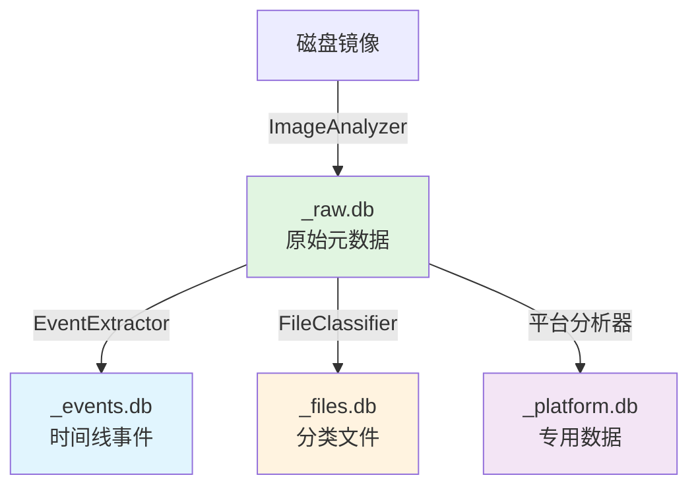
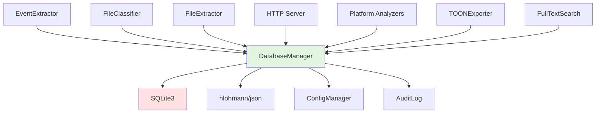
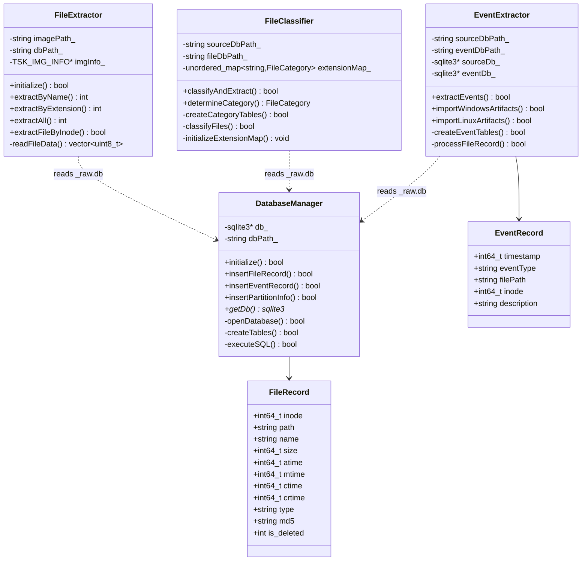
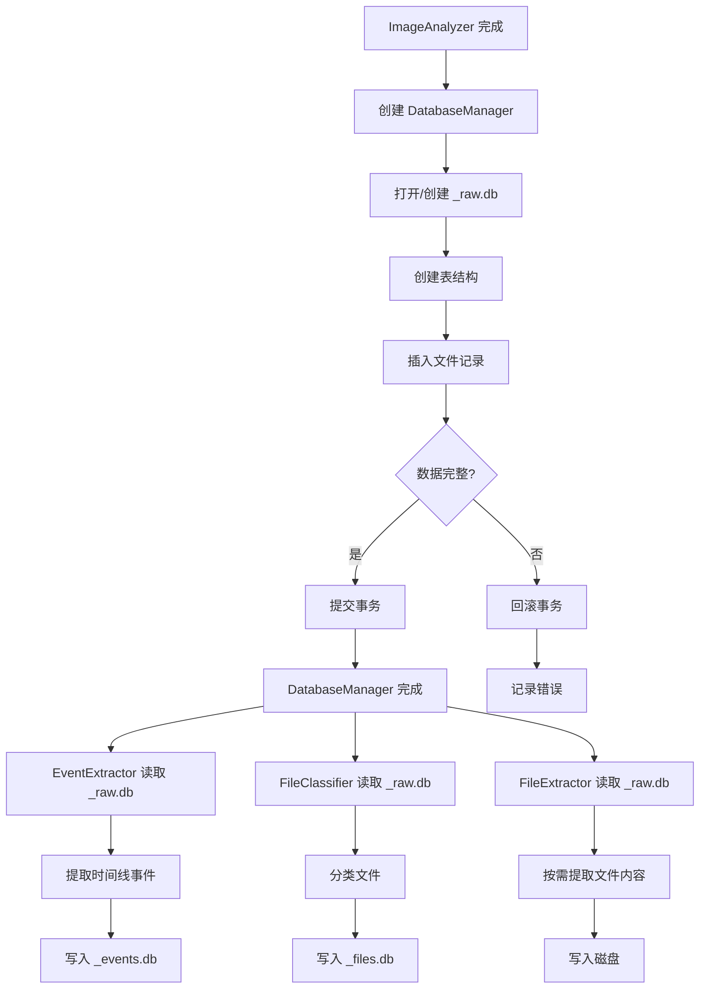

# DatabaseManager 模块文档

## 1. 模块背景

### 业务背景

在数字取证分析中，需要处理和管理海量的文件系统元数据（百万级文件记录）。传统的基于文件的存储方式存在以下问题：

**核心挑战**：
- **数据规模爆炸**：现代磁盘镜像可能包含数百万个文件
- **复杂查询需求**：需要按时间、类型、路径、大小等多维度查询
- **数据一致性**：取证分析要求数据完整性和可追溯性
- **跨模块共享**：多个分析模块需要访问同一数据源
- **性能要求**：TB 级数据需要在合理时间内完成分析

**解决方案**：
DatabaseManager 模块作为取证数据管理的核心，提供：
1. **三层数据库架构**：raw（原始）、events（事件）、files（分类）独立存储
2. **标准化数据接口**：统一的 FileRecord/EventRecord 数据结构
3. **高性能操作**：批量事务、索引优化、预编译语句
4. **完整性保证**：事务回滚、错误恢复、审计日志
5. **模块化设计**：EventExtractor、FileClassifier、FileExtractor 独立工作

**在整体架构中的定位**：
```
ImageAnalyzer → DatabaseManager (_raw.db)
                          ↓
              ┌───────────┼───────────┐
              ↓           ↓           ↓
        EventExtractor  FileClassifier  FileExtractor
              ↓               ↓               ↓
         (_events.db)    (_files.db)    (文件内容)
```

### 技术背景

**为什么选择 SQLite？**

| 数据库 | 优势 | 劣势 | 适用场景 |
|--------|------|------|----------|
| **SQLite** | 嵌入式、零配置、单文件 | 并发写入受限 | ✅ 取证分析（读多写少） |
| **PostgreSQL** | 高并发、丰富特性 | 需要独立服务 | ❌ 单机部署复杂 |
| **MySQL** | 广泛支持 | 同样需要服务 | ❌ 嵌入式不便 |
| **MongoDB** | 文档存储 | Schema 灵活度 | ❌ 结构化查询复杂 |

**技术选型考虑**：

1. **取证场景的特殊性**：
   - 写入阶段：一次性批量写入（分析阶段）
   - 查询阶段：大量并发读取（调查阶段）
   - 审计要求：数据不可篡改（追加式）

2. **SQLite 的优势**：
   - **零配置**：无需数据库服务器，降低部署复杂度
   - **单文件**：便于证据链管理（单一物理文件）
   - **ACID 完整性**：事务支持确保数据一致性
   - **丰富的数据类型**：支持 TEXT、INTEGER、BLOB 等
   - **跨平台**：Windows/Linux/macOS 完全兼容

3. **性能优化手段**：
   - **PRAGMA 设置**：调整缓存、日志模式
   - **索引策略**：为常用查询字段建立索引
   - **批量操作**：事务批量提交
   - **预编译语句**：减少 SQL 编译开销

## 2. 模块功能

### 核心功能

#### 1. 三层数据库架构



**各层数据库职责**：

| 数据库 | 用途 | 主要表 | 查询模式 |
|--------|------|--------|----------|
| `_raw.db` | 原始元数据存储 | files, partitions | 全量查询 |
| `_events.db` | 时间线事件分析 | events, creation_events, ... | 时间序列 |
| `_files.db` | 文件分类统计 | images, videos, documents, ... | 分类聚合 |
| `_android.db` | Android 取证数据 | sms, contacts, call_logs | 平台特定 |
| `_windows.db` | Windows 取证数据 | registry, event_logs, prefetch | 平台特定 |
| `_linux.db` | Linux 取证数据 | system_logs, users, cron | 平台特定 |

#### 2. 数据插入与管理

```cpp
// 基础插入操作
DatabaseManager dbManager("evidence_raw.db");
dbManager.initialize();

FileRecord record;
record.inode = 12345;
record.path = "/home/user/document.pdf";
record.name = "document.pdf";
record.size = 1024;
// ... 填充其他字段

dbManager.insertFileRecord(record);
```

**批量插入优化**：
```cpp
// 批量事务模式
dbManager.beginTransaction();
for (const auto& file : fileVector) {
    dbManager.insertFileRecord(file);
    if (++count % 1000 == 0) {
        dbManager.commit();  // 每 1000 条提交
        dbManager.beginTransaction();
    }
}
dbManager.commit();
```

#### 3. 分区信息管理

```cpp
// 插入分区信息
dbManager.insertPartitionInfo(
    1,                          // 分区号
    0,                          // 起始偏移
    104857600,                  // 长度（字节）
    "NTFS Volume",              // 描述
    "NTFS"                      // 文件系统类型
);

// 查询分区信息
auto partitions = dbManager.getPartitions();
for (const auto& part : partitions) {
    std::cout << "分区 " << part.partition_num << ": "
              << part.description << std::endl;
}
```

#### 4. 子模块集成

**EventExtractor 集成**：
```cpp
// 事件提取器使用 DatabaseManager 读取 _raw.db
EventExtractor extractor("evidence_raw.db", "evidence_events.db");
extractor.extractEvents();  // 生成时间线
```

**FileClassifier 集成**：
```cpp
// 文件分类器使用 DatabaseManager 读取 _raw.db
FileClassifier classifier("evidence_raw.db", "evidence_files.db");
classifier.classifyAndExtract();  // 分类文件
```

**FileExtractor 集成**：
```cpp
// 文件提取器使用 DatabaseManager 查询元数据
FileExtractor extractor("disk_image.dd", "evidence_raw.db");
extractor.extractByExtension(".jpg,.png", "/output/images");
```

### 边界与限制

**功能边界**：
- ❌ 不支持分布式部署（单机 SQLite）
- ❌ 不支持高并发写入（单写者）
- ❌ 不处理文件内容（仅元数据）
- ❌ 不提供数据备份（需外部工具）

**已知限制**：
| 限制 | 影响 | 缓解方法 |
|------|------|----------|
| SQLite 并发写入限制 | 多线程写入性能受限 | 使用单线程批量插入 |
| 单个数据库大小上限 | 通常 2TB（理论上更大） | 分库存储 |
| 内存占用 | 大型查询可能占用大量内存 | 分页查询 |
| 跨数据库查询 | 需要手动 ATTACH | 使用视图或联合查询 |

**性能指标**（参考配置：SSD，8核 CPU，32GB RAM）：
- 插入速度：约 50,000 记录/秒（批量事务）
- 查询速度：<100ms（百万级数据，简单查询）
- 数据库大小：约 1GB/百万文件记录
- 索引创建：约 10 秒/百万记录

## 3. 模块使用的库

### 依赖库清单

| 库名称 | 版本 | 用途 | 许可证 | 官网 |
|--------|------|------|--------|------|
| **SQLite3** | 3.35.0+ | 核心数据库引擎 | Public Domain | https://www.sqlite.org/ |
| **nlohmann/json** | 3.11.2 | JSON 导出功能 | MIT | https://github.com/nlohmann/json |
| **Boost.System** | 1.74+ | 系统调用 | Boost License | https://www.boost.org/ |

### 依赖关系图



**依赖说明**：
- **硬依赖**：SQLite3（核心功能）
- **软依赖**：nlohmann/json（仅导出功能）
- **内部依赖**：ConfigManager、AuditLog（配置和日志）

## 4. 模块实现方式

### 架构设计



### 核心类说明

#### DatabaseManager（主控制器）
**职责**：
- 数据库连接管理
- 表结构创建和维护
- 基础 CRUD 操作

**关键方法**：
```cpp
class DatabaseManager {
public:
    explicit DatabaseManager(const std::string& dbPath);
    ~DatabaseManager();

    // 初始化（打开连接并创建表）
    bool initialize();

    // 数据操作
    bool insertFileRecord(const FileRecord& record);
    bool insertEventRecord(const EventRecord& record);
    bool insertPartitionInfo(int partNum, int64_t start, int64_t length,
                             const std::string& desc, const std::string& fsType);

    // 数据库访问
    sqlite3* getDb() const;
    const std::string& getDbPath() const;

private:
    std::string dbPath_;
    sqlite3* db_;

    bool createTables();
    bool executeSQL(const std::string& sql);
    void checkAndMigrate();
};
```

> **注意**：事务管理需直接使用 `sqlite3_exec(db, "BEGIN TRANSACTION;", ...)` 等原生 SQLite API。`createTables()` 和 `executeSQL()` 为私有方法。

#### EventExtractor（事件提取器）
**职责**：
- 从 FileRecord 提取时间线事件
- 创建事件表和视图
- 集成平台特定事件

**事件类型**：
```cpp
enum class EventType {
    CREATED,    // 文件创建（crtime）
    MODIFIED,   // 文件修改（mtime）
    ACCESSED,   // 文件访问（atime）
    CHANGED,    // 元数据变更（ctime）
    DELETED     // 文件删除（is_deleted + mtime）
};
```

#### FileClassifier（文件分类器）
**职责**：
- 按扩展名和路径分类文件
- 创建分类表
- 生成统计视图

**分类类别**（24+ 种）：
- 基础类别：images, videos, audio, documents, archives, executables
- 高级类别：os_config, os_boot, os_libraries, fs_journal, log_files
- 特殊类别：encrypted, certificates, fonts, cache, temp, backup

#### FileExtractor（文件提取器）
**职责**：
- 从磁盘镜像提取文件内容
- 使用 TSK API 读取数据
- 支持多种提取模式

**提取模式**：
```cpp
enum class ExtractMode {
    BY_NAME,        // 按文件名模式
    BY_EXTENSION,   // 按扩展名
    ALL,            // 所有文件
    DELETED_ONLY    // 仅删除的文件
};
```

### 关键流程



### 数据结构

**输入数据**：
```cpp
// FileRecord（文件元数据）
struct FileRecord {
    int64_t inode;              // inode 编号
    std::string name;           // 文件名
    std::string path;           // 完整路径
    int64_t size;               // 文件大小（字节）
    int64_t atime;              // 访问时间（Unix 时间戳）
    int64_t mtime;              // 修改时间（Unix 时间戳）
    int64_t ctime;              // 元数据变更时间（Unix 时间戳）
    int64_t crtime;             // 创建时间（Unix 时间戳，仅 NTFS）
    std::string type;           // 文件类型（REG, DIR, LNK, FIFO）
    std::string md5;            // MD5 校验和
    int is_deleted;             // 删除标记（0/1）
    int is_allocated;           // 分配状态（0/1）
    std::string permissions;    // 权限字符串（rwxrwxrwx）
    int uid;                    // 用户 ID
    int gid;                    // 组 ID
};

// PartitionInfo（分区信息）
struct PartitionInfo {
    int partition_num;          // 分区号
    int64_t start_offset;       // 起始偏移（字节）
    int64_t length;             // 长度（字节）
    std::string description;    // 描述
    std::string fs_type;        // 文件系统类型
};
```

**输出数据**：
```cpp
// EventRecord（事件记录）
struct EventRecord {
    int64_t timestamp;          // 事件时间（Unix 时间戳）
    std::string eventType;      // 事件类型（CREATED, MODIFIED, etc.）
    std::string filePath;       // 文件路径
    int64_t inode;              // inode 编号
    std::string description;    // 事件描述
};

// ClassifiedFileRecord（分类文件记录）
struct ClassifiedFileRecord {
    int64_t inode;
    std::string name;
    std::string path;
    int64_t size;
    std::string extension;      // 文件扩展名
    int64_t mtime;
    int64_t ctime;
    int is_deleted;
    std::string md5;
};
```

**数据库模式**：
```sql
-- _raw.db 主表
CREATE TABLE files (
    id INTEGER PRIMARY KEY AUTOINCREMENT,
    inode INTEGER UNIQUE,
    name TEXT NOT NULL,
    path TEXT NOT NULL,
    size INTEGER,
    atime INTEGER,
    mtime INTEGER,
    ctime INTEGER,
    crtime INTEGER,
    type TEXT,
    md5 TEXT,
    is_deleted INTEGER DEFAULT 0,
    is_allocated INTEGER DEFAULT 1,
    permissions TEXT,
    uid INTEGER,
    gid INTEGER
);

CREATE TABLE partitions (
    id INTEGER PRIMARY KEY AUTOINCREMENT,
    partition_num INTEGER,
    start_offset INTEGER,
    length INTEGER,
    description TEXT,
    fs_type TEXT
);

-- 索引
CREATE INDEX idx_files_inode ON files(inode);
CREATE INDEX idx_files_path ON files(path);
CREATE INDEX idx_files_extension ON files(path);
CREATE INDEX idx_files_size ON files(size);
CREATE INDEX idx_files_mtime ON files(mtime);
```

## 5. API 调用

### C++ API

#### 基础用法

```cpp
#include "core/DatabaseManager/DatabaseManager.h"

int main() {
    // 1. 创建 DatabaseManager 实例
    DatabaseManager dbManager("evidence_raw.db");

    // 2. 初始化数据库
    if (!dbManager.initialize()) {
        std::cerr << "数据库初始化失败" << std::endl;
        return 1;
    }

    // 3. 插入文件记录
    FileRecord record;
    record.inode = 12345;
    record.path = "/home/user/document.pdf";
    record.name = "document.pdf";
    record.size = 1024;
    record.atime = 1640995200;
    record.mtime = 1640995200;
    record.ctime = 1640995200;
    record.crtime = 1640995200;
    record.type = "REG";
    record.md5 = "d41d8cd98f00b204e9800998ecf8427e";
    record.is_deleted = 0;
    record.is_allocated = 1;
    record.permissions = "rw-r--r--";
    record.uid = 1000;
    record.gid = 1000;

    if (!dbManager.insertFileRecord(record)) {
        std::cerr << "插入文件记录失败" << std::endl;
        return 1;
    }

    // 4. 插入分区信息
    dbManager.insertPartitionInfo(
        1,                      // 分区号
        0,                      // 起始偏移
        104857600,              // 长度
        "NTFS Volume",          // 描述
        "NTFS"                  // 文件系统类型
    );

    std::cout << "数据插入成功" << std::endl;
    return 0;
}
```

#### 批量操作

```cpp
// 批量插入（事务模式）
DatabaseManager dbManager("evidence_raw.db");
dbManager.initialize();

std::vector<FileRecord> records = {/* 大量记录 */};

dbManager.beginTransaction();
size_t count = 0;
for (const auto& record : records) {
    if (!dbManager.insertFileRecord(record)) {
        std::cerr << "插入失败，回滚事务" << std::endl;
        dbManager.rollback();
        return 1;
    }

    if (++count % 1000 == 0) {
        dbManager.commit();
        dbManager.beginTransaction();
        std::cout << "已插入 " << count << " 条记录" << std::endl;
    }
}
dbManager.commit();
```

#### 查询操作

```cpp
// 直接使用 SQLite API
sqlite3* db = dbManager.getDb();

// 准备查询
const char* query = "SELECT path, size, mtime FROM files WHERE size > ?";
sqlite3_stmt* stmt;
int rc = sqlite3_prepare_v2(db, query, -1, &stmt, nullptr);
if (rc != SQLITE_OK) {
    std::cerr << "查询准备失败: " << sqlite3_errmsg(db) << std::endl;
    return 1;
}

// 绑定参数
sqlite3_bind_int64(stmt, 1, 1024 * 1024);  // 查找大于 1MB 的文件

// 执行查询
while (sqlite3_step(stmt) == SQLITE_ROW) {
    const char* path = reinterpret_cast<const char*>(sqlite3_column_text(stmt, 0));
    int64_t size = sqlite3_column_int64(stmt, 1);
    int64_t mtime = sqlite3_column_int64(stmt, 2);

    std::cout << "文件: " << path
              << ", 大小: " << size
              << ", 修改时间: " << mtime << std::endl;
}

sqlite3_finalize(stmt);
```

#### 跨数据库查询

```cpp
// 附加其他数据库
sqlite3* db = dbManager.getDb();

// 附加 events 数据库
std::string attachSQL = "ATTACH DATABASE 'evidence_events.db' AS events;";
sqlite3_exec(db, attachSQL.c_str(), nullptr, nullptr, nullptr);

// 跨库查询
const char* query = R"(
    SELECT f.path, f.size, e.event_type, e.timestamp
    FROM files f
    JOIN events.events e ON f.inode = e.inode
    WHERE f.extension = '.pdf'
    ORDER BY e.timestamp DESC
    LIMIT 100
)";

sqlite3_stmt* stmt;
sqlite3_prepare_v2(db, query, -1, &stmt, nullptr);

while (sqlite3_step(stmt) == SQLITE_ROW) {
    // 处理结果
}

sqlite3_finalize(stmt);

// 分离数据库
sqlite3_exec(db, "DETACH DATABASE events;", nullptr, nullptr, nullptr);
```

### REST API

**通过 HTTP 服务器访问**：

```bash
# 查询文件
curl "http://localhost:8080/api/db/files?limit=100&offset=0"

# 按扩展名过滤
curl "http://localhost:8080/api/db/files?extension=pdf&min_size=1048576"

# 按日期范围查询
curl "http://localhost:8080/api/db/files?start_date=2024-01-01&end_date=2024-12-31"

# 查询时间线
curl "http://localhost:8080/api/db/timeline?hours=24&event_type=DELETED"

# 获取统计信息
curl "http://localhost:8080/api/db/statistics"

# 导出为 TOON 格式
curl -X POST "http://localhost:8080/api/db/export/toon" \
  -H "Content-Type: application/json" \
  -d '{
    "tables": ["files"],
    "fields": ["path", "size", "mtime"],
    "filters": {"extension": ".pdf"}
  }'
```

**API 响应示例**：
```json
{
  "success": true,
  "files": [
    {
      "inode": 12345,
      "path": "/home/user/document.pdf",
      "name": "document.pdf",
      "size": 1048576,
      "mtime": 1640995200,
      "extension": ".pdf",
      "is_deleted": false
    }
  ],
  "total_count": 15234,
  "page": 0,
  "page_size": 100
}
```

### API 参数说明

#### REST API 参数

| 参数名 | 类型 | 必填 | 说明 | 示例 |
|--------|------|------|------|------|
| `limit` | integer | ❌ | 返回记录数 | `100` |
| `offset` | integer | ❌ | 起始偏移 | `0` |
| `extension` | string | ❌ | 文件扩展名 | `.pdf` |
| `min_size` | integer | ❌ | 最小文件大小 | `1048576` |
| `max_size` | integer | ❌ | 最大文件大小 | `104857600` |
| `start_date` | string | ❌ | 起始日期 | `2024-01-01` |
| `end_date` | string | ❌ | 结束日期 | `2024-12-31` |
| `is_deleted` | boolean | ❌ | 是否删除 | `true` |
| `sort_by` | string | ❌ | 排序字段 | `mtime` |
| `sort_order` | string | ❌ | 排序方向 | `desc` |

### 返回值说明

**成功响应**：
```json
{
  "success": true,
  "data": { /* 数据内容 */ },
  "total_count": 15234,
  "execution_time_ms": 45
}
```

**错误响应**：
```json
{
  "success": false,
  "error_code": "DATABASE_ERROR",
  "message": "无法打开数据库",
  "details": "Error: unable to open database file"
}
```

## 6. 二次开发

### 扩展点

#### 1. 添加新的数据表

**位置**：`src/core/DatabaseManager/SQL/` 目录下创建新的 `.h` 文件

**示例**：添加数字签名表

```cpp
// digital_signature_sql.h
#pragma once
#include <string>

namespace forensics {
namespace db {

static const char* CREATE_DIGITAL_SIGNATURE_TABLE = R"(
CREATE TABLE IF NOT EXISTS digital_signatures (
    id INTEGER PRIMARY KEY AUTOINCREMENT,
    file_id INTEGER NOT NULL,
    signature_type TEXT NOT NULL,
    signer_name TEXT,
    signing_time INTEGER,
    certificate_hash TEXT,
    signature_valid INTEGER,
    FOREIGN KEY (file_id) REFERENCES files(id)
);

CREATE INDEX IF NOT EXISTS idx_signature_file_id
ON digital_signatures(file_id);
)";

static const char* INSERT_DIGITAL_SIGNATURE = R"(
INSERT INTO digital_signatures (
    file_id, signature_type, signer_name, signing_time,
    certificate_hash, signature_valid
) VALUES (?, ?, ?, ?, ?, ?)
)";

} // namespace db
} // namespace forensics
```

**集成到 DatabaseManager**：
```cpp
// DatabaseManager.h
class DatabaseManager {
public:
    // ... 现有方法
    bool insertDigitalSignature(const DigitalSignature& signature);

private:
    bool createDigitalSignatureTable();
};

// DatabaseManager.cpp
bool DatabaseManager::createTables() {
    // 现有表创建
    // ...

    // 创建新表
    return createDigitalSignatureTable();
}

bool DatabaseManager::createDigitalSignatureTable() {
    return executeSQL(CREATE_DIGITAL_SIGNATURE_TABLE);
}
```

#### 2. 自定义查询接口

**位置**：`src/core/DatabaseManager/DatabaseManager.h`

**示例**：添加复杂查询方法

```cpp
class DatabaseManager {
public:
    // ... 现有方法

    // 新增：按时间范围查询文件
    std::vector<FileRecord> queryByTimeRange(
        int64_t startTime,
        int64_t endTime,
        const std::string& eventType = ""
    );

    // 新增：按路径前缀查询
    std::vector<FileRecord> queryByPathPrefix(
        const std::string& pathPrefix
    );

    // 新增：统计查询
    struct FileStatistics {
        size_t total_files;
        size_t total_size;
        size_t deleted_files;
        std::map<std::string, size_t> extension_counts;
    };
    FileStatistics getStatistics();
};
```

**实现示例**：
```cpp
// DatabaseManager.cpp
std::vector<FileRecord> DatabaseManager::queryByTimeRange(
    int64_t startTime,
    int64_t endTime,
    const std::string& eventType) {

    std::vector<FileRecord> results;
    sqlite3* db = getDb();

    std::string query = R"(
        SELECT * FROM files
        WHERE mtime BETWEEN ? AND ?
    )";

    if (!eventType.empty()) {
        // 如果需要关联事件表，需要 ATTACH
        query += " AND EXISTS ("
                 "  SELECT 1 FROM events e "
                 "  WHERE e.inode = files.inode "
                 "  AND e.event_type = ?"
                 ")";
    }

    sqlite3_stmt* stmt;
    if (sqlite3_prepare_v2(db, query.c_str(), -1, &stmt, nullptr) != SQLITE_OK) {
        LOG_ERROR("查询准备失败: " + std::string(sqlite3_errmsg(db)));
        return results;
    }

    sqlite3_bind_int64(stmt, 1, startTime);
    sqlite3_bind_int64(stmt, 2, endTime);
    if (!eventType.empty()) {
        sqlite3_bind_text(stmt, 3, eventType.c_str(), -1, SQLITE_TRANSIENT);
    }

    while (sqlite3_step(stmt) == SQLITE_ROW) {
        FileRecord record;
        // 从结果集填充 record
        record.inode = sqlite3_column_int64(stmt, sqlite3_column_index(stmt, "inode"));
        record.path = reinterpret_cast<const char*>(
            sqlite3_column_text(stmt, sqlite3_column_index(stmt, "path"))
        );
        // ... 填充其他字段
        results.push_back(record);
    }

    sqlite3_finalize(stmt);
    return results;
}
```

#### 3. 添加数据导出功能

**位置**：创建新的 `src/core/DatabaseManager/Exporter.h`

**示例**：导出为 CSV 格式

```cpp
// Exporter.h
#pragma once
#include "DatabaseManager.h"
#include <fstream>

class DatabaseExporter {
public:
    explicit DatabaseExporter(DatabaseManager* dbManager);

    bool exportToCSV(const std::string& tableName,
                     const std::string& outputPath,
                     const std::vector<std::string>& columns = {});

    bool exportToJSON(const std::string& tableName,
                      const std::string& outputPath);

    bool exportToTOON(const std::string& tableName,
                      const std::string& outputPath);

private:
    DatabaseManager* dbManager_;

    std::string escapeCSV(const std::string& value);
};

// Exporter.cpp
bool DatabaseExporter::exportToCSV(const std::string& tableName,
                                   const std::string& outputPath,
                                   const std::vector<std::string>& columns) {
    sqlite3* db = dbManager_->getDb();

    // 如果没有指定列，查询所有列
    std::string columnList;
    if (columns.empty()) {
        columnList = "*";
    } else {
        columnList = implode(columns, ", ");
    }

    std::string query = "SELECT " + columnList + " FROM " + tableName;

    sqlite3_stmt* stmt;
    if (sqlite3_prepare_v2(db, query.c_str(), -1, &stmt, nullptr) != SQLITE_OK) {
        LOG_ERROR("查询准备失败");
        return false;
    }

    std::ofstream outFile(outputPath);
    if (!outFile.is_open()) {
        LOG_ERROR("无法打开输出文件: " + outputPath);
        return false;
    }

    // 写入 CSV 头部
    int columnCount = sqlite3_column_count(stmt);
    for (int i = 0; i < columnCount; ++i) {
        if (i > 0) outFile << ",";
        outFile << sqlite3_column_name(stmt, i);
    }
    outFile << "\n";

    // 写入数据行
    while (sqlite3_step(stmt) == SQLITE_ROW) {
        for (int i = 0; i < columnCount; ++i) {
            if (i > 0) outFile << ",";

            const char* value = reinterpret_cast<const char*>(
                sqlite3_column_text(stmt, i)
            );
            outFile << escapeCSV(value ? value : "");
        }
        outFile << "\n";
    }

    sqlite3_finalize(stmt);
    outFile.close();

    LOG_INFO("导出完成: " + outputPath);
    return true;
}
```

### 添加新功能的步骤

#### 步骤 1：定义数据结构

```cpp
// DatabaseManagerDataTypes.h
struct EmailMetadata {
    int64_t inode;
    std::string from;
    std::string to;
    std::string subject;
    int64_t sent_time;
    std::vector<std::string> attachments;
};
```

#### 步骤 2：创建数据库模式

```cpp
// email_metadata_sql.h
static const char* CREATE_EMAIL_METADATA_TABLE = R"(
CREATE TABLE IF NOT EXISTS email_metadata (
    id INTEGER PRIMARY KEY AUTOINCREMENT,
    inode INTEGER NOT NULL UNIQUE,
    from_address TEXT NOT NULL,
    to_address TEXT NOT NULL,
    subject TEXT,
    sent_time INTEGER,
    attachments TEXT,  -- JSON array
    FOREIGN KEY (inode) REFERENCES files(inode)
);
)";
```

#### 步骤 3：实现插入逻辑

```cpp
// DatabaseManager.cpp
bool DatabaseManager::insertEmailMetadata(const EmailMetadata& metadata) {
    sqlite3* db = getDb();

    const char* query = R"(
        INSERT INTO email_metadata (
            inode, from_address, to_address, subject, sent_time, attachments
        ) VALUES (?, ?, ?, ?, ?, ?)
    )";

    sqlite3_stmt* stmt;
    if (sqlite3_prepare_v2(db, query, -1, &stmt, nullptr) != SQLITE_OK) {
        return false;
    }

    sqlite3_bind_int64(stmt, 1, metadata.inode);
    sqlite3_bind_text(stmt, 2, metadata.from.c_str(), -1, SQLITE_TRANSIENT);
    sqlite3_bind_text(stmt, 3, metadata.to.c_str(), -1, SQLITE_TRANSIENT);
    sqlite3_bind_text(stmt, 4, metadata.subject.c_str(), -1, SQLITE_TRANSIENT);
    sqlite3_bind_int64(stmt, 5, metadata.sent_time);

    // 转换附件为 JSON 字符串
    nlohmann::json attachmentsJson = metadata.attachments;
    std::string attachmentsStr = attachmentsJson.dump();
    sqlite3_bind_text(stmt, 6, attachmentsStr.c_str(), -1, SQLITE_TRANSIENT);

    bool success = (sqlite3_step(stmt) == SQLITE_DONE);
    sqlite3_finalize(stmt);

    return success;
}
```

#### 步骤 4：添加查询接口

```cpp
// DatabaseManager.h
class DatabaseManager {
public:
    std::vector<EmailMetadata> queryEmails(
        const std::string& from = "",
        const std::string& to = "",
        int64_t startTime = 0,
        int64_t endTime = 0
    );
};
```

### 代码示例

#### 完整的数据库操作示例

```cpp
// comprehensive_example.cpp
#include "core/DatabaseManager/DatabaseManager.h"
#include "core/AuditLog/AuditLog.h"

int main() {
    // 1. 初始化日志
    Logger::instance().setLevel(LogLevel::INFO);
    Logger::instance().setOutput(LogOutput::FILE, "database_example.log");

    LOG_INFO("开始数据库操作示例");

    // 2. 创建数据库管理器
    DatabaseManager dbManager("example_raw.db");
    if (!dbManager.initialize()) {
        LOG_ERROR("数据库初始化失败");
        return 1;
    }

    // 3. 开始批量插入
    LOG_INFO("开始批量插入数据");
    dbManager.beginTransaction();

    // 模拟文件数据
    std::vector<FileRecord> files;
    for (int i = 0; i < 10000; ++i) {
        FileRecord record;
        record.inode = i + 1;
        record.path = "/test/file_" + std::to_string(i) + ".txt";
        record.name = "file_" + std::to_string(i) + ".txt";
        record.size = 1024 * (i % 100 + 1);
        record.atime = 1640995200 + i * 3600;
        record.mtime = 1640995200 + i * 3600;
        record.ctime = 1640995200 + i * 3600;
        record.type = "REG";
        record.is_deleted = (i % 10 == 0);  // 每 10 个文件模拟一个删除文件
        record.is_allocated = !record.is_deleted;
        files.push_back(record);
    }

    // 批量插入
    size_t successCount = 0;
    for (const auto& file : files) {
        if (dbManager.insertFileRecord(file)) {
            ++successCount;
        }
    }

    // 4. 提交事务
    if (successCount == files.size()) {
        dbManager.commit();
        LOG_INFO("成功插入 " + std::to_string(successCount) + " 条记录");
    } else {
        dbManager.rollback();
        LOG_ERROR("插入失败，已回滚");
        return 1;
    }

    // 5. 查询数据
    LOG_INFO("开始查询数据");
    sqlite3* db = dbManager.getDb();

    const char* query = R"(
        SELECT COUNT(*) as total,
               SUM(size) as total_size,
               AVG(size) as avg_size
        FROM files
        WHERE is_deleted = 0
    )";

    sqlite3_stmt* stmt;
    sqlite3_prepare_v2(db, query, -1, &stmt, nullptr);

    if (sqlite3_step(stmt) == SQLITE_ROW) {
        int total = sqlite3_column_int(stmt, 0);
        int64_t totalSize = sqlite3_column_int64(stmt, 1);
        double avgSize = sqlite3_column_double(stmt, 2);

        LOG_INFO("总文件数: " + std::to_string(total));
        LOG_INFO("总大小: " + std::to_string(totalSize) + " 字节");
        LOG_INFO("平均大小: " + std::to_string(avgSize) + " 字节");
    }

    sqlite3_finalize(stmt);

    // 6. 按扩展名统计
    const char* extQuery = R"(
        SELECT SUBSTR(name, -4) as ext,
               COUNT(*) as count,
               SUM(size) as total_size
        FROM files
        GROUP BY ext
        ORDER BY count DESC
        LIMIT 10
    )";

    sqlite3_prepare_v2(db, extQuery, -1, &stmt, nullptr);

    LOG_INFO("扩展名统计 Top 10:");
    while (sqlite3_step(stmt) == SQLITE_ROW) {
        const char* ext = reinterpret_cast<const char*>(
            sqlite3_column_text(stmt, 0)
        );
        int count = sqlite3_column_int(stmt, 1);
        int64_t totalSize = sqlite3_column_int64(stmt, 2);

        LOG_INFO("  " + std::string(ext) + ": " +
                std::to_string(count) + " 个文件, " +
                std::to_string(totalSize) + " 字节");
    }

    sqlite3_finalize(stmt);

    LOG_INFO("数据库操作示例完成");
    return 0;
}
```

### 最佳实践

#### 性能优化

**1. 使用事务**：
```cpp
// 错误：逐条插入（极慢）
for (const auto& file : files) {
    dbManager.insertFileRecord(file);  // 每次都创建隐式事务
}

// 正确：批量事务（快 100 倍）
dbManager.beginTransaction();
for (const auto& file : files) {
    dbManager.insertFileRecord(file);
}
dbManager.commit();
```

**2. 预编译语句**：
```cpp
// 错误：每次编译 SQL
for (int i = 0; i < 10000; ++i) {
    std::string sql = "INSERT INTO files (inode, path) VALUES (" +
                     std::to_string(i) + ", '/path" + std::to_string(i) + "')";
    sqlite3_exec(db, sql.c_str(), ...);  // 每次都编译
}

// 正确：预编译一次
sqlite3_stmt* stmt;
sqlite3_prepare_v2(db, "INSERT INTO files (inode, path) VALUES (?, ?)", -1, &stmt, nullptr);
for (int i = 0; i < 10000; ++i) {
    sqlite3_bind_int(stmt, 1, i);
    sqlite3_bind_text(stmt, 2, ("/path" + std::to_string(i)).c_str(), -1, SQLITE_TRANSIENT);
    sqlite3_step(stmt);
    sqlite3_reset(stmt);
}
sqlite3_finalize(stmt);
```

**3. 索引策略**：
```sql
-- 为常用查询字段创建索引
CREATE INDEX idx_files_extension ON files(SUBSTR(path, -4));  -- 扩展名
CREATE INDEX idx_files_size ON files(size);  -- 文件大小
CREATE INDEX idx_files_mtime ON files(mtime);  -- 修改时间

-- 复合索引（多列查询）
CREATE INDEX idx_files_ext_size ON files(SUBSTR(path, -4), size);
```

#### 常见陷阱

**1. 内存泄漏**：
```cpp
// 错误：忘记释放语句
sqlite3_stmt* stmt;
sqlite3_prepare_v2(db, query, -1, &stmt, nullptr);
sqlite3_step(stmt);
// 忘记调用 sqlite3_finalize(stmt);

// 正确：使用 RAII
struct StmtGuard {
    sqlite3_stmt* stmt;
    explicit StmtGuard(sqlite3_stmt* s) : stmt(s) {}
    ~StmtGuard() { if (stmt) sqlite3_finalize(stmt); }
};

sqlite3_stmt* stmt;
sqlite3_prepare_v2(db, query, -1, &stmt, nullptr);
StmtGuard guard(stmt);  // 自动释放
```

**2. SQL 注入**：
```cpp
// 错误：字符串拼接（易受 SQL 注入）
std::string query = "SELECT * FROM files WHERE path = '" + userInput + "'";
sqlite3_exec(db, query.c_str(), ...);

// 正确：参数化查询
sqlite3_stmt* stmt;
sqlite3_prepare_v2(db, "SELECT * FROM files WHERE path = ?", -1, &stmt, nullptr);
sqlite3_bind_text(stmt, 1, userInput.c_str(), -1, SQLITE_TRANSIENT);
```

**3. 事务嵌套**：
```cpp
// SQLite 不支持真正的事务嵌套
dbManager.beginTransaction();
// ... 一些操作
dbManager.beginTransaction();  // 这会提交上一个事务！
// ... 更多操作
dbManager.commit();  // 只提交第二个事务
```

#### 调试技巧

**1. 启用 SQL 日志**：
```cpp
// 在代码中添加
sqlite3_trace(db, [](void* data, const char* sql) {
    std::cout << "SQL: " << sql << std::endl;
}, nullptr);
```

**2. 检查查询计划**：
```sql
EXPLAIN QUERY PLAN SELECT * FROM files WHERE size > 1024;
-- 输出:
-- SCAN TABLE FILES  -- 全表扫描（需要优化）
-- SEARCH TABLE FILES USING INDEX idx_files_size (size>?)  -- 使用索引（好）
```

**3. 性能分析**：
```cpp
#include <chrono>

auto start = std::chrono::high_resolution_clock::now();
// 数据库操作
auto end = std::chrono::high_resolution_clock::now();
auto duration = std::chrono::duration_cast<std::chrono::milliseconds>(end - start);
std::cout << "耗时: " << duration.count() << " ms" << std::endl;
```

## 7. 其他

### 测试

**单元测试位置**：
```
tests/UnitTest/
├── test_database_manager_gtest.cpp
├── test_event_extractor_gtest.cpp
├── test_file_classifier_gtest.cpp
└── test_file_extractor_gtest.cpp
```

**运行测试**：
```bash
cd build

# 运行所有数据库测试
ctest -R database -V

# 运行特定测试
./test_database_manager_gtest

# 运行特定测试用例
./test_database_manager_gtest --gtest_filter="DatabaseManagerTest.InsertFile"
```

**示例测试用例**：
```cpp
TEST(DatabaseManagerTest, InsertFileRecord) {
    DatabaseManager dbManager(":memory:");  // 内存数据库
    ASSERT_TRUE(dbManager.initialize());

    FileRecord record;
    record.inode = 12345;
    record.path = "/test/file.txt";
    record.name = "file.txt";
    record.size = 1024;

    EXPECT_TRUE(dbManager.insertFileRecord(record));

    // 验证插入
    sqlite3* db = dbManager.getDb();
    const char* query = "SELECT COUNT(*) FROM files WHERE inode = 12345";
    sqlite3_stmt* stmt;
    sqlite3_prepare_v2(db, query, -1, &stmt, nullptr);

    ASSERT_EQ(sqlite3_step(stmt), SQLITE_ROW);
    EXPECT_EQ(sqlite3_column_int(stmt, 0), 1);

    sqlite3_finalize(stmt);
}

TEST(DatabaseManagerTest, TransactionRollback) {
    DatabaseManager dbManager(":memory:");
    ASSERT_TRUE(dbManager.initialize());

    dbManager.beginTransaction();

    FileRecord record;
    record.inode = 12345;
    record.path = "/test/file.txt";
    EXPECT_TRUE(dbManager.insertFileRecord(record));

    dbManager.rollback();  // 回滚

    // 验证数据未插入
    sqlite3* db = dbManager.getDb();
    const char* query = "SELECT COUNT(*) FROM files";
    sqlite3_stmt* stmt;
    sqlite3_prepare_v2(db, query, -1, &stmt, nullptr);

    ASSERT_EQ(sqlite3_step(stmt), SQLITE_ROW);
    EXPECT_EQ(sqlite3_column_int(stmt, 0), 0);

    sqlite3_finalize(stmt);
}
```

### 配置

**配置文件位置**：`.env` 文件

**相关配置项**：
```env
# 数据库配置
DB_DIR=data
DB_BUSY_TIMEOUT_MS=5000
DB_JOURNAL_MODE=WAL
DB_SYNCHRONOUS=NORMAL

# 性能配置
DB_CACHE_SIZE_MB=256
DB_PAGE_SIZE=4096
DB_MMAP_SIZE=30000000000

# 批处理配置
BATCH_INSERT_SIZE=1000
EXPORT_BATCH_SIZE=5000

# 日志配置
DB_LOG_LEVEL=INFO
```

**运行时配置**：
```cpp
// 通过 ConfigManager
ConfigManager& config = ConfigManager::instance();
config.load(".env");

int busyTimeout = config.getDBBusyTimeoutMs();
std::string journalMode = config.getDBJournalMode();

// 应用 SQLite PRAGMA
sqlite3_busy_timeout(db, busyTimeout);
executeSQL("PRAGMA journal_mode = " + journalMode + ";");
```

### 故障排查

| 问题 | 可能原因 | 解决方法 |
|------|----------|----------|
| **数据库锁定** | 多个进程同时写入 | 确保单写者，使用 WAL 模式 |
| **查询缓慢** | 缺少索引 | 为常用查询字段添加索引 |
| **内存不足** | 大型结果集 | 使用分页查询 |
| **数据库损坏** | 磁盘错误或强制关闭 | 运行 `PRAGMA integrity_check` |
| **插入失败** | 约束冲突 | 检查 UNIQUE/FOREIGN KEY 约束 |
| **跨库查询失败** | 数据库未附加 | 使用 `ATTACH DATABASE` |

**调试命令**：
```bash
# 检查数据库完整性
sqlite3 evidence_raw.db "PRAGMA integrity_check;"

# 查看表结构
sqlite3 evidence_raw.db ".schema files"

# 分析查询性能
sqlite3 evidence_raw.db "EXPLAIN QUERY PLAN SELECT * FROM files WHERE size > 1024;"

# 导出数据库
sqlite3 evidence_raw.db ".dump > backup.sql"

# 导入数据库
sqlite3 new_db.db < backup.sql

# 查看数据库信息
sqlite3 evidence_raw.db "PRAGMA database_list;"
sqlite3 evidence_raw.db "PRAGMA table_info(files);"
```

### 相关模块

- **[ImageAnalyzer](../analyzers/ImageAnalyzer.md)** - 镜像分析，生成 _raw.db 数据源
- **[EventExtractor](./EventExtractor.md)** - 事件提取，生成 _events.db
- **[FileClassifier](./FileClassifier.md)** - 文件分类，生成 _files.db
- **[FileExtractor](./FileExtractor.md)** - 文件提取，基于 _raw.db 查询
- **[AndroidAnalyzer](../analyzers/AndroidAnalyzer.md)** - Android 分析，读取 _raw.db
- **[WindowsFilesAnalyzer](../analyzers/WindowsFilesAnalyzer.md)** - Windows 分析，读取 _raw.db
- **[LinuxFilesAnalyzer](../analyzers/LinuxFilesAnalyzer.md)** - Linux 分析，读取 _raw.db
- **[TOONExporter](./TOONExporter.md)** - TOON 格式导出，读取数据库
- **[FullTextSearch](./FullTextSearch.md)** - 全文搜索，索引文件内容

### 参考资源

**官方文档**：
- [SQLite 官方文档](https://www.sqlite.org/docs.html)
- [SQLite PRAGMA 语句](https://www.sqlite.org/pragma.html)
- [SQLite 数据类型](https://www.sqlite.org/datatype3.html)

**性能优化**：
- [SQLite 查询优化](https://www.sqlite.org/queryoptimizer.html)
- [SQLite 性能调优](https://www.sqlite.org/performance.html)

**最佳实践**：
- [SQLite Appropriate Uses](https://www.sqlite.org/whentouse.html)
- [SQLite FAQ](https://www.sqlite.org/faq.html)

**推荐阅读**：
- "The Definitive Guide to SQLite" by Mike Owens
- "SQL and Relational Theory" by C.J. Date

### 变更历史

| 版本 | 日期 | 变更内容 | 作者 |
|------|------|----------|------|
| 1.0.0 | 2024-01-10 | 初始版本，基础数据库功能 | Forensics Team |
| 1.1.0 | 2024-04-15 | 添加 EventExtractor 子模块 | Forensics Team |
| 1.2.0 | 2024-06-20 | 添加 FileClassifier 子模块 | Forensics Team |
| 1.3.0 | 2024-08-25 | 性能优化，批量事务支持 | Forensics Team |
| 1.4.0 | 2024-11-10 | 添加 TOON 导出功能 | Forensics Team |
| 2.0.0 | 2025-01-05 | 重构为模块化架构 | Forensics Team |
| 2.1.0 | 2025-03-15 | 添加跨数据库查询支持 | Forensics Team |

---

**最后更新**: 2026-05-19
**维护者**: ymj68520
**联系方式**: 见项目 GitHub 仓库
