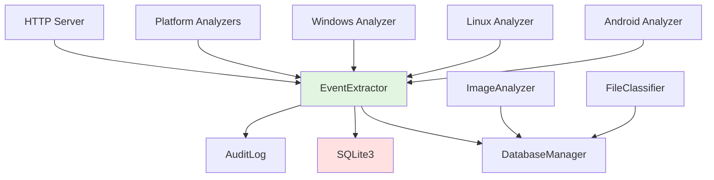
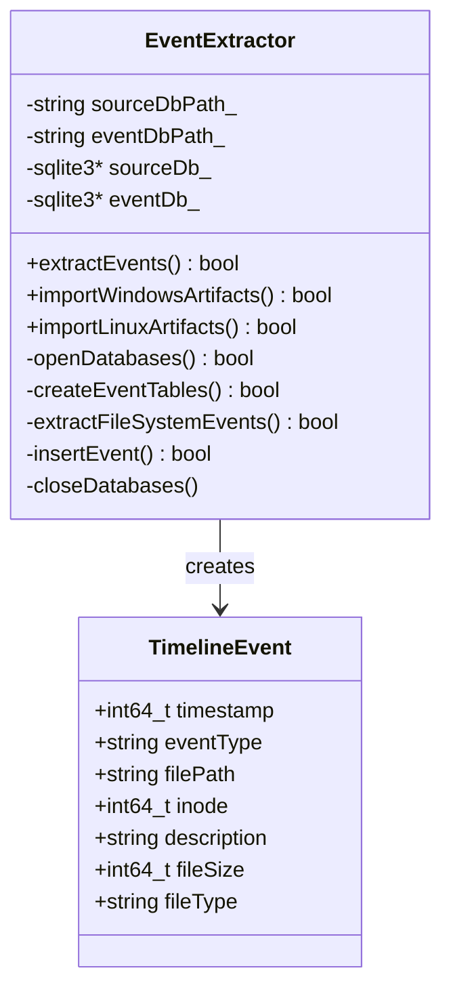
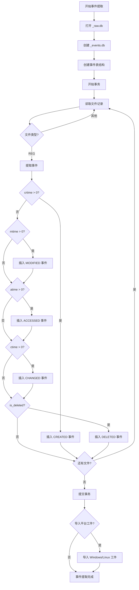

# EventExtractor 模块文档

## 1. 模块背景

### 业务背景

在数字取证调查中，时间线分析是最核心的技术手段之一。调查人员需要重建事件发生的时间序列，以了解"发生了什么"、"何时发生"、"以何种顺序发生"。

**核心挑战**：
- **时间戳复杂性**：文件系统提供多个时间戳（atime、mtime、ctime、crtime），每个都有不同的含义
- **事件关联性**：需要将文件系统事件与平台特定事件（Windows 日志、Linux 系统日志）关联
- **数据规模**：百万级文件会产生数百万事件，需要高效存储和查询
- **时间精度**：不同文件系统的时间戳精度不同（秒级、毫秒级）
- **删除文件**：需要从元数据推断删除事件

**解决方案**：
EventExtractor 模块作为取证分析管道的第二步，提供：
1. **智能事件提取**：从文件系统时间戳生成结构化事件
2. **多类型事件**：CREATED、MODIFIED、ACCESSED、CHANGED、DELETED 五种事件类型
3. **平台集成**：导入 Windows/Linux 特定时间线数据
4. **专用表结构**：为每种事件类型创建独立表，提高查询效率
5. **分析视图**：提供时间线视图、统计视图和活动模式视图

**在整体架构中的定位**：
```
ImageAnalyzer → _raw.db → EventExtractor → _events.db
                                    ↓
                           [events, creation_events, modification_events,
                            access_events, change_events, deletion_events]
                                    ↓
                              时间线分析与可视化
```

### 技术背景

**为什么需要独立的事件数据库？**

| 方案 | 优势 | 劣势 | 适用场景 |
|------|------|------|----------|
| **原始查询** | 无额外存储 | 查询复杂，性能差 | 临时分析 |
| **事件视图** | 简单实现 | 功能受限，无法扩展 | 简单场景 |
| **事件数据库** | 结构化，高性能，可扩展 | 需要额外存储 | ✅ 专业取证 |

**文件系统时间戳解析**：

| 时间戳 | 含义 | 更新时机 | 可用性 |
|--------|------|----------|--------|
| **atime** | Access Time | 文件内容被读取 | 大多数文件系统 |
| **mtime** | Modification Time | 文件内容被修改 | 所有文件系统 |
| **ctime** | Change Time | 元数据变更 | Unix 文件系统 |
| **crtime** | Creation/Birth Time | 文件创建 | NTFS、EXT4、XFS |
| **delete_time** | Deletion Time | 文件删除 | 需从 is_deleted 推断 |

**事件类型映射**：
```
crtime > 0  →  CREATED 事件
mtime > 0 && mtime ≠ crtime  →  MODIFIED 事件
atime > 0 && atime ≠ mtime && atime ≠ crtime  →  ACCESSED 事件
ctime > 0 && ctime ≠ mtime && ctime ≠ crtime  →  CHANGED 事件
is_deleted = true  →  DELETED 事件
```

## 2. 模块功能

### 核心功能

#### 1. 文件系统事件提取

```cpp
// 从文件记录提取事件
FileRecord record = {
    .inode = 12345,
    .path = "/home/user/document.pdf",
    .mtime = 1640995200,  // 2022-01-01 00:00:00
    .atime = 1640995300,  // 2022-01-01 00:01:40
    .ctime = 1640995200,
    .crtime = 1640995000, // 2021-12-31 23:56:40
    .is_deleted = 0
};

// 生成事件：
// 1. CREATED @ 1640995000 - "File created"
// 2. MODIFIED @ 1640995200 - "File content modified"
// 3. ACCESSED @ 1640995300 - "File accessed/read"
```

#### 2. 五种事件类型

```mermaid
mindmap
  root((EventExtractor))
    CREATED
      来源: crtime
      描述: "File created"
      用途: 文件创建追踪
    MODIFIED
      来源: mtime
      描述: "File content modified"
      用途: 内容变更检测
    ACCESSED
      来源: atime
      描述: "File accessed/read"
      用途: 访问行为分析
    CHANGED
      来源: ctime
      描述: "Metadata changed"
      用途: 权限/所有权变更
    DELETED
      来源: is_deleted + timestamps
      描述: "File deleted (unallocated)"
      用途: 删除事件重建
```

**事件生成规则**：

```cpp
// 伪代码：事件生成逻辑
function extractEvents(file_record):
    events = []

    // CREATED: 仅当 crtime > 0
    if file_record.crtime > 0:
        events.append(Event(
            timestamp: file_record.crtime,
            type: CREATED,
            description: "File created"
        ))

    // MODIFIED: mtime > 0 且不同于 crtime
    if file_record.mtime > 0 && file_record.mtime != file_record.crtime:
        events.append(Event(
            timestamp: file_record.mtime,
            type: MODIFIED,
            description: "File content modified"
        ))

    // ACCESSED: atime > 0 且不同于 mtime 和 crtime
    if file_record.atime > 0 &&
       file_record.atime != file_record.mtime &&
       file_record.atime != file_record.crtime:
        events.append(Event(
            timestamp: file_record.atime,
            type: ACCESSED,
            description: "File accessed/read"
        ))

    // CHANGED: ctime > 0 且不同于 mtime 和 crtime
    if file_record.ctime > 0 &&
       file_record.ctime != file_record.mtime &&
       file_record.ctime != file_record.crtime:
        events.append(Event(
            timestamp: file_record.ctime,
            type: CHANGED,
            description: "Metadata changed"
        ))

    // DELETED: is_deleted 标志
    if file_record.is_deleted:
        // 使用所有时间戳中的最大值作为删除时间
        deletion_time = max(atime, mtime, ctime, crtime)
        events.append(Event(
            timestamp: deletion_time,
            type: DELETED,
            description: "File deleted (unallocated)"
        ))

    return events
```

#### 3. 平台特定事件导入

**Windows 工件导入**：
```cpp
// 导入 Windows 事件日志
INSERT INTO events (timestamp, event_type, file_path, description)
SELECT
    timestamp,
    'WIN_LOG_' || COALESCE(level, 'UNK'),
    log_source,
    'ID:' || event_id || ' ' || message
FROM windows_db.event_logs;

// 导入浏览器历史
INSERT INTO events (timestamp, event_type, file_path, description)
SELECT
    visit_time,
    'WEB_HISTORY',
    url,
    'Title: ' || title
FROM windows_db.browser_history;
```

**Linux 工件导入**：
```cpp
// 导入系统日志
INSERT INTO events (timestamp, event_type, file_path, description)
SELECT
    unix_timestamp,
    'LINUX_SYSLOG',
    log_file,
    process || ': ' || message
FROM linux_db.linux_log_entries;
```

#### 4. 分析视图

**时间线视图** (`timeline`)：
```sql
CREATE VIEW timeline AS
SELECT
    datetime(timestamp, 'unixepoch') as event_time,
    event_type,
    file_path,
    inode,
    file_size,
    file_type,
    description
FROM events
ORDER BY timestamp DESC;
```

**事件统计视图** (`event_statistics`)：
```sql
CREATE VIEW event_statistics AS
SELECT
    event_type,
    COUNT(*) as event_count,
    MIN(timestamp) as first_event,
    MAX(timestamp) as last_event,
    datetime(MIN(timestamp), 'unixepoch') as first_event_time,
    datetime(MAX(timestamp), 'unixepoch') as last_event_time
FROM events
GROUP BY event_type;
```

**每小时活动视图** (`hourly_activity`)：
```sql
CREATE VIEW hourly_activity AS
SELECT
    strftime('%Y-%m-%d %H:00:00', datetime(timestamp, 'unixepoch')) as hour,
    event_type,
    COUNT(*) as event_count
FROM events
GROUP BY hour, event_type
ORDER BY hour DESC;
```

### 边界与限制

**功能边界**：
- ❌ 不检测文件移动/重命名（需要跨文件系统分析）
- ❌ 不处理时区转换（所有时间戳为 UTC）
- ❌ 不验证时间戳准确性（依赖 TSK 数据）
- ❌ 不处理时间戳伪造（取证分析局限性）

**已知限制**：
| 限制 | 影响 | 缓解方法 |
|------|------|----------|
| 时间戳精度 | 不同文件系统精度不同 | 标准化处理 |
| 事件丢失 | 删除文件可能丢失部分事件 | 使用 is_deleted 推断 |
| 性能开销 | 百万级文件处理耗时 | 批量事务优化 |
| 平台依赖 | Windows/Linux 特定事件需单独导入 | 提供导入接口 |

**性能指标**（参考配置：SSD，8核 CPU）：
- 事件提取速度：约 200,000 事件/秒
- 数据库插入速度：约 500,000 事件/秒（批量事务）
- 内存占用：约 200MB（百万级事件）
- 查询速度：<50ms（时间范围查询）

## 3. 模块使用的库

### 依赖库清单

| 库名称 | 版本 | 用途 | 许可证 | 官网 |
|--------|------|------|--------|------|
| **SQLite3** | 3.35.0+ | 事件存储和查询 | Public Domain | https://www.sqlite.org/ |

### 依赖关系图



**依赖说明**：
- **硬依赖**：SQLite3（核心功能）
- **内部依赖**：DatabaseManager（读取 _raw.db）、AuditLog（操作审计）

## 4. 模块实现方式

### 架构设计



### 核心类说明

#### EventExtractor（主提取器）
**职责**：
- 打开源数据库（_raw.db）和目标数据库（_events.db）
- 创建事件表结构
- 从文件记录提取事件
- 导入平台特定工件

**关键方法**：
```cpp
class EventExtractor {
public:
    explicit EventExtractor(const std::string& sourceDbPath,
                          const std::string& eventDbPath);
    ~EventExtractor();

    // 主提取方法
    bool extractEvents();

    // 平台工件导入
    bool importWindowsArtifacts(const std::string& windowsDbPath);
    bool importLinuxArtifacts(const std::string& linuxDbPath);

private:
    // 数据库操作
    bool openDatabases();
    bool createEventTables();
    bool extractFileSystemEvents();
    bool insertEvent(const TimelineEvent& event);
    void closeDatabases();

    // 事件生成辅助
    std::vector<TimelineEvent> extractEventsFromFile(const FileRecord& file);
    int64_t calculateDeletionTime(const FileRecord& file);
};
```

### 关键流程



### 数据结构

**输入数据**（从 _raw.db 读取）：
```cpp
struct FileRecord {
    int64_t inode;
    std::string path;
    std::string name;
    int64_t size;
    int64_t atime;    // 访问时间
    int64_t mtime;    // 修改时间
    int64_t ctime;    // 元数据变更时间
    int64_t crtime;   // 创建时间
    std::string type; // 文件类型（REG, DIR, LNK）
    int is_deleted;
};
```

**输出数据**（插入 _events.db）：
```cpp
struct TimelineEvent {
    int64_t timestamp;      // Unix 时间戳
    std::string eventType;  // CREATED, MODIFIED, ACCESSED, CHANGED, DELETED
    std::string filePath;   // 完整文件路径
    int64_t inode;         // inode 编号
    std::string description; // 事件描述
    int64_t fileSize;      // 文件大小（字节）
    std::string fileType;  // 文件类型
};
```

**数据库模式**：
```sql
-- 主事件表
CREATE TABLE events (
    id INTEGER PRIMARY KEY AUTOINCREMENT,
    timestamp INTEGER NOT NULL,
    event_type TEXT NOT NULL,
    file_path TEXT NOT NULL,
    inode INTEGER,
    description TEXT,
    file_size INTEGER,
    file_type TEXT
);

-- 创建事件表
CREATE TABLE creation_events (
    id INTEGER PRIMARY KEY AUTOINCREMENT,
    timestamp INTEGER NOT NULL,
    file_path TEXT NOT NULL,
    inode INTEGER,
    file_size INTEGER,
    file_type TEXT
);

-- 修改事件表
CREATE TABLE modification_events (
    id INTEGER PRIMARY KEY AUTOINCREMENT,
    timestamp INTEGER NOT NULL,
    file_path TEXT NOT NULL,
    inode INTEGER,
    file_size INTEGER,
    file_type TEXT
);

-- 访问事件表
CREATE TABLE access_events (
    id INTEGER PRIMARY KEY AUTOINCREMENT,
    timestamp INTEGER NOT NULL,
    file_path TEXT NOT NULL,
    inode INTEGER,
    file_size INTEGER,
    file_type TEXT
);

-- 变更事件表
CREATE TABLE change_events (
    id INTEGER PRIMARY KEY AUTOINCREMENT,
    timestamp INTEGER NOT NULL,
    file_path TEXT NOT NULL,
    inode INTEGER,
    file_size INTEGER,
    file_type TEXT,
    description TEXT
);

-- 删除事件表
CREATE TABLE deletion_events (
    id INTEGER PRIMARY KEY AUTOINCREMENT,
    timestamp INTEGER NOT NULL,
    file_path TEXT NOT NULL,
    inode INTEGER,
    file_size INTEGER,
    file_type TEXT
);

-- 索引
CREATE INDEX idx_events_timestamp ON events(timestamp);
CREATE INDEX idx_events_type ON events(event_type);
CREATE INDEX idx_events_path ON events(file_path);
CREATE INDEX idx_events_inode ON events(inode);
```

## 5. API 调用

### C++ API

#### 基础用法

```cpp
#include "core/DatabaseManager/EventExtractor/EventExtractor.h"

int main() {
    // 1. 创建 EventExtractor 实例
    EventExtractor extractor("evidence_raw.db", "evidence_events.db");

    // 2. 执行事件提取
    if (!extractor.extractEvents()) {
        std::cerr << "事件提取失败" << std::endl;
        return 1;
    }

    std::cout << "时间线事件生成完成！" << std::endl;

    // 3. （可选）导入平台特定工件
    if (fileExists("evidence_windows.db")) {
        if (!extractor.importWindowsArtifacts("evidence_windows.db")) {
            std::cerr << "Windows 工件导入失败" << std::endl;
        }
    }

    if (fileExists("evidence_linux.db")) {
        if (!extractor.importLinuxArtifacts("evidence_linux.db")) {
            std::cerr << "Linux 工件导入失败" << std::endl;
        }
    }

    return 0;
}
```

#### 在分析管道中使用

```cpp
// 主分析流程
void analyzeDiskImage(const std::string& imagePath) {
    // 步骤 1: 镜像分析
    std::cout << "[1/3] 分析镜像..." << std::endl;
    ImageAnalyzer analyzer(imagePath);
    if (!analyzer.analyze() || !analyzer.extractToDatabase(rawDbPath)) {
        throw std::runtime_error("镜像分析失败");
    }

    // 步骤 2: 事件提取
    std::cout << "[2/3] 提取时间线事件..." << std::endl;
    EventExtractor extractor(rawDbPath, eventDbPath);
    if (!extractor.extractEvents()) {
        throw std::runtime_error("事件提取失败");
    }
    std::cout << "✓ 时间线数据库创建: " << eventDbPath << std::endl;

    // 步骤 3: 文件分类
    std::cout << "[3/3] 分类文件..." << std::endl;
    FileClassifier classifier(rawDbPath, fileDbPath);
    if (!classifier.classifyAndExtract()) {
        throw std::runtime_error("文件分类失败");
    }
    std::cout << "✓ 文件数据库创建: " << fileDbPath << std::endl;
}
```

### 命令行 API

```bash
# 基础事件提取（由主程序调用）
./forensic_analyzer disk_image.dd

# 提取完成后查询
sqlite3 disk_image_events.db "SELECT * FROM timeline LIMIT 100;"
```

### REST API

**通过 HTTP 服务器查询时间线**：

```bash
# 获取完整时间线
curl "http://localhost:8080/api/forensics/timeline?limit=1000"

# 响应
{
  "success": true,
  "events": [
    {
      "timestamp": 1640995200,
      "event_time": "2022-01-01 00:00:00",
      "event_type": "MODIFIED",
      "file_path": "/home/user/document.pdf",
      "inode": 12345,
      "description": "File content modified"
    }
  ],
  "total_count": 52341
}

# 时间线详情查询
curl "http://localhost:8080/api/forensics/timeline/details?start_date=2022-01-01&end_date=2022-01-31"

# 时间线分布统计
curl "http://localhost:8080/api/forensics/timeline/distribution"

# 文件活动分析
curl "http://localhost:8080/api/forensics/timeline/file-activity?inode=12345"

# 可疑模式检测
curl "http://localhost:8080/api/forensics/timeline/suspicious-patterns"

# 用户活动分析
curl "http://localhost:8080/api/forensics/timeline/user-activity?uid=1000"
```

### API 参数说明

| 参数名 | 类型 | 必填 | 说明 | 示例 |
|--------|------|------|------|------|
| `limit` | integer | ❌ | 返回记录数 | `1000` |
| `offset` | integer | ❌ | 起始偏移 | `0` |
| `start_date` | string | ❌ | 起始日期 | `2022-01-01` |
| `end_date` | string | ❌ | 结束日期 | `2022-12-31` |
| `event_type` | string | ❌ | 事件类型 | `CREATED, MODIFIED, DELETED` |
| `inode` | integer | ❌ | inode 编号 | `12345` |
| `uid` | integer | ❌ | 用户 ID | `1000` |

### 返回值说明

**成功响应**：
```json
{
  "success": true,
  "events": [
    {
      "id": 1,
      "timestamp": 1640995200,
      "event_time": "2022-01-01 00:00:00",
      "event_type": "CREATED",
      "file_path": "/home/user/document.pdf",
      "inode": 12345,
      "description": "File created",
      "file_size": 1048576,
      "file_type": "REG"
    }
  ],
  "total_count": 52341,
  "execution_time_ms": 45
}
```

## 6. 二次开发

### 扩展点

#### 1. 添加新的事件类型

**位置**：`src/core/DatabaseManager/EventExtractor/EventExtractor.h`

**步骤**：

1. **定义新事件类型**：
```cpp
// EventExtractor.h
enum class EventType {
    CREATED,
    MODIFIED,
    ACCESSED,
    CHANGED,
    DELETED,
    FILE_MOVED,      // 新增：文件移动
    PERMISSION_CHANGED,  // 新增：权限变更
    COPIED           // 新增：文件复制
};
```

2. **添加事件生成逻辑**：
```cpp
// EventExtractor.cpp
std::vector<TimelineEvent> EventExtractor::extractEventsFromFile(
    const FileRecord& file) {

    std::vector<TimelineEvent> events;

    // ... 现有事件提取逻辑

    // 新增：文件移动检测（需要跨文件系统分析）
    if (detectFileMove(file)) {
        TimelineEvent moveEvent;
        moveEvent.timestamp = file.mtime;
        moveEvent.eventType = "FILE_MOVED";
        moveEvent.filePath = file.path;
        moveEvent.inode = file.inode;
        moveEvent.description = "File moved from " + getOriginalPath(file.inode);
        events.push_back(moveEvent);
    }

    // 新增：权限变更检测
    if (detectPermissionChange(file)) {
        TimelineEvent permEvent;
        permEvent.timestamp = file.ctime;
        permEvent.eventType = "PERMISSION_CHANGED";
        permEvent.filePath = file.path;
        permEvent.inode = file.inode;
        permEvent.description = "Permissions changed to " + file.permissions;
        events.push_back(permEvent);
    }

    return events;
}
```

3. **创建数据库表**：
```cpp
// event_extractor_sql.h
static const char* CREATE_FILE_MOVED_EVENTS_TABLE = R"(
CREATE TABLE IF NOT EXISTS file_moved_events (
    id INTEGER PRIMARY KEY AUTOINCREMENT,
    timestamp INTEGER NOT NULL,
    file_path TEXT NOT NULL,
    inode INTEGER,
    old_path TEXT,
    new_path TEXT,
    description TEXT
);
)";
```

#### 2. 自定义事件聚合

**位置**：创建新的分析类

```cpp
// EventAggregator.h
#pragma once
#include "EventExtractor.h"

class EventAggregator {
public:
    explicit EventAggregator(const std::string& eventDbPath);

    // 会话分析
    struct UserSession {
        int64_t start_time;
        int64_t end_time;
        std::vector<std::string> accessed_files;
        std::vector<std::string> modified_files;
    };
    std::vector<UserSession> analyzeUserSessions(int uid);

    // 活动爆发检测
    std::map<std::string, size_t> detectActivityBursts(int64_t threshold);

    // 文件生命周期重建
    struct FileLifecycle {
        int64_t created_time;
        std::vector<int64_t> modified_times;
        int64_t deleted_time;
        std::string current_status;
    };
    FileLifecycle reconstructFileLifecycle(int64_t inode);

private:
    sqlite3* eventDb_;
};

// EventAggregator.cpp
std::vector<EventAggregator::UserSession>
EventAggregator::analyzeUserSessions(int uid) {
    std::vector<UserSession> sessions;

    // 查询该用户的所有事件
    const char* query = R"(
        SELECT timestamp, event_type, file_path
        FROM events
        WHERE file_path LIKE '/home/user%'  -- 简化示例
        ORDER BY timestamp ASC
    )";

    sqlite3_stmt* stmt;
    sqlite3_prepare_v2(eventDb_, query, -1, &stmt, nullptr);

    UserSession* current_session = nullptr;
    int64_t last_event_time = 0;
    const int64_t SESSION_TIMEOUT = 1800;  // 30 分钟无活动视为会话结束

    while (sqlite3_step(stmt) == SQLITE_ROW) {
        int64_t timestamp = sqlite3_column_int64(stmt, 0);
        const char* event_type = reinterpret_cast<const char*>(sqlite3_column_text(stmt, 1));
        const char* file_path = reinterpret_cast<const char*>(sqlite3_column_text(stmt, 2));

        // 检测会话边界
        if (!current_session || (timestamp - last_event_time) > SESSION_TIMEOUT) {
            if (current_session) {
                sessions.push_back(*current_session);
                delete current_session;
            }
            current_session = new UserSession();
            current_session->start_time = timestamp;
        }

        // 记录事件
        if (strcmp(event_type, "ACCESSED") == 0) {
            current_session->accessed_files.push_back(file_path);
        } else if (strcmp(event_type, "MODIFIED") == 0) {
            current_session->modified_files.push_back(file_path);
        }

        current_session->end_time = timestamp;
        last_event_time = timestamp;
    }

    if (current_session) {
        sessions.push_back(*current_session);
        delete current_session;
    }

    sqlite3_finalize(stmt);
    return sessions;
}
```

#### 3. 时间线可视化数据

**位置**：创建导出器

```cpp
// TimelineExporter.h
#pragma once
#include "EventExtractor.h"
#include <nlohmann/json.hpp>

class TimelineExporter {
public:
    explicit TimelineExporter(const std::string& eventDbPath);

    // 导出为 JSON（用于前端可视化）
    nlohmann::json exportForVisualization(
        int64_t startTime,
        int64_t endTime,
        const std::vector<std::string>& eventTypes = {}
    );

    // 导出为 Plaso 时间线格式
    bool exportToPlaso(const std::string& outputPath);

    // 导出为 Timeline Explorer 格式
    bool exportToTimelineExplorer(const std::string& outputPath);

private:
    sqlite3* eventDb_;

    nlohmann::json eventToJson(const TimelineEvent& event);
};

// TimelineExporter.cpp
nlohmann::json TimelineExporter::exportForVisualization(
    int64_t startTime,
    int64_t endTime,
    const std::vector<std::string>& eventTypes) {

    std::string query = R"(
        SELECT timestamp, event_type, file_path, description
        FROM events
        WHERE timestamp BETWEEN ? AND ?
    )";

    if (!eventTypes.empty()) {
        query += " AND event_type IN (";
        for (size_t i = 0; i < eventTypes.size(); ++i) {
            query += "'" + eventTypes[i] + "'";
            if (i < eventTypes.size() - 1) query += ",";
        }
        query += ")";
    }

    query += " ORDER BY timestamp ASC";

    sqlite3_stmt* stmt;
    sqlite3_prepare_v2(eventDb_, query.c_str(), -1, &stmt, nullptr);
    sqlite3_bind_int64(stmt, 1, startTime);
    sqlite3_bind_int64(stmt, 2, endTime);

    nlohmann::json result = nlohmann::json::array();
    while (sqlite3_step(stmt) == SQLITE_ROW) {
        TimelineEvent event;
        event.timestamp = sqlite3_column_int64(stmt, 0);
        event.eventType = reinterpret_cast<const char*>(sqlite3_column_text(stmt, 1));
        event.filePath = reinterpret_cast<const char*>(sqlite3_column_text(stmt, 2));
        event.description = reinterpret_cast<const char*>(sqlite3_column_text(stmt, 3));

        result.push_back(eventToJson(event));
    }

    sqlite3_finalize(stmt);
    return result;
}

nlohmann::json TimelineExporter::eventToJson(const TimelineEvent& event) {
    return {
        {"timestamp", event.timestamp},
        {"event_time", std::asctime(std::localtime(&event.timestamp))},
        {"event_type", event.eventType},
        {"file_path", event.filePath},
        {"description", event.description},
        {"inode", event.inode},
        {"file_size", event.fileSize},
        {"file_type", event.fileType}
    };
}
```

### 添加新功能的步骤

#### 完整示例：添加事件关联分析

**步骤 1：定义数据结构**
```cpp
// EventCorrelation.h
#pragma once
#include <vector>
#include <string>
#include <map>

struct CorrelatedEventGroup {
    std::string group_id;
    std::vector<int64_t> event_ids;
    std::string correlation_type;  // "same_file", "same_directory", "same_user"
    double confidence_score;
    std::string description;
};
```

**步骤 2：实现关联逻辑**
```cpp
// EventCorrelation.cpp
#include "EventCorrelation.h"
#include "EventExtractor.h"

class EventCorrelationAnalyzer {
public:
    explicit EventCorrelationAnalyzer(const std::string& eventDbPath)
        : eventDbPath_(eventDbPath) {
        // 打开数据库
        sqlite3_open(eventDbPath_.c_str(), &eventDb_);
    }

    ~EventCorrelationAnalyzer() {
        sqlite3_close(eventDb_);
    }

    // 检测同一文件的关联事件
    std::vector<CorrelatedEventGroup> correlateByFile() {
        std::vector<CorrelatedEventGroup> groups;

        const char* query = R"(
            SELECT inode, GROUP_CONCAT(id) as event_ids,
                   MIN(timestamp) as first_event, MAX(timestamp) as last_event,
                   COUNT(*) as event_count
            FROM events
            WHERE inode IS NOT NULL
            GROUP BY inode
            HAVING event_count > 1
            ORDER BY first_event DESC
        )";

        sqlite3_stmt* stmt;
        sqlite3_prepare_v2(eventDb_, query, -1, &stmt, nullptr);

        int group_id = 0;
        while (sqlite3_step(stmt) == SQLITE_ROW) {
            CorrelatedEventGroup group;
            group.group_id = "file_" + std::to_string(group_id++);

            int64_t inode = sqlite3_column_int64(stmt, 0);
            const char* event_ids_str = reinterpret_cast<const char*>(
                sqlite3_column_text(stmt, 1)
            );

            // 解析事件 ID 列表
            std::stringstream ss(event_ids_str);
            std::string event_id_str;
            while (std::getline(ss, event_id_str, ',')) {
                group.event_ids.push_back(std::stoll(event_id_str));
            }

            group.correlation_type = "same_file";
            group.confidence_score = 1.0;  // 同一文件的关联置信度最高
            group.description = "Events related to inode " + std::to_string(inode);

            groups.push_back(group);
        }

        sqlite3_finalize(stmt);
        return groups;
    }

private:
    std::string eventDbPath_;
    sqlite3* eventDb_;
};
```

**步骤 3：集成到 HTTP API**
```cpp
// routes/ForensicsRoutes.cpp
// 添加新端点
CROW_ROUTE(app, "/api/forensics/timeline/correlations").methods("GET"_method)(
    [this](const crow::request& req) {
        const std::string eventDbPath = getQueryParam(req, "db");
        const std::string correlationType = getQueryParam(req, "type", "file");

        EventCorrelationAnalyzer analyzer(eventDbPath);
        std::vector<CorrelatedEventGroup> groups;

        if (correlationType == "file") {
            groups = analyzer.correlateByFile();
        } else if (correlationType == "directory") {
            groups = analyzer.correlateByDirectory();
        }

        crow::json::wvalue response;
        response["success"] = true;
        response["correlations"] = crow::json::wvalue::array();

        for (size_t i = 0; i < groups.size(); ++i) {
            response["correlations"][i]["group_id"] = groups[i].group_id;
            response["correlations"][i]["correlation_type"] = groups[i].correlation_type;
            response["correlations"][i]["confidence_score"] = groups[i].confidence_score;
            response["correlations"][i]["description"] = groups[i].description;
        }

        return crow::response(response);
    }
);
```

### 代码示例

#### 完整的事件分析工具

```cpp
// timeline_analyzer.cpp
#include "core/DatabaseManager/EventExtractor/EventExtractor.h"
#include "core/AuditLog/AuditLog.h"
#include <iostream>
#include <fstream>

class TimelineAnalyzer {
public:
    explicit TimelineAnalyzer(const std::string& eventDbPath)
        : eventDbPath_(eventDbPath) {
        sqlite3_open(eventDbPath.c_str(), &eventDb_);
    }

    ~TimelineAnalyzer() {
        sqlite3_close(eventDb_);
    }

    // 生成时间线报告
    std::string generateTimelineReport(int64_t startTime, int64_t endTime) {
        std::ostringstream report;

        report << "=== 时间线分析报告 ===\n\n";
        report << "时间范围: " << formatTimestamp(startTime)
               << " 至 " << formatTimestamp(endTime) << "\n\n";

        // 事件统计
        auto stats = getEventStatistics(startTime, endTime);
        report << "事件统计:\n";
        for (const auto& [type, count] : stats) {
            report << "  " << type << ": " << count << "\n";
        }
        report << "\n";

        // 活跃时段分析
        auto peakHours = getPeakActivityHours(startTime, endTime);
        report << "最活跃时段:\n";
        for (const auto& [hour, count] : peakHours) {
            report << "  " << hour << ":00 - " << (hour+1) << ":00: "
                   << count << " 个事件\n";
        }
        report << "\n";

        // 事件类型分布
        auto distribution = getEventTypeDistribution(startTime, endTime);
        report << "事件类型分布:\n";
        for (const auto& [type, percentage] : distribution) {
            report << "  " << type << ": " << percentage << "%\n";
        }

        return report.str();
    }

    // 检测异常活动模式
    std::vector<std::string> detectAnomalies(int64_t startTime, int64_t endTime) {
        std::vector<std::string> anomalies;

        // 1. 检测事件爆发（短时间内大量事件）
        const char* burstQuery = R"(
            SELECT strftime('%Y-%m-%d %H:%M', datetime(timestamp, 'unixepoch')) as minute,
                   COUNT(*) as event_count
            FROM events
            WHERE timestamp BETWEEN ? AND ?
            GROUP BY minute
            HAVING event_count > 100
            ORDER BY event_count DESC
        )";

        sqlite3_stmt* stmt;
        sqlite3_prepare_v2(eventDb_, burstQuery, -1, &stmt, nullptr);
        sqlite3_bind_int64(stmt, 1, startTime);
        sqlite3_bind_int64(stmt, 2, endTime);

        while (sqlite3_step(stmt) == SQLITE_ROW) {
            const char* minute = reinterpret_cast<const char*>(sqlite3_column_text(stmt, 0));
            int count = sqlite3_column_int(stmt, 1);
            anomalies.push_back("事件爆发: " + std::string(minute) +
                               " (" + std::to_string(count) + " 个事件)");
        }
        sqlite3_finalize(stmt);

        // 2. 检测异常时间活动（凌晨 2-5 点的活动）
        const char* nightActivityQuery = R"(
            SELECT COUNT(*)
            FROM events
            WHERE timestamp BETWEEN ? AND ?
              AND CAST(strftime('%H', datetime(timestamp, 'unixepoch')) AS INTEGER) BETWEEN 2 AND 5
        )";

        sqlite3_prepare_v2(eventDb_, nightActivityQuery, -1, &stmt, nullptr);
        sqlite3_bind_int64(stmt, 1, startTime);
        sqlite3_bind_int64(stmt, 2, endTime);

        if (sqlite3_step(stmt) == SQLITE_ROW) {
            int nightCount = sqlite3_column_int(stmt, 0);
            if (nightCount > 0) {
                anomalies.push_back("凌晨活动: " + std::to_string(nightCount) +
                                   " 个事件发生在 2:00-5:00 之间");
            }
        }
        sqlite3_finalize(stmt);

        return anomalies;
    }

private:
    std::string eventDbPath_;
    sqlite3* eventDb_;

    std::map<std::string, int> getEventStatistics(int64_t startTime, int64_t endTime) {
        std::map<std::string, int> stats;

        const char* query = R"(
            SELECT event_type, COUNT(*)
            FROM events
            WHERE timestamp BETWEEN ? AND ?
            GROUP BY event_type
        )";

        sqlite3_stmt* stmt;
        sqlite3_prepare_v2(eventDb_, query, -1, &stmt, nullptr);
        sqlite3_bind_int64(stmt, 1, startTime);
        sqlite3_bind_int64(stmt, 2, endTime);

        while (sqlite3_step(stmt) == SQLITE_ROW) {
            const char* type = reinterpret_cast<const char*>(sqlite3_column_text(stmt, 0));
            int count = sqlite3_column_int(stmt, 1);
            stats[type] = count;
        }
        sqlite3_finalize(stmt);

        return stats;
    }

    std::map<int, int> getPeakActivityHours(int64_t startTime, int64_t endTime) {
        std::map<int, int> hourlyCounts;

        const char* query = R"(
            SELECT CAST(strftime('%H', datetime(timestamp, 'unixepoch')) AS INTEGER) as hour,
                   COUNT(*) as event_count
            FROM events
            WHERE timestamp BETWEEN ? AND ?
            GROUP BY hour
            ORDER BY event_count DESC
            LIMIT 10
        )";

        sqlite3_stmt* stmt;
        sqlite3_prepare_v2(eventDb_, query, -1, &stmt, nullptr);
        sqlite3_bind_int64(stmt, 1, startTime);
        sqlite3_bind_int64(stmt, 2, endTime);

        while (sqlite3_step(stmt) == SQLITE_ROW) {
            int hour = sqlite3_column_int(stmt, 0);
            int count = sqlite3_column_int(stmt, 1);
            hourlyCounts[hour] = count;
        }
        sqlite3_finalize(stmt);

        return hourlyCounts;
    }

    std::map<std::string, double> getEventTypeDistribution(int64_t startTime, int64_t endTime) {
        std::map<std::string, double> distribution;

        // 首先获取总数
        int totalCount = 0;
        const char* countQuery = "SELECT COUNT(*) FROM events WHERE timestamp BETWEEN ? AND ?";
        sqlite3_stmt* countStmt;
        sqlite3_prepare_v2(eventDb_, countQuery, -1, &countStmt, nullptr);
        sqlite3_bind_int64(countStmt, 1, startTime);
        sqlite3_bind_int64(countStmt, 2, endTime);

        if (sqlite3_step(countStmt) == SQLITE_ROW) {
            totalCount = sqlite3_column_int(countStmt, 0);
        }
        sqlite3_finalize(countStmt);

        // 获取各类型数量并计算百分比
        if (totalCount > 0) {
            const char* query = R"(
                SELECT event_type, COUNT(*)
                FROM events
                WHERE timestamp BETWEEN ? AND ?
                GROUP BY event_type
            )";

            sqlite3_stmt* stmt;
            sqlite3_prepare_v2(eventDb_, query, -1, &stmt, nullptr);
            sqlite3_bind_int64(stmt, 1, startTime);
            sqlite3_bind_int64(stmt, 2, endTime);

            while (sqlite3_step(stmt) == SQLITE_ROW) {
                const char* type = reinterpret_cast<const char*>(sqlite3_column_text(stmt, 0));
                int count = sqlite3_column_int(stmt, 1);
                distribution[type] = (count * 100.0) / totalCount;
            }
            sqlite3_finalize(stmt);
        }

        return distribution;
    }

    std::string formatTimestamp(int64_t timestamp) {
        char buffer[80];
        std::time_t time = timestamp;
        std::strftime(buffer, sizeof(buffer), "%Y-%m-%d %H:%M:%S", std::localtime(&time));
        return std::string(buffer);
    }
};

// 使用示例
int main() {
    Logger::instance().setLevel(LogLevel::INFO);

    // 分析时间范围
    int64_t startTime = 1640995200;  // 2022-01-01 00:00:00
    int64_t endTime = 1641081600;    // 2022-01-02 00:00:00

    TimelineAnalyzer analyzer("evidence_events.db");

    // 生成报告
    std::string report = analyzer.generateTimelineReport(startTime, endTime);
    std::cout << report << std::endl;

    // 检测异常
    auto anomalies = analyzer.detectAnomalies(startTime, endTime);
    if (!anomalies.empty()) {
        std::cout << "\n检测到的异常活动:\n";
        for (const auto& anomaly : anomalies) {
            std::cout << "  ⚠️  " << anomaly << std::endl;
        }
    }

    return 0;
}
```

### 最佳实践

#### 性能优化

**1. 批量插入优化**：
```cpp
// 错误：逐条插入（极慢）
for (const auto& event : events) {
    insertEvent(event);  // 每次 I/O
}

// 正确：批量事务
sqlite3_exec(eventDb_, "BEGIN TRANSACTION;", nullptr, nullptr, nullptr);
for (const auto& event : events) {
    insertEvent(event);
    if (++count % 10000 == 0) {
        sqlite3_exec(eventDb_, "COMMIT;", nullptr, nullptr, nullptr);
        sqlite3_exec(eventDb_, "BEGIN TRANSACTION;", nullptr, nullptr, nullptr);
    }
}
sqlite3_exec(eventDb_, "COMMIT;", nullptr, nullptr, nullptr);
```

**2. 预编译语句**：
```cpp
// 预编译插入语句
sqlite3_stmt* insertStmt;
const char* insertSQL = "INSERT INTO events (timestamp, event_type, file_path) VALUES (?, ?, ?)";
sqlite3_prepare_v2(eventDb_, insertSQL, -1, &insertStmt, nullptr);

// 批量使用
for (const auto& event : events) {
    sqlite3_bind_int64(insertStmt, 1, event.timestamp);
    sqlite3_bind_text(insertStmt, 2, event.eventType.c_str(), -1, SQLITE_TRANSIENT);
    sqlite3_bind_text(insertStmt, 3, event.filePath.c_str(), -1, SQLITE_TRANSIENT);

    sqlite3_step(insertStmt);
    sqlite3_reset(insertStmt);
}

sqlite3_finalize(insertStmt);
```

#### 常见陷阱

**1. 时间戳处理**：
```cpp
// 错误：假设所有时间戳都有效
if (file.crtime > 0) {  // 可能无效
    processEvent(file.crtime);
}

// 正确：验证时间戳合理性
if (file.crtime > 0 && file.crtime < 2147483647) {  // 合理性检查
    processEvent(file.crtime);
}
```

**2. 事件去重**：
```cpp
// 问题：可能生成重复事件
if (file.mtime == file.crtime) {
    // 两个事件时间戳相同
}

// 解决：使用集合去重
std::set<std::tuple<int64_t, std::string, int64_t>> uniqueEvents;
// 使用 (timestamp, eventType, inode) 作为唯一键
```

#### 调试技巧

**1. 详细日志**：
```cpp
// 在关键位置添加日志
bool EventExtractor::insertEvent(const TimelineEvent& event) {
    LOG_DEBUG("插入事件: " + event.eventType + " @ " +
              std::to_string(event.timestamp) + " - " + event.filePath);

    // 插入逻辑...

    return true;
}
```

**2. 事件计数**：
```cpp
// 在提取完成后输出统计
size_t totalEvents = 0;
std::map<std::string, size_t> eventCounts;

for (const auto& event : events) {
    eventCounts[event.eventType]++;
    totalEvents++;
}

LOG_INFO("事件提取完成:");
LOG_INFO("  总事件数: " + std::to_string(totalEvents));
for (const auto& [type, count] : eventCounts) {
    LOG_INFO("  " + type + ": " + std::to_string(count));
}
```

## 7. 其他

### 测试

**单元测试位置**：
```
tests/UnitTest/test_event_extractor_gtest.cpp
```

**运行测试**：
```bash
cd build
./test_event_extractor_gtest
```

### 配置

**配置文件位置**：通过命令行参数或环境变量

**相关配置项**：
```env
# 事件提取配置
EVENT_EXTRACTION_BATCH_SIZE=10000
EVENT_DEDUPLICATION_ENABLED=true
```

### 故障排查

| 问题 | 可能原因 | 解决方法 |
|------|----------|----------|
| **事件丢失** | 时间戳无效 | 检查 TSK 数据源 |
| **性能缓慢** | 未使用批量事务 | 启用批量插入 |
| **内存不足** | 大型结果集 | 分批处理 |
| **导入失败** | 数据库路径错误 | 验证路径存在性 |

### 相关模块

- **[DatabaseManager](./DatabaseManager.md)** - 数据库管理核心
- **[ImageAnalyzer](../analyzers/ImageAnalyzer.md)** - 提供 _raw.db 数据源
- **[FileClassifier](./FileClassifier.md)** - 文件分类器
- **[HTTPServer](../network/HTTPServer.md)** - REST API 接口

### 参考资源

- [SQLite 日期时间函数](https://www.sqlite.org/lang_datefunc.html)
- [文件系统时间戳规范](https://en.wikipedia.org/wiki/Timestamp)

### 变更历史

| 版本 | 日期 | 变更内容 | 作者 |
|------|------|----------|------|
| 1.0.0 | 2024-01-25 | 初始版本 | Forensics Team |
| 1.1.0 | 2024-05-10 | 添加平台工件导入 | Forensics Team |
| 1.2.0 | 2024-08-15 | 性能优化 | Forensics Team |

---

**最后更新**: 2026-03-11
**维护者**: ymj68520
