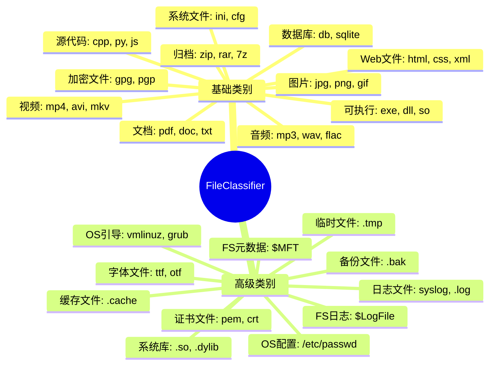
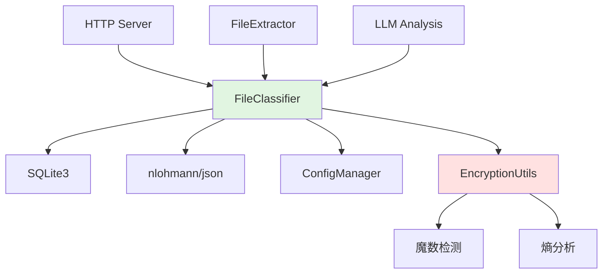
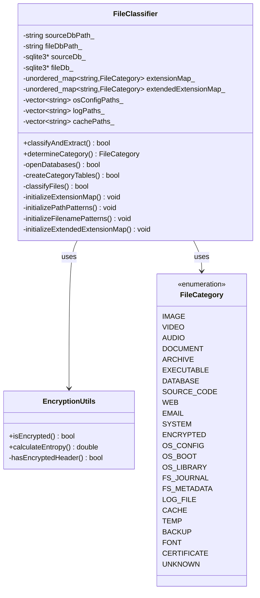
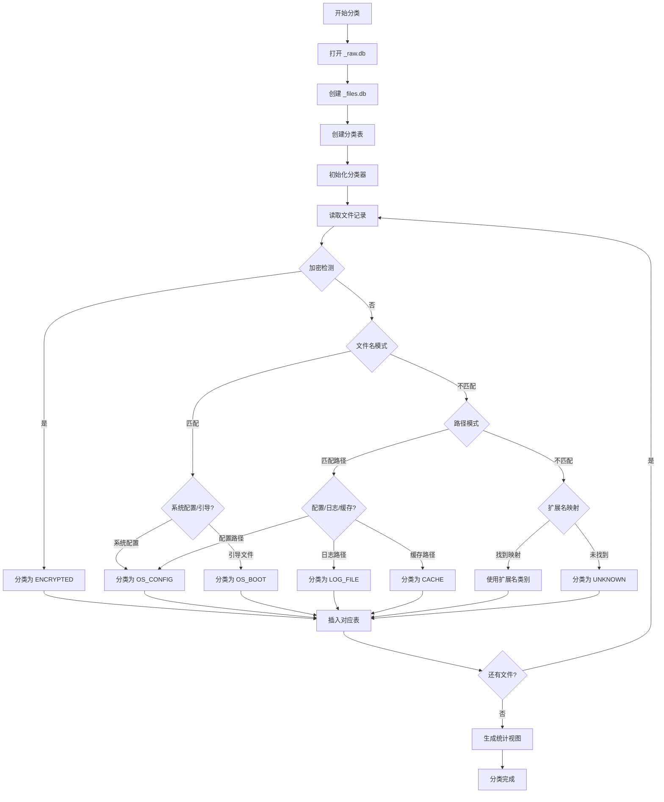
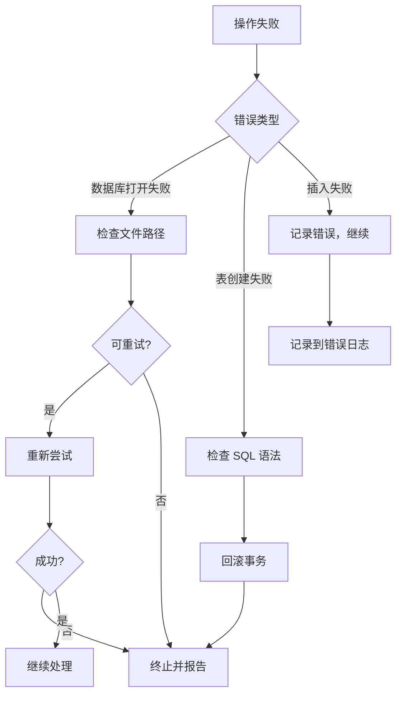

# FileClassifier 模块文档

## 1. 模块背景

### 业务背景

在数字取证调查中，分析人员需要从数百万个文件中快速找到关键证据。原始的文件系统元数据虽然提供了完整的文件列表，但缺乏按类型的组织结构，导致以下问题：

**核心挑战**：
- **数据过载**：百万级文件列表难以人工筛选
- **类型多样性**：文档、图片、视频、可执行文件等混杂
- **优先级判断**：无法快速定位高价值文件类型
- **统计需求**：需要了解不同类型文件的分布情况
- **敏感文件识别**：需要快速定位加密文件、系统配置等

**解决方案**：
FileClassifier 模块作为取证分析管道的第二步，提供：
1. **智能分类引擎**：24+ 种文件类别，覆盖常见文件类型
2. **加密文件检测**：基于魔数和熵分析的自动识别
3. **路径感知分类**：根据文件路径智能判断系统文件类型
4. **专用数据库表**：为每类文件创建独立表，提高查询效率
5. **统计视图**：自动生成文件分布统计和扩展名分析

**在整体架构中的定位**：
```
ImageAnalyzer → _raw.db → FileClassifier → _files.db
                                    ↓
                           [images, videos, documents, archives,
                            executables, databases, source_code,
                            os_config, log_files, encrypted_files, ...]
```

**使用场景**：
- **快速定位**："给我看所有 PDF 文档"
- **敏感文件识别**："找出所有加密文件"
- **统计分析**："统计镜像中各类文件占比"
- **批量导出**："导出所有图片到指定目录"
- **时间线关联**："查看所有可执行文件的创建时间"

### 技术背景

**为什么不用简单的扩展名映射？**

| 方法 | 优势 | 劣势 | 适用场景 |
|------|------|------|----------|
| **扩展名映射** | 简单、快速 | 误判率高（可伪造） | 初步筛选 |
| **魔数检测** | 准确率高 | 需要读取文件内容 | 深度分析 |
| **路径分析** | 识别系统文件 | 路径相关 | 平台特定 |
| **熵分析** | 检测加密文件 | 计算开销大 | 安全分析 |

**FileClassifier 的混合策略**：
1. **优先级 0**：加密检测（魔数 + 熵分析）
2. **优先级 1**：文件名模式（passwd, vmlinuz 等）
3. **优先级 2**：路径模式（/etc/, /boot/, /var/log/ 等）
4. **优先级 3**：扩展映射（扩展名分类）
5. **优先级 4**：默认分类（UNKNOWN）

**技术选型考虑**：

1. **SQLite 作为存储后端**：
   - 轻量级，无需独立服务
   - 支持复杂查询和 JOIN
   - 单文件便于证据管理

2. **扩展名映射表**：
   - 预定义 100+ 种扩展名映射
   - 支持通过 ConfigManager 动态扩展
   - 大小写不敏感匹配

3. **加密检测算法**：
   - 魔数检测：识别常见加密格式（LUKS, BitLocker, VeraCrypt）
   - 熵分析：Shannon 熵计算，阈值 7.95
   - 假阳性控制：排除压缩文件（ZIP, GZIP）

## 2. 模块功能

### 核心功能

#### 1. 24+ 种文件类别



**类别详细说明**：

| 类别 | 扩展名示例 | 特殊识别方式 |
|------|-----------|-------------|
| **IMAGE** | jpg, png, gif, bmp, webp, raw, cr2 | 路径：/Pictures/, /Photos/ |
| **VIDEO** | mp4, avi, mkv, mov, flv, webm | 路径：/Videos/, /Movies/ |
| **AUDIO** | mp3, wav, flac, aac, ogg, m4a | 路径：/Music/, /Audio/ |
| **DOCUMENT** | pdf, doc, docx, xls, xlsx, txt | 路径：/Documents/, /Files/ |
| **ARCHIVE** | zip, rar, 7z, tar, gz, bz2 | - |
| **EXECUTABLE** | exe, dll, so, dylib, app | 路径：/bin/, /usr/bin/ |
| **DATABASE** | db, sqlite, mdb, accdb | - |
| **SOURCE_CODE** | cpp, py, js, java, go, rs | - |
| **WEB** | html, css, xml, json, yaml | - |
| **EMAIL** | eml, msg, pst, mbox | - |
| **SYSTEM** | ini, cfg, conf, config | - |
| **ENCRYPTED** | gpg, pgp, luks, bitlocker | 魔数 + 熵分析 |
| **OS_CONFIG** | - | 路径：/etc/, C:\Windows\System32\config\ |
| **OS_BOOT** | - | 路径：/boot/, C:\Windows\Boot\ |
| **OS_LIBRARY** | so, a, dylib | 路径：/lib/, /usr/lib/, C:\Windows\System32\ |
| **FS_JOURNAL** | - | 文件名：$LogFile, $TxfLog, $UsnJrnl |
| **FS_METADATA** | - | 文件名：$MFT, $Extend, lost+found |
| **LOG_FILE** | - | 扩展名：.log，路径：/var/log/, C:\Windows\Logs\ |
| **CACHE** | - | 路径：/var/cache/, .cache, C:\Users\*\AppData\Local\Temp\ |
| **TEMP** | - | 扩展名：.tmp, .temp，路径：/tmp/, C:\Windows\Temp\ |
| **BACKUP** | - | 扩展名：.bak, *~，文件名：*backup* |
| **FONT** | ttf, otf, woff, woff2 | - |
| **CERTIFICATE** | pem, crt, key, p12 | - |

#### 2. 加密文件检测

```cpp
// EncryptionUtils 类提供加密检测
bool EncryptionUtils::isEncrypted(const std::string& path) {
    // 1. 读取文件头部（前 256 字节）
    std::vector<uint8_t> header = readFileHeader(path, 256);

    // 2. 魔数检测
    if (hasEncryptedHeader(header)) {
        return true;  // 检测到已知加密格式
    }

    // 3. 熵分析
    double entropy = calculateEntropy(header);
    if (entropy > 7.95) {
        return true;  // 高熵值，可能是加密数据
    }

    return false;
}

// 支持的加密格式魔数
// - LUKS: "LUKS\xba\xbe"
// - BitLocker: "-FVE-FS-"
// - VeraCrypt: "VERA"
// - OpenSSL Salted: "Salted__"
```

**熵分析原理**：
```cpp
double EncryptionUtils::calculateEntropy(const std::vector<uint8_t>& data) {
    // 统计每个字节值的出现频率
    std::array<int, 256> freq = {0};
    for (uint8_t byte : data) {
        freq[byte]++;
    }

    // 计算 Shannon 熵
    double entropy = 0.0;
    size_t size = data.size();
    for (int count : freq) {
        if (count > 0) {
            double p = static_cast<double>(count) / size;
            entropy -= p * log2(p);
        }
    }

    return entropy;  // 范围：0-8
}

// 熵值解释：
// - 0-4: 低熵（文本、结构化数据）
// - 4-7: 中等熵（压缩、编码数据）
// - 7-8: 高熵（加密、随机数据）
// - 阈值 7.95: 加密数据的特征
```

#### 3. 路径感知分类

```cpp
// 系统配置文件检测
bool FileClassifier::isOSConfigPath(const std::string& path) {
    // Linux 系统配置路径
    static const std::vector<std::string> linuxConfigPaths = {
        "/etc/",
        "/etc/sysconfig/",
        "/etc/default/",
        "/etc/conf.d/",
        "/usr/local/etc/"
    };

    // Windows 系统配置路径
    static const std::vector<std::string> windowsConfigPaths = {
        "C:/Windows/System32/config/",
        "C:/Windows/inf/",
        "C:/ProgramData/"
    };

    return startsWithAny(path, linuxConfigPaths) ||
           startsWithAny(path, windowsConfigPaths);
}

// 日志文件检测
bool FileClassifier::isLogPath(const std::string& path) {
    static const std::vector<std::string> logPaths = {
        "/var/log/",
        "/var/adm/",
        "/Library/Logs/",
        "C:/Windows/Logs/",
        "C:/Windows/Temp/",
        "C:/Users/", "AppData/Local/Temp/"
    };

    return startsWithAny(path, logPaths);
}
```

#### 4. 文件名模式识别

```cpp
// 系统引导文件检测
bool FileClassifier::isBootFile(const std::string& filename) {
    static const std::vector<std::string> bootFiles = {
        "vmlinuz", "vmlinux", "initrd", "initramfs",
        "grub.cfg", "grub.conf", "menu.lst",
        "bootmgr.exe", "winload.exe", "bcd",
        "boot.ini", "ntldr", "ntdetect.com"
    };

    return equalsAny(filename, bootFiles);
}

// 系统配置文件检测
bool FileClassifier::isSystemConfigFile(const std::string& filename) {
    static const std::vector<std::string> configFiles = {
        "passwd", "shadow", "group", "hosts",
        "fstab", "mtab", "exports",
        "sudoers", "crontab", "inittab",
        "hostname", "resolv.conf", "networks"
    };

    return equalsAny(filename, configFiles);
}
```

### 边界与限制

**功能边界**：
- ❌ 不读取文件内容（除加密检测外）
- ❌ 不验证文件是否损坏
- ❌ 不处理无扩展名文件（归为 UNKNOWN）
- ❌ 不支持 MIME 类型检测

**已知限制**：
| 限制 | 影响 | 缓解方法 |
|------|------|----------|
| 扩展名伪造 | 用户可修改扩展名 | 结合加密检测和路径分析 |
| 无扩展名文件 | 归为 UNKNOWN | 使用 FileExtractor 提取后手动分类 |
| 性能开销 | 百万级文件分类耗时 | 批量事务，并行处理 |
| 平台差异 | 路径模式依赖平台 | 使用跨平台路径处理 |

**性能指标**（参考配置：SSD，8核 CPU）：
- 分类速度：约 100,000 文件/秒（扩展名匹配）
- 加密检测：约 500 文件/秒（需读取文件头部）
- 内存占用：约 100MB（百万级文件）

## 3. 模块使用的库

### 依赖库清单

| 库名称 | 版本 | 用途 | 许可证 | 官网 |
|--------|------|------|--------|------|
| **SQLite3** | 3.35.0+ | 分类数据存储 | Public Domain | https://www.sqlite.org/ |
| **nlohmann/json** | 3.11.2 | 配置管理 | MIT | https://github.com/nlohmann/json |
| **ConfigManager** | 内部 | 加载自定义扩展名 | - | - |

### 依赖关系图



**依赖说明**：
- **硬依赖**：SQLite3（核心功能）
- **软依赖**：ConfigManager（可选的扩展名配置）
- **内部依赖**：EncryptionUtils（加密检测）

## 4. 模块实现方式

### 架构设计



### 核心类说明

#### FileClassifier（主分类器）
**职责**：
- 读取 _raw.db 中的文件元数据
- 根据多种策略确定文件类别
- 创建并填充分类表
- 生成统计视图

**分类优先级**：
```cpp
FileCategory FileClassifier::determineCategory(
    const std::string& filename,
    const std::string& path) {

    // 优先级 0: 加密检测（最高优先级）
    if (EncryptionUtils::isEncrypted(path)) {
        return FileCategory::ENCRYPTED;
    }

    // 优先级 1: 文件名模式
    if (isSystemConfigFile(filename)) {
        return FileCategory::OS_CONFIG;
    }
    if (isBootFile(filename)) {
        return FileCategory::OS_BOOT;
    }

    // 优先级 2: 路径模式
    if (isOSConfigPath(path)) {
        return FileCategory::OS_CONFIG;
    }
    if (isLogPath(path)) {
        return FileCategory::LOG_FILE;
    }
    if (isCachePath(path)) {
        return FileCategory::CACHE;
    }

    // 优先级 3: 扩展名映射
    std::string ext = getExtension(filename);
    auto it = extendedExtensionMap_.find(ext);
    if (it != extendedExtensionMap_.end()) {
        return it->second;
    }

    // 优先级 4: 基础扩展名映射
    it = extensionMap_.find(ext);
    if (it != extensionMap_.end()) {
        return it->second;
    }

    // 默认: UNKNOWN
    return FileCategory::UNKNOWN;
}
```

#### EncryptionUtils（加密检测器）
**职责**：
- 检测加密文件魔数
- 计算文件熵值
- 区分加密和压缩文件

**支持的加密格式**：
```cpp
struct EncryptionSignature {
    const char* magic;
    size_t length;
    const char* description;
};

static const std::vector<EncryptionSignature> ENCRYPTION_SIGNATURES = {
    {"LUKS\xba\xbe", 6, "LUKS encrypted partition"},
    {"-FVE-FS-", 8, "BitLocker encrypted volume"},
    {"VERA", 4, "VeraCrypt encrypted container"},
    {"Salted__", 8, "OpenSSL encrypted data"},
    {"\x00\x00\x00\x20\x00\x00\x00\x00", 8, "Adobe Flash Player encrypted"},
};
```

### 关键流程



**错误处理流程**：


### 数据结构

**输入数据**（从 _raw.db 读取）：
```cpp
struct FileRecord {
    int64_t inode;
    std::string name;        // 文件名（含扩展名）
    std::string path;        // 完整路径
    int64_t size;
    int64_t atime, mtime, ctime, crtime;
    std::string type;
    std::string md5;
    int is_deleted;
    int is_allocated;
};
```

**输出数据**（插入 _files.db）：
```cpp
struct ClassifiedFileRecord {
    int64_t id;              // 主键
    int64_t inode;
    std::string name;
    std::string path;
    int64_t size;
    std::string extension;   // 提取的扩展名
    int64_t mtime;
    int64_t ctime;
    int is_deleted;
    std::string md5;

    // LLM 分析字段（可选）
    std::string llm_summary;
    std::string llm_description;
    std::string llm_keywords;
    int64_t llm_analyzed_at;
    std::string llm_model_used;
};
```

**数据库模式**：
```sql
-- 主文件表（所有文件）
CREATE TABLE files (
    id INTEGER PRIMARY KEY AUTOINCREMENT,
    inode INTEGER UNIQUE,
    name TEXT NOT NULL,
    path TEXT NOT NULL,
    size INTEGER,
    extension TEXT,
    mtime INTEGER,
    ctime INTEGER,
    is_deleted INTEGER DEFAULT 0,
    md5 TEXT,

    -- LLM 分析字段
    llm_summary TEXT,
    llm_description TEXT,
    llm_keywords TEXT,
    llm_analyzed_at INTEGER,
    llm_model_used TEXT
);

-- 分类表示例
CREATE TABLE images (
    id INTEGER PRIMARY KEY AUTOINCREMENT,
    inode INTEGER UNIQUE,
    name TEXT NOT NULL,
    path TEXT NOT NULL,
    size INTEGER,
    extension TEXT,
    mtime INTEGER,
    ctime INTEGER,
    is_deleted INTEGER DEFAULT 0,
    md5 TEXT
);

-- 其他类别表...
CREATE TABLE videos (...);
CREATE TABLE documents (...);
CREATE TABLE encrypted_files (...);

-- 统计视图
CREATE VIEW file_summary AS
SELECT 'images' as category, COUNT(*) as count, SUM(size) as total_size FROM images
UNION ALL
SELECT 'videos', COUNT(*), SUM(size) FROM videos
UNION ALL
SELECT 'documents', COUNT(*), SUM(size) FROM documents
-- ... 其他类别
;

CREATE VIEW extension_statistics AS
SELECT extension,
       COUNT(*) as file_count,
       AVG(size) as avg_size,
       MAX(size) as max_size,
       MIN(size) as min_size
FROM files
WHERE extension IS NOT NULL
GROUP BY extension
ORDER BY file_count DESC;
```

## 5. API 调用

### C++ API

#### 基础用法

```cpp
#include "core/DatabaseManager/FileClassifier/FileClassifier.h"

int main() {
    // 1. 创建 FileClassifier 实例
    FileClassifier classifier("evidence_raw.db", "evidence_files.db");

    // 2. 执行分类
    if (!classifier.classifyAndExtract()) {
        std::cerr << "文件分类失败" << std::endl;
        return 1;
    }

    std::cout << "文件分类完成！" << std::endl;
    return 0;
}
```

#### 单个文件分类

```cpp
// 分类单个文件（用于测试或特殊场景）
FileClassifier classifier("evidence_raw.db", "evidence_files.db");

FileCategory category = classifier.determineCategory(
    "document.pdf",           // 文件名
    "/home/user/docs/document.pdf"  // 路径
);

std::string categoryName = classifier.getCategoryName(category);
std::cout << "文件类别: " << categoryName << std::endl;
```

#### 批量分类（自定义）

```cpp
// 自定义批量处理
class CustomFileClassifier : public FileClassifier {
public:
    CustomFileClassifier(const std::string& sourceDb,
                        const std::string& fileDb)
        : FileClassifier(sourceDb, fileDb) {}

    // 覆盖分类逻辑
    FileCategory customDetermineCategory(
        const std::string& filename,
        const std::string& path) override {

        // 自定义规则：优先检测特定文件
        if (filename.find("evidence") != std::string::npos) {
            return FileCategory::DOCUMENT;  // 强制归类为文档
        }

        // 回退到默认逻辑
        return determineCategory(filename, path);
    }
};
```

### 命令行 API

```bash
# 基础分类（由主程序调用）
./forensic_analyzer disk_image.dd

# 分类完成后查询
sqlite3 disk_image_files.db "SELECT COUNT(*) FROM images;"
sqlite3 disk_image_files.db "SELECT * FROM file_summary;"
```

### REST API

**通过 HTTP 服务器查询分类结果**：

```bash
# 获取文件统计
curl "http://localhost:8080/api/db/statistics"

# 响应
{
  "success": true,
  "statistics": {
    "total_files": 52341,
    "categories": {
      "images": 1234,
      "videos": 567,
      "documents": 8901,
      "encrypted_files": 12
    },
    "total_size": 107374182400
  }
}

# 查询特定类别文件
curl "http://localhost:8080/api/db/files?category=images&limit=100"

# 响应
{
  "success": true,
  "files": [
    {
      "inode": 12345,
      "name": "photo.jpg",
      "path": "/home/user/Pictures/photo.jpg",
      "size": 1048576,
      "extension": ".jpg"
    }
  ],
  "total_count": 1234
}

# 扩展名统计
curl "http://localhost:8080/api/db/extensions?limit=20"

# 响应
{
  "success": true,
  "extensions": [
    {"extension": ".txt", "count": 15234, "avg_size": 1024},
    {"extension": ".jpg", "count": 5432, "avg_size": 2097152},
    {"extension": ".pdf", "count": 3456, "avg_size": 524288}
  ]
}
```

### API 参数说明

| 参数名 | 类型 | 必填 | 说明 | 可选值 |
|--------|------|------|------|--------|
| `category` | string | ❌ | 文件类别 | images, videos, documents, etc. |
| `extension` | string | ❌ | 文件扩展名 | .jpg, .pdf, .txt |
| `min_size` | integer | ❌ | 最小文件大小 | 字节数 |
| `max_size` | integer | ❌ | 最大文件大小 | 字节数 |
| `is_deleted` | boolean | ❌ | 是否删除 | true/false |
| `limit` | integer | ❌ | 返回记录数 | 默认 100 |
| `offset` | integer | ❌ | 起始偏移 | 默认 0 |

### 返回值说明

**成功响应**：
```json
{
  "success": true,
  "files": [
    {
      "id": 1,
      "inode": 12345,
      "name": "file.jpg",
      "path": "/path/to/file.jpg",
      "size": 1048576,
      "extension": ".jpg",
      "mtime": 1640995200,
      "is_deleted": false,
      "category": "images"
    }
  ],
  "total_count": 1234,
  "page_info": {
    "current_page": 0,
    "page_size": 100,
    "total_pages": 13
  }
}
```

## 6. 二次开发

### 扩展点

#### 1. 添加新的文件类别

**位置**：`src/core/DatabaseManager/FileClassifier/FileClassifier.h`

**步骤**：

1. **添加枚举值**：
```cpp
// FileClassifier.h
enum class FileCategory {
    // ... 现有类别
    BLOCKCHAIN,        // 新增：区块链文件
    THREE_D_MODEL,     // 新增：3D 模型文件
    VR_CONTENT         // 新增：VR 内容
};
```

2. **添加扩展名映射**：
```cpp
// FileClassifier.cpp
void FileClassifier::initializeExtensionMap() {
    // ... 现有映射

    // 区块链文件
    extensionMap_[".btc"] = FileCategory::BLOCKCHAIN;
    extensionMap_[".eth"] = FileCategory::BLOCKCHAIN;
    extensionMap_["wallet"] = FileCategory::BLOCKCHAIN;

    // 3D 模型文件
    extensionMap_[".obj"] = FileCategory::THREE_D_MODEL;
    extensionMap_[".fbx"] = FileCategory::THREE_D_MODEL;
    extensionMap_[".blend"] = FileCategory::THREE_D_MODEL;

    // VR 内容
    extensionMap_[".vr"] = FileCategory::VR_CONTENT;
    extensionMap_[".ar"] = FileCategory::VR_CONTENT;
}
```

3. **创建数据库表**：
```cpp
// file_classifier_sql.h
static const char* CREATE_BLOCKCHAIN_TABLE = R"(
CREATE TABLE IF NOT EXISTS blockchain_files (
    id INTEGER PRIMARY KEY AUTOINCREMENT,
    inode INTEGER UNIQUE,
    name TEXT NOT NULL,
    path TEXT NOT NULL,
    size INTEGER,
    extension TEXT,
    mtime INTEGER,
    ctime INTEGER,
    is_deleted INTEGER DEFAULT 0,
    md5 TEXT
);
)";
```

4. **添加分类逻辑**：
```cpp
// FileClassifier.cpp
std::string FileClassifier::getCategoryTableName(FileCategory category) {
    switch (category) {
        // ... 现有 case
        case FileCategory::BLOCKCHAIN:
            return "blockchain_files";
        case FileCategory::THREE_D_MODEL:
            return "3d_model_files";
        case FileCategory::VR_CONTENT:
            return "vr_content_files";
        default:
            return "unknown_files";
    }
}
```

5. **更新统计视图**：
```cpp
// 在创建视图时添加新类别
static const char* CREATE_FILE_SUMMARY_VIEW = R"(
CREATE VIEW IF NOT EXISTS file_summary AS
SELECT 'images' as category, COUNT(*) as count, SUM(size) as total_size FROM images
UNION ALL
SELECT 'blockchain', COUNT(*), SUM(size) FROM blockchain_files
UNION ALL
SELECT '3d_models', COUNT(*), SUM(size) FROM 3d_model_files
UNION ALL
SELECT 'vr_content', COUNT(*), SUM(size) FROM vr_content_files
-- ... 其他类别
)";
```

#### 2. 自定义分类规则

**位置**：创建新的分类器类

```cpp
// CustomFileClassifier.h
#pragma once
#include "FileClassifier.h"

class CustomFileClassifier : public FileClassifier {
public:
    explicit CustomFileClassifier(const std::string& sourceDb,
                                  const std::string& fileDb);

    // 自定义分类逻辑
    FileCategory classifyByContent(const std::string& filePath);
    FileCategory classifyByMetadata(const FileRecord& record);

protected:
    // 覆盖默认分类方法
    FileCategory determineCategory(const std::string& filename,
                                   const std::string& path) override;

private:
    // 自定义规则
    bool isMalwareFile(const std::string& filename);
    bool isRansomwareFile(const std::string& filename);
    bool isHackingTool(const std::string& filename);
};

// CustomFileClassifier.cpp
FileCategory CustomFileClassifier::determineCategory(
    const std::string& filename,
    const std::string& path) {

    // 自定义规则：恶意软件检测
    if (isMalwareFile(filename)) {
        // 可以添加新的 MALWARE 类别
        return FileCategory::EXECUTABLE;  // 或创建新类别
    }

    // 自定义规则：勒索软件检测
    if (isRansomwareFile(filename)) {
        return FileCategory::ENCRYPTED;
    }

    // 回退到父类默认逻辑
    return FileClassifier::determineCategory(filename, path);
}

bool CustomFileClassifier::isMalwareFile(const std::string& filename) {
    static const std::vector<std::string> malwarePatterns = {
        "trojan", "virus", "worm", "backdoor",
        "keylog", "spyware", "rootkit"
    };

    std::string lowerName = toLower(filename);
    for (const auto& pattern : malwarePatterns) {
        if (lowerName.find(pattern) != std::string::npos) {
            return true;
        }
    }

    return false;
}
```

#### 3. 添加机器学习分类

**位置**：集成 ML 模型

```cpp
// MLFileClassifier.h
#pragma once
#include "FileClassifier.h"
#include <memory>

class MLModel {
public:
    virtual ~MLModel() = default;
    virtual FileCategory predict(const std::string& filename,
                                 const std::string& path,
                                 const std::vector<uint8_t>& content) = 0;
    virtual bool loadModel(const std::string& modelPath) = 0;
};

class MLFileClassifier : public FileClassifier {
public:
    explicit MLFileClassifier(const std::string& sourceDb,
                              const std::string& fileDb);

    void setMLModel(std::unique_ptr<MLModel> model);

protected:
    FileCategory determineCategory(const std::string& filename,
                                   const std::string& path) override;

private:
    std::unique_ptr<MLModel> mlModel_;
    FileCategory classifyWithML(const std::string& filename,
                                const std::string& path);
};

// 使用示例
class TensorFlowModel : public MLModel {
public:
    FileCategory predict(const std::string& filename,
                        const std::string& path,
                        const std::vector<uint8_t>& content) override {
        // 调用 TensorFlow 模型进行预测
        // ...
        return FileCategory::DOCUMENT;
    }

    bool loadModel(const std::string& modelPath) override {
        // 加载 TensorFlow 模型
        // ...
        return true;
    }
};

// 主程序
auto mlModel = std::make_unique<TensorFlowModel>();
mlModel->loadModel("/path/to/model.h5");

MLFileClassifier classifier("evidence_raw.db", "evidence_files.db");
classifier.setMLModel(std::move(mlModel));
classifier.classifyAndExtract();
```

### 添加新功能的步骤

#### 完整示例：添加邮件分类器

**步骤 1：定义数据结构**
```cpp
// EmailMetadata.h
#pragma once
#include <string>
#include <vector>

struct EmailMetadata {
    std::string from;
    std::string to;
    std::string subject;
    int64_t sent_time;
    std::vector<std::string> attachments;
    bool is_spam;
    int priority;
};
```

**步骤 2：创建数据库模式**
```cpp
// email_classifier_sql.h
static const char* CREATE_EMAIL_METADATA_TABLE = R"(
CREATE TABLE IF NOT EXISTS email_metadata (
    id INTEGER PRIMARY KEY AUTOINCREMENT,
    file_id INTEGER NOT NULL UNIQUE,
    from_address TEXT NOT NULL,
    to_address TEXT NOT NULL,
    subject TEXT,
    sent_time INTEGER,
    attachments TEXT,  -- JSON array
    is_spam INTEGER DEFAULT 0,
    priority INTEGER DEFAULT 0,
    FOREIGN KEY (file_id) REFERENCES email_files(id)
);
)";
```

**步骤 3：实现邮件解析**
```cpp
// EmailParser.h
#pragma once
#include "EmailMetadata.h"
#include <string>

class EmailParser {
public:
    static EmailMetadata parse(const std::string& filePath);
    static bool isSpam(const EmailMetadata& email);
    static int calculatePriority(const EmailMetadata& email);

private:
    static std::vector<std::string> extractAttachments(
        const std::string& content);
};
```

**步骤 4：集成到 FileClassifier**
```cpp
// FileClassifier.cpp
bool FileClassifier::classifyEmailFile(const FileRecord& record) {
    // 解析邮件内容
    EmailMetadata metadata = EmailParser::parse(record.path);

    // 检测垃圾邮件
    if (EmailParser::isSpam(metadata)) {
        metadata.is_spam = true;
    }

    // 计算优先级
    metadata.priority = EmailParser::calculatePriority(metadata);

    // 插入数据库
    return insertEmailMetadata(record.inode, metadata);
}
```

### 代码示例

#### 完整的自定义分类器

```cpp
// ForensicFileClassifier.h
#pragma once
#include "core/DatabaseManager/FileClassifier/FileClassifier.h"
#include "core/AuditLog/AuditLog.h"

class ForensicFileClassifier : public FileClassifier {
public:
    explicit ForensicFileClassifier(const std::string& sourceDb,
                                   const std::string& fileDb);

    // 高级分类功能
    bool classifyWithHeuristics();
    bool classifyMaliciousFiles();
    bool classifySuspiciousFiles();

    // 生成分类报告
    std::string generateClassificationReport();

protected:
    FileCategory determineCategory(const std::string& filename,
                                   const std::string& path) override;

private:
    // 启发式规则
    bool isSuspiciousExecutable(const std::string& filename);
    bool isHiddenInSystemFolder(const std::string& path);
    bool hasTamperedTimestamp(const FileRecord& record);

    // 统计信息
    struct ClassificationStats {
        size_t total_files = 0;
        size_t encrypted_files = 0;
        size_t suspicious_files = 0;
        std::map<FileCategory, size_t> category_counts;
    };
    ClassificationStats stats_;
};

// ForensicFileClassifier.cpp
FileCategory ForensicFileClassifier::determineCategory(
    const std::string& filename,
    const std::string& path) {

    // 调用父类默认分类
    FileCategory baseCategory =
        FileClassifier::determineCategory(filename, path);

    // 记录统计信息
    stats_.total_files++;
    stats_.category_counts[baseCategory]++;

    // 特殊处理：可疑可执行文件
    if (baseCategory == FileCategory::EXECUTABLE) {
        if (isSuspiciousExecutable(filename)) {
            LOG_WARNING("检测到可疑可执行文件: " + path);
            stats_.suspicious_files++;
        }
    }

    // 特殊处理：系统目录中的隐藏文件
    if (isHiddenInSystemFolder(path)) {
        LOG_WARNING("系统目录中的隐藏文件: " + path);
    }

    return baseCategory;
}

bool ForensicFileClassifier::isSuspiciousExecutable(const std::string& filename) {
    // 可疑可执行文件的特征
    static const std::vector<std::string> suspiciousPatterns = {
        "crack", "patch", "keygen", "loader",
        "inject", "hack", "exploit", "bypass"
    };

    std::string lowerName = toLower(filename);
    for (const auto& pattern : suspiciousPatterns) {
        if (lowerName.find(pattern) != std::string::npos) {
            return true;
        }
    }

    return false;
}

bool ForensicFileClassifier::isHiddenInSystemFolder(const std::string& path) {
    // 检查是否在系统目录中且文件名以点开头（Unix 隐藏文件）
    std::string filename = getFileName(path);
    if (!filename.empty() && filename[0] == '.') {
        return isSystemPath(path);
    }

    return false;
}

std::string ForensicFileClassifier::generateClassificationReport() {
    std::ostringstream report;

    report << "=== 文件分类报告 ===\n\n";
    report << "总文件数: " << stats_.total_files << "\n";
    report << "加密文件: " << stats_.encrypted_files << "\n";
    report << "可疑文件: " << stats_.suspicious_files << "\n\n";

    report << "类别分布:\n";
    for (const auto& [category, count] : stats_.category_counts) {
        report << "  " << getCategoryName(category) << ": "
               << count << "\n";
    }

    return report.str();
}

// 使用示例
int main() {
    Logger::instance().setLevel(LogLevel::INFO);
    Logger::instance().setOutput(LogOutput::FILE, "classification.log");

    ForensicFileClassifier classifier("evidence_raw.db", "evidence_files.db");

    if (!classifier.classifyWithHeuristics()) {
        std::cerr << "分类失败" << std::endl;
        return 1;
    }

    // 生成报告
    std::string report = classifier.generateClassificationReport();
    std::cout << report << std::endl;

    // 保存报告到文件
    std::ofstream reportFile("classification_report.txt");
    reportFile << report;
    reportFile.close();

    return 0;
}
```

### 最佳实践

#### 性能优化

**1. 批量插入优化**：
```cpp
// 错误：逐条插入
for (const auto& file : files) {
    insertIntoCategoryTable(file);  // 每次都提交事务
}

// 正确：批量事务
sqlite3_exec(fileDb_, "BEGIN TRANSACTION;", nullptr, nullptr, nullptr);
for (const auto& file : files) {
    insertIntoCategoryTable(file);
    if (++count % 1000 == 0) {
        sqlite3_exec(fileDb_, "COMMIT;", nullptr, nullptr, nullptr);
        sqlite3_exec(fileDb_, "BEGIN TRANSACTION;", nullptr, nullptr, nullptr);
    }
}
sqlite3_exec(fileDb_, "COMMIT;", nullptr, nullptr, nullptr);
```

**2. 预编译语句**：
```cpp
// 预编译插入语句
sqlite3_stmt* insertStmt;
const char* insertSQL = "INSERT INTO images (inode, name, path, size) VALUES (?, ?, ?, ?)";
sqlite3_prepare_v2(fileDb_, insertSQL, -1, &insertStmt, nullptr);

// 批量使用
for (const auto& file : imageFiles) {
    sqlite3_bind_int64(insertStmt, 1, file.inode);
    sqlite3_bind_text(insertStmt, 2, file.name.c_str(), -1, SQLITE_TRANSIENT);
    sqlite3_bind_text(insertStmt, 3, file.path.c_str(), -1, SQLITE_TRANSIENT);
    sqlite3_bind_int64(insertStmt, 4, file.size);

    sqlite3_step(insertStmt);
    sqlite3_reset(insertStmt);
}

sqlite3_finalize(insertStmt);
```

**3. 内存管理**：
```cpp
// 分批读取源数据
const size_t BATCH_SIZE = 10000;
size_t offset = 0;

while (true) {
    std::vector<FileRecord> batch =
        readFilesFromDatabase(sourceDb_, offset, BATCH_SIZE);

    if (batch.empty()) break;

    classifyBatch(batch);
    offset += BATCH_SIZE;
}
```

#### 常见陷阱

**1. 扩展名大小写**：
```cpp
// 错误：大小写敏感
if (extension == ".PDF") {  // 只匹配大写
    return FileCategory::DOCUMENT;
}

// 正确：大小写不敏感
std::string lowerExt = toLower(extension);
if (lowerExt == ".pdf") {
    return FileCategory::DOCUMENT;
}
```

**2. 路径分隔符**：
```cpp
// 错误：硬编码路径分隔符
if (path.find("/etc/") != std::string::npos) {  // Windows 上失败
    return FileCategory::OS_CONFIG;
}

// 正确：使用跨平台路径处理
std::string normalizedPath = normalizePath(path);
if (startsWith(normalizedPath, "/etc/") ||
    startsWith(normalizedPath, "C:\\Windows\\System32\\config\\")) {
    return FileCategory::OS_CONFIG;
}
```

**3. 文件名提取**：
```cpp
// 错误：假设路径总是有分隔符
std::string filename = path.substr(path.find_last_of('/') + 1);  // 可能抛异常

// 正确：安全提取
std::string getFileName(const std::string& path) {
    size_t pos = path.find_last_of('/');
    if (pos == std::string::npos) {
        pos = path.find_last_of('\\');
    }

    if (pos != std::string::npos) {
        return path.substr(pos + 1);
    }

    return path;  // 没有路径分隔符，整个字符串就是文件名
}
```

#### 调试技巧

**1. 详细日志**：
```cpp
// 在关键位置添加日志
FileCategory FileClassifier::determineCategory(const std::string& filename,
                                               const std::string& path) {
    LOG_DEBUG("分类文件: " + path);

    // 加密检测
    if (EncryptionUtils::isEncrypted(path)) {
        LOG_DEBUG("  → 检测为加密文件");
        return FileCategory::ENCRYPTED;
    }

    // ... 其他分类逻辑

    LOG_DEBUG("  → 默认分类: " + getCategoryName(category));
    return category;
}
```

**2. 分类统计**：
```cpp
// 在分类完成后输出统计
struct ClassificationStats {
    std::map<FileCategory, size_t> counts;
    size_t total = 0;
};

ClassificationStats stats;
for (const auto& file : files) {
    FileCategory category = determineCategory(file.name, file.path);
    stats.counts[category]++;
    stats.total++;
}

// 输出统计
for (const auto& [category, count] : stats.counts) {
    double percentage = (count * 100.0) / stats.total;
    std::cout << getCategoryName(category) << ": "
              << count << " (" << percentage << "%)" << std::endl;
}
```

**3. 可视化工具**：
```cpp
// 生成分类分布图表（使用外部工具）
std::string generateChartData(const ClassificationStats& stats) {
    std::ostringstream chart;

    chart << "{\"chart\": {\"type\": \"pie\"}, \"series\": [";
    bool first = true;
    for (const auto& [category, count] : stats.counts) {
        if (!first) chart << ",";
        chart << "{\"name\": \"" << getCategoryName(category) << "\", "
              << "\"y\": " << count << "}";
        first = false;
    }
    chart << "]}";

    return chart.str();
}
```

## 7. 其他

### 测试

**单元测试位置**：
```
tests/UnitTest/test_file_classifier_gtest.cpp
```

**运行测试**：
```bash
cd build
./test_file_classifier_gtest
```

**示例测试用例**：
```cpp
TEST(FileClassifierTest, ClassifyByExtension) {
    FileClassifier classifier(":memory:", ":memory:");

    // 图片文件
    EXPECT_EQ(classifier.determineCategory("photo.jpg", "/path/photo.jpg"),
              FileCategory::IMAGE);

    // 文档文件
    EXPECT_EQ(classifier.determineCategory("doc.pdf", "/path/doc.pdf"),
              FileCategory::DOCUMENT);

    // 可执行文件
    EXPECT_EQ(classifier.determineCategory("app.exe", "/path/app.exe"),
              FileCategory::EXECUTABLE);
}

TEST(FileClassifierTest, ClassifyByPath) {
    FileClassifier classifier(":memory:", ":memory:");

    // 系统配置文件
    EXPECT_EQ(classifier.determineCategory("passwd", "/etc/passwd"),
              FileCategory::OS_CONFIG);

    // 日志文件
    EXPECT_EQ(classifier.determineCategory("syslog", "/var/log/syslog"),
              FileCategory::LOG_FILE);

    // 缓存文件
    EXPECT_EQ(classifier.determineCategory("cache.data", "/var/cache/cache.data"),
              FileCategory::CACHE);
}

TEST(FileClassifierTest, ClassifyEncryptedFiles) {
    FileClassifier classifier(":memory:", ":memory:");

    // 创建测试加密文件
    std::string encryptedFile = "/tmp/test.enc";
    createEncryptedFile(encryptedFile);

    EXPECT_EQ(classifier.determineCategory("test.enc", encryptedFile),
              FileCategory::ENCRYPTED);

    // 清理
    std::filesystem::remove(encryptedFile);
}
```

### 配置

**配置文件位置**：`.env` 文件

**相关配置项**：
```env
# 文件分类配置
CLASSIFICATION_BATCH_SIZE=1000
ENCRYPTION_DETECTION_ENABLED=true
ENTROPY_THRESHOLD=7.95

# 自定义扩展名映射
CUSTOM_IMAGE_EXTS=.heic,.avif,.jxl
CUSTOM_VIDEO_EXTS=.av1,.vp9,.h265

# 性能配置
PARALLEL_CLASSIFICATION_ENABLED=true
CLASSIFICATION_THREADS=4
```

**运行时配置**：
```cpp
// 通过 ConfigManager
ConfigManager& config = ConfigManager::instance();
config.load(".env");

bool encryptionEnabled = config.isEncryptionDetectionEnabled();
double entropyThreshold = config.getEntropyThreshold();

classifier.setEncryptionDetection(encryptionEnabled);
classifier.setEntropyThreshold(entropyThreshold);
```

### 故障排查

| 问题 | 可能原因 | 解决方法 |
|------|----------|----------|
| **文件未分类** | 扩展名不在映射表中 | 添加自定义扩展名或使用 UNKNOWN |
| **误分类为加密** | 熵阈值过低 | 调整 ENTROPY_THRESHOLD |
| **路径识别失败** | 路径分隔符不匹配 | 使用 normalizePath() |
| **性能缓慢** | 未使用批量事务 | 启用批量插入模式 |
| **数据库锁定** | 多个进程写入 | 确保单写者模式 |

**调试命令**：
```bash
# 查看分类统计
sqlite3 evidence_files.db "SELECT * FROM file_summary;"

# 查看扩展名分布
sqlite3 evidence_files.db "SELECT * FROM extension_statistics LIMIT 20;"

# 查找未分类文件
sqlite3 evidence_files.db "SELECT COUNT(*) FROM unknown_files;"

# 查找加密文件
sqlite3 evidence_files.db "SELECT path FROM encrypted_files LIMIT 10;"
```

### 相关模块

- **[DatabaseManager](./DatabaseManager.md)** - 数据库管理，提供存储后端
- **[EventExtractor](./EventExtractor.md)** - 事件提取，基于分类结果生成时间线
- **[FileExtractor](./FileExtractor.md)** - 文件提取，按类别批量提取
- **[EncryptionUtils](./EncryptionUtils.md)** - 加密检测，内置工具类
- **[ImageAnalyzer](../analyzers/ImageAnalyzer.md)** - 镜像分析，提供源数据

### 参考资源

**官方文档**：
- [SQLite 数据类型](https://www.sqlite.org/datatype3.html)
- [文件扩展名注册表](https://www.fileextension.com/)

**加密检测**：
- [Shannon 熵理论](https://en.wikipedia.org/wiki/Entropy_(information_theory))
- [文件格式规范](https://www.garykessler.net/library/file_sigs.html)

**推荐阅读**：
- "File System Forensic Analysis" by Brian Carrier
- "The Art of Computer Virus Research and Defense" by Peter Szor

### 变更历史

| 版本 | 日期 | 变更内容 | 作者 |
|------|------|----------|------|
| 1.0.0 | 2024-01-20 | 初始版本，13 种基础类别 | Forensics Team |
| 1.1.0 | 2024-04-10 | 添加加密检测功能 | Forensics Team |
| 1.2.0 | 2024-07-15 | 扩展到 24 种类别 | Forensics Team |
| 1.3.0 | 2024-09-20 | 添加路径感知分类 | Forensics Team |
| 1.4.0 | 2024-11-25 | 性能优化，批量处理 | Forensics Team |
| 2.0.0 | 2025-02-10 | 重构为模块化架构 | Forensics Team |

---

**最后更新**: 2026-03-11
**维护者**: ymj68520
**联系方式**: 见项目 GitHub 仓库
