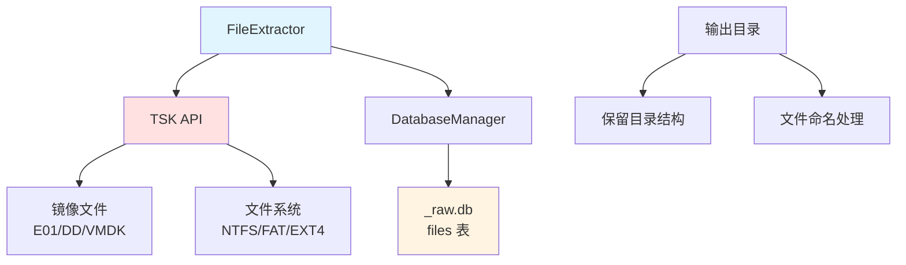

# FileExtractor 模块文档

## 1. 模块背景

### 业务背景

在数字取证分析中，从磁盘镜像中提取文件是关键的基础操作：

**核心需求**：
- **批量文件提取**：从镜像中提取大量文件
- **灵活过滤**：按文件名、扩展名、状态过滤
- **元数据保留**：保留原始文件的时间戳和权限
- **进度跟踪**：长时间操作的进度反馈

**解决挑战**：
- **大规模提取**：高效处理数百万文件
- **命名冲突**：处理同名文件和已删除文件
- **路径重建**：保持原始目录结构
- **错误恢复**：单个文件失败不影响整体

### 技术背景

**核心技术**：
- **The Sleuth Kit (TSK)**：磁盘镜像分析库
- **TSK API**：文件系统遍历和数据读取

**支持格式**：
- **E01**：EnCase 格式
- **DD/RAW**：原始镜像
- **VMDK**：虚拟机磁盘（通过 TSK）

## 2. 模块功能

### 核心功能

#### 1. 按文件名提取

**通配符匹配**：
```cpp
FileExtractor extractor(imagePath, dbManager);

// 提取所有 .log 文件
int count = extractor.extractByName("*.log", "/output/dir");

// 提取多个模式
count = extractor.extractByName("*.log,*.conf,*.ini", "/output/dir");

// 问号通配符
count = extractor.extractByName("config?.ini", "/output/dir");
```

**特性**：
- 支持 `*`（多字符）和 `?`（单字符）通配符
- 逗号分隔的多个模式
- 完整路径或仅文件名匹配

#### 2. 按扩展名提取

**扩展名过滤**：
```cpp
// 提取特定扩展名
int count = extractor.extractByExtension(".log,.conf,.txt", "/output/dir");

// 或使用命令行
./forensic_analyzer --database image_raw.db \
    --extract-ext ".log,.conf" \
    --output-dir logs
```

**自动前缀处理**：
```cpp
// 自动添加点号
".log"     → 正确
"log"      → 自动添加 ".log"
".log,.txt" → 正确
```

#### 3. 提取所有文件

**全量提取**：
```cpp
// 提取所有已分配的常规文件
int count = extractor.extractAll("/output/dir");

// 命令行
./forensic_analyzer --database image_raw.db --extract-all --output-dir extracted
```

**特性**：
- 仅提取常规文件（`REG` 类型）
- 跳过目录和符号链接
- 跳过已删除文件（默认）

#### 4. 包含已删除文件

**已删除文件恢复**：
```cpp
// 提取包含已删除的文件
int count = extractor.extractAll("/output/dir", true);

// 命令行
./forensic_analyzer --database image_raw.db --extract-all \
    --include-deleted --output-dir recovered
```

**命名冲突处理**：
```cpp
// 已删除文件：追加 inode 号避免冲突
original.txt         → original.txt (已分配)
original.txt (deleted) → original.txt_12345 (inode 12345)
```

#### 5. 单文件提取

**按 Inode 提取**：
```cpp
bool success = extractor.extractFileByInode(inodeNumber, "/output/path.txt");
```

**按路径提取**：
```cpp
bool success = extractor.extractFileByPath(
    "/path/in/image/document.txt",
    "/output/document.txt"
);
```

### 边界与限制

**功能边界**：
- ❌ 不恢复已删除的数据内容（仅元数据）
- ❌不解压嵌套文件（ZIP 内部文件）
- ❌不支持流式传输（必须写入磁盘）

**已知限制**：
| 限制 | 影响 | 缓解方法 |
|------|------|----------|
| 磁盘空间 | 大镜像可能耗尽空间 | 预检查可用空间 |
| 命名冲突 | 同名文件覆盖 | 追加 inode 或时间戳 |
| 特殊文件 | 设备文件、管道不提取 | 跳过并记录 |

**性能指标**：
- **提取速度**：取决于磁盘类型（HDD ~50MB/s，SSD ~500MB/s）
- **内存占用**：<100MB（流式读取）
- **进度显示**：每 50 个文件或每 10 个初始文件更新

## 3. 模块使用的库

### 依赖库清单

| 库名称 | 版本 | 用途 |
|--------|------|------|
| **The Sleuth Kit** | 4.14.0+ | 磁盘镜像和文件系统分析 |
| **SQLite3** | 3.35.0+ | 数据库查询（文件元数据） |

### 架构图



## 4. 模块实现方式

### 核心类

```cpp
class FileExtractor {
public:
    FileExtractor(const std::string& imagePath, DatabaseManager* dbManager);

    // 按名称提取
    int extractByName(const std::string& pattern,
                     const std::string& outputDir);

    // 按扩展名提取
    int extractByExtension(const std::string& extensions,
                          const std::string& outputDir);

    // 提取所有
    int extractAll(const std::string& outputDir,
                  bool includeDeleted = false);

    // 单文件提取
    bool extractFileByInode(int64_t inode,
                           const std::string& outputPath);
    bool extractFileByPath(const std::string& imagePath,
                          const std::string& outputPath);

private:
    std::string imagePath_;
    DatabaseManager* dbManager_;

    // TSK 对象
    TSK_IMG_INFO* imgInfo_ = nullptr;
    TSK_FS_INFO* fsInfo_ = nullptr;

    // 辅助方法
    bool openImage();
    bool openFileSystem();
    void closeImage();
    std::string generateOutputPath(const FileRecord& record,
                                  const std::string& outputDir);
    bool extractFile(const FileRecord& record,
                    const std::string& outputPath);
};
```

### FileRecord 结构

```cpp
struct FileRecord {
    int64_t inode;              // Inode 编号
    std::string name;           // 文件名
    std::string path;           // 完整路径
    int64_t size;              // 文件大小
    int64_t atime;             // 访问时间
    int64_t mtime;             // 修改时间
    int64_t ctime;             // 创建时间
    int64_t crtime;            // 内容创建时间
    std::string type;           // 文件类型（REG, DIR, LNK 等）
    std::string md5;            // MD5 哈希
    int isDeleted;             // 删除标志
    int isAllocated;           // 分配标志
    std::string permissions;    // 权限字符串
    int uid;                   // 用户 ID
    int gid;                   // 组 ID
};
```

### 按名称提取实现

```cpp
int FileExtractor::extractByName(const std::string& pattern,
                                const std::string& outputDir) {
    if (!openImage() || !openFileSystem()) {
        return 0;
    }

    int extractedCount = 0;
    std::vector<std::string> patterns = parsePatterns(pattern);

    // 构建 SQL 查询
    std::string whereClause = buildNameWhereClause(patterns);

    // 查询数据库
    std::string sql = "SELECT * FROM files WHERE type='REG' AND is_allocated=1 AND "
                     + whereClause;

    auto callback = [&](
        const FileRecord& record,
        const std::string& outputPath
    ) {
        if (extractFile(record, outputPath)) {
            extractedCount++;
            displayProgress(record, extractedCount);
        }
        return true;  // 继续
    };

    queryAndExtract(sql, outputDir, callback);

    closeImage();
    return extractedCount;
}
```

### 文件提取实现

```cpp
bool FileExtractor::extractFile(const FileRecord& record,
                               const std::string& outputPath) {
    // 创建输出目录
    std::filesystem::create_directories(
        std::filesystem::path(outputPath).parent_path()
    );

    // 打开文件
    TSK_FS_FILE* file = tsk_fs_file_open_meta(fsInfo_, record.inode);
    if (!file) {
        LOG_ERROR("Failed to open file: " + record.path);
        return false;
    }

    // 读取文件内容
    const size_t BUFFER_SIZE = 1024 * 1024;  // 1MB
    std::vector<char> buffer(BUFFER_SIZE);

    std::ofstream out(outputPath, std::ios::binary);
    if (!out) {
        LOG_ERROR("Failed to create output file: " + outputPath);
        tsk_fs_file_close(file);
        return false;
    }

    size_t bytesRead = 0;
    size_t totalRead = 0;

    while ((bytesRead = tsk_fs_file_read(file, totalRead, buffer.data(),
                                          BUFFER_SIZE, TSK_FS_FILE_READ_FLAG_NONE)) > 0) {
        out.write(buffer.data(), bytesRead);
        totalRead += bytesRead;
    }

    out.close();
    tsk_fs_file_close(file);

    return totalRead == record.size || record.size == 0;
}
```

### 路径生成策略

```cpp
std::string FileExtractor::generateOutputPath(const FileRecord& record,
                                            const std::string& outputDir) {
    std::filesystem::path baseDir(outputDir);

    // 保留原始目录结构
    std::string relativePath = record.path;
    if (!relativePath.empty() && relativePath[0] == '/') {
        relativePath = relativePath.substr(1);  // 移除前导斜杠
    }

    std::filesystem::path outputPath = baseDir / relativePath;

    // 处理已删除文件的命名冲突
    if (record.isDeleted && std::filesystem::exists(outputPath)) {
        std::filesystem::path p = outputPath;
        std::string stem = p.stem().string();
        std::string ext = p.extension().string();
        p.replace_filename(stem + "_" + std::to_string(record.inode) + ext);
        outputPath = p;
    }

    return outputPath.string();
}
```

### 进度显示

```cpp
void FileExtractor::displayProgress(const FileRecord& record, int count) {
    // 初始文件：显示前 10 个
    if (count <= 10) {
        std::cout << "[" << count << "] " << record.path << std::endl;
    }
    // 批量更新：每 50 个文件
    else if (count % 50 == 0) {
        std::cout << "Progress: " << count << " files extracted..." << std::endl;
    }
}
```

## 5. API 调用

### C++ API

```cpp
#include "core/DatabaseManager/FileExtractor/FileExtractor.h"

// 1. 创建提取器
FileExtractor extractor("/path/to/disk_image.dd", &dbManager);

// 2. 按文件名提取
int count1 = extractor.extractByName("*.log", "/output/logs");

// 3. 按扩展名提取
int count2 = extractor.extractByExtension(".txt,.md,.pdf", "/output/docs");

// 4. 提取所有文件
int count3 = extractor.extractAll("/output/all");

// 5. 包含已删除文件
int count4 = extractor.extractAll("/output/recovered", true);

// 6. 单文件提取
bool success = extractor.extractFileByInode(12345, "/output/specific_file.txt");

std::cout << "Extracted " << count1 << " files" << std::endl;
```

### 命令行 API

```bash
# 按文件名提取
./forensic_analyzer --database evidence_raw.db \
    --extract-file "*.log,*.conf" \
    --output-dir logs

# 按扩展名提取
./forensic_analyzer --database evidence_raw.db \
    --extract-ext ".txt,.md" \
    --output-dir documents

# 提取所有文件
./forensic_analyzer --database evidence_raw.db \
    --extract-all \
    --output-dir extracted

# 包含已删除文件
./forensic_analyzer --database evidence_raw.db \
    --extract-all \
    --include-deleted \
    --output-dir recovered
```

### REST API（通过 HTTPServer）

```bash
# 提取文件
curl -X POST http://localhost:8080/api/forensics/extract \
  -H "Content-Type: application/json" \
  -d '{
    "task_id": "task_abc123",
    "pattern": "*.log",
    "output_dir": "/output/logs"
  }'

# 按扩展名提取
curl -X POST http://localhost:8080/api/forensics/extract/ext \
  -H "Content-Type: application/json" \
  -d '{
    "task_id": "task_abc123",
    "extensions": ".log,.conf",
    "output_dir": "/output/configs"
  }'
```

## 6. 二次开发

### 添加新的过滤条件

```cpp
class FileExtractor {
public:
    // 新增：按大小范围提取
    int extractBySizeRange(int64_t minSize, int64_t maxSize,
                          const std::string& outputDir) {
        std::string sql = "SELECT * FROM files WHERE "
                         "type='REG' AND is_allocated=1 AND "
                         "size >= " + std::to_string(minSize) + " AND "
                         "size <= " + std::to_string(maxSize);

        int count = 0;
        auto callback = [&](const FileRecord& record, const std::string& path) {
            if (extractFile(record, path)) {
                count++;
            }
            return true;
        };

        queryAndExtract(sql, outputDir, callback);
        return count;
    }

    // 新增：按时间范围提取
    int extractByTimeRange(int64_t startTime, int64_t endTime,
                          const std::string& outputDir) {
        std::string sql = "SELECT * FROM files WHERE "
                         "type='REG' AND is_allocated=1 AND "
                         "mtime >= " + std::to_string(startTime) + " AND "
                         "mtime <= " + std::to_string(endTime);

        // ... 类似实现
    }
};
```

### 并行提取优化

```cpp
class ParallelFileExtractor : public FileExtractor {
public:
    int extractAllParallel(const std::string& outputDir,
                          int threadCount = 4) {
        // 查询所有文件
        std::vector<FileRecord> files = queryAllFiles();

        // 创建线程池
        ThreadPool pool(threadCount);
        std::vector<std::future<bool>> futures;

        std::atomic<int> successCount{0};

        // 并行提取
        for (const auto& file : files) {
            futures.push_back(pool.enqueue([this, file, outputDir, &successCount]() {
                std::string outputPath = this->generateOutputPath(file, outputDir);
                bool success = this->extractFile(file, outputPath);
                if (success) {
                    successCount.fetch_add(1);
                }
                return success;
            }));
        }

        // 等待所有任务完成
        for (auto& future : futures) {
            future.get();
        }

        return successCount.load();
    }
};
```

### 压缩输出

```cpp
class CompressingFileExtractor : public FileExtractor {
public:
    bool extractFileCompressed(const FileRecord& record,
                             const std::string& outputPath) {
        // 提取到临时文件
        std::string tempPath = outputPath + ".tmp";

        if (!extractFile(record, tempPath)) {
            return false;
        }

        // 压缩文件
        std::string command = "gzip -c \"" + tempPath + "\" > \"" + outputPath + "\"";
        int result = std::system(command.c_str());

        // 删除临时文件
        std::filesystem::remove(tempPath);

        return result == 0;
    }
};
```

## 7. 其他

### 测试

```bash
cd build
./test_file_extractor

# 测试特定格式
./test_file_extractor --test-e01 /path/to/image.E01
./test_file_extractor --test-dd /path/to/image.dd
```

### 故障排查

| 问题 | 可能原因 | 解决方法 |
|------|----------|----------|
| 镜像打开失败 | 格式不支持或损坏 | 检查镜像格式和完整性 |
| 权限被拒绝 | 需要管理员权限 | 使用 sudo 运行 |
| 磁盘空间不足 | 输出目录空间不够 | 预检查可用空间 |
| 提取速度慢 | 机械磁盘性能 | 使用 SSD 或优化 I/O |

### 最佳实践

1. **预检查磁盘空间**：提取前验证可用空间
2. **使用输出目录**：避免污染当前目录
3. **分批提取**：大型镜像分多次提取
4. **记录日志**：保存提取日志用于审计
5. **验证提取结果**：检查文件完整性

### 相关模块

- **[ImageAnalyzer](../analyzers/ImageAnalyzer.md)** - 镜像分析
- **[DatabaseManager](./DatabaseManager.md)** - 数据库管理
- **[FileClassifier](./FileClassifier.md)** - 文件分类

---

**最后更新**: 2026-03-11
**维护者**: ymj68520
