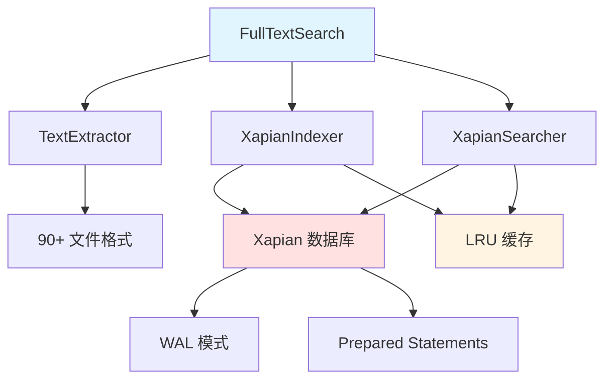
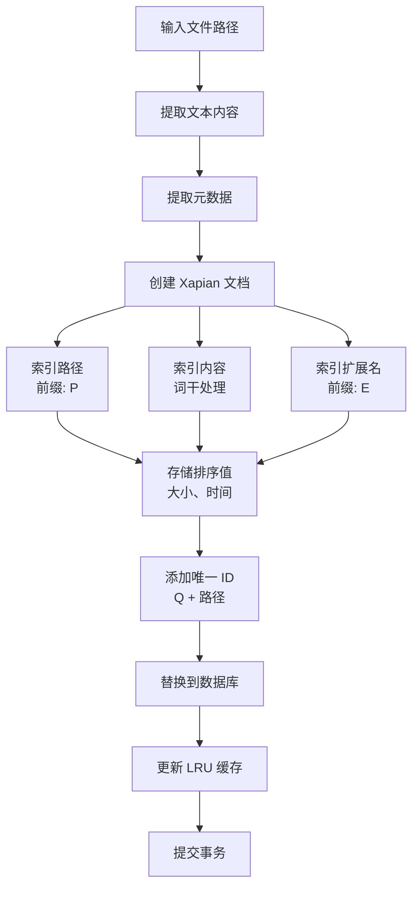
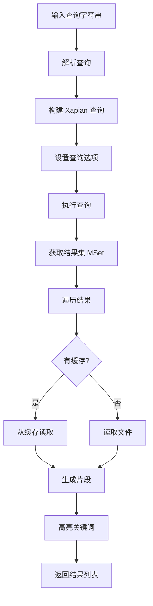

# FullTextSearch 模块文档

## 1. 模块背景

### 业务背景

在数字取证分析中，快速从大量文件中定位关键信息至关重要：

**核心需求**：
- **全文搜索**：在文件内容中搜索关键词
- **高性能**：毫秒级响应时间
- **多格式支持**：支持 90+ 种文本和代码文件格式
- **智能提取**：从二进制文件中提取可读字符串

**解决挑战**：
- **文件数量庞大**：数十万文件的快速检索
- **格式多样性**：不同文件格式的文本提取
- **搜索准确性**：相关度排序和结果高亮
- **索引效率**：快速构建和更新索引

### 技术背景

**核心技术**：
- **Xapian 搜索引擎**：高性能全文检索库
- **Stemming 算法**：词干提取提升召回率
- **LRU 缓存**：优化重复查询性能

**Xapian 特性**：
- **概率排序**：相关度评分
- **布尔查询**：AND、OR、NOT 操作
- **短语搜索**：精确短语匹配
- **通配符**：前缀和通配符搜索

## 2. 模块功能

### 核心功能

#### 1. 文本提取

**支持 90+ 种文件格式**：

**纯文本**：`.txt`, `.log`, `.csv`, `.tsv`

**配置文件**：`.ini`, `.conf`, `.cfg`, `.yaml`, `.yml`, `.toml`, `.env`, `.properties`, `.json`, `.xml`

**Web 技术**：`.html`, `.htm`, `.xhtml`, `.css`, `.scss`, `.sass`, `.less`, `.js`, `.jsx`, `.ts`, `.tsx`, `.vue`, `.svelte`

**编程语言**：
- C/C++: `.c`, `.cpp`, `.cc`, `.cxx`, `.h`, `.hpp`, `.hxx`
- Python: `.py`, `.pyw`, `.pyi`
- Java: `.java`, `.kt`, `.kts`, `.scala`, `.groovy`
- Ruby: `.rb`, `.rake`, `.gemspec`
- PHP: `.php`, `.phtml`
- Rust: `.rs`
- Go: `.go`
- Swift: `.swift`, `.m`, `.mm`
- .NET: `.cs`, `.fs`, `.vb`
- 以及其他：Lua, Tcl, Perl, R, Julia, Elixir, Erlang, Clojure, Haskell, OCaml, Dart, Kotlin, Scala

**Shell 脚本**：`.sh`, `.bash`, `.zsh`, `.fish`, `.csh`, `.ksh`, `.bat`, `.cmd`, `.ps1`, `.psm1`

**文档**：`.md`, `.markdown`, `.rst`, `.asciidoc`, `.adoc`, `.tex`, `.latex`, `.bib`, `.org`

**数据**：`.sql`, `.mysql`, `.pgsql`, `.graphql`, `.gql`

**DevOps**：`.dockerfile`, `.cmake`, `.make`, `.mk`, `.gradle`, `.maven`, `.tf`, `.tfvars`, `.rego`

**其他**：`.diff`, `.patch`, `.svg`, `.plist`, `.manifest`, `.gitignore`, `.gitattributes`, `.editorconfig`

**文本提取实现**：
```cpp
// 直接文本文件读取
std::string content = TextExtractor::extractFromTextFile("document.txt");

// 二进制文件字符串提取（类似 Unix strings）
std::string strings = TextExtractor::extractStrings("binary.exe", 4, 1024 * 1024);

// 自动检测并提取
std::string content = TextExtractor::extract("any_file.ext");
```

#### 2. 索引构建

**添加文档到索引**：
```cpp
XapianIndexer indexer("/path/to/index.db");

// 设置词干语言
indexer.setStemmerLanguage("english");

// 添加文档
FileMetadata metadata;
metadata.path = "/evidence/document.txt";
metadata.extension = ".txt";
metadata.size = 1024;
metadata.mtime = std::time(nullptr);

std::string content = TextExtractor::extract("/evidence/document.txt");
indexer.addDocument("/evidence/document.txt", content, metadata);

// 提交更改
indexer.commit();
```

**索引特性**：
- **字段前缀**：路径 (`P`)、扩展名 (`E`)
- **值排序**：按大小、时间排序
- **去重**：基于文件路径的唯一 ID
- **内容缓存**：LRU 缓存优化重复索引

#### 3. 全文搜索

**基础搜索**：
```cpp
XapianSearcher searcher("/path/to/index.db");

// 简单关键词搜索
auto results = searcher.search("password", 10, 0);

for (const auto& result : results) {
    std::cout << "File: " << result.path << std::endl;
    std::cout << "Score: " << result.score << "%" << std::endl;
    std::cout << "Snippet: " << result.snippet << std::endl;
}
```

**布尔查询**：
```cpp
// AND 操作
auto results1 = searcher.search("password AND key");

// OR 操作
auto results2 = searcher.search("virus OR malware OR trojan");

// NOT 操作
auto results3 = searcher.search("admin NOT root");

// 组合查询
auto results4 = searcher.search("(admin OR root) AND password");
```

**短语搜索**：
```cpp
auto results = searcher.search("\"database connection\"");
```

**通配符搜索**：
```cpp
auto results = searcher.search("admin*");  // admin, administrator, ...
```

**路径和扩展名过滤**：
```cpp
// 按路径过滤
auto results1 = searcher.search("path:/var/log/ AND error");

// 按扩展名过滤
auto results2 = searcher.search("ext:.log AND error");

// 组合过滤
auto results3 = searcher.search("path:/home/user/ AND ext:.txt AND (secret OR password)");
```

#### 4. 结果片段

**智能片段生成**：
- **缓存优先**：优先从 LRU 缓存读取
- **关键词定位**：查找第一个匹配项
- **上下文提取**：提取匹配周围的文本
- **关键词高亮**：用 `**` 标记匹配词

**示例片段**：
```
...system **configuration** file contains administrative **password** for ...
```

### 边界与限制

**功能边界**：
- ❌ 不支持 PDF、Office 文档（需专门的文本提取器）
- ❌ 不支持图像 OCR（需 VisionAnalysis）
- ❌ 不支持实时索引更新（需手动 commit）
- ❌ 不支持分布式索引

**已知限制**：
| 限制 | 影响 | 缓解方法 |
|------|------|----------|
| 文件大小限制 | 大文件可能截断 | 设置合理的 maxBytes |
| 内存占用 | 索引占用内存 | 分批索引，限制缓存 |
| 语言支持 | 默认英语词干 | 配置其他语言的 stemmer |

**性能指标**：
- **索引速度**：5,000-10,000 小文件/秒
- **搜索响应**：<10ms (10K 文档)
- **索引大小**：原文本大小的 30-50%

## 3. 模块使用的库

### 依赖库清单

| 库名称 | 版本 | 用途 |
|--------|------|------|
| **Xapian** | 1.4.0+ (推荐 1.5.0+) | 全文搜索引擎 |

### 架构图



## 4. 模块实现方式

### TextExtractor 类

```cpp
class TextExtractor {
public:
    // 提取文本（自动检测格式）
    static std::string extract(const std::string& filePath, size_t maxBytes = 0);

    // 文本文件读取
    static std::string extractFromTextFile(const std::string& filePath, size_t maxBytes = 0);

    // 二进制文件字符串提取
    static std::string extractStrings(const std::string& filePath,
                                    size_t minLength = 4,
                                    size_t maxBytes = 0);

    // 元数据提取
    static ExtractedMetadata extractMetadata(const std::string& filePath);

    // 格式检测
    static bool isTextFile(const std::string& extension);

private:
    static const std::unordered_set<std::string>& getSupportedExtensions();
};
```

### XapianIndexer 类

```cpp
class XapianIndexer {
public:
    XapianIndexer(const std::string& dbPath);
    ~XapianIndexer();

    // 配置
    void setStemmerLanguage(const std::string& language);

    // 索引操作
    void addDocument(const std::string& filePath,
                   const std::string& content,
                   const FileMetadata& metadata);
    void deleteDocument(const std::string& filePath);
    void commit();

    // 缓存管理
    void cacheContent(const std::string& path, const std::string& content);

private:
    std::unique_ptr<Xapian::WritableDatabase> db_;
    Xapian::TermGenerator termGenerator_;
    std::string stemmerLanguage_;

    // LRU 缓存
    static std::unordered_map<std::string, ContentCacheEntry> contentCache_;
    static std::mutex cacheMutex_;
};
```

### XapianSearcher 类

```cpp
class XapianSearcher {
public:
    XapianSearcher(const std::string& dbPath);

    // 搜索
    std::vector<SearchResult> search(const std::string& queryStr,
                                   size_t limit = 10,
                                   size_t offset = 0);

    // 片段生成
    std::string generateSnippet(const std::string& path, const Xapian::Query& query);

private:
    std::unique_ptr<Xapian::Database> db_;
    size_t snippetLength_ = 200;

    std::string highlightTerms(const std::string& text,
                              const std::vector<std::string>& terms);
};
```

### 数据结构

```cpp
struct FileMetadata {
    std::string path;
    std::string filename;
    std::string extension;
    int64_t size = 0;
    int64_t mtime = 0;
    int64_t ctime = 0;
    bool isText = false;
};

struct SearchResult {
    std::string path;
    int score;              // 相关度百分比 (0-100)
    std::string snippet;    // 搜索结果片段
    int64_t size;
    std::string extension;
    int64_t mtime;
};

struct ContentCacheEntry {
    std::string content;
    int64_t indexTime;
};
```

### 索引流程



### 搜索流程



## 5. API 调用

### C++ API

```cpp
#include "core/FullTextSearch/FullTextSearch.h"

// 1. 创建索引
XapianIndexer indexer("/path/to/index.db");
indexer.setStemmerLanguage("english");

// 2. 索引文件
std::vector<std::string> files = {
    "/evidence/config.ini",
    "/evidence/script.py",
    "/evidence/log.txt"
};

for (const auto& file : files) {
    auto metadata = TextExtractor::extractMetadata(file);
    std::string content = TextExtractor::extract(file);
    indexer.addDocument(file, content, metadata);
}

indexer.commit();

// 3. 搜索
XapianSearcher searcher("/path/to/index.db");

// 简单搜索
auto results1 = searcher.search("password");

// 布尔查询
auto results2 = searcher.search("password AND (key OR secret)");

// 短语搜索
auto results3 = searcher.search("\"database password\"");

// 路径过滤
auto results4 = searcher.search("path:/etc/ AND config");

// 扩展名过滤
auto results5 = searcher.search("ext:.log AND error");

// 4. 处理结果
for (const auto& result : results5) {
    std::cout << "File: " << result.path << std::endl;
    std::cout << "Score: " << result.score << "%" << std::endl;
    std::cout << "Size: " << result.size << " bytes" << std::endl;
    std::cout << "Snippet: " << result.snippet << std::endl;
    std::cout << "---" << std::endl;
}
```

### 命令行集成

```bash
# 构建索引
./forensic_analyzer --index /path/to/extracted_files

# 搜索
./forensic_analyzer --search "password" --db-dir /path/to/databases

# 高级搜索
./forensic_analyzer --search "path:/home/ AND ext:.txt AND secret" \
    --limit 20 --offset 0
```

### REST API（通过 HTTPServer）

```bash
# 索引文件
curl -X POST http://localhost:8080/api/search/index \
  -H "Content-Type: application/json" \
  -d '{"directory": "/path/to/files"}'

# 搜索
curl "http://localhost:8080/api/search/query?q=password&limit=10"

# 高级搜索
curl --get http://localhost:8080/api/search/query \
  --data-urlencode "q=(admin OR root) AND password" \
  --data-urlencode "limit=20"
```

## 6. 二次开发

### 添加新的文件格式

```cpp
class TextExtractor {
public:
    static bool isTextFile(const std::string& extension) {
        static const std::unordered_set<std::string> supportedExtensions = {
            // 现有格式...
            ".newformat",  // 添加新格式
        };

        std::string ext = extension;
        std::transform(ext.begin(), ext.end(), ext.begin(), ::tolower);
        return supportedExtensions.count(ext) > 0;
    }
};
```

### 自定义评分算法

```cpp
class CustomXapianSearcher : public XapianSearcher {
public:
    std::vector<SearchResult> search(const std::string& queryStr,
                                   size_t limit = 10,
                                   size_t offset = 0) override {
        Xapian::Enquire enquire(*db_);
        Xapian::QueryParser parser;
        Xapian::Query query = parser.parse_query(queryStr);

        enquire.set_query(query);

        // 自定义排序策略
        enquire.set_sort_by_value_then_relevance(0, true);  // 先按大小，再按相关度

        Xapian::MSet mset = enquire.get_mset(offset, limit);

        // 处理结果...
    }
};
```

### 多语言支持

```cpp
// 配置不同语言的 stemmer
indexer.setStemmerLanguage("english");   // 英语
indexer.setStemmerLanguage("french");     // 法语
indexer.setStemmerLanguage("german");     // 德语
indexer.setStemmerLanguage("spanish");    // 西班牙语
indexer.setStemmerLanguage("russian");    // 俄语

// 对于中文等没有空格分隔的语言，使用 n-gram
// 需要额外的分词器集成
```

## 7. 其他

### 测试

```bash
cd build
./test_fulltext_search_gtest

# 性能测试
./test_fulltext_search_gtest --gtest_filter="*Performance*"

# 索引测试
./test_fulltext_search_gtest --gtest_filter="*Indexing*"
```

### 故障排查

| 问题 | 可能原因 | 解决方法 |
|------|----------|----------|
| 索引失败 | 文件权限错误 | 检查文件读取权限 |
| 搜索无结果 | 查询语法错误 | 检查布尔表达式 |
| 性能差 | 缓存太小 | 增大缓存大小 |
| 内存占用高 | 索引过大 | 分批索引 |

### 性能优化

**索引优化**：
```cpp
// 批量提交
const int BATCH_SIZE = 1000;
int count = 0;

for (const auto& file : files) {
    indexer.addDocument(file.path, file.content, file.metadata);
    if (++count >= BATCH_SIZE) {
        indexer.commit();
        count = 0;
    }
}
indexer.commit();  // 提交剩余
```

**搜索优化**：
```cpp
// 限制结果集大小
auto results = searcher.search(query, 100, 0);  // 最多 100 条

// 使用更精确的查询
// 差: "content"
// 好: "path:/home/user/ AND ext:.txt AND content"
```

### 最佳实践

1. **索引前提取文本**：避免在索引时重复提取
2. **合理设置缓存**：根据可用内存调整
3. **定期优化索引**：使用 Xapian 的 compact 功能
4. **使用字段前缀**：提高过滤查询效率
5. **限制索引大小**：单个索引不超过 500K 文档

### 相关模块

- **[FileClassifier](./FileClassifier.md)** - 文件分类
- **[FileExtractor](./FileExtractor.md)** - 文件提取
- **[ConfigManager](./ConfigManager.md)** - 搜索配置

---

**最后更新**: 2026-03-11
**维护者**: ymj68520
