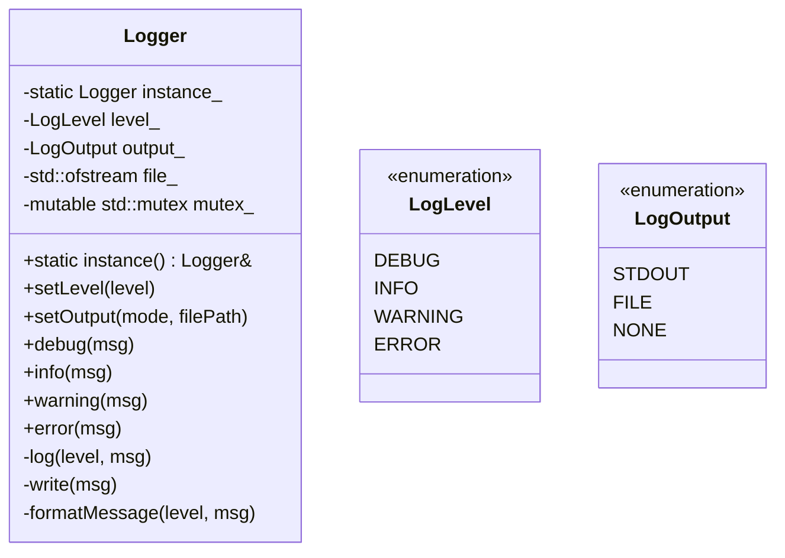

# Logger 模块文档

## 1. 模块背景

### 业务背景

在开发和调试复杂的取证分析系统时，一个灵活、可靠的日志系统至关重要：

**核心需求**：
- **多级别日志**：DEBUG、INFO、WARNING、ERROR
- **多种输出模式**：控制台、文件、静默
- **线程安全**：多线程环境下的并发日志记录
- **性能优化**：可选的编译时优化（release 模式禁用 DEBUG）

**解决挑战**：
- **环境适配**：开发、测试、生产环境的不同配置
- **性能影响**：最小化日志对分析性能的影响
- **并发安全**：多线程同时写入的安全性

### 技术背景

**设计模式**：
- **Singleton Pattern**：全局唯一实例
- **Meyer's Singleton**：C++11 线程安全保证

**实现特点**：
- 零依赖（仅使用标准库）
- 轻量级实现
- 跨平台兼容

## 2. 模块功能

### 核心功能

#### 1. 日志级别

```cpp
enum class LogLevel {
    DEBUG = 0,    // 详细调试信息
    INFO = 1,     // 一般信息
    WARNING = 2,  // 警告信息
    ERROR = 3     // 错误信息
};
```

**级别过滤**：
```cpp
// 设置日志级别
Logger::instance().setLevel(LogLevel::INFO);

// INFO 及以上级别会输出，DEBUG 被过滤
LOG_DEBUG("这条不会输出");
LOG_INFO("这条会输出");
LOG_WARNING("这条会输出");
LOG_ERROR("这条会输出");
```

#### 2. 输出模式

```cpp
enum class LogOutput {
    STDOUT,   // 输出到控制台
    FILE,     // 输出到文件
    NONE      // 禁用所有输出
};
```

**STDOUT 模式**：
```cpp
Logger::instance().setOutput(LogOutput::STDOUT);
LOG_INFO("输出到控制台");
```

**FILE 模式**：
```cpp
Logger::instance().setOutput(LogOutput::FILE, "forensics.log");
LOG_INFO("写入到文件");
```

**NONE 模式**（静默）：
```cpp
Logger::instance().setOutput(LogOutput::NONE);
LOG_ERROR("完全静默，不会输出");
```

#### 3. 便捷宏

```cpp
#define LOG_DEBUG(msg)   ::forensics::Logger::instance().debug(msg)
#define LOG_INFO(msg)    ::forensics::Logger::instance().info(msg)
#define LOG_WARNING(msg) ::forensics::Logger::instance().warning(msg)
#define LOG_ERROR(msg)   ::forensics::Logger::instance().error(msg)

#ifdef NDEBUG
    #define LOG_DEBUG_ONLY(msg) ((void)0)  // Release 模式编译掉
#else
    #define LOG_DEBUG_ONLY(msg) LOG_DEBUG(msg)
#endif
```

**使用示例**：
```cpp
LOG_DEBUG("Processing file: " + filename);
LOG_INFO("Analysis completed successfully");
LOG_WARNING("Large file detected: " + largeFilename);
LOG_ERROR("Failed to open database: " + errorMessage);

// Debug 模式专用（Release 模式完全编译掉）
LOG_DEBUG_ONLY("Performance critical info: " + debugInfo);
```

#### 4. 日志格式

**标准格式**：
```
[2024-03-11 14:30:45.123] [INFO] Analysis started
[2024-03-11 14:30:46.456] [DEBUG] Processing file: evidence.dd
[2024-03-11 14:30:47.789] [WARNING] Large file detected
[2024-03-11 14:30:48.012] [ERROR] Database connection failed
```

**时间戳精度**：毫秒级

### 边界与限制

**功能边界**：
- ❌ 不支持日志轮转（需外部工具如 logrotate）
- ❌ 不支持多目标输出（同时输出到文件和终端）
- ❌ 不支持结构化日志（JSON 格式）
- ❌ 无网络日志功能

**已知限制**：
| 限制 | 影响 | 缓解方法 |
|------|------|----------|
| 单一输出 | 不能同时输出到多个目标 | 使用外部工具重定向 |
| 无轮转 | 长时间运行日志文件过大 | 使用 logrotate |
| 格式固定 | 不能自定义格式 | 后处理或使用 AuditLog |

## 3. 模块使用的库

### 依赖库清单

**零外部依赖**：仅使用 C++ 标准库

```cpp
#include <iostream>      // stdout
#include <fstream>       // file output
#include <mutex>         // thread safety
#include <chrono>        // timestamp
#include <sstream>       // formatting
```

### 架构图



## 4. 模块实现方式

### 核心类

```cpp
class Logger {
public:
    // Singleton
    static Logger& instance();

    // 删除复制操作
    Logger(const Logger&) = delete;
    Logger& operator=(const Logger&) = delete;

    // 配置
    void setLevel(LogLevel level);
    LogLevel getLevel() const;
    void setOutput(LogOutput output, const std::string& filePath = "debug.log");
    LogOutput getOutput() const;

    // 日志方法
    void debug(const std::string& msg);
    void info(const std::string& msg);
    void warning(const std::string& msg);
    void error(const std::string& msg);
    void log(LogLevel level, const std::string& msg);

    // 刷新
    void flush();

private:
    Logger() = default;
    ~Logger();

    // 内部方法
    void write(const std::string& formattedMsg);
    std::string formatMessage(LogLevel level, const std::string& msg);
    const char* levelToString(LogLevel level);

    // 成员变量
    LogLevel level_ = LogLevel::INFO;
    LogOutput output_ = LogOutput::STDOUT;
    std::ofstream file_;
    mutable std::mutex mutex_;
};
```

### Singleton 实现

```cpp
Logger& Logger::instance() {
    static Logger instance;  // Meyer's singleton（C++11 线程安全）
    return instance;
}
```

**Meyer's Singleton 优势**：
- C++11 保证线程安全的初始化
- 自动析构
- 零开销（无额外指针）

### 日志记录实现

```cpp
void Logger::log(LogLevel level, const std::string& msg) {
    std::lock_guard<std::mutex> lock(mutex_);

    // 级别过滤
    if (level < level_) {
        return;
    }

    // 输出模式过滤
    if (output_ == LogOutput::NONE) {
        return;
    }

    // 格式化消息
    std::string formatted = formatMessage(level, msg);

    // 写入
    write(formatted);
}

std::string Logger::formatMessage(LogLevel level, const std::string& msg) {
    auto now = std::chrono::system_clock::now();
    auto time = std::chrono::system_clock::to_time_t(now);
    auto ms = std::chrono::duration_cast<std::chrono::milliseconds>(
        now.time_since_epoch()) % 1000;

    std::ostringstream oss;
    oss << std::put_time(std::localtime(&time), "%Y-%m-%d %H:%M:%S");
    oss << '.' << std::setfill('0') << std::setw(3) << ms.count();
    oss << " [" << levelToString(level) << "] " << msg;

    return oss.str();
}

void Logger::write(const std::string& formattedMsg) {
    switch (output_) {
        case LogOutput::STDOUT:
            std::cout << formattedMsg << std::endl;
            break;
        case LogOutput::FILE:
            if (file_.is_open()) {
                file_ << formattedMsg << std::endl;
            } else {
                // 文件打开失败，回退到 stdout
                std::cout << formattedMsg << std::endl;
            }
            break;
        case LogOutput::NONE:
            // 静默模式
            break;
    }
}
```

### 输出模式切换

```cpp
void Logger::setOutput(LogOutput output, const std::string& filePath) {
    std::lock_guard<std::mutex> lock(mutex_);

    // 关闭旧文件流
    if (file_.is_open()) {
        file_.close();
    }

    output_ = output;

    if (output == LogOutput::FILE && !filePath.empty()) {
        // 打开文件（追加模式）
        file_.open(filePath, std::ios::app);

        if (!file_.is_open()) {
            // 文件打开失败，回退到 stdout
            std::cerr << "[Logger] Failed to open log file: " << filePath
                      << ", falling back to stdout" << std::endl;
            output_ = LogOutput::STDOUT;
        }
    }
}
```

### 线程安全保证

```cpp
// 所有公共方法都使用 mutex 保护
void Logger::info(const std::string& msg) {
    std::lock_guard<std::mutex> lock(mutex_);  // 自动加锁/解锁
    log(LogLevel::INFO, msg);
}
```

**性能考虑**：
- 最小化锁范围：仅在必要操作时持有锁
- 级别过滤优先：在锁保护前过滤低级别日志
- 字符串构建：仅在日志会输出时才构建

## 5. API 调用

### C++ API

```cpp
#include "core/Logger/Logger.h"

using namespace forensics;

// 1. 基础配置
Logger::instance().setLevel(LogLevel::DEBUG);  // 开发环境
Logger::instance().setOutput(LogOutput::STDOUT);

// 2. 记录日志
LOG_DEBUG("Debug message: variable = " + std::to_string(value));
LOG_INFO("Application started successfully");
LOG_WARNING("Configuration file not found, using defaults");
LOG_ERROR("Failed to connect to database: " + errorMessage);

// 3. 生产环境配置
Logger::instance().setLevel(LogLevel::INFO);  // 过滤 DEBUG
Logger::instance().setOutput(LogOutput::FILE, "forensics.log");

// 4. 静默模式（性能测试）
Logger::instance().setOutput(LogOutput::NONE);
LOG_DEBUG("完全不会输出");

// 5. 手动刷新
Logger::instance().flush();

// 6. 运行时配置切换
if (isProduction()) {
    Logger::instance().setLevel(LogLevel::WARNING);
    Logger::instance().setOutput(LogOutput::FILE, "/var/log/forensics/app.log");
} else {
    Logger::instance().setLevel(LogLevel::DEBUG);
    Logger::instance().setOutput(LogOutput::STDOUT);
}
```

### 模块集成示例

```cpp
class ImageAnalyzer {
public:
    bool analyze(const std::string& imagePath) {
        LOG_DEBUG("ImageAnalyzer::analyze() called with: " + imagePath);

        if (!validatePath(imagePath)) {
            LOG_ERROR("Invalid image path: " + imagePath);
            return false;
        }

        LOG_INFO("Starting image analysis: " + imagePath);

        try {
            // 分析逻辑
            processImage(imagePath);

            LOG_INFO("Image analysis completed: " + imagePath);
            return true;
        } catch (const std::exception& e) {
            LOG_ERROR("Exception during analysis: " + std::string(e.what()));
            return false;
        }
    }
};
```

### 环境特定配置

**开发环境**：
```cpp
// main.cpp
Logger::instance().setLevel(LogLevel::DEBUG);
Logger::instance().setOutput(LogOutput::STDOUT);
LOG_INFO("Application started in DEBUG mode");
```

**测试环境**：
```cpp
Logger::instance().setLevel(LogLevel::INFO);
Logger::instance().setOutput(LogOutput::FILE, "test.log");
LOG_INFO("Test suite started");
```

**生产环境**：
```cpp
Logger::instance().setLevel(LogLevel::WARNING);
Logger::instance().setOutput(LogOutput::FILE, "/var/log/forensics/app.log");
LOG_INFO("Production instance started");
```

## 6. 二次开发

> **注意**：Logger 的 `formatMessage()`、`write()`、`setOutput()` 等方法均为非虚函数，不支持继承扩展。如需自定义行为，建议使用组合模式（wrapper）而非继承。

### 包装器模式扩展

```cpp
// JSON 格式日志包装器
class JsonLogger {
public:
    void log(LogLevel level, const std::string& msg) {
        auto now = std::chrono::system_clock::now();
        auto timestamp = std::chrono::duration_cast<std::chrono::milliseconds>(
            now.time_since_epoch()).count();

        std::ostringstream oss;
        oss << "{\"timestamp\":" << timestamp
            << ",\"level\":\"" << levelToString(level) << "\""
            << ",\"message\":\"" << msg << "\"}";

        Logger::instance().log(level, oss.str());
    }

private:
    const char* levelToString(LogLevel level) {
        switch (level) {
            case LogLevel::DEBUG:   return "DEBUG";
            case LogLevel::INFO:    return "INFO";
            case LogLevel::WARNING: return "WARNING";
            case LogLevel::ERROR:   return "ERROR";
            default:                return "UNKNOWN";
        }
    }
};
```

### 日志轮转（外部脚本）

由于 Logger 不支持内置轮转，推荐使用系统级 `logrotate`：

```
# /etc/logrotate.d/forensics
/var/log/forensics/*.log {
    daily
    rotate 30
    compress
    missingok
    notifempty
}
```

## 7. 其他

### 测试

```bash
cd build
./test_logger_gtest

# 运行特定测试
./test_logger_gtest --gtest_filter="LoggerTest.LevelFiltering"
```

### 配合 logrotate

**配置文件** (`/etc/logrotate.d/forensics`)：
```
/var/log/forensics/*.log {
    daily
    rotate 30
    compress
    delaycompress
    missingok
    notifempty
    create 0640 forensics forensics
    sharedscripts
    postrotate
        /bin/kill -USR1 $(cat /var/run/forensics.pid 2>/dev/null) 2>/dev/null || true
    endscript
}
```

### 故障排查

| 问题 | 可能原因 | 解决方法 |
|------|----------|----------|
| 日志未输出 | 级别过滤 | 检查 setLevel() |
| 文件未写入 | 权限问题 | 检查文件路径权限 |
| 性能下降 | DEBUG 日志过多 | 提高日志级别 |
| 乱码 | 编码问题 | 确保使用 UTF-8 |

### 最佳实践

1. **生产环境使用 WARNING 或更高级别**
2. **开发环境可以使用 DEBUG**
3. **关键路径使用 ERROR 级别**
4. **使用有意义的日志消息**
5. **避免在循环中频繁记录日志**
6. **定期检查日志文件大小**

### 相关模块

- **[AuditLog](./AuditLog.md)** - 审计日志系统
- **[ConfigManager](./ConfigManager.md)** - 配置管理

---

**最后更新**: 2026-05-19
**维护者**: ymj68520
