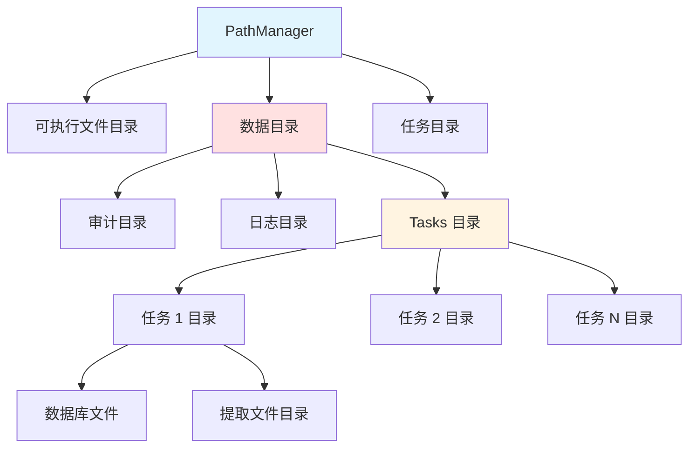

# PathManager 模块文档

## 1. 模块背景

### 业务背景

在数字取证分析系统中，统一管理所有文件路径对于系统的可靠性和可维护性至关重要：

**核心需求**：
- **统一路径管理**：集中管理所有文件系统路径
- **跨平台兼容**：Windows/Linux/macOS 路径处理
- **任务隔离**：每个分析任务独立的目录结构
- **自动创建**：自动创建必要的目录结构

**解决挑战**：
- **路径硬编码**：消除硬编码的路径字符串
- **平台差异**：处理不同操作系统的路径格式
- **相对路径**：正确处理相对路径和符号链接
- **目录组织**：合理组织任务数据和输出

### 技术背景

**设计模式**：
- **Singleton Pattern**：全局唯一路径管理器
- **Service Locator Pattern**：集中路径查询服务

**文件系统技术**：
- **C++17 std::filesystem**：现代跨平台文件系统 API
- **符号链接解析**：使用 `fs::canonical()` 解析链接

## 2. 模块功能

### 核心功能

#### 1. 可执行文件路径解析

**路径解析策略**：
```cpp
void PathManager::initialize(const std::string& executablePath) {
    namespace fs = std::filesystem;

    fs::path exePath;

    // Linux: 使用 /proc/self/exe（最可靠）
#ifdef __linux__
    if (fs::exists("/proc/self/exe")) {
        exePath = fs::canonical("/proc/self/exe");
    } else
#endif
    {
        // 其他平台：使用 argv[0]
        exePath = fs::canonical(executablePath);
    }

    exeDir_ = exePath.parent_path();
}
```

**特性**：
- **Linux 优化**：优先使用 `/proc/self/exe`
- **符号链接解析**：自动解析所有符号链接
- **回退机制**：失败时回退到当前工作目录

#### 2. 数据库目录管理

**目录结构**：
```
<exe_dir>/data/
├── tasks.json                    # 任务注册表
├── tasks/                        # 任务目录
│   ├── task_abc123/             # 任务专属目录
│   │   ├── raw.db               # 原始元数据
│   │   ├── events.db            # 时间线事件
│   │   ├── files.db             # 文件分类
│   │   ├── android.db           # Android 工件
│   │   ├── windows.db           # Windows 工件
│   │   ├── linux.db             # Linux 工件
│   │   └── extracted_files/     # 提取的文件
│   └── task_def456/
│       └── ...
├── audit/                        # 审计日志
│   └── forensics_audit.db
└── logs/                         # 应用日志
    ├── forensics.log
    └── debug.log
```

**路径查询**：
```cpp
auto& pm = PathManager::instance();

// 核心目录
fs::path dataDir = pm.getDataDir();           // <exe_dir>/data/
fs::path auditDir = pm.getAuditDir();         // <exe_dir>/data/audit/
fs::path logsDir = pm.getLogsDir();           // <exe_dir>/data/logs/

// 任务目录
fs::path taskDir = pm.getTaskDir("task_abc123");
fs::path extractDir = pm.getTaskExtractDir("task_abc123");

// 特定文件
fs::path tasksJson = pm.getTasksJsonPath();   // <exe_dir>/data/tasks.json
fs::path auditDb = pm.getAuditDbPath();       // <exe_dir>/data/audit/forensics_audit.db
fs::path logFile = pm.getLogFilePath();       // <exe_dir>/data/logs/forensics.log
```

#### 3. 任务数据库路径

**TaskDbPaths 结构**：
```cpp
struct TaskDbPaths {
    std::filesystem::path rawDb;        // raw.db
    std::filesystem::path eventsDb;     // events.db
    std::filesystem::path filesDb;      // files.db
    std::filesystem::path androidDb;    // android.db
    std::filesystem::path ossDb;        // oss.db
    std::filesystem::path windowsDb;    // windows.db
    std::filesystem::path linuxDb;      // linux.db
};
```

**获取任务数据库路径**：
```cpp
auto dbPaths = PathManager::instance().getTaskDbPaths(
    "task_abc123",
    "evidence.dd"  // 可选参数，默认为空
);

// 访问各个数据库路径
std::string rawDbPath = dbPaths.rawDb.string();      // .../task_abc123/raw.db
std::string eventsDbPath = dbPaths.eventsDb.string(); // .../task_abc123/events.db
```

#### 4. 自动目录创建

**确保目录存在**：
```cpp
PathManager::instance().ensureDirectories();

// 自动创建：
// - <exe_dir>/data/
// - <exe_dir>/data/tasks/
// - <exe_dir>/data/audit/
// - <exe_dir>/data/logs/
```

**任务目录创建**：
```cpp
std::string taskId = "task_new";
PathManager::instance().ensureTaskDir(taskId);

// 自动创建：<exe_dir>/data/tasks/task_new/
```

#### 5. 配置与自定义

**设置数据目录**：
```cpp
// 默认：data
PathManager::instance().setDataDirName("data");

// 自定义：使用不同的数据目录名
PathManager::instance().setDataDirName("forensics_data");
```

**设置项目根目录**：
```cpp
// 从配置文件读取
std::string projectRoot = ConfigManager::instance().get("PROJECT_ROOT", "");
PathManager::instance().setProjectRoot(projectRoot);
```

### 边界与限制

**功能边界**：
- ❌ 不支持网络路径（UNC、SMB）
- ❌ 不支持路径通配符
- ❌ 不处理路径权限问题

**已知限制**：
| 限制 | 影响 | 缓解方法 |
|------|------|----------|
| 相对路径依赖 | 启动位置影响路径 | 使用绝对路径 |
| 符号链接循环 | 可能导致解析失败 | 捕获异常并回退 |
| 权限问题 | 无法创建目录 | 检查并报告权限 |

## 3. 模块使用的库

### 依赖库清单

**零外部依赖**：仅使用 C++17 标准库

```cpp
#include <filesystem>  // C++17 文件系统
#include <string>
```

### 架构图



## 4. 模块实现方式

### 核心类

```cpp
class PathManager {
public:
    // Singleton
    static PathManager& instance();

    // 初始化
    void initialize(const std::string& executablePath);
    bool isInitialized() const;

    // 配置
    void setDataDirName(const std::string& name);
    void setProjectRoot(const std::string& root);

    // 核心目录
    std::filesystem::path getExeDir() const;
    std::filesystem::path getProjectRoot() const;
    std::filesystem::path getDataDir() const;

    // 子目录
    std::filesystem::path getTaskDir(const std::string& taskId) const;
    std::filesystem::path getTaskExtractDir(const std::string& taskId) const;
    std::filesystem::path getAuditDir() const;
    std::filesystem::path getLogsDir() const;

    // 特定文件
    std::filesystem::path getTasksJsonPath() const;
    std::filesystem::path getAuditDbPath() const;
    std::filesystem::path getLogFilePath() const;
    std::filesystem::path getDebugLogPath() const;

    // 任务数据库
    TaskDbPaths getTaskDbPaths(const std::string& taskId,
                              const std::string& imageName = "") const;

    // 目录管理
    void ensureDirectories() const;
    void ensureTaskDir(const std::string& taskId) const;

    // 临时目录
    std::filesystem::path getTempDir() const;
    std::string makeTempPath(const std::string& prefix,
                             const std::string& suffix = "") const;

private:
    PathManager() = default;
    ~PathManager() = default;

    // 成员变量
    bool initialized_ = false;
    std::filesystem::path exeDir_;
    std::filesystem::path projectRoot_;
    std::string dataDirName_ = "data";
};
```

### 初始化实现

```cpp
void PathManager::initialize(const std::string& executablePath) {
    namespace fs = std::filesystem;

    fs::path exePath;

    try {
        // Linux 特定优化
#ifdef __linux__
        if (fs::exists("/proc/self/exe")) {
            exePath = fs::canonical("/proc/self/exe");
        } else
#endif
        {
            // 使用提供的路径
            exePath = fs::canonical(executablePath);
        }

        exeDir_ = exePath.parent_path();
        projectRoot_ = exeDir_;  // 默认项目根目录

        initialized_ = true;

    } catch (const fs::filesystem_error& e) {
        // 回退到当前工作目录
        exeDir_ = fs::current_path();
        projectRoot_ = exeDir_;
        initialized_ = true;

        std::cerr << "[PathManager] Warning: could not resolve executable path, "
                  << "falling back to CWD: " << exeDir_ << std::endl;
    }
}
```

### 目录管理

```cpp
void PathManager::ensureDirectories() const {
    namespace fs = std::filesystem;

    try {
        fs::create_directories(getDataDir());
        fs::create_directories(getDataDir() / "tasks");
        fs::create_directories(getAuditDir());
        fs::create_directories(getLogsDir());

    } catch (const fs::filesystem_error& e) {
        std::cerr << "[PathManager] Failed to create directories: "
                  << e.what() << std::endl;
    }
}

void PathManager::ensureTaskDir(const std::string& taskId) const {
    namespace fs = std::filesystem;

    try {
        auto taskDir = getTaskDir(taskId);
        fs::create_directories(taskDir);

    } catch (const fs::filesystem_error& e) {
        std::cerr << "[PathManager] Failed to create task directory: "
                  << e.what() << std::endl;
    }
}
```

### 任务数据库路径

```cpp
TaskDbPaths PathManager::getTaskDbPaths(
    const std::string& taskId,
    const std::string& imageName) const {

    TaskDbPaths paths;
    auto taskDir = getTaskDir(taskId);

    // 基础数据库名称
    std::string baseName = fs::path(imageName).stem().string();

    paths.rawDb = taskDir / (baseName + "_raw.db");
    paths.eventsDb = taskDir / (baseName + "_events.db");
    paths.filesDb = taskDir / (baseName + "_files.db");
    paths.androidDb = taskDir / (baseName + "_android.db");
    paths.windowsDb = taskDir / (baseName + "_windows.db");
    paths.linuxDb = taskDir / (baseName + "_linux.db");
    paths.ossDb = taskDir / (baseName + "_oss.db");

    return paths;
}
```

## 5. API 调用

### C++ API

```cpp
#include "core/PathManager/PathManager.h"

// 1. 初始化（在 main 函数开始）
PathManager::instance().initialize(argv[0]);

// 2. 加载配置后更新路径
auto& config = ConfigManager::instance();
if (config.load(".env")) {
    PathManager::instance().setProjectRoot(config.get("PROJECT_ROOT", ""));
    PathManager::instance().setDataDirName(config.get("DATA_DIR", "data"));
}

// 3. 创建必要目录
PathManager::instance().ensureDirectories();

// 4. 获取各种路径
auto& pm = PathManager::instance();

// 核心目录
std::cout << "Executable: " << pm.getExeDir() << std::endl;
std::cout << "Data dir: " << pm.getDataDir() << std::endl;
std::cout << "Logs dir: " << pm.getLogsDir() << std::endl;

// 5. 任务路径
std::string taskId = "task_" + generateId();
pm.ensureTaskDir(taskId);

auto dbPaths = pm.getTaskDbPaths(taskId, "evidence.dd");
std::string rawDbPath = dbPaths.rawDb.string();

// 6. 审计日志路径
auto auditConfig = AuditLogConfig{};
auditConfig.db_path = pm.getAuditDbPath().string();
AuditLog::instance(auditConfig);

// 7. 日志文件路径
Logger::instance().setOutput(LogOutput::FILE, pm.getLogFilePath().string());
```

### 集成到应用启动

```cpp
// main.cpp
int main(int argc, char* argv[]) {
    // 1. 初始化 PathManager（最先执行）
    PathManager::instance().initialize(argv[0]);
    PathManager::instance().ensureDirectories();

    // 2. 加载配置
    auto& config = ConfigManager::instance();
    config.load(".env");

    // 3. 更新路径（根据配置）
    PathManager::instance().setProjectRoot(config.get("PROJECT_ROOT", ""));
    PathManager::instance().setDataDirName(config.get("DATA_DIR", "data"));

    // 4. 使用路径初始化其他组件
    AuditLogConfig auditConfig;
    auditConfig.db_path = PathManager::instance().getAuditDbPath().string();
    AuditLog::instance(auditConfig);

    std::string logFile = PathManager::instance().getLogFilePath().string();
    Logger::instance().setOutput(LogOutput::FILE, logFile);

    // 5. 继续应用初始化
    // ...
}
```

### 任务管理集成

```cpp
// TaskManager 使用 PathManager
Task TaskManager::createTask(const std::string& type, const nlohmann::json& params) {
    Task task;
    task.id = generateTaskId();
    task.type = type;
    task.status = TaskStatus::PENDING;

    // 设置任务目录
    task.extraction_directory = PathManager::instance()
        .getTaskExtractDir(task.id).string();

    // 确保目录存在
    PathManager::instance().ensureTaskDir(task.id);

    // 设置数据库路径
    auto dbPaths = PathManager::instance().getTaskDbPaths(
        task.id,
        params.value("image_path", "evidence.dd")
    );

    task.databases["raw"] = dbPaths.rawDb.string();
    task.databases["events"] = dbPaths.eventsDb.string();
    task.databases["files"] = dbPaths.filesDb.string();

    return task;
}
```

### 配置文件集成

```cpp
// ConfigManager 使用 PathManager 搜索 .env 文件
bool ConfigManager::load(const std::string& envPath) {
    std::vector<std::string> searchPaths;

    // 1. 显式路径
    if (!envPath.empty()) {
        searchPaths.push_back(envPath);
    }

    // 2. 可执行文件目录
    if (PathManager::instance().isInitialized()) {
        searchPaths.push_back(
            (PathManager::instance().getExeDir() / ".env").string()
        );
        searchPaths.push_back(
            (PathManager::instance().getExeDir() / "config" / ".env").string()
        );
    }

    // 3. 项目根目录
    if (PathManager::instance().isInitialized()) {
        searchPaths.push_back(
            (PathManager::instance().getProjectRoot() / ".env").string()
        );
    }

    // 尝试加载
    for (const auto& path : searchPaths) {
        if (tryLoad(path)) {
            return true;
        }
    }

    return false;
}
```

## 6. 二次开发

### 添加新的路径类型

```cpp
class PathManager {
public:
    // 新增：备份目录
    std::filesystem::path getBackupDir() const {
        return getDataDir() / "backups";
    }

    // 新增：临时文件目录
    std::filesystem::path getTempDir() const {
        return getDataDir() / "temp";
    }

    // 新增：报告目录
    std::filesystem::path getReportsDir() const {
        return getDataDir() / "reports";
    }

    // 新增：插件目录
    std::filesystem::path getPluginsDir() const {
        return getProjectRoot() / "plugins";
    }
};

// 使用
auto backupDir = PathManager::instance().getBackupDir();
std::filesystem::create_directories(backupDir);
```

### 自定义任务目录结构

```cpp
struct ExtendedTaskDbPaths : public TaskDbPaths {
    std::filesystem::path thumbnailsDb;   // 缩略图数据库
    std::filesystem::path ocrDb;          // OCR 结果数据库
    std::filesystem::path hashesDb;       // 文件哈希数据库
};

ExtendedTaskDbPaths PathManager::getExtendedTaskDbPaths(
    const std::string& taskId,
    const std::string& imageName) const {

    ExtendedTaskDbPaths paths;
    auto taskDir = getTaskDir(taskId);
    std::string baseName = fs::path(imageName).stem().string();

    // 基础路径
    static_cast<TaskDbPaths&>(paths) = getTaskDbPaths(taskId, imageName);

    // 扩展路径
    paths.thumbnailsDb = taskDir / (baseName + "_thumbnails.db");
    paths.ocrDb = taskDir / (baseName + "_ocr.db");
    paths.hashesDb = taskDir / (baseName + "_hashes.db");

    return paths;
}
```

### 路径验证

```cpp
class PathManager {
public:
    struct ValidationResult {
        bool valid;
        std::vector<std::string> errors;
        std::vector<std::string> warnings;
    };

    ValidationResult validatePaths() const {
        ValidationResult result;
        result.valid = true;

        // 检查可执行目录
        if (!fs::exists(exeDir_)) {
            result.valid = false;
            result.errors.push_back("Executable directory does not exist");
        }

        // 检查数据目录
        auto dataDir = getDataDir();
        if (!fs::exists(dataDir)) {
            result.warnings.push_back("Data directory does not exist");
        }

        // 检查写入权限
        std::ofstream test(dataDir / "test.tmp");
        if (!test) {
            result.valid = false;
            result.errors.push_back("No write permission to data directory");
        } else {
            test.close();
            fs::remove(dataDir / "test.tmp");
        }

        return result;
    }
};
```

## 7. 其他

### 测试

```bash
cd build
./test_path_manager

# 测试路径解析
./test_path_manager --test-resolution

# 测试目录创建
./test_path_manager --test-directories
```

### 故障排查

| 问题 | 可能原因 | 解决方法 |
|------|----------|----------|
| 路径未初始化 | 未调用 initialize() | 在 main 开始时调用 |
| 目录创建失败 | 权限不足 | 检查文件系统权限 |
| 相对路径错误 | 工作目录不正确 | 使用绝对路径 |
| 符号链接循环 | 文件系统循环链接 | 捕获异常 |

### 最佳实践

1. **首先初始化 PathManager**
2. **使用 ensureDirectories() 创建必要目录**
3. **优先使用绝对路径**
4. **检查路径存在性**
5. **处理文件系统异常**
6. **文档化自定义路径**

### 相关模块

- **[ConfigManager](./ConfigManager.md)** - 配置管理
- **[TaskManager](../network/TaskManager.md)** - 任务管理
- **[AuditLog](./AuditLog.md)** - 审计日志

---

**最后更新**: 2026-05-19
**维护者**: ymj68520
