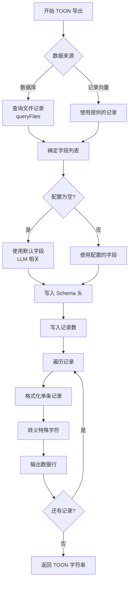

# TOONExporter 模块文档

## 1. 模块背景

### 业务背景

在数字取证分析中，将结果数据传递给大语言模型（LLM）进行智能分析是一项重要功能：

**核心需求**：
- **Token 优化**：减少 30-60% 的 token 消耗（相比 JSON）
- **LLM 友好**：结构化表格格式便于 LLM 理解
- **字段选择**：按需导出特定字段
- **无损转换**：支持与 JSON 的相互转换

**解决挑战**：
- **Token 成本**：JSON 格式冗余，消耗大量 token
- **数据格式**：LLM 对表格结构理解更好
- **灵活导出**：根据分析需求选择字段
- **LLM 集成**：与 LLM 分析结果无缝集成

### 技术背景

**TOON 格式**：
- **Token-Oriented Object Notation**：面向 token 的对象表示法
- **表格结构**：Schema 声明 + 数据行
- **管道分隔**：` | ` 分隔符
- **最小冗余**：去除 JSON 的花括号和引号

**设计目标**：
- 相比 JSON 减少 30-60% token
- 保留完整的数据语义
- 易于 LLM 解析和理解

## 2. 模块功能

### 核心功能

#### 1. TOON 格式导出

**格式结构**：
```toon
TOON.schema: name | path | size | category | llm_summary | llm_description
# records[3]
document.txt | /home/user/document.txt | 1024 | DOCUMENTS | Report file | Annual report for 2024
image.jpg | /home/user/pictures/image.jpg | 51200 | IMAGES | Photo | Family photo from vacation
script.py | /home/user/scripts/script.py | 2048 | SOURCE_CODE | Python script | Automation script
```

**导出示例**：
```cpp
TOONExporter exporter;

// 默认配置（导出 LLM 相关字段）
TOONExportConfig config;
std::string toon = exporter.exportToTOON(db, config);

// 自定义字段
config.fields = {"name", "path", "size", "category", "llm_summary"};
toon = exporter.exportToTOON(db, config);
```

#### 2. 字段选择

**可用字段**：
```cpp
// 所有可用字段
auto allFields = TOONExporter::getAllFieldNames();
// 返回: {"inode", "name", "path", "size", "extension", "category", "type",
//        "mtime", "ctime", "is_deleted", "md5",
//        "llm_summary", "llm_description", "llm_keywords",
//        "llm_analyzed_at", "llm_model_used"}
```

**字段分类**：

**核心元数据**：
- `inode`：文件 inode 编号
- `name`：文件名
- `path`：完整路径
- `size`：文件大小（字节）
- `extension`：文件扩展名
- `category`：文件分类
- `type`：文件类型

**时间戳**：
- `mtime`：修改时间
- `ctime`：创建时间

**状态**：
- `is_deleted`：是否已删除
- `md5`：MD5 哈希

**LLM 分析**：
- `llm_summary`：LLM 生成的摘要
- `llm_description`：LLM 生成的描述
- `llm_keywords`：LLM 提取的关键词
- `llm_analyzed_at`：分析时间戳
- `llm_model_used`：使用的 LLM 模型

#### 3. 数据过滤

**WHERE 子句过滤**：
```cpp
TOONExportConfig config;
config.whereClause = "category = 'IMAGES' AND size > 10000";
config.fields = {"name", "path", "size", "llm_description"};

std::string toon = exporter.exportToTOON(db, config);
```

**常见过滤条件**：
```cpp
// 按分类
config.whereClause = "category IN ('DOCUMENTS', 'IMAGES')";

// 按大小
config.whereClause = "size > 1024 AND size < 1048576";  // 1KB - 1MB

// 按扩展名
config.whereClause = "extension IN ('.txt', '.md', '.pdf')";

// 已删除文件
config.whereClause = "is_deleted = 1";

// 已分析文件
config.whereClause = "llm_analyzed_at > 0";

// 组合条件
config.whereClause = "category = 'DOCUMENTS' AND llm_analyzed_at > 0 AND size > 1000";
```

#### 4. 格式化选项

**TOONExportConfig 结构**：
```cpp
struct TOONExportConfig {
    std::string delimiter = " | ";       // 字段分隔符
    bool includeSchema = true;            // 包含 schema 声明
    bool quoteStrings = true;             // 引用字符串值
    std::vector<std::string> fields;     // 要导出的字段
    std::string whereClause;             // WHERE 过滤条件
};
```

**自定义分隔符**：
```cpp
TOONExportConfig config;
config.delimiter = " | ";      // 默认：管道符加空格
config.delimiter = "|";        // 无空格
config.delimiter = "\t";       // Tab 分隔
config.delimiter = ",";        // CSV 风格
```

**Schema 控制**：
```cpp
config.includeSchema = true;   // 包含 "TOON.schema: ..." 行
config.includeSchema = false;  // 仅输出数据行
```

#### 5. 特殊字符处理

**自动转义**：
```cpp
// 需要引用的情况：
// - 包含分隔符（|）
// - 包含引号（"）
// - 包含换行符（\n, \r）
// - 包含逗号（,）
// - 前导或尾随空格

std::string escaped = TOONExporter::escapeValue("value with | delimiter");
// 返回: "value with | delimiter"
```

**转义规则**：
- `"` → `""`（双引号加倍）
- `\n` → `\\n`（显式转义）
- `\r` → `\\r`（显式转义）
- 整个值用 `"` 包围

### 边界与限制

**功能边界**：
- ❌ 不支持嵌套结构（仅平面表格）
- ❌ 不支持数组类型（多值字段）
- ❌ 不支持数据类型推断（全是字符串）

**已知限制**：
| 限制 | 影响 | 缓解方法 |
|------|------|----------|
| 平面结构 | 不能表示嵌套对象 | 展平为单层 |
| 无类型信息 | LLM 需推断类型 | 通过字段名暗示 |
| 大数据集 | 字符串拼接占用内存 | 分批导出 |

**性能指标**：
- **Token 节省**：30-60%（相比 JSON）
- **导出速度**：~10,000 记录/秒
- **内存占用**：取决于数据集大小

## 3. 模块使用的库

### 依赖库清单

**零外部依赖**：仅使用 C++ 标准库和 SQLite3

```cpp
#include <string>
#include <vector>
#include <cstdint>
#include <sqlite3.h>
```

### TOON vs JSON 对比

| 特性 | TOON | JSON |
|------|------|------|
| Token 效率 | 高（30-60% 节省） | 低（冗余语法） |
| LLM 理解 | 容易（表格格式） | 中等（嵌套结构） |
| 可读性 | 高（紧凑表格） | 中等（冗余括号） |
| 类型信息 | 无（隐式） | 有（显式） |
| 嵌套支持 | 不支持 | 支持 |
| 标准化 | 项目特定 | 国际标准 |

## 4. 模块实现方式

### 核心类

```cpp
class TOONExporter {
public:
    TOONExporter() = default;
    ~TOONExporter() = default;

    // 数据库导出
    std::string exportToTOON(sqlite3* db, const TOONExportConfig& config = {});

    // 记录导出
    std::string exportToTOON(const std::vector<FileRecordWithLLM>& records,
                              const TOONExportConfig& config = {});

    // 静态方法
    static std::vector<FileRecordWithLLM> queryFiles(sqlite3* db,
                                                      const std::string& whereClause = "");
    static std::string escapeValue(const std::string& value);
    static std::vector<std::string> getAllFieldNames();

private:
    std::string formatRecord(const FileRecordWithLLM& record,
                             const std::vector<std::string>& fields,
                             const std::string& delimiter) const;
    std::string getFieldValue(const FileRecordWithLLM& record,
                              const std::string& fieldName) const;
};
```

### 数据结构

```cpp
struct FileRecordWithLLM {
    // 核心元数据
    int64_t inode = 0;
    std::string name;
    std::string path;
    int64_t size = 0;
    std::string extension;
    std::string category;
    std::string type;
    int64_t mtime = 0;
    int64_t ctime = 0;
    int isDeleted = 0;
    std::string md5;

    // LLM 分析字段
    std::string llm_summary;
    std::string llm_description;
    std::string llm_keywords;
    int64_t llm_analyzed_at = 0;
    std::string llm_model_used;
};

struct TOONExportConfig {
    std::string delimiter = " | ";
    bool includeSchema = true;
    bool quoteStrings = true;
    std::vector<std::string> fields;
    std::string whereClause;
};
```

### 导出流程



### Schema 声明生成

```cpp
// 写入 schema 头
if (config.includeSchema) {
    oss << "TOON.schema: ";
    bool first = true;
    for (const auto& field : fields) {
        if (!first) {
            oss << delimiter;
        }
        first = false;
        oss << field;
    }
    oss << "\n";
}

// 输出: TOON.schema: name | path | size | category | llm_summary
```

### 记录格式化

```cpp
std::string TOONExporter::formatRecord(const FileRecordWithLLM& record,
                                        const std::vector<std::string>& fields,
                                        const std::string& delimiter) const {
    std::ostringstream oss;
    bool first = true;

    for (const auto& field : fields) {
        if (!first) {
            oss << delimiter;
        }
        first = false;

        std::string value = getFieldValue(record, field);
        oss << escapeValue(value);  // 自动转义和引用
    }

    return oss.str();
}
```

### 值转义实现

```cpp
std::string TOONExporter::escapeValue(const std::string& value) {
    if (value.empty()) {
        return "\"\"";  // 空字符串引用
    }

    // 检查是否需要引用
    bool needsQuoting = false;
    for (char c : value) {
        if (c == '|' || c == '"' || c == '\n' || c == '\r' || c == ',') {
            needsQuoting = true;
            break;
        }
    }

    // 检查前导/尾随空格
    if (!needsQuoting && !value.empty() &&
        (std::isspace(value.front()) || std::isspace(value.back()))) {
        needsQuoting = true;
    }

    if (!needsQuoting) {
        return value;  // 无需引用，直接返回
    }

    // 转义并引用
    std::string escaped;
    escaped.reserve(value.size() + 10);
    escaped += '"';  // 开始引号

    for (char c : value) {
        if (c == '"') {
            escaped += "\"\"";  // 双引号加倍
        } else if (c == '\n') {
            escaped += "\\n";  // 换行符转义
        } else if (c == '\r') {
            escaped += "\\r";  // 回车符转义
        } else {
            escaped += c;
        }
    }

    escaped += '"';  // 结束引号
    return escaped;
}
```

## 5. API 调用

### C++ API

```cpp
#include "core/TOONExporter/TOONExporter.h"

// 1. 基础导出（默认字段）
TOONExporter exporter;
TOONExportConfig config;

std::string toon = exporter.exportToTOON(db, config);
std::cout << toon << std::endl;

// 2. 自定义字段
config.fields = {"name", "path", "size", "category", "llm_summary", "llm_description"};
toon = exporter.exportToTOON(db, config);

// 3. 过滤导出
config.whereClause = "category = 'IMAGES' AND size > 10000";
config.fields = {"name", "path", "size", "llm_keywords"};
toon = exporter.exportToTOON(db, config);

// 4. 无 Schema 导出
config.includeSchema = false;
toon = exporter.exportToTOON(db, config);

// 5. 自定义分隔符
config.delimiter = "\t";  // Tab 分隔
config.includeSchema = true;
toon = exporter.exportToTOON(db, config);

// 6. 从记录导出
auto records = TOONExporter::queryFiles(db, "llm_analyzed_at > 0");
toon = exporter.exportToTOON(records, config);

// 7. 值转义
std::string escaped = TOONExporter::escapeValue("value with | delimiter");
std::cout << escaped << std::endl;  // "value with | delimiter"
```

### 集成到 LLM 分析

```cpp
class LLMAnalyzer {
public:
    std::string analyzeWithTOON(sqlite3* db) {
        // 导出 TOON 格式
        TOONExporter exporter;
        TOONExportConfig config;

        // 选择对 LLM 分析有用的字段
        config.fields = {
            "name", "path", "size", "category",
            "llm_summary", "llm_description", "llm_keywords"
        };

        // 仅导出已分析的文件
        config.whereClause = "llm_analyzed_at > 0";

        std::string toon = exporter.exportToTOON(db, config);

        // 构建 LLM 提示
        std::string prompt =
            "你是一个数字取证分析专家。请分析以下文件列表，"
            "识别可疑活动、异常模式和潜在证据。\n\n"
            "文件数据（TOON 格式）：\n" + toon + "\n"
            "请提供：\n"
            "1. 整体摘要\n"
            "2. 可疑文件列表\n"
            "3. 异常模式\n"
            "4. 进一步调查建议";

        // 发送到 LLM
        return llmClient.chat(prompt);
    }
};
```

### REST API（通过 HTTPServer）

```bash
# 导出 TOON 格式
curl -X POST http://localhost:8080/api/forensics/export/toon \
  -H "Content-Type: application/json" \
  -d '{
    "task_id": "task_abc123",
    "fields": ["name", "path", "size", "llm_summary"],
    "where_clause": "category = '\''IMAGES'\''"
  }'

# Python 服务端点
curl -X POST http://localhost:8090/api/db/tasks/task_abc123/export/toon \
  -H "Content-Type: application/json" \
  -d '{
    "fields": ["name", "path", "llm_description"],
    "limit": 100
  }'
```

## 6. 二次开发

### 添加 TOON 到 JSON 转换

```cpp
class TOONConverter {
public:
    static nlohmann::json toJSON(const std::string& toon) {
        nlohmann::json jsonArray = nlohmann::json::array();

        std::istringstream iss(toon);
        std::string line;
        std::vector<std::string> headers;

        while (std::getline(iss, line)) {
            if (line.empty()) continue;

            // 解析 schema 行
            if (line.find("TOON.schema:") == 0) {
                headers = parseSchema(line);
                continue;
            }

            // 跳过注释行
            if (line[0] == '#') continue;

            // 解析数据行
            auto values = parseDataLine(line);
            nlohmann::json obj;

            for (size_t i = 0; i < headers.size() && i < values.size(); ++i) {
                obj[headers[i]] = values[i];
            }

            jsonArray.push_back(obj);
        }

        return jsonArray;
    }

private:
    static std::vector<std::string> parseSchema(const std::string& line) {
        // "TOON.schema: field1 | field2 | field3"
        size_t pos = line.find(':');
        std::string schema = line.substr(pos + 2);  // 跳过 ": "
        return split(schema, " | ");
    }

    static std::vector<std::string> parseDataLine(const std::string& line) {
        return split(line, " | ");
    }

    static std::vector<std::string> split(const std::string& s, const std::string& delimiter) {
        std::vector<std::string> tokens;
        size_t start = 0, end = s.find(delimiter);

        while (end != std::string::npos) {
            tokens.push_back(s.substr(start, end - start));
            start = end + delimiter.length();
            end = s.find(delimiter, start);
        }

        tokens.push_back(s.substr(start));
        return tokens;
    }
};
```

### 添加流式导出

```cpp
class StreamingTOONExporter : public TOONExporter {
public:
    void exportToStream(sqlite3* db,
                        std::ostream& out,
                        const TOONExportConfig& config) {
        // 写入 schema
        if (config.includeSchema) {
            out << generateSchema(config);
            out << "\n";
        }

        // 写入记录数
        std::string countQuery = "SELECT COUNT(*) FROM files";
        if (!config.whereClause.empty()) {
            countQuery += " WHERE " + config.whereClause;
        }

        // 逐条写入
        sqlite3_stmt* stmt;
        std::string sql = buildQuery(config);

        if (sqlite3_prepare_v2(db, sql.c_str(), -1, &stmt, nullptr) == SQLITE_OK) {
            while (sqlite3_step(stmt) == SQLITE_ROW) {
                auto record = readRecord(stmt);
                out << formatRecord(record, config.fields, config.delimiter) << "\n";
            }
            sqlite3_finalize(stmt);
        }
    }

private:
    std::string generateSchema(const TOONExportConfig& config) {
        std::ostringstream oss;
        oss << "TOON.schema: ";
        bool first = true;
        for (const auto& field : config.fields) {
            if (!first) oss << config.delimiter;
            oss << field;
            first = false;
        }
        return oss.str();
    }
};
```

### 添加统计信息

```cpp
struct TOONExportStats {
    size_t totalRecords = 0;
    size_t totalSize = 0;
    std::map<std::string, size_t> categoryCounts;
    std::map<std::string, size_t> extensionCounts;
};

TOONExportStats TOONExporter::exportWithStats(sqlite3* db,
                                              const TOONExportConfig& config) {
    auto records = queryFiles(db, config.whereClause);

    TOONExportStats stats;
    stats.totalRecords = records.size();

    for (const auto& record : records) {
        stats.totalSize += record.size;
        stats.categoryCounts[record.category]++;
        stats.extensionCounts[record.extension]++;
    }

    // 导出 TOON
    std::string toon = exportToTOON(records, config);

    // 附加统计信息
    std::ostringstream oss;
    oss << toon;
    oss << "\n# Statistics\n";
    oss << "# Total records: " << stats.totalRecords << "\n";
    oss << "# Total size: " << stats.totalSize << " bytes\n";

    return stats;
}
```

## 7. 其他

### 测试

```bash
cd build
./test_toon_exporter

# 测试特定功能
./test_toon_exporter --test-escaping
./test_toon_exporter --test-fields
```

### 故障排查

| 问题 | 可能原因 | 解决方法 |
|------|----------|----------|
| 字段为空 | 字段名拼写错误 | 检查字段名 |
| 编码问题 | 特殊字符未转义 | 使用 escapeValue() |
| Token 未节省 | 字段过多 | 减少导出字段 |

### 最佳实践

1. **仅导出需要的字段**：减少 token 消耗
2. **使用 WHERE 过滤**：减少无关数据
3. **保留 LLM 字段**：增强 LLM 理解
4. **合理使用分隔符**：确保数据清晰
5. **处理特殊字符**：避免解析错误

### TOON 使用场景

**最佳场景**：
- LLM 文件分析摘要
- 取证报告生成
- 数据可视化的输入
- 批量分析任务

**不推荐场景**：
- 需要嵌套结构的复杂数据
- 需要精确类型信息的场景
- 需要与其他系统交换数据

### 相关模块

- **[DatabaseManager](./DatabaseManager.md)** - 数据库管理
- **[LLMIntegration](../integration/LLMIntegration.md)** - LLM 集成
- **[FileClassifier](./FileClassifier.md)** - 文件分类

### 参考资源

- TOON 格式设计文档（项目内部）
- LLM Prompt 工程最佳实践

---

**最后更新**: 2026-05-19
**维护者**: ymj68520
