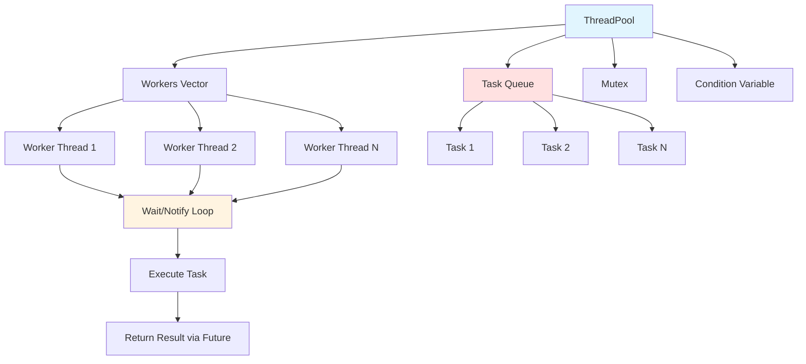

# ThreadPool 模块文档

## 1. 模块背景

### 业务背景

在数字取证分析中，许多操作可以并行执行以提升性能：

**核心需求**：
- **并行执行**：充分利用多核 CPU
- **任务调度**：高效的任务队列管理
- **结果获取**：便捷的任务结果访问
- **异常处理**：任务异常的安全传播

**解决挑战**：
- **线程管理**：避免频繁创建/销毁线程
- **负载均衡**：合理分配任务到工作线程
- **资源控制**：限制并发线程数量
- **死锁避免**：正确的同步原语使用

### 技术背景

**设计模式**：
- **Thread Pool Pattern**：预创建工作线程
- **Producer-Consumer Pattern**：任务队列生产消费
- **Future/Promise Pattern**：异步结果获取

**C++ 技术栈**：
- **std::thread**：线程管理
- **std::mutex**：互斥锁
- **std::condition_variable**：条件变量
- **std::future**：异步结果
- **Perfect Forwarding**：完美转发参数

## 2. 模块功能

### 核心功能

#### 1. 线程池初始化

**自动大小**：
```cpp
// 使用硬件并发（默认）
ThreadPool pool;  // 创建 CPU 核心数量的线程

// 或显式指定
ThreadPool pool(8);  // 创建 8 个工作线程
```

**硬件并发检测**：
```cpp
size_t threads = std::thread::hardware_concurrency();
std::cout << "CPU cores: " << threads << std::endl;
```

#### 2. 任务提交

**基本用法**：
```cpp
ThreadPool pool(4);

// 提交任务
auto future = pool.enqueue([](int x) {
    return x * 2;
}, 21);

// 获取结果
int result = future.get();  // 42
```

**返回值任务**：
```cpp
auto future1 = pool.enqueue([]() {
    return std::string("Hello");
});

auto future2 = pool.enqueue([]() -> int {
    return 42;
});

auto future3 = pool.enqueue([]() {
    return 3.14;
});
```

**无返回值任务**：
```cpp
pool.enqueue([]() {
    LOG_INFO("Task executed");
});
```

**成员函数调用**：
```cpp
class Database {
public:
    std::vector<std::string> query(const std::string& sql) { /* ... */ }
};

Database db;
auto future = pool.enqueue(&Database::query, &db, "SELECT * FROM files");
auto results = future.get();
```

#### 3. 批量处理

**批量任务提交**：
```cpp
ThreadPool pool(8);
std::vector<std::string> files = {"file1.txt", "file2.txt", "file3.txt"};

std::vector<std::future<AnalysisResult>> futures;

for (const auto& file : files) {
    futures.push_back(pool.enqueue([&file]() {
        return analyzeFile(file);
    }));
}

// 收集结果
std::vector<AnalysisResult> results;
for (auto& future : futures) {
    results.push_back(future.get());
}
```

**并行处理模式**：
```cpp
template<typename Iterator, typename Function>
void parallelFor(ThreadPool& pool, Iterator begin, Iterator end, Function func) {
    const size_t batchSize = std::distance(begin, end) / pool.size();
    std::vector<std::future<void>> futures;

    for (Iterator it = begin; it < end; it += batchSize) {
        Iterator last = std::min(it + batchSize, end);
        futures.push_back(pool.enqueue([it, last, func]() {
            for (Iterator i = it; i != last; ++i) {
                func(*i);
            }
        }));
    }

    for (auto& future : futures) {
        future.get();
    }
}

// 使用
parallelFor(pool, files.begin(), files.end(), [](const std::string& file) {
    processFile(file);
});
```

#### 4. 异常处理

**任务异常传播**：
```cpp
auto future = pool.enqueue([]() -> int {
    if (errorCondition) {
        throw std::runtime_error("Analysis failed");
    }
    return 42;
});

try {
    int result = future.get();  // 抛出异常
} catch (const std::runtime_error& e) {
    LOG_ERROR("Task failed: " + std::string(e.what()));
}
```

**安全异常处理**：
```cpp
auto future = pool.enqueue([]() -> Result {
    try {
        return performAnalysis();
    } catch (const std::exception& e) {
        LOG_ERROR("Exception in task: " + std::string(e.what()));
        return Result::FAILED;
    }
});
```

#### 5. 线程池状态

**查询状态**：
```cpp
ThreadPool pool(4);

// 线程数量
size_t threadCount = pool.size();

// 停止状态
bool stopped = pool.isStopped();

// 待处理任务（需要扩展实现）
size_t pending = pool.pendingTasks();
```

### 边界与限制

**功能边界**：
- ❌ 不支持动态调整线程数量
- ❌ 不支持任务优先级
- ❌ 不支持任务取消（已提交的任务）
- ❌ 不支持超时控制

**已知限制**：
| 限制 | 影响 | 缓解方法 |
|------|------|----------|
| 固定线程数 | 无法动态扩展 | 预估合理大小 |
| 无任务优先级 | 所有任务平等 | 使用多个线程池 |
| 无任务取消 | 无法中止运行任务 | 使用原子标志检查 |

**性能指标**：
- **任务提交**：O(1) 时间复杂度
- **内存占用**：每个线程 ~8MB 栈空间
- **最佳大小**：CPU 密集 = 核心数，I/O 密集 = 2x 核心数

## 3. 模块使用的库

### 依赖库清单

**零外部依赖**：仅使用 C++17 标准库

```cpp
#include <thread>
#include <mutex>
#include <condition_variable>
#include <queue>
#include <functional>
#include <future>
#include <vector>
```

### 架构图



## 4. 模块实现方式

### 核心类

```cpp
class ThreadPool {
public:
    // 构造函数
    explicit ThreadPool(size_t threads = std::thread::hardware_concurrency());

    // 析构函数（等待所有任务完成）
    ~ThreadPool();

    // 禁止复制
    ThreadPool(const ThreadPool&) = delete;
    ThreadPool& operator=(const ThreadPool&) = delete;

    // 提交任务
    template<class F, class... Args>
    auto enqueue(F&& f, Args&&... args)
        -> std::future<typename std::invoke_result<F, Args...>::type>;

    // 查询方法
    size_t size() const;
    bool isStopped() const;

private:
    // 工作线程
    std::vector<std::thread> workers_;

    // 任务队列
    std::queue<std::function<void()>> tasks_;

    // 同步原语
    std::mutex queueMutex_;
    std::condition_variable condition_;
    std::atomic<bool> stop_{false};
};
```

### 构造函数实现

```cpp
ThreadPool::ThreadPool(size_t threads) {
    // 确保至少 1 个线程
    threads = std::max(1u, threads);

    // 预留空间
    workers_.reserve(threads);

    // 创建工作线程
    for (size_t i = 0; i < threads; ++i) {
        workers_.emplace_back([this] {
            while (true) {
                std::function<void()> task;

                {
                    std::unique_lock<std::mutex> lock(queueMutex_);

                    // 等待任务或停止信号
                    condition_.wait(lock, [this] {
                        return stop_ || !tasks_.empty();
                    });

                    // 停止且无任务
                    if (stop_ && tasks_.empty()) {
                        return;
                    }

                    // 获取任务
                    task = std::move(tasks_.front());
                    tasks_.pop();
                }

                // 执行任务（锁外执行）
                task();
            }
        });
    }
}
```

### 任务提交实现

```cpp
template<class F, class... Args>
auto ThreadPool::enqueue(F&& f, Args&&... args)
    -> std::future<typename std::invoke_result<F, Args...>::type>
{
    using ReturnType = typename std::invoke_result<F, Args...>::type;

    // 创建 packaged_task
    auto task = std::make_shared<std::packaged_task<ReturnType()>>(
        std::bind(std::forward<F>(f), std::forward<Args>(args)...)
    );

    // 获取 future
    std::future<ReturnType> result = task->get_future();

    {
        std::unique_lock<std::mutex> lock(queueMutex_);

        // 检查停止状态
        if (stop_) {
            throw std::runtime_error("enqueue on stopped ThreadPool");
        }

        // 添加任务到队列
        tasks_.emplace([task]() {
            (*task)();
        });
    }

    // 通知一个工作线程
    condition_.notify_one();

    return result;
}
```

### 析构函数实现

```cpp
ThreadPool::~ThreadPool() {
    {
        std::unique_lock<std::mutex> lock(queueMutex_);
        stop_ = true;  // 设置停止标志
    }

    // 唤醒所有工作线程
    condition_.notify_all();

    // 等待所有线程完成
    for (std::thread& worker : workers_) {
        if (worker.joinable()) {
            worker.join();
        }
    }
}
```

## 5. API 调用

### C++ API

```cpp
#include "core/ThreadPool/ThreadPool.h"

// 1. 创建线程池
ThreadPool pool(8);  // 8 个工作线程

// 2. 简单任务
auto future1 = pool.enqueue([]() {
    return 42;
});
int result1 = future1.get();  // 42

// 3. 带参数任务
auto future2 = pool.enqueue([](int x, int y) {
    return x + y;
}, 10, 20);
int result2 = future2.get();  // 30

// 4. 无返回值任务
pool.enqueue([]() {
    LOG_INFO("Background task");
});

// 5. 成员函数调用
class Analyzer {
public:
    Result analyze(const std::string& file) { /* ... */ }
};

Analyzer analyzer;
auto future3 = pool.enqueue(&Analyzer::analyze, &analyzer, "file.txt");
Result result3 = future3.get();

// 6. 批量处理
std::vector<std::string> files = {/* ... */};
std::vector<std::future<Result>> futures;

for (const auto& file : files) {
    futures.push_back(pool.enqueue([&analyzer, file]() {
        return analyzer.analyze(file);
    }));
}

// 收集结果
std::vector<Result> results;
for (auto& future : futures) {
    results.push_back(future.get());
}
```

### 集成到文件分析

```cpp
class FileAnalyzer {
    ThreadPool pool_;

public:
    FileAnalyzer() : pool_(4) {}

    std::vector<AnalysisResult> batchAnalyze(
        const std::vector<std::string>& files
    ) {
        std::vector<std::future<AnalysisResult>> futures;

        // 提交所有任务
        for (const auto& file : files) {
            futures.push_back(pool_.enqueue([this, file]() {
                return analyzeSingleFile(file);
            }));
        }

        // 收集结果
        std::vector<AnalysisResult> results;
        for (auto& future : futures) {
            results.push_back(future.get());
        }

        return results;
    }

private:
    AnalysisResult analyzeSingleFile(const std::string& file) {
        // 分析逻辑
        return AnalysisResult{};
    }
};
```

### 数据库并行查询

```cpp
std::vector<FileRecord> parallelQueryFiles(
    ThreadPool& pool,
    const std::vector<std::string>& queries
) {
    std::vector<std::future<std::vector<FileRecord>>> futures;

    for (const auto& query : queries) {
        futures.push_back(pool.enqueue([query]() {
            return dbManager->query(query);
        }));
    }

    std::vector<FileRecord> allRecords;
    for (auto& future : futures) {
        auto records = future.get();
        allRecords.insert(allRecords.end(), records.begin(), records.end());
    }

    return allRecords;
}
```

## 6. 二次开发

### 添加任务优先级

```cpp
class PriorityThreadPool : public ThreadPool {
public:
    enum class Priority { LOW, NORMAL, HIGH };

    template<class F, class... Args>
    auto enqueue(Priority priority, F&& f, Args&&... args)
        -> std::future<typename std::invoke_result<F, Args...>::type>
    {
        using ReturnType = typename std::invoke_result<F, Args...>::type;

        auto task = std::make_shared<std::packaged_task<ReturnType()>>(
            std::bind(std::forward<F>(f), std::forward<Args>(args)...)
        );

        std::future<ReturnType> result = task->get_future();

        {
            std::unique_lock<std::mutex> lock(queueMutex_);

            if (stop_) {
                throw std::runtime_error("enqueue on stopped ThreadPool");
            }

            // 使用优先级队列
            priorityTasks_.push({priority, task});
        }

        condition_.notify_one();
        return result;
    }

private:
    struct PriorityTask {
        Priority priority;
        std::function<void()> task;

        bool operator<(const PriorityTask& other) const {
            return priority < other.priority;  // 优先级高的先出队
        }
    };

    std::priority_queue<PriorityTask> priorityTasks_;
};
```

### 添加任务取消

```cpp
class CancellableThreadPool : public ThreadPool {
public:
    template<class F, class... Args>
    auto enqueueCancellable(std::atomic<bool>& cancelFlag, F&& f, Args&&... args)
        -> std::future<typename std::invoke_result<F, Args...>::type>
    {
        using ReturnType = typename std::invoke_result<F, Args...>::type;

        auto task = std::make_shared<std::packaged_task<ReturnType()>>(
            std::bind(std::forward<F>(f), std::forward<Args>(args)...)
        );

        std::future<ReturnType> result = task->get_future();

        {
            std::unique_lock<std::mutex> lock(queueMutex_);

            if (stop_) {
                throw std::runtime_error("enqueue on stopped ThreadPool");
            }

            tasks_.emplace([task, &cancelFlag]() {
                if (!cancelFlag.load()) {
                    (*task)();
                }
            });
        }

        condition_.notify_one();
        return result;
    }
};

// 使用
std::atomic<bool> cancel{false};
auto future = pool.enqueueCancellable(cancel, []() {
    // 长时间任务，定期检查 cancel
    for (int i = 0; i < 1000000; ++i) {
        if (cancel.load()) break;
        doWork();
    }
});

// 取消任务
cancel.store(true);
```

### 添加超时控制

```cpp
template<class F, class... Args>
auto enqueueWithTimeout(std::chrono::milliseconds timeout, F&& f, Args&&... args)
    -> std::future<typename std::invoke_result<F, Args...>::type>
{
    using ReturnType = typename std::invoke_result<F, Args...>::type;

    auto task = std::make_shared<std::packaged_task<ReturnType()>>(
        std::bind(std::forward<F>(f), std::forward<Args>(args)...)
    );

    std::future<ReturnType> result = task->get_future();

    {
        std::unique_lock<std::mutex> lock(queueMutex_);

        if (stop_) {
            throw std::runtime_error("enqueue on stopped ThreadPool");
        }

        tasks_.emplace([task, timeout]() {
            std::thread([task, timeout]() {
                std::this_thread::sleep_for(timeout);
                // 设置超时（需要扩展实现）
            }).detach();

            (*task)();
        });
    }

    condition_.notify_one();
    return result;
}
```

## 7. 其他

### 测试

```bash
cd build
./test_thread_pool

# 运行特定测试
./test_thread_pool --gtest_filter="ThreadPoolTest.ConcurrentExecution"
```

### 常见模式

**Map-Reduce 模式**：
```cpp
// Map: 并行处理
std::vector<std::future<ProcessedData>> futures;
for (const auto& item : items) {
    futures.push_back(pool.enqueue([&item]() {
        return processItem(item);
    }));
}

// Reduce: 汇总结果
ProcessedData finalResult;
for (auto& future : futures) {
    finalResult.merge(future.get());
}
```

**Parallel ForEach 模式**：
```cpp
template<typename Iterator, typename Function>
void parallelForEach(ThreadPool& pool, Iterator begin, Iterator end, Function func) {
    const size_t total = std::distance(begin, end);
    const size_t batchSize = std::max(1u, total / pool.size());

    std::vector<std::future<void>> futures;

    for (Iterator it = begin; it < end; std::advance(it, batchSize)) {
        Iterator last = std::min(it + batchSize, end);
        futures.push_back(pool.enqueue([it, last, func]() {
            for (Iterator i = it; i != last; ++i) {
                func(*i);
            }
        }));
    }

    for (auto& future : futures) {
        future.get();
    }
}
```

### 故障排查

| 问题 | 可能原因 | 解决方法 |
|------|----------|----------|
| 线程池卡死 | 任务死锁 | 检查锁顺序 |
| 内存占用高 | 线程数过多 | 减少线程数量 |
| 性能差 | 线程数过少 | 增加线程到核心数 |
| 异常丢失 | 未检查 future | 始终调用 get() |

### 最佳实践

1. **合理设置线程数**：CPU 密集 = 核心数，I/O 密集 = 2x 核心数
2. **异常处理**：始终检查 future.get() 的异常
3. **避免死锁**：不要在任务中获取相同的锁
4. **任务粒度**：任务不要太小或太大
5. **资源清理**：析构前等待所有任务完成

### 相关模块

- **[ConfigManager](./ConfigManager.md)** - 线程池配置
- **[TaskManager](../network/TaskManager.md)** - 任务管理

---

**最后更新**: 2026-05-19
**维护者**: ymj68520
