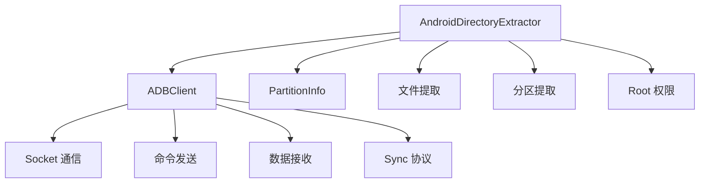
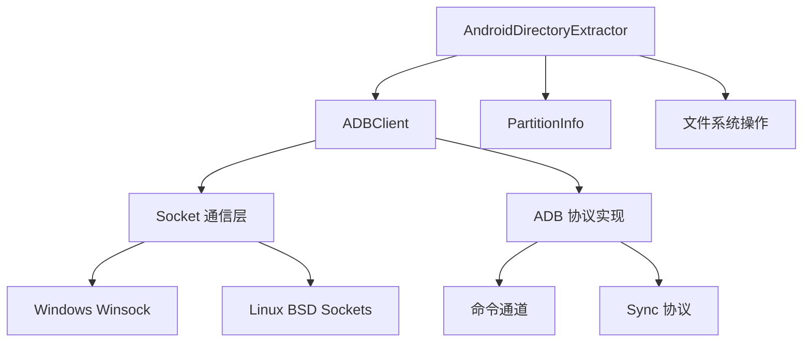
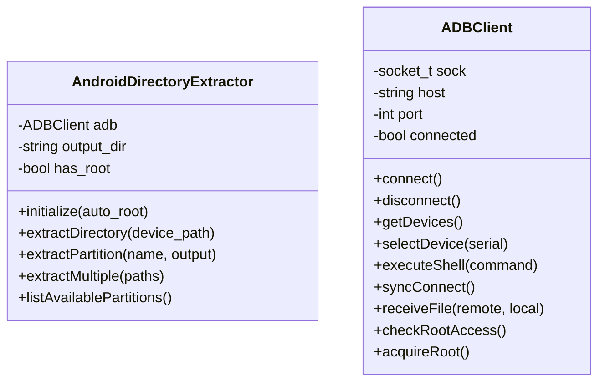
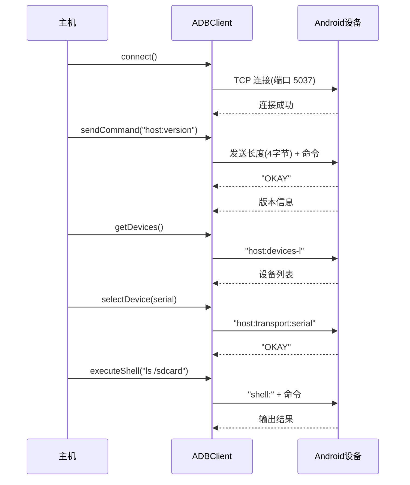
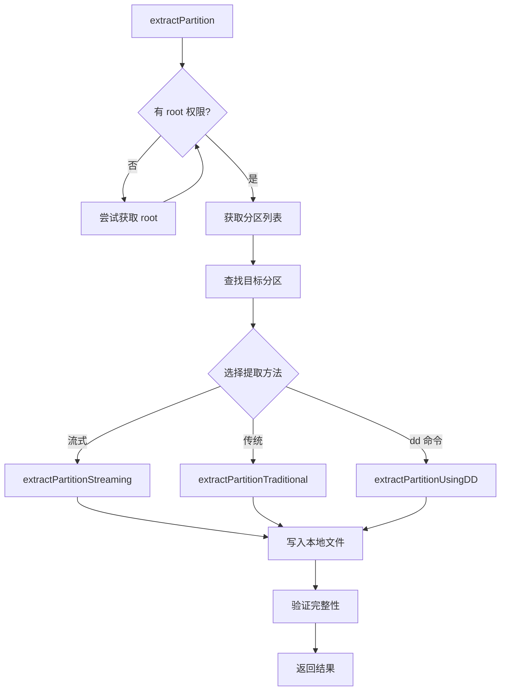

# Android ADB Extractor 模块文档

## 1. 模块背景

### 业务背景

在数字取证中，Android 设备是最常见的移动设备平台。当获得一部 Android 设备（无论是物理设备还是镜像文件）后，取证人员需要提取以下数据：

1. **文件系统数据**: 应用数据、用户文件、系统配置
2. **分区镜像**: 直接提取分区用于深度分析
3. **数据库**: SMS、通话记录、应用数据
4. **日志文件**: 系统日志、应用崩溃日志

**传统方法的局限**：
- **物理提取**: 需要拆机，有损坏设备风险
- **镜像提取**: 需要设备进入特定模式（如下载模式）
- **ADB 提取**: 通常只能获取用户可访问的数据

**Android ADB Extractor 的优势**：
- 通过 ADB 协议与设备通信
- 支持直接提取分区（如果已 root）
- 自动处理权限问题
- 流式传输大文件
- 适用于已获取 root 权限的设备

### 技术背景

**ADB（Android Debug Bridge）协议**：

```
ADB 客户端 ←→ ADB 服务器（设备）←→ adbd 守护进程
     ↓
  TCP 连接（通常端口 5037）
```

**协议特点**：
1. **基于 TCP Socket**: 使用 TCP 协议通信
2. **二进制协议**: 4字节长度前缀 + 命令字符串
3. **同步协议**: 文件传输的专用协议
4. **Shell 交互**: 执行 shell 命令的接口

**关键组件**：



---

## 2. 模块功能

### 核心功能

| 功能 | 方法 | 描述 |
|------|------|------|
| **设备连接** | `connect()`, `disconnect()` | 连接/断开 ADB 服务器 |
| **设备枚举** | `getDevices()` | 获取已连接设备列表 |
| **设备选择** | `selectDevice()` | 选择目标设备 |
| **Shell 执行** | `executeShell()`, `executeShellAsRoot()` | 执行命令 |
| **文件提取** | `receiveFile()`, `extractDirectory()` | 提取文件/目录 |
| **分区提取** | `extractPartition()` | 提取设备分区 |
| **Root 权限** | `acquireRoot()`, `checkRootAccess()` | 获取 root 权限 |
| **同步连接** | `syncConnect()` | 建立 sync 连接 |
| **目录列表** | `listDirectory()` | 列出目录内容 |

### 功能详解

#### 1. ADB 连接管理

```cpp
ADBClient client("127.0.0.1", 5037);
if (client.connect()) {
    LOG_INFO("Connected to ADB server");

    // 获取设备列表
    auto devices = client.getDevices();
    for (const auto& serial : devices) {
        LOG_INFO("Found device: " + serial);
    }

    // 选择设备
    if (!devices.empty()) {
        client.selectDevice(devices[0]);
        LOG_INFO("Selected device: " + devices[0]);
    }
}
```

#### 2. Root 权限管理

```cpp
AndroidDirectoryExtractor extractor;

// 初始化（自动尝试获取 root）
if (extractor.initialize(true)) {
    LOG_INFO("Root access acquired");

    if (extractor.hasRootAccess()) {
        // 使用 root 权限提取系统数据
        extractor.extractPartition("data", "data_partition.img");
    }
}
```

#### 3. 分区提取

```cpp
// 列出可用分区
extractor.listAvailablePartitions();

// 提取单个分区
extractor.extractPartition("userdata", "userdata.img");

// 批量提取分区
std::vector<std::string> partitions = {"boot", "data", "system"};
extractor.extractMultiplePartitions(partitions);
```

#### 4. 文件系统提取

```cpp
// 提取整个目录
extractor.extractDirectory("/sdcard/Documents");

// 批量提取多个路径
std::vector<std::string> paths = {
    "/sdcard/DCIM",
    "/data/data/com.android.providers.contacts/databases",
    "/data/system"
};
extractor.extractMultiple(paths);
```

### 边界与限制

| 限制 | 说明 | 缓解措施 |
|------|------|----------|
| **Root 依赖** | 分区提取需要 root 权限 | 尝试多种 root 获取方法 |
| **设备兼容性** | 不同厂商实现可能不同 | 适配多种设备类型 |
| **网络稳定性** | ADB 连接可能中断 | 实现重试机制 |
| **存储空间** | 大分区需要大量存储 | 检查可用空间 |
| **提取速度** | 串行传输较慢 | 使用流式传输优化 |

---

## 3. 模块使用的库

### 依赖库清单

| 库名/平台 | 用途 |
|---------|------|
| **标准库 `<sys/socket.h>`** (Linux) | Socket 编程 |
| **标准库 `<winsock2.h>`** (Windows) | Windows Socket |
| **标准库 `<sys/stat.h>`** | 文件系统操作 |
| **标准库 `<unistd.h>`** (Linux) | POSIX API |

### 依赖关系图



### 核心代码依赖

**无外部依赖**，完全使用平台标准库实现。

---

## 4. 模块实现方式

### 架构设计



### 核心类说明

#### 1. ADBClient 类

**职责**: 管理 ADB 连接和协议通信

```cpp
class ADBClient {
public:
    ADBClient(const std::string& h = "127.0.0.1", int p = 5037);
    ~ADBClient();

    // 连接管理
    bool connect();
    bool disconnect();

    // 设备管理
    std::vector<std::string> getDevices();
    bool selectDevice(const std::string& serial);

    // 命令执行
    std::string executeShell(const std::string& command);
    std::string executeShellAsRoot(const std::string& command);

    // 文件操作（sync 模式）
    bool syncConnect();
    bool receiveFile(const std::string& remote_path, const std::string& local_path);
    std::vector<SyncEntry> listDirectory(const std::string& path);
    bool statFile(const std::string& remote_path, uint32_t& mode, uint32_t& size, uint32_t& time);

    // Root 权限
    bool checkRootAccess();
    bool acquireRoot();

private:
    socket_t sock;
    std::string host;
    int port;
    bool connected;
    std::string current_serial;
    bool in_sync_mode;
};
```

#### 2. AndroidDirectoryExtractor 类

**职责**: 高级提取逻辑和分区管理

```cpp
class AndroidDirectoryExtractor {
public:
    AndroidDirectoryExtractor(const std::string& output = "./extracted_data");

    // 初始化
    bool initialize(bool auto_root = true);

    // 文件提取
    bool extractDirectory(const std::string& device_path);
    void extractMultiple(const std::vector<std::string>& paths);

    // 分区提取
    bool extractPartition(const std::string& partition_name, const std::string& output_filename = "");
    bool extractMultiplePartitions(const std::vector<std::string>& partition_names);
    void listAvailablePartitions();
    std::vector<PartitionInfo> getPartitionList();

    // 状态查询
    bool hasRootAccess() const { return has_root; }

private:
    ADBClient adb;
    std::string output_dir;
    bool has_root;
    bool use_root_for_extraction;

    // 辅助方法
    void createDirectory(const std::string& path);
    bool extractFileRecursive(const std::string& remote_path, const std::string& local_base);
    bool testPartitionReadAccess(const std::string& device_path);
};
```

### 关键流程

#### ADB 协议通信流程



#### 分区提取流程



### 数据结构

#### PartitionInfo 结构

```cpp
struct PartitionInfo {
    std::string name;           // 分区名称（"vbmeta", "boot", "data"等）
    std::string device_path;     // 设备路径（"/dev/block/by-name/vbmeta"）
    std::string block_device;    // 块设备路径（"/dev/block/sde12"）
    uint64_t size;              // 分区大小（字节）
    std::string type;           // 分区类型（"emmc", "ufs"）
    bool is_readable;           // 是否可读
    bool requires_root;         // 是否需要 root 权限
};
```

#### SyncEntry 结构

```cpp
struct SyncEntry {
    std::string name;   // 文件/目录名
    uint32_t mode;      // 权限模式（st_mode）
    uint32_t size;      // 文件大小
    uint32_t time;      // 修改时间（mtime）
};
```

---

## 5. API 调用

### C++ API

#### 基础使用

```cpp
#include "integration/AndroidAdbExtractor/adbExtractor.h"

using namespace forensics;

int main() {
    // 1. 创建提取器
    AndroidDirectoryExtractor extractor("/path/to/output");

    // 2. 初始化并尝试获取 root
    if (!extractor.initialize(true)) {
        LOG_ERROR("Failed to initialize ADB extractor");
        return 1;
    }

    // 3. 检查 root 权限
    if (extractor.hasRootAccess()) {
        LOG_INFO("Root access available - can extract system partitions");
    } else {
        LOG_WARNING("No root access - limited to user-accessible files");
    }

    // 4. 列出可用分区
    extractor.listAvailablePartitions();

    // 5. 提取用户数据分区
    if (extractor.extractPartition("data", "data_partition.img")) {
        LOG_INFO("Partition extracted successfully");
    }

    // 6. 提取特定目录
    extractor.extractDirectory("/sdcard/DCIM");

    return 0;
}
```

#### 批量文件提取

```cpp
void batchExtract(const std::vector<std::string>& paths) {
    AndroidDirectoryExtractor extractor("./extracted");

    if (extractor.initialize()) {
        for (const auto& path : paths) {
            LOG_INFO("Extracting: " + path);

            if (extractor.extractDirectory(path)) {
                LOG_INFO("Successfully extracted: " + path);
            } else {
                LOG_ERROR("Failed to extract: " + path);
            }
        }
    }
}

// 使用
int main() {
    std::vector<std::string> paths = {
        "/sdcard/Documents",
        "/sdcard/DCIM/Camera",
        "/sdcard/Download"
    };

    batchExtract(paths);
    return 0;
}
```

#### 分区提取

```cpp
void extractAllPartitions() {
    AndroidDirectoryExtractor extractor("./partitions");

    if (extractor.initialize()) {
        // 获取所有分区信息
        auto partitions = extractor.getPartitionList();

        LOG_INFO("Found " + std::to_string(partitions.size()) + " partitions");

        // 提取所有可读分区
        for (const auto& partition : partitions) {
            if (partition.is_readable) {
                LOG_INFO("Extracting partition: " + partition.name +
                        " (size: " + formatSize(partition.size) + ")");

                std::string output_name = partition.name + ".img";
                extractor.extractPartition(partition.name, output_name);
            } else {
                LOG_WARNING("Partition not readable: " + partition.name);
            }
        }
    }
}
```

---

## 6. 二次开发

### 扩展点

#### 1. 添加进度回调

**场景**: 大文件提取时报告进度

```cpp
class ProgressCallback {
public:
    virtual void onProgress(uint64_t bytes_transferred, uint64_t total_bytes) {
        double progress = (double)bytes_transferred / total_bytes * 100.0;
        std::cout << "\rProgress: " << std::fixed << std::setprecision(1)
                  << progress << "%" << std::flush;
    }
};

// 修改 ADBClient 添加回调
class ADBClientWithProgress : public ADBClient {
public:
    void setProgressCallback(ProgressCallback* callback) {
        progress_callback_ = callback;
    }

    bool receiveFile(const std::string& remote_path, const std::string& local_path,
                     uint32_t total_file_size = 0) override {
        // 在提取过程中调用回调
        if (progress_callback_ && total_file_size > 0) {
            progress_callback_->onProgress(bytes_transferred, total_file_size);
        }
        // ... 原有逻辑
    }

private:
    ProgressCallback* progress_callback_ = nullptr;
};
```

#### 2. 添加哈希校验

**场景**: 验证提取数据的完整性

```cpp
class IntegrityVerifier {
public:
    bool calculateFileHash(const std::string& file_path, std::string& hash) {
        // 计算 MD5 或 SHA256 哈希
        // ...
        return true;
    }

    bool verifyExtraction(const std::string& remote_path,
                          const std::string& local_path) {
        // 1. 在设备上计算哈希
        std::string remote_hash;
        adb.executeShell("md5sum " + remote_path, remote_hash);

        // 2. 在本地计算哈希
        std::string local_hash;
        calculateFileHash(local_path, local_hash);

        // 3. 比较
        return remote_hash == local_hash;
    }
};
```

#### 3. 添加过滤提取

**场景**: 只提取特定类型的文件

```cpp
class FilteredExtractor : public AndroidDirectoryExtractor {
public:
    using FilterFunc = std::function<bool(const std::string&)>;

    void setFilter(FilterFunc filter) {
        file_filter_ = filter;
    }

    bool extractDirectory(const std::string& device_path) override {
        // 列出目录内容
        auto entries = adb.listDirectory(device_path);

        for (const auto& entry : entries) {
            std::string full_path = device_path + "/" + entry.name;

            // 应用过滤器
            if (!file_filter_ || file_filter_(full_path)) {
                // 如果是目录，递归提取
                if (S_ISDIR(entry.mode)) {
                    extractDirectory(full_path);
                } else {
                    // 提取文件
                    adb.receiveFile(full_path, getLocalPath(full_path));
                }
            }
        }
        return true;
    }

private:
    FilterFunc file_filter_;
};

// 使用
int main() {
    FilteredExtractor extractor("./output");

    // 只提取图片文件
    extractor.setFilter([](const std::string& path) {
        std::string ext = path.substr(path.find_last_of('.'));
        return ext == ".jpg" || ext == ".png" || ext == ".mp4";
    });

    extractor.extractDirectory("/sdcard/DCIM");
    return 0;
}
```

### 添加新功能的步骤

#### 步骤 1: 扩展 ADB 协议支持

```cpp
class ADBClient {
public:
    // 新增：日志支持
    bool logcat(const std::string& tag, const std::string& level = "*:I");

    // 新增：端口转发
    bool forwardPort(int local_port, int remote_port);

    // 新增：安装应用
    bool installApp(const std::string& apk_path);
};

// 实现
bool ADBClient::logcat(const std::string& tag, const std::string& level) {
    std::string cmd = "logcat -v " + level;
    if (!tag.empty()) {
        cmd += " -s " + tag;
    }
    cmd += " *:I";  // 仅包含 Info 级别

    return sendADBCommand(cmd);
}
```

#### 步骤 2: 添加自动化脚本支持

```cpp
class ForensicsScript {
public:
    void runFullExtraction() {
        // 1. 初始化
        extractor_.initialize();

        // 2. 获取设备信息
        std::string device_info = getDeviceInfo();
        saveToFile("device_info.txt", device_info);

        // 3. 提取关键分区
        extractKeyPartitions();

        // 4. 提取应用数据
        extractAppData();

        // 5. 提取日志
        extractLogs();

        // 6. 生成报告
        generateReport();
    }

private:
    AndroidDirectoryExtractor extractor_;

    void extractKeyPartitions() {
        std::vector<std::string> partitions = {"boot", "data", "system"};
        extractor_.extractMultiplePartitions(partitions);
    }

    void extractAppData() {
        // 提取常见应用数据
        std::vector<std::string> app_data = {
            "/data/data/com.android.providers.contacts/",
            "/data/data/com.android.providers.telephony/"
        };
        extractor_.extractMultiple(app_data);
    }
};
```

### 代码示例

#### 示例 1: 自动检测并提取

```cpp
class AutoExtractor {
public:
    void detectAndExtract() {
        if (!extractor_.initialize()) {
            LOG_ERROR("Cannot connect to device");
            return;
        }

        // 自动检测最佳提取策略
        if (extractor_.hasRootAccess()) {
            LOG_INFO("Root access available - using partition extraction");
            extractPartitions();
        } else {
            LOG_INFO("No root access - using directory extraction");
            extractDirectories();
        }
    }

private:
    AndroidDirectoryExtractor extractor_{"./output"};

    void extractPartitions() {
        auto partitions = extractor_.getPartitionList();
        for (const auto& p : partitions) {
            if (p.is_readable && p.size < 10ULL * 1024 * 1024 * 1024) {  // < 10GB
                extractor_.extractPartition(p.name);
            }
        }
    }

    void extractDirectories() {
        std::vector<std::string> dirs = {
            "/sdcard/Documents",
            "/sdcard/DCIM",
            "/sdcard/Download"
        };
        extractor_.extractMultiple(dirs);
    }
};
```

---

## 7. 其他

### 测试

#### 编译测试程序

```bash
cd build
cmake .. -DCMAKE_BUILD_TYPE=Release
cmake --build . --target adbTest

# 运行测试
./adbTest
```

#### 测试连接

```cpp
// adbTest.cpp
#include "integration/AndroidAdbExtractor/adbExtractor.h"

int main() {
    AndroidDirectoryExtractor extractor("./test_output");

    // 测试连接
    LOG_INFO("Testing ADB connection...");
    if (!extractor.initialize(false)) {  // 不自动 root
        LOG_ERROR("Failed to connect");
        return 1;
    }

    LOG_INFO("Connected successfully");

    // 测试目录列表
    extractor.listAvailablePartitions();

    // 测试文件提取
    std::string test_file = "/sdcard/test.txt";
    extractor.extractDirectory("/sdcard/Documents");

    LOG_INFO("Test completed");
    return 0;
}
```

### 配置

#### ADB 路径配置

```bash
# 确保 ADB 在 PATH 中
export PATH=$PATH:/path/to/android-sdk/platform-tools

# 验证 ADB 可用
adb version
adb devices
```

#### 设备准备

```bash
# 1. 启用 USB 调试模式
# 设置 → 开发者选项 → USB 调试

# 2. 授权计算机
# 连接 USB 时会弹出授权对话框

# 3. 验证连接
adb devices
# 应该看到设备序列号
```

#### Root 权限准备

```bash
# 1. 解锁 Bootloader（因设备而异）
# 2. 安装自定义 Recovery（如 TWRP）
# 3. 刷入 Magisk 获取 root
# 4. 验证 root
adb shell
su
```

### 故障排查

#### 常见问题

| 问题 | 可能原因 | 解决方法 |
|------|----------|----------|
| **连接失败** | ADB 服务未启动 | 启动 ADB 服务器 `adb start-server` |
| **设备未发现** | USB 调试未启用 | 在设备上启用 USB 调试模式 |
| **权限拒绝** | 未授权计算机 | 在设备上授权 ADB 调试 |
| **分区提取失败** | 无 root 权限 | 获取 root 权限后再试 |
| **文件传输慢** | 网络带宽限制 | 使用有线连接，减少并发 |
| **编码问题** | 文件名包含非ASCII | 使用 UTF-8 编码处理 |

#### 调试技巧

**1. 手动测试 ADB 连接**

```bash
# 测试 ADB 服务器
adb start-server

# 列出设备
adb devices -l

# 执行命令
adb shell ls /sdcard

# 提取文件
adb pull /sdcard/file.txt ./
```

**2. 检查 root 权限**

```bash
adb shell
su
id
# 应该显示 uid=0(root)
```

**3. 查看分区信息**

```bash
adb shell
cat /proc/partitions
ls -l /dev/block/by-name/
```

**4. 调试日志**

```cpp
// 启用详细日志
Logger::instance().setLevel(LogLevel::DEBUG);

// 在关键点添加日志
LOG_DEBUG("Attempting to connect to ADB at " + host + ":" + std::to_string(port));
LOG_DEBUG("Sending command: " + command);
LOG_DEBUG("Received " + std::to_string(response.length()) + " bytes");
```

### 相关模块

- **AndroidAnalyzer** (`docs/modules/cpp/analyzers/AndroidAnalyzer.md`) - Android 数据库分析
- **DatabaseManager** (`docs/modules/cpp/core/DatabaseManager.md`) - 数据库存储

### 参考资源

- **ADB 协议文档**: https://android.googlesource.com/
- **Android Debug Bridge**: https://developer.android.com/studio/command-line/adb
- **Magisk Root**: https://github.com/topjohnwu/Magisk

### 变更历史

| 版本 | 日期 | 变更说明 | 作者 |
|------|------|----------|------|
| 1.0.0 | 2026-03-16 | 初始版本 | Claude Code |

---

**文档完成日期**: 2026-03-16
**文档版本**: 1.0.0
**维护者**: ymj68520
