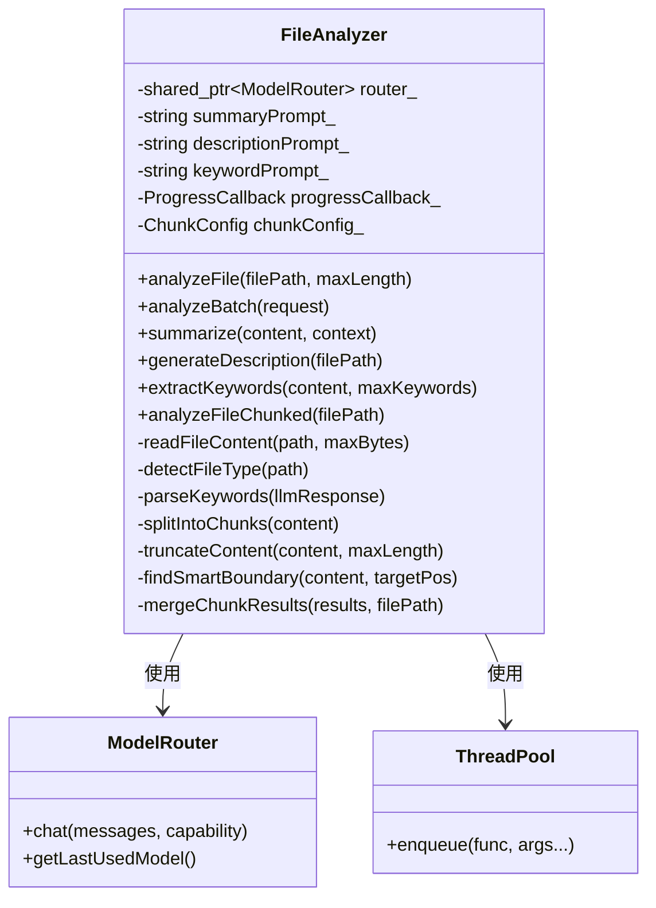
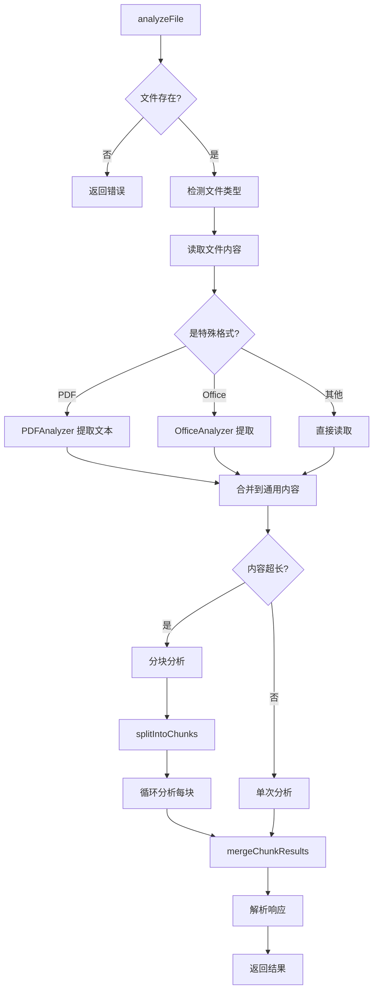

# FileAnalyzer 模块文档

## 1. 模块背景

### 业务背景

在数字取证分析中，需要自动分析大量文件以理解其内容和作用：

**核心需求**：
- **自动摘要生成**：为每个文件生成简洁的摘要
- **关键词提取**：识别文件中的重要术语和概念
- **描述生成**：生成自然的文件描述
- **批量处理**：高效处理成千上万个文件
- **大文件支持**：处理超出上下文窗口的文件

**解决挑战**：
- **上下文窗口限制**：LLM 有最大 token 限制
- **内容截断**：如何在截断时保持语义完整
- **分析质量**：确保摘要和关键词的质量
- **并发处理**：利用多线程加速批量分析
- **成本控制**：减少 API 调用次数和 token 使用

### 技术背景

**LLM 集成模式**：
- **直接调用**：直接使用 LLMClient API
- **路由器集成**：通过 ModelRouter 选择最优模型
- **能力匹配**：文本/视觉模型的自动选择

**文件处理策略**：
```cpp
enum class ModelCapability {
    TextGeneration,   // 文本生成
    CodeGeneration,   // 代码生成
    Summarization,    // 摘要生成
    Analysis,         // 分析任务
    Translation,      // 翻译
    Vision,           // 图像理解
    ImageAnalysis     // 图像分析
};
```

## 2. 模块功能

### 核心功能

#### 1. 单文件分析

**基础分析**：
```cpp
FileAnalyzer analyzer(router);

AnalysisResult result = analyzer.analyzeFile(
    "/evidence/suspect.doc",
    10000  // 最大内容长度
);

if (result.success) {
    std::cout << "Summary: " << result.summary << std::endl;
    std::cout << "Description: " << result.description << std::endl;
    std::cout << "Keywords: ";
    for (const auto& kw : result.keywords) {
        std::cout << kw << ", ";
    }
    std::cout << std::endl;
    std::cout << "Model: " << result.modelUsed << std::endl;
    std::cout << "Time: " << result.analysisTimeMs << " ms" << std::endl;
}
```

**AnalysisResult 结构**：
```cpp
struct AnalysisResult {
    std::string filePath;           // 文件路径
    std::string summary;            // 摘要（2-3 句话）
    std::string description;        // 描述（3-5 句话）
    std::vector<std::string> keywords; // 关键词列表
    std::string fileType;           // 文件类型
    int64_t fileSize = 0;           // 文件大小
    bool success = false;           // 分析是否成功
    std::string errorMessage;       // 错误信息

    // 元数据
    std::string modelUsed;         // 使用的模型
    int tokensUsed = 0;             // 消耗的 token
    double analysisTimeMs = 0;      // 分析耗时
};
```

#### 2. 批量文件分析

**并发批量处理**：
```cpp
FileAnalyzer analyzer(router);

// 配置批量请求
BatchAnalysisRequest request;
request.filePaths = {
    "/evidence/file1.txt",
    "/evidence/file2.pdf",
    "/evidence/file3.docx",
    // ... 100+ 个文件
};
request.maxContentLength = 5000;  // 每个文件最多 5000 字符

// 设置进度回调
analyzer.setProgressCallback([](size_t current, size_t total, const std::string& file) {
    double progress = 100.0 * current / total;
    std::cout << "Progress: " << progress << "% - " << file << std::endl;
});

// 执行批量分析
std::vector<AnalysisResult> results = analyzer.analyzeBatch(request);

// 统计结果
int successCount = 0;
int totalTokens = 0;
for (const auto& result : results) {
    if (result.success) successCount++;
    totalTokens += result.tokensUsed;
}

std::cout << "Analyzed " << results.size() << " files" << std::endl;
std::cout << "Success: " << successCount << std::endl;
std::cout << "Total tokens: " << totalTokens << std::endl;
```

**ThreadPool 集成**：
```cpp
// 从配置获取线程池大小
int poolSize = ConfigManager::instance().getThreadPoolSize();  // 默认 4

ThreadPool pool(static_cast<size_t>(poolSize));
std::vector<std::future<AnalysisResult>> futures;

for (const auto& path : request.filePaths) {
    futures.push_back(pool.enqueue([&analyzer, &request, path]() {
        return analyzer.analyzeFile(path, request.maxContentLength);
    }));
}

// 收集结果
for (size_t i = 0; i < futures.size(); ++i) {
    results[i] = futures[i].get();
    // 触发进度回调
    if (progressCallback_) {
        progressCallback_(i + 1, futures.size(), request.filePaths[i]);
    }
}
```

#### 3. 上下文窗口管理

**智能内容截断**：
```cpp
// FileAnalyzer 自动管理上下文窗口
size_t maxLength = analyzer.calculateMaxContentLength();

std::string content = readFileContent(filePath, 0);  // 读取全部

if (content.size() > maxLength) {
    // 智能截断：
    // 1. 在段落边界截断
    // 2. 在句子边界截断
    // 3. 在单词边界截断
    // 4. 添加截断指示器
    content = analyzer.truncateContent(content, maxLength);
}
```

**截断策略**：
```
原始内容 (5000 字符):
[开始... 3500 字符 ... 截断点 ... 1500 字符 ...结束]

智能截断后 (4000 字符):
[开始... 3500 字符 ... 截断点]
[... Content truncated due to context window limit ...]
[1500 字符 ...结束]
```

**findSmartBoundary 算法**：
```cpp
size_t FileAnalyzer::findSmartBoundary(const std::string& content, size_t targetPos) const {
    if (targetPos >= content.size()) {
        return content.size();
    }

    // 搜索窗口：向前查找 200 字符
    size_t searchStart = (targetPos > 200) ? targetPos - 200 : 0;

    // 优先级 1: 段落边界（双换行）
    size_t lastParagraph = std::string::npos;
    for (size_t i = searchStart; i < targetPos - 1 && i < content.size() - 1; ++i) {
        if (content[i] == '\n' && content[i + 1] == '\n') {
            lastParagraph = i + 2;
        }
    }
    if (lastParagraph != std::string::npos && lastParagraph > searchStart) {
        return lastParagraph;
    }

    // 优先级 2: 句子结束（. ! ?）
    size_t lastSentence = std::string::npos;
    for (size_t i = searchStart; i < targetPos && i < content.size(); ++i) {
        char c = content[i];
        if ((c == '.' || c == '!' || c == '?') &&
            (i + 1 >= content.size() || content[i + 1] == ' ' || content[i + 1] == '\n')) {
            lastSentence = i + 1;
        }
    }
    if (lastSentence != std::string::npos && lastSentence > searchStart) {
        return lastSentence;
    }

    // 优先级 3: 换行符
    // 优先级 4: 空格
    // 优先级 5: 硬截断
    return targetPos;
}
```

#### 4. 分块分析（大文件）

**分块配置**：
```cpp
ChunkConfig config;
config.chunkSize = 2000;      // 每块 2000 字符
config.overlapSize = 200;     // 重叠 200 字符
config.maxChunks = 5;         // 最多 5 块
config.smartBoundary = true;  // 智能边界

analyzer.setChunkConfig(config);
```

**分块分析流程**：
```cpp
// 对大文件使用分块分析
AnalysisResult result = analyzer.analyzeFileChunked("/large/file.txt");

// 内部流程：
// 1. 读取全部内容
// 2. 计算最大内容长度
// 3. 如果超出限制，分块处理：
//    - 按 chunkSize 分割
//    - 每块之间有 overlap 重叠
//    - 使用 smartBoundary 在语义边界分割
// 4. 分别分析每块
// 5. 合并结果：
//    - 合并摘要
//    - 合并描述
//    - 去重关键词
//    - 累加 token 统计
```

**合并结果**：
```cpp
AnalysisResult FileAnalyzer::mergeChunkResults(
    const std::vector<AnalysisResult>& results,
    const std::string& filePath) const {

    AnalysisResult merged;
    merged.filePath = filePath;
    merged.success = false;

    // 合并摘要（空格分隔）
    std::ostringstream summaryStream;
    for (size_t i = 0; i < results.size(); ++i) {
        if (!results[i].success) continue;
        if (summaryStream.tellp() > 0) summaryStream << " ";
        summaryStream << results[i].summary;
    }
    merged.summary = summaryStream.str();

    // 合并关键词（去重）
    std::set<std::string> allKeywords;
    int totalTokens = 0;
    for (const auto& r : results) {
        if (!r.success) continue;
        totalTokens += r.tokensUsed;
        for (const auto& kw : r.keywords) {
            allKeywords.insert(kw);
        }
    }
    merged.keywords = std::vector<std::string>(allKeywords.begin(), allKeywords.end());
    merged.tokensUsed = totalTokens;
    merged.success = true;

    return merged;
}
```

#### 5. 文件类型检测

**扩展名映射**：
```cpp
// FileAnalyzer 支持 100+ 种文件类型
std::string FileAnalyzer::detectFileType(const std::string& path) {
    std::string ext = fs::path(path).extension().string();

    static const std::map<std::string, std::string> typeMap = {
        // 文档
        {".pdf", "PDF"},
        {".doc", "Word Document"},
        {".docx", "Word Document"},
        {".txt", "Text"},
        {".md", "Markdown"},

        // 代码
        {".cpp", "C++"},
        {".py", "Python"},
        {".js", "JavaScript"},
        {".java", "Java"},

        // 图像
        {".jpg", "JPEG Image"},
        {".png", "PNG Image"},

        // 压缩
        {".zip", "ZIP Archive"},
        {".tar", "TAR Archive"},
        {".7z", "7-Zip Archive"},

        // 数据库
        {".db", "Database"},
        {".sqlite", "SQLite Database"},
        {".mdb", "Access Database"},
    };

    auto it = typeMap.find(ext);
    if (it != typeMap.end()) {
        return it->second;
    }

    // 检测二进制文件
    std::ifstream file(path, std::ios::binary);
    if (file) {
        char buffer[512];
        file.read(buffer, sizeof(buffer));

        // 检查 null 字节
        for (size_t i = 0; i < file.gcount(); ++i) {
            if (buffer[i] == '\0') {
                return "Binary";
            }
        }
    }

    return ext.empty() ? "Unknown" : ext.substr(1) + " File";
}
```

### 边界与限制

**功能边界**：
- ✅ 支持文本、PDF、Office 文档
- ✅ 支持大文件分块分析
- ✅ 支持批量并发处理
- ❌ 不支持视频/音频直接分析（需提取内容）
- ❌ 不支持加密文件分析

**已知限制**：
| 限制 | 影响 | 缓解方法 |
|------|------|----------|
| 上下文窗口 | 超大文件被截断 | 使用分块分析 |
| UTF-8 验证 | 非UTF-8文件显示乱码 | 自动清理无效字节 |
| 分析速度 | 依赖 LLM 响应时间 | 并发处理 |
| Token 消耗 | 大文件消耗多 token | 智能截断 |

**性能指标**：
- **单文件分析**：~2-10 秒（取决于内容和模型）
- **批量分析**：~4 个文件/秒（4 线程并发）
- **Token 使用**：~1000-3000 tokens/文件

## 3. 模块使用的库

### 依赖库清单

```cpp
// 项目内部
#include "LLMDataTypes.h"      // 数据结构
#include "ModelRouter.h"       // 模型路由

#include "core/Logger/Logger.h"           // 日志
#include "core/ThreadPool/ThreadPool.h" // 线程池
#include "analyzers/PDFAnalyzer/PDFAnalyzer.h"   // PDF
#include "analyzers/OfficeAnalyzer/OfficeAnalyzer.h" // Office

// 标准库
#include <filesystem>
#include <fstream>
#include <sstream>
#include <chrono>
#include <algorithm>
#include <regex>
#include <set>
```

### 架构图



### 分析流程图



## 4. 模块实现方式

### 核心类

```cpp
class FileAnalyzer {
public:
    explicit FileAnalyzer(std::shared_ptr<ModelRouter> router);
    ~FileAnalyzer();

    // 分析方法
    AnalysisResult analyzeFile(const std::string& filePath,
                              size_t maxContentLength = 10000);
    std::vector<AnalysisResult> analyzeBatch(const BatchAnalysisRequest& request);
    AnalysisResult analyzeFileChunked(const std::string& filePath);

    // 辅助方法
    std::string summarize(const std::string& content,
                         const std::string& context = "");
    std::string generateDescription(const std::string& filePath);
    std::vector<std::string> extractKeywords(const std::string& content,
                                             size_t maxKeywords = 10);

    // 配置
    void setSummaryPrompt(const std::string& prompt);
    void setDescriptionPrompt(const std::string& prompt);
    void setKeywordPrompt(const std::string& prompt);
    void setChunkConfig(const ChunkConfig& config);
    void setProgressCallback(ProgressCallback callback);

    // 上下文管理
    static size_t estimateTokens(const std::string& content, double charsPerToken = 4.0);
    size_t calculateMaxContentLength() const;
    std::string truncateContent(const std::string& content, size_t maxLength) const;

private:
    std::shared_ptr<ModelRouter> router_;
    std::string summaryPrompt_;
    std::string descriptionPrompt_;
    std::string keywordPrompt_;
    ProgressCallback progressCallback_;
    ChunkConfig chunkConfig_;

    // 静态正则表达式
    static const std::regex SUMMARY_REGEX;
    static const std::regex DESCRIPTION_REGEX;
    static const std::regex KEYWORD_REGEX;

    // 辅助方法
    std::string readFileContent(const std::string& path, size_t maxBytes);
    std::string detectFileType(const std::string& path);
    std::vector<std::string> parseKeywords(const std::string& llmResponse);
    void initDefaultPrompts();
    std::vector<std::string> splitIntoChunks(const std::string& content) const;
    size_t findSmartBoundary(const std::string& content, size_t targetPos) const;
    AnalysisResult mergeChunkResults(const std::vector<AnalysisResult>& results,
                                   const std::string& filePath) const;
};
```

### 响应解析

**预编译正则**（性能优化）：
```cpp
// 静态成员初始化
const std::regex FileAnalyzer::SUMMARY_REGEX(
    "SUMMARY:\\s*(.+?)(?=DESCRIPTION:|$)", std::regex::icase
);
const std::regex FileAnalyzer::DESCRIPTION_REGEX(
    "DESCRIPTION:\\s*(.+?)(?=KEYWORDS:|$)", std::regex::icase
);
const std::regex FileAnalyzer::KEYWORD_REGEX(
    "KEYWORDS:\\s*(.+)$", std::regex::icase
);
```

**解析逻辑**：
```cpp
// 解析摘要
std::smatch summaryMatch;
if (std::regex_search(responseText, summaryMatch, SUMMARY_REGEX)) {
    result.summary = summaryMatch[1].str();
    result.summary.erase(0, result.summary.find_first_not_of(" \t\n\r"));
    result.summary.erase(result.summary.find_last_not_of(" \t\n\r") + 1);
}

// 解析描述
std::smatch descMatch;
if (std::regex_search(responseText, descMatch, DESCRIPTION_REGEX)) {
    result.description = descMatch[1].str();
    // Trim whitespace...
}

// 解析关键词
std::smatch keywordMatch;
if (std::regex_search(responseText, keywordMatch, KEYWORD_REGEX)) {
    result.keywords = parseKeywords(keywordMatch[1].str());
}

// 如果解析失败，使用整个响应
if (result.summary.empty() && result.description.empty()) {
    result.summary = responseText;
    result.description = responseText;
}
```

**关键词解析**：
```cpp
std::vector<std::string> FileAnalyzer::parseKeywords(const std::string& llmResponse) {
    std::vector<std::string> keywords;
    std::istringstream iss(llmResponse);
    std::string keyword;

    while (std::getline(iss, keyword, ',')) {
        // Trim whitespace
        keyword.erase(0, keyword.find_first_not_of(" \t\n\r"));
        keyword.erase(keyword.find_last_not_of(" \t\n\r") + 1);

        // Remove common prefixes
        if (!keyword.empty() && (keyword[0] == '-' || keyword[0] == '*')) {
            keyword = keyword.substr(1);
            keyword.erase(0, keyword.find_first_not_of(" "));
        }

        if (!keyword.empty() && keyword.length() > 1) {
            keywords.push_back(keyword);
        }
    }

    return keywords;
}
```

### 文件读取策略

**类型感知读取**：
```cpp
std::string ext = fs::path(filePath).extension().string();
std::transform(ext.begin(), ext.end(), ext.begin(), ::tolower);

if (ext == ".pdf") {
    // 使用 PDFAnalyzer
    LOG_DEBUG("Using PDFAnalyzer");
    content = forensics::analyzers::PDFAnalyzer::extractText(filePath);
} else if (ext == ".docx" || ext == ".doc") {
    // 使用 OfficeAnalyzer
    LOG_DEBUG("Using OfficeAnalyzer");
    OfficeAnalyzer officeAnalyzer;
    content = officeAnalyzer.analyze(filePath);
} else if (result.fileType == "Archive" || result.fileType == "Binary") {
    // 跳过二进制内容
    LOG_DEBUG("Binary/Archive detected. Skipping content read.");
    content = "[Binary/Archive File Content Omitted. Analysis based on metadata only.]";
} else {
    // 直接读取
    LOG_DEBUG("Using Raw Read");
    content = readFileContent(filePath, maxContentLength);
}
```

## 5. API 调用

### C++ API

#### 与 HTTPServer 集成

```cpp
// 在 HTTP 路由中使用 FileAnalyzer
class LLMAnalysisService {
public:
    LLMAnalysisService() {
        // 创建路由器并注册模型
        router_ = std::make_shared<ModelRouter>();

        // 配置模型...

        analyzer_ = std::make_unique<FileAnalyzer>(router_);
    }

    AnalysisResult analyzeTaskFile(const std::string& taskId,
                                   const std::string& filePath) {
        LOG_INFO("Analyzing file: " + filePath);

        // 分析文件
        auto result = analyzer_->analyzeFile(filePath, 10000);

        if (result.success) {
            // 存储到数据库
            persistToDatabase(taskId, filePath, result);
            LOG_INFO("Analysis completed: " + result.summary);
        } else {
            LOG_ERROR("Analysis failed: " + result.errorMessage);
        }

        return result;
    }

private:
    std::shared_ptr<ModelRouter> router_;
    std::unique_ptr<FileAnalyzer> analyzer_;

    void persistToDatabase(const std::string& taskId,
                          const std::string& filePath,
                          const AnalysisResult& result);
};
```

#### 自定义提示词

```cpp
FileAnalyzer analyzer(router);

// 设置自定义摘要提示词
analyzer.setSummaryPrompt(
    "You are a forensic analyst. Provide a technical summary "
    "focusing on evidentiary value, artifacts, and investigative leads."
);

// 设置自定义描述提示词
analyzer.setDescriptionPrompt(
    "Generate a forensic file description including:\n"
    "- File type and format\n"
    "- Potential evidentiary value\n"
    "- Investigation recommendations\n"
    "Be concise and technical."
);

// 设置自定义关键词提示词
analyzer.setKeywordPrompt(
    "Extract forensic investigation keywords including:\n"
    "- File types and formats\n"
    "- Tools and software mentioned\n"
    "- Investigative terms\n"
    "- Technical keywords\n"
    "Return comma-separated values only."
);

AnalysisResult result = analyzer.analyzeFile("/evidence/suspect.doc");
```

### 进度监控

```cpp
FileAnalyzer analyzer(router);

// 设置进度回调
analyzer.setProgressCallback([](size_t current, size_t total, const std::string& file) {
    double progress = 100.0 * current / total;
    std::cout << "[" << progress << "%] " << file << std::endl;

    // 更新 UI 或日志
    updateProgressUI(progress, file);
});

BatchAnalysisRequest request;
request.filePaths = getAllFilePaths();  // 获取所有文件路径
request.maxContentLength = 5000;

auto start = std::chrono::high_resolution_clock::now();
auto results = analyzer.analyzeBatch(request);
auto end = std::chrono::high_resolution_clock::now();

double duration = std::chrono::duration<double>(end - start).count();
std::cout << "Analyzed " << results.size() << " files in "
          << duration << " seconds" << std::endl;
```

### 大文件处理

```cpp
FileAnalyzer analyzer(router);

// 配置分块参数
ChunkConfig config;
config.chunkSize = 3000;        // 每块 3000 字符
config.overlapSize = 300;       // 重叠 300 字符
config.maxChunks = 10;          // 最多 10 块
config.smartBoundary = true;    // 智能边界

analyzer.setChunkConfig(config);

// 分析大文件
AnalysisResult result = analyzer.analyzeFileChunked("/very/large/file.txt");

std::cout << "Analyzed in chunks" << std::endl;
std::cout << "Total tokens: " << result.tokensUsed << std::endl;
std::cout << "Summary: " << result.summary << std::endl;
std::cout << "Keywords: " << result.keywords.size() << " unique" << std::endl;
```

## 6. 二次开发

### 添加新的文件类型支持

```cpp
class FileAnalyzer {
private:
    std::string detectFileType(const std::string& path) {
        // ... 现有代码 ...

        // 添加新的文件类型
        static const std::map<std::string, std::string> extendedTypeMap = {
            // ... 现有映射 ...

            // 新增：电子邮件
            {".eml", "Email Message"},
            {".msg", "Outlook Email"},
            {".pst", "Outlook PST"},

            // 新增：聊天记录
            {".whatsapp", "WhatsApp Chat"},
            {".telegram", "Telegram Chat"},

            // 新增：容器
            {".dockerfile", "Dockerfile"},
            {".yaml", "YAML Config"},
            {".toml", "TOML Config"},
        };

        auto it = extendedTypeMap.find(ext);
        if (it != extendedTypeMap.end()) {
            return it->second;
        }

        // ... 现有二进制检测 ...
    }
};
```

### 添加并行提取器

```cpp
class EnhancedFileAnalyzer : public FileAnalyzer {
public:
    EnhancedFileAnalyzer(std::shared_ptr<ModelRouter> router)
        : FileAnalyzer(router), extractPool_(4) {}

    AnalysisResult analyzeFile(const std::string& filePath,
                              size_t maxContentLength = 10000) override {
        // 并行提取内容和类型
        auto typeFuture = extractPool_.enqueue([this, filePath]() {
            return detectFileType(filePath);
        });

        auto contentFuture = extractPool_.enqueue([this, filePath, maxContentLength]() {
            return readFileContent(filePath, maxContentLength);
        });

        // 等待两个任务完成
        std::string fileType = typeFuture.get();
        std::string content = contentFuture.get();

        // 继续分析...
        return FileAnalyzer::analyzeFile(filePath, maxContentLength);
    }

private:
    ThreadPool extractPool_;
};
```

### 添加分析结果缓存

```cpp
class CachedFileAnalyzer : public FileAnalyzer {
public:
    CachedFileAnalyzer(std::shared_ptr<ModelRouter> router)
        : FileAnalyzer(router), cacheSize_(100) {}

    AnalysisResult analyzeFile(const std::string& filePath,
                              size_t maxContentLength = 10000) override {
        // 生成缓存键
        std::string cacheKey = generateCacheKey(filePath, maxContentLength);

        // 检查缓存
        auto it = cache_.find(cacheKey);
        if (it != cache_.end()) {
            auto age = std::chrono::system_clock::now() - it->second.timestamp;
            if (age < std::chrono::hours(24)) {  // 24 小时有效
                LOG_DEBUG("Cache hit for: " + filePath);
                return it->second.result;
            }
        }

        // 调用父类方法
        AnalysisResult result = FileAnalyzer::analyzeFile(filePath, maxContentLength);

        // 缓存成功的分析
        if (result.success) {
            cache_[cacheKey] = {
                result,
                std::chrono::system_clock::now()
            };
        }

        return result;
    }

    void clearCache() {
        cache_.clear();
    }

private:
    struct CacheEntry {
        AnalysisResult result;
        std::chrono::system_clock::time_point timestamp;
    };

    std::string generateCacheKey(const std::string& filePath, size_t maxLength) {
        return filePath + ":" + std::to_string(maxLength);
    }

    size_t cacheSize_;
    std::unordered_map<std::string, CacheEntry> cache_;
};
```

## 7. 其他

### 测试

```cpp
#include <gtest/gtest.h>

class FileAnalyzerTest : public ::testing::Test {
protected:
    void SetUp() override {
        // 创建测试路由器
        router_ = std::make_shared<ModelRouter>();
        // 配置测试模型...
        analyzer_ = std::make_unique<FileAnalyzer>(router_);
    }

    std::shared_ptr<ModelRouter> router_;
    std::unique_ptr<FileAnalyzer> analyzer_;
};

TEST_F(FileAnalyzerTest, AnalyzeTextFile) {
    std::string testFile = createTestFile("test.txt", "Test content");

    auto result = analyzer_->analyzeFile(testFile);

    EXPECT_TRUE(result.success);
    EXPECT_FALSE(result.summary.empty());
    EXPECT_FALSE(result.keywords.empty());
}

TEST_F(FileAnalyzerTest, BatchAnalysis) {
    std::vector<std::string> files = {
        createTestFile("file1.txt", "Content 1"),
        createTestFile("file2.txt", "Content 2"),
        createTestFile("file3.txt", "Content 3"),
    };

    BatchAnalysisRequest request;
    request.filePaths = files;
    request.maxContentLength = 1000;

    auto results = analyzer_->analyzeBatch(request);

    EXPECT_EQ(results.size(), 3);
    for (const auto& result : results) {
        EXPECT_TRUE(result.success);
    }
}

TEST_F(FileAnalyzerTest, ChunkedAnalysis) {
    // 创建大文件（> context window）
    std::string largeContent(10000, 'A');  // 10000 字符
    std::string largeFile = createTestFile("large.txt", largeContent);

    auto result = analyzer_->analyzeFileChunked(largeFile);

    EXPECT_TRUE(result.success);
    EXPECT_FALSE(result.summary.empty());
}
```

### 配置

**环境变量**：
```env
# LLM 分析配置
LLM_BASE_URL=http://localhost:1234
LLM_MODEL=llama3-8b-instruct
LLM_MAX_TOKENS=2048
LLM_TEMPERATURE=0.7

# 文件分析配置
FILE_ANALYSIS_MAX_CONTENT=10000
FILE_ANALYSIS_MAX_KEYWORDS=10
FILE_ANALYSIS_MAX_CONTENT_LIMIT=50000

# 性能配置
THREAD_POOL_SIZE=4
MAX_BATCH_SIZE=100
```

### 故障排查

| 问题 | 可能原因 | 解决方法 |
|------|----------|----------|
| 分析失败 | LLM 服务未运行 | 检查 LM Studio 或 API 端点 |
| 乱码输出 | 非 UTF-8 文件 | 文件会自动清理，但可能不完美 |
| 关键词为空 | LLM 格式错误 | 检查响应格式，调整提示词 |
| 速度慢 | 单线程处理 | 增加 `THREAD_POOL_SIZE` |
| Token 超限 | 文件太大 | 使用 `analyzeFileChunked` |

### 最佳实践

1. **使用合适的 maxContentLength**：
   - 短文件：5000-10000
   - 长文档：2000-5000
   - 超长文件：使用 `analyzeFileChunked`

2. **批量处理时设置回调**：
   ```cpp
   analyzer.setProgressCallback([](size_t c, size_t t, const std::string& f) {
       LOG_INFO(fmt::format("[{}/{}] {}", c, t, f));
   });
   ```

3. **针对文件类型优化提示词**：
   ```cpp
   if (fileType == "PDF") {
       analyzer.setSummaryPrompt("Analyze this PDF document...");
   } else if (fileType == "C++") {
       analyzer.setSummaryPrompt("Analyze this C++ source code...");
   }
   ```

4. **监控 Token 使用**：
   ```cpp
   int totalTokens = 0;
   for (const auto& result : results) {
       totalTokens += result.tokensUsed;
       if (totalTokens > BUDGET) {
           LOG_WARNING("Token budget exceeded");
           break;
       }
   }
   ```

### 相关模块

- **[ModelRouter](./ModelRouter.md)** - 多模型路由器
- **[LLMClient](./LLMClient.md)** - LLM API 客户端
- **[MCPIntegration](./MCPIntegration.md)** - MCP 协议集成

### 参考资源

- **LM Studio 文档**: https://lmstudio.ai/docs
- **Context Window 最佳实践**: https://platform.openai.com/docs/guides/token-counting
- **项目 Wiki**: [LLM 集成指南](../../wiki/LLM-Integration.md)

### 变更历史

| 版本 | 日期 | 变更内容 | 作者 |
|------|------|----------|------|
| 1.0.0 | 2026-03-16 | 初始版本 | ymj68520 |

---

**最后更新**: 2026-03-16
**维护者**: ymj68520
