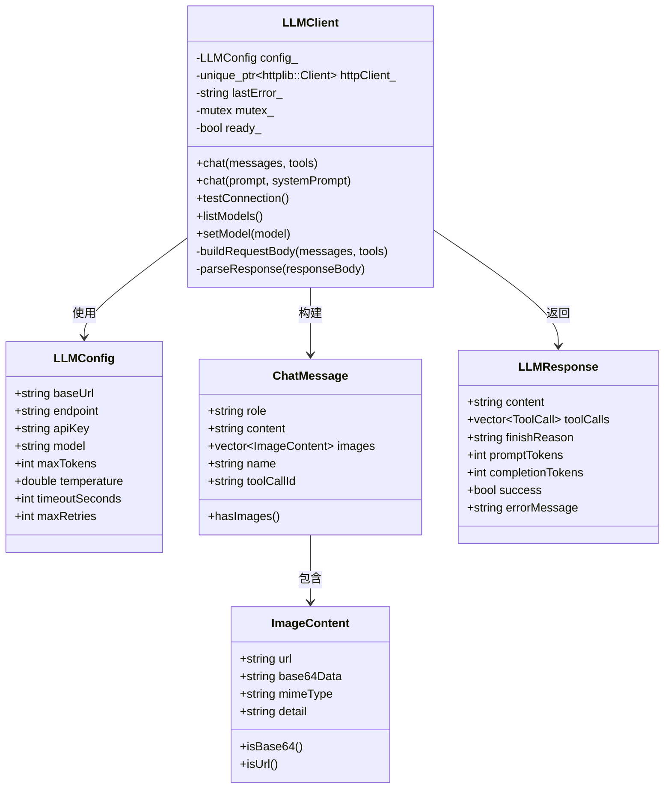
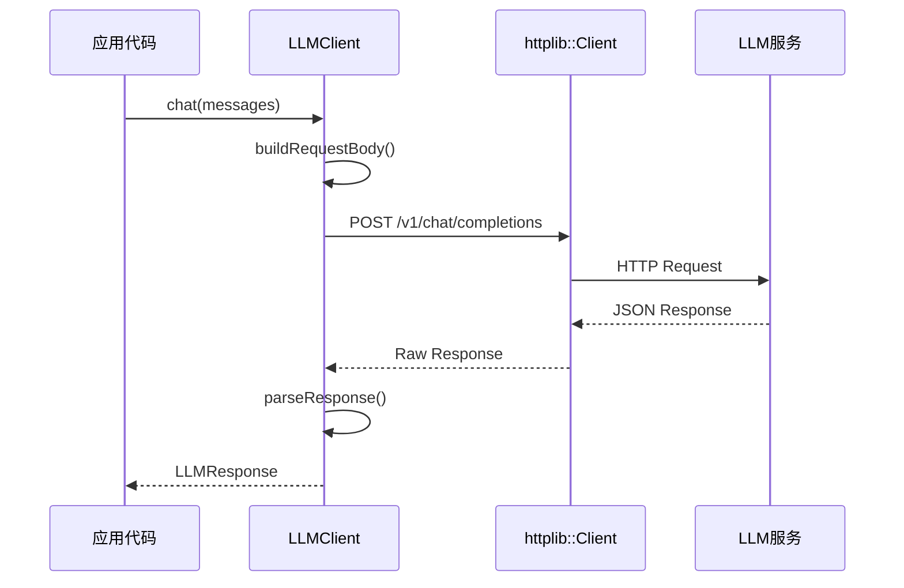

# LLMClient 模块文档

## 1. 模块背景

### 业务背景

在数字取证分析系统中，需要与各种大语言模型（LLM）进行交互：

**核心需求**：
- **统一接口**：兼容不同 LLM 提供商的 API
- **本地模型支持**：支持 LM Studio、Ollama 等本地推理
- **云 API 集成**：支持 OpenAI、Anthropic 等云服务
- **功能调用**：支持 Tool Calling 进行扩展功能

**解决挑战**：
- **API 差异**：不同提供商的 API 格式略有差异
- **网络可靠性**：处理超时、连接失败等网络问题
- **重试策略**：临时故障的自动恢复
- **视觉模型**：支持图像/视频分析的多模态请求

### 技术背景

**OpenAI 兼容 API 标准**：
- 基于 OpenAI Chat Completions API 格式
- 支持的本地服务：
  - **LM Studio**：http://localhost:1234
  - **Ollama**：http://localhost:11434
  - **vLLM**：http://localhost:8000
  - **text-generation-webui**：http://localhost:5000

**httplib 库选择**：
- 轻量级 C++ HTTP 客户端
- 仅头文件包含，易于集成
- 支持 SSL/TLS 加密连接
- 内置连接池和超时控制

## 2. 模块功能

### 核心功能

#### 1. 连接管理

**初始化 HTTP 客户端**：
```cpp
void LLMClient::initHttpClient() {
    std::lock_guard<std::mutex> lock(mutex_);

    // 创建 httplib 客户端
    httpClient_ = std::make_unique<httplib::Client>(config_.baseUrl);

    // 配置超时
    httpClient_->set_connection_timeout(config_.timeoutSeconds);
    httpClient_->set_read_timeout(config_.timeoutSeconds);
    httpClient_->set_write_timeout(config_.timeoutSeconds);

    ready_ = true;
}
```

**配置选项**：
```cpp
struct LLMConfig {
    std::string baseUrl = "http://localhost:1234";  // LM Studio 默认
    std::string endpoint = "/v1/chat/completions";
    std::string apiKey = "";                         // 可选，本地模型通常不需要
    std::string model = "";                           // 模型名称，空则自动选择
    int maxTokens = 2048;                             // 最大生成 token 数
    double temperature = 0.7;                         // 温度参数（0-2）
    int timeoutSeconds = 60;                          // 请求超时（秒）
    int maxRetries = 3;                               // 最大重试次数
};
```

#### 2. 聊天完成 API

**基础聊天**：
```cpp
LLMClient client(config);
LLMResponse response = client.chat("What is digital forensics?");

if (response.success) {
    std::cout << "Answer: " << response.content << std::endl;
    std::cout << "Tokens: " << response.promptTokens
              << " + " << response.completionTokens << std::endl;
} else {
    std::cerr << "Error: " << response.errorMessage << std::endl;
}
```

**带系统提示**：
```cpp
std::vector<ChatMessage> messages = {
    {"system", "You are a digital forensics expert."},
    {"user", "Explain the importance of hash values in forensics."}
};

LLMResponse response = client.chat(messages);
```

**简化接口**：
```cpp
// 自动构建消息数组
LLMResponse response = client.chat(
    "What is file carving?",  // 用户提示
    "Keep it concise."         // 系统提示（可选）
);
```

#### 3. Tool Calling 支持

**启用工具调用**：
```cpp
// 工具定义（JSON 格式）
std::string toolsJson = R"([
    {
        "type": "function",
        "function": {
            "name": "read_file",
            "description": "Read the contents of a file",
            "parameters": {
                "type": "object",
                "properties": {
                    "path": {
                        "type": "string",
                        "description": "File path to read"
                    }
                },
                "required": ["path"]
            }
        }
    }
])";

LLMResponse response = client.chat(messages, toolsJson);

// 检查是否有工具调用
if (!response.toolCalls.empty()) {
    for (const auto& tc : response.toolCalls) {
        std::cout << "Tool: " << tc.name << std::endl;
        std::cout << "Args: " << tc.arguments << std::endl;

        // 执行工具并返回结果
        std::string result = executeTool(tc.name, tc.arguments);
        // 将结果发送回 LLM
    }
}
```

#### 4. 视觉模型支持

**图像分析请求**：
```cpp
// 创建图像内容
ImageContent image;
image.base64Data = base64EncodedImageData;
image.mimeType = "image/jpeg";
image.detail = "high";  // "low", "high", or "auto"

// 创建带图像的消息
ChatMessage msg("user", "What's in this image?", image);

std::vector<ChatMessage> messages = {
    {"system", "You are a forensic image analyst."},
    msg
};

LLMResponse response = client.chat(messages);
```

**多图像分析**：
```cpp
std::vector<ImageContent> images = {
    createImageFromFile("evidence1.jpg"),
    createImageFromFile("evidence2.jpg"),
    createImageFromFile("evidence3.jpg"),
};

ChatMessage msg("user", "Compare these images and find similarities.");
msg.images = images;  // 添加多张图像

LLMResponse response = client.chat(messages);
```

#### 5. 模型管理

**列出可用模型**：
```cpp
LLMClient client(config);
std::vector<ModelInfo> models = client.listModels();

for (const auto& model : models) {
    std::cout << "Model: " << model.name << std::endl;
    std::cout << "  Description: " << model.description << std::endl;
    std::cout << "  Capabilities: ";
    for (const auto& cap : model.capabilities) {
        std::cout << static_cast<int>(cap) << " ";
    }
    std::cout << std::endl;
}
```

**切换模型**：
```cpp
LLMClient client(config);

// 切换到不同的模型
client.setModel("qwen2.5:14b");
LLMResponse response1 = client.chat("Hello");

// 再次切换
client.setModel("llama3-70b");
LLMResponse response2 = client.chat("Hello");
```

**运行时配置更新**：
```cpp
LLMClient client(initialConfig);

// 更新配置
LLMConfig newConfig;
newConfig.baseUrl = "http://new-server:8000";
newConfig.temperature = 0.5;
newConfig.maxTokens = 4096;

client.setConfig(newConfig);
```

### 边界与限制

**功能边界**：
- ✅ 支持 OpenAI 兼容 API
- ✅ 支持文本和视觉模型
- ✅ 支持 Tool Calling
- ❌ 不支持流式响应（Streaming）
- ❌ 不支持嵌入式模型
- ❌ 不支持微调（Fine-tuning）

**已知限制**：
| 限制 | 影响 | 缓解方法 |
|------|------|----------|
| 同步阻塞调用 | 高并发时阻塞 | 使用线程池包装 |
| 无流式响应 | 无法实时显示生成 | 分块请求或切换到异步 |
| 单连接 | 无连接复用 | httplib 内部处理 |
| JSON 解析失败 | 响应格式错误会崩溃 | 异常处理 |

**性能指标**：
- **请求延迟**：~50-500ms（取决于模型）
- **重试开销**：每次失败等待 1 秒
- **内存占用**：最小（仅 HTTP 客户端）

## 3. 模块使用的库

### 依赖库清单

```cpp
// 项目内部
#include "LLMDataTypes.h"    // 数据结构定义

// 第三方库
#include "httplib.h"         // HTTP 客户端 (cpp-mcp)
#include "json.hpp"          // JSON 解析 (nlohmann/json)

// 标准库
#include <memory>            // std::unique_ptr
#include <mutex>             // std::mutex
#include <chrono>            // std::this_thread::sleep_for
#include <sstream>           // std::ostringstream
```

**外部依赖**：
- **httplib** (来自 cpp-mcp)：HTTP 客户端
- **nlohmann/json**：JSON 序列化/反序列化

### 架构图



### 请求/响应流程



## 4. 模块实现方式

### 核心类

```cpp
class LLMClient {
public:
    // 构造函数
    explicit LLMClient(const LLMConfig& config);
    explicit LLMClient(const std::string& baseUrl);
    ~LLMClient();

    // 禁止复制
    LLMClient(const LLMClient&) = delete;
    LLMClient& operator=(const LLMClient&) = delete;

    // 连接测试
    bool testConnection();

    // 聊天 API
    LLMResponse chat(const std::vector<ChatMessage>& messages,
                     const std::string& toolsJson = "");
    LLMResponse chat(const std::string& prompt,
                     const std::string& systemPrompt = "");

    // 模型管理
    std::vector<ModelInfo> listModels();
    void setModel(const std::string& model);
    std::string getModel() const;

    // 配置
    void setConfig(const LLMConfig& config);
    const LLMConfig& getConfig() const;

    // 状态查询
    bool isReady() const;
    std::string getLastError() const;

private:
    LLMConfig config_;
    std::unique_ptr<httplib::Client> httpClient_;
    std::string lastError_;
    mutable std::mutex mutex_;
    bool ready_ = false;

    void initHttpClient();
    std::string buildRequestBody(const std::vector<ChatMessage>& messages,
                                  const std::string& toolsJson);
    LLMResponse parseResponse(const std::string& responseBody);
};
```

### 请求构建

```cpp
std::string LLMClient::buildRequestBody(
    const std::vector<ChatMessage>& messages,
    const std::string& toolsJson) {

    nlohmann::json body;

    // 设置模型
    if (!config_.model.empty()) {
        body["model"] = config_.model;
    }

    // 设置生成参数
    body["max_tokens"] = config_.maxTokens;
    body["temperature"] = config_.temperature;

    // 构建消息数组
    nlohmann::json msgArray = nlohmann::json::array();
    for (const auto& msg : messages) {
        nlohmann::json msgObj;
        msgObj["role"] = msg.role;

        // 检查是否包含图像（视觉格式）
        if (msg.hasImages()) {
            // 使用数组内容格式
            nlohmann::json contentArray = nlohmann::json::array();

            // 添加文本内容
            if (!msg.content.empty()) {
                contentArray.push_back({
                    {"type", "text"},
                    {"text", msg.content}
                });
            }

            // 添加图像内容
            for (const auto& img : msg.images) {
                nlohmann::json imageObj;
                imageObj["type"] = "image_url";

                nlohmann::json imageUrl;
                if (img.isBase64()) {
                    // Base64 格式: data:image/jpeg;base64,{data}
                    std::string mimeType = img.mimeType.empty()
                        ? "image/jpeg" : img.mimeType;
                    imageUrl["url"] = "data:" + mimeType + ";base64,"
                        + img.base64Data;
                } else if (img.isUrl()) {
                    imageUrl["url"] = img.url;
                }

                if (!img.detail.empty()) {
                    imageUrl["detail"] = img.detail;
                }

                imageObj["image_url"] = imageUrl;
                contentArray.push_back(imageObj);
            }

            msgObj["content"] = contentArray;
        } else {
            // 标准文本格式
            msgObj["content"] = msg.content;
        }

        msgArray.push_back(msgObj);
    }
    body["messages"] = msgArray;

    // 添加工具定义（如果有）
    if (!toolsJson.empty()) {
        try {
            body["tools"] = nlohmann::json::parse(toolsJson);
            body["tool_choice"] = "auto";
        } catch (...) {
            // 无效的 tools JSON，跳过
        }
    }

    return body.dump();
}
```

### 响应解析

```cpp
LLMResponse LLMClient::parseResponse(const std::string& responseBody) {
    LLMResponse response;

    try {
        auto jsonData = nlohmann::json::parse(responseBody);

        // 提取消息内容
        if (jsonData.contains("choices") && !jsonData["choices"].empty()) {
            const auto& choice = jsonData["choices"][0];
            const auto& message = choice["message"];

            // 提取文本内容
            if (message.contains("content") && !message["content"].is_null()) {
                response.content = message["content"].get<std::string>();
            }

            // 提取工具调用
            if (message.contains("tool_calls") && message["tool_calls"].is_array()) {
                for (const auto& tc : message["tool_calls"]) {
                    ToolCall toolCall;
                    toolCall.id = tc.value("id", "");
                    if (tc.contains("function")) {
                        toolCall.name = tc["function"].value("name", "");
                        if (tc["function"]["arguments"].is_string()) {
                            toolCall.arguments = tc["function"]["arguments"].get<std::string>();
                        } else {
                            toolCall.arguments = tc["function"]["arguments"].dump();
                        }
                    }
                    response.toolCalls.push_back(toolCall);
                }
            }

            response.finishReason = choice.value("finish_reason", "");
            response.success = true;
        }

        // 提取 token 使用量
        if (jsonData.contains("usage")) {
            response.promptTokens = jsonData["usage"].value("prompt_tokens", 0);
            response.completionTokens = jsonData["usage"].value("completion_tokens", 0);
        }

    } catch (const std::exception& e) {
        response.errorMessage = "Failed to parse response: "
            + std::string(e.what());
    }

    return response;
}
```

### 重试逻辑

```cpp
LLMResponse LLMClient::chat(const std::vector<ChatMessage>& messages,
                            const std::string& toolsJson) {
    LLMResponse response;

    if (!ready_ || !httpClient_) {
        response.errorMessage = "Client not ready";
        return response;
    }

    std::string requestBody = buildRequestBody(messages, toolsJson);

    int retries = 0;
    while (retries <= config_.maxRetries) {
        std::lock_guard<std::mutex> lock(mutex_);

        auto res = httpClient_->Post(
            config_.endpoint,
            requestBody,
            "application/json"
        );

        if (!res) {
            lastError_ = "Request failed: " + httplib::to_string(res.error());
            retries++;
            if (retries <= config_.maxRetries) {
                // 指数退避
                std::this_thread::sleep_for(
                    std::chrono::milliseconds(500 * retries)
                );
                continue;
            }
            response.errorMessage = lastError_;
            return response;
        }

        if (res->status == 200) {
            return parseResponse(res->body);
        }

        lastError_ = "Server error: " + std::to_string(res->status)
            + " - " + res->body;
        retries++;
        if (retries <= config_.maxRetries) {
            std::this_thread::sleep_for(
                std::chrono::milliseconds(500 * retries)
            );
        }
    }

    response.errorMessage = lastError_;
    return response;
}
```

## 5. API 调用

### C++ API

#### 基础使用

```cpp
#include "integration/LLMIntegration/LLMClient.h"
#include "integration/LLMIntegration/LLMDataTypes.h"

using namespace forensics::llm;

// 1. 创建客户端
LLMConfig config;
config.baseUrl = "http://localhost:1234";  // LM Studio
config.model = "llama3-8b-instruct";
config.temperature = 0.7;
config.maxTokens = 2048;

LLMClient client(config);

// 2. 测试连接
if (!client.testConnection()) {
    std::cerr << "Connection failed: " << client.getLastError() << std::endl;
    return;
}

// 3. 发送聊天请求
LLMResponse response = client.chat(
    "Explain the importance of chain of custody in digital forensics."
);

if (response.success) {
    std::cout << "Response: " << response.content << std::endl;
    std::cout << "Tokens used: " << response.promptTokens
              << " + " << response.completionTokens << std::endl;
} else {
    std::cerr << "Error: " << response.errorMessage << std::endl;
}
```

#### 配置不同服务

**LM Studio**：
```cpp
LLMConfig config;
config.baseUrl = "http://localhost:1234";
config.endpoint = "/v1/chat/completions";
// LM Studio 通常不需要 API key
```

**Ollama**：
```cpp
LLMConfig config;
config.baseUrl = "http://localhost:11434";
config.endpoint = "/v1/chat/completions";
config.model = "llama3:8b";
```

**OpenAI API**：
```cpp
LLMConfig config;
config.baseUrl = "https://api.openai.com";
config.endpoint = "/v1/chat/completions";
config.apiKey = "sk-...";  // 需要 API key
config.model = "gpt-4-turbo";
```

**自定义推理服务器**：
```cpp
LLMConfig config;
config.baseUrl = "http://my-server:8000";
config.endpoint = "/api/v1/chat";
config.timeoutSeconds = 120;  // 更长的超时
config.maxRetries = 5;         // 更多重试
```

#### 多轮对话

```cpp
// 构建对话历史
std::vector<ChatMessage> conversation = {
    {"system", "You are a forensic analyst assistant."},
    {"user", "What is the first step in digital forensics?"}
};

LLMResponse response1 = client.chat(conversation);
std::cout << "Assistant: " << response1.content << std::endl;

// 添加助手回复和新的用户问题
conversation.push_back({"assistant", response1.content});
conversation.push_back({"user", "What about live analysis?"});

LLMResponse response2 = client.chat(conversation);
std::cout << "Assistant: " << response2.content << std::endl;
```

#### 视觉模型调用

```cpp
// Base64 编码图像
std::string base64Image = readAndBase64Encode("evidence.jpg");

// 创建图像内容
ImageContent image;
image.base64Data = base64Image;
image.mimeType = "image/jpeg";
image.detail = "high";  // 高分辨率分析

// 创建带图像的消息
ChatMessage msg("user", "Analyze this forensic evidence image.", image);

std::vector<ChatMessage> messages = {
    {"system", "You are a forensic image analyst."},
    msg
};

// 使用支持视觉的模型
client.setModel("qwen-vl-plus");
LLMResponse response = client.chat(messages);

std::cout << "Analysis: " << response.content << std::endl;
```

### 与 ModelRouter 集成

```cpp
#include "integration/LLMIntegration/ModelRouter.h"

// 创建路由器并注册多个模型
auto router = std::make_shared<ModelRouter>();

// 注册本地模型
LLMConfig localConfig;
localConfig.baseUrl = "http://localhost:1234";
localConfig.model = "llama3-8b";

ModelInfo localInfo;
localInfo.name = "llama3-8b";
localInfo.priority = 10;
localInfo.capabilities = {
    ModelCapability::TextGeneration,
    ModelCapability::Summarization
};

router->addModel("local", localConfig, localInfo);

// 注册 GPT-4（支持视觉）
LLMConfig gpt4Config;
gpt4Config.baseUrl = "https://api.openai.com";
gpt4Config.apiKey = "sk-...";
gpt4Config.model = "gpt-4";

ModelInfo gpt4Info;
gpt4Info.name = "gpt-4";
gpt4Info.priority = 5;
gpt4Info.supportsVision = true;
gpt4Info.capabilities = {
    ModelCapability::TextGeneration,
    ModelCapability::Vision
};

router->addModel("gpt4", gpt4Config, gpt4Info);

// 设置降级策略
router->setStrategy(RoutingStrategy::Fallback);

// 使用路由器
std::vector<ChatMessage> messages = {
    {"user", "Analyze this image..."}  // 包含图像
};

// 自动路由到支持视觉的模型
LLMResponse response = router->chat(messages, ModelCapability::Vision);
```

### 错误处理

```cpp
LLMClient client(config);

// 检查客户端状态
if (!client.isReady()) {
    std::cerr << "Client not ready" << std::endl;
    return;
}

// 测试连接
if (!client.testConnection()) {
    std::cerr << "Connection test failed" << std::endl;
    return;
}

// 发送请求并处理响应
LLMResponse response = client.chat("Hello");

if (!response.success) {
    // 处理错误
    if (response.errorMessage.find("Connection refused") != std::string::npos) {
        std::cerr << "Server not running" << std::endl;
    } else if (response.errorMessage.find("timeout") != std::string::npos) {
        std::cerr << "Request timeout" << std::endl;
    } else {
        std::cerr << "Error: " << response.errorMessage << std::endl;
    }
    return;
}

// 检查完成原因
if (response.finishReason == "length") {
    std::cerr << "Response truncated due to max_tokens" << std::endl;
}
```

## 6. 二次开发

### 添加流式响应支持

```cpp
class LLMClient {
public:
    // 流式回调类型
    using StreamCallback = std::function<void(const std::string& chunk)>;

    // 流式聊天方法
    LLMResponse chatStream(
        const std::vector<ChatMessage>& messages,
        StreamCallback onChunk
    );

private:
    // 流式响应处理
    LLMResponse parseStreamResponse(
        htttplib::Response& res,
        StreamCallback onChunk
    );
};

LLMResponse LLMClient::chatStream(
    const std::vector<ChatMessage>& messages,
    StreamCallback onChunk) {

    // 发送请求时设置 stream: true
    nlohmann::json body = buildRequestBody(messages);
    body["stream"] = true;

    std::string requestBody = body.dump();

    auto res = httpClient_->Post(
        config_.endpoint,
        requestBody,
        "application/json"
    );

    if (!res || res->status != 200) {
        LLMResponse errorResponse;
        errorResponse.success = false;
        errorResponse.errorMessage = "Stream request failed";
        return errorResponse;
    }

    // 处理流式响应
    return parseStreamResponse(*res, onChunk);
}
```

### 添加缓存层

```cpp
#include <unordered_map>
#include <functional>

class CachedLLMClient : public LLMClient {
public:
    CachedLLMClient(const LLMConfig& config) : LLMClient(config) {}

    LLMResponse chat(const std::vector<ChatMessage>& messages) override {
        // 生成缓存键
        std::string cacheKey = generateCacheKey(messages);

        // 检查缓存
        auto it = cache_.find(cacheKey);
        if (it != cache_.end()) {
            std::cout << "Cache hit!" << std::endl;
            return it->second;
        }

        // 调用父类方法
        LLMResponse response = LLMClient::chat(messages);

        // 缓存成功的响应
        if (response.success) {
            cache_[cacheKey] = response;
        }

        return response;
    }

    void clearCache() {
        cache_.clear();
    }

private:
    std::string generateCacheKey(const std::vector<ChatMessage>& messages) {
        nlohmann::json key;
        for (const auto& msg : messages) {
            key.push_back({
                {"role", msg.role},
                {"content", msg.content}
            });
        }
        return key.dump();
    }

    std::unordered_map<std::string, LLMResponse> cache_;
};
```

### 添加异步支持

```cpp
#include <future>
#include <mutex>

class AsyncLLMClient {
public:
    AsyncLLMClient(const LLMConfig& config) : client_(config) {}

    // 异步聊天
    std::future<LLMResponse> chatAsync(
        const std::vector<ChatMessage>& messages
    ) {
        return std::async(std::launch::async, [this, messages]() {
            std::lock_guard<std::mutex> lock(mutex_);
            return client_.chat(messages);
        });
    }

    // 批量异步请求
    std::vector<std::future<LLMResponse>> chatBatchAsync(
        const std::vector<std::vector<ChatMessage>>& batch
    ) {
        std::vector<std::future<LLMResponse>> futures;
        for (const auto& messages : batch) {
            futures.push_back(chatAsync(messages));
        }
        return futures;
    }

private:
    LLMClient client_;
    std::mutex mutex_;
};

// 使用示例
AsyncLLMClient asyncClient(config);

std::vector<std::vector<ChatMessage>> prompts = {
    {{"user", "Prompt 1"}},
    {{"user", "Prompt 2"}},
    {{"user", "Prompt 3"}}
};

auto futures = asyncClient.chatBatchAsync(prompts);

// 等待所有请求完成
for (auto& future : futures) {
    LLMResponse response = future.get();
    std::cout << response.content << std::endl;
}
```

### 添加指标收集

```cpp
class MetricsLLMClient : public LLMClient {
public:
    MetricsLLMClient(const LLMConfig& config) : LLMClient(config) {}

    LLMResponse chat(const std::vector<ChatMessage>& messages) override {
        auto startTime = std::chrono::high_resolution_clock::now();

        LLMResponse response = LLMClient::chat(messages);

        auto endTime = std::chrono::high_resolution_clock::now();
        double latencyMs = std::chrono::duration<double, std::milli>(
            endTime - startTime).count();

        // 记录指标
        totalRequests_++;
        totalLatencyMs_ += latencyMs;
        if (response.success) {
            successRequests_++;
        } else {
            failedRequests_++;
        }

        return response;
    }

    void printMetrics() const {
        std::cout << "=== LLM Client Metrics ===" << std::endl;
        std::cout << "Total requests: " << totalRequests_ << std::endl;
        std::cout << "Success: " << successRequests_ << std::endl;
        std::cout << "Failed: " << failedRequests_ << std::endl;
        std::cout << "Success rate: "
            << (100.0 * successRequests_ / totalRequests_) << "%" << std::endl;
        std::cout << "Avg latency: "
            << (totalLatencyMs_ / totalRequests_) << " ms" << std::endl;
    }

private:
    int totalRequests_ = 0;
    int successRequests_ = 0;
    int failedRequests_ = 0;
    double totalLatencyMs_ = 0.0;
};
```

## 7. 其他

### 测试

```cpp
#include <gtest/gtest.h>

class LLMClientTest : public ::testing::Test {
protected:
    void SetUp() override {
        config.baseUrl = "http://localhost:1234";
        config.model = "llama3-8b";
        client = std::make_unique<LLMClient>(config);
    }

    LLMConfig config;
    std::unique_ptr<LLMClient> client;
};

TEST_F(LLMClientTest, ConnectionTest) {
    EXPECT_TRUE(client->testConnection());
}

TEST_F(LLMClientTest, SimpleChat) {
    LLMResponse response = client->chat("Say 'test'");
    EXPECT_TRUE(response.success);
    EXPECT_FALSE(response.content.empty());
}

TEST_F(LLMClientTest, MultiTurnConversation) {
    std::vector<ChatMessage> messages = {
        {"system", "You are a helpful assistant."},
        {"user", "Remember the number 42."},
        {"assistant", "I'll remember that."},
        {"user", "What number did I tell you?"}
    };

    LLMResponse response = client->chat(messages);
    EXPECT_TRUE(response.success);
    EXPECT_TRUE(response.content.find("42") != std::string::npos);
}
```

### 配置

**环境变量** (`.env`)：
```env
# LLM Configuration
LLM_BASE_URL=http://localhost:1234
LLM_MODEL=llama3-8b-instruct
LLM_MAX_TOKENS=2048
LLM_TEMPERATURE=0.7
LLM_TIMEOUT=60
LLM_MAX_RETRIES=3

# OpenAI API (可选)
OPENAI_API_KEY=sk-...
OPENAI_MODEL=gpt-4-turbo
```

**代码加载**：
```cpp
#include "core/ConfigManager/ConfigManager.h"

ConfigManager::instance().load(".env");

LLMConfig config;
config.baseUrl = ConfigManager::instance().getLLMBaseUrl();
config.model = ConfigManager::instance().getLLMModel();
config.apiKey = ConfigManager::instance().getLLMApiKey();
config.maxTokens = ConfigManager::instance().getLLMMaxTokens();
config.temperature = ConfigManager::instance().getLLMTemperature();
```

### 故障排查

| 问题 | 可能原因 | 解决方法 |
|------|----------|----------|
| 连接被拒绝 | LM Studio 未运行 | 启动 LM Studio 或检查端口 |
| 超时错误 | 模型加载时间过长 | 增加 `timeoutSeconds` |
| JSON 解析失败 | 响应格式错误 | 检查 `baseUrl` 是否正确 |
| 重复失败 | 模型崩溃 | 重启 LM Studio |
| 视觉分析失败 | 模型不支持视觉 | 使用支持视觉的模型 |

### 最佳实践

1. **总是检查连接**：
   ```cpp
   if (!client.testConnection()) {
       LOG_ERROR("Cannot connect to LLM service");
       return;
   }
   ```

2. **使用合适的温度参数**：
   - `0.0-0.3`：需要精确输出（代码、分析）
   - `0.7-1.0`：创意写作
   - `1.0-2.0`：高随机性

3. **限制 max_tokens**：
   - 短回答：512-1024
   - 中等：2048
   - 长篇：4096-8192

4. **处理 Tool Calling**：
   - 检查 `finishReason == "tool_calls"`
   - 验证工具参数
   - 循环直到 `finishReason == "stop"`

5. **视觉图像优化**：
   - 使用适当的 `detail` 级别
   - 压缩大图像（<20MB）
   - JPEG 比 PNG 更高效

### 相关模块

- **[ModelRouter](./ModelRouter.md)** - 多模型路由器
- **[FileAnalyzer](./FileAnalyzer.md)** - LLM 文件分析器
- **[MCPIntegration](./MCPIntegration.md)** - MCP 协议集成

### 参考资源

- **OpenAI API 文档**: https://platform.openai.com/docs/api-reference
- **LM Studio 文档**: https://lmstudio.ai/docs
- **Ollama 文档**: https://ollama.com/docs
- **httplib 文档**: https://github.com/yhirose/cpp-httplib

### 变更历史

| 版本 | 日期 | 变更内容 | 作者 |
|------|------|----------|------|
| 1.0.0 | 2026-03-16 | 初始版本 | ymj68520 |

---

**最后更新**: 2026-03-16
**维护者**: ymj68520
