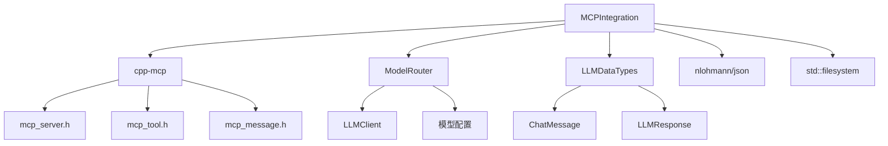
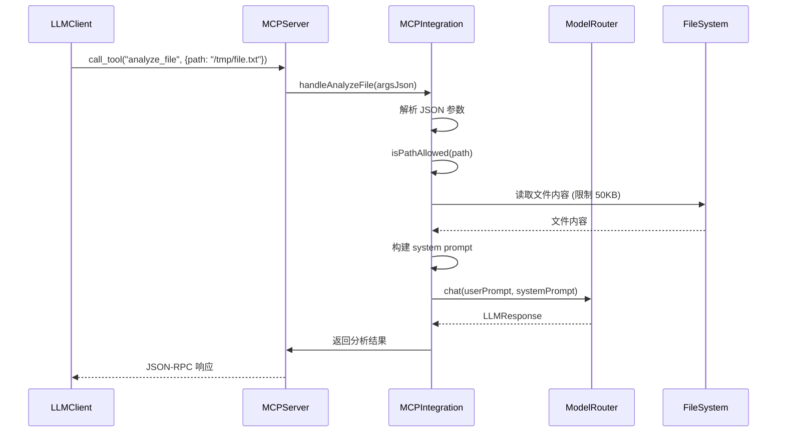
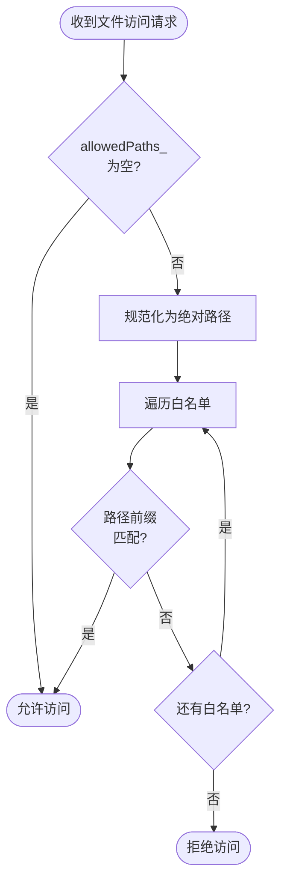

# MCPIntegration 模块文档

## 1. 模块背景

### 业务背景

在数字取证分析工具中，需要为大语言模型（LLM）提供安全、可控的文件访问能力。传统的文件访问方式存在以下问题：

1. **安全风险**：直接文件系统访问可能导致未经授权的敏感数据泄露
2. **缺乏标准化**：不同 LLM 客户端对工具调用的实现方式各不相同
3. **路径控制困难**：难以限制 LLM 可访问的文件范围

MCP（Model Context Protocol）是一个开放的协议标准，为 AI 模型与外部资源、工具和服务的交互提供了标准化方式。通过集成 MCP 协议，取证工具可以：

- 提供标准化的文件分析工具接口
- 实现细粒度的路径访问控制
- 支持 LLM Agent 的工具调用能力
- 与 MCP 兼容的客户端无缝集成

### 技术背景

**MCP 协议规范**：
- 基于 JSON-RPC 2.0 的请求/响应通信
- 定义了工具（Tools）、资源（Resources）、提示（Prompts）三类核心抽象
- 支持多种传输方式：HTTP SSE、stdio
- 规范版本：2024-11-05 基础协议规范

**cpp-mcp 库**：
- 本项目使用的 C++ MCP 协议实现框架
- 提供服务器端和客户端完整实现
- 支持 HTTP 和 stdio 两种传输方式
- 可选的 SSL/TLS 加密通信

**集成方式**：
- C++ 取证工具作为 MCP 服务器运行
- 暴露文件分析相关的工具给 LLM 客户端
- 通过 ModelRouter 进行 LLM 调用
- 默认监听端口：8890

---

## 2. 模块功能

### 核心功能

1. **MCP 服务器管理**
   - 启动/停止 HTTP 服务器
   - 支持阻塞和非阻塞运行模式
   - 服务器信息注册（名称、版本）
   - 能力声明（tools）

2. **内置工具注册**
   - `read_file`：读取文件内容，支持字节限制
   - `analyze_file`：使用 LLM 分析文件并生成摘要
   - `list_files`：列出目录内容，支持递归
   - `generate_description`：为多个文件生成自然语言描述

3. **自定义工具扩展**
   - 动态注册用户自定义工具
   - 支持任意 JSON Schema 参数定义
   - 灵活的处理器函数类型

4. **安全控制**
   - 路径白名单机制
   - 绝对路径规范化
   - 路径前缀匹配验证

5. **LLM 集成**
   - 通过 ModelRouter 进行多模型路由
   - 自动构建分析提示词
   - 结构化响应解析

### 边界与限制

| 限制项 | 说明 | 解决方案 |
|--------|------|----------|
| **文件大小限制** | 读取大文件可能耗尽内存 | 使用 `max_bytes` 参数限制读取量 |
| **路径安全性** | 路径遍历攻击风险 | 使用 `setAllowedPaths()` 设置白名单 |
| **并发访问** | 多个客户端同时调用工具 | 依赖 cpp-mcp 的线程池处理 |
| **LLM 可用性** | 依赖 ModelRouter 配置 | 确保 LLM 服务正确配置 |
| **二进制文件** | 无法直接分析二进制内容 | 建议先提取文本内容再分析 |

---

## 3. 模块使用的库

### 依赖库清单

| 库名称 | 版本要求 | 用途 | 链接方式 |
|--------|----------|------|----------|
| **cpp-mcp** | 最新 | MCP 协议实现 | 静态库 (libs/cpp-mcp) |
| **nlohmann/json** | 3.11+ | JSON 序列化/反序列化 | Header-only |
| **ModelRouter** | 项目内部 | LLM 多模型路由 | 内部模块 |
| **LLMDataTypes** | 项目内部 | LLM 数据类型定义 | 内部模块 |
| **std::filesystem** | C++17 | 文件系统操作 | 标准库 |

### 依赖关系图



### cpp-mcp 核心组件

```cpp
// MCP 服务器配置
mcp::server::configuration config;
config.host = "localhost";
config.port = 8890;

// 服务器创建和启动
mcp::server server(config);
server.set_server_info("ForensicsLLMServer", "1.0.0");
server.set_capabilities(capabilities);
server.start(blocking);
```

---

## 4. 模块实现方式

### 架构设计

```mermaid
classDiagram
    class MCPIntegration {
        -shared_ptr~ModelRouter~ router_
        -unique_ptr~mcp::server~ server_
        -int port_
        -bool running_
        -vector~string~ allowedPaths_
        -map~string, MCPToolHandler~ customHandlers_
        +start(bool blocking)
        +stop()
        +registerTool(name, desc, params, handler)
        +setAllowedPaths(paths)
        +getRegisteredTools()
        -handleReadFile(argsJson)
        -handleAnalyzeFile(argsJson)
        -handleListFiles(argsJson)
        -handleGenerateDescription(argsJson)
        -isPathAllowed(path)
    }

    class ModelRouter {
        +chat(messages, systemPrompt)
        +chat(userPrompt, systemPrompt)
    }

    class mcp::server {
        +set_server_info(name, version)
        +set_capabilities(capabilities)
        +register_tool(tool, handler)
        +start(blocking)
        +stop()
    }

    class mcp::tool_builder {
        +with_description(desc)
        +with_string_param(name, desc, required)
        +with_number_param(name, desc, required)
        +with_boolean_param(name, desc, required)
        +build()
    }

    MCPIntegration --> ModelRouter
    MCPIntegration --> mcp::server
    MCPIntegration --> mcp::tool_builder
```

### 核心类说明

#### MCPIntegration

```cpp
class MCPIntegration {
public:
    // 构造函数
    MCPIntegration(std::shared_ptr<ModelRouter> router, int port = 8890);

    // 服务器控制
    void start(bool blocking = false);
    void stop();
    bool isRunning() const;

    // 工具注册
    void registerTool(const std::string& name,
                      const std::string& description,
                      const std::string& parametersJson,
                      MCPToolHandler handler);

    // 安全配置
    void setAllowedPaths(const std::vector<std::string>& paths);

    // 查询接口
    int getPort() const;
    std::vector<std::string> getRegisteredTools() const;
};
```

**关键成员变量**：

```cpp
std::shared_ptr<ModelRouter> router_;      // LLM 路由器
std::unique_ptr<mcp::server> server_;      // MCP 服务器实例
int port_;                                  // 监听端口
bool running_;                              // 运行状态
std::vector<std::string> allowedPaths_;    // 允许的路径白名单
std::map<std::string, MCPToolHandler> customHandlers_;  // 自定义工具处理器
```

### 关键流程

#### 服务器启动流程

```mermaid
sequenceDiagram
    participant Client
    participant MCPIntegration
    participant mcp::server
    participant ModelRouter

    Client->>MCPIntegration: start(true)
    MCPIntegration->>MCPIntegration: 检查运行状态
    MCPIntegration->>mcp::server: 创建服务器配置
    MCPIntegration->>mcp::server: 设置服务器信息
    MCPIntegration->>mcp::server: 设置能力声明
    MCPIntegration->>MCPIntegration: registerBuiltinTools()
    MCPIntegration->>mcp::server: 注册 read_file
    MCPIntegration->>mcp::server: 注册 analyze_file
    MCPIntegration->>mcp::server: 注册 list_files
    MCPIntegration->>mcp::server: 注册 generate_description
    MCPIntegration->>mcp::server: start(blocking=true)
    Note over mcp::server: 阻塞运行，监听请求
```

#### 工具调用流程



#### 路径验证流程



### 内置工具详解

#### read_file

```cpp
// 工具定义
mcp::tool tool = mcp::tool_builder("read_file")
    .with_description("Read the contents of a file")
    .with_string_param("path", "Path to the file to read", true)
    .with_number_param("max_bytes", "Maximum bytes to read (0 = unlimited)", false)
    .build();
```

**参数说明**：
- `path` (string, 必需)：文件路径
- `max_bytes` (number, 可选)：最大读取字节数，0 表示无限制

**返回示例**：
```json
{
  "content": [
    {
      "type": "text",
      "text": "文件内容..."
    }
  ]
}
```

#### analyze_file

```cpp
// 工具定义
mcp::tool tool = mcp::tool_builder("analyze_file")
    .with_description("Analyze a file and generate a summary using LLM")
    .with_string_param("path", "Path to the file to analyze", true)
    .with_boolean_param("include_keywords", "Extract keywords from content", false)
    .build();
```

**处理流程**：
1. 读取文件内容（限制 50KB）
2. 构建分析提示词
3. 调用 ModelRouter.chat()
4. 返回 LLM 响应

**System Prompt 模板**：
```
You are a file analysis assistant. Analyze the following file content and provide:
1. A concise summary (2-3 sentences)
2. The main purpose or topic of the file
3. Key terms or concepts (comma-separated list)

Respond in a structured format.
```

#### list_files

```cpp
// 工具定义
mcp::tool tool = mcp::tool_builder("list_files")
    .with_description("List files in a directory")
    .with_string_param("path", "Directory path", true)
    .with_boolean_param("recursive", "Include subdirectories", false)
    .build();
```

**返回格式**：
```json
[
  {
    "path": "/tmp/file.txt",
    "name": "file.txt",
    "is_directory": false,
    "size": 1024,
    "extension": ".txt"
  }
]
```

#### generate_description

```cpp
// 工具定义
mcp::tool tool = mcp::tool_builder("generate_description")
    .with_description("Generate a natural language description of a file or set of files")
    .with_string_param("paths", "Comma-separated list of file paths", true)
    .build();
```

**处理逻辑**：
1. 解析逗号分隔的路径列表
2. 收集文件信息（大小、扩展名、预览）
3. 调用 LLM 生成自然语言描述

---

## 5. API 调用

### C++ API

#### 基本使用

```cpp
// 示例 1: 创建并启动 MCP 服务器
#include "integration/LLMIntegration/MCPIntegration.h"
#include "integration/LLMIntegration/ModelRouter.h"

using namespace forensics::llm;

// 创建 ModelRouter
auto router = std::make_shared<ModelRouter>();
router->addModel("gpt-4", "http://localhost:1234/v1", "sk-key");

// 创建并启动 MCP 服务器
MCPIntegration mcp(router, 8890);
mcp.start(true);  // 阻塞模式
```

```cpp
// 示例 2: 非阻塞模式启动
MCPIntegration mcp(router, 8890);
mcp.start(false);  // 非阻塞模式

// 在其他线程中运行
std::thread serverThread([&mcp]() {
    mcp.start(true);
});

// 主线程继续执行其他任务
// ...

// 停止服务器
mcp.stop();
serverThread.join();
```

```cpp
// 示例 3: 配置路径白名单
MCPIntegration mcp(router, 8890);

// 设置允许访问的路径
mcp.setAllowedPaths({
    "/tmp/forensics",
    "/var/cases",
    "/home/analyst/evidence"
});

mcp.start(true);
```

```cpp
// 示例 4: 注册自定义工具
MCPIntegration mcp(router, 8890);

// 定义工具处理器
auto hashCalculator = [](const std::string& argsJson) -> std::string {
    auto args = nlohmann::json::parse(argsJson);
    std::string path = args["path"];

    // 计算 MD5 哈希
    std::string hash = calculateMD5(path);

    return nlohmann::json({
        {"algorithm", "md5"},
        {"hash", hash}
    }).dump();
};

// 注册工具
mcp.registerTool(
    "calculate_hash",
    "Calculate MD5 hash of a file",
    R"({
        "type": "object",
        "properties": {
            "path": {
                "type": "string",
                "description": "File path to hash"
            }
        },
        "required": ["path"]
    })",
    hashCalculator
);

mcp.start();
```

```cpp
// 示例 5: 查询已注册的工具
MCPIntegration mcp(router, 8890);
mcp.start(false);

auto tools = mcp.getRegisteredTools();
for (const auto& tool : tools) {
    std::cout << "Tool: " << tool << std::endl;
}
// 输出:
// Tool: read_file
// Tool: analyze_file
// Tool: list_files
// Tool: generate_description
// Tool: calculate_hash (自定义)
```

```cpp
// 示例 6: 动态工具注册（服务器运行后）
MCPIntegration mcp(router, 8890);
mcp.start(false);

// 稍后添加新工具
mcp.registerTool(
    "search_files",
    "Search for files by pattern",
    R"({
        "type": "object",
        "properties": {
            "pattern": {"type": "string"},
            "path": {"type": "string"}
        },
        "required": ["pattern", "path"]
    })",
    [](const std::string& argsJson) -> std::string {
        // 实现搜索逻辑
        return "Search results...";
    }
);
```

```cpp
// 示例 7: 与 HTTPServer 集成
class ForensicsServer {
private:
    std::unique_ptr<MCPIntegration> mcpServer_;
    std::shared_ptr<ModelRouter> router_;

public:
    void start() {
        // 启动 C++ HTTP 服务器
        httpServer_.start(8080);

        // 启动 MCP 服务器
        mcpServer_ = std::make_unique<MCPIntegration>(router_, 8890);
        mcpServer_->setAllowedPaths({"/tmp/evidence"});
        mcpServer_->start(false);
    }

    void stop() {
        httpServer_.stop();
        if (mcpServer_) {
            mcpServer_->stop();
        }
    }
};
```

### 命令行 API

MCP 服务器没有直接的命令行接口，通过 C++ API 启动。但可以创建独立的 MCP 服务器程序：

```cpp
// mcp_server_main.cpp
#include "integration/LLMIntegration/MCPIntegration.h"
#include "integration/LLMIntegration/ModelRouter.h"
#include "core/ConfigManager/ConfigManager.h"

using namespace forensics;

int main(int argc, char* argv[]) {
    // 加载配置
    core::ConfigManager::instance().load(".env");

    // 创建 ModelRouter
    auto router = std::make_shared<llm::ModelRouter>();

    // 从配置读取模型
    std::string baseUrl = core::ConfigManager::instance().get("LLM_BASE_URL");
    std::string model = core::ConfigManager::instance().get("LLM_MODEL");
    router->addModel(model, baseUrl);

    // 创建并启动 MCP 服务器
    llm::MCPIntegration mcp(router, 8890);

    // 配置路径白名单
    std::string allowedPaths = core::ConfigManager::instance().get("MCP_ALLOWED_PATHS");
    // 解析逗号分隔的路径列表...

    std::cout << "MCP Server starting on port 8890..." << std::endl;
    mcp.start(true);

    return 0;
}
```

### REST API

MCP 协议本身不使用 REST API，而是使用 JSON-RPC 2.0。以下是原始 JSON-RPC 调用示例：

```json
// 请求示例：调用 read_file 工具
{
  "jsonrpc": "2.0",
  "method": "tools/call",
  "params": {
    "name": "read_file",
    "arguments": {
      "path": "/tmp/evidence/document.txt",
      "max_bytes": 1000
    }
  },
  "id": 1
}

// 响应示例
{
  "jsonrpc": "2.0",
  "result": {
    "content": [
      {
        "type": "text",
        "text": "这是文件内容..."
      }
    ]
  },
  "id": 1
}
```

```json
// 请求示例：调用 analyze_file 工具
{
  "jsonrpc": "2.0",
  "method": "tools/call",
  "params": {
    "name": "analyze_file",
    "arguments": {
      "path": "/tmp/evidence/suspicious.exe",
      "include_keywords": true
    }
  },
  "id": 2
}

// 响应示例
{
  "jsonrpc": "2.0",
  "result": {
    "content": [
      {
        "type": "text",
        "text": "Summary: This appears to be a Windows executable file...\n\nPurpose: Potentially malicious software\n\nKeywords: pe32, executable, windows, suspicious"
      }
    ]
  },
  "id": 2
}
```

**注意**：实际使用时，应该通过 MCP 客户端库（如 cpp-mcp 的 `sse_client` 或 `stdio_client`）进行调用，而不是手动构造 JSON-RPC 请求。

---

## 6. 二次开发

### 扩展点

MCPIntegration 模块提供以下扩展点：

1. **自定义工具注册**
   - 添加新的工具处理器
   - 定义自定义参数 Schema
   - 实现工具逻辑

2. **路径安全策略**
   - 扩展路径验证逻辑
   - 实现更复杂的访问控制
   - 添加权限检查

3. **LLM 提示词定制**
   - 修改系统提示词模板
   - 添加领域特定的分析指令
   - 实现多语言支持

4. **响应格式扩展**
   - 自定义响应 JSON 结构
   - 添加元数据字段
   - 实现流式响应

### 添加新工具的步骤

#### 步骤 1: 定义工具处理器

```cpp
// 示例：添加元数据提取工具
auto metadataExtractor = [](const std::string& argsJson) -> std::string {
    try {
        auto args = nlohmann::json::parse(argsJson);
        std::string path = args["path"];

        // 提取文件元数据
        nlohmann::json metadata;
        metadata["path"] = path;
        metadata["size"] = std::filesystem::file_size(path);
        metadata["extension"] = std::filesystem::path(path).extension();

        auto ftime = std::filesystem::last_write_time(path);
        auto sctp = std::chrono::time_point_cast<std::chrono::system_clock::duration>(
            ftime - std::filesystem::file_time_type::clock::now()
            + std::chrono::system_clock::now()
        );
        metadata["modified"] = std::chrono::system_clock::to_time_t(sctp);

        return metadata.dump(2);

    } catch (const std::exception& e) {
        return nlohmann::json({
            {"error", e.what()}
        }).dump();
    }
};
```

#### 步骤 2: 定义参数 Schema

```cpp
const char* metadataSchema = R"({
    "type": "object",
    "properties": {
        "path": {
            "type": "string",
            "description": "Path to the file to extract metadata from"
        },
        "include_hash": {
            "type": "boolean",
            "description": "Whether to calculate file hash",
            "default": false
        }
    },
    "required": ["path"]
})";
```

#### 步骤 3: 注册工具

```cpp
MCPIntegration mcp(router, 8890);

mcp.registerTool(
    "extract_metadata",
    "Extract comprehensive metadata from a file",
    metadataSchema,
    metadataExtractor
);

mcp.start();
```

#### 步骤 4: 测试工具

```cpp
// 通过 MCP 客户端测试
mcp::sse_client client("http://localhost:8890");
client.initialize("TestClient", "1.0.0");

nlohmann::json params = {
    {"path", "/tmp/test.txt"},
    {"include_hash", true}
};

auto result = client.call_tool("extract_metadata", params);
std::cout << result.dump(2) << std::endl;
```

### 实现高级功能

#### 1. 批量文件处理工具

```cpp
auto batchProcessor = [](const std::string& argsJson) -> std::string {
    auto args = nlohmann::json::parse(argsJson);
    std::vector<std::string> paths = args["paths"];
    std::string operation = args["operation"];

    nlohmann::json results = nlohmann::json::array();

    for (const auto& path : paths) {
        nlohmann::json result;
        result["path"] = path;

        if (operation == "size") {
            result["size"] = std::filesystem::file_size(path);
        } else if (operation == "exists") {
            result["exists"] = std::filesystem::exists(path);
        }

        results.push_back(result);
    }

    return results.dump();
};

mcp.registerTool(
    "batch_process",
    "Process multiple files in a single operation",
    R"({
        "type": "object",
        "properties": {
            "paths": {
                "type": "array",
                "items": {"type": "string"},
                "description": "List of file paths to process"
            },
            "operation": {
                "type": "string",
                "enum": ["size", "exists", "type"],
                "description": "Operation to perform on each file"
            }
        },
        "required": ["paths", "operation"]
    })",
    batchProcessor
);
```

#### 2. 搜索工具

```cpp
auto searchTool = [&router](const std::string& argsJson) -> std::string {
    auto args = nlohmann::json::parse(argsJson);
    std::string directory = args["directory"];
    std::string pattern = args["pattern"];
    bool useRegex = args.value("use_regex", false);

    nlohmann::json results = nlohmann::json::array();

    try {
        if (useRegex) {
            std::regex re(pattern);
            for (const auto& entry : std::filesystem::recursive_directory_iterator(directory)) {
                std::string filename = entry.path().filename().string();
                if (std::regex_search(filename, re)) {
                    results.push_back({
                        {"path", entry.path().string()},
                        {"filename", filename}
                    });
                }
            }
        } else {
            // 使用通配符匹配
            // 实现简化的 glob 匹配
        }
    } catch (const std::exception& e) {
        return nlohmann::json({
            {"error", e.what()}
        }).dump();
    }

    return nlohmann::json({
        {"matches", results.size()},
        {"files", results}
    }).dump();
};

mcp.registerTool(
    "search_files",
    "Search for files matching a pattern",
    R"({
        "type": "object",
        "properties": {
            "directory": {
                "type": "string",
                "description": "Directory to search in"
            },
            "pattern": {
                "type": "string",
                "description": "Search pattern (wildcard or regex)"
            },
            "use_regex": {
                "type": "boolean",
                "description": "Treat pattern as regular expression",
                "default": false
            }
        },
        "required": ["directory", "pattern"]
    })",
    searchTool
);
```

#### 3. 内容搜索工具

```cpp
auto contentSearchTool = [&router](const std::string& argsJson) -> std::string {
    auto args = nlohmann::json::parse(argsJson);
    std::string directory = args["directory"];
    std::string searchTerm = args["search_term"];
    std::string filePattern = args.value("file_pattern", "*");

    nlohmann::json results = nlohmann::json::array();

    for (const auto& entry : std::filesystem::recursive_directory_iterator(directory)) {
        if (!entry.is_regular_file()) continue;

        // 检查文件扩展名
        // ... (省略文件类型检查)

        // 读取文件内容并搜索
        std::ifstream file(entry.path());
        std::string line;
        int lineNumber = 0;

        std::vector<nlohmann::json> matches;
        while (std::getline(file, line)) {
            lineNumber++;
            if (line.find(searchTerm) != std::string::npos) {
                matches.push_back({
                    {"line_number", lineNumber},
                    {"content", line}
                });
            }
        }

        if (!matches.empty()) {
            results.push_back({
                {"file", entry.path().string()},
                {"matches", matches}
            });
        }
    }

    return nlohmann::json({
        {"total_files", results.size()},
        {"results", results}
    }).dump();
};

mcp.registerTool(
    "search_content",
    "Search for text within files",
    R"({
        "type": "object",
        "properties": {
            "directory": {"type": "string"},
            "search_term": {"type": "string"},
            "file_pattern": {"type": "string"}
        },
        "required": ["directory", "search_term"]
    })",
    contentSearchTool
);
```

### 代码示例

#### 完整的扩展示例

```cpp
// ExtendedMCPIntegration.h
#pragma once

#include "integration/LLMIntegration/MCPIntegration.h"
#include <string>
#include <vector>

namespace forensics {
namespace llm {

class ExtendedMCPIntegration : public MCPIntegration {
public:
    ExtendedMCPIntegration(std::shared_ptr<ModelRouter> router, int port = 8890)
        : MCPIntegration(router, port) {}

    // 注册所有扩展工具
    void registerExtendedTools();

private:
    // 工具处理器
    std::string handleCalculateHash(const std::string& argsJson);
    std::string handleSearchFiles(const std::string& argsJson);
    std::string handleSearchContent(const std::string& argsJson);
    std::string handleBatchProcess(const std::string& argsJson);
    std::string handleExtractMetadata(const std::string& argsJson);

    // 辅助函数
    std::string calculateFileHash(const std::string& path);
    bool matchesPattern(const std::string& filename, const std::string& pattern);
};

} // namespace llm
} // namespace forensics
```

```cpp
// ExtendedMCPIntegration.cpp
#include "ExtendedMCPIntegration.h"
#include "core/Logger/Logger.h"
#include <fstream>
#include <openssl/md5.h>

namespace forensics {
namespace llm {

void ExtendedMCPIntegration::registerExtendedTools() {
    // 注册计算哈希工具
    registerTool(
        "calculate_hash",
        "Calculate MD5 hash of a file",
        R"({
            "type": "object",
            "properties": {
                "path": {"type": "string"}
            },
            "required": ["path"]
        })",
        [this](const std::string& args) { return handleCalculateHash(args); }
    );

    // 注册文件搜索工具
    registerTool(
        "search_files",
        "Search for files matching a pattern",
        R"({
            "type": "object",
            "properties": {
                "directory": {"type": "string"},
                "pattern": {"type": "string"}
            },
            "required": ["directory", "pattern"]
        })",
        [this](const std::string& args) { return handleSearchFiles(args); }
    );

    // 注册内容搜索工具
    registerTool(
        "search_content",
        "Search for text within files",
        R"({
            "type": "object",
            "properties": {
                "directory": {"type": "string"},
                "search_term": {"type": "string"}
            },
            "required": ["directory", "search_term"]
        })",
        [this](const std::string& args) { return handleSearchContent(args); }
    );

    // 注册批量处理工具
    registerTool(
        "batch_process",
        "Process multiple files",
        R"({
            "type": "object",
            "properties": {
                "paths": {"type": "array", "items": {"type": "string"}},
                "operation": {"type": "string"}
            },
            "required": ["paths", "operation"]
        })",
        [this](const std::string& args) { return handleBatchProcess(args); }
    );

    // 注册元数据提取工具
    registerTool(
        "extract_metadata",
        "Extract file metadata",
        R"({
            "type": "object",
            "properties": {
                "path": {"type": "string"}
            },
            "required": ["path"]
        })",
        [this](const std::string& args) { return handleExtractMetadata(args); }
    );
}

std::string ExtendedMCPIntegration::handleCalculateHash(const std::string& argsJson) {
    try {
        auto args = nlohmann::json::parse(argsJson);
        std::string path = args["path"];

        std::string hash = calculateFileHash(path);

        return nlohmann::json({
            {"algorithm", "md5"},
            {"hash", hash},
            {"path", path}
        }).dump();

    } catch (const std::exception& e) {
        LOG_ERROR("Hash calculation failed: " + std::string(e.what()));
        return nlohmann::json({{"error", e.what()}}).dump();
    }
}

std::string ExtendedMCPIntegration::calculateFileHash(const std::string& path) {
    // 实现 MD5 哈希计算
    // ... (省略具体实现)
    return "abc123def456";
}

// ... (其他处理器实现)

} // namespace llm
} // namespace forensics
```

---

## 7. 其他

### 测试

#### 单元测试

```cpp
// 测试路径验证
TEST(MCPIntegrationTest, PathValidation) {
    auto router = std::make_shared<ModelRouter>();
    MCPIntegration mcp(router);

    mcp.setAllowedPaths({"/tmp/allowed", "/var/evidence"});

    // 测试允许的路径
    EXPECT_TRUE(mcp.isPathAllowed("/tmp/allowed/file.txt"));
    EXPECT_TRUE(mcp.isPathAllowed("/tmp/allowed/subdir/file.txt"));

    // 测试拒绝的路径
    EXPECT_FALSE(mcp.isPathAllowed("/tmp/other/file.txt"));
    EXPECT_FALSE(mcp.isPathAllowed("/etc/passwd"));
}
```

```cpp
// 测试工具注册
TEST(MCPIntegrationTest, ToolRegistration) {
    auto router = std::make_shared<ModelRouter>();
    MCPIntegration mcp(router);

    auto customHandler = [](const std::string& args) -> std::string {
        return "custom result";
    };

    mcp.registerTool(
        "custom_tool",
        "A custom tool",
        R"({"type": "object"})",
        customHandler
    );

    auto tools = mcp.getRegisteredTools();
    EXPECT_TRUE(std::find(tools.begin(), tools.end(), "custom_tool") != tools.end());
}
```

#### 集成测试

```cpp
// 测试 MCP 服务器启动和工具调用
TEST(MCPIntegrationTest, ServerLifecycle) {
    auto router = std::make_shared<ModelRouter>();
    MCPIntegration mcp(router, 8891);  // 使用不同端口

    EXPECT_FALSE(mcp.isRunning());

    mcp.start(false);
    std::this_thread::sleep_for(std::chrono::milliseconds(100));

    EXPECT_TRUE(mcp.isRunning());

    mcp.stop();
    EXPECT_FALSE(mcp.isRunning());
}
```

### 配置

#### 环境变量配置

在 `.env` 文件中添加：

```env
# MCP 服务器配置
MCP_PORT=8890
MCP_HOST=localhost

# 路径白名单（逗号分隔）
MCP_ALLOWED_PATHS=/tmp/evidence,/var/cases,/home/analyst

# LLM 配置（用于 analyze_file 工具）
LLM_BASE_URL=http://localhost:1234
LLM_MODEL=gpt-4
LLM_MAX_TOKENS=4096
```

#### 配置文件示例

```cpp
// 从配置文件加载 MCP 设置
ConfigManager::instance().load(".env");

int port = std::stoi(ConfigManager::instance().get("MCP_PORT", "8890"));
std::string host = ConfigManager::instance().get("MCP_HOST", "localhost");

std::string pathsStr = ConfigManager::instance().get("MCP_ALLOWED_PATHS");
std::vector<std::string> allowedPaths;
std::istringstream iss(pathsStr);
std::string path;
while (std::getline(iss, path, ',')) {
    // 去除空白
    path.erase(0, path.find_first_not_of(" \t"));
    path.erase(path.find_last_not_of(" \t") + 1);
    if (!path.empty()) {
        allowedPaths.push_back(path);
    }
}

MCPIntegration mcp(router, port);
mcp.setAllowedPaths(allowedPaths);
mcp.start();
```

### 故障排查

#### 常见问题

| 问题 | 可能原因 | 解决方法 |
|------|----------|----------|
| 服务器启动失败 | 端口已被占用 | 使用不同端口或关闭占用进程 |
| 工具调用返回错误 | 路径不在白名单中 | 检查 `setAllowedPaths()` 配置 |
| LLM 分析失败 | ModelRouter 未配置 | 确保 LLM 服务可用 |
| 文件读取失败 | 文件不存在或无权限 | 检查文件路径和权限 |
| JSON 解析错误 | 参数格式不正确 | 验证 JSON 格式 |

#### 调试技巧

```cpp
// 启用详细日志
#include "core/Logger/Logger.h"

Logger::instance().setLevel(LogLevel::DEBUG);
Logger::instance().setOutput(LogOutput::FILE, "mcp_debug.log");

// 在工具处理器中添加日志
auto handler = [](const std::string& argsJson) -> std::string {
    LOG_DEBUG("Tool called with args: " + argsJson);

    try {
        // 处理逻辑
        LOG_INFO("Processing completed successfully");
        return result;
    } catch (const std::exception& e) {
        LOG_ERROR("Tool error: " + std::string(e.what()));
        return nlohmann::json({{"error", e.what()}}).dump();
    }
};
```

### 相关模块

| 模块 | 关系 | 说明 |
|------|------|------|
| **ModelRouter** | 依赖 | 提供 LLM 调用能力 |
| **LLMClient** | 依赖 | 底层 LLM API 客户端 |
| **FileAnalyzer** | 协作 | 文件内容分析功能 |
| **ConfigManager** | 依赖 | 加载配置信息 |
| **Logger** | 依赖 | 日志记录 |

### 参考资源

- [MCP 协议规范](https://spec.modelcontextprotocol.io/specification/2024-11-05/architecture/)
- [cpp-mcp GitHub](https://github.com/F?????/cpp-mcp) - C++ MCP 实现框架
- [MCP 示例服务器](https://github.com/modelcontextprotocol)
- [JSON-RPC 2.0 规范](https://www.jsonrpc.org/specification)

### 变更历史

| 版本 | 日期 | 变更内容 | 作者 |
|------|------|----------|------|
| 1.0.0 | 2026-03-16 | 初始版本，实现基本 MCP 服务器和内置工具 | Claude Code |

---

**文档版本**: 1.0.0
**最后更新**: 2026-03-16
**维护者**: ymj68520
