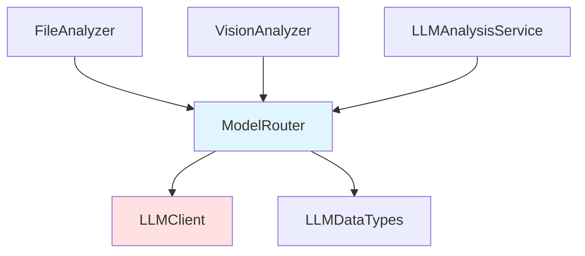

# ModelRouter 模块文档

## 1. 模块背景

### 业务背景

在数字取证分析系统中，LLM 模型的多样性和可用性是关键挑战：

**核心需求**：
- **多模型支持**：同时管理多个 LLM 端点（本地 LM Studio、云端 API）
- **智能路由**：根据任务类型选择最合适的模型
- **容错机制**：模型不可用时自动切换到备选模型
- **负载均衡**：在多个模型间分配请求负载

**解决挑战**：
- **模型异构性**：不同模型擅长不同任务（文本生成、代码分析、图像识别）
- **可用性管理**：本地模型可能离线，云端 API 可能限流
- **性能优化**：避免单个模型过载

### 技术背景

**设计模式**：
- **Strategy Pattern**：可切换的路由策略
- **Router Pattern**：请求分发和负载均衡

**路由策略**：
- RoundRobin（轮询）
- Priority（优先级）
- Capability（能力匹配）
- LoadBalance（负载均衡）
- Fallback（容错回退）

## 2. 模块功能

### 核心功能

#### 1. 模型注册与管理

```cpp
// 注册模型
ModelRouter router;
LLMConfig config;
config.baseUrl = "http://localhost:1234";
config.model = "openai/gpt-oss-20b";

ModelInfo info;
info.name = "GPT-OSS-20B";
info.capabilities = {ModelCapability::TextGeneration, ModelCapability::Analysis};
info.priority = 10;
info.contextLength = 8192;

router.addModel("gpt-oss", config, info);

// 移除模型
router.removeModel("gpt-oss");

// 获取注册的模型列表
std::vector<std::string> names = router.getModelNames();

// 获取模型信息
ModelInfo info = router.getModelInfo("gpt-oss");
```

#### 2. 路由策略

**设置策略**：
```cpp
// 设置路由策略
router.setStrategy(RoutingStrategy::Priority);

// 获取当前策略
RoutingStrategy current = router.getStrategy();
```

**策略说明**：

| 策略 | 说明 |
|------|------|
| `RoundRobin` | 轮询分发请求到所有可用模型 |
| `Priority` | 优先使用高优先级模型 |
| `Capability` | 根据任务能力匹配模型 |
| `LoadBalance` | 根据当前负载分配请求 |
| `Fallback` | 按顺序尝试直到成功 |

#### 3. 请求路由

**结构化对话**：
```cpp
std::vector<ChatMessage> messages;
messages.emplace_back("system", "You are a forensic analyst.");
messages.emplace_back("user", "Analyze this file content...");

// 使用默认能力（TextGeneration）
LLMResponse response = router.chat(messages);

// 指定所需能力
LLMResponse response = router.chat(messages, ModelCapability::Vision);
```

**简单对话**：
```cpp
// 简单对话（自动路由）
LLMResponse response = router.chat("Summarize this file", "You are an analyst.");
```

#### 4. 模型可用性管理

```cpp
// 检查是否有可用模型
if (!router.hasAvailableModels()) {
    LOG_WARNING("No LLM models available");
}

// 刷新模型可用性（测试连接）
router.refreshAvailability();

// 设置首选模型（用于 Priority 策略）
router.setPreferredModel("gpt-oss");

// 获取最后使用的模型
std::string lastModel = router.getLastUsedModel();
```

#### 5. 配置获取

```cpp
// 获取主模型配置
const LLMConfig& config = router.getConfig();
std::cout << "Base URL: " << config.baseUrl << std::endl;
std::cout << "Model: " << config.model << std::endl;
```

### 边界与限制

**功能边界**：
- ❌ 不支持模型自动发现
- ❌ 不支持动态配置更新
- ❌ 不支持请求队列管理

**已知限制**：
| 限制 | 影响 | 缓解方法 |
|------|------|----------|
| 静态注册 | 新增模型需重启 | 设计为启动时配置 |
| 无请求缓存 | 相同请求重复调用 | 上层实现缓存 |
| 无限流控制 | 可能触发 API 限流 | 合理设置重试策略 |

## 3. 模块使用的库

### 依赖库清单

| 库名称 | 用途 |
|--------|------|
| **LLMClient** | 底层 HTTP 通信 |
| **LLMDataTypes** | 数据类型定义 |

### 依赖关系图



## 4. 模块实现方式

### 核心类

```cpp
class ModelRouter {
public:
    ModelRouter();
    ~ModelRouter();

    // Non-copyable
    ModelRouter(const ModelRouter&) = delete;
    ModelRouter& operator=(const ModelRouter&) = delete;

    // 模型管理
    void addModel(const std::string& name,
                  const LLMConfig& config,
                  const ModelInfo& info);
    void removeModel(const std::string& name);

    // 策略配置
    void setStrategy(RoutingStrategy strategy);
    RoutingStrategy getStrategy() const;

    // 请求路由
    LLMResponse chat(const std::vector<ChatMessage>& messages,
                     ModelCapability requiredCapability = ModelCapability::TextGeneration);
    LLMResponse chat(const std::string& prompt,
                     const std::string& systemPrompt = "");

    // 模型查询
    std::vector<std::string> getModelNames() const;
    ModelInfo getModelInfo(const std::string& name) const;

    // 可用性管理
    bool hasAvailableModels() const;
    void refreshAvailability();

    // 首选模型
    void setPreferredModel(const std::string& name);
    std::string getLastUsedModel() const;

    // 配置获取
    const LLMConfig& getConfig() const;

private:
    struct ModelEntry {
        std::string name;
        LLMConfig config;
        ModelInfo info;
        std::unique_ptr<LLMClient> client;
        std::atomic<int> currentLoad{0};
        std::atomic<int> failureCount{0};
    };

    std::map<std::string, std::unique_ptr<ModelEntry>> models_;
    RoutingStrategy strategy_ = RoutingStrategy::Fallback;
    std::string preferredModel_;
    std::string lastUsedModel_;
    size_t roundRobinIndex_ = 0;
    mutable std::mutex mutex_;

    // 路由实现
    LLMClient* selectByPriority(ModelCapability cap);
    LLMClient* selectByCapability(ModelCapability cap);
    LLMClient* selectByRoundRobin(ModelCapability cap);
    LLMClient* selectByLoadBalance(ModelCapability cap);
    LLMClient* selectByFallback(ModelCapability cap, LLMResponse& response);

    LLMClient* getClient(const std::string& name);
    std::vector<ModelEntry*> getAvailableModels(ModelCapability cap);
};
```

### 内部数据结构

**ModelEntry**：
```cpp
struct ModelEntry {
    std::string name;                    // 模型标识
    LLMConfig config;                    // 连接配置
    ModelInfo info;                      // 模型元数据
    std::unique_ptr<LLMClient> client;   // HTTP 客户端
    std::atomic<int> currentLoad{0};     // 当前负载
    std::atomic<int> failureCount{0};    // 失败计数
};
```

### 路由实现

**Fallback 策略**（默认）：
```cpp
LLMClient* ModelRouter::selectByFallback(ModelCapability cap, LLMResponse& response) {
    auto available = getAvailableModels(cap);

    for (auto* entry : available) {
        // 尝试调用
        response = entry->client->chat(/* messages */);
        if (response.success) {
            lastUsedModel_ = entry->name;
            return entry->client.get();
        }

        // 标记失败
        entry->failureCount++;
    }

    return nullptr;
}
```

**LoadBalance 策略**：
```cpp
LLMClient* ModelRouter::selectByLoadBalance(ModelCapability cap) {
    auto available = getAvailableModels(cap);

    // 选择负载最低的模型
    ModelEntry* selected = nullptr;
    int minLoad = INT_MAX;

    for (auto* entry : available) {
        int load = entry->currentLoad.load();
        if (load < minLoad) {
            minLoad = load;
            selected = entry;
        }
    }

    if (selected) {
        selected->currentLoad++;
        lastUsedModel_ = selected->name;
        return selected->client.get();
    }

    return nullptr;
}
```

## 5. API 调用

### C++ API

```cpp
#include "LLMIntegration/ModelRouter.h"
#include "LLMIntegration/LLMDataTypes.h"

using namespace forensics::llm;

// 1. 创建路由器
ModelRouter router;

// 2. 注册模型
LLMConfig config1;
config1.baseUrl = "http://localhost:1234";
config1.model = "openai/gpt-oss-20b";

ModelInfo info1;
info1.name = "GPT-OSS-20B";
info1.capabilities = {ModelCapability::TextGeneration, ModelCapability::Analysis};
info1.priority = 10;
router.addModel("gpt-oss", config1, info1);

LLMConfig config2;
config2.baseUrl = "http://localhost:1235";
config2.model = "qwen/qwen3-vl-4b";

ModelInfo info2;
info2.name = "Qwen3-VL";
info2.capabilities = {ModelCapability::Vision, ModelCapability::ImageAnalysis};
info2.priority = 5;
info2.supportsVision = true;
router.addModel("qwen-vl", config2, info2);

// 3. 设置路由策略
router.setStrategy(RoutingStrategy::Fallback);

// 4. 发送请求
std::vector<ChatMessage> messages;
messages.emplace_back("system", "You are a forensic analyst.");
messages.emplace_back("user", "Analyze this file content...");

LLMResponse response = router.chat(messages);

if (response.success) {
    std::cout << "Response: " << response.content << std::endl;
    std::cout << "Model used: " << router.getLastUsedModel() << std::endl;
} else {
    std::cerr << "Error: " << response.errorMessage << std::endl;
}
```

### 视觉分析示例

```cpp
// 使用视觉模型分析图像
ImageContent image;
image.base64Data = base64EncodedImageData;
image.mimeType = "image/jpeg";
image.detail = "high";

ChatMessage msg("user", "Describe this image", image);

LLMResponse response = router.chat({msg}, ModelCapability::Vision);
```

### 集成到应用

```cpp
// main.cpp - 从配置初始化路由器
ModelRouter initModelRouter() {
    auto& config = ConfigManager::instance();
    ModelRouter router;

    // 文本模型
    LLMConfig textConfig;
    textConfig.baseUrl = config.get("LLM_BASE_URL", "http://localhost:1234");
    textConfig.model = config.get("LLM_TEXT_MODEL", "openai/gpt-oss-20b");
    textConfig.maxTokens = config.getInt("LLM_MAX_TOKENS", 4096);
    textConfig.timeoutSeconds = config.getInt("LLM_TIMEOUT", 120);

    ModelInfo textInfo;
    textInfo.name = "Text Model";
    textInfo.capabilities = {ModelCapability::TextGeneration, ModelCapability::Analysis};
    textInfo.priority = 10;
    router.addModel("text", textConfig, textInfo);

    // 视觉模型
    LLMConfig visionConfig;
    visionConfig.baseUrl = config.get("LLM_BASE_URL", "http://localhost:1234");
    visionConfig.model = config.get("LLM_VISION_MODEL", "qwen/qwen3-vl-4b");

    ModelInfo visionInfo;
    visionInfo.name = "Vision Model";
    visionInfo.capabilities = {ModelCapability::Vision, ModelCapability::ImageAnalysis};
    visionInfo.priority = 5;
    visionInfo.supportsVision = true;
    router.addModel("vision", visionConfig, visionInfo);

    // 设置策略
    router.setStrategy(RoutingStrategy::Fallback);

    return router;
}
```

## 6. 二次开发

### 添加新的路由策略

```cpp
// 1. 在 RoutingStrategy 枚举中添加新值
enum class RoutingStrategy {
    RoundRobin,
    Priority,
    Capability,
    LoadBalance,
    Fallback,
    CustomStrategy  // 新增
};

// 2. 实现选择逻辑
LLMClient* ModelRouter::selectByCustom(ModelCapability cap) {
    // 自定义路由逻辑
    // ...
}

// 3. 在 chat() 方法中添加分支
LLMResponse ModelRouter::chat(const std::vector<ChatMessage>& messages,
                              ModelCapability cap) {
    LLMClient* client = nullptr;

    switch (strategy_) {
        case RoutingStrategy::CustomStrategy:
            client = selectByCustom(cap);
            break;
        // ... 其他策略
    }

    if (!client) {
        LLMResponse resp;
        resp.success = false;
        resp.errorMessage = "No suitable model available";
        return resp;
    }

    return client->chat(messages);
}
```

### 添加模型健康检查

```cpp
class ModelRouter {
public:
    struct ModelHealth {
        std::string name;
        bool available;
        int failureCount;
        int currentLoad;
        double avgResponseMs;
    };

    std::vector<ModelHealth> getHealthStatus() const {
        std::lock_guard<std::mutex> lock(mutex_);
        std::vector<ModelHealth> status;

        for (const auto& [name, entry] : models_) {
            ModelHealth health;
            health.name = name;
            health.available = entry->info.available;
            health.failureCount = entry->failureCount.load();
            health.currentLoad = entry->currentLoad.load();
            status.push_back(health);
        }

        return status;
    }
};
```

## 7. 其他

### 测试

```bash
cd build
./test_model_router

# 测试路由策略
./test_model_router --test-strategy priority

# 测试负载均衡
./test_model_router --test-load-balance
```

### 故障排查

| 问题 | 可能原因 | 解决方法 |
|------|----------|----------|
| 所有请求失败 | 无可用模型 | 检查模型注册和网络 |
| 路由不均衡 | 策略配置错误 | 检查 setStrategy() |
| 模型未被选中 | 能力不匹配 | 检查 ModelInfo.capabilities |
| 超时错误 | 模型响应慢 | 增加 timeoutSeconds |

### 最佳实践

1. **注册多个模型**以实现容错
2. **合理设置优先级**，本地模型优先
3. **使用 Fallback 策略**作为默认选择
4. **定期调用 refreshAvailability()** 更新状态
5. **监控 getLastUsedModel()** 了解路由行为

### 相关模块

- **[LLMClient](./LLMClient.md)** - 底层 HTTP 通信
- **[FileAnalyzer](./FileAnalyzer.md)** - 文件分析
- **[VisionAnalyzer](../analyzers/VisionAnalysis/VisionAnalyzer.md)** - 视觉分析

---

**最后更新**: 2026-05-19
**维护者**: ymj68520
