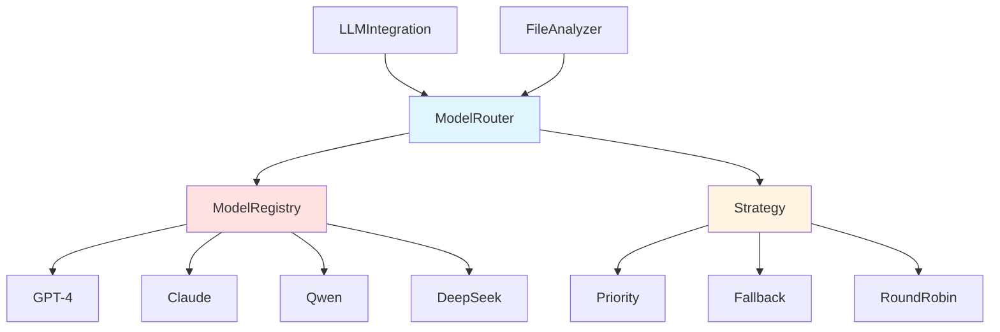

# ModelRouter 模块文档

## 1. 模块背景

### 业务背景

在大语言模型（LLM）集成中，单一模型往往无法满足所有需求：

**核心需求**：
- **多模型支持**：根据任务类型选择最优模型
- **高可用性**：主模型失败时自动切换到备用模型
- **负载均衡**：分散请求到多个模型实例
- **成本优化**：优先使用本地模型，减少云 API 调用

**解决挑战**：
- **模型故障**：单个模型不可用时的降级策略
- **性能差异**：不同模型的响应速度差异
- **成本控制**：云 API 调用的费用管理
- **能力匹配**：根据任务需求选择合适模型

### 技术背景

**路由策略**：
- **Priority（优先级）**：按模型优先级排序
- **Fallback（降级）**：主模型失败时切换
- **RoundRobin（轮询）**：均匀分配请求
- **LoadBalance（负载均衡）**：选择负载最少的模型
- **Capability（能力匹配）**：根据任务需求选择

**模型类型**：
- **文本模型**：GPT-4, Claude, DeepSeek
- **视觉模型**：GPT-4V, Qwen VL
- **本地模型**：LM Studio, Ollama
- **云 API**：OpenAI, Anthropic, DeepSeek

## 2. 模块功能

### 核心功能

#### 1. 多模型管理

**模型注册**：
```cpp
auto router = std::make_shared<ModelRouter>();

// 添加模型
llm::LLMConfig config;
config.baseUrl = "https://api.openai.com/v1";
config.apiKey = "sk-...";
config.model = "gpt-4-turbo";
config.priority = 10;  // 高优先级

llm::ModelInfo info;
info.name = "GPT-4 Turbo";
info.capabilities = {
    llm::ModelCapability::Analysis,
    llm::ModelCapability::Chat
};

router->addModel("gpt4", config, info);

// 本地模型
config.baseUrl = "http://localhost:1234/v1";
config.model = "qwen2.5:7b";
config.priority = 5;

info.name = "Qwen 2.5 7B";
info.capabilities = {llm::ModelCapability::Analysis};

router->addModel("qwen", config, info);
```

#### 2. 路由策略

**优先级策略**（默认）：
```cpp
router->setStrategy(llm::RoutingStrategy::Priority);

// 始终使用最高优先级的可用模型
// 如果最高优先级模型失败，尝试下一个
```

**降级策略**：
```cpp
router->setStrategy(llm::RoutingStrategy::Fallback);

// 按配置顺序尝试模型，直到成功
// 适合需要确保请求成功的场景
```

**轮询策略**：
```cpp
router->setStrategy(llm::RoutingStrategy::RoundRobin);

// 循环使用所有模型，分散负载
// 适合无状态请求
```

**负载均衡策略**：
```cpp
router->setStrategy(llm::RoutingStrategy::LoadBalance);

// 选择当前请求最少的模型
// 优化资源利用
```

**能力匹配策略**：
```cpp
router->setStrategy(llm::RoutingStrategy::Capability);

// 根据任务需求选择模型
// 例如：视觉分析必须使用支持 Vision 的模型
```

#### 3. 聊点执行

**文本对话**：
```cpp
std::vector<llm::ChatMessage> messages = {
    {"user", "分析这个文件"}
};

auto response = router->chat(messages, llm::ModelCapability::Analysis);
std::cout << response.content << std::endl;
std::cout << "使用的模型: " << response.modelUsed << std::endl;
```

**视觉分析**：
```cpp
llm::ImageContent image;
image.type = "image_url";
image.image_url.url = "data:image/jpeg;base64,...";

messages.push_back({"user", "描述这张图片", image});

auto response = router->chat(messages, llm::ModelCapability::Vision);
```

#### 4. 健康检查

**模型状态监控**：
```cpp
// 测试所有模型
auto health = router->healthCheck();

for (const auto& [name, status] : health) {
    std::cout << name << ": " << (status ? "健康" : "故障") << std::endl;
}

// 获取模型列表
auto models = router->listModels();
for (const auto& model : models) {
    std::cout << model.name << " (" << model.model << ")" << std::endl;
}
```

### 边界与限制

**功能边界**：
- ❌ 不支持模型热更新（需重启服务）
- ❌ 不支持动态模型发现（需手动注册）
- ❌ 不支持模型版本回滚（固定配置）

**已知限制**：
| 限制 | 影响 | 缓解方法 |
|------|------|----------|
| 静态配置 | 需重启更新模型 | 实现配置热重载 |
| 无缓存 | 重复健康检查 | 添加健康状态缓存 |
| 单点故障 | 路由器故障 | 使用多实例 |

**性能指标**：
- **路由延迟**：<1ms（内存查找）
- **健康检查**：~1-5 秒/模型
- **故障切换**：<10 秒（取决于超时设置）

## 3. 模块使用的库

### 依赖库清单

| 库名称 | 版本 | 用途 |
|--------|------|------|
| **nlohmann/json** | 3.11.2 | JSON 处理 |
| **libcurl** | latest | HTTP 客户端 |
| **LLMIntegration** | latest | LLM 客户端 |

### 架构图



## 4. 模块实现方式

### 核心类

```cpp
class ModelRouter {
public:
    ModelRouter();

    // 模型管理
    void addModel(const std::string& id,
                 const llm::LLMConfig& config,
                 const llm::ModelInfo& info);
    void removeModel(const std::string& id);
    void clearModels();

    // 策略设置
    void setStrategy(llm::RoutingStrategy strategy);
    llm::RoutingStrategy getStrategy() const;

    // 执行接口
    llm::ChatResponse chat(const std::vector<llm::ChatMessage>& messages,
                          llm::ModelCapability capability = llm::ModelCapability::Analysis);

    // 健康检查
    std::map<std::string, bool> healthCheck();
    std::vector<llm::ModelInfo> listModels();

private:
    struct ModelInstance {
        std::string id;
        llm::LLMConfig config;
        llm::ModelInfo info;
        std::unique_ptr<llm::LLMClient> client;
        bool isHealthy = true;
        size_t requestCount = 0;
    };

    std::map<std::string, ModelInstance> models_;
    llm::RoutingStrategy strategy_;
    size_t currentIndex_ = 0;

    // 路由逻辑
    std::string selectModel(const std::vector<llm::ModelInstance*>& available);
    void updateHealthStatus();
};
```

### 数据结构

```cpp
enum class RoutingStrategy {
    Priority,   // 优先级排序
    Fallback,   // 顺序降级
    RoundRobin, // 轮询
    LoadBalance, // 负载均衡
    Capability // 能力匹配
};

enum class ModelCapability {
    Analysis,   // 文本分析
    Chat,       // 对话
    Vision      // 视觉理解
};

struct ModelInfo {
    std::string name;
    std::string description;
    std::vector<ModelCapability> capabilities;
    int maxTokens;
    double costPerMillionTokens;
};
```

### 路由实现

```cpp
llm::ChatResponse ModelRouter::chat(
    const std::vector<llm::ChatMessage>& messages,
    llm::ModelCapability capability) {

    // 1. 筛选可用模型
    std::vector<ModelInstance*> available;
    for (auto& [id, model] : models_) {
        if (model.isHealthy &&
            std::find(model.info.capabilities.begin(),
                     model.info.capabilities.end(), capability) !=
            model.info.capabilities.end()) {
            available.push_back(&model);
        }
    }

    if (available.empty()) {
        throw std::runtime_error("No available model for requested capability");
    }

    // 2. 根据策略选择模型
    std::string selectedId = selectModel(available);

    // 3. 尝试执行
    auto& model = models_[selectedId];
    try {
        llm::ChatResponse response = model.client->chat(messages);

        // 更新统计
        model.requestCount++;

        return response;

    } catch (const std::exception& e) {
        // 标记为不健康
        model.isHealthy = false;

        // 如果有其他可用模型，尝试切换
        if (available.size() > 1) {
            // 递归尝试其他模型
            return chat(messages, capability);
        }

        throw;  // 所有模型都失败
    }
}
```

### 优先级路由

```cpp
std::string ModelRouter::selectModel(
    const std::vector<ModelInstance*>& available) {

    if (strategy_ == RoutingStrategy::Priority) {
        // 按优先级排序
        std::vector<ModelInstance*> sorted = available;
        std::sort(sorted.begin(), sorted.end(),
            [](const ModelInstance* a, const ModelInstance* b) {
                return a->config.priority > b->config.priority;
            });

        return sorted[0]->id;
    }

    // ... 其他策略
}
```

### 负载均衡路由

```cpp
if (strategy_ == RoutingStrategy::LoadBalance) {
    // 选择请求最少的模型
    auto min_it = std::min_element(available.begin(), available.end(),
        [](const ModelInstance* a, const ModelInstance* b) {
            return a->requestCount < b->requestCount;
        });

    return (*min_it)->id;
}
```

## 5. API 调用

### C++ API

```cpp
#include "integration/LLMIntegration/ModelRouter.h"

// 1. 创建路由器
auto router = std::make_shared<ModelRouter>();

// 2. 添加主模型（云 API）
llm::LLMConfig primaryConfig;
primaryConfig.baseUrl = "https://api.openai.com/v1";
primaryConfig.apiKey = "sk-...";
primaryConfig.model = "gpt-4-turbo";
primaryConfig.timeout = 60;
primaryConfig.priority = 10;

llm::ModelInfo primaryInfo;
primaryInfo.name = "GPT-4 Turbo";
primaryInfo.capabilities = {llm::ModelCapability::Analysis};

router->addModel("gpt4", primaryConfig, primaryInfo);

// 3. 添加备用模型（本地）
llm::LLMConfig fallbackConfig;
fallbackConfig.baseUrl = "http://localhost:1234/v1";
fallbackConfig.model = "qwen2.5:7b";
fallbackConfig.priority = 5;

llm::ModelInfo fallbackInfo;
fallbackInfo.name = "Qwen 2.5 7B (Local)";
fallbackInfo.capabilities = {llm::ModelCapability::Analysis};

router->addModel("qwen", fallbackConfig, fallbackInfo);

// 4. 设置策略
router->setStrategy(llm::RoutingStrategy::Fallback);

// 5. 执行分析
std::vector<llm::ChatMessage> messages = {
    {"user", "分析文件内容并生成摘要"}
};

try {
    auto response = router->chat(messages, llm::ModelCapability::Analysis);
    std::cout << "摘要: " << response.content << std::endl;
    std::cout << "模型: " << response.modelUsed << std::endl;
    std::cout << "Token: " << response.tokensUsed << std::endl;
} catch (const std::exception& e) {
    std::cerr << "所有模型均失败: " << e.what() << std::endl;
}
```

### 视觉模型配置

```cpp
// 添加视觉模型
llm::LLMConfig visionConfig;
visionConfig.baseUrl = "http://localhost:1234/v1";
visionConfig.model = "qwen-vl-plus";
visionConfig.priority = 10;

llm::ModelInfo visionInfo;
visionInfo.name = "Qwen VL Plus";
visionInfo.capabilities = {
    llm::ModelCapability::Analysis,
    llm::ModelCapability::Vision
};

router->addModel("qwen-vl", visionConfig, visionInfo);

// 视觉分析
llm::ChatMessage msg;
msg.role = "user";
msg.content = "描述这张图片";

llm::ImageContent img;
img.type = "image_url";
img.image_url.url = "data:image/jpeg;base64,/9j/4AAQSkZJRgABAQAA...";

msg.content.push_back(img);

messages.push_back(msg);

auto response = router->chat(messages, llm::ModelCapability::Vision);
```

### 健康监控

```cpp
// 定期健康检查
class ModelMonitor {
public:
    void monitor(std::shared_ptr<ModelRouter> router) {
        while (running_) {
            auto health = router->healthCheck();

            for (const auto& [name, isHealthy] : health) {
                if (!isHealthy) {
                    LOG_WARNING("Model " + name + " is unhealthy");
                    // 发送告警
                }
            }

            std::this_thread::sleep_for(std::chrono::minutes(5));
        }
    }
};
```

## 6. 二次开发

### 自定义路由策略

```cpp
// 添加自定义策略：地域优先
class GeoAwareRouter : public ModelRouter {
public:
    std::string selectModelByRegion(const std::string& region) {
        // 根据请求来源选择地域最近的健康模型
        if (region == "cn") {
            return selectBestModel(modelsCN_);
        } else if (region == "us") {
            return selectBestModel(modelsUS_);
        }
        return selectBestModel(modelsGlobal_);
    }
};
```

### 添加模型预热

```cpp
void ModelRouter::warmupModels() {
    // 预热所有模型以初始化连接
    for (auto& [id, model] : models_) {
        try {
            std::vector<llm::ChatMessage> testMsg = {
                {"user", "test"}
            };
            model.client->chat(testMsg);
            model.isHealthy = true;
        } catch (...) {
            model.isHealthy = false;
        }
    }
}
```

### 请求重试

```cpp
llm::ChatResponse ModelRouter::chatWithRetry(
    const std::vector<llm::ChatMessage>& messages,
    llm::ModelCapability capability,
    int maxRetries) {

    llm::ChatResponse lastResponse;
    int attempt = 0;

    for (attempt = 0; attempt <= maxRetries; ++attempt) {
        try {
            return chat(messages, capability);
        } catch (const std::runtime_error& e) {
            lastResponse.error = e.what();

            if (attempt == maxRetries) {
                throw;  // 重试次数用尽
            }

            LOG_WARNING("Attempt " + std::to_string(attempt + 1) +
                      " failed, retrying...");
        }
    }

    return lastResponse;
}
```

## 7. 其他

### 配置

**环境变量**：
```env
# 主模型配置
LLM_PRIMARY_BASE_URL=https://api.openai.com/v1
LLM_PRIMARY_MODEL=gpt-4-turbo
LLM_PRIMARY_KEY=sk-...

# 备用模型
LLM_FALLBACK_BASE_URL=http://localhost:1234/v1
LLM_FALLBACK_MODEL=qwen2.5:7b

# 路由策略
ROUTING_STRATEGY=fallback  # priority, fallback, roundrobin, loadbalance

# 超时配置
LLM_TIMEOUT=60
LLM_MAX_RETRIES=3
```

### 故障排查

| 问题 | 可能原因 | 解决方法 |
|------|----------|----------|
| 所有模型失败 | 网络连接问题 | 检查 baseUrl 和网络 |
| 路由不工作 | 策略配置错误 | 验证策略设置 |
| 性能差 | 模型响应慢 | 使用更快的本地模型 |

### 最佳实践

1. **配置多个模型**：至少 1 个云 API + 1 个本地模型
2. **合理设置优先级**：关键任务使用高质量模型
3. **监控模型健康**：定期检查模型可用性
4. **实施请求重试**：处理临时网络故障
5. **记录使用统计**：用于成本分析和优化

### 相关模块

- **[LLMIntegration](./LLMIntegration.md)** - LLM 集成核心
- **[LLMAnalysisService](../network/LLMAnalysisService.md)** - LLM 分析服务
- **[FileAnalyzer](../../integration/LLMIntegration/FileAnalyzer.md)** - 文件分析器

---

**最后更新**: 2026-03-11
**维护者**: ymj68520
