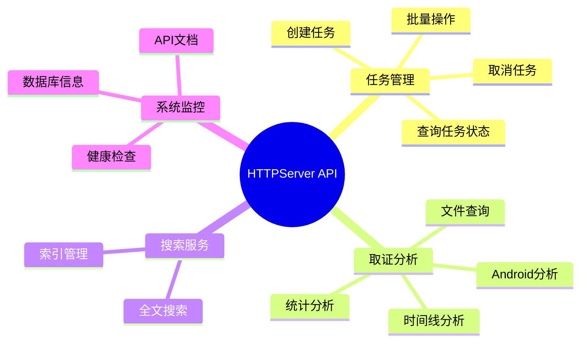
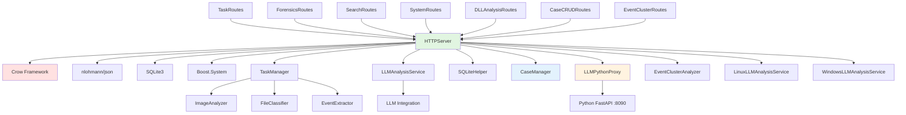
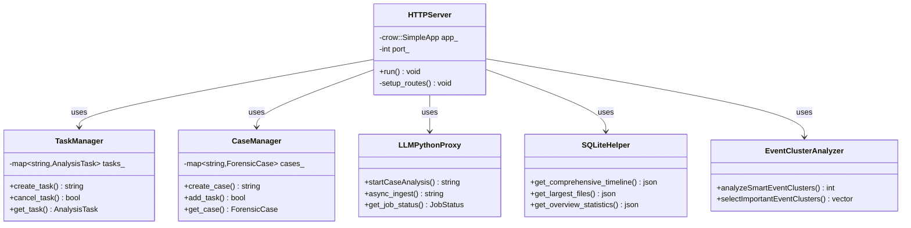
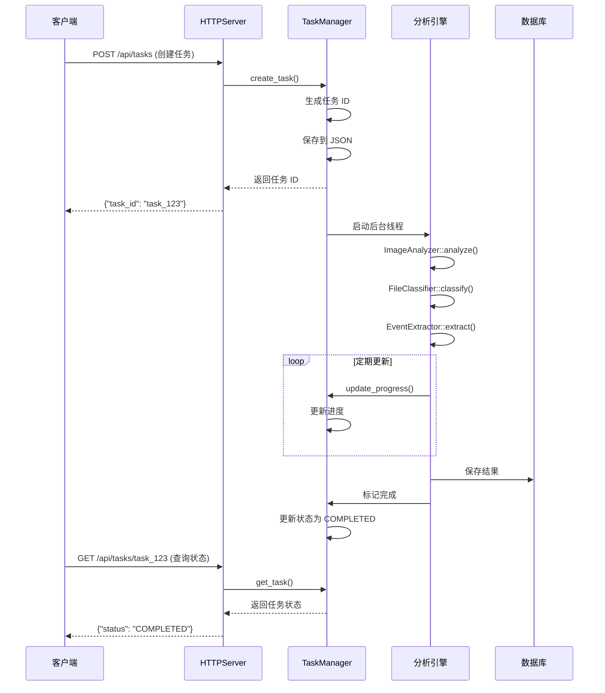

# HTTPServer 模块文档（C++）

## 1. 模块背景

### 业务背景

数字取证分析工具传统上通过命令行交互，但现代取证调查需要更友好的用户界面和远程访问能力。HTTPServer 模块将核心取证功能封装为 REST API，实现：

**核心需求**：
- **Web 界面支持**：提供基于浏览器的交互界面
- **远程访问**：支持分布式取证分析场景
- **任务管理**：异步执行长时间运行的分析任务
- **实时反馈**：提供分析进度和状态监控
- **API 集成**：支持与其他系统的集成

**解决挑战**：
- **并发处理**：多个用户同时提交分析任务
- **长时间运行**：大型镜像分析可能需要数小时
- **资源管理**：CPU、内存、磁盘的合理分配
- **状态同步**：前后端状态一致性
- **服务监控**：健康检查和依赖管理

**在整体架构中的定位**：
```
Web 前端 (React)
    ↓ HTTP/JSON
HTTPServer (C++ 端口 8080)
    ↓
┌───────────────────────────────────────┐
│  TaskManager (任务调度)                │
│  LLMAnalysisService (AI 分析)          │
│  Routes (API 端点)                     │
└───────────────────────────────────────┘
    ↓
核心分析引擎 (ImageAnalyzer, FileClassifier, etc.)
    ↓
SQLite 数据库 (_raw.db, _events.db, _files.db)
```

### 技术背景

**为什么选择 C++ HTTP 服务器？**

| 方案 | 优势 | 劣势 | 选择理由 |
|------|------|------|----------|
| **C++ Crow 框架** | 高性能、低延迟、轻量级 | 开发效率相对较低 | ✅ 核心分析已有 C++ 实现 |
| **Python FastAPI** | 开发快速、生态丰富 | 性能开销较大 | ✅ 用于 AI/知识图谱集成 |
| **Node.js** | 异步 I/O、前端技术栈 | 单线程限制 | ❌ 不适合 CPU 密集型任务 |

**技术栈选型**：

1. **Crow Framework**：
   - 类似 Flask 的路由语法
   - 内置多线程支持
   - C++17 兼容
   - 轻量级（仅头文件）

2. **异步任务管理**：
   - 基于 `std::thread` 的后台任务
   - SQLite JSON 持久化
   - 进度回调机制

3. **双服务器架构**：
   - C++ 服务器：核心取证分析（端口 8080）
   - Python 服务器：AI/知识图谱（端口 8090）
   - HTTP 代理通信

## 2. 模块功能

### 核心功能

#### 1. REST API 端点架构



**API 端点分类**：

| 类别 | 路由模块 | 端点数量 | 主要功能 |
|------|---------|---------|----------|
| **任务管理** | TaskRoutes (TaskCRUDRoutes, TaskBatchRoutes, TaskMonitoringRoutes) | 15+ | 任务 CRUD、进度跟踪、批量操作 |
| **案例管理** | CaseCRUDRoutes | 6+ | 案例 CRUD、跨镜像分析触发 |
| **取证分析** | ForensicsRoutes (TimelineRoutes, FileAnalysisRoutes, StatisticsRoutes, AndroidForensicsRoutes, ExportRoutes) | 35+ | 时间线、文件、统计、平台分析、导出 |
| **DLL 分析** | DLLAnalysisRoutes | 6+ | DLL 列表、可疑 DLL、详情、依赖 |
| **事件簇** | EventClusterRoutes | 3+ | 事件簇分析、列表、详情 |
| **搜索** | SearchRoutes | 3+ | 全文搜索、索引管理 |
| **OSS** | OSSRoutes (OSSAnalysisRoutes, OSSQueryRoutes, OSSStatsRoutes) | 10+ | OSS 存储分析 |
| **系统** | SystemRoutes (SystemHealthRoutes, SystemInfoRoutes, SystemDocsRoutes, SystemEventRoutes) | 15+ | 健康检查、数据库、文档、系统事件 |

#### 2. 异步任务管理系统

```cpp
// TaskManager 核心数据结构
enum class TaskStatus {
    PENDING,    // 等待执行
    RUNNING,    // 正在执行
    COMPLETED,  // 执行完成
    FAILED,     // 执行失败
    CANCELLED   // 已取消
};

enum class TaskPriority {
    LOW = 0,
    NORMAL = 1,
    HIGH = 2,
    CRITICAL = 3
};

struct AnalysisTask {
    std::string id;                      // 任务 ID
    std::string image_path;              // 镜像路径
    TaskStatus status;                   // 任务状态
    TaskProgress progress;               // 进度信息
    TaskPriority priority;               // 优先级
    std::string output_raw_db;           // 输出数据库路径
    bool android_analyze;                // 是否分析 Android
    XFSMode xfs_mode;                    // XFS 解析模式
    bool llm_analyze;                    // 是否 LLM 分析
    std::string case_description;        // 案例描述
    std::atomic<bool> cancellation_requested{false};  // 取消标志
};
```

**任务生命周期**：
```
PENDING → RUNNING → [COMPLETED | FAILED | CANCELLED]
```

#### 3. 任务进度跟踪

```cpp
struct TaskProgress {
    TaskPhase phase;              // 当前阶段
    int phase_percentage;         // 阶段进度（0-100）
    int overall_percentage;       // 总体进度（0-100）
    std::string phase_description; // 阶段描述
    std::chrono::system_clock::time_point start_time;
    std::chrono::system_clock::time_point estimated_end_time;
};

enum class TaskPhase {
    INITIALIZING,        // 初始化（权重 5%）
    IMAGE_ANALYSIS,      // 镜像分析（权重 25%）
    EVENT_EXTRACTION,    // 事件提取（权重 10%）
    FILE_CLASSIFICATION, // 文件分类（权重 15%）
    LLM_ANALYSIS,        // LLM 分析（权重 20%）
    PLATFORM_ANALYSIS,   // 平台分析 Android/Windows/Linux/Server（权重 20%）
    FILE_CARVING,        // 签名雕刻（权重 3%）
    FINALIZING           // 完成中（权重 2%）
};
```

**进度更新示例**：
```cpp
// 更新任务进度
TaskManager::instance().update_progress(
    task_id,
    TaskPhase::IMAGE_ANALYSIS,
    45,  // 阶段进度 45%
    "正在分析文件系统..."
);

// 总体进度由 TaskManager::calculate_overall_percentage 计算（TaskManager.cpp）：
// overall = 已完成阶段权重之和 + 当前阶段权重 × 阶段内百分比
// 例：IMAGE_ANALYSIS 45% → 5 + 25×0.45 = 16%
```

#### 4. LLM 分析服务集成

**双模式分析**：
```cpp
enum class LLMMode {
    FULL,   // 分析所有文件
    SMART   // LLM 选择重要文件分析
};

struct AnalysisOptions {
    size_t maxFiles = 1000;              // 最大文件数
    size_t maxContentLength = 10000;     // 最大内容长度
    std::vector<std::string> fileTypes;  // 文件类型过滤
    bool skipBinaryFiles = true;         // 跳过二进制文件
};

// FULL 模式：分析所有文件
llmService.analyzeAllFiles(filesDbPath, options, progressCallback);

// SMART 模式：先选择重要文件
auto importantFiles = llmService.selectImportantFiles(filesDbPath, 100);
llmService.analyzeSpecificFiles(importantFiles, options, progressCallback);
```

### 边界与限制

**功能边界**：
- ❌ 不支持 WebSocket（当前仅 HTTP）
- ❌ 不支持文件上传（通过本地路径访问）
- ❌ 不提供用户认证（需反向代理）
- ❌ 不支持分布式任务调度（单机模式）

**已知限制**：
| 限制 | 影响 | 缓解方法 |
|------|------|----------|
| 最大并发任务 | 默认 4 个 | 调整 `MAX_CONCURRENT_TASKS` |
| 任务超时 | 无超时限制 | 使用 `cancel_task` 手动取消 |
| 内存占用 | 每个任务约 500MB-2GB | 监控内存使用 |
| 文件路径 | 需要服务器本地路径 | 使用网络挂载 |

**性能指标**（参考配置：8核 CPU，32GB RAM）：
- API 响应时间：<100ms（查询类）
- 并发任务数：4 个（推荐）
- 任务吞吐量：2-3 个/小时（取决于镜像大小）
- 内存占用：约 500MB/任务

## 3. 模块使用的库

### 依赖库清单

| 库名称 | 版本 | 用途 | 许可证 | 官网 |
|--------|------|------|--------|------|
| **Crow** | 1.0+ | HTTP 服务器框架 | BSD-2-Clause | https://github.com/CrowCpp/Crow |
| **nlohmann/json** | 3.11.2+ | JSON 处理 | MIT | https://github.com/nlohmann/json |
| **SQLite3** | 3.35.0+ | 任务持久化 | Public Domain | https://www.sqlite.org/ |
| **Boost.System** | 1.74+ | 系统调用 | Boost License | https://www.boost.org/ |

### 依赖关系图



## 4. 模块实现方式

### 架构设计



### 核心类说明

#### HTTPServer（主服务器类）
**职责**：
- 管理 Crow 应用生命周期
- 配置路由和中间件
- 提供静态文件服务
- 处理 CORS 和错误响应

**关键方法**：
```cpp
class HTTPServer {
public:
    HTTPServer(asio::io_context& ioc);
    void run(int port = 8080);

private:
    void setup_routes();
    void setup_static_routes();
    bool serve_static_file(crow::response& res, const std::string& relative_path);
    std::string get_mime_type(const std::string& path);

    crow::SimpleApp app_;
    int port_;
};
```

#### TaskManager（任务管理器）
**职责**：
- 任务生命周期管理
- 优先级调度
- 进度跟踪
- 持久化存储

**线程安全**：
```cpp
class TaskManager {
public:
    static TaskManager& instance();

    // 线程安全的任务操作
    std::string create_task(const std::string& path, TaskPriority priority, ...);
    bool cancel_task(const std::string& id);
    AnalysisTask get_task(const std::string& id);

    // 进度更新（线程安全）
    void update_progress(const std::string& id, TaskPhase phase,
                        int phase_percentage, const std::string& description);

private:
    std::mutex tasks_mutex_;  // 保护 tasks_ 映射
    std::map<std::string, AnalysisTask> tasks_;
};
```

#### LLMAnalysisService（LLM 分析服务）
**职责**：
- AI 驱动的文件分析
- 重要文件选择
- 结果持久化

**注意**: 此类已弃用，新功能应使用 `LLMPythonProxy` 通过 Python 服务调用 LLM。

#### CaseManager（案例管理器）
**职责**：
- 将多个分析任务组织到一个取证案例中
- 支持跨镜像关联分析
- 案例级别的状态管理和持久化

**详细文档**: [CaseManager.md](./CaseManager.md)

#### LLMPythonProxy（Python 服务代理）
**职责**：
- C++ 与 Python FastAPI 服务之间的 HTTP 代理
- Graphiti 知识图谱摄取
- 案例分析任务管理
- 异步任务轮询

**详细文档**: [LLMPythonProxy.md](./LLMPythonProxy.md)

#### EventClusterAnalyzer（事件簇分析器）
**职责**：
- 使用 LLM 对时间线事件簇进行智能分析
- 识别重要事件模式
- 生成事件簇描述

**详细文档**: [EventClusterAnalyzer.md](./EventClusterAnalyzer.md)

#### SQLiteHelper（数据库查询助手）
**职责**：
- 提供 30+ 个静态方法用于数据库查询
- 时间线分析、文件分析、Android 取证、统计分析
- 事件导出（JSON/CSV/可视化）

**详细文档**: [SQLiteHelper.md](./SQLiteHelper.md)

#### LinuxLLMAnalysisService / WindowsLLMAnalysisService
**职责**：
- 平台特定工件的 LLM 分析
- 30+ 种 Linux 工件类型 / 15 种 Windows 工件类型
- 生成工件的摘要、描述和关键词

**详细文档**: [LinuxLLMAnalysisService.md](./LinuxLLMAnalysisService.md), [WindowsLLMAnalysisService.md](./WindowsLLMAnalysisService.md)

#### 任务基础设施组件
- **TaskAnalysisRunner**: 执行分析任务，跟踪进度
- **TaskPersistence**: JSON 文件持久化
- **TaskSerialization**: JSON 序列化/反序列化
- **TaskWatchdog**: 检测停滞任务

**详细文档**: [TaskInfrastructure.md](./TaskInfrastructure.md)

### 关键流程



### 数据结构

**任务持久化格式**（JSON）：
```json
{
  "id": "task_abc123",
  "image_path": "/path/to/evidence.E01",
  "status": "RUNNING",
  "priority": "HIGH",
  "progress": {
    "phase": "IMAGE_ANALYSIS",
    "phase_percentage": 45,
    "overall_percentage": 18,
    "phase_description": "正在分析文件系统..."
  },
  "output_raw_db": "/output/evidence_raw.db",
  "output_events_db": "/output/evidence_events.db",
  "output_files_db": "/output/evidence_files.db",
  "android_analyze": true,
  "xfs_mode": "auto",
  "llm_analyze": true,
  "llm_mode": "smart",
  "case_description": "欺诈调查案例",
  "start_time": "2024-01-01T10:00:00Z",
  "cancellation_requested": false
}
```

## 5. API 调用

### REST API 端点

#### 任务管理端点

```bash
# 创建分析任务
curl -X POST http://localhost:8080/api/tasks \
  -H "Content-Type: application/json" \
  -d '{
    "image_path": "/path/to/evidence.E01",
    "priority": "HIGH",
    "android_analyze": true,
    "llm_analyze": true,
    "llm_mode": "smart",
    "case_description": "欺诈调查案例",
    "xfs_mode": "auto"
  }'

# 响应
{
  "success": true,
  "task_id": "task_abc123",
  "status": "PENDING",
  "message": "任务已创建"
}

# 查询任务状态
curl http://localhost:8080/api/tasks/task_abc123

# 响应
{
  "success": true,
  "task": {
    "id": "task_abc123",
    "status": "RUNNING",
    "progress": {
      "phase": "IMAGE_ANALYSIS",
      "phase_percentage": 45,
      "overall_percentage": 18,
      "phase_description": "正在分析文件系统..."
    },
    "start_time": "2024-01-01T10:00:00Z",
    "estimated_completion": "2024-01-01T12:30:00Z"
  }
}

# 取消任务
curl -X DELETE http://localhost:8080/api/tasks/task_abc123

# 列出所有任务
curl http://localhost:8080/api/tasks/list?status=RUNNING&limit=10

# 任务统计
curl http://localhost:8080/api/tasks/statistics
```

#### 取证分析端点

```bash
# 获取完整时间线
curl "http://localhost:8080/api/forensics/timeline?task_id=task_abc123&limit=1000"

# 时间线分布统计
curl "http://localhost:8080/api/forensics/timeline/distribution?task_id=task_abc123"

# 文件活动分析
curl "http://localhost:8080/api/forensics/timeline/file-activity?task_id=task_abc123&inode=12345"

# 可疑模式检测
curl "http://localhost:8080/api/forensics/timeline/suspicious-patterns?task_id=task_abc123"

# 获取最大文件
curl "http://localhost:8080/api/forensics/files/largest?task_id=task_abc123&limit=20"

# 获取最近文件
curl "http://localhost:8080/api/forensics/files/recent?task_id=task_abc123&hours=24"

# Android 通信摘要
curl "http://localhost:8080/api/forensics/android/communication?task_id=task_abc123"

# 统计概览
curl "http://localhost:8080/api/forensics/statistics/overview?task_id=task_abc123"
```

#### 搜索端点

```bash
# 全文搜索
curl -X POST http://localhost:8080/api/search/fulltext \
  -H "Content-Type: application/json" \
  -d '{
    "query": "malware AND trojan",
    "task_id": "task_abc123",
    "limit": 100
  }'
```

#### 系统端点

```bash
# 健康检查
curl http://localhost:8080/api/system/health

# 存活探针（Kubernetes）
curl http://localhost:8080/api/system/health/live

# 就绪探针（Kubernetes）
curl http://localhost:8080/api/system/health/ready

# 系统信息
curl http://localhost:8080/api/system/info

# 可用数据库
curl http://localhost:8080/api/system/databases?task_id=task_abc123

# 数据库 Schema
curl http://localhost:8080/api/system/databases/raw_db/schema

# API 端点列表
curl http://localhost:8080/api/docs/endpoints
```

### API 参数说明

#### 任务创建参数

| 参数名 | 类型 | 必填 | 默认值 | 说明 |
|--------|------|------|--------|------|
| `image_path` | string | ✅ | - | 磁盘镜像路径 |
| `priority` | string | ❌ | NORMAL | LOW/NORMAL/HIGH/CRITICAL |
| `android_analyze` | boolean | ❌ | false | 是否分析 Android |
| `llm_analyze` | boolean | ❌ | false | 是否 LLM 分析 |
| `llm_mode` | string | ❌ | smart | smart/full |
| `xfs_mode` | string | ❌ | auto | auto/native/pure |
| `case_description` | string | ❌ | - | 案例描述 |

### 返回值说明

**标准成功响应**：
```json
{
  "success": true,
  "data": { /* 响应数据 */ },
  "execution_time_ms": 45
}
```

**标准错误响应**：
```json
{
  "success": false,
  "error": "错误消息",
  "error_code": "TASK_NOT_FOUND",
  "timestamp": "2024-01-01T10:00:00Z"
}
```

## 6. 二次开发

### 扩展点

#### 1. 添加新的 API 端点

**位置**：创建新的路由文件或扩展现有路由

**示例**：添加批量文件导出端点

```cpp
// routes/ExportRoutes.h
#pragma once
#include <crow.h>
#include "../HTTPserver.h"

class ExportRoutes {
public:
    static void register_routes(crow::SimpleApp& app, HTTPServer* server) {

        // 批量导出文件
        CROW_ROUTE(app, "/api/export/files/batch").methods("POST"_method)(
            [server](const crow::request& req) {
                try {
                    auto json_data = crow::json::load(req.body);

                    std::string task_id = json_data["task_id"].s();
                    std::vector<std::string> file_ids;
                    std::string output_format = json_data["format"].s();  // zip/tar

                    // 验证任务
                    auto task = TaskManager::instance().get_task(task_id);
                    if (task.id.empty()) {
                        return crow::response(404, R"({"success": false, "error": "Task not found"})");
                    }

                    // 创建后台导出任务
                    std::string export_id = start_batch_export(task_id, file_ids, output_format);

                    crow::json::wvalue response;
                    response["success"] = true;
                    response["export_id"] = export_id;
                    response["status"] = "PENDING";

                    return crow::response(response);

                } catch (const std::exception& e) {
                    return crow::response(500, R"({"success": false, "error": ")" + std::string(e.what()) + R"("})");
                }
            }
        );

        // 查询导出状态
        CROW_ROUTE(app, "/api/export/<string>/status").methods("GET"_method)(
            [server](const crow::request& req, const std::string& export_id) {
                auto status = get_export_status(export_id);

                crow::json::wvalue response;
                response["success"] = true;
                response["export_id"] = export_id;
                response["status"] = status.status;
                response["progress"] = status.progress;
                response["output_path"] = status.output_path;

                return crow::response(response);
            }
        );
    }

private:
    static std::string start_batch_export(const std::string& task_id,
                                          const std::vector<std::string>& file_ids,
                                          const std::string& format);
    static ExportStatus get_export_status(const std::string& export_id);
};
```

**注册路由**：
```cpp
// HTTPserver.cpp
void HTTPServer::setup_routes() {
    // 现有路由...
    TaskRoutes::register_routes(app_, this);
    ForensicsRoutes::register_routes(app_, this);

    // 新增导出路由
    ExportRoutes::register_routes(app_, this);
}
```

#### 2. 自定义任务类型

**位置**：扩展 TaskManager

**示例**：添加专门的视频分析任务

```cpp
// TaskManager.h
enum class TaskType {
    DEFAULT_ANALYSIS,
    VIDEO_ANALYSIS,     // 新增
    EMAIL_ANALYSIS,     // 新增
    NETWORK_FORENSICS   // 新增
};

struct VideoAnalysisTask : public AnalysisTask {
    TaskType task_type = TaskType::VIDEO_ANALYSIS;
    std::string target_directory;  // 分析特定目录
    std::vector<std::string> video_codecs;  // 目标编码格式
    bool extract_frames = false;
    int frame_interval = 10;  // 每 N 帧提取一帧
};

// TaskManager.cpp
std::string TaskManager::create_video_analysis_task(
    const std::string& imagePath,
    const std::string& targetDirectory,
    const std::vector<std::string>& codecs) {

    std::unique_lock<std::mutex> lock(tasks_mutex_);

    VideoAnalysisTask task;
    task.id = generate_task_id();
    task.task_type = TaskType::VIDEO_ANALYSIS;
    task.image_path = imagePath;
    task.target_directory = targetDirectory;
    task.video_codecs = codecs;
    task.status = TaskStatus::PENDING;

    tasks_[task.id] = task;
    save_tasks_to_disk();

    // 启动专用分析线程
    std::thread([this, task]() {
        run_video_analysis(static_cast<const VideoAnalysisTask&>(task));
    }).detach();

    return task.id;
}

void TaskManager::run_video_analysis(const VideoAnalysisTask& task) {
    try {
        update_progress(task.id, TaskPhase::INITIALIZING, 0, "初始化视频分析...");

        // 1. 提取视频文件
        std::vector<FileRecord> videoFiles = extract_video_files(task);

        update_progress(task.id, TaskPhase::IMAGE_ANALYSIS, 20, "分析视频元数据...");

        // 2. 分析视频元数据
        for (const auto& file : videoFiles) {
            analyze_video_metadata(file);

            if (task.extract_frames) {
                extract_frames(file, task.frame_interval);
            }

            // 检查取消
            if (tasks_[task.id].cancellation_requested) {
                tasks_[task.id].status = TaskStatus::CANCELLED;
                return;
            }
        }

        tasks_[task.id].status = TaskStatus::COMPLETED;
        update_progress(task.id, TaskPhase::FINALIZING, 100, "分析完成");

    } catch (const std::exception& e) {
        tasks_[task.id].status = TaskStatus::FAILED;
        LOG_ERROR("视频分析失败: " + std::string(e.what()));
    }
}
```

#### 3. 中间件扩展

**位置**：在 HTTPServer 中添加中间件

**示例**：添加请求日志中间件

```cpp
// HTTPserver.cpp
void HTTPServer::setup_routes() {
    // 请求日志中间件
    app_.loglevel(crow::LogLevel::Info);

    // 自定义日志中间件
    app_.middleware([&](crow::request& req, crow::response& res, crow::next_handler_t next) {
        auto start = std::chrono::high_resolution_clock::now();

        // 调用下一个处理器
        next(req);

        // 记录请求
        auto end = std::chrono::high_resolution_clock::now();
        auto duration = std::chrono::duration_cast<std::chrono::milliseconds>(end - start);

        LOG_INFO(req.remote_address + " " +
                std::string(req.method) + " " +
                req.url + " - " +
                std::to_string(res.code) + " - " +
                std::to_string(duration.count()) + "ms");
    });

    // 其他路由设置...
}
```

### 添加新功能的步骤

#### 完整示例：添加实时通知功能

**步骤 1：定义通知数据结构**
```cpp
// HTTPServerDataTypes.h
struct NotificationMessage {
    std::string id;
    std::string type;  // "task_update", "analysis_complete", "error"
    std::string title;
    std::string message;
    nlohmann::json data;
    std::chrono::system_clock::time_point timestamp;
};
```

**步骤 2：实现通知管理器**
```cpp
// NotificationManager.h
#pragma once
#include <vector>
#include <queue>
#include <mutex>
#include "HTTPServerDataTypes.h"

class NotificationManager {
public:
    static NotificationManager& instance();

    // 发布通知
    void publish(const NotificationMessage& message);

    // 订阅通知（按任务 ID）
    std::vector<NotificationMessage> get_notifications(const std::string& task_id, size_t limit = 100);

    // 清理旧通知
    void cleanup_old_notifications(size_t keep_last = 1000);

private:
    std::mutex notifications_mutex_;
    std::deque<NotificationMessage> notifications_;
    std::map<std::string, std::vector<size_t>> task_notifications_;  // task_id -> indices
};
```

**步骤 3：集成到任务流程**
```cpp
// TaskManager.cpp
void TaskManager::update_progress(const std::string& id, TaskPhase phase,
                                int phase_percentage, const std::string& description) {
    std::unique_lock<std::mutex> lock(tasks_mutex_);

    // 更新任务进度
    auto& task = tasks_[id];
    task.progress.phase = phase;
    task.progress.phase_percentage = phase_percentage;
    task.progress.phase_description = description;

    // 发布进度通知
    NotificationMessage notification;
    notification.id = generate_notification_id();
    notification.type = "task_progress";
    notification.title = "任务进度更新";
    notification.message = description;
    notification.data = {
        {"task_id", id},
        {"phase", task_phase_to_string(phase)},
        {"percentage", phase_percentage}
    };
    notification.timestamp = std::chrono::system_clock::now();

    NotificationManager::instance().publish(notification);
}
```

**步骤 4：添加通知 API 端点**
```cpp
// routes/SystemRoutes.cpp
CROW_ROUTE(app, "/api/notifications/<string>").methods("GET"_method)(
    [](const crow::request& req, const std::string& task_id) {
        size_t limit = 100;

        // 解析查询参数
        auto limit_str = req.url_params.get("limit");
        if (!limit_str.empty()) {
            limit = std::stoul(limit_str);
        }

        auto notifications = NotificationManager::instance().get_notifications(task_id, limit);

        crow::json::wvalue response;
        response["success"] = true;
        response["notifications"] = crow::json::wvalue::array();

        for (size_t i = 0; i < notifications.size(); ++i) {
            response["notifications"][i]["id"] = notifications[i].id;
            response["notifications"][i]["type"] = notifications[i].type;
            response["notifications"][i]["title"] = notifications[i].title;
            response["notifications"][i]["message"] = notifications[i].message;
            response["notifications"][i]["data"] = crow::json::load(notifications[i].data.dump());
        }

        return crow::response(response);
    }
);
```

### 代码示例

#### 完整的自定义路由模块

```cpp
// routes/CustomRoutes.h
#pragma once
#include <crow.h>
#include "../HTTPserver.h"

class CustomRoutes {
public:
    static void register_routes(crow::SimpleApp& app, HTTPServer* server) {

        // 自定义分析端点
        CROW_ROUTE(app, "/api/custom/analyze").methods("POST"_method)(
            [server](const crow::request& req) {
                try {
                    auto json_data = crow::json::load(req.body);
                    std::string task_id = json_data["task_id"].s();
                    std::string analysis_type = json_data["analysis_type"].s();

                    // 根据类型执行不同分析
                    nlohmann::json result;
                    if (analysis_type == "file_entropy") {
                        result = analyze_file_entropy(task_id);
                    } else if (analysis_type == "timeline_gaps") {
                        result = detect_timeline_gaps(task_id);
                    } else if (analysis_type == "suspicious_names") {
                        result = detect_suspicious_names(task_id);
                    } else {
                        return crow::response(400, R"({"success": false, "error": "Unknown analysis type"})");
                    }

                    crow::json::wvalue response;
                    response["success"] = true;
                    response["result"] = crow::json::load(result.dump());

                    return crow::response(response);

                } catch (const std::exception& e) {
                    return crow::response(500, R"({"success": false, "error": ")" + std::string(e.what()) + R"("})");
                }
            }
        );

    }

private:
    static nlohmann::json analyze_file_entropy(const std::string& task_id) {
        // 获取任务文件数据库路径
        auto task = TaskManager::instance().get_task(task_id);
        std::string filesDbPath = task.output_files_db;

        // 计算文件熵
        nlohmann::json result;
        result["analysis_type"] = "file_entropy";
        result["files"] = nlohmann::json::array();

        sqlite3* db;
        sqlite3_open(filesDbPath.c_str(), &db);

        const char* query = "SELECT path, size FROM files WHERE size > 0 LIMIT 100";
        sqlite3_stmt* stmt;
        sqlite3_prepare_v2(db, query, -1, &stmt, nullptr);

        while (sqlite3_step(stmt) == SQLITE_ROW) {
            const char* path = reinterpret_cast<const char*>(sqlite3_column_text(stmt, 0));
            int64_t size = sqlite3_column_int64(stmt, 1);

            // 计算熵（简化示例）
            double entropy = calculate_file_entropy(path);

            nlohmann::json file_info;
            file_info["path"] = path;
            file_info["size"] = size;
            file_info["entropy"] = entropy;
            file_info["is_suspicious"] = entropy > 7.8;

            result["files"].push_back(file_info);
        }

        sqlite3_finalize(stmt);
        sqlite3_close(db);

        return result;
    }

    static double calculate_file_entropy(const std::string& path) {
        // 简化的熵计算示例
        // 实际实现需要读取文件内容
        return 6.5 + (rand() % 20) / 10.0;  // 6.5 - 8.5
    }

    static nlohmann::json detect_timeline_gaps(const std::string& task_id) {
        // 检测时间线中的异常间隔
        nlohmann::json result;
        result["analysis_type"] = "timeline_gaps";
        result["gaps"] = nlohmann::json::array();

        // 实现逻辑...
        return result;
    }

    static nlohmann::json detect_suspicious_names(const std::string& task_id) {
        // 检测可疑文件名
        static const std::vector<std::string> suspicious_patterns = {
            "hack", "crack", "trojan", "virus",
            "malware", "spyware", "keylog"
        };

        nlohmann::json result;
        result["analysis_type"] = "suspicious_names";
        result["suspicious_files"] = nlohmann::json::array();

        // 实现逻辑...
        return result;
    }
};
```

### 最佳实践

#### 性能优化

**1. 数据库连接池**：
```cpp
// SQLiteHelper.h
class SQLiteConnectionPool {
public:
    static SQLiteConnectionPool& instance(size_t pool_size = 10) {
        static SQLiteConnectionPool pool(pool_size);
        return pool;
    }

    sqlite3* get_connection() {
        std::unique_lock<std::mutex> lock(mutex_);
        while (connections_.empty()) {
            cv_.wait(lock);
        }
        auto conn = connections_.front();
        connections_.pop();
        return conn;
    }

    void return_connection(sqlite3* conn) {
        std::lock_guard<std::mutex> lock(mutex_);
        connections_.push(conn);
        cv_.notify_one();
    }

private:
    std::queue<sqlite3*> connections_;
    std::mutex mutex_;
    std::condition_variable cv_;
};
```

**2. 响应压缩**：
```cpp
// HTTPserver.cpp
void compress_response(crow::response& res, const std::string& body) {
    // 检查客户端是否支持 gzip
    std::string accept_encoding = req.get_header_value("Accept-Encoding");
    if (accept_encoding.find("gzip") != std::string::npos) {
        // 压缩响应体
        std::string compressed = gzip_compress(body);
        res.body = compressed;
        res.set_header("Content-Encoding", "gzip");
    } else {
        res.body = body;
    }
}
```

#### 常见陷阱

**1. 线程安全**：
```cpp
// 错误：直接访问共享资源
static std::map<std::string, AnalysisTask> tasks;
tasks[id] = task;  // 竞争条件！

// 正确：使用互斥锁
static std::map<std::string, AnalysisTask> tasks;
static std::mutex tasks_mutex;

{
    std::lock_guard<std::mutex> lock(tasks_mutex);
    tasks[id] = task;
}
```

**2. 资源泄漏**：
```cpp
// 错误：忘记释放语句
sqlite3_stmt* stmt;
sqlite3_prepare_v2(db, query, -1, &stmt, nullptr);
sqlite3_step(stmt);
// 忘记 sqlite3_finalize(stmt);

// 正确：使用 RAII
struct StmtGuard {
    sqlite3_stmt* stmt;
    explicit StmtGuard(sqlite3_stmt* s) : stmt(s) {}
    ~StmtGuard() { if (stmt) sqlite3_finalize(stmt); }
};

StmtGuard guard(stmt);
```

#### 调试技巧

**1. 请求日志**：
```cpp
// 记录所有请求
app_.loglevel(crow::LogLevel::Debug);

// 自定义日志
CROW_ROUTE(app, "/api/debug").methods("GET"_method)(
    [](const crow::request& req) {
        std::ostringstream log;
        log << "Request:\n";
        log << "  Method: " << req.method << "\n";
        log << "  URL: " << req.url << "\n";
        log << "  Headers:\n";
        for (auto& header : req.headers) {
            log << "    " << header.first << ": " << header.second << "\n";
        }
        LOG_DEBUG(log.str());
        return crow::response(200, R"({"success": true})");
    }
);
```

## 7. 其他

### 测试

**单元测试位置**：
```
tests/UnitTest/test_http_server_gtest.cpp
tests/UnitTest/test_task_manager_gtest.cpp
```

### 配置

**环境变量**：
```env
# 服务器配置
HTTP_PORT=8080
HTTP_HOST=0.0.0.0
MAX_CONCURRENT_TASKS=4

# 任务配置
TASK_TIMEOUT_MS=3600000  # 1 小时
TASK_CHECK_INTERVAL_MS=5000

# 日志配置
LOG_LEVEL=INFO
LOG_REQUESTS=true
```

### 故障排查

| 问题 | 可能原因 | 解决方法 |
|------|----------|----------|
| **无法启动** | 端口被占用 | 更换端口或终止占用进程 |
| **任务卡住** | 分析线程死锁 | 重启服务 |
| **内存不足** | 并发任务过多 | 减少 MAX_CONCURRENT_TASKS |
| **响应慢** | 数据库查询慢 | 添加索引 |

### 相关模块

- **[TaskManager](./TaskManager.md)** - 任务管理核心
- **[LLMAnalysisService](./LLMAnalysisService.md)** - LLM 分析服务
- **[TaskRoutes](./routes/TaskRoutes.md)** - 任务路由
- **[ForensicsRoutes](./routes/ForensicsRoutes.md)** - 取证路由

### 参考资源

- [Crow Framework 文档](https://crow.github.io/)
- [REST API 设计最佳实践](https://restfulapi.net/)

### 变更历史

| 版本 | 日期 | 变更内容 | 作者 |
|------|------|----------|------|
| 1.0.0 | 2024-02-01 | 初始版本 | Forensics Team |
| 1.1.0 | 2024-05-15 | 添加批量操作 | Forensics Team |
| 1.2.0 | 2024-08-20 | 性能优化 | Forensics Team |

---

**最后更新**: 2026-05-19
**维护者**: ymj68520
