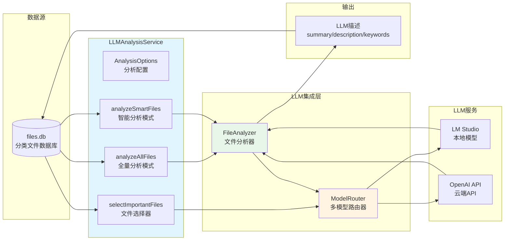
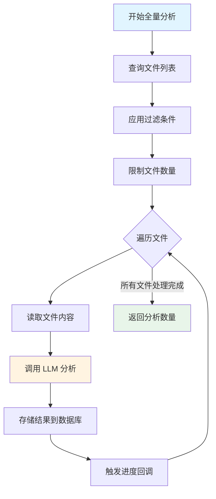
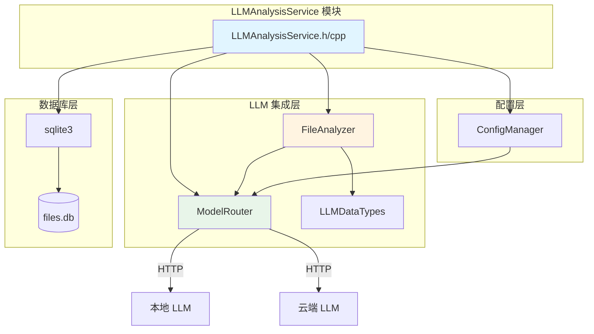
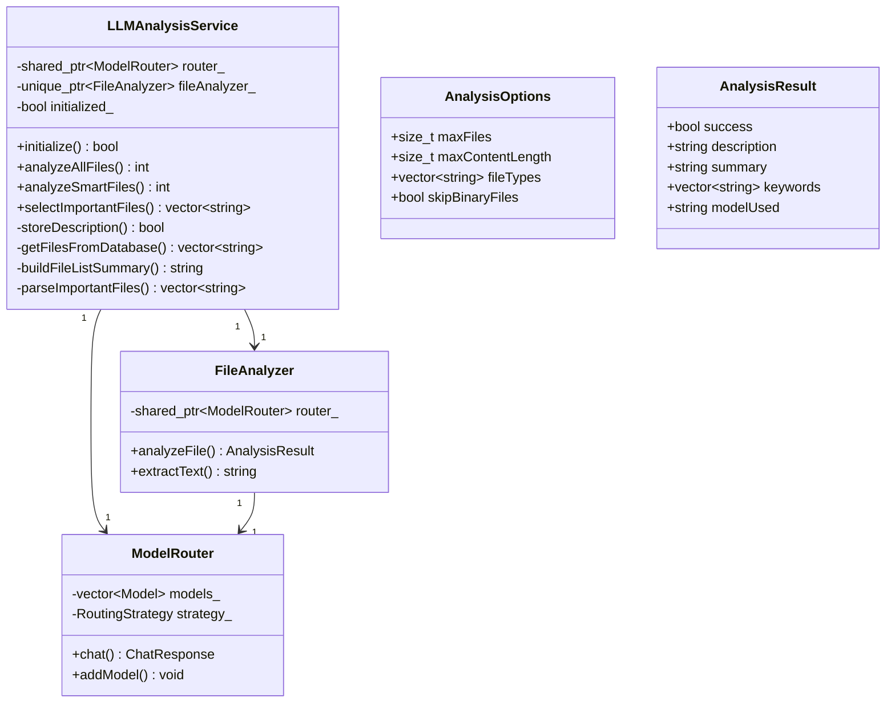

# LLMAnalysisService - LLM 文件分析服务模块

> **模块定位**: 提供基于 LLM 的智能文件分析服务，为取证文件生成描述、摘要和关键词，支持 FULL 和 SMART 两种分析模式
>
> **注意**: 此模块的直接 LLM 调用功能已弃用。新功能应使用 [LLMPythonProxy](./LLMPythonProxy.md) 通过 Python 服务调用 LLM。本模块保留以兼容现有代码。

---

## 1. 模块背景

### 业务背景

在数字取证分析中，磁盘镜像可能包含成千上万甚至数十万个文件。取证分析师需要：

1. **快速识别关键文件**：从海量文件中找出具有重要证据价值的文件
2. **文件内容理解**：了解文件的用途、内容和关联关系
3. **自动化描述生成**：为每个文件生成人类可读的描述
4. **智能筛选**：根据案件背景自动选择需要优先分析的文件

传统的文件分类只能基于扩展名和路径规则，无法理解文件内容。LLM（大语言模型）的引入使得：

- **内容理解**：LLM 可以读取文件内容并理解其语义
- **智能筛选**：LLM 可以根据案件上下文判断文件重要性
- **描述生成**：LLM 可以为文件生成自然语言描述
- **关键词提取**：LLM 可以提取文件中的关键信息

### 技术背景

LLMAnalysisService 是连接取证数据库和 LLM 能力的桥梁：



**两种分析模式**：

| 模式 | 适用场景 | 优势 | 劣势 |
|------|---------|------|------|
| **FULL** | 小规模镜像（<1000 文件） | 不遗漏任何文件 | 耗时长、成本高 |
| **SMART** | 大规模镜像（>1000 文件） | 聚焦重要文件、高效 | 可能遗漏低优先级文件 |

**技术选型理由**：

- **ModelRouter 抽象**：支持多模型切换和负载均衡
- **FileAnalyzer 封装**：统一的文件分析接口
- **SQLite 直接更新**：分析结果直接写入数据库，避免内存开销
- **进度回调机制**：实时报告分析进度
- **降级策略**：LLM 失败时回退到前 N 个文件

---

## 2. 模块功能

### 核心功能

#### 2.1 全量分析模式（FULL）

分析所有符合条件的文件，不进行筛选：

```cpp
int analyzeAllFiles(
    const std::string& filesDbPath,      // _files.db 路径
    const AnalysisOptions& options,      // 分析配置
    ProgressCallback progressCallback    // 进度回调
);
```

**流程**：



#### 2.2 智能分析模式（SMART）

两阶段分析：先让 LLM 选择重要文件，再分析这些文件：

```cpp
int analyzeSmartFiles(
    const std::string& filesDbPath,
    const AnalysisOptions& options,
    ProgressCallback progressCallback
);
```

**流程**：

```mermaid
flowchart TD
    subgraph 第一阶段：文件选择
        A1[获取所有文件列表] --> A2[构建文件摘要]
        A2 --> A3[发送给 LLM]
        A3 --> A4[解析重要文件列表]
        A4 --> A5{成功?}
        A5 -->|是| B1[进入第二阶段]
        A5 -->|否| A6[降级：前N个文件]
        A6 --> B1
    end

    subgraph 第二阶段：文件分析
        B1[遍历重要文件] --> B2[读取文件内容]
        B2 --> B3[调用 LLM 分析]
        B3 --> B4[存储结果]
        B4 --> B5{还有文件?}
        B5 -->|是| B1
        B5 -->|否| End[返回分析数量]
    end

    style A3 fill:#fff4e1
    style B3 fill:#fff4e1
    style End fill:#e8f5e9
```

#### 2.3 文件筛选配置

```cpp
struct AnalysisOptions {
    size_t maxFiles = 1000;                    // 最大文件数
    size_t maxContentLength = 10000;           // 每个文件最大内容长度（字符）
    std::vector<std::string> fileTypes;        // 文件类型筛选（空=全部）
    bool skipBinaryFiles = true;                // 跳过二进制文件
};
```

**筛选逻辑**：

```cpp
std::vector<std::string> getFilesFromDatabase(
    const std::string& dbPath,
    const AnalysisOptions& options
) {
    // SQL 查询构建
    std::string sql = "SELECT path FROM files";

    std::vector<std::string> conditions;

    // 文件类型筛选
    if (!options.fileTypes.empty()) {
        std::stringstream ss;
        ss << "category IN (";
        for (size_t i = 0; i < options.fileTypes.size(); ++i) {
            if (i > 0) ss << ",";
            ss << "'" << options.fileTypes[i] << "'";
        }
        ss << ")";
        conditions.push_back(ss.str());
    }

    // 跳过二进制文件
    if (options.skipBinaryFiles) {
        conditions.push_back("category NOT IN ('Executables', 'Unknown Files')");
    }

    // 应用条件
    if (!conditions.empty()) {
        sql += " WHERE ";
        for (size_t i = 0; i < conditions.size(); ++i) {
            if (i > 0) sql += " AND ";
            sql += conditions[i];
        }
    }

    // 限制数量
    sql += " LIMIT " + std::to_string(options.maxFiles);

    // ... 执行查询 ...
}
```

#### 2.4 进度回调

```cpp
using ProgressCallback = std::function<void(
    int current,           // 当前文件序号（1-based）
    int total,             // 总文件数
    const std::string& currentFile  // 当前文件路径
)>;
```

**使用示例**：

```cpp
llmService.analyzeAllFiles(dbPath, options,
    [](int current, int total, const std::string& file) {
        std::cout << "[" << current << "/" << total << "] "
                  << file << std::endl;
    }
);
```

### 边界与限制

| 限制项 | 限制值 | 说明 |
|-------|--------|------|
| **单次分析文件数** | 默认 1000 | 可通过 `maxFiles` 调整 |
| **文件内容长度** | 默认 10000 字符 | 超过截断，避免超出上下文窗口 |
| **并发分析数** | 1 | 单线程顺序分析，避免 LLM API 限流 |
| **支持文件类型** | 13 种 | 基于 FileClassifier 分类 |
| **二进制文件** | 默认跳过 | 可通过 `skipBinaryFiles=false` 包含 |
| **SMART 模式选择** | 默认 100 个 | LLM 返回的重要文件列表 |

**不支持的功能**：

- ❌ 不支持并行分析（串行处理）
- ❌ 不支持增量更新（覆盖已有分析结果）
- ❌ 不支持自定义 Prompt（固定模板）
- ❌ 不支持多模型并行（按顺序尝试模型）

---

## 3. 模块使用的库

### 依赖库清单

```cpp
// 标准库
#include <string>              // 字符串
#include <vector>              // 动态数组
#include <functional>          // 函数对象
#include <memory>              // 智能指针
#include <filesystem>          // 文件系统
#include <sstream>             // 字符串流
#include <algorithm>           // 算法
#include <ctime>               // 时间

// 第三方库
#include <sqlite3.h>           // SQLite3 数据库
#include <nlohmann/json.hpp>   // JSON（通过其他模块）

// 内部模块
#include "LLMIntegration/LLMDataTypes.h"       // LLM 数据类型
#include "LLMIntegration/FileAnalyzer.h"         // 文件分析器
#include "LLMIntegration/ModelRouter.h"          // 模型路由器
#include "ConfigManager/ConfigManager.h"         // 配置管理
#include "DatabaseManager/SQL/file_classifier_sql.h"  // SQL 语句
```

### 依赖关系图



**关键依赖说明**：

1. **FileAnalyzer**：核心文件分析组件，封装 LLM 调用逻辑
2. **ModelRouter**：多模型路由器，支持负载均衡和故障转移
3. **SQLite3**：直接操作数据库，更新 LLM 分析结果
4. **ConfigManager**：加载 LLM 配置（API 端点、模型名称等）

---

## 4. 模块实现方式

### 架构设计



### 核心类说明

#### 4.1 LLMAnalysisService 类

LLM 分析服务主类。

**成员变量**：

```cpp
class LLMAnalysisService {
private:
    std::shared_ptr<llm::ModelRouter> router_;        // 模型路由器
    std::unique_ptr<llm::FileAnalyzer> fileAnalyzer_; // 文件分析器
    bool initialized_;                                 // 初始化标志
};
```

**核心方法**：

```cpp
class LLMAnalysisService {
public:
    // 初始化
    bool initialize();

    // 全量分析模式
    int analyzeAllFiles(
        const std::string& filesDbPath,
        const AnalysisOptions& options,
        ProgressCallback progressCallback = nullptr
    );

    // 智能分析模式
    int analyzeSmartFiles(
        const std::string& filesDbPath,
        const AnalysisOptions& options,
        ProgressCallback progressCallback = nullptr
    );

    // 文件选择（SMART 模式第一阶段）
    std::vector<std::string> selectImportantFiles(
        const std::string& filesDbPath,
        size_t maxFiles = 100
    );

private:
    // 存储分析结果到数据库
    bool storeDescription(
        const std::string& dbPath,
        const std::string& filePath,
        const std::string& description,
        const std::string& summary,
        const std::vector<std::string>& keywords,
        const std::string& modelUsed
    );

    // 从数据库获取文件列表
    std::vector<std::string> getFilesFromDatabase(
        const std::string& dbPath,
        const AnalysisOptions& options
    );

    // 构建文件列表摘要
    std::string buildFileListSummary(const std::vector<std::string>& files);

    // 解析 LLM 返回的重要文件列表
    std::vector<std::string> parseImportantFiles(
        const std::string& llmResponse,
        const std::vector<std::string>& allFiles
    );
};
```

#### 4.2 AnalysisOptions 结构

分析配置选项。

```cpp
struct AnalysisOptions {
    size_t maxFiles = 1000;                 // 最大文件数
    size_t maxContentLength = 10000;        // 每个文件最大内容长度
    std::vector<std::string> fileTypes;    // 文件类型筛选
    bool skipBinaryFiles = true;            // 跳过二进制文件
};
```

**使用示例**：

```cpp
// 分析所有文档文件
AnalysisOptions opts;
opts.maxFiles = 500;
opts.fileTypes = {"Documents", "System Files", "Web Files"};
opts.skipBinaryFiles = true;
opts.maxContentLength = 5000;

llmService.analyzeAllFiles("/data/case_files.db", opts);
```

### 关键流程

#### 4.1 初始化流程

```cpp
bool LLMAnalysisService::initialize() {
    try {
        // 1. 加载配置
        auto& configManager = ConfigManager::instance();
        if (!configManager.isLoaded()) {
            configManager.load();
        }

        // 2. 获取文本模型配置
        auto config = configManager.getTextModelConfig();

        // 3. 创建模型路由器
        router_ = std::make_shared<llm::ModelRouter>();
        router_->addModel("default", config, llm::ModelInfo{
            "default",
            "text",
            {llm::ModelCapability::TextGeneration, llm::ModelCapability::Analysis}
        });

        // 4. 创建文件分析器
        fileAnalyzer_ = std::make_unique<llm::FileAnalyzer>(router_);

        // 5. 标记为已初始化
        initialized_ = true;

        return true;
    } catch (const std::exception& e) {
        std::cerr << "Failed to initialize LLMAnalysisService: " << e.what() << std::endl;
        return false;
    }
}
```

#### 4.2 全量分析流程

```cpp
int LLMAnalysisService::analyzeAllFiles(
    const std::string& filesDbPath,
    const AnalysisOptions& options,
    ProgressCallback progressCallback
) {
    // 1. 检查初始化
    if (!initialized_) {
        if (!initialize()) {
            return 0;
        }
    }

    // 2. 从数据库获取文件列表
    auto files = getFilesFromDatabase(filesDbPath, options);
    if (files.empty()) {
        return 0;
    }

    // 3. 限制文件数量
    if (files.size() > options.maxFiles) {
        files.resize(options.maxFiles);
    }

    // 4. 遍历文件并分析
    int analyzed = 0;
    int total = files.size();

    for (size_t i = 0; i < files.size(); ++i) {
        const auto& filePath = files[i];

        // 进度回调
        if (progressCallback) {
            progressCallback(i + 1, total, filePath);
        }

        try {
            // 调用 FileAnalyzer 分析
            auto result = fileAnalyzer_->analyzeFile(filePath, options.maxContentLength);

            if (result.success) {
                // 存储结果到数据库
                storeDescription(filesDbPath, filePath,
                                result.description, result.summary, result.keywords,
                                result.modelUsed);
                analyzed++;
            }
        } catch (const std::exception& e) {
            std::cerr << "Failed to analyze file " << filePath << ": " << e.what() << std::endl;
        }
    }

    return analyzed;
}
```

#### 4.3 智能分析流程

```cpp
int LLMAnalysisService::analyzeSmartFiles(
    const std::string& filesDbPath,
    const AnalysisOptions& options,
    ProgressCallback progressCallback
) {
    // 1. 检查初始化
    if (!initialized_) {
        if (!initialize()) {
            return 0;
        }
    }

    // 2. 第一阶段：选择重要文件
    auto importantFiles = selectImportantFiles(filesDbPath, options.maxFiles);
    if (importantFiles.empty()) {
        std::cerr << "No important files selected by LLM" << std::endl;
        return 0;
    }

    // 3. 第二阶段：分析重要文件
    int analyzed = 0;
    int total = importantFiles.size();

    for (size_t i = 0; i < importantFiles.size(); ++i) {
        const auto& filePath = importantFiles[i];

        // 进度回调
        if (progressCallback) {
            progressCallback(i + 1, total, filePath);
        }

        try {
            auto result = fileAnalyzer_->analyzeFile(filePath, options.maxContentLength);

            if (result.success) {
                storeDescription(filesDbPath, filePath,
                                result.description, result.summary, result.keywords,
                                result.modelUsed);
                analyzed++;
            }
        } catch (const std::exception& e) {
            std::cerr << "Failed to analyze file " << filePath << ": " << e.what() << std::endl;
        }
    }

    return analyzed;
}
```

#### 4.4 文件选择流程（SMART 模式第一阶段）

```cpp
std::vector<std::string> LLMAnalysisService::selectImportantFiles(
    const std::string& filesDbPath,
    size_t maxFiles
) {
    // 1. 检查初始化
    if (!initialized_) {
        if (!initialize()) {
            return {};
        }
    }

    // 2. 获取所有文件（更多数量，供 LLM 选择）
    AnalysisOptions opts;
    opts.maxFiles = 10000;  // 获取更多文件
    auto allFiles = getFilesFromDatabase(filesDbPath, opts);

    if (allFiles.empty()) {
        return {};
    }

    // 3. 构建文件列表摘要
    std::string fileListSummary = buildFileListSummary(allFiles);

    // 4. 构建 Prompt
    std::string prompt = R"(You are a digital forensics expert. Analyze the following list of files from a forensic disk image and identify the most important files for investigation.

Consider:
- System configuration files
- User documents (especially recently modified)
- Database files that may contain evidence
- Log files with timestamps
- Scripts or executables that could be malicious
- Files with suspicious names or locations
- Communication-related files (emails, messages, contacts)
- Browser history and cache

File list:
)" + fileListSummary + R"(

Return ONLY a JSON array of file paths that should be analyzed, limited to )" + std::to_string(maxFiles) + R"( most important files.
Format: ["path1", "path2", ...]
Do not include any explanation, only the JSON array.)";

    // 5. 调用 LLM
    try {
        auto response = router_->chat(prompt);

        if (!response.success) {
            std::cerr << "LLM request failed: " << response.errorMessage << std::endl;
            // 降级：返回前 N 个文件
            if (allFiles.size() > maxFiles) {
                allFiles.resize(maxFiles);
            }
            return allFiles;
        }

        // 6. 解析返回结果
        return parseImportantFiles(response.content, allFiles);

    } catch (const std::exception& e) {
        std::cerr << "Failed to select important files: " << e.what() << std::endl;
        // 降级：返回前 N 个文件
        if (allFiles.size() > maxFiles) {
            allFiles.resize(maxFiles);
        }
        return allFiles;
    }
}
```

#### 4.5 存储分析结果

```cpp
bool LLMAnalysisService::storeDescription(
    const std::string& dbPath,
    const std::string& filePath,
    const std::string& description,
    const std::string& summary,
    const std::vector<std::string>& keywords,
    const std::string& modelUsed
) {
    sqlite3* db = nullptr;
    int rc = sqlite3_open(dbPath.c_str(), &db);
    if (rc != SQLITE_OK) {
        std::cerr << "Failed to open database: " << dbPath << std::endl;
        return false;
    }

    // 1. 转换关键词为逗号分隔字符串
    std::stringstream ss;
    for (size_t i = 0; i < keywords.size(); ++i) {
        if (i > 0) ss << ",";
        ss << keywords[i];
    }
    std::string keywordsStr = ss.str();

    // 2. 获取当前时间戳
    int64_t currentTime = static_cast<int64_t>(std::time(nullptr));

    // 3. 准备 SQL 语句
    sqlite3_stmt* stmt = nullptr;
    rc = sqlite3_prepare_v2(db, FileClassifierSQL::UPDATE_FILE_LLM_ANALYSIS, -1, &stmt, nullptr);
    if (rc != SQLITE_OK) {
        std::cerr << "Failed to prepare statement: " << sqlite3_errmsg(db) << std::endl;
        sqlite3_close(db);
        return false;
    }

    // 4. 绑定参数
    sqlite3_bind_text(stmt, 1, summary.c_str(), -1, SQLITE_TRANSIENT);       // llm_summary
    sqlite3_bind_text(stmt, 2, description.c_str(), -1, SQLITE_TRANSIENT);  // llm_description
    sqlite3_bind_text(stmt, 3, keywordsStr.c_str(), -1, SQLITE_TRANSIENT);   // llm_keywords
    sqlite3_bind_int64(stmt, 4, currentTime);                                 // llm_analyzed_at
    sqlite3_bind_text(stmt, 5, modelUsed.c_str(), -1, SQLITE_TRANSIENT);     // llm_model_used
    sqlite3_bind_text(stmt, 6, filePath.c_str(), -1, SQLITE_TRANSIENT);     // WHERE path=?

    // 5. 执行更新
    rc = sqlite3_step(stmt);
    int changes = sqlite3_changes(db);
    sqlite3_finalize(stmt);
    sqlite3_close(db);

    if (rc != SQLITE_DONE) {
        std::cerr << "Failed to update LLM analysis for file: " << filePath << std::endl;
        return false;
    }

    if (changes == 0) {
        std::cerr << "Warning: No rows updated for file: " << filePath << std::endl;
        return false;
    }

    return true;
}
```

### 数据结构

#### 5.1 数据库 Schema

LLM 分析结果存储在 `files` 表中：

```sql
CREATE TABLE files (
    path TEXT PRIMARY KEY,
    -- ... 其他字段 ...

    -- LLM 分析字段
    llm_summary TEXT,              -- 摘要（简短描述）
    llm_description TEXT,          -- 详细描述
    llm_keywords TEXT,             -- 逗号分隔的关键词
    llm_analyzed_at INTEGER,       -- 分析时间戳
    llm_model_used TEXT            -- 使用的模型
);
```

**字段说明**：

- **llm_summary**：文件的简短摘要（1-2 句话）
- **llm_description**：详细描述（包含文件内容、用途、关联信息）
- **llm_keywords**：关键信息提取（人名、日期、事件等）
- **llm_analyzed_at**：Unix 时间戳
- **llm_model_used**：模型标识（如 "lmstudio", "gpt-4"）

---

## 5. API 调用

### C++ API

LLMAnalysisService 通过 HTTP 间接调用，也可直接在 C++ 代码中使用：

```cpp
#include "network/HTTPServer/LLMAnalysisService.h"

using namespace forensics;

// 创建服务实例
LLMAnalysisService llmService;

// ========== FULL 模式 ==========

AnalysisOptions options;
options.maxFiles = 500;
options.fileTypes = {"Documents", "System Files"};
options.skipBinaryFiles = true;
options.maxContentLength = 8000;

int analyzed = llmService.analyzeAllFiles(
    "/data/case_files.db",
    options,
    [](int current, int total, const std::string& file) {
        std::cout << "[" << current << "/" << total << "] " << file << std::endl;
    }
);

std::cout << "Analyzed " << analyzed << " files" << std::endl;

// ========== SMART 模式 ==========

AnalysisOptions smartOptions;
smartOptions.maxFiles = 100;  // LLM 选择 100 个文件

int analyzed = llmService.analyzeSmartFiles(
    "/data/case_files.db",
    smartOptions,
    [](int current, int total, const std::string& file) {
        std::cout << "[SMART " << current << "/" << total << "] " << file << std::endl;
    }
);

// ========== 仅选择文件（不分析） ==========

auto importantFiles = llmService.selectImportantFiles(
    "/data/case_files.db",
    50  // 选择 50 个最重要文件
);

std::cout << "Selected " << importantFiles.size() << " important files" << std::endl;
for (const auto& file : importantFiles) {
    std::cout << "  - " << file << std::endl;
}
```

### 命令行 API

通过 REST API 调用（完整文档参见 HTTPServer 相关文档）：

```bash
# 启动 LLM 分析（在任务中配置）
curl -X POST http://localhost:8080/api/tasks \
  -H "Content-Type: application/json" \
  -d '{
    "image_path": "/evidence/case001.dd",
    "llm_analyze": true,
    "llm_mode": "smart"
  }'

# 查询任务状态
curl http://localhost:8080/api/tasks/{task_id}

# 查询已分析的文件
curl "http://localhost:8080/api/forensics/files?task_id={task_id}&limit=10&llm_analyzed=true"
```

### REST API

LLMAnalysisService 不直接暴露 HTTP 端点，而是集成在任务分析流程中。

---

## 6. 二次开发

### 扩展点

#### 6.1 添加自定义 Prompt 模板

当前使用硬编码的 Prompt，可扩展为可配置：

```cpp
// 在 LLMAnalysisService.h 中添加
class LLMAnalysisService {
public:
    /**
     * @brief 设置自定义 Prompt 模板
     * @param templateName 模板名称
     * @param promptTemplate Prompt 模板
     */
    void setPromptTemplate(const std::string& templateName,
                           const std::string& promptTemplate);

private:
    std::map<std::string, std::string> promptTemplates_;
};
```

```cpp
// 在 LLMAnalysisService.cpp 中实现
void LLMAnalysisService::setPromptTemplate(const std::string& templateName,
                                           const std::string& promptTemplate) {
    promptTemplates_[templateName] = promptTemplate;
}

// 修改 selectImportantFiles 使用模板
std::vector<std::string> LLMAnalysisService::selectImportantFiles(
    const std::string& filesDbPath,
    size_t maxFiles,
    const std::string& templateName  // 新增参数
) {
    std::string prompt;

    // 查找自定义模板
    auto it = promptTemplates_.find(templateName);
    if (it != promptTemplates_.end()) {
        prompt = it->second;
        // 替换占位符
        prompt = replacePlaceholder(prompt, "{FILES}", fileListSummary);
        prompt = replacePlaceholder(prompt, "{MAX}", std::to_string(maxFiles));
    } else {
        // 使用默认 Prompt
        prompt = buildDefaultPrompt(fileListSummary, maxFiles);
    }

    // ... 调用 LLM ...
}
```

#### 6.2 添加文件内容缓存

避免重复读取文件：

```cpp
// 在 LLMAnalysisService.h 中添加
class LLMAnalysisService {
private:
    struct FileCache {
        std::string content;
        std::chrono::system_clock::time_point loaded_at;
    };

    std::map<std::string, FileCache> fileCache_;
    static const int CACHE_TTL_SECONDS = 300;  // 5 分钟

public:
    /**
     * @brief 读取文件内容（带缓存）
     */
    std::string readFileWithCache(const std::string& filePath);
};
```

```cpp
std::string LLMAnalysisService::readFileWithCache(const std::string& filePath) {
    auto now = std::chrono::system_clock::now();

    // 检查缓存
    auto it = fileCache_.find(filePath);
    if (it != fileCache_.end()) {
        auto age = std::chrono::duration_cast<std::chrono::seconds>(
            now - it->second.loaded_at
        ).count();

        if (age < CACHE_TTL_SECONDS) {
            return it->second.content;
        } else {
            fileCache_.erase(it);  // 缓存过期
        }
    }

    // 读取文件
    std::ifstream file(filePath);
    if (!file.is_open()) {
        return "";
    }

    std::stringstream buffer;
    buffer << file.rdbuf();
    std::string content = buffer.str();

    // 存入缓存
    fileCache_[filePath] = {content, now};

    return content;
}
```

#### 6.3 添加分析结果验证

验证 LLM 返回的 JSON 格式：

```cpp
// 在 LLMAnalysisService.h 中添加
class LLMAnalysisService {
private:
    /**
     * @brief 验证 LLM 返回的 JSON
     */
    bool validateLLMResponse(const std::string& response);

    /**
     * @brief 从响应中提取 JSON 数组
     */
    std::vector<std::string> extractJSONArray(const std::string& response);
};
```

```cpp
std::vector<std::string> LLMAnalysisService::parseImportantFiles(
    const std::string& llmResponse,
    const std::vector<std::string>& allFiles
) {
    // 验证响应格式
    if (!validateLLMResponse(llmResponse)) {
        std::cerr << "Invalid LLM response format" << std::endl;
        // 降级：返回前 N 个文件
        return getFallbackFiles(allFiles, 100);
    }

    // 提取 JSON 数组
    return extractJSONArray(llmResponse);
}

bool LLMAnalysisService::validateLLMResponse(const std::string& response) {
    // 检查是否包含 JSON 数组
    size_t start = response.find('[');
    size_t end = response.rfind(']');

    if (start == std::string::npos || end == std::string::npos || end <= start) {
        return false;
    }

    // 尝试解析 JSON
    try {
        std::string jsonStr = response.substr(start, end - start + 1);
        nlohmann::json j = nlohmann::json::parse(jsonStr);
        return j.is_array();
    } catch (...) {
        return false;
    }
}
```

### 添加新功能的步骤

以"添加批量文件分析功能"为例：

#### Step 1: 在 FileAnalyzer 中添加批量方法

```cpp
// FileAnalyzer.h
class FileAnalyzer {
public:
    // ... 现有方法 ...

    /**
     * @brief 批量分析文件
     */
    std::vector<AnalysisResult> analyzeFiles(
        const std::vector<std::string>& filePaths,
        size_t maxContentLength,
        ProgressCallback callback = nullptr
    );
};
```

#### Step 2: 实现批量分析逻辑

```cpp
// FileAnalyzer.cpp
std::vector<AnalysisResult> FileAnalyzer::analyzeFiles(
    const std::vector<std::string>& filePaths,
    size_t maxContentLength,
    ProgressCallback callback
) {
    std::vector<AnalysisResult> results;
    results.reserve(filePaths.size());

    for (size_t i = 0; i < filePaths.size(); ++i) {
        const auto& path = filePaths[i];

        if (callback) {
            callback(i + 1, filePaths.size(), path);
        }

        try {
            auto result = analyzeFile(path, maxContentLength);
            results.push_back(result);
        } catch (const std::exception& e) {
            std::cerr << "Failed to analyze " << path << ": " << e.what() << std::endl;
            // 添加失败记录
            results.push_back({false, "", "", {}, ""});
        }
    }

    return results;
}
```

#### Step 3: 在 LLMAnalysisService 中使用批量方法

```cpp
// LLMAnalysisService.cpp
int LLMAnalysisService::analyzeAllFiles(
    const std::string& filesDbPath,
    const AnalysisOptions& options,
    ProgressCallback progressCallback
) {
    // ... 获取文件列表 ...

    // 批量分析
    auto results = fileAnalyzer_->analyzeFiles(files, options.maxContentLength,
        [progressCallback](int current, int total, const std::string& file) {
            if (progressCallback) {
                progressCallback(current, total, file);
            }
        }
    );

    // 批量存储
    int analyzed = 0;
    for (size_t i = 0; i < results.size(); ++i) {
        const auto& result = results[i];
        const auto& filePath = files[i];

        if (result.success) {
            storeDescription(filesDbPath, filePath,
                            result.description, result.summary, result.keywords,
                            result.modelUsed);
            analyzed++;
        }
    }

    return analyzed;
}
```

### 代码示例

#### 示例1: 集成到自定义分析流程

```cpp
#include "network/HTTPServer/LLMAnalysisService.h"
#include "network/HTTPServer/TaskManager.h"

class CustomAnalyzer {
public:
    void analyzeWithLLM(const std::string& imagePath) {
        // 1. 创建取证任务
        auto& taskMgr = TaskManager::instance();
        std::string task_id = taskMgr.create_task(imagePath, TaskPriority::HIGH);

        // 2. 等待基础分析完成
        waitForCompletion(task_id);

        // 3. 获取输出数据库
        AnalysisTask task = taskMgr.get_task(task_id);
        std::string filesDb = task.output_files_db;

        // 4. 配置 LLM 分析
        forensics::LLMAnalysisService llmService;
        forensics::AnalysisOptions options;
        options.maxFiles = 200;
        options.fileTypes = {"Documents", "System Files", "Database"};
        options.skipBinaryFiles = true;

        // 5. 执行 SMART 分析
        int analyzed = llmService.analyzeSmartFiles(filesDb, options,
            [](int current, int total, const std::string& file) {
                std::cout << "[LLM " << current << "/" << total << "] " << file << std::endl;
            }
        );

        std::cout << "LLM analysis completed: " << analyzed << " files" << std::endl;
    }

private:
    void waitForCompletion(const std::string& task_id) {
        auto& taskMgr = TaskManager::instance();
        while (true) {
            AnalysisTask task = taskMgr.get_task(task_id);
            if (task.status == TaskStatus::COMPLETED ||
                task.status == TaskStatus::FAILED) {
                break;
            }
            std::this_thread::sleep_for(std::chrono::seconds(5));
        }
    }
};
```

#### 示例2: 按文件类型分组分析

```cpp
// 分析不同类型的文件，使用不同的配置
void analyzeByFileType(const std::string& filesDb) {
    forensics::LLMAnalysisService llmService;

    // 文档文件：更多内容长度
    forensics::AnalysisOptions docOptions;
    docOptions.maxFiles = 100;
    docOptions.fileTypes = {"Documents"};
    docOptions.maxContentLength = 15000;
    llmService.analyzeAllFiles(filesDb, docOptions);

    // 系统文件：较少内容长度
    forensics::AnalysisOptions sysOptions;
    sysOptions.maxFiles = 50;
    sysOptions.fileTypes = {"System Files"};
    sysOptions.maxContentLength = 5000;
    llmService.analyzeAllFiles(filesDb, sysOptions);

    // 数据库文件：最大内容长度
    forensics::AnalysisOptions dbOptions;
    dbOptions.maxFiles = 20;
    dbOptions.fileTypes = {"Database"};
    dbOptions.maxContentLength = 20000;
    llmService.analyzeAllFiles(filesDb, dbOptions);
}
```

---

## 7. 其他

### 测试

#### 单元测试

```cpp
// tests/UnitTest/test_llm_analysis_service_gtest.cpp
#include <gtest/gtest.h>
#include "../../src/network/HTTPServer/LLMAnalysisService.h"

class LLMAnalysisServiceTest : public ::testing::Test {
protected:
    void SetUp() override {
        service_ = std::make_unique<forensics::LLMAnalysisService>();
        ASSERT_TRUE(service_->initialize());
    }

    std::unique_ptr<forensics::LLMAnalysisService> service_;
};

TEST_F(LLMAnalysisServiceTest, InitializeSuccess) {
    // 测试初始化
    auto service = std::make_unique<forensics::LLMAnalysisService>();
    EXPECT_TRUE(service->initialize());
}

TEST_F(LLMAnalysisServiceTest, SelectImportantFiles) {
    // 测试文件选择
    auto files = service_->selectImportantFiles("/test/files.db", 10);
    EXPECT_GT(files.size(), 0);
    EXPECT_LE(files.size(), 10);
}

TEST_F(LLMAnalysisServiceTest, BuildFileListSummary) {
    // 测试文件摘要构建
    std::vector<std::string> files = {
        "/home/user/document.txt",
        "/var/log/system.log",
        "/etc/config.conf"
    };

    // 使用反射访问私有方法
    // 或将 buildFileListSummary 改为 public 用于测试
}

TEST_F(LLMAnalysisServiceTest, ParseImportantFiles) {
    // 测试 JSON 解析
    std::vector<std::string> allFiles = {
        "/path/to/file1.txt",
        "/path/to/file2.txt",
        "/path/to/file3.txt"
    };

    std::string llmResponse = R"(["/path/to/file1.txt", "/path/to/file3.txt"])";

    // 验证解析结果
}
```

#### 集成测试

```bash
#!/bin/bash
# tests/integration/test_llm_analysis.sh

echo "===== LLM Analysis Service 集成测试 ====="

BASE_URL="http://localhost:8080"

# 1. 创建任务并启用 LLM 分析
echo "1. 创建任务..."
TASK_ID=$(curl -s -X POST "$BASE_URL/api/tasks" \
  -H "Content-Type: application/json" \
  -d '{
    "image_path": "/test/small_image.dd",
    "llm_analyze": true,
    "llm_mode": "full"
  }' | jq -r '.task_id')

echo "任务 ID: $TASK_ID"

# 2. 等待任务完成
echo -e "\n2. 等待任务完成..."
for i in {1..60}; do
    STATUS=$(curl -s "$BASE_URL/api/tasks/$TASK_ID" | jq -r '.status')
    echo "[$i/60] Status: $STATUS"

    if [ "$STATUS" == "COMPLETED" ] || [ "$STATUS" == "FAILED" ]; then
        break
    fi

    sleep 5
done

# 3. 查询 LLM 分析结果
echo -e "\n3. 查询 LLM 分析结果..."
curl -s "$BASE_URL/api/forensics/files?task_id=$TASK_ID&llm_analyzed=true&limit=10" | jq '.[] | {
    path, llm_summary, llm_keywords
}'

echo -e "\n===== 测试完成 ====="
```

### 配置

#### LLM 模型配置

通过 `.env` 文件配置 LLM：

```bash
# .env 文件

# 本地模型（LM Studio）
LLM_BASE_URL=http://localhost:1234/v1
LLM_MODEL=model-name
LLM_MAX_TOKENS=4096

# 或使用云端 API
# OPENAI_API_KEY=sk-...
# OPENAI_BASE_URL=https://api.openai.com/v1
# OPENAI_MODEL=gpt-4
```

#### 分析选项配置

在任务创建时指定：

```json
{
  "image_path": "/evidence/image.dd",
  "llm_analyze": true,
  "llm_mode": "smart",    // "full" or "smart"
  "case_description": "Data breach investigation"
}
```

### 故障排查

#### 常见问题

**问题1: LLM 返回无效 JSON**

```bash
# 症状
# Failed to select important files: JSON parse error
```

**原因和解决方法**：

1. **LLM 未按格式返回**：使用更严格的 Prompt
   ```cpp
   std::string prompt = R"(You are a digital forensics expert.

   IMPORTANT: Return ONLY a valid JSON array. No explanation, no markdown, no extra text.

   File list:
   )" + fileListSummary + R"(

   Return format: ["path1", "path2", ...]
   Limit: )" + std::to_string(maxFiles) + R"( files

   JSON:)";
   ```

2. **JSON 嵌在文本中**：使用正则表达式提取
   ```cpp
   std::regex json_pattern(R"(\[[^\]]*\])");
   std::smatch match;
   if (std::regex_search(llmResponse, match, json_pattern)) {
       std::string json_str = match[1];
       // 解析 json_str
   }
   ```

---

**问题2: 数据库更新失败**

```bash
# 症状
# Warning: No rows updated for file: /path/to/file.txt
```

**原因和解决方法**：

1. **文件路径不存在**：检查文件是否在数据库中
   ```sql
   SELECT path FROM files WHERE path = '/path/to/file.txt';
   ```

2. **路径格式不匹配**：数据库路径可能是相对路径
   ```cpp
   // 尝试规范化路径
   std::string normalizedPath = std::filesystem::canonical(filePath).string();
   ```

3. **SQL 语句错误**：检查 SQL 语法
   ```bash
   # 启用 SQLite 日志
   export SQLITE_DEBUG=true
   ```

---

**问题3: 初始化失败**

```bash
# 症状
# Failed to initialize LLMAnalysisService: Configuration not loaded
```

**解决方法**：

1. 确保 `.env` 文件存在
   ```bash
   ls -la .env
   ```

2. 检查配置项
   ```bash
   grep LLM_ .env
   ```

3. 手动加载配置
   ```cpp
   auto& configMgr = ConfigManager::instance();
   if (!configMgr.isLoaded()) {
       if (!configMgr.load(".env")) {
           std::cerr << "Failed to load .env" << std::endl;
       }
   }
   ```

---

### 相关模块

| 模块 | 说明 | 文档链接 |
|------|------|----------|
| **ModelRouter** | 多模型路由器 | [../../integration/ModelRouter.md](../../integration/ModelRouter.md) |
| **FileAnalyzer** | 文件分析器 | [../../integration/FileAnalyzer.md](../../integration/FileAnalyzer.md) |
| **TaskManager** | 任务管理器 | [./TaskManager.md](./TaskManager.md) |
| **ConfigManager** | 配置管理器 | [../../core/ConfigManager.md](../../core/ConfigManager.md) |
| **LLMPythonProxy** | Python 服务代理（推荐替代方案） | [./LLMPythonProxy.md](./LLMPythonProxy.md) |
| **LinuxLLMAnalysisService** | Linux 工件 LLM 分析 | [./LinuxLLMAnalysisService.md](./LinuxLLMAnalysisService.md) |
| **WindowsLLMAnalysisService** | Windows 工件 LLM 分析 | [./WindowsLLMAnalysisService.md](./WindowsLLMAnalysisService.md) |

---

## 附录

### C. 平台特定 LLM 分析服务

除了本模块（文件级 LLM 分析）外，项目还提供两个平台特定的工件级 LLM 分析服务：

#### LinuxLLMAnalysisService

分析 Linux 系统工件（30+ 种类型），包括系统日志、用户账户、Shell 历史、定时任务、SSH 密钥、包管理、网络连接、系统服务、内核模块、防火墙规则、审计日志等。

**关键特性**：
- 30+ 种 Linux 工件类型
- 每种类型有专门的分析方法
- 支持增量分析
- 进度回调机制

**详细文档**: [LinuxLLMAnalysisService.md](./LinuxLLMAnalysisService.md)

#### WindowsLLMAnalysisService

分析 Windows 系统工件（15 种类型），包括注册表、事件日志、预读取文件、快捷方式、跳转列表、浏览器历史、Windows 服务、计划任务、Amcache、SRUM 等。

**关键特性**：
- 15 种 Windows 工件类型
- 注册表和事件日志深度分析
- 浏览器取证分析
- MFT 条目分析（可选）

**详细文档**: [WindowsLLMAnalysisService.md](./WindowsLLMAnalysisService.md)

#### 与文件级分析的区别

| 分析级别 | 模块 | 分析对象 | 输出 |
|---------|------|---------|------|
| 文件级 | LLMAnalysisService | 单个文件内容 | 文件摘要、描述、关键词 |
| 工件级（Linux） | LinuxLLMAnalysisService | Linux 系统工件 | 工件摘要、描述、关键词 |
| 工件级（Windows） | WindowsLLMAnalysisService | Windows 系统工件 | 工件摘要、描述、关键词 |
| 案例级 | LLMPythonProxy | 跨镜像分析 | 综合案例报告 |

### 参考资源

#### LLM 集成

- **LM Studio**: https://lmstudio.ai/
- **OpenAI API**: https://platform.openai.com/docs/api-reference
- **Ollama**: https://ollama.ai/

#### 数据库操作

- **SQLite C/C++ Interface**: https://www.sqlite.org/cintro.html
- **SQLite prepared statements**: https://www.sqlite.org/c3ref/stmt.html

#### 相关技术

- **nlohmann/json**: https://github.com/nlohmann/json

### 变更历史

| 版本 | 日期 | 变更内容 | 作者 |
|------|------|----------|------|
| **1.0.0** | 2026-03-16 | 初始版本，FULL 和 SMART 两种分析模式 | Claude Code (Sonnet 4.6) |

---

## 附录

### A. 文件摘要格式（SMART 模式）

```
/home/user/
  - document.txt
  - image.jpg
  - script.sh

/var/log/
  - system.log
  - auth.log
  - access.log

/etc/
  - passwd
  - shadow
  - config.conf

Windows/
  - System32/
    - kernel32.dll
    - user32.dll
```

这种格式：
- 按目录分组
- 简洁易读
- 便于 LLM 理解文件组织结构

### B. LLM Prompt 模板

**文件选择 Prompt**：

```
You are a digital forensics expert. Analyze the following list of files from a forensic disk image and identify the most important files for investigation.

Consider:
- System configuration files
- User documents (especially recently modified)
- Database files that may contain evidence
- Log files with timestamps
- Scripts or executables that could be malicious
- Files with suspicious names or locations
- Communication-related files (emails, messages, contacts)
- Browser history and cache

File list:
{FILE_LIST}

Return ONLY a JSON array of file paths that should be analyzed, limited to {MAX} most important files.
Format: ["path1", "path2", ...]
Do not include any explanation, only the JSON array.
```

**文件分析 Prompt**：

在 `FileAnalyzer` 中实现，通常包含：

```
Please analyze the following file from a forensic investigation and provide:

1. A brief summary (1-2 sentences)
2. A detailed description of the file's content and purpose
3. Key information extracted (names, dates, events, etc.)

File path: {FILE_PATH}
File content:
{FILE_CONTENT}

Response format (JSON):
{
  "summary": "Brief summary",
  "description": "Detailed description",
  "keywords": ["keyword1", "keyword2", ...]
}
```

---

**文档生成时间**: 2026-03-16
**文档版本**: 1.0.0
**模块路径**: `src/network/HTTPServer/LLMAnalysisService.cpp`
**相关头文件**: `src/network/HTTPServer/LLMAnalysisService.h`

---

**快速导航**:

- **[返回模块索引](../README.md)** - 返回 C++ 模块索引
- **[网络模块列表](./)** - 查看其他网络模块
- **[项目根目录](../../../../)** - 返回项目根目录
- **[API 参考](../../../../api_reference/)** - REST API 完整参考
