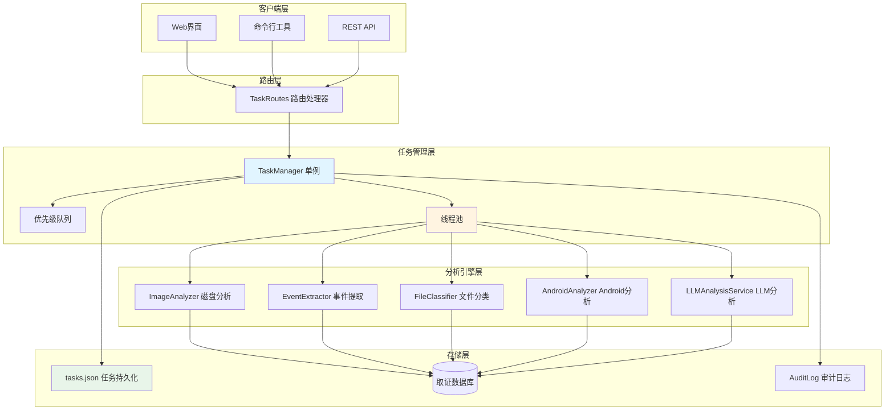
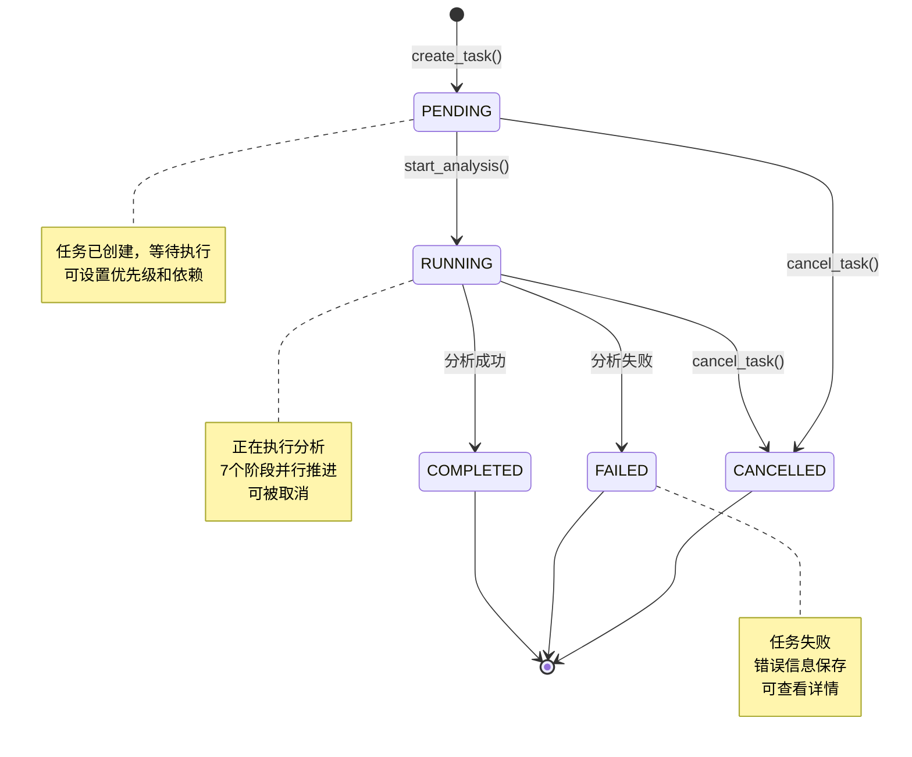
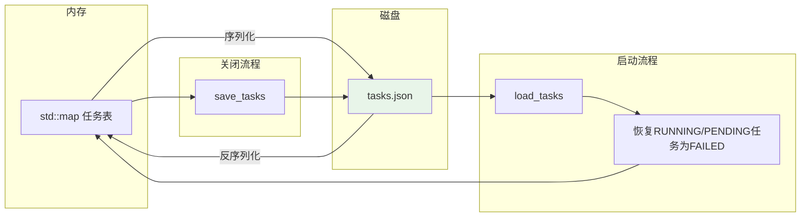
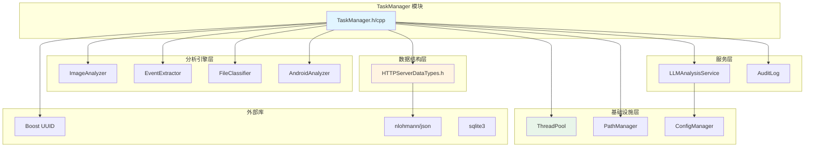
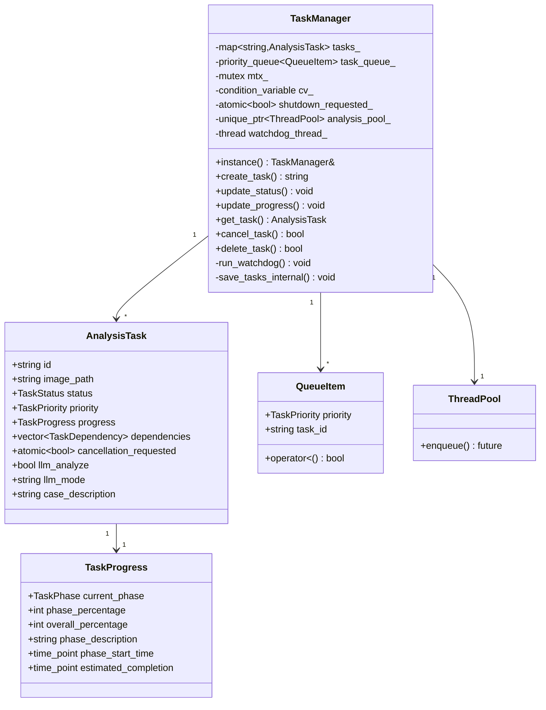
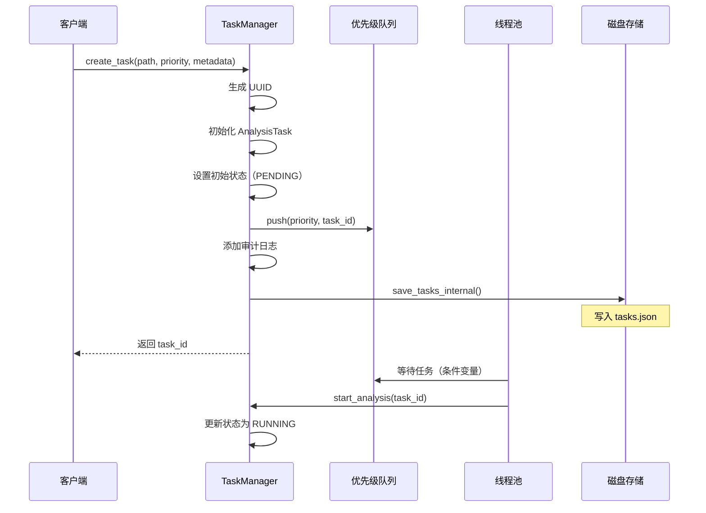
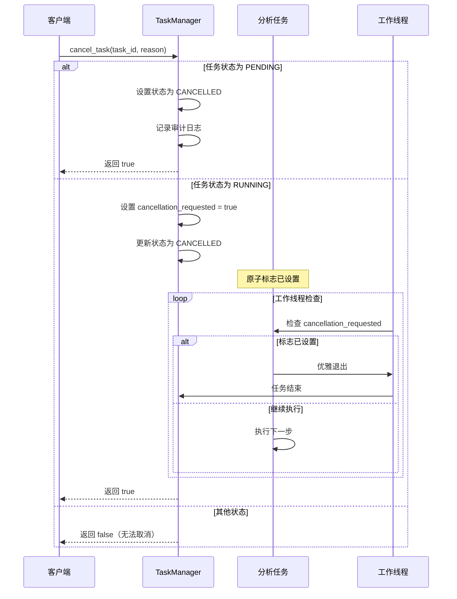
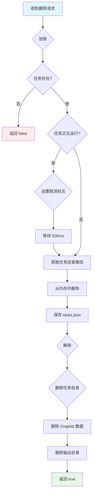

# TaskManager - 任务管理器模块

> **模块定位**: 核心任务调度与管理组件，提供取证分析任务的完整生命周期管理、优先级调度、进度跟踪和持久化存储

---

## 1. 模块背景

### 业务背景

在数字取证分析系统中，分析任务具有以下特点：

1. **长时间运行**：磁盘镜像分析可能持续数小时甚至数天
2. **资源密集**：需要大量 CPU、内存和磁盘 I/O
3. **并发需求**：多个用户可能同时提交分析任务
4. **状态跟踪**：需要实时报告分析进度和当前阶段
5. **可取消性**：用户应能中断正在运行的任务
6. **持久化**：服务器重启后任务状态不应丢失
7. **审计需求**：所有操作需要记录审计日志

### 技术背景

TaskManager 是单例模式的核心组件，负责协调所有取证分析任务：



**核心设计原则**：

1. **线程安全**：使用 `std::mutex` 保护所有共享状态
2. **优先级调度**：高优先级任务优先执行
3. **优雅取消**：通过原子标志实现协作式取消
4. **状态持久化**：所有任务状态保存到 JSON 文件
5. **看门狗机制**：后台线程监控卡死的任务
6. **依赖管理**：支持任务间依赖关系

**技术选型理由**：

- **单例模式**：全局唯一的任务管理器，避免多实例冲突
- **优先级队列**：`std::priority_queue` 确保高优先级任务优先执行
- **线程池**：复用线程资源，避免频繁创建/销毁线程
- **原子操作**：`std::atomic<bool>` 实现无锁的取消标志
- **条件变量**：`std::condition_variable` 实现任务队列的等待通知

---

## 2. 模块功能

### 核心功能

#### 2.1 任务生命周期管理



**任务状态说明**：

| 状态 | 说明 | 可转换到的状态 |
|------|------|----------------|
| **PENDING** | 待执行，已加入队列 | RUNNING, CANCELLED |
| **RUNNING** | 正在分析 | COMPLETED, FAILED, CANCELLED |
| **COMPLETED** | 分析成功完成 | - (终态) |
| **FAILED** | 分析失败 | - (终态) |
| **CANCELLED** | 被用户取消 | - (终态) |

#### 2.2 优先级调度

```cpp
enum class TaskPriority {
    LOW = 0,       // 低优先级：批量分析、后台任务
    NORMAL = 1,    // 普通优先级：默认级别
    HIGH = 2,      // 高优先级：用户交互任务
    CRITICAL = 3   // 关键优先级：紧急案件
};
```

**调度策略**：

- 使用 `std::priority_queue` 实现优先级队列
- 高优先级任务优先获取线程资源
- 相同优先级按创建时间 FIFO 顺序

#### 2.3 分析阶段跟踪

```cpp
enum class TaskPhase {
    INITIALIZING,       // 初始化：打开镜像、创建数据库
    IMAGE_ANALYSIS,     // 镜像分析：遍历文件系统、提取元数据
    EVENT_EXTRACTION,   // 事件提取：生成时间线事件
    FILE_CLASSIFICATION,// 文件分类：写入 files 主表与 24 个分类表
    LLM_ANALYSIS,       // LLM分析：生成文件描述与事件簇分析
    PLATFORM_ANALYSIS,  // 平台分析：Android/Windows/Linux/Server 工件
    FILE_CARVING,       // 签名雕刻：未分配空间恢复（可选）
    FINALIZING          // 完成
};
```

**进度计算**（`TaskManager.cpp::calculate_overall_percentage`，实际权重）：

```cpp
int TaskManager::calculate_overall_percentage(TaskPhase phase, int phase_percentage) {
    std::map<TaskPhase, int> phase_weights = {
        {TaskPhase::INITIALIZING, 5},
        {TaskPhase::IMAGE_ANALYSIS, 25},
        {TaskPhase::EVENT_EXTRACTION, 10},
        {TaskPhase::FILE_CLASSIFICATION, 15},
        {TaskPhase::LLM_ANALYSIS, 20},
        {TaskPhase::PLATFORM_ANALYSIS, 20},
        {TaskPhase::FILE_CARVING, 3},
        {TaskPhase::FINALIZING, 2}
    };
    // 累加之前已完成的阶段权重
    int accumulated = 0;
    // ... 计算逻辑 ...
    return accumulated + (phase_weight * phase_percentage / 100);
}
```

#### 2.4 任务依赖管理

```cpp
struct TaskDependency {
    std::string task_id;    // 依赖的任务 ID
    bool required;          // 是否必须完成（true=必须，false=可选）
};
```

**依赖检查逻辑**：

```cpp
bool TaskManager::can_start_task(const std::string& id) {
    const auto& task = tasks_[id];
    for (const auto& dep : task.dependencies) {
        if (dep.required) {
            auto dep_task = tasks_[dep.task_id];
            // 必须依赖的任务必须完成才能开始
            if (dep_task.status != TaskStatus::COMPLETED) {
                return false;
            }
        }
    }
    return true;
}
```

#### 2.5 任务持久化



**持久化策略**：

- **实时保存**：每次状态变更立即写入磁盘
- **JSON 格式**：人类可读，易于调试
- **原子写入**：先写临时文件，再重命名
- **启动恢复**：将 RUNNING/PENDING 任务标记为 FAILED，避免僵尸任务

#### 2.6 看门狗机制

后台线程定期检查任务状态：

```cpp
void TaskManager::run_watchdog() {
    while (!shutdown_requested_) {
        std::this_thread::sleep_for(std::chrono::seconds(60));

        std::lock_guard<std::mutex> lock(mtx_);
        for (auto& [id, task] : tasks_) {
            if (task.status == TaskStatus::RUNNING) {
                auto now = std::chrono::steady_clock::now();
                auto elapsed = std::chrono::duration_cast<std::chrono::minutes>(
                    now - task.progress.phase_start_time
                ).count();

                // 如果某个阶段超过2小时无更新
                if (elapsed > 120) {
                    task.status = TaskStatus::FAILED;
                    task.message = "Task stuck in phase " +
                                  std::to_string(static_cast<int>(task.progress.current_phase));
                    add_audit_log(id, "WATCHDOG", "Task marked as failed (stuck)");
                }
            }
        }
    }
}
```

#### 2.7 批量操作

```cpp
// 批量创建任务
std::vector<std::string> create_batch_tasks(
    const std::vector<std::string>& image_paths,
    TaskPriority priority = TaskPriority::NORMAL
);

// 批量取消任务
std::vector<std::string> cancel_multiple_tasks(
    const std::vector<std::string>& task_ids,
    const std::string& reason = ""
);
```

#### 2.8 LLM 分析选项

```cpp
struct AnalysisTask {
    // ... 其他字段 ...

    // LLM 分析配置
    bool llm_analyze = false;           // 是否启用 LLM 文件分析
    std::string llm_mode = "smart";     // "full" 或 "smart"
    std::string case_description;       // 案件描述（提供给 LLM 的上下文）
};
```

**LLM 模式说明**：

- **FULL 模式**：分析所有文件，适合小规模镜像（<1000 文件）
- **SMART 模式**：LLM 先选择重要文件，再分析这些文件，适合大规模镜像

### 边界与限制

| 限制项 | 限制值 | 说明 |
|-------|--------|------|
| **并发任务数** | 由线程池大小决定 | 默认 2-16，可配置 |
| **任务队列长度** | 无硬限制 | 受内存限制 |
| **依赖深度** | 无硬限制 | 循环依赖检测需自行实现 |
| **任务持久化** | tasks.json 文件 | 文件过大可能影响性能 |
| **取消响应时间** | <500ms | 协作式取消，依赖检查点 |
| **看门狗检查间隔** | 60秒 | 固定间隔 |
| **阶段超时阈值** | 2小时 | 超过标记为 FAILED |

**不支持的功能**：

- ❌ 不支持任务暂停/恢复（只能取消重新创建）
- ❌ 不支持动态调整优先级（创建后固定）
- ❌ 不支持任务分片/合并
- ❌ 不支持跨服务器任务迁移

---

## 3. 模块使用的库

### 依赖库清单

```cpp
// 标准库
#include <string>              // 字符串处理
#include <vector>              // 动态数组
#include <map>                 // 映射容器
#include <mutex>               // 互斥锁
#include <thread>              // 线程
#include <filesystem>          // 文件系统
#include <chrono>              // 时间处理
#include <queue>               // 队列
#include <condition_variable>  // 条件变量
#include <atomic>              // 原子操作
#include <memory>              // 智能指针
#include <set>                 // 集合
#include <fstream>             // 文件流

// Boost 库
#include <boost/uuid/uuid.hpp>              // UUID 生成
#include <boost/uuid/uuid_generators.hpp>  // UUID 生成器
#include <boost/uuid/uuid_io.hpp>          // UUID 字符串转换

// JSON 库
#include <nlohmann/json.hpp>   // JSON 序列化

// 内部模块
#include "HTTPServerDataTypes.h"     // 数据类型定义
#include "ImageAnalyzer/ImageAnalyzer.h"
#include "DatabaseManager/EventExtractor/EventExtractor.h"
#include "DatabaseManager/FileClassifier/FileClassifier.h"
#include "AndroidAnalyzer/AndroidAnalyzer.h"
#include "AuditLog/AuditLog.h"
#include "LLMAnalysisService.h"
#include "../../core/ThreadPool/ThreadPool.h"
```

### 依赖关系图



**关键依赖说明**：

1. **Boost.UUID**：生成全局唯一的任务 ID
2. **nlohmann/json**：任务序列化/反序列化
3. **ThreadPool**：复用线程资源，避免频繁创建销毁
4. **PathManager**：管理任务相关路径（数据库、提取文件等）

---

## 4. 模块实现方式

### 架构设计



### 核心类说明

#### 4.1 TaskManager 类

单例模式的核心任务管理器。

**成员变量**：

```cpp
class TaskManager {
private:
    std::map<std::string, AnalysisTask> tasks_;              // 任务表（ID -> 任务）
    std::priority_queue<QueueItem> task_queue_;             // 优先级队列
    std::mutex mtx_;                                        // 任务表的互斥锁
    std::condition_variable cv_;                             // 条件变量
    std::atomic<bool> shutdown_requested_{false};           // 关闭标志
    std::unique_ptr<ThreadPool> analysis_pool_;             // 线程池
    std::thread watchdog_thread_;                            // 看门狗线程
};
```

**核心方法**：

```cpp
// 任务创建
std::string create_task(
    const std::string& path,
    TaskPriority priority = TaskPriority::NORMAL,
    const std::map<std::string, std::string>& metadata = {},
    const std::vector<TaskDependency>& dependencies = {},
    bool android_analyze = false,
    XFSMode xfs_mode = XFSMode::Auto,
    const std::string& db_output_dir = "",
    bool llm_analyze = false,
    const std::string& llm_mode = "smart",
    const std::string& case_description = ""
);

// 状态管理
void update_status(const std::string& id, TaskStatus status, const std::string& msg = "");
void update_progress(const std::string& id, TaskPhase phase, int phase_percentage,
                     const std::string& phase_description = "");

// 查询方法
AnalysisTask get_task(const std::string& id);
std::vector<AnalysisTask> get_all_tasks();
std::vector<AnalysisTask> get_tasks_by_status(TaskStatus status);
std::vector<AnalysisTask> get_tasks_by_priority(TaskPriority priority);

// 任务操作
bool cancel_task(const std::string& id, const std::string& reason = "");
bool delete_task(const std::string& id);

// 批量操作
std::vector<std::string> cancel_multiple_tasks(
    const std::vector<std::string>& task_ids,
    const std::string& reason = ""
);
std::vector<std::string> create_batch_tasks(
    const std::vector<std::string>& image_paths,
    TaskPriority priority = TaskPriority::NORMAL
);

// 统计与清理
nlohmann::json get_task_statistics();
int cleanup_completed_tasks(int max_age_hours = 24);

// 依赖管理
bool can_start_task(const std::string& id);

// 配置方法
void set_result_db(const std::string& id, const std::string& db_path);
void set_android_analyze_options(const std::string& id, bool android_analyze,
                                  XFSMode xfs_mode, const std::string& db_output_dir);
void set_llm_analyze_options(const std::string& id, bool llm_analyze,
                              const std::string& llm_mode);
void set_case_description(const std::string& id, const std::string& case_description);

// 审计日志
void add_audit_log(const std::string& id, const std::string& action,
                   const std::string& details, const std::string& user_id = "");
std::vector<AuditLogEntry> get_audit_logs(const std::string& id, int limit = 0, int offset = 0);

// 持久化
void save_tasks();
void load_tasks();
```

#### 4.2 AnalysisTask 结构

任务的完整数据结构。

```cpp
struct AnalysisTask {
    std::string id;                                          // UUID 格式的任务 ID
    std::string image_path;                                  // 磁盘镜像路径
    TaskStatus status;                                       // 当前状态
    std::string message;                                     // 状态消息
    std::string output_files_db;                             // _files.db 路径
    std::string output_raw_db;                               // _raw.db 路径
    std::string output_events_db;                            // _events.db 路径
    TaskPriority priority;                                   // 优先级
    TaskProgress progress;                                   // 进度信息
    std::chrono::system_clock::time_point created_time;     // 创建时间
    std::chrono::system_clock::time_point started_time;     // 开始时间
    std::chrono::system_clock::time_point completed_time;   // 完成时间
    std::chrono::steady_clock::time_point execution_start_time; // 执行开始时间
    std::vector<TaskDependency> dependencies;                // 依赖任务列表
    std::vector<std::string> dependents;                    // 依赖此任务的任务列表
    std::string result_cache;                                // 结果缓存
    bool android_analyze;                                    // 是否启用 Android 分析
    XFSMode xfs_mode;                                        // XFS 处理模式
    std::string db_output_dir;                               // 数据库输出目录
    std::atomic<bool> cancellation_requested{false};        // 取消标志（原子）
    std::string error_details;                               // 错误详情
    std::map<std::string, std::string> metadata;             // 元数据（键值对）
    bool llm_analyze = false;                                // 是否启用 LLM 分析
    std::string llm_mode = "smart";                          // LLM 模式
    std::string output_descriptions_db;                      // LLM 描述数据库
    std::string case_description;                            // 案件描述
};
```

**拷贝语义处理**：

由于 `std::atomic<bool>` 不可拷贝，需要自定义拷贝构造和赋值运算符：

```cpp
AnalysisTask(const AnalysisTask& other)
    : id(other.id), image_path(other.image_path), status(other.status),
      message(other.message), output_files_db(other.output_files_db),
      // ... 其他字段 ...
      cancellation_requested(other.cancellation_requested.load())  // 原子加载
      // ...
{}

AnalysisTask& operator=(const AnalysisTask& other) {
    if (this != &other) {
        id = other.id;
        // ... 其他字段 ...
        cancellation_requested.store(other.cancellation_requested.load());  // 原子存储
    }
    return *this;
}
```

#### 4.3 TaskProgress 结构

任务进度信息。

```cpp
struct TaskProgress {
    TaskPhase current_phase;                       // 当前阶段
    int phase_percentage;                          // 阶段百分比 (0-100)
    int overall_percentage;                        // 总体百分比 (0-100)
    std::string phase_description;                 // 阶段描述
    std::chrono::steady_clock::time_point phase_start_time;  // 阶段开始时间
    std::chrono::steady_clock::time_point estimated_completion;  // 预计完成时间
};
```

### 关键流程

#### 4.1 任务创建流程



**关键代码**：

```cpp
std::string TaskManager::create_task(const std::string& path,
                                   TaskPriority priority,
                                   const std::map<std::string, std::string>& metadata,
                                   const std::vector<TaskDependency>& dependencies,
                                   bool android_analyze,
                                   XFSMode xfs_mode,
                                   const std::string& db_output_dir,
                                   bool llm_analyze,
                                   const std::string& llm_mode,
                                   const std::string& case_description) {
    std::lock_guard<std::mutex> lock(mtx_);  // 加锁

    // 1. 生成 UUID
    boost::uuids::uuid uuid = boost::uuids::random_generator()();
    std::string id = boost::uuids::to_string(uuid);

    // 2. 初始化任务
    auto now_steady = std::chrono::steady_clock::now();
    auto now_system = std::chrono::system_clock::now();
    AnalysisTask new_task;
    new_task.id = id;
    new_task.image_path = path;
    new_task.status = TaskStatus::PENDING;
    new_task.message = "Waiting to start";
    new_task.priority = priority;
    new_task.progress = {TaskPhase::INITIALIZING, 0, 0, "Waiting to start",
                        now_steady, now_steady};
    new_task.created_time = now_system;
    new_task.started_time = now_system;
    new_task.completed_time = now_system;
    new_task.execution_start_time = now_steady;
    new_task.dependencies = dependencies;
    new_task.android_analyze = android_analyze;
    new_task.xfs_mode = xfs_mode;
    new_task.db_output_dir = db_output_dir;
    new_task.llm_analyze = llm_analyze;
    new_task.llm_mode = llm_mode;
    new_task.case_description = case_description;
    new_task.cancellation_requested = false;
    new_task.metadata = metadata;

    // 3. 保存到任务表
    tasks_[id] = new_task;

    // 4. 加入优先级队列
    task_queue_.push({priority, id});

    // 5. 记录审计日志
    add_audit_log(id, "CREATED",
                  "Task created with priority " + std::to_string(static_cast<int>(priority)));

    // 6. 持久化
    save_tasks_internal();

    return id;
}
```

#### 4.2 任务执行流程

```cpp
void TaskManager::start_analysis(const std::string& task_id) {
    // 获取任务信息（不加锁，短暂持有）
    AnalysisTask task = get_task(task_id);
    if (task.id.empty()) {
        std::cerr << "Task not found: " << task_id << std::endl;
        return;
    }

    // 提交到线程池
    analysis_pool_->enqueue([this, task_id]() {
        try {
            // 更新状态为 RUNNING
            update_status(task_id, TaskStatus::RUNNING, "Analysis started");

            // Phase 1: 初始化
            update_progress(task_id, TaskPhase::INITIALIZING, 0, "Opening disk image");
            // ... 初始化逻辑 ...

            // Phase 2: 镜像分析
            update_progress(task_id, TaskPhase::IMAGE_ANALYSIS, 0, "Analyzing disk image");
            // ... 分析逻辑 ...

            // Phase 3: 事件提取
            update_progress(task_id, TaskPhase::EVENT_EXTRACTION, 0, "Extracting events");
            // ... 提取逻辑 ...

            // Phase 4: 文件分类
            update_progress(task_id, TaskPhase::FILE_CLASSIFICATION, 0, "Classifying files");
            // ... 分类逻辑 ...

            // Phase 5: LLM 分析（可选）
            if (task.llm_analyze) {
                update_progress(task_id, TaskPhase::LLM_ANALYSIS, 0, "LLM file analysis");
                // ... LLM 分析逻辑 ...
            }

            // Phase 6: Android 分析（可选）
            if (task.android_analyze) {
                update_progress(task_id, TaskPhase::ANDROID_ANALYSIS, 0, "Android analysis");
                // ... Android 分析逻辑 ...
            }

            // Phase 7: 完成
            update_progress(task_id, TaskPhase::FINALIZING, 0, "Finalizing");
            // ... 完成逻辑 ...

            // 标记为完成
            update_status(task_id, TaskStatus::COMPLETED, "Analysis completed successfully");

        } catch (const std::exception& e) {
            // 捕获异常并标记为失败
            update_status(task_id, TaskStatus::FAILED, e.what());
        }
    });
}
```

#### 4.3 任务取消流程



**关键代码**：

```cpp
bool TaskManager::cancel_task(const std::string& id, const std::string& reason) {
    std::lock_guard<std::mutex> lock(mtx_);
    if (tasks_.count(id)) {
        auto& task = tasks_[id];

        if (task.status == TaskStatus::RUNNING) {
            // 设置原子取消标志
            task.cancellation_requested = true;
            update_status(id, TaskStatus::CANCELLED,
                         reason.empty() ? "Task cancelled by user" : reason);
            add_audit_log(id, "CANCELLED",
                         reason.empty() ? "Task cancelled" : "Task cancelled: " + reason);
            return true;

        } else if (task.status == TaskStatus::PENDING) {
            // 待执行任务直接取消
            update_status(id, TaskStatus::CANCELLED,
                         reason.empty() ? "Task cancelled by user" : reason);
            add_audit_log(id, "CANCELLED",
                         reason.empty() ? "Task cancelled" : "Task cancelled: " + reason);
            return true;
        }
    }
    return false;
}
```

**协作式取消检查**：

```cpp
// 在分析循环中定期检查
void ImageAnalyzer::analyze(...) {
    for (const auto& file : files) {
        // 检查取消标志
        if (task.cancellation_requested.load()) {
            throw std::runtime_error("Task cancelled by user");
        }

        // 处理文件
        processFile(file);
    }
}
```

#### 4.4 进度更新流程

```cpp
void TaskManager::update_progress(const std::string& id, TaskPhase phase,
                                 int phase_percentage,
                                 const std::string& phase_description) {
    std::lock_guard<std::mutex> lock(mtx_);
    if (tasks_.count(id)) {
        auto now = std::chrono::steady_clock::now();
        auto& task = tasks_[id];

        // 更新阶段信息
        task.progress.current_phase = phase;
        task.progress.phase_percentage = phase_percentage;
        task.progress.overall_percentage = calculate_overall_percentage(phase, phase_percentage);
        task.progress.phase_description = phase_description;
        task.progress.phase_start_time = now;

        // 估算完成时间
        if (task.progress.overall_percentage > 0) {
            auto elapsed = std::chrono::duration_cast<std::chrono::seconds>(
                now - task.execution_start_time
            ).count();
            auto total_estimated = (elapsed * 100) / task.progress.overall_percentage;
            task.progress.estimated_completion =
                task.execution_start_time + std::chrono::seconds(total_estimated);
        }
    }
}
```

#### 4.5 任务删除流程



**关键代码**：

```cpp
bool TaskManager::delete_task(const std::string& id) {
    std::string task_dir;
    {
        std::lock_guard<std::mutex> lock(mtx_);
        if (tasks_.count(id) == 0) {
            return false;
        }

        // 如果任务正在运行，先取消
        if (tasks_[id].status == TaskStatus::RUNNING) {
            tasks_[id].cancellation_requested = true;
            std::this_thread::sleep_for(std::chrono::milliseconds(500));
        }

        // 获取任务目录路径
        try {
            task_dir = forensics::PathManager::instance().getTaskExtractDir(id).string();
        } catch(...) {
            task_dir = "";
        }

        // 从内存中删除
        tasks_.erase(id);

        // 保存到磁盘
        save_tasks_internal();
    }

    // 删除任务目录（在锁外执行）
    if (!task_dir.empty() && std::filesystem::exists(task_dir)) {
        try {
            std::filesystem::remove_all(task_dir);
        } catch (const std::exception& e) {
            std::cerr << "Failed to remove task directory " << task_dir << ": " << e.what() << std::endl;
            return false;
        }
    }

    // 删除 Graphiti 数据
    forensics::LLMPythonProxy proxy("http://localhost:8090");
    proxy.deleteGraphitiData(id);

    // 删除输出目录
    try {
        auto& pm = forensics::PathManager::instance();
        std::string task_root = pm.getTaskDir(id).string();
        if (!task_root.empty() && std::filesystem::exists(task_root)) {
            std::filesystem::remove_all(task_root);
        }
    } catch (...) {}

    return true;
}
```

### 数据结构

#### 4.1 任务队列元素

```cpp
struct QueueItem {
    TaskPriority priority;  // 优先级
    std::string task_id;    // 任务 ID

    // 优先级队列的比较运算符（高优先级在前）
    bool operator<(const QueueItem& other) const {
        return priority < other.priority;
    }
};
```

#### 4.2 审计日志条目

```cpp
struct AuditLogEntry {
    std::string id;              // 日志条目 ID
    std::string task_id;         // 关联的任务 ID
    std::string action;          // 操作类型（CREATED, STATUS_CHANGE, CANCELLED, ...）
    std::string details;         // 详细信息
    std::string user_id;         // 操作用户 ID
    std::chrono::system_clock::time_point timestamp;  // 时间戳
};
```

---

## 5. API 调用

### C++ API

TaskManager 是单例模式，通过 `instance()` 获取实例：

```cpp
#include "network/HTTPServer/TaskManager.h"

using namespace forensics;

// 获取单例实例
TaskManager& taskMgr = TaskManager::instance();

// ========== 任务创建 ==========

// 基本创建
std::string task_id = taskMgr.create_task(
    "/path/to/disk_image.dd",
    TaskPriority::NORMAL
);

// 完整配置创建
std::string task_id = taskMgr.create_task(
    "/path/to/disk_image.dd",          // 镜像路径
    TaskPriority::HIGH,                 // 优先级
    {{"case_id", "CASE-2024-001"},      // 元数据
     {"investigator", "John Doe"}},
    {},                                 // 无依赖
    true,                               // 启用 Android 分析
    XFSMode::Auto,                      // XFS 自动模式
    "/output/databases",                 // 输出目录
    true,                               // 启用 LLM 分析
    "smart",                            // LLM 智能模式
    "Possible data breach investigation" // 案件描述
);

// ========== 批量创建 ==========

std::vector<std::string> image_paths = {
    "/evidence/image1.dd",
    "/evidence/image2.E01",
    "/evidence/image3.dd"
};
auto task_ids = taskMgr.create_batch_tasks(image_paths, TaskPriority::NORMAL);
std::cout << "Created " << task_ids.size() << " tasks" << std::endl;

// ========== 查询任务 ==========

// 获取单个任务
AnalysisTask task = taskMgr.get_task(task_id);
if (!task.id.empty()) {
    std::cout << "Task status: " << static_cast<int>(task.status) << std::endl;
    std::cout << "Progress: " << task.progress.overall_percentage << "%" << std::endl;
}

// 获取所有任务
auto all_tasks = taskMgr.get_all_tasks();
for (const auto& t : all_tasks) {
    std::cout << t.id << ": " << t.image_path << std::endl;
}

// 按状态筛选
auto running_tasks = taskMgr.get_tasks_by_status(TaskStatus::RUNNING);
auto failed_tasks = taskMgr.get_tasks_by_status(TaskStatus::FAILED);

// 按优先级筛选
auto high_priority_tasks = taskMgr.get_tasks_by_priority(TaskPriority::HIGH);

// ========== 任务操作 ==========

// 取消任务
if (taskMgr.cancel_task(task_id, "No longer needed")) {
    std::cout << "Task cancelled" << std::endl;
}

// 批量取消
std::vector<std::string> tasks_to_cancel = {task_id1, task_id2};
auto cancelled = taskMgr.cancel_multiple_tasks(tasks_to_cancel, "Batch cancellation");

// 删除任务（包括输出文件）
if (taskMgr.delete_task(task_id)) {
    std::cout << "Task and all data deleted" << std::endl;
}

// ========== 任务配置 ==========

// 设置数据库路径
taskMgr.set_result_db(task_id, "/output/case_files.db");

// 配置 Android 分析
taskMgr.set_android_analyze_options(
    task_id,
    true,               // 启用
    XFSMode::Native,    // XFS 原生模式
    "/output/android"
);

// 配置 LLM 分析
taskMgr.set_llm_analyze_options(task_id, true, "smart");

// 设置案件描述
taskMgr.set_case_description(task_id, "Corporate fraud investigation");

// ========== 统计信息 ==========

// 获取任务统计
auto stats = taskMgr.get_task_statistics();
std::cout << "Total tasks: " << stats["total_tasks"] << std::endl;
std::cout << "Pending: " << stats["by_status"]["pending"] << std::endl;
std::cout << "Running: " << stats["by_status"]["running"] << std::endl;
std::cout << "Completed: " << stats["by_status"]["completed"] << std::endl;
std::cout << "Failed: " << stats["by_status"]["failed"] << std::endl;

// ========== 清理操作 ==========

// 清理超过 24 小时的已完成任务
int removed = taskMgr.cleanup_completed_tasks(24);
std::cout << "Removed " << removed << " old tasks" << std::endl;

// ========== 依赖管理 ==========

// 检查任务是否可以开始
if (taskMgr.can_start_task(task_id)) {
    std::cout << "All dependencies satisfied" << std::endl;
}

// ========== 审计日志 ==========

// 获取审计日志
auto logs = taskMgr.get_audit_logs(task_id, 10, 0);  // 最多 10 条
for (const auto& log : logs) {
    std::cout << "[" << log.action << "] " << log.details << std::endl;
}
```

### 命令行 API

虽然 TaskManager 主要是内部组件，但可以通过 REST API 间接调用（参见 TaskRoutes 文档）。

### REST API

TaskManager 本身不直接提供 HTTP 接口，而是通过 TaskRoutes 路由模块暴露功能。完整 API 文档参见 [TaskRoutes.md](./routes/TaskRoutes.md)。

主要端点：

| 方法 | 端点 | 说明 |
|------|------|------|
| POST | `/api/tasks` | 创建新任务 |
| GET | `/api/tasks/{id}` | 获取任务详情 |
| GET | `/api/tasks` | 获取所有任务 |
| DELETE | `/api/tasks/{id}` | 删除任务 |
| POST | `/api/tasks/{id}/cancel` | 取消任务 |
| GET | `/api/tasks/statistics` | 获取统计信息 |

---

## 6. 二次开发

### 扩展点

#### 6.1 添加新的任务阶段

如果需要添加新的分析阶段（如 "MALWARE_ANALYSIS"）：

```cpp
// 1. 在 HTTPServerDataTypes.h 中添加新阶段（在现有枚举基础上插入）
enum class TaskPhase {
    INITIALIZING,
    IMAGE_ANALYSIS,
    EVENT_EXTRACTION,
    FILE_CLASSIFICATION,
    LLM_ANALYSIS,
    PLATFORM_ANALYSIS,
    MALWARE_ANALYSIS,  // 新增：恶意软件分析
    FILE_CARVING,
    FINALIZING
};
```

```cpp
// 2. 在 TaskManager.cpp 的 calculate_overall_percentage 相位权重表中注册
//    （当前实现使用 std::map<TaskPhase, int> phase_weights，而非 switch）
int TaskManager::calculate_overall_percentage(TaskPhase phase, int phase_percentage) {
    std::map<TaskPhase, int> phase_weights = {
        {TaskPhase::INITIALIZING, 5},
        {TaskPhase::IMAGE_ANALYSIS, 25},
        {TaskPhase::EVENT_EXTRACTION, 10},
        {TaskPhase::FILE_CLASSIFICATION, 15},
        {TaskPhase::LLM_ANALYSIS, 15},
        {TaskPhase::PLATFORM_ANALYSIS, 15},
        {TaskPhase::MALWARE_ANALYSIS, 10},   // 新增
        {TaskPhase::FILE_CARVING, 3},
        {TaskPhase::FINALIZING, 2}
    };
    // ... 按阶段顺序累加权重 ...
}
```

```cpp
// 3. 在分析流程中使用
void TaskManager::start_analysis(const std::string& task_id) {
    // ... 前面的阶段 ...

    // 新增阶段
    update_progress(task_id, TaskPhase::MALWARE_ANALYSIS, 0, "Scanning for malware");

    // 执行恶意软件分析
    // MalwareAnalyzer malwareAnalyzer;
    // malwareAnalyzer.scan(task.image_path);

    // 检查取消标志
    AnalysisTask task = get_task(task_id);
    if (task.cancellation_requested.load()) {
        throw std::runtime_error("Task cancelled");
    }

    // ... 继续后续阶段 ...
}
```

#### 6.2 添加任务优先级动态调整

当前优先级在创建时固定，可添加动态调整功能：

```cpp
// 在 TaskManager.h 中添加方法
class TaskManager {
public:
    // ... 现有方法 ...

    /**
     * @brief 动态调整任务优先级
     * @param id 任务 ID
     * @param new_priority 新优先级
     * @return 是否成功调整
     */
    bool adjust_priority(const std::string& id, TaskPriority new_priority);
};
```

```cpp
// 在 TaskManager.cpp 中实现
bool TaskManager::adjust_priority(const std::string& id, TaskPriority new_priority) {
    std::lock_guard<std::mutex> lock(mtx_);
    if (!tasks_.count(id)) {
        return false;
    }

    auto& task = tasks_[id];

    // 只能调整 PENDING 任务的优先级
    if (task.status != TaskStatus::PENDING) {
        std::cerr << "Cannot adjust priority of " << static_cast<int>(task.status)
                  << " task" << std::endl;
        return false;
    }

    TaskPriority old_priority = task.priority;
    task.priority = new_priority;

    add_audit_log(id, "PRIORITY_CHANGE",
                  "Priority changed from " + std::to_string(static_cast<int>(old_priority)) +
                  " to " + std::to_string(static_cast<int>(new_priority)));

    save_tasks_internal();
    return true;
}
```

#### 6.3 添加任务暂停/恢复功能

虽然当前不支持，但可以扩展实现：

```cpp
// 在 HTTPServerDataTypes.h 中添加状态
enum class TaskStatus {
    PENDING,
    RUNNING,
    PAUSED,      // 新增：暂停
    COMPLETED,
    FAILED,
    CANCELLED
};
```

```cpp
// 在 TaskManager 中添加暂停/恢复方法
class TaskManager {
public:
    /**
     * @brief 暂停正在运行的任务
     * @param id 任务 ID
     * @return 是否成功
     */
    bool pause_task(const std::string& id);

    /**
     * @brief 恢复暂停的任务
     * @param id 任务 ID
     * @return 是否成功
     */
    bool resume_task(const std::string& id);
};
```

**实现注意事项**：

- 需要在分析循环中添加暂停检查点
- 需要保存任务上下文以便恢复
- 需要处理资源释放（数据库连接、文件句柄等）

#### 6.4 添加任务超时配置

为不同优先级的任务设置超时时间：

```cpp
// 在 HTTPServerDataTypes.h 中添加超时配置
struct AnalysisTask {
    // ... 现有字段 ...

    int timeout_seconds = 0;  // 超时时间（0=无限制）
};
```

```cpp
// 在 TaskManager 中实现超时检查
void TaskManager::check_task_timeout(const std::string& id) {
    std::lock_guard<std::mutex> lock(mtx_);
    if (!tasks_.count(id)) {
        return;
    }

    const auto& task = tasks_[id];
    if (task.status == TaskStatus::RUNNING && task.timeout_seconds > 0) {
        auto now = std::chrono::steady_clock::now();
        auto elapsed = std::chrono::duration_cast<std::chrono::seconds>(
            now - task.progress.phase_start_time
        ).count();

        if (elapsed > task.timeout_seconds) {
            task.cancellation_requested = true;
            update_status(id, TaskStatus::FAILED, "Task timeout");
            add_audit_log(id, "TIMEOUT", "Task exceeded time limit");
        }
    }
}
```

### 添加新功能的步骤

以"添加任务结果导出功能"为例：

#### Step 1: 扩展数据结构

```cpp
// 在 HTTPServerDataTypes.h 中添加导出配置
enum class ExportFormat {
    JSON,       // JSON 格式
    CSV,        // CSV 格式
    TOON,       // TOON 格式（LLM 优化）
    PDF         // PDF 报告
};

struct ExportConfig {
    ExportFormat format = ExportFormat::JSON;
    std::string output_path;
    bool include_progress = true;
    bool include_audit_logs = true;
    bool include_statistics = true;
};
```

#### Step 2: 在 TaskManager 中添加方法

```cpp
// TaskManager.h
class TaskManager {
public:
    // ... 现有方法 ...

    /**
     * @brief 导出任务结果
     * @param id 任务 ID
     * @param config 导出配置
     * @return 导出文件路径
     */
    std::string export_task_result(const std::string& id, const ExportConfig& config);
};
```

#### Step 3: 实现导出逻辑

```cpp
// TaskManager.cpp
std::string TaskManager::export_task_result(const std::string& id, const ExportConfig& config) {
    std::lock_guard<std::mutex> lock(mtx_);
    if (!tasks_.count(id)) {
        return "";
    }

    const auto& task = tasks_[id];

    // 根据格式导出
    switch (config.format) {
        case ExportFormat::JSON:
            return export_as_json(id, config);
        case ExportFormat::CSV:
            return export_as_csv(id, config);
        case ExportFormat::TOON:
            return export_as_toon(id, config);
        case ExportFormat::PDF:
            return export_as_pdf(id, config);
    }
}

std::string TaskManager::export_as_json(const std::string& id, const ExportConfig& config) {
    const auto& task = tasks_[id];

    nlohmann::json result = {
        {"task_id", task.id},
        {"image_path", task.image_path},
        {"status", task.status},
        {"priority", task.priority},
        {"created_time", std::chrono::duration_cast<std::chrono::seconds>(
            task.created_time.time_since_epoch()).count()},
        {"started_time", std::chrono::duration_cast<std::chrono::seconds>(
            task.started_time.time_since_epoch()).count()},
        {"completed_time", std::chrono::duration_cast<std::chrono::seconds>(
            task.completed_time.time_since_epoch()).count()},
        {"progress", {
            {"current_phase", task.progress.current_phase},
            {"phase_percentage", task.progress.phase_percentage},
            {"overall_percentage", task.progress.overall_percentage},
            {"phase_description", task.progress.phase_description}
        }}
    };

    if (config.include_audit_logs) {
        auto logs = get_audit_logs(id, 0, 0);
        result["audit_logs"] = logs;
    }

    // 写入文件
    std::string output_path = config.output_path.empty() ?
        ("task_" + id + ".json") : config.output_path;

    std::ofstream out(output_path);
    out << result.dump(2);

    add_audit_log(id, "EXPORT", "Exported to " + output_path);

    return output_path;
}
```

#### Step 4: 在 TaskRoutes 中添加 HTTP 端点

```cpp
// TaskRoutes.cpp
OSSRoutes::TaskRoutes(crow::App<>& app) : task_manager_(TaskManager::instance()) {
    // ... 现有路由 ...

    // 导出端点
    CROW_ROUTE(app, "/api/tasks/<string>/export").methods("POST"_method)(
        [this](const crow::request& req, const std::string& task_id) {
            return handle_export_task(req, task_id);
        }
    );
}

crow::response TaskRoutes::handle_export_task(const crow::request& req,
                                               const std::string& task_id) {
    crow::response res;
    res.set_header("Content-Type", "application/json");

    try {
        json body = json::parse(req.body);

        ExportConfig config;
        config.format = parse_export_format(body.value("format", "json"));
        config.output_path = body.value("output_path", "");
        config.include_progress = body.value("include_progress", true);
        config.include_audit_logs = body.value("include_audit_logs", true);

        std::string result_path = task_manager_.export_task_result(task_id, config);

        if (result_path.empty()) {
            json error = {{"error", "Export failed"}};
            res.code = 500;
            res.write(error.dump());
        } else {
            json response = {{"success", true}, {"output_path", result_path}};
            res.write(response.dump());
        }
    } catch (const std::exception& e) {
        json error = {{"error", e.what()}};
        res.code = 500;
        res.write(error.dump());
    }

    return res;
}
```

### 代码示例

#### 示例1: 监控任务进度

```cpp
#include "network/HTTPServer/TaskManager.h"
#include <iostream>
#include <thread>
#include <chrono>

void monitor_task_progress(const std::string& task_id) {
    auto& taskMgr = TaskManager::instance();

    while (true) {
        AnalysisTask task = taskMgr.get_task(task_id);

        if (task.id.empty()) {
            std::cout << "Task not found" << std::endl;
            break;
        }

        // 打印进度
        std::cout << "[" << static_cast<int>(task.progress.current_phase) << "] "
                  << task.progress.phase_description << " - "
                  << task.progress.overall_percentage << "%" << std::endl;

        // 检查是否完成
        if (task.status == TaskStatus::COMPLETED ||
            task.status == TaskStatus::FAILED ||
            task.status == TaskStatus::CANCELLED) {
            std::cout << "Task finished with status: "
                      << static_cast<int>(task.status) << std::endl;
            break;
        }

        // 等待 2 秒
        std::this_thread::sleep_for(std::chrono::seconds(2));
    }
}

int main() {
    std::string task_id = "uuid-here";
    monitor_task_progress(task_id);
    return 0;
}
```

#### 示例2: 实现任务队列调度器

```cpp
class TaskScheduler {
public:
    TaskScheduler() : running_(false) {}

    void start() {
        running_ = true;
        worker_thread_ = std::thread(&TaskScheduler::run, this);
    }

    void stop() {
        running_ = false;
        if (worker_thread_.joinable()) {
            worker_thread_.join();
        }
    }

private:
    void run() {
        auto& taskMgr = TaskManager::instance();

        while (running_) {
            // 获取所有待执行任务
            auto pending_tasks = taskMgr.get_tasks_by_status(TaskStatus::PENDING);

            if (pending_tasks.empty()) {
                // 没有待执行任务，等待
                std::this_thread::sleep_for(std::chrono::seconds(5));
                continue;
            }

            // 按优先级排序
            std::sort(pending_tasks.begin(), pending_tasks.end(),
                [](const AnalysisTask& a, const AnalysisTask& b) {
                    return a.priority > b.priority;
                });

            // 启动高优先级任务
            for (const auto& task : pending_tasks) {
                if (taskMgr.can_start_task(task.id)) {
                    std::cout << "Starting task: " << task.id << std::endl;
                    taskMgr.start_analysis(task.id);

                    // 限制并发数
                    auto running = taskMgr.get_tasks_by_status(TaskStatus::RUNNING);
                    if (running.size() >= MAX_CONCURRENT_TASKS) {
                        break;
                    }
                }
            }

            // 等待一段时间
            std::this_thread::sleep_for(std::chrono::seconds(10));
        }
    }

    std::thread worker_thread_;
    std::atomic<bool> running_;
    static const int MAX_CONCURRENT_TASKS = 4;
};
```

---

## 7. 其他

### 测试

#### 单元测试

```cpp
// tests/UnitTest/test_task_manager_gtest.cpp
#include <gtest/gtest.h>
#include "../../src/network/HTTPServer/TaskManager.h"

class TaskManagerTest : public ::testing::Test {
protected:
    void SetUp() override {
        // 清理现有任务
        auto& taskMgr = TaskManager::instance();
        auto tasks = taskMgr.get_all_tasks();
        for (const auto& task : tasks) {
            taskMgr.delete_task(task.id);
        }
    }

    void TearDown() override {
        // 清理测试创建的任务
    }
};

TEST_F(TaskManagerTest, CreateTask) {
    auto& taskMgr = TaskManager::instance();

    std::string task_id = taskMgr.create_task(
        "/test/image.dd",
        TaskPriority::NORMAL
    );

    ASSERT_FALSE(task_id.empty());

    AnalysisTask task = taskMgr.get_task(task_id);
    EXPECT_EQ(task.status, TaskStatus::PENDING);
    EXPECT_EQ(task.priority, TaskPriority::NORMAL);
    EXPECT_EQ(task.image_path, "/test/image.dd");
}

TEST_F(TaskManagerTest, CancelTask) {
    auto& taskMgr = TaskManager::instance();

    std::string task_id = taskMgr.create_task("/test/image.dd");

    bool cancelled = taskMgr.cancel_task(task_id, "Test cancellation");
    EXPECT_TRUE(cancelled);

    AnalysisTask task = taskMgr.get_task(task_id);
    EXPECT_EQ(task.status, TaskStatus::CANCELLED);
}

TEST_F(TaskManagerTest, DeleteTask) {
    auto& taskMgr = TaskManager::instance();

    std::string task_id = taskMgr.create_task("/test/image.dd");

    bool deleted = taskMgr.delete_task(task_id);
    EXPECT_TRUE(deleted);

    AnalysisTask task = taskMgr.get_task(task_id);
    EXPECT_TRUE(task.id.empty());  // 任务不存在
}

TEST_F(TaskManagerTest, GetTasksByStatus) {
    auto& taskMgr = TaskManager::instance();

    std::string task_id1 = taskMgr.create_task("/test/image1.dd");
    std::string task_id2 = taskMgr.create_task("/test/image2.dd");

    taskMgr.cancel_task(task_id1);

    auto pending_tasks = taskMgr.get_tasks_by_status(TaskStatus::PENDING);
    auto cancelled_tasks = taskMgr.get_tasks_by_status(TaskStatus::CANCELLED);

    EXPECT_EQ(pending_tasks.size(), 1);
    EXPECT_EQ(cancelled_tasks.size(), 1);
}

TEST_F(TaskManagerTest, UpdateProgress) {
    auto& taskMgr = TaskManager::instance();

    std::string task_id = taskMgr.create_task("/test/image.dd");

    taskMgr.update_progress(task_id, TaskPhase::IMAGE_ANALYSIS, 50, "Analyzing");

    AnalysisTask task = taskMgr.get_task(task_id);
    EXPECT_EQ(task.progress.current_phase, TaskPhase::IMAGE_ANALYSIS);
    EXPECT_EQ(task.progress.phase_percentage, 50);
    EXPECT_EQ(task.progress.phase_description, "Analyzing");
}
```

#### 集成测试

```bash
#!/bin/bash
# tests/integration/test_task_manager.sh

echo "===== TaskManager 集成测试 ====="

BASE_URL="http://localhost:8080"

# 1. 创建任务
echo "1. 创建分析任务..."
TASK_ID=$(curl -s -X POST "$BASE_URL/api/tasks" \
  -H "Content-Type: application/json" \
  -d '{
    "image_path": "/test/image.dd",
    "priority": "NORMAL",
    "android_analyze": true,
    "llm_analyze": true,
    "llm_mode": "smart"
  }' | jq -r '.task_id')

echo "任务已创建: $TASK_ID"

# 2. 查询任务状态
echo -e "\n2. 查询任务状态..."
curl -s "$BASE_URL/api/tasks/$TASK_ID" | jq '.'

# 3. 列出所有任务
echo -e "\n3. 列出所有任务..."
curl -s "$BASE_URL/api/tasks" | jq '.[] | {id, status, priority}'

# 4. 获取统计信息
echo -e "\n4. 获取统计信息..."
curl -s "$BASE_URL/api/tasks/statistics" | jq '.'

# 5. 取消任务
echo -e "\n5. 取消任务..."
curl -s -X POST "$BASE_URL/api/tasks/$TASK_ID/cancel" \
  -H "Content-Type: application/json" \
  -d '{"reason": "Test cancellation"}' | jq '.'

# 6. 删除任务
echo -e "\n6. 删除任务..."
curl -s -X DELETE "$BASE_URL/api/tasks/$TASK_ID" | jq '.'

echo -e "\n===== 测试完成 ====="
```

### 配置

#### 线程池配置

通过 `.env` 文件配置线程池大小：

```bash
# .env 文件
THREAD_POOL_SIZE=4  # 并发分析任务数
```

TaskManager 在初始化时读取配置：

```cpp
TaskManager::TaskManager() {
    // 从 ConfigManager 读取线程池大小
    int pool_size = forensics::ConfigManager::instance().getThreadPoolSize();

    // 安全检查
    if (pool_size <= 0) pool_size = 2;
    if (pool_size > 16) {
        std::cerr << "Warning: THREAD_POOL_SIZE too high" << std::endl;
    }

    analysis_pool_ = std::make_unique<forensics::ThreadPool>(pool_size);

    // 加载持久化的任务
    load_tasks();

    // 启动看门狗
    watchdog_thread_ = std::thread(&TaskManager::run_watchdog, this);
}
```

#### 任务持久化路径

任务数据保存在：

```
{数据目录}/tasks.json
```

由 `PathManager` 管理：

```cpp
auto tasksPath = forensics::PathManager::instance().getTasksJsonPath();
// 返回：/path/to/data/tasks.json
```

### 故障排查

#### 常见问题

**问题1: 任务状态一直为 PENDING**

```bash
# 症状
curl "http://localhost:8080/api/tasks/{task_id}"
# 返回 {"status": "PENDING", ...}
```

**可能原因和解决方法**：

1. **线程池已满**：检查是否有太多 RUNNING 任务
   ```bash
   curl "http://localhost:8080/api/tasks/statistics" | jq '.by_status.running'
   ```

   解决方案：等待当前任务完成，或增加 `THREAD_POOL_SIZE`

2. **依赖任务未完成**：检查依赖任务状态
   ```cpp
   AnalysisTask task = taskMgr.get_task(task_id);
   for (const auto& dep : task.dependencies) {
       AnalysisTask dep_task = taskMgr.get_task(dep.task_id);
       std::cout << dep.task_id << ": "
                 << static_cast<int>(dep_task.status) << std::endl;
   }
   ```

3. **看门狗误判**：检查日志中是否有 "Task stuck" 消息
   ```bash
   tail -f /var/log/forensic_analyzer.log | grep WATCHDOG
   ```

---

**问题2: 任务无法取消**

```cpp
// 症状
bool cancelled = taskMgr.cancel_task(task_id, "User request");
// cancelled = false
```

**原因和解决方法**：

1. **任务已完成/失败**：已完成的任务无法取消
   ```cpp
   AnalysisTask task = taskMgr.get_task(task_id);
   if (task.status == TaskStatus::COMPLETED ||
       task.status == TaskStatus::FAILED) {
       std::cout << "Cannot cancel finished task" << std::endl;
   }
   ```

2. **取消标志未检查**：分析代码未检查 `cancellation_requested`
   ```cpp
   // 在分析循环中添加检查
   if (task.cancellation_requested.load()) {
       throw std::runtime_error("Task cancelled");
   }
   ```

---

**问题3: tasks.json 文件损坏**

```bash
# 症状
# 服务器启动时无法加载任务
# Failed to load tasks: json.exception.parse_error
```

**解决方法**：

1. 备份当前文件
   ```bash
   cp data/tasks.json data/tasks.json.backup
   ```

2. 尝试修复 JSON（手动或使用工具）
   ```bash
   python3 -m json.tool data/tasks.json > tasks_fixed.json
   ```

3. 如果无法修复，删除文件（将丢失所有任务记录）
   ```bash
   rm data/tasks.json
   # 服务器将创建新的空任务表
   ```

---

**问题4: 看门狗误杀正常任务**

```bash
# 症状
# 任务在某个阶段长时间无进度更新，超过 TASK_WATCHDOG_STALE_MINUTES（默认 30 分钟）后被标记为 FAILED
# Task stuck in phase 2 (IMAGE_ANALYSIS)
```

**原因和解决方法**：

对于大型磁盘镜像，某些阶段可能需要很长时间。

**方案1：调整看门狗超时时间**

```cpp
// 在 TaskManager.cpp 中修改看门狗逻辑
void TaskManager::run_watchdog() {
    while (!shutdown_requested_) {
        std::this_thread::sleep_for(std::chrono::minutes(30));  // 减少检查频率

        // ... 检查逻辑 ...

        // 增加超时阈值（如 4 小时）
        if (elapsed > 240) {  // 原来是 120
            task.status = TaskStatus::FAILED;
        }
    }
}
```

**方案2：为特定阶段禁用看门狗**

```cpp
// 添加白名单
std::set<TaskPhase> watchdog_exempt = {
    TaskPhase::IMAGE_ANALYSIS,  // 镜像分析可能很长
    TaskPhase::LLM_ANALYSIS      // LLM 分析可能很长
};

// 在看门狗中跳过这些阶段
if (watchdog_exempt.count(task.progress.current_phase) > 0) {
    continue;  // 跳过检查
}
```

---

### 相关模块

| 模块 | 说明 | 文档链接 |
|------|------|----------|
| **TaskRoutes** | 任务管理 HTTP 路由 | [TaskRoutes.md](./routes/TaskRoutes.md) |
| **ThreadPool** | 线程池实现 | [../../core/ThreadPool/](../../core/ThreadPool.md) |
| **HTTPServer** | HTTP 服务器主模块 | [../HTTPServer.md](../HTTPServer.md) |
| **LLMAnalysisService** | LLM 分析服务 | [./LLMAnalysisService.md](./LLMAnalysisService.md) |

### 参考资源

#### 设计模式

- **单例模式**：https://en.wikipedia.org/wiki/Singleton_pattern
- **优先级队列**：https://en.cppreference.com/w/cpp/container/priority_queue
- **生产者-消费者模式**：https://en.wikipedia.org/wiki/Producer%E2%80%93consumer_problem

#### 并发编程

- **C++ 并发编程**：https://en.cppreference.com/w/cpp/thread
- **原子操作**：https://en.cppreference.com/w/cpp/atomic
- **条件变量**：https://en.cppreference.com/w/cpp/thread/condition_variable

#### 相关技术

- **Boost.UUID**：https://www.boost.org/doc/libs/release/libs/uuid/
- **nlohmann/json**：https://github.com/nlohmann/json

### 变更历史

| 版本 | 日期 | 变更内容 | 作者 |
|------|------|----------|------|
| **1.0.0** | 2026-03-16 | 初始版本，完整的任务管理功能 | Claude Code (Sonnet 4.6) |

---

## 附录

### A. 任务阶段权重分配

| 阶段 | 权重 | 说明 |
|------|------|------|
| INITIALIZING | 5% | 打开镜像、创建数据库（快速） |
| IMAGE_ANALYSIS | 40% | 遍历文件系统、提取元数据（最耗时） |
| EVENT_EXTRACTION | 20% | 生成时间线事件 |
| FILE_CLASSIFICATION | 15% | 文件类型分类 |
| LLM_ANALYSIS | 10% | LLM 文件描述生成（可选） |
| ANDROID_ANALYSIS | 5% | Android 数据解析（可选） |
| FINALIZING | 5% | 生成报告、清理资源 |
| **总计** | **100%** | - |

**注意事项**：

- 如果 LLM_ANALYSIS 和 ANDROID_ANALYSIS 都未启用，权重会重新分配
- 总体百分比 = 已完成阶段权重之和 + 当前阶段权重 × 当前阶段百分比

### B. 审计日志操作类型

| 操作类型 | 说明 | 触发时机 |
|---------|------|----------|
| **CREATED** | 任务创建 | `create_task()` |
| **STATUS_CHANGE** | 状态变更 | `update_status()` |
| **CANCELLED** | 任务取消 | `cancel_task()` |
| **PRIORITY_CHANGE** | 优先级变更 | `adjust_priority()` |
| **RESULT_SET** | 结果设置 | `set_result_db()` |
| **LLM_CONFIG** | LLM 配置 | `set_llm_analyze_options()` |
| **CASE_DESC** | 案件描述 | `set_case_description()` |
| **EXPORT** | 结果导出 | `export_task_result()` |
| **CLEANUP** | 任务清理 | `cleanup_completed_tasks()` |
| **WATCHDOG** | 看门狗操作 | `run_watchdog()` |

### C. JSON 序列化示例

**tasks.json 文件格式**：

```json
[
  {
    "id": "550e8400-e29b-41d4-a716-446655440000",
    "image_path": "/evidence/case001.dd",
    "status": "COMPLETED",
    "message": "Analysis completed successfully",
    "output_files_db": "/data/case001_files.db",
    "output_raw_db": "/data/case001_raw.db",
    "output_events_db": "/data/case001_events.db",
    "priority": "NORMAL",
    "progress": {
      "current_phase": "FINALIZING",
      "phase_percentage": 100,
      "overall_percentage": 100,
      "phase_description": "Finalizing"
    },
    "result_cache": "",
    "android_analyze": true,
    "xfs_mode": "Auto",
    "db_output_dir": "/data",
    "error_details": "",
    "metadata": {
      "case_id": "CASE-2024-001",
      "investigator": "John Doe"
    },
    "llm_analyze": true,
    "llm_mode": "smart",
    "case_description": "Possible data breach investigation",
    "created_time": 1710802400,
    "started_time": 1710802405,
    "completed_time": 1710824000
  }
]
```

---

**文档生成时间**: 2026-03-16
**文档版本**: 1.0.0
**模块路径**: `src/network/HTTPServer/TaskManager.cpp`
**相关头文件**: `src/network/HTTPServer/TaskManager.h`

---

**快速导航**:

- **[返回模块索引](../README.md)** - 返回 C++ 模块索引
- **[网络模块列表](./)** - 查看其他网络模块
- **[项目根目录](../../../../)** - 返回项目根目录
- **[API 参考](../../../../api_reference/)** - REST API 完整参考
