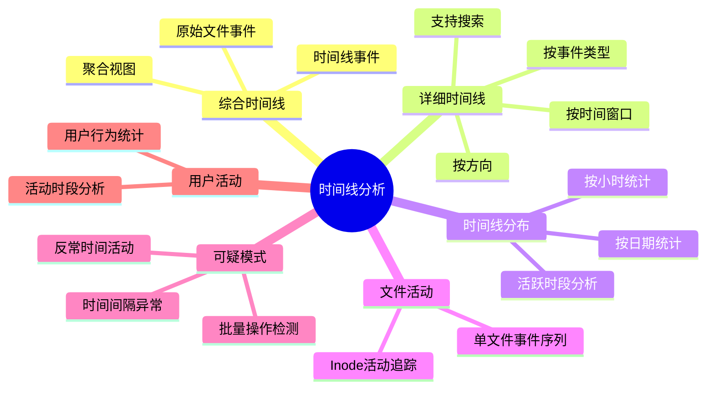
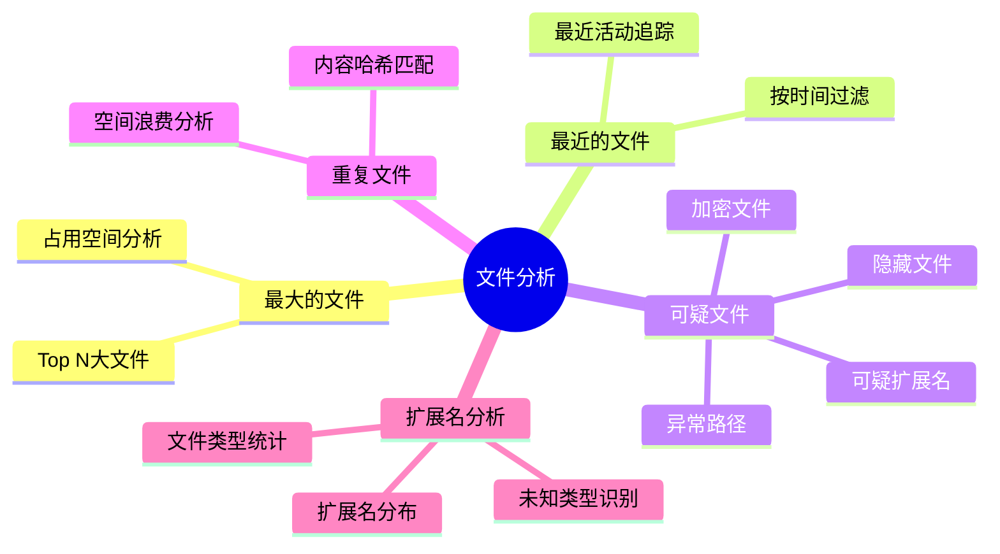
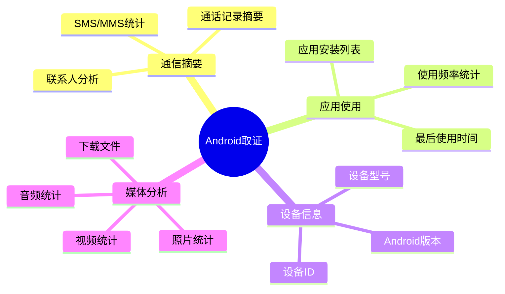
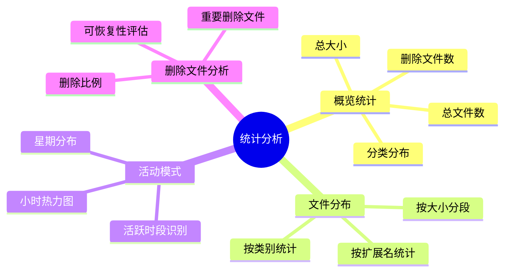
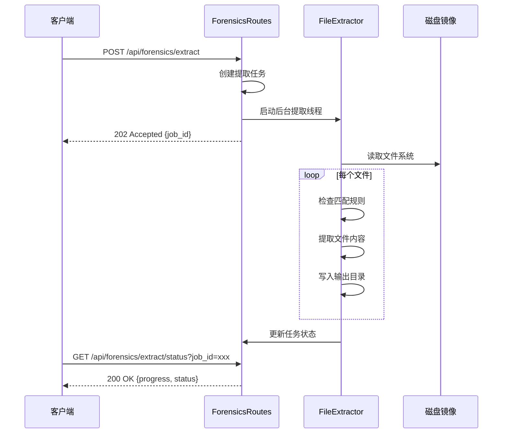
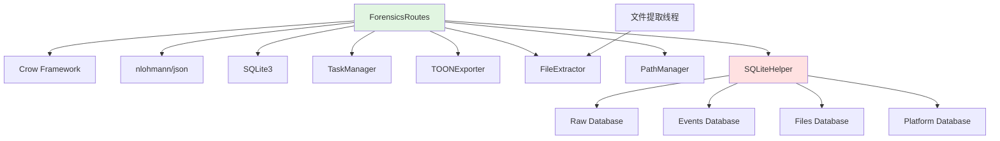
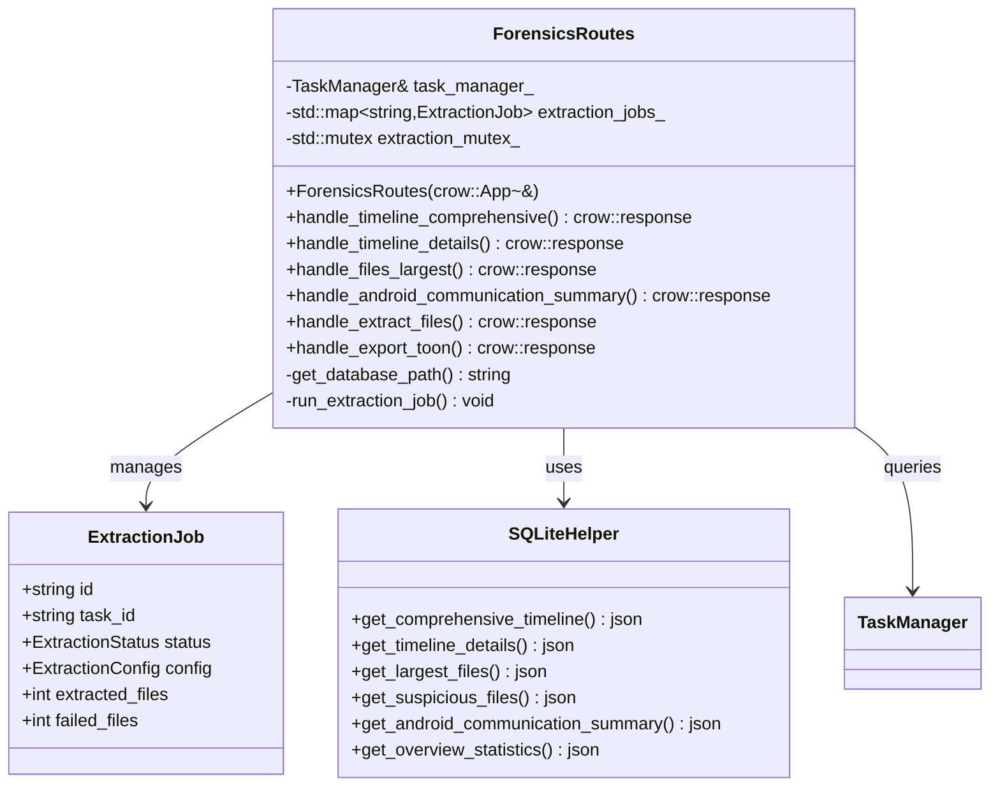
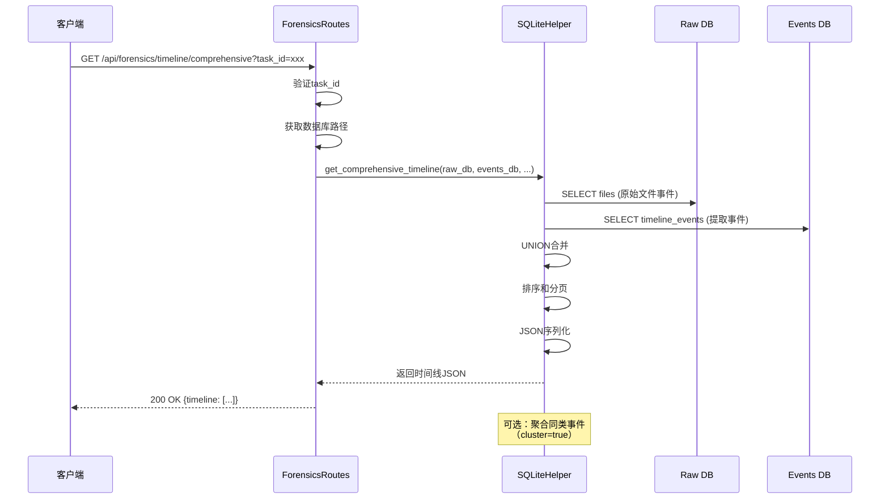
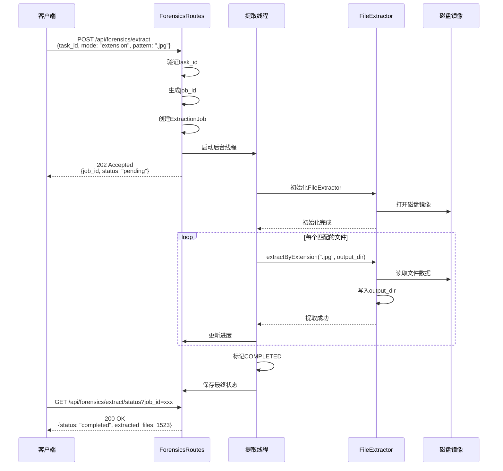
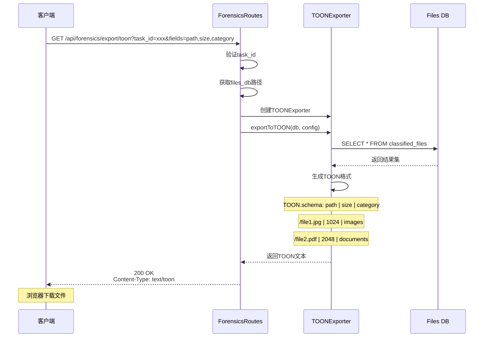

# ForensicsRoutes 模块文档（C++）

## 1. 模块背景

### 业务背景

数字取证分析的核心价值在于从磁盘镜像中提取、分类和分析证据数据。ForensicsRoutes 模块将复杂的取证分析功能封装为 REST API,为前端应用提供全面的取证数据查询、统计分析和文件提取能力。

**核心需求**：
- **时间线分析**：重建事件时间线,揭示攻击者的行动轨迹
- **文件分析**：识别大文件、最近文件、可疑文件和重复文件
- **平台取证**：针对Android、Windows、Linux的专门分析
- **统计分析**：提供文件分布、活动模式等统计信息
- **文件提取**：从镜像中提取特定文件或文件类别
- **数据导出**：支持TOON格式导出,便于LLM分析

**解决挑战**：
- **多数据库查询**：跨越raw、events、files、platform等多个数据库
- **复杂SQL查询**：时间线聚合、模式识别、关联分析
- **异步提取**：大文件提取需要后台任务支持
- **实时性**：部分分析需要实时计算,响应时间优化
- **数据一致性**：确保分析期间数据库状态的一致性

### 技术背景

**为什么需要专门的取证分析路由？**

| 功能需求 | 技术挑战 | 解决方案 |
|---------|---------|----------|
| **时间线重建** | 跨多个事件表聚合 | SQLite视图+JSON响应 |
| **文件分类查询** | 13个文件分类表 | 动态SQL+分类映射 |
| **模式识别** | 可疑行为检测 | 启发式算法+阈值过滤 |
| **大数据导出** | 数百万文件记录 | 流式导出+分页 |
| **实时统计** | 动态计算统计指标 | 预聚合表+缓存 |

**技术栈选型**：

1. **SQLite 高级查询**：
   - 多表JOIN关联查询
   - 窗口函数和时间范围查询
   - 聚合统计和分组分析
   - JSON结果返回

2. **异步任务处理**：
   - 后台文件提取线程
   - 进度跟踪和状态管理
   - 任务队列和并发控制

3. **TOON 导出集成**：
   - Token优化的表格格式
   - 字段选择和过滤
   - 流式文本生成

## 2. 模块功能

### 核心功能

#### 1. 时间线分析（Timeline Analysis）



**时间线事件类型**：
```cpp
enum class TimelineEventType {
    CREATED,      // 文件创建
    MODIFIED,     // 文件修改
    ACCESSED,     // 文件访问
    CHANGED,      // 元数据变更
    DELETED       // 文件删除
};
```

**综合时间线**：合并原始文件时间戳和提取的事件记录
```sql
-- 综合时间线视图
SELECT
    timestamp,
    'file_event' as source,
    path,
    size,
    event_type
FROM files
UNION ALL
SELECT
    timestamp,
    'timeline_event' as source,
    file_path,
    0 as size,
    event_type
FROM timeline_events
ORDER BY timestamp DESC
```

#### 2. 文件分析（File Analysis）



**可疑文件识别规则**：
```cpp
bool is_suspicious_file(const FileRecord& file) {
    // 加密文件
    if (file.is_encrypted) return true;

    // 隐藏属性（Windows）
    if (file.attributes & FILE_ATTRIBUTE_HIDDEN) return true;

    // 可疑路径
    static const std::vector<std::string> suspicious_paths = {
        "$RECYCLE.BIN", "System Volume Information",
        "AppData\\Local\\Temp", "Windows\\Temp"
    };
    for (const auto& pattern : suspicious_paths) {
        if (file.path.find(pattern) != std::string::npos) {
            return true;
        }
    }

    // 可疑扩展名
    static const std::vector<std::string> suspicious_extensions = {
        ".vbs", ".js", ".jar", ".ps1", ".exe"
    };
    std::string ext = get_extension(file.path);
    if (std::find(suspicious_extensions.begin(),
                 suspicious_extensions.end(), ext)
        != suspicious_extensions.end()) {
        return true;
    }

    return false;
}
```

#### 3. Android 取证分析



**Android 数据库结构**：
```
_android.db
├── sms (短信/彩信)
│   ├── id, address, date, type, body
├── contacts (联系人)
│   ├── id, name, phone_number, email
├── call_logs (通话记录)
│   ├── id, number, duration, type, date
├── app_usage (应用使用)
│   ├── package_name, last_used_time, usage_count
├── device_info (设备信息)
│   ├── manufacturer, model, android_version, device_id
└── media_analysis (媒体分析)
    ├── type, path, size, date_taken
```

#### 4. 统计分析（Statistics）



#### 5. 文件提取（File Extraction）

```cpp
enum class ExtractionMode {
    ALL,          // 提取所有文件
    EXTENSION,    // 按扩展名提取
    NAME,         // 按文件名模式提取
    DELETED       // 仅提取删除文件
};

struct ExtractionConfig {
    ExtractionMode mode;
    std::string pattern;           // 扩展名或文件名模式
    std::string output_dir;       // 输出目录
    bool include_deleted;         // 包含删除文件
    bool overwrite;               // 覆盖已存在文件
    int max_files;                // 最大文件数限制
    int64_t max_total_size;       // 总大小限制
};
```

**提取流程**：


#### 6. TOON 格式导出

**TOON（Token-Oriented Object Notation）**：为LLM优化的表格格式

**优势**：
- **30-60% Token节省**：相比JSON格式
- **LLM友好**：结构化表格,易于解析
- **可读性强**：人类可读的文本格式
- **可逆转换**：无损转回JSON

**格式示例**：
```
TOON.schema: path | size | mtime | category | extension | is_deleted
/Users/John/Documents/report.pdf | 245760 | 1704067200 | documents | .pdf | false
/Users/John/Desktop/image.jpg | 524288 | 1704070800 | images | .jpg | false
```

### 边界与限制

**功能边界**：
- ❌ 不支持实时文件监控（仅静态分析）
- ❌ 不支持文件内容修改（只读分析）
- ❌ 不支持密码保护的文件解密（需外部工具）
- ❌ 不支持远程镜像直接分析（需本地挂载）

**已知限制**：
| 限制 | 影响 | 缓解方法 |
|------|------|----------|
| 时间线精度 | 依赖文件系统时间戳 | 结合多个时间源交叉验证 |
| 删除文件恢复 | 仅能识别已删除标记 | 使用FileCarving模块深度恢复 |
| 大文件提取 | 可能耗尽磁盘空间 | 设置max_total_size限制 |
| 复杂查询性能 | 百万级记录查询慢 | 使用分页和索引优化 |

**性能指标**（参考配置：100万文件）：
- 时间线查询：<1秒（1000条记录）
- 文件列表查询：<500ms（分页100条）
- 统计分析：<2秒（全表聚合）
- 文件提取：~100MB/s（取决于磁盘速度）

## 3. 模块使用的库

### 依赖库清单

| 库名称 | 版本 | 用途 | 许可证 |
|--------|------|------|--------|
| **Crow** | 1.0+ | HTTP 服务器框架 | BSD-2-Clause |
| **nlohmann/json** | 3.11.2+ | JSON 处理 | MIT |
| **SQLite3** | 3.35.0+ | 数据库查询 | Public Domain |
| **TOONExporter** | 本地 | TOON 格式导出 | 自研 |
| **FileExtractor** | 本地 | 文件提取引擎 | 自研 |
| **PathManager** | 本地 | 路径管理 | 自研 |

### 依赖关系图



## 4. 模块实现方式

### 架构设计



### 核心类说明

#### ForensicsRoutes（取证路由类）

**职责**：
- 注册和管理取证分析相关的HTTP路由
- 处理数据库查询和文件提取请求
- 管理异步提取任务的生命周期
- 协调TOON导出功能

**关键方法**：
```cpp
class ForensicsRoutes {
public:
    explicit ForensicsRoutes(crow::App<>& app);

    // 时间线分析
    crow::response handle_timeline_comprehensive(const crow::request& req);
    crow::response handle_timeline_details(const crow::request& req);
    crow::response handle_timeline_distribution(const crow::request& req);
    crow::response handle_timeline_file_activity(const crow::request& req);
    crow::response handle_timeline_suspicious_patterns(const crow::request& req);
    crow::response handle_timeline_user_activity(const crow::request& req);

    // 文件分析
    crow::response handle_files_largest(const crow::request& req);
    crow::response handle_files_recent(const crow::request& req);
    crow::response handle_files_suspicious(const crow::request& req);
    crow::response handle_files_duplicates(const crow::request& req);
    crow::response handle_files_extensions_analysis(const crow::request& req);

    // Android取证
    crow::response handle_android_communication_summary(const crow::request& req);
    crow::response handle_android_app_usage(const crow::request& req);
    crow::response handle_android_device_info(const crow::request& req);
    crow::response handle_android_media_analysis(const crow::request& req);

    // 统计分析
    crow::response handle_statistics_overview(const crow::request& req);
    crow::response handle_statistics_file_distribution(const crow::request& req);
    crow::response handle_statistics_activity_patterns(const crow::request& req);
    crow::response handle_statistics_deleted_files_analysis(const crow::request& req);

    // 文件提取
    crow::response handle_extract_files(const crow::request& req);
    crow::response handle_extraction_status(const crow::request& req);

    // 数据导出
    crow::response handle_export_toon(const crow::request& req);

private:
    TaskManager& task_manager_;
    std::map<std::string, ExtractionJob> extraction_jobs_;
    std::mutex extraction_mutex_;

    // 辅助方法
    std::string get_database_path(const std::string& task_id, const std::string& db_type);
    std::string get_image_path_for_task(const std::string& task_id);
    void run_extraction_job(const std::string& job_id);
    void add_cors_headers(crow::response& res);
};
```

#### SQLiteHelper（数据库查询助手）

**职责**：
- 封装复杂的SQL查询逻辑
- 提供统一的JSON结果返回格式
- 处理数据库连接和错误处理

**关键查询方法**：
```cpp
class SQLiteHelper {
public:
    // 时间线查询
    static json get_comprehensive_timeline(
        const std::string& raw_db,
        const std::string& events_db,
        const std::string& start_time,
        const std::string& end_time,
        int limit,
        int offset,
        const std::string& event_type,
        bool cluster
    );

    static json get_timeline_details(
        const std::string& events_db,
        int64_t window,
        const std::string& type,
        const std::string& dir,
        int limit,
        int offset,
        const std::string& search
    );

    static json get_timeline_distribution(const std::string& events_db);
    static json get_file_activity_timeline(
        const std::string& raw_db,
        const std::string& events_db,
        const std::string& file_path,
        int64_t inode
    );
    static json get_suspicious_patterns(
        const std::string& raw_db,
        const std::string& events_db
    );
    static json get_user_activity_analysis(
        const std::string& raw_db,
        const std::string& events_db
    );

    // 文件查询
    static json get_largest_files(const std::string& files_db, int limit);
    static json get_recent_files(const std::string& files_db, const std::string& hours);
    static json get_suspicious_files(
        const std::string& raw_db,
        const std::string& files_db
    );
    static json get_duplicate_files(const std::string& files_db);
    static json get_extensions_analysis(const std::string& files_db);

    // Android查询
    static json get_android_communication_summary(const std::string& android_db);
    static json get_android_app_usage(const std::string& android_db);
    static json get_android_device_info(const std::string& android_db);
    static json get_android_media_analysis(const std::string& android_db);

    // 统计查询
    static json get_overview_statistics(
        const std::string& raw_db,
        const std::string& files_db,
        const std::string& events_db
    );
    static json get_file_distribution_analysis(const std::string& files_db);
    static json get_activity_patterns(const std::string& events_db);
    static json get_deleted_files_analysis(const std::string& raw_db);

    // 其他查询
    static json get_file_summary(const std::string& files_db);
    static json get_llm_results(const std::string& files_db);
};
```

### 关键流程

#### 综合时间线查询流程



**综合时间线SQL**：
```sql
-- 综合时间线查询
WITH file_events AS (
    SELECT
        datetime(mtime, 'unixepoch', 'localtime') as timestamp,
        'file' as event_type,
        path as description,
        'raw' as source,
        size,
        deleted as is_deleted
    FROM files
    WHERE mtime > 0
),
timeline_events AS (
    SELECT
        timestamp,
        event_type,
        description,
        'events' as source,
        0 as size,
        0 as is_deleted
    FROM timeline_events
)
SELECT * FROM (
    SELECT * FROM file_events
    UNION ALL
    SELECT * FROM timeline_events
)
WHERE timestamp BETWEEN ? AND ?
ORDER BY timestamp DESC
LIMIT ? OFFSET ?
```

#### 文件提取流程



**文件提取代码示例**：
```cpp
void ForensicsRoutes::run_extraction_job(const std::string& job_id) {
    ExtractionJob* job_ptr = nullptr;

    // 获取任务信息
    {
        std::lock_guard<std::mutex> lock(extraction_mutex_);
        auto it = extraction_jobs_.find(job_id);
        if (it == extraction_jobs_.end()) return;
        job_ptr = &it->second;
        job_ptr->status = ExtractionStatus::RUNNING;
        job_ptr->started_time = std::chrono::system_clock::now();
    }

    try {
        // 获取镜像和数据库路径
        std::string image_path = get_image_path_for_task(job_ptr->task_id);
        std::string raw_db = get_database_path(job_ptr->task_id, "raw");

        // 初始化FileExtractor
        auto extractor = std::make_unique<FileExtractor>(image_path, raw_db);
        if (!extractor->initialize()) {
            throw std::runtime_error("Failed to initialize file extractor");
        }

        // 执行提取
        int extracted = 0;
        int skipped = 0;
        switch (job_ptr->config.mode) {
            case ExtractionMode::ALL:
                extracted = extractor->extractAll(
                    job_ptr->config.output_dir,
                    job_ptr->config.include_deleted,
                    job_ptr->config.overwrite,
                    &skipped
                );
                break;

            case ExtractionMode::EXTENSION:
                extracted = extractor->extractByExtension(
                    job_ptr->config.pattern,
                    job_ptr->config.output_dir,
                    job_ptr->config.overwrite,
                    &skipped
                );
                break;

            case ExtractionMode::NAME:
                extracted = extractor->extractByName(
                    job_ptr->config.pattern,
                    job_ptr->config.output_dir,
                    job_ptr->config.overwrite,
                    &skipped
                );
                break;

            case ExtractionMode::DELETED:
                extracted = extractor->extractDeleted(
                    job_ptr->config.output_dir,
                    job_ptr->config.overwrite,
                    &skipped
                );
                break;
        }

        // 更新最终状态
        {
            std::lock_guard<std::mutex> lock(extraction_mutex_);
            job_ptr->extracted_files = extracted;
            job_ptr->skipped_files = skipped;
            job_ptr->status = ExtractionStatus::COMPLETED;
            job_ptr->completed_time = std::chrono::system_clock::now();
        }

    } catch (const std::exception& e) {
        std::lock_guard<std::mutex> lock(extraction_mutex_);
        job_ptr->status = ExtractionStatus::FAILED;
        job_ptr->error_details = e.what();
        job_ptr->completed_time = std::chrono::system_clock::now();
    }
}
```

#### TOON导出流程



**TOON导出配置**：
```cpp
struct TOONExportConfig {
    std::vector<std::string> fields;    // 要导出的字段
    std::string whereClause;            // WHERE条件
    std::string orderBy;                // 排序字段
    int limit;                          // 记录数限制
    int offset;                         // 分页偏移
};

// 使用示例
TOONExportConfig config;
config.fields = {"path", "size", "mtime", "category", "extension", "is_deleted"};
config.whereClause = "category = 'documents' AND size > 1024";
config.orderBy = "size DESC";
config.limit = 1000;

TOONExporter exporter;
std::string toon = exporter.exportToTOON(db, config);
```

### 数据结构

#### 综合时间线响应

```json
{
  "task_id": "task_abc123",
  "timeline": [
    {
      "timestamp": "2026-03-16T10:30:45",
      "event_type": "modified",
      "source": "file",
      "description": "/Users/John/Documents/report.docx",
      "size": 24576,
      "is_deleted": false
    },
    {
      "timestamp": "2026-03-16T10:28:12",
      "event_type": "created",
      "source": "timeline",
      "description": "New document created",
      "file_path": "/Users/John/Desktop/notes.txt",
      "size": 0,
      "is_deleted": false
    }
  ],
  "total_events": 125430,
  "filtered_events": 1000,
  "time_range": {
    "start": "2026-03-15T00:00:00",
    "end": "2026-03-16T23:59:59"
  }
}
```

#### Android通信摘要

```json
{
  "task_id": "task_abc123",
  "communication": {
    "sms": {
      "total_messages": 1234,
      "sent": 856,
      "received": 378,
      "top_contacts": [
        {"number": "+86138****1234", "count": 156},
        {"number": "+86139****5678", "count": 89}
      ]
    },
    "calls": {
      "total_calls": 456,
      "incoming": 234,
      "outgoing": 222,
      "missed": 45,
      "total_duration_seconds": 12345
    },
    "contacts": {
      "total_contacts": 234,
      "with_phone": 189,
      "with_email": 45
    }
  }
}
```

#### 文件提取任务

```json
{
  "job_id": "ext-a1b2c3d4",
  "task_id": "task_abc123",
  "status": "running",
  "mode": "extension",
  "pattern": ".jpg",
  "output_dir": "/extracted/task_abc123",
  "total_files": 0,
  "extracted_files": 456,
  "skipped_files": 12,
  "failed_files": 0,
  "progress": 75,
  "current_file": "/Users/John/Photos/IMG_2026.jpg",
  "message": "Extracting files...",
  "error_details": "",
  "output_path": "/extracted/task_abc123"
}
```

## 5. API 调用

### REST API 端点

#### 时间线分析端点

**1. 获取综合时间线**

```bash
curl "http://localhost:8080/api/forensics/timeline/comprehensive?task_id=task_abc123&start_time=2026-03-15T00:00:00&end_time=2026-03-16T23:59:59&limit=1000&event_type=modified&cluster=true"
```

**响应**：
```json
{
  "task_id": "task_abc123",
  "timeline": [
    {
      "timestamp": "2026-03-16T14:30:25",
      "event_type": "modified",
      "source": "file",
      "description": "/Users/John/Downloads/malware.exe",
      "size": 524288,
      "is_deleted": false
    }
  ],
  "total_events": 5234,
  "time_range": {
    "start": "2026-03-15T00:00:00",
    "end": "2026-03-16T23:59:59"
  },
  "clustered": true
}
```

**2. 获取详细时间线**

```bash
curl "http://localhost:8080/api/forensics/timeline/details?task_id=task_abc123&window=3600&type=modified&dir=next&limit=100&search=magic"
```

**响应**：
```json
{
  "events": [
    {
      "id": 12345,
      "timestamp": "2026-03-16T14:30:25",
      "event_type": "modified",
      "file_path": "/Users/John/magic.docx",
      "file_size": 245760,
      "is_deleted": false
    }
  ],
  "count": 23,
  "window": 3600,
  "filters": {
    "type": "modified",
    "search": "magic"
  }
}
```

**3. 获取时间线分布**

```bash
curl "http://localhost:8080/api/forensics/timeline/distribution?task_id=task_abc123"
```

**响应**：
```json
{
  "hourly_distribution": {
    "0": 45,
    "1": 23,
    "2": 12,
    "...",
    "14": 234,
    "15": 456,
    "23": 123
  },
  "daily_distribution": {
    "2026-03-15": 1234,
    "2026-03-16": 2345
  },
  "peak_hours": [14, 15, 16],
  "quiet_hours": [2, 3, 4]
}
```

**4. 获取文件活动时间线**

```bash
curl "http://localhost:8080/api/forensics/timeline/file-activity?task_id=task_abc123&file_path=/Users/John/Documents/report.docx"
```

**响应**：
```json
{
  "file_path": "/Users/John/Documents/report.docx",
  "inode": 1234567,
  "activity": [
    {
      "timestamp": "2026-03-16T10:15:30",
      "event_type": "created",
      "description": "File created"
    },
    {
      "timestamp": "2026-03-16T11:20:45",
      "event_type": "modified",
      "description": "Content modified"
    },
    {
      "timestamp": "2026-03-16T12:30:15",
      "event_type": "accessed",
      "description": "File accessed"
    }
  ]
}
```

**5. 检测可疑模式**

```bash
curl "http://localhost:8080/api/forensics/timeline/suspicious-patterns?task_id=task_abc123"
```

**响应**：
```json
{
  "patterns": [
    {
      "type": "bulk_deletion",
      "description": "Multiple files deleted within short time window",
      "severity": "high",
      "evidence": [
        {
          "timestamp": "2026-03-16T03:15:00",
          "count": 45,
          "total_size": 536870912
        }
      ]
    },
    {
      "type": "unusual_hour_activity",
      "description": "Activity during unusual hours (2-4 AM)",
      "severity": "medium",
      "evidence": [
        {
          "hours": [2, 3, 4],
          "file_count": 23,
          "operations": ["modified", "deleted"]
        }
      ]
    }
  ]
}
```

**6. 获取用户活动分析**

```bash
curl "http://localhost:8080/api/forensics/timeline/user-activity?task_id=task_abc123"
```

**响应**：
```json
{
  "users": [
    {
      "user": "John",
      "activity_by_hour": {
        "9": 45,
        "10": 67,
        "14": 23
      },
      "most_active_hour": 10,
      "total_operations": 234,
      "operation_types": {
        "created": 45,
        "modified": 123,
        "accessed": 66
      }
    }
  ]
}
```

#### 文件分析端点

**7. 获取最大文件**

```bash
curl "http://localhost:8080/api/forensics/files/largest?task_id=task_abc123&limit=20"
```

**响应**：
```json
{
  "files": [
    {
      "path": "/Users/John/Videos/birthday_party.mp4",
      "size": 1073741824,
      "size_human": "1.0 GB",
      "category": "videos",
      "extension": ".mp4",
      "mtime": "2026-03-15T18:30:00"
    }
  ],
  "total_size": 5368709120,
  "total_size_human": "5.0 GB"
}
```

**8. 获取最近文件**

```bash
curl "http://localhost:8080/api/forensics/files/recent?task_id=task_abc123&hours=24"
```

**响应**：
```json
{
  "files": [
    {
      "path": "/Users/John/Downloads/new_document.pdf",
      "size": 245760,
      "mtime": "2026-03-16T14:25:30",
      "category": "documents"
    }
  ],
  "count": 156,
  "time_window_hours": 24
}
```

**9. 获取可疑文件**

```bash
curl "http://localhost:8080/api/forensics/files/suspicious?task_id=task_abc123"
```

**响应**：
```json
{
  "suspicious_files": [
    {
      "path": "/tmp/.hidden_script",
      "size": 4096,
      "reason": "hidden_file",
      "severity": "medium",
      "category": "unknown"
    },
    {
      "path": "/Users/John/AppData/Local/Temp/malware.exe",
      "size": 524288,
      "reason": "suspicious_location",
      "severity": "high",
      "category": "executables"
    }
  ],
  "total_suspicious": 23,
  "severity_breakdown": {
    "high": 5,
    "medium": 12,
    "low": 6
  }
}
```

**10. 获取重复文件**

```bash
curl "http://localhost:8080/api/forensics/files/duplicates?task_id=task_abc123"
```

**响应**：
```json
{
  "duplicate_groups": [
    {
      "hash": "a1b2c3d4e5f6",
      "size": 245760,
      "files": [
        "/Users/John/Documents/report.docx",
        "/Users/John/Backup/report.docx",
        "/Users/John/Desktop/report_copy.docx"
      ],
      "count": 3,
      "wasted_space": 491520
    }
  ],
  "total_duplicates": 45,
  "total_wasted_space": 536870912
}
```

**11. 获取扩展名分析**

```bash
curl "http://localhost:8080/api/forensics/files/extensions-analysis?task_id=task_abc123"
```

**响应**：
```json
{
  "extensions": [
    {
      "extension": ".pdf",
      "category": "documents",
      "count": 1234,
      "total_size": 536870912,
      "avg_size": 435123,
      "max_size": 10485760
    },
    {
      "extension": ".jpg",
      "category": "images",
      "count": 5678,
      "total_size": 2147483648,
      "avg_size": 378291,
      "max_size": 5242880
    }
  ],
  "unique_extensions": 234,
  "unknown_extensions": 12
}
```

#### Android取证端点

**12. 获取Android通信摘要**

```bash
curl "http://localhost:8080/api/forensics/android/communication-summary?task_id=task_abc123"
```

**响应**：
```json
{
  "sms": {
    "total_messages": 2345,
    "sent": 1234,
    "received": 1111,
    "threads": 89,
    "top_contacts": [
      {"address": "+86138****1234", "count": 234, "last_contact": "2026-03-15T16:30:00"}
    ]
  },
  "calls": {
    "total_calls": 567,
    "incoming": 234,
    "outgoing": 333,
    "missed": 45,
    "total_duration": 3600,
    "average_duration": 6.35
  },
  "contacts": {
    "total": 234,
    "with_phone_numbers": 189,
    "with_email": 45
  }
}
```

**13. 获取Android应用使用**

```bash
curl "http://localhost:8080/api/forensics/android/app-usage?task_id=task_abc123"
```

**响应**：
```json
{
  "apps": [
    {
      "package_name": "com.tencent.mm",
      "app_name": "WeChat",
      "usage_count": 1234,
      "last_used_time": "2026-03-16T14:30:00",
      "total_usage_time": 3600
    },
    {
      "package_name": "com.taobao.taobao",
      "app_name": "Taobao",
      "usage_count": 567,
      "last_used_time": "2026-03-16T12:15:00",
      "total_usage_time": 1800
    }
  ],
  "total_apps": 67,
  "most_used_app": "com.tencent.mm"
}
```

**14. 获取Android设备信息**

```bash
curl "http://localhost:8080/api/forensics/android/device-info?task_id=task_abc123"
```

**响应**：
```json
{
  "device": {
    "manufacturer": "Xiaomi",
    "model": "Mi 11",
    "android_version": "12",
    "sdk_version": 31,
    "device_id": "abc123def456",
    "build_number": "SKQ1.211006.001",
    "security_patch": "2026-02-05",
    "bootloader": "unknown",
    "network_operator": "China Mobile"
  }
}
```

**15. 获取Android媒体分析**

```bash
curl "http://localhost:8080/api/forensics/android/media-analysis?task_id=task_abc123"
```

**响应**：
```json
{
  "media": {
    "images": {
      "total": 1234,
      "total_size": 536870912,
      "formats": {
        ".jpg": 890,
        ".png": 234,
        ".gif": 110
      }
    },
    "videos": {
      "total": 56,
      "total_size": 2147483648,
      "formats": {
        ".mp4": 45,
        ".avi": 11
      }
    },
    "audio": {
      "total": 234,
      "total_size": 536870912,
      "formats": {
        ".mp3": 189,
        ".wav": 45
      }
    }
  }
}
```

#### 统计分析端点

**16. 获取统计概览**

```bash
curl "http://localhost:8080/api/forensics/statistics/overview?task_id=task_abc123"
```

**响应**：
```json
{
  "total_files": 125430,
  "total_size": 53687091200,
  "total_size_human": "50.0 GB",
  "classified_files": 125430,
  "deleted_files": 456,
  "categories": {
    "documents": 12345,
    "images": 5678,
    "videos": 234,
    "audio": 456,
    "archives": 3456,
    "executables": 1234,
    "databases": 567,
    "source_code": 789,
    "web_files": 2345,
    "email_files": 123,
    "system_files": 45678,
    "encrypted_files": 12,
    "unknown_files": 52345
  },
  "timeline_events": 23456,
  "analysis_duration_seconds": 3600
}
```

**17. 获取文件分布统计**

```bash
curl "http://localhost:8080/api/forensics/statistics/file-distribution?task_id=task_abc123"
```

**响应**：
```json
{
  "by_category": {
    "documents": {
      "count": 12345,
      "percentage": 9.84,
      "total_size": 5368709120
    }
  },
  "by_size_range": [
    {
      "range": "0-1KB",
      "count": 12345,
      "percentage": 9.84
    },
    {
      "range": "1KB-10KB",
      "count": 23456,
      "percentage": 18.69
    },
    {
      "range": "10KB-100KB",
      "count": 34567,
      "percentage": 27.54
    },
    {
      "range": "100KB-1MB",
      "count": 23456,
      "percentage": 18.69
    },
    {
      "range": "1MB-10MB",
      "count": 12345,
      "percentage": 9.84
    },
    {
      "range": ">10MB",
      "count": 19261,
      "percentage": 15.35
    }
  ]
}
```

**18. 获取活动模式**

```bash
curl "http://localhost:8080/api/forensics/statistics/activity-patterns?task_id=task_abc123"
```

**响应**：
```json
{
  "hourly_heatmap": {
    "0": 12, "1": 5, "2": 3, "3": 2, "4": 1, "5": 2,
    "6": 8, "7": 23, "8": 67, "9": 123, "10": 156,
    "11": 189, "12": 234, "13": 267, "14": 289, "15": 312,
    "16": 298, "17": 267, "18": 234, "19": 189, "20": 145,
    "21": 98, "22": 56, "23": 34
  },
  "daily_distribution": {
    "Monday": 12345,
    "Tuesday": 14567,
    "Wednesday": 13456,
    "Thursday": 15234,
    "Friday": 16789,
    "Saturday": 8912,
    "Sunday": 6789
  },
  "peak_hours": [14, 15, 16],
  "quiet_hours": [2, 3, 4],
  "most_active_day": "Friday",
  "least_active_day": "Sunday"
}
```

**19. 获取删除文件分析**

```bash
curl "http://localhost:8080/api/forensics/statistics/deleted-files-analysis?task_id=task_abc123"
```

**响应**：
```json
{
  "total_deleted": 456,
  "deletion_rate": 0.36,
  "by_category": {
    "documents": 123,
    "images": 67,
    "videos": 12
  },
  "recoverable": 389,
  "size_recoverable": 536870912,
  "important_deleted": [
    {
      "path": "/Users/John/Documents/important_report.docx",
      "size": 245760,
      "deleted_time": "2026-03-15T16:30:00",
      "category": "documents"
    }
  ]
}
```

#### 文件提取端点

**20. 开始文件提取**

```bash
curl -X POST http://localhost:8080/api/forensics/extract \
  -H "Content-Type: application/json" \
  -d '{
    "task_id": "task_abc123",
    "mode": "extension",
    "pattern": ".jpg,.png",
    "output_dir": "/extracted/photos",
    "include_deleted": false,
    "overwrite": true
  }'
```

**响应**：
```json
{
  "success": true,
  "message": "Extraction job started",
  "job_id": "ext-a1b2c3d4",
  "status": "pending"
}
```

**21. 查询提取状态**

```bash
curl "http://localhost:8080/api/forensics/extract/status?job_id=ext-a1b2c3d4"
```

**响应**：
```json
{
  "job_id": "ext-a1b2c3d4",
  "task_id": "task_abc123",
  "status": "running",
  "mode": "extension",
  "pattern": ".jpg,.png",
  "output_dir": "/extracted/photos",
  "total_files": 0,
  "extracted_files": 456,
  "skipped_files": 12,
  "failed_files": 0,
  "progress": 75,
  "current_file": "/Users/John/Photos/IMG_0500.jpg",
  "message": "Extracting files...",
  "output_path": "/extracted/photos"
}
```

#### 数据导出端点

**22. 导出TOON格式**

```bash
curl "http://localhost:8080/api/forensics/export/toon?task_id=task_abc123&fields=path,size,category,extension&filter=category='documents'" -o files_export.toon
```

**输出（files_export.toon）**：
```
TOON.schema: path | size | category | extension
/Users/John/Documents/report.pdf | 245760 | documents | .pdf
/Users/John/Documents/presentation.pptx | 5242880 | documents | .pptx
/Users/John/Desktop/notes.docx | 122880 | documents | .docx
```

### API 参数说明

#### 时间线查询参数

| 参数名 | 类型 | 必填 | 默认值 | 说明 |
|--------|------|------|--------|------|
| `task_id` | string | ✅ | - | 任务ID |
| `start_time` | string | ❌ | - | 起始时间（ISO 8601） |
| `end_time` | string | ❌ | - | 结束时间（ISO 8601） |
| `event_type` | string | ❌ | - | 事件类型过滤 |
| `limit` | integer | ❌ | 1000 | 结果数量限制 |
| `offset` | integer | ❌ | 0 | 分页偏移 |
| `cluster` | boolean | ❌ | false | 是否聚类相似事件 |
| `window` | integer | ❌ | 0 | 时间窗口（秒） |
| `search` | string | ❌ | - | 搜索关键词 |

#### 文件提取参数

| 参数名 | 类型 | 必填 | 默认值 | 说明 |
|--------|------|------|--------|------|
| `task_id` | string | ✅ | - | 任务ID |
| `mode` | string | ✅ | - | 提取模式：all/extension/name/deleted |
| `pattern` | string | ❌ | - | 文件名或扩展名模式 |
| `output_dir` | string | ❌ | auto | 输出目录 |
| `include_deleted` | boolean | ❌ | false | 包含已删除文件 |
| `overwrite` | boolean | ❌ | false | 覆盖已存在文件 |
| `max_files` | integer | ❌ | 0 | 最大文件数（0=无限制） |
| `max_total_size` | integer | ❌ | 0 | 总大小限制（字节） |

### 返回值说明

**标准成功响应**：
```json
{
  "success": true,
  "data": { /* 响应数据 */ },
  "execution_time_ms": 45
}
```

**标准错误响应**：
```json
{
  "success": false,
  "error": "错误消息",
  "error_code": "TASK_NOT_FOUND",
  "timestamp": "2026-03-16T10:00:00Z"
}
```

**HTTP 状态码**：
- `200 OK` - 查询成功
- `202 Accepted` - 异步任务已接受
- `400 Bad Request` - 请求参数错误
- `404 Not Found` - 任务不存在
- `500 Internal Server Error` - 服务器内部错误

## 6. 二次开发

### 扩展点

#### 1. 添加新的时间线分析类型

**位置**：扩展 ForensicsRoutes 和 SQLiteHelper

**示例**：添加网络活动时间线

```cpp
// ForensicsRoutes.h
crow::response handle_timeline_network_activity(const crow::request& req);

// ForensicsRoutes.cpp
CROW_ROUTE(app, "/api/forensics/timeline/network-activity").methods("GET"_method)(
    [this](const crow::request& req) {
        crow::response res;
        add_cors_headers(res);

        std::string task_id = req.url_params.get("task_id");
        if (task_id.empty()) {
            return error_response(res, 400, "task_id is required");
        }

        try {
            std::string events_db = get_database_path(task_id, "events");
            json result = SQLiteHelper::get_network_activity_timeline(events_db);

            res.set_header("Content-Type", "application/json");
            res.write(result.dump());
            return res;

        } catch (const std::exception& e) {
            return error_response(res, 500, e.what());
        }
    }
);

// SQLiteHelper.cpp
json SQLiteHelper::get_network_activity_timeline(const std::string& events_db) {
    json result = json::array();

    sqlite3* db = nullptr;
    sqlite3_open_v2(events_db.c_str(), &db, SQLITE_OPEN_READONLY, nullptr);

    const char* query = R"(
        SELECT
            timestamp,
            event_type,
            description,
            file_path
        FROM timeline_events
        WHERE event_type IN ('network_connection', 'dns_query', 'http_request')
        ORDER BY timestamp DESC
        LIMIT 1000
    )";

    sqlite3_stmt* stmt = nullptr;
    sqlite3_prepare_v2(db, query, -1, &stmt, nullptr);

    while (sqlite3_step(stmt) == SQLITE_ROW) {
        const char* timestamp = reinterpret_cast<const char*>(sqlite3_column_text(stmt, 0));
        const char* event_type = reinterpret_cast<const char*>(sqlite3_column_text(stmt, 1));
        const char* description = reinterpret_cast<const char*>(sqlite3_column_text(stmt, 2));
        const char* file_path = reinterpret_cast<const char*>(sqlite3_column_text(stmt, 3));

        result.push_back({
            {"timestamp", timestamp},
            {"event_type", event_type},
            {"description", description},
            {"file_path", file_path}
        });
    }

    sqlite3_finalize(stmt);
    sqlite3_close(db);

    return result;
}
```

#### 2. 自定义文件分类规则

**位置**：扩展 FileClassifier 集成

**示例**：添加基于内容的分类

```cpp
// ForensicsRoutes.cpp
crow::response handle_files_classify_by_content(const crow::request& req) {
    std::string task_id = req.url_params.get("task_id");
    std::string content_pattern = req.url_params.get("pattern");

    auto task = task_manager_.get_task(task_id);
    std::string files_db = get_database_path(task_id, "files");

    // 搜索文件内容
    std::vector<json> matched_files;
    sqlite3* db = nullptr;
    sqlite3_open(files_db.c_str(), &db);

    // 使用FTS搜索
    const char* query = "SELECT path, category, size FROM classified_files WHERE content MATCH ?";
    sqlite3_stmt* stmt = nullptr;
    sqlite3_prepare_v2(db, query, -1, &stmt, nullptr);
    sqlite3_bind_text(stmt, 1, content_pattern.c_str(), -1, SQLITE_TRANSIENT);

    while (sqlite3_step(stmt) == SQLITE_ROW) {
        matched_files.push_back({
            {"path", reinterpret_cast<const char*>(sqlite3_column_text(stmt, 0))},
            {"category", reinterpret_cast<const char*>(sqlite3_column_text(stmt, 1))},
            {"size", sqlite3_column_int64(stmt, 2)}
        });
    }

    sqlite3_finalize(stmt);
    sqlite3_close(db);

    json response = {
        {"pattern", content_pattern},
        {"files", matched_files},
        {"count", matched_files.size()}
    };

    crow::response res;
    res.set_header("Content-Type", "application/json");
    res.write(response.dump());
    return res;
}
```

#### 3. 添加自定义导出格式

**位置**：扩展导出功能

**示例**：添加CSV格式导出

```cpp
// ForensicsRoutes.cpp
crow::response handle_export_csv(const crow::request& req) {
    std::string task_id = req.url_params.get("task_id");
    std::string fields_param = req.url_params.get("fields", "path,size,category");
    std::string filter = req.url_params.get("filter", "");

    std::string files_db = get_database_path(task_id, "files");

    // 解析字段
    std::vector<std::string> fields;
    std::stringstream ss(fields_param);
    std::string field;
    while (std::getline(ss, field, ',')) {
        fields.push_back(field);
    }

    // 查询数据库
    std::string query = "SELECT " + fields_param + " FROM classified_files";
    if (!filter.empty()) {
        query += " WHERE " + filter;
    }

    sqlite3* db = nullptr;
    sqlite3_open_v2(files_db.c_str(), &db, SQLITE_OPEN_READONLY, nullptr);
    sqlite3_stmt* stmt = nullptr;
    sqlite3_prepare_v2(db, query.c_str(), -1, &stmt, nullptr);

    // 生成CSV
    std::stringstream csv;
    // CSV头部
    for (size_t i = 0; i < fields.size(); ++i) {
        csv << fields[i];
        if (i < fields.size() - 1) csv << ",";
    }
    csv << "\n";

    // CSV数据
    while (sqlite3_step(stmt) == SQLITE_ROW) {
        for (int i = 0; i < sqlite3_column_count(stmt); ++i) {
            const char* value = reinterpret_cast<const char*>(sqlite3_column_text(stmt, i));
            csv << (value ? value : "");
            if (i < sqlite3_column_count(stmt) - 1) csv << ",";
        }
        csv << "\n";
    }

    sqlite3_finalize(stmt);
    sqlite3_close(db);

    crow::response res;
    res.set_header("Content-Type", "text/csv");
    res.set_header("Content-Disposition", "attachment; filename=\"files_export.csv\"");
    res.write(csv.str());
    return res;
}
```

### 添加新功能的步骤

#### 完整示例：添加时间线热力图功能

**步骤1：定义数据结构**

```cpp
// ForensicsRoutes.h
struct HeatmapData {
    int hour;                // 小时（0-23）
    int day_of_week;         // 星期（0-6）
    int event_count;         // 事件数量
    std::string event_type;  // 事件类型
};
```

**步骤2：实现查询逻辑**

```cpp
// SQLiteHelper.cpp
json SQLiteHelper::get_timeline_heatmap(const std::string& events_db) {
    std::map<std::pair<int, int>, int> heatmap;

    sqlite3* db = nullptr;
    sqlite3_open_v2(events_db.c_str(), &db, SQLITE_OPEN_READONLY, nullptr);

    const char* query = R"(
        SELECT
            cast(strftime('%H', timestamp) as integer) as hour,
            cast(strftime('%w', timestamp) as integer) as dow,
            event_type,
            COUNT(*) as count
        FROM timeline_events
        WHERE timestamp IS NOT NULL
        GROUP BY hour, dow, event_type
    )";

    sqlite3_stmt* stmt = nullptr;
    sqlite3_prepare_v2(db, query, -1, &stmt, nullptr);

    while (sqlite3_step(stmt) == SQLITE_ROW) {
        int hour = sqlite3_column_int(stmt, 0);
        int dow = sqlite3_column_int(stmt, 1);
        const char* event_type = reinterpret_cast<const char*>(sqlite3_column_text(stmt, 2));
        int count = sqlite3_column_int(stmt, 3);

        std::string key = std::to_string(hour) + "-" + std::to_string(dow);
        heatmap[{hour, dow}] += count;
    }

    sqlite3_finalize(stmt);
    sqlite3_close(db);

    // 转换为JSON数组
    json result = json::array();
    for (const auto& [key, count] : heatmap) {
        result.push_back({
            {"hour", key.first},
            {"day_of_week", key.second},
            {"event_count", count}
        });
    }

    return result;
}
```

**步骤3：添加API端点**

```cpp
// ForensicsRoutes.cpp
CROW_ROUTE(app, "/api/forensics/timeline/heatmap").methods("GET"_method)(
    [this](const crow::request& req) {
        crow::response res;
        add_cors_headers(res);

        std::string task_id = req.url_params.get("task_id");
        if (task_id.empty()) {
            return error_response(res, 400, "task_id is required");
        }

        try {
            std::string events_db = get_database_path(task_id, "events");
            json result = SQLiteHelper::get_timeline_heatmap(events_db);

            res.set_header("Content-Type", "application/json");
            res.write(result.dump());
            return res;

        } catch (const std::exception& e) {
            return error_response(res, 500, e.what());
        }
    }
);
```

**步骤4：注册Swagger文档**

```cpp
Swagger::instance().RegisterEndpoint(
    "/api/forensics/timeline/heatmap", "GET",
    "Get timeline heatmap",
    "Retrieve a 2D heatmap of timeline events by hour and day of week.",
    {"Forensics", "Timeline"},
    {{"task_id", "query", "Task ID", true}},
    {{200, "Heatmap data"}}
);
```

### 代码示例

#### 完整的取证分析管道

```cpp
// 完整的取证分析流程示例
class ForensicAnalysisPipeline {
public:
    void run_full_analysis(const std::string& task_id) {
        // 1. 时间线分析
        auto timeline = analyze_timeline(task_id);
        save_analysis_result(task_id, "timeline", timeline);

        // 2. 文件分析
        auto file_analysis = analyze_files(task_id);
        save_analysis_result(task_id, "files", file_analysis);

        // 3. Android取证（如果启用）
        auto task = TaskManager::instance().get_task(task_id);
        if (task.android_analyze) {
            auto android = analyze_android(task_id);
            save_analysis_result(task_id, "android", android);
        }

        // 4. 可疑模式检测
        auto suspicious = detect_suspicious_patterns(task_id);
        save_analysis_result(task_id, "suspicious", suspicious);

        // 5. 生成报告
        auto report = generate_report(task_id);
        save_analysis_result(task_id, "report", report);
    }

private:
    json analyze_timeline(const std::string& task_id) {
        // 综合时间线
        std::string events_db = get_database_path(task_id, "events");
        auto timeline = SQLiteHelper::get_comprehensive_timeline(
            events_db, "", "", 10000, 0, "", true
        );

        // 时间线分布
        auto distribution = SQLiteHelper::get_timeline_distribution(events_db);

        return {
            {"timeline", timeline},
            {"distribution", distribution}
        };
    }

    json analyze_files(const std::string& task_id) {
        std::string files_db = get_database_path(task_id, "files");

        auto largest = SQLiteHelper::get_largest_files(files_db, 50);
        auto suspicious = SQLiteHelper::get_suspicious_files("", files_db);
        auto duplicates = SQLiteHelper::get_duplicate_files(files_db);
        auto extensions = SQLiteHelper::get_extensions_analysis(files_db);

        return {
            {"largest", largest},
            {"suspicious", suspicious},
            {"duplicates", duplicates},
            {"extensions", extensions}
        };
    }

    json detect_suspicious_patterns(const std::string& task_id) {
        std::string raw_db = get_database_path(task_id, "raw");
        std::string events_db = get_database_path(task_id, "events");

        return SQLiteHelper::get_suspicious_patterns(raw_db, events_db);
    }

    void save_analysis_result(const std::string& task_id,
                              const std::string& analysis_type,
                              const json& result) {
        // 保存到分析结果数据库
        std::string analysis_db = get_analysis_db_path(task_id);

        sqlite3* db = nullptr;
        sqlite3_open(analysis_db.c_str(), &db);

        // 创建表（如果不存在）
        const char* create_sql = R"(
            CREATE TABLE IF NOT EXISTS analysis_results (
                id INTEGER PRIMARY KEY AUTOINCREMENT,
                analysis_type TEXT,
                result_json TEXT,
                created_at DATETIME DEFAULT CURRENT_TIMESTAMP
            )
        )";
        sqlite3_exec(db, create_sql, nullptr, nullptr, nullptr);

        // 插入结果
        const char* insert_sql = "INSERT INTO analysis_results (analysis_type, result_json) VALUES (?, ?)";
        sqlite3_stmt* stmt = nullptr;
        sqlite3_prepare_v2(db, insert_sql, -1, &stmt, nullptr);
        sqlite3_bind_text(stmt, 1, analysis_type.c_str(), -1, SQLITE_TRANSIENT);
        sqlite3_bind_text(stmt, 2, result.dump().c_str(), -1, SQLITE_TRANSIENT);
        sqlite3_step(stmt);
        sqlite3_finalize(stmt);

        sqlite3_close(db);
    }
};
```

### 最佳实践

#### 性能优化

**1. 数据库查询优化**：
```cpp
// 使用预编译语句
static sqlite3_stmt* stmt = nullptr;
if (stmt == nullptr) {
    sqlite3_prepare_v2(db, query, -1, &stmt, nullptr);
}

// 重用语句，每次只绑定参数
sqlite3_bind_text(stmt, 1, value.c_str(), -1, SQLITE_TRANSIENT);
while (sqlite3_step(stmt) == SQLITE_ROW) {
    // 处理结果
}
sqlite3_reset(stmt);  // 重置而非finalize
```

**2. 分页查询**：
```cpp
// 使用LIMIT和OFFSET
std::string query = "SELECT * FROM files LIMIT " + std::to_string(limit) +
                    " OFFSET " + std::to_string(offset);
```

**3. 索引创建**：
```sql
-- 为常用查询创建索引
CREATE INDEX IF NOT EXISTS idx_files_mtime ON files(mtime);
CREATE INDEX IF NOT EXISTS idx_files_size ON files(size);
CREATE INDEX IF NOT EXISTS idx_events_timestamp ON timeline_events(timestamp);
```

#### 常见陷阱

**1. SQL注入**：
```cpp
// 错误：直接拼接SQL
std::string query = "SELECT * FROM files WHERE path = '" + user_input + "'";

// 正确：使用参数化查询
const char* query = "SELECT * FROM files WHERE path = ?";
sqlite3_stmt* stmt = nullptr;
sqlite3_prepare_v2(db, query, -1, &stmt, nullptr);
sqlite3_bind_text(stmt, 1, user_input.c_str(), -1, SQLITE_TRANSIENT);
```

**2. 内存泄漏**：
```cpp
// 错误：忘记finalize语句
sqlite3_stmt* stmt = nullptr;
sqlite3_prepare_v2(db, query, -1, &stmt, nullptr);
sqlite3_step(stmt);
// 忘记 sqlite3_finalize(stmt);

// 正确：使用RAII
struct StmtGuard {
    sqlite3_stmt* stmt;
    explicit StmtGuard(sqlite3_stmt* s) : stmt(s) {}
    ~StmtGuard() { if (stmt) sqlite3_finalize(stmt); }
};

StmtGuard guard(stmt);
```

**3. 大文件处理**：
```cpp
// 错误：一次性读取大文件
std::vector<uint8_t> content(100 * 1024 * 1024);  // 100MB
file.read(reinterpret_cast<char*>(content.data()), content.size());

// 正确：分块处理
constexpr size_t BUFFER_SIZE = 64 * 1024;  // 64KB
std::vector<uint8_t> buffer(BUFFER_SIZE);
while (file.read(reinterpret_cast<char*>(buffer.data()), BUFFER_SIZE)) {
    process_chunk(buffer);
}
```

#### 调试技巧

**1. SQL查询日志**：
```cpp
// 记录执行的SQL
LOG_DEBUG("Executing SQL: " + std::string(query));

// 记录查询结果
LOG_DEBUG("Query returned " + std::to_string(result.size()) + " rows");
```

**2. 性能分析**：
```cpp
auto start = std::chrono::high_resolution_clock::now();

// 执行查询
auto result = SQLiteHelper::get_timeline_events(events_db);

auto end = std::chrono::high_resolution_clock::now();
auto duration = std::chrono::duration_cast<std::chrono::milliseconds>(end - start);

LOG_INFO("Query took " + std::to_string(duration.count()) + "ms");
```

## 7. 其他

### 测试

**单元测试位置**：
```
tests/UnitTest/test_forensics_routes_gtest.cpp
tests/UnitTest/test_sqlite_helper_gtest.cpp
```

### 配置

**环境变量**：
```env
# 文件提取配置
MAX_EXTRACTION_SIZE=10737418240
EXTRACTION_TIMEOUT_MS=600000

# 查询限制
MAX_TIMELINE_EVENTS=10000
MAX_FILE_LIST_RESULTS=1000

# TOON导出配置
TOON_MAX_FIELDS=50
TOON_DEFAULT_DELIMITER=" | "
```

### 故障排查

| 问题 | 可能原因 | 解决方法 |
|------|----------|----------|
| **查询超时** | 数据库过大 | 添加索引或分页查询 |
| **文件提取失败** | 镜像损坏 | 使用tsk_validate验证镜像 |
| **TOON导出空** | 字段名错误 | 检查schema字段名 |
| **时间线不准确** | 时区问题 | 使用localtime时区 |

### 相关模块

- **[HTTPServer](../HTTPServer.md)** - HTTP服务器核心
- **[TaskRoutes](./TaskRoutes.md)** - 任务管理路由
- **[SearchRoutes](./SearchRoutes.md)** - 搜索路由
- **[SystemRoutes](./SystemRoutes.md)** - 系统管理路由
- **[FileExtractor](../../core/FileExtractor/FileExtractor.md)** - 文件提取引擎
- **[TOONExporter](../../core/TOONExporter/TOONExporter.md)** - TOON导出器

### 参考资源

- [SQLite 官方文档](https://www.sqlite.org/docs.html)
- [数字取证分析最佳实践](https://www.sleuthkit.org/)
- [时间线分析技术](https://en.wikipedia.org/wiki/Timeline)

### 变更历史

| 版本 | 日期 | 变更内容 | 作者 |
|------|------|----------|------|
| 1.0.0 | 2024-02-01 | 初始版本 | Forensics Team |
| 1.1.0 | 2024-05-15 | 添加Android取证 | Forensics Team |
| 1.2.0 | 2024-08-20 | 添加文件提取 | Forensics Team |
| 1.3.0 | 2026-03-16 | 添加TOON导出 | Forensics Team |

---

**最后更新**: 2026-03-16
**维护者**: ymj68520
