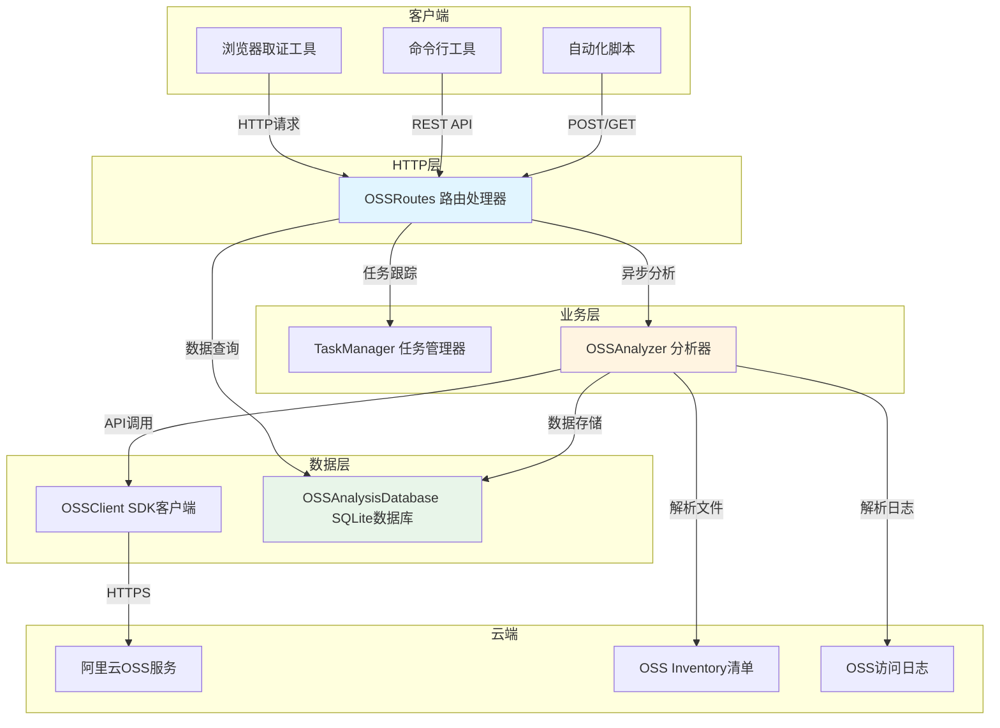
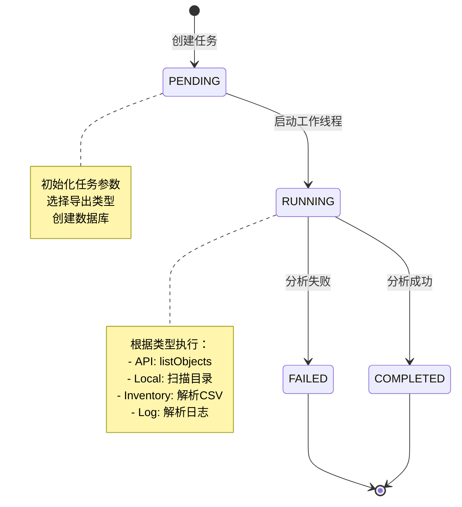
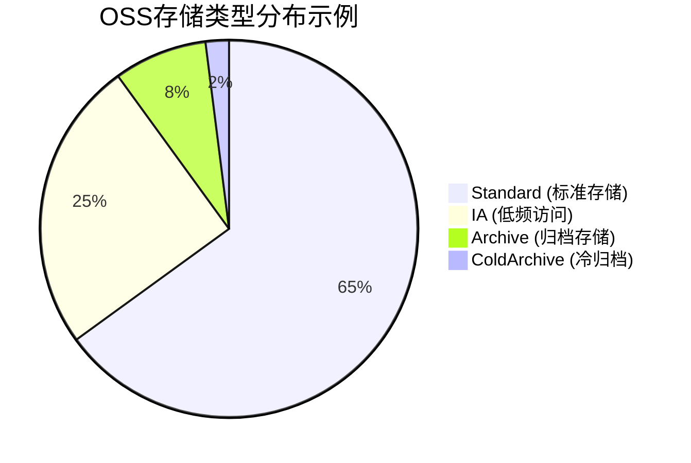
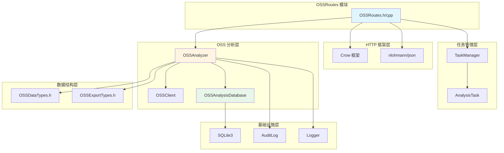
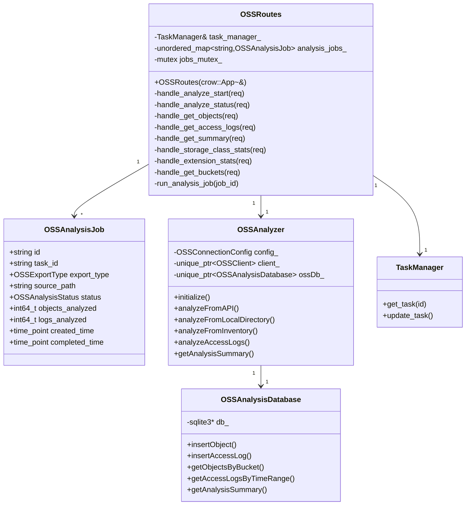
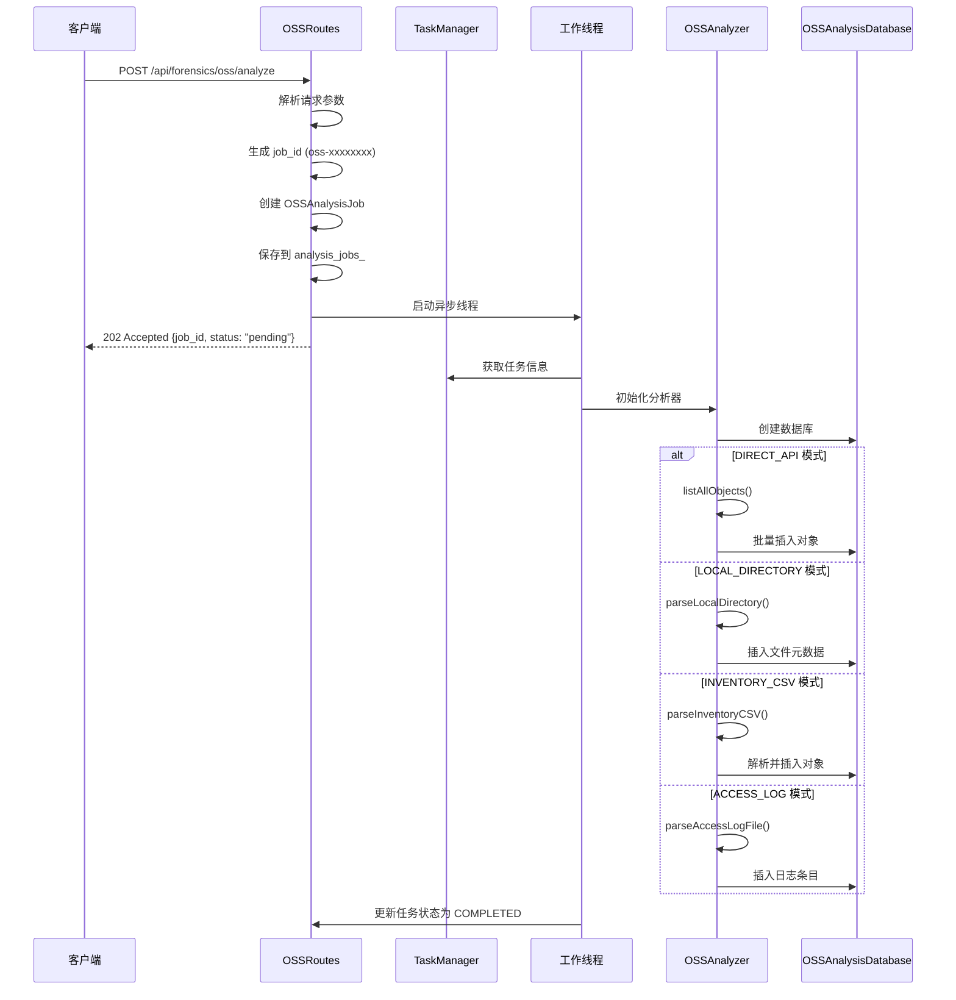
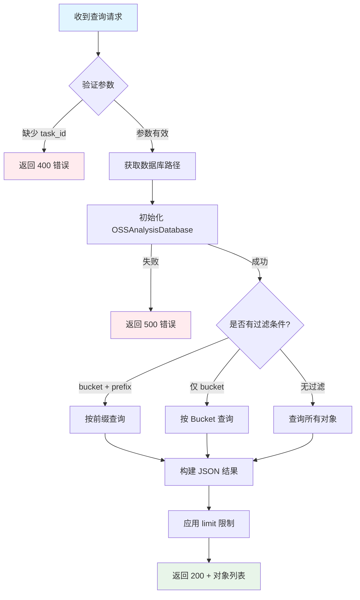

# OSSRoutes - 阿里云 OSS 分析路由模块

> **模块定位**: 提供 HTTP API 接口用于分析阿里云 OSS（对象存储服务）数据，支持多种数据获取方式和取证分析

---

## 1. 模块背景

### 业务背景

在云存储取证的背景下，越来越多的证据数据存储在云端对象存储服务中。阿里云 OSS 是国内最常用的云存储服务之一，对 OSS 数据的取证分析需求主要包括：

1. **证据固定**：获取 OSS 对象列表、元数据和访问日志
2. **时间线重建**：通过访问日志分析对象的操作历史
3. **数据分类**：按存储类型、扩展名、Bucket 等维度分类统计
4. **异常检测**：识别异常访问模式、可疑文件活动
5. **合规审计**：验证数据存储的合规性（如删除记录、访问控制）

### 技术背景

OSSRoutes 模块是 C++ HTTP 服务器的取证路由组的一部分，专门处理 OSS 相关的 HTTP 请求：



**四种数据获取方式对比**：

| 获取方式 | 适用场景 | 优势 | 限制 |
|---------|---------|------|------|
| **DIRECT_API** | 需要实时数据、在线分析 | 数据最新、元数据完整 | 需要网络、需要凭证 |
| **LOCAL_DIRECTORY** | 已下载的本地数据、离线分析 | 无需网络、速度快 | 需提前下载 |
| **INVENTORY_CSV** | 大规模 Bucket、定期分析 | 适合海量数据、清单功能免费 | 有延迟（T+1） |
| **ACCESS_LOG** | 审计取证、异常检测 | 完整操作历史、IP追踪 | 需要提前开启日志 |

**技术选型理由**：

- **异步任务架构**：OSS 分析可能耗时较长（数小时），采用异步任务避免 HTTP 超时
- **四种分析模式**：适配不同取证场景（在线/离线、实时/清单）
- **SQLite 存储结果**：便于后续查询和分析，支持本地缓存
- **CORS 支持**：允许浏览器直接调用 API
- **Swagger 集成**：自动生成 API 文档

---

## 2. 模块功能

### 核心功能

#### 2.1 OSS 分析任务管理

提供完整的异步任务生命周期管理：



**任务状态机**：

- **PENDING**（待执行）：任务已创建，等待工作线程启动
- **RUNNING**（运行中）：正在执行分析，进度通过 `objects_analyzed` 报告
- **COMPLETED**（已完成）：分析成功完成
- **FAILED**（失败）：分析过程中出现错误，错误信息保存在 `error_message`

#### 2.2 多模式数据获取

```cpp
// 模式1: 通过阿里云OSS API实时分析
// 适用于：在线取证、最新数据获取
{
  "task_id": "task_123",
  "export_type": "direct_api"
}

// 模式2: 分析本地已下载的目录
// 适用于：离线取证、本地数据快速分析
{
  "task_id": "task_123",
  "export_type": "local_directory",
  "source_path": "/evidence/oss_download"
}

// 模式3: 分析OSS Inventory清单CSV文件
// 适用于：大规模Bucket（数百万对象）、定期取证
{
  "task_id": "task_123",
  "export_type": "inventory_csv",
  "source_path": "/evidence/inventory.csv"
}

// 模式4: 分析OSS访问日志
// 适用于：审计取证、异常检测、时间线分析
{
  "task_id": "task_123",
  "export_type": "access_log",
  "source_path": "/evidence/oss_logs/"
}
```

#### 2.3 OSS 对象查询

支持多维度查询 OSS 对象：

- **按 Bucket 查询**：获取指定 Bucket 的所有对象
- **按前缀查询**：筛选指定路径下的对象（如 `"backup/"`）
- **按扩展名统计**：分析文件类型分布
- **按存储类型统计**：Standard/IA/Archive 分类统计
- **Deleted 对象识别**：标记已删除对象（用于数据恢复取证）

#### 2.4 访问日志分析

解析 OSS 访问日志，支持：

- **时间范围查询**：指定时间段的访问记录
- **操作类型筛选**：GetObject/PutObject/DeleteObject 等
- **IP 追踪**：分析访问来源 IP
- **User-Agent 分析**：识别访问工具和客户端
- **流量统计**：分析传输字节数和频率

#### 2.5 存储统计分析



提供多维度统计：

- **按存储类型**：分析成本优化潜力
- **按扩展名**：识别文件类型分布
- **按 Bucket**：多 Bucket 资源使用对比
- **按操作类型**：访问模式分析

#### 2.6 Bucket 信息管理

获取 Bucket 的完整配置信息：

- **ACL 配置**：访问控制策略（private/public-read）
- **版本控制状态**：是否启用版本控制
- **日志配置**：访问日志存储位置
- **地域信息**：Bucket 所在地域（oss-cn-hangzhou）
- **统计信息**：对象数量、总大小

### 边界与限制

| 限制项 | 限制值 | 说明 |
|-------|--------|------|
| **并发分析任务** | 无硬限制 | 受系统资源限制 |
| **单次查询结果数** | 默认 100 | 通过 `limit` 参数调整 |
| **API 模式凭证** | 需要 AK/SK | 需提前配置 `.env` 文件 |
| **访问日志格式** | 标准 OSS 日志格式 | 兼容大部分日志格式 |
| **Inventory CSV** | 标准格式 | 支持自定义字段映射 |
| **本地分析模式** | 无网络要求 | 纯本地文件扫描 |
| **数据库路径约定** | `{task_id}_oss.db` | 自动推导，无需手动指定 |

**不支持的功能**：

- ❌ 不支持其他云厂商（AWS S3、Azure Blob 等）
- ❌ 不支持直接下载对象内容（只获取元数据）
- ❌ 不支持实时推送（需主动轮询任务状态）
- ❌ 不支持跨账户批量授权（需逐个配置凭证）

---

## 3. 模块使用的库

### 依赖库清单

```cpp
// 核心依赖
#include <crow.h>                    // HTTP 框架
#include <nlohmann/json.hpp>         // JSON 解析
#include <sqlite3.h>                 // 数据库操作

// 内部模块
#include "../TaskManager.h"          // 任务管理器
#include "OSSAnalyzer/OSSAnalyzer.h" // OSS 分析器

// 标准库
#include <mutex>                     // 线程安全
#include <thread>                    // 异步任务
#include <unordered_map>             // 任务存储
#include <random>                    // Job ID 生成
#include <chrono>                    // 时间戳处理
```

### 依赖关系图



**关键依赖说明**：

1. **Crow Framework**：轻量级 C++ HTTP 框架
   - 类似 Flask 的路由语法
   - 内置 JSON 支持
   - 异步多线程处理

2. **nlohmann/json**：现代 C++ JSON 库
   - 直观的 API 设计
   - 自动类型转换
   - STL 容器集成

3. **SQLite3**：嵌入式数据库
   - 无需独立数据库服务器
   - 事务支持（ACID）
   - 单文件存储，便于取证归档

---

## 4. 模块实现方式

### 架构设计



### 核心类说明

#### 4.1 OSSRoutes 类

路由处理器主类，负责 HTTP 请求的注册和处理。

**成员变量**：

```cpp
class OSSRoutes {
private:
    TaskManager& task_manager_;                              // 任务管理器引用
    std::unordered_map<std::string, OSSAnalysisJob> analysis_jobs_;  // 分析任务表
    std::mutex jobs_mutex_;                                  // 任务表的互斥锁
};
```

**核心方法**：

```cpp
// 任务启动
crow::response handle_analyze_start(const crow::request& req);

// 任务状态查询
crow::response handle_analyze_status(const crow::request& req);

// 对象查询
crow::response handle_get_objects(const crow::request& req);

// 访问日志查询
crow::response handle_get_access_logs(const crow::request& req);

// 分析摘要
crow::response handle_get_summary(const crow::request& req);

// 存储类型统计
crow::response handle_storage_class_stats(const crow::request& req);

// 扩展名统计
crow::response handle_extension_stats(const crow::request& req);

// Bucket 列表
crow::response handle_get_buckets(const crow::request& req);

// 异步任务执行
void run_analysis_job(const std::string& job_id);
```

#### 4.2 OSSAnalysisJob 结构

跟踪分析任务的状态和进度。

```cpp
struct OSSAnalysisJob {
    std::string id;                                          // 任务唯一标识（oss-xxxxxxxx）
    std::string task_id;                                     // 关联的主任务ID
    ForensicAnalyzer::OSS::OSSExportType export_type;       // 导出类型
    std::string source_path;                                 // 数据源路径
    OSSAnalysisStatus status;                                // 当前状态
    std::string error_message;                               // 错误信息（失败时）
    int64_t objects_analyzed;                                // 已分析对象数
    int64_t logs_analyzed;                                   // 已分析日志数
    std::chrono::system_clock::time_point created_time;      // 创建时间
    std::chrono::system_clock::time_point completed_time;    // 完成时间
};
```

#### 4.3 OSSAnalyzer 类

OSS 分析的核心业务逻辑类。

```cpp
class OSSAnalyzer {
public:
    // 初始化
    bool initialize();

    // 四种分析模式
    bool analyzeFromAPI(const std::string& bucketName = "", const std::string& prefix = "");
    bool analyzeFromLocalDirectory(const std::string& localDir, const std::string& bucketName = "local");
    bool analyzeFromInventory(const std::string& csvPath);
    bool analyzeAccessLogs(const std::string& logPath);

    // 查询方法
    std::vector<OSSObjectInfo> getAllObjects();
    std::vector<OSSObjectInfo> getObjectsByBucket(const std::string& bucket);
    std::vector<OSSAccessLogEntry> getAccessLogs(int64_t startTime = 0, int64_t endTime = 0);
    OSSAnalysisSummary getAnalysisSummary();

    // 进度回调
    void setProgressCallback(AnalysisProgressCallback callback);

private:
    OSSConnectionConfig config_;                             // 连接配置
    std::unique_ptr<OSSClient> client_;                      // SDK 客户端
    std::unique_ptr<OSSAnalysisDatabase> ossDb_;             // 数据库
    AnalysisProgressCallback progressCallback_;              // 进度回调函数
};
```

### 关键流程

#### 4.1 启动 OSS 分析任务



**关键代码片段**：

```cpp
crow::response OSSRoutes::handle_analyze_start(const crow::request& req) {
    // 1. 解析请求参数
    json body = json::parse(req.body);
    std::string task_id = body["task_id"].get<std::string>();

    // 2. 创建分析任务
    OSSAnalysisJob job;
    job.id = generate_job_id();  // 生成 oss-xxxxxxxx 格式
    job.task_id = task_id;
    job.status = OSSAnalysisStatus::PENDING;
    job.created_time = std::chrono::system_clock::now();

    // 3. 解析导出类型
    std::string export_type_str = body.value("export_type", "local_directory");
    if (export_type_str == "direct_api") {
        job.export_type = OSSExportType::DIRECT_API;
    } else if (export_type_str == "inventory_csv") {
        job.export_type = OSSExportType::INVENTORY_CSV;
    } else if (export_type_str == "access_log") {
        job.export_type = OSSExportType::ACCESS_LOG;
    } else {
        job.export_type = OSSExportType::LOCAL_DIRECTORY;
    }

    // 4. 源路径
    if (body.contains("source_path")) {
        job.source_path = body["source_path"].get<std::string>();
    }

    // 5. 存储任务（线程安全）
    {
        std::lock_guard<std::mutex> lock(jobs_mutex_);
        analysis_jobs_[job.id] = job;
    }

    // 6. 启动异步分析
    std::thread([this, job_id]() {
        run_analysis_job(job_id);
    }).detach();

    // 7. 立即返回
    json response = {
        {"success", true},
        {"message", "OSS analysis job started"},
        {"job_id", job.id},
        {"status", "pending"}
    };
    res.code = 202;
    res.write(response.dump());
    return res;
}
```

#### 4.2 异步任务执行流程

```cpp
void OSSRoutes::run_analysis_job(const std::string& job_id) {
    // 1. 获取任务信息（线程安全）
    OSSAnalysisJob job;
    {
        std::lock_guard<std::mutex> lock(jobs_mutex_);
        auto it = analysis_jobs_.find(job_id);
        if (it == analysis_jobs_.end()) return;
        job = it->second;
        it->second.status = OSSAnalysisStatus::RUNNING;  // 更新状态为运行中
    }

    try {
        // 2. 获取主任务信息
        AnalysisTask task = task_manager_.get_task(job.task_id);
        if (task.id.empty()) {
            throw std::runtime_error("Task not found: " + job.task_id);
        }

        // 3. 创建数据库路径（约定：{task_id}_oss.db）
        std::string oss_db_path = task.output_raw_db.substr(
            0, task.output_raw_db.find_last_of('.')
        ) + "_oss.db";

        // 4. 初始化分析器
        OSSAnalyzer analyzer;
        analyzer.setOutputDbPath(oss_db_path);
        analyzer.setProgressCallback([&job, this](const std::string& phase, int64_t current, int64_t total) {
            std::lock_guard<std::mutex> lock(jobs_mutex_);
            auto it = analysis_jobs_.find(job.id);
            if (it != analysis_jobs_.end()) {
                it->second.objects_analyzed = current;  // 更新进度
            }
        });

        if (!analyzer.initialize()) {
            throw std::runtime_error("Failed to initialize OSS analyzer");
        }

        // 5. 根据导出类型执行分析
        bool success = false;
        switch (job.export_type) {
            case OSSExportType::LOCAL_DIRECTORY:
                success = analyzer.analyzeFromLocalDirectory(job.source_path);
                break;
            case OSSExportType::INVENTORY_CSV:
                success = analyzer.analyzeFromInventory(job.source_path);
                break;
            case OSSExportType::ACCESS_LOG:
                success = analyzer.analyzeAccessLogs(job.source_path);
                break;
            case OSSExportType::DIRECT_API:
                success = analyzer.analyzeFromAPI();
                break;
        }

        if (!success) {
            throw std::runtime_error(analyzer.getLastError());
        }

        // 6. 获取分析结果统计
        auto summary = analyzer.getAnalysisSummary();

        // 7. 更新任务状态为完成
        {
            std::lock_guard<std::mutex> lock(jobs_mutex_);
            auto it = analysis_jobs_.find(job_id);
            if (it != analysis_jobs_.end()) {
                it->second.status = OSSAnalysisStatus::COMPLETED;
                it->second.objects_analyzed = summary.totalObjects;
                it->second.logs_analyzed = summary.logEntriesCount;
                it->second.completed_time = std::chrono::system_clock::now();
            }
        }

    } catch (const std::exception& e) {
        // 8. 错误处理
        std::lock_guard<std::mutex> lock(jobs_mutex_);
        auto it = analysis_jobs_.find(job_id);
        if (it != analysis_jobs_.end()) {
            it->second.status = OSSAnalysisStatus::FAILED;
            it->second.error_message = e.what();
            it->second.completed_time = std::chrono::system_clock::now();
        }
    }
}
```

#### 4.3 对象查询流程



**关键代码**：

```cpp
crow::response OSSRoutes::handle_get_objects(const crow::request& req) {
    auto params = crow::query_string(req.url_params);
    std::string task_id = params.get("task_id") ? params.get("task_id") : "";
    std::string bucket = params.get("bucket") ? params.get("bucket") : "";
    std::string prefix = params.get("prefix") ? params.get("prefix") : "";
    int limit = params.get("limit") ? std::stoi(params.get("limit")) : 100;

    if (task_id.empty()) {
        json error = {{"error", "task_id parameter is required"}};
        res.code = 400;
        res.write(error.dump());
        return res;
    }

    try {
        // 1. 获取数据库路径
        std::string oss_db_path = get_oss_database_path(task_id);
        OSSAnalysisDatabase db(oss_db_path);
        if (!db.initialize()) {
            throw std::runtime_error("Failed to open OSS database");
        }

        // 2. 根据过滤条件查询
        std::vector<OSSObjectInfo> objects;
        if (!bucket.empty() && !prefix.empty()) {
            objects = db.getObjectsByPrefix(bucket, prefix);
        } else if (!bucket.empty()) {
            objects = db.getObjectsByBucket(bucket);
        } else {
            objects = db.getAllObjects();
        }

        // 3. 构建 JSON 结果
        json result = json::array();
        int count = 0;
        for (const auto& obj : objects) {
            if (count >= limit) break;
            result.push_back({
                {"bucket", obj.bucket},
                {"key", obj.key},
                {"size", obj.size},
                {"etag", obj.etag},
                {"last_modified", obj.lastModified},
                {"storage_class", obj.storageClass},
                {"content_type", obj.contentType},
                {"is_deleted", obj.isDeleted}
            });
            count++;
        }

        res.write(result.dump());
    } catch (const std::exception& e) {
        json error = {{"error", e.what()}};
        res.code = 500;
        res.write(error.dump());
    }

    return res;
}
```

#### 4.4 访问日志查询流程

```cpp
crow::response OSSRoutes::handle_get_access_logs(const crow::request& req) {
    auto params = crow::query_string(req.url_params);
    std::string task_id = params.get("task_id") ? params.get("task_id") : "";
    int64_t start_time = params.get("start_time") ? std::stoll(params.get("start_time")) : 0;
    int64_t end_time = params.get("end_time") ? std::stoll(params.get("end_time")) : 0;
    std::string operation = params.get("operation") ? params.get("operation") : "";

    // ... 参数验证 ...

    try {
        std::string oss_db_path = get_oss_database_path(task_id);
        OSSAnalysisDatabase db(oss_db_path);
        if (!db.initialize()) {
            throw std::runtime_error("Failed to open OSS database");
        }

        std::vector<OSSAccessLogEntry> logs;
        if (!operation.empty()) {
            // 按操作类型查询
            logs = db.getAccessLogsByOperation(operation);
        } else {
            // 按时间范围查询
            logs = db.getAccessLogsByTimeRange(start_time, end_time);
        }

        // 构建 JSON 结果
        json result = json::array();
        for (const auto& log : logs) {
            result.push_back({
                {"request_id", log.requestId},
                {"timestamp", log.timestamp},
                {"operation", log.operation},
                {"bucket", log.bucket},
                {"object_key", log.objectKey},
                {"remote_ip", log.remoteIP},
                {"user_agent", log.userAgent},
                {"http_status", log.httpStatus},
                {"bytes_sent", log.bytesSent}
            });
        }

        res.write(result.dump());
    } catch (const std::exception& e) {
        json error = {{"error", e.what()}};
        res.code = 500;
        res.write(error.dump());
    }

    return res;
}
```

### 数据结构

#### 4.1 OSSObjectInfo（对象信息）

```cpp
struct OSSObjectInfo {
    std::string key;                                 // 对象键（完整路径）
    std::string bucket;                              // 所属 Bucket
    int64_t size = 0;                                // 对象大小（字节）
    std::string etag;                                // ETag（通常是 MD5）
    int64_t lastModified = 0;                        // 最后修改时间（Unix 时间戳）
    std::string storageClass;                        // 存储类型
    std::string contentType;                         // MIME 类型
    std::string owner;                               // 所有者 ID
    std::map<std::string, std::string> userMeta;     // 用户自定义元数据

    // 分析相关字段
    int64_t analyzedAt = 0;                          // 分析时间
    std::string md5Hash;                             // 本地计算的 MD5
    bool isDeleted = false;                          // 是否已删除
    std::string versionId;                           // 版本 ID
};
```

#### 4.2 OSSAccessLogEntry（访问日志）

```cpp
struct OSSAccessLogEntry {
    std::string requestId;                           // 请求 ID（唯一标识）
    int64_t timestamp = 0;                           // 请求时间（Unix 时间戳）
    std::string operation;                           // 操作类型
    std::string bucket;                              // 目标 Bucket
    std::string objectKey;                           // 目标对象键
    std::string remoteIP;                            // 客户端 IP
    std::string userAgent;                           // User-Agent
    std::string accesserId;                          // 访问者 ID
    int httpStatus = 0;                              // HTTP 状态码
    int64_t bytesSent = 0;                           // 发送字节数
    int64_t objectSize = 0;                          // 对象大小
    int64_t timeTakenMs = 0;                         // 请求耗时（毫秒）
    std::string referer;                             // HTTP Referer
    std::string host;                                // 请求 Host
    std::string signatureVersion;                    // 签名版本
    bool sslEnabled = false;                         // 是否 HTTPS
};
```

#### 4.3 OSSBucketInfo（Bucket 信息）

```cpp
struct OSSBucketInfo {
    std::string name;                                // Bucket 名称
    std::string region;                              // 地域
    std::string endpoint;                            // 访问域名
    std::string acl;                                 // 访问控制
    std::string owner;                               // 所有者 ID
    int64_t creationDate = 0;                        // 创建时间
    bool versioningEnabled = false;                  // 是否启用版本控制
    bool loggingEnabled = false;                     // 是否启用日志
    std::string loggingBucket;                       // 日志存储 Bucket
    std::string loggingPrefix;                       // 日志前缀
    std::string storageClass;                        // 默认存储类型

    // 统计信息
    int64_t objectCount = 0;                         // 对象数量
    int64_t totalSize = 0;                           // 总大小
    int64_t analyzedAt = 0;                          // 分析时间
};
```

#### 4.4 OSSAnalysisSummary（分析摘要）

```cpp
struct OSSAnalysisSummary {
    int64_t totalObjects = 0;                        // 总对象数
    int64_t totalSize = 0;                           // 总大小
    int64_t deletedObjects = 0;                      // 已删除对象数
    int64_t logEntriesCount = 0;                     // 日志条目数

    std::map<std::string, int64_t> objectsByStorageClass;  // 按存储类型统计
    std::map<std::string, int64_t> objectsByExtension;     // 按扩展名统计
    std::map<std::string, int64_t> operationCounts;        // 操作类型统计

    int64_t analysisStartTime = 0;                   // 分析开始时间
    int64_t analysisEndTime = 0;                     // 分析结束时间
    std::string exportType;                          // 导出类型
};
```

---

## 5. API 调用

### C++ API

OSSRoutes 本身是 HTTP 路由处理器，主要通过 REST API 调用。内部使用 OSSAnalyzer C++ API：

```cpp
// 示例1: 直接使用 OSSAnalyzer（不通过 HTTP）
#include "OSSAnalyzer/OSSAnalyzer.h"

using namespace ForensicAnalyzer::OSS;

// 创建分析器
OSSAnalyzer analyzer;
analyzer.setOutputDbPath("evidence_oss.db");

// 设置进度回调
analyzer.setProgressCallback([](const std::string& phase, int64_t current, int64_t total) {
    std::cout << "[" << phase << "] " << current << "/" << total << std::endl;
});

// 初始化
if (!analyzer.initialize()) {
    std::cerr << "初始化失败: " << analyzer.getLastError() << std::endl;
    return;
}

// 方式1: 通过 API 分析（需要配置凭证）
if (analyzer.analyzeFromAPI("my-bucket", "backup/")) {
    std::cout << "API 分析完成" << std::endl;
}

// 方式2: 分析本地目录
if (analyzer.analyzeFromLocalDirectory("/evidence/oss_download", "local-bucket")) {
    std::cout << "本地分析完成" << std::endl;
}

// 方式3: 分析 Inventory 清单
if (analyzer.analyzeFromInventory("/evidence/inventory.csv")) {
    std::cout << "Inventory 分析完成" << std::endl;
}

// 方式4: 分析访问日志
if (analyzer.analyzeAccessLogs("/evidence/oss_logs/")) {
    std::cout << "日志分析完成" << std::endl;
}

// 查询结果
auto objects = analyzer.getObjectsByBucket("my-bucket");
for (const auto& obj : objects) {
    std::cout << obj.key << " (" << obj.size << " bytes)" << std::endl;
}

// 获取统计摘要
auto summary = analyzer.getAnalysisSummary();
std::cout << "总对象数: " << summary.totalObjects << std::endl;
std::cout << "总大小: " << summary.totalSize << " bytes" << std::endl;
std::cout << "日志条目: " << summary.logEntriesCount << std::endl;

// 按存储类型统计
for (const auto& [cls, count] : summary.objectsByStorageClass) {
    std::cout << "  " << cls << ": " << count << std::endl;
}
```

### 命令行 API

通过 `curl` 命令调用 REST API：

#### 5.1 启动 OSS 分析任务

```bash
# 1. 通过阿里云 OSS API 实时分析
curl -X POST http://localhost:8080/api/forensics/oss/analyze \
  -H "Content-Type: application/json" \
  -d '{
    "task_id": "task_123",
    "export_type": "direct_api"
  }'

# 响应
# {
#   "success": true,
#   "message": "OSS analysis job started",
#   "job_id": "oss-a3b2c1d4",
#   "status": "pending"
# }

# 2. 分析本地已下载的目录
curl -X POST http://localhost:8080/api/forensics/oss/analyze \
  -H "Content-Type: application/json" \
  -d '{
    "task_id": "task_123",
    "export_type": "local_directory",
    "source_path": "/evidence/oss_download"
  }'

# 3. 分析 OSS Inventory 清单文件
curl -X POST http://localhost:8080/api/forensics/oss/analyze \
  -H "Content-Type: application/json" \
  -d '{
    "task_id": "task_123",
    "export_type": "inventory_csv",
    "source_path": "/evidence/inventory_20250315.csv"
  }'

# 4. 分析 OSS 访问日志
curl -X POST http://localhost:8080/api/forensics/oss/analyze \
  -H "Content-Type: application/json" \
  -d '{
    "task_id": "task_123",
    "export_type": "access_log",
    "source_path": "/evidence/oss_logs/2025-03-15/"
  }'
```

#### 5.2 查询分析任务状态

```bash
# 查询任务状态
curl "http://localhost:8080/api/forensics/oss/analyze/status?job_id=oss-a3b2c1d4"

# 响应（运行中）
# {
#   "job_id": "oss-a3b2c1d4",
#   "task_id": "task_123",
#   "status": "running",
#   "objects_analyzed": 15234,
#   "logs_analyzed": 0
# }

# 响应（完成）
# {
#   "job_id": "oss-a3b2c1d4",
#   "task_id": "task_123",
#   "status": "completed",
#   "objects_analyzed": 48562,
#   "logs_analyzed": 0
# }

# 响应（失败）
# {
#   "job_id": "oss-a3b2c1d4",
#   "task_id": "task_123",
#   "status": "failed",
#   "error": "Failed to initialize OSS analyzer: Invalid credentials"
# }
```

#### 5.3 获取 OSS 对象列表

```bash
# 获取所有对象
curl "http://localhost:8080/api/forensics/oss/objects?task_id=task_123&limit=50"

# 按 Bucket 筛选
curl "http://localhost:8080/api/forensics/oss/objects?task_id=task_123&bucket=my-bucket&limit=100"

# 按前缀筛选（如 "backup/" 目录）
curl "http://localhost:8080/api/forensics/oss/objects?task_id=task_123&bucket=my-bucket&prefix=backup/&limit=200"

# 响应
# [
#   {
#     "bucket": "my-bucket",
#     "key": "backup/database.sql",
#     "size": 1048576,
#     "etag": "\"d41d8cd98f00b204e9800998ecf8427e\"",
#     "last_modified": 1740672000,
#     "storage_class": "Standard",
#     "content_type": "application/octet-stream",
#     "is_deleted": false
#   },
#   ...
# ]
```

#### 5.4 获取访问日志

```bash
# 获取所有日志
curl "http://localhost:8080/api/forensics/oss/logs?task_id=task_123"

# 按时间范围筛选
curl "http://localhost:8080/api/forensics/oss/logs?task_id=task_123&start_time=1740672000&end_time=1740758400"

# 按操作类型筛选
curl "http://localhost:8080/api/forensics/oss/logs?task_id=task_123&operation=GetObject"

# 响应
# [
#   {
#     "request_id": "log_1234567890",
#     "timestamp": 1740672000,
#     "operation": "GetObject",
#     "bucket": "my-bucket",
#     "object_key": "backup/database.sql",
#     "remote_ip": "203.0.113.1",
#     "user_agent": "aliyun-sdk-python/3.0.0",
#     "http_status": 200,
#     "bytes_sent": 1048576
#   },
#   ...
# ]
```

#### 5.5 获取分析摘要

```bash
curl "http://localhost:8080/api/forensics/oss/summary?task_id=task_123"

# 响应
# {
#   "total_objects": 48562,
#   "total_size": 536870912000,
#   "deleted_objects": 1523,
#   "log_entries_count": 152340,
#   "objects_by_storage_class": {
#     "Standard": 31565,
#     "IA": 12140,
#     "Archive": 4856,
#     "Local": 1
#   },
#   "operation_counts": {
#     "GetObject": 85234,
#     "PutObject": 42156,
#     "DeleteObject": 1523,
#     "HeadObject": 23427
#   }
# }
```

#### 5.6 存储类型统计

```bash
curl "http://localhost:8080/api/forensics/oss/statistics/storage-class?task_id=task_123"

# 响应
# [
#   {
#     "storage_class": "Standard",
#     "count": 31565,
#     "total_size": 429496729600
#   },
#   {
#     "storage_class": "IA",
#     "count": 12140,
#     "total_size": 85899345920
#   },
#   {
#     "storage_class": "Archive",
#     "count": 4856,
#     "total_size": 21474836480
#   }
# ]
```

#### 5.7 扩展名统计

```bash
curl "http://localhost:8080/api/forensics/oss/statistics/extensions?task_id=task_123"

# 响应
# [
#   {
#     "extension": ".jpg",
#     "count": 15234,
#     "total_size": 21474836480
#   },
#   {
#     "extension": ".mp4",
#     "count": 2341,
#     "total_size": 429496729600
#   },
#   {
#     "extension": ".pdf",
#     "count": 8523,
#     "total_size": 8589934592
#   }
# ]
```

#### 5.8 获取 Bucket 列表

```bash
curl "http://localhost:8080/api/forensics/oss/buckets?task_id=task_123"

# 响应
# [
#   {
#     "name": "my-bucket",
#     "region": "oss-cn-hangzhou",
#     "acl": "private",
#     "storage_class": "Standard",
#     "object_count": 31565,
#     "total_size": 429496729600,
#     "versioning_enabled": true,
#     "logging_enabled": true
#   },
#   ...
# ]
```

### REST API

完整的 API 端点列表：

| 方法 | 端点 | 描述 |
|------|------|------|
| **POST** | `/api/forensics/oss/analyze` | 启动 OSS 分析任务 |
| **GET** | `/api/forensics/oss/analyze/status` | 查询分析任务状态 |
| **GET** | `/api/forensics/oss/objects` | 获取 OSS 对象列表 |
| **GET** | `/api/forensics/oss/logs` | 获取访问日志 |
| **GET** | `/api/forensics/oss/summary` | 获取分析摘要 |
| **GET** | `/api/forensics/oss/statistics/storage-class` | 按存储类型统计 |
| **GET** | `/api/forensics/oss/statistics/extensions` | 按扩展名统计 |
| **GET** | `/api/forensics/oss/buckets` | 获取 Bucket 信息列表 |

**请求参数**：

##### POST /api/forensics/oss/analyze

```json
{
  "task_id": "string (必填)",          // 关联的主任务 ID
  "export_type": "string (可选)",      // 导出类型：direct_api, local_directory, inventory_csv, access_log
  "source_path": "string (可选)"       // 数据源路径（local_directory/inventory_csv/access_log 模式需要）
}
```

##### GET /api/forensics/oss/analyze/status

| 参数 | 类型 | 必填 | 描述 |
|------|------|------|------|
| `job_id` | string | 是 | 分析任务 ID |

##### GET /api/forensics/oss/objects

| 参数 | 类型 | 必填 | 描述 |
|------|------|------|------|
| `task_id` | string | 是 | 主任务 ID |
| `bucket` | string | 否 | 筛选 Bucket |
| `prefix` | string | 否 | 筛选对象键前缀 |
| `limit` | int | 否 | 最大返回数（默认 100） |

##### GET /api/forensics/oss/logs

| 参数 | 类型 | 必填 | 描述 |
|------|------|------|------|
| `task_id` | string | 是 | 主任务 ID |
| `start_time` | int64 | 否 | 开始时间（Unix 时间戳） |
| `end_time` | int64 | 否 | 结束时间（Unix 时间戳） |
| `operation` | string | 否 | 操作类型筛选 |

##### GET /api/forensics/oss/summary

| 参数 | 类型 | 必填 | 描述 |
|------|------|------|------|
| `task_id` | string | 是 | 主任务 ID |

##### GET /api/forensics/oss/statistics/storage-class

| 参数 | 类型 | 必填 | 描述 |
|------|------|------|------|
| `task_id` | string | 是 | 主任务 ID |

##### GET /api/forensics/oss/statistics/extensions

| 参数 | 类型 | 必填 | 描述 |
|------|------|------|------|
| `task_id` | string | 是 | 主任务 ID |

##### GET /api/forensics/oss/buckets

| 参数 | 类型 | 必填 | 描述 |
|------|------|------|------|
| `task_id` | string | 是 | 主任务 ID |

**响应格式**：

成功响应（HTTP 200）：
```json
{
  "field1": "value1",
  "field2": "value2"
}
```

错误响应：
- HTTP 400：参数错误
- HTTP 404：任务/数据库不存在
- HTTP 500：服务器内部错误

```json
{
  "error": "错误消息描述"
}
```

---

## 6. 二次开发

### 扩展点

#### 6.1 添加新的分析模式

如果需要支持其他数据源（如其他云厂商），可以扩展 `OSSExportType` 枚举：

```cpp
// 1. 在 Common/OSSExportTypes.h 中添加新类型
enum class OSSExportType {
    DIRECT_API,
    LOCAL_DIRECTORY,
    INVENTORY_CSV,
    ACCESS_LOG,
    AWS_S3          // 新增：AWS S3 支持
};
```

```cpp
// 2. 在 OSSAnalyzer.h 中添加新的分析方法
class OSSAnalyzer {
public:
    // 新增方法
    bool analyzeFromS3(const std::string& bucketName, const std::string& prefix = "");

private:
    bool parseS3Inventory(const std::string& csvPath);  // S3 Inventory 解析
};
```

```cpp
// 3. 在 OSSRoutes.cpp 中添加路由支持
crow::response OSSRoutes::handle_analyze_start(const crow::request& req) {
    // ...
    std::string export_type_str = body.value("export_type", "local_directory");
    if (export_type_str == "aws_s3") {
        job.export_type = OSSExportType::AWS_S3;  // 新增类型
    }
    // ...
}
```

```cpp
// 4. 在 run_analysis_job 中添加处理逻辑
void OSSRoutes::run_analysis_job(const std::string& job_id) {
    // ...
    switch (job.export_type) {
        // ...
        case OSSExportType::AWS_S3:
            success = analyzer.analyzeFromS3(job.source_path);
            break;
    }
    // ...
}
```

#### 6.2 添加新的查询维度

例如，按对象大小范围查询：

```cpp
// 1. 在 Database/OSSAnalysisDatabase.h 中添加新方法
class OSSAnalysisDatabase {
public:
    // 新增：按大小范围查询
    std::vector<OSSObjectInfo> getObjectsBySizeRange(int64_t minSize, int64_t maxSize);
};
```

```cpp
// 2. 在 Database/OSSAnalysisDatabase.cpp 中实现
std::vector<OSSObjectInfo> OSSAnalysisDatabase::getObjectsBySizeRange(int64_t minSize, int64_t maxSize) {
    std::vector<OSSObjectInfo> results;

    const char* sql = R"SQL(
        SELECT bucket, key, size, etag, last_modified, storage_class,
               content_type, is_deleted, version_id
        FROM oss_objects
        WHERE size >= ? AND size <= ?
        ORDER BY size DESC
    )SQL";

    sqlite3_stmt* stmt;
    if (sqlite3_prepare_v2(db_, sql, -1, &stmt, nullptr) == SQLITE_OK) {
        sqlite3_bind_int64(stmt, 1, minSize);
        sqlite3_bind_int64(stmt, 2, maxSize);

        while (sqlite3_step(stmt) == SQLITE_ROW) {
            results.push_back(parseObjectRow(stmt));
        }
        sqlite3_finalize(stmt);
    }

    return results;
}
```

```cpp
// 3. 在 OSSRoutes 中添加新端点
OSSRoutes::OSSRoutes(crow::App<>& app) : task_manager_(TaskManager::instance()) {
    // ... 现有路由 ...

    // 新增：按大小范围查询
    CROW_ROUTE(app, "/api/forensics/oss/objects/by-size").methods("GET"_method)(
        [this](const crow::request& req) {
            return handle_get_objects_by_size(req);
        }
    );
}

crow::response OSSRoutes::handle_get_objects_by_size(const crow::request& req) {
    auto params = crow::query_string(req.url_params);
    std::string task_id = params.get("task_id") ? params.get("task_id") : "";
    int64_t min_size = params.get("min_size") ? std::stoll(params.get("min_size")) : 0;
    int64_t max_size = params.get("max_size") ? std::stoll(params.get("max_size")) : INT64_MAX;

    // ... 参数验证 ...

    try {
        std::string oss_db_path = get_oss_database_path(task_id);
        OSSAnalysisDatabase db(oss_db_path);
        if (!db.initialize()) {
            throw std::runtime_error("Failed to open OSS database");
        }

        auto objects = db.getObjectsBySizeRange(min_size, max_size);

        json result = json::array();
        for (const auto& obj : objects) {
            result.push_back({
                {"bucket", obj.bucket},
                {"key", obj.key},
                {"size", obj.size},
                {"last_modified", obj.lastModified}
            });
        }

        res.write(result.dump());
    } catch (const std::exception& e) {
        json error = {{"error", e.what()}};
        res.code = 500;
        res.write(error.dump());
    }

    return res;
}
```

**使用示例**：

```bash
# 查询大小在 1MB 到 100MB 之间的对象
curl "http://localhost:8080/api/forensics/oss/objects/by-size?task_id=task_123&min_size=1048576&max_size=104857600"
```

#### 6.3 添加实时进度推送

当前进度通过轮询 `/analyze/status` 获取，可以改为 WebSocket 推送：

```cpp
// 1. 在 OSSRoutes.h 中添加 WebSocket 支持
#include <crow/websocket.h>

class OSSRoutes {
private:
    // WebSocket 连接映射
    std::unordered_map<std::string, std::shared_ptr<crow::websocket::connection>> ws_connections_;
    std::mutex ws_mutex_;

public:
    // WebSocket 消息处理
    void on_ws_message(crow::websocket::connection& conn, const std::string& msg);
    void on_ws_close(crow::websocket::connection& conn);
};
```

```cpp
// 2. 在 OSSRoutes.cpp 中注册 WebSocket 路由
OSSRoutes::OSSRoutes(crow::App<>& app) : task_manager_(TaskManager::instance()) {
    // ... 现有路由 ...

    // WebSocket 路由
    CROW_WEBSOCKET_ROUTE(app, "/api/forensics/oss/progress")
        .onopen([&](crow::websocket::connection& conn) {
            // 连接建立
        })
        .onmessage([this](crow::websocket::connection& conn, const std::string& msg) {
            on_ws_message(conn, msg);
        })
        .onclose([this](crow::websocket::connection& conn) {
            on_ws_close(conn);
        });
}
```

```cpp
// 3. 处理 WebSocket 消息
void OSSRoutes::on_ws_message(crow::websocket::connection& conn, const std::string& msg) {
    try {
        json data = json::parse(msg);
        std::string action = data["action"].get<std::string>();

        if (action == "subscribe") {
            std::string job_id = data["job_id"].get<std::string>();

            // 保存连接
            std::lock_guard<std::mutex> lock(ws_mutex_);
            ws_connections_[job_id] = conn.shared_from_this();
        }
    } catch (const std::exception& e) {
        // 错误处理
    }
}

void OSSRoutes::on_ws_close(crow::websocket::connection& conn) {
    // 移除连接
    std::lock_guard<std::mutex> lock(ws_mutex_);
    for (auto it = ws_connections_.begin(); it != ws_connections_.end(); ) {
        if (it->second.get() == &conn) {
            it = ws_connections_.erase(it);
        } else {
            ++it;
        }
    }
}
```

```cpp
// 4. 在进度回调中推送更新
OSSRoutes::OSSRoutes(crow::App<>& app) : task_manager_(TaskManager::instance()) {
    // ...
}

void OSSRoutes::run_analysis_job(const std::string& job_id) {
    // ...
    analyzer.setProgressCallback([this, job_id](const std::string& phase, int64_t current, int64_t total) {
        // 更新任务状态
        {
            std::lock_guard<std::mutex> lock(jobs_mutex_);
            auto it = analysis_jobs_.find(job_id);
            if (it != analysis_jobs_.end()) {
                it->second.objects_analyzed = current;
            }
        }

        // WebSocket 推送
        {
            std::lock_guard<std::mutex> lock(ws_mutex_);
            auto ws_it = ws_connections_.find(job_id);
            if (ws_it != ws_connections_.end()) {
                json progress = {
                    {"job_id", job_id},
                    {"phase", phase},
                    {"current", current},
                    {"total", total}
                };
                ws_it->second->send_text(progress.dump());
            }
        }
    });
    // ...
}
```

**前端使用示例**：

```javascript
// 连接 WebSocket
const ws = new WebSocket('ws://localhost:8080/api/forensics/oss/progress');

ws.onopen = () => {
    // 订阅任务进度
    ws.send(JSON.stringify({
        action: 'subscribe',
        job_id: 'oss-a3b2c1d4'
    }));
};

ws.onmessage = (event) => {
    const progress = JSON.parse(event.data);
    console.log(`[${progress.phase}] ${progress.current}/${progress.total}`);
};
```

### 添加新功能的步骤

以"添加对象标签分析"功能为例：

#### Step 1: 扩展数据结构

```cpp
// 在 Common/OSSDataTypes.h 中添加标签字段
struct OSSObjectInfo {
    // ... 现有字段 ...

    // 新增：标签字段
    std::map<std::string, std::string> tags;  // 对象标签
};
```

#### Step 2: 更新数据库 Schema

```cpp
// 在 Database/OSSAnalysisDatabase.cpp 的 initialize() 中添加标签表
bool OSSAnalysisDatabase::initialize() {
    const char* sql = R"SQL(
        -- 对象表（添加标签列）
        CREATE TABLE IF NOT EXISTS oss_objects (
            id INTEGER PRIMARY KEY AUTOINCREMENT,
            bucket TEXT NOT NULL,
            key TEXT NOT NULL,
            size INTEGER,
            etag TEXT,
            last_modified INTEGER,
            storage_class TEXT,
            content_type TEXT,
            is_deleted INTEGER DEFAULT 0,
            version_id TEXT,
            tags TEXT,                    -- 新增：JSON 格式的标签
            analyzed_at INTEGER,
            UNIQUE(bucket, key, version_id)
        );

        -- 标签索引表（新增）
        CREATE TABLE IF NOT EXISTS oss_object_tags (
            id INTEGER PRIMARY KEY AUTOINCREMENT,
            object_id INTEGER NOT NULL,
            tag_key TEXT NOT NULL,
            tag_value TEXT NOT NULL,
            FOREIGN KEY (object_id) REFERENCES oss_objects(id) ON DELETE CASCADE
        );

        CREATE INDEX IF NOT EXISTS idx_tags_key ON oss_object_tags(tag_key);
        CREATE INDEX IF NOT EXISTS idx_tags_value ON oss_object_tags(tag_value);
    )SQL";

    return executeSQL(sql);
}
```

#### Step 3: 添加标签查询方法

```cpp
// 在 Database/OSSAnalysisDatabase.h 中添加
class OSSAnalysisDatabase {
public:
    // 新增：按标签查询对象
    std::vector<OSSObjectInfo> getObjectsByTag(const std::string& tagKey, const std::string& tagValue);

    // 新增：获取所有标签及其统计
    std::map<std::string, int64_t> getAllTags();
};
```

```cpp
// 在 Database/OSSAnalysisDatabase.cpp 中实现
std::vector<OSSObjectInfo> OSSAnalysisDatabase::getObjectsByTag(
    const std::string& tagKey,
    const std::string& tagValue
) {
    std::vector<OSSObjectInfo> results;

    const char* sql = R"SQL(
        SELECT o.bucket, o.key, o.size, o.etag, o.last_modified, o.storage_class,
               o.content_type, o.is_deleted, o.version_id
        FROM oss_objects o
        JOIN oss_object_tags t ON o.id = t.object_id
        WHERE t.tag_key = ? AND t.tag_value = ?
        ORDER BY o.last_modified DESC
    )SQL";

    sqlite3_stmt* stmt;
    if (sqlite3_prepare_v2(db_, sql, -1, &stmt, nullptr) == SQLITE_OK) {
        sqlite3_bind_text(stmt, 1, tagKey.c_str(), -1, SQLITE_TRANSIENT);
        sqlite3_bind_text(stmt, 2, tagValue.c_str(), -1, SQLITE_TRANSIENT);

        while (sqlite3_step(stmt) == SQLITE_ROW) {
            results.push_back(parseObjectRow(stmt));
        }
        sqlite3_finalize(stmt);
    }

    return results;
}

std::map<std::string, int64_t> OSSAnalysisDatabase::getAllTags() {
    std::map<std::string, int64_t> results;

    const char* sql = R"SQL(
        SELECT tag_key || ':' || tag_value as tag, COUNT(*) as count
        FROM oss_object_tags
        GROUP BY tag_key, tag_value
        ORDER BY count DESC
    )SQL";

    sqlite3_stmt* stmt;
    if (sqlite3_prepare_v2(db_, sql, -1, &stmt, nullptr) == SQLITE_OK) {
        while (sqlite3_step(stmt) == SQLITE_ROW) {
            const char* tag = reinterpret_cast<const char*>(sqlite3_column_text(stmt, 0));
            int64_t count = sqlite3_column_int64(stmt, 1);
            results[tag] = count;
        }
        sqlite3_finalize(stmt);
    }

    return results;
}
```

#### Step 4: 添加 HTTP 端点

```cpp
// 在 OSSRoutes.cpp 中注册新路由
OSSRoutes::OSSRoutes(crow::App<>& app) : task_manager_(TaskManager::instance()) {
    // ... 现有路由 ...

    // 标签查询
    CROW_ROUTE(app, "/api/forensics/oss/objects/by-tag").methods("GET"_method)(
        [this](const crow::request& req) {
            return handle_get_objects_by_tag(req);
        }
    );

    // 标签统计
    CROW_ROUTE(app, "/api/forensics/oss/tags").methods("GET"_method)(
        [this](const crow::request& req) {
            return handle_get_tags(req);
        }
    );

    Swagger::instance().RegisterEndpoint(
        "/api/forensics/oss/objects/by-tag", "GET",
        "Get OSS objects by tag",
        "Retrieve objects filtered by tag key-value pair.",
        {"Forensics", "OSS"},
        {{"task_id", "query", "Task ID", true},
         {"tag_key", "query", "Tag key", true},
         {"tag_value", "query", "Tag value", true}},
        {{200, "List of objects"}}
    );

    Swagger::instance().RegisterEndpoint(
        "/api/forensics/oss/tags", "GET",
        "Get all tags statistics",
        "Get all tags with object counts.",
        {"Forensics", "OSS"},
        {{"task_id", "query", "Task ID", true}},
        {{200, "Tag statistics"}}
    );
}
```

#### Step 5: 实现请求处理器

```cpp
crow::response OSSRoutes::handle_get_objects_by_tag(const crow::request& req) {
    crow::response res;
    add_cors_headers(res);
    res.set_header("Content-Type", "application/json");

    auto params = crow::query_string(req.url_params);
    std::string task_id = params.get("task_id") ? params.get("task_id") : "";
    std::string tag_key = params.get("tag_key") ? params.get("tag_key") : "";
    std::string tag_value = params.get("tag_value") ? params.get("tag_value") : "";

    if (task_id.empty() || tag_key.empty() || tag_value.empty()) {
        json error = {{"error", "task_id, tag_key, and tag_value are required"}};
        res.code = 400;
        res.write(error.dump());
        return res;
    }

    try {
        std::string oss_db_path = get_oss_database_path(task_id);
        OSSAnalysisDatabase db(oss_db_path);
        if (!db.initialize()) {
            throw std::runtime_error("Failed to open OSS database");
        }

        auto objects = db.getObjectsByTag(tag_key, tag_value);

        json result = json::array();
        for (const auto& obj : objects) {
            result.push_back({
                {"bucket", obj.bucket},
                {"key", obj.key},
                {"size", obj.size},
                {"last_modified", obj.lastModified}
            });
        }

        res.write(result.dump());
    } catch (const std::exception& e) {
        json error = {{"error", e.what()}};
        res.code = 500;
        res.write(error.dump());
    }

    return res;
}

crow::response OSSRoutes::handle_get_tags(const crow::request& req) {
    crow::response res;
    add_cors_headers(res);
    res.set_header("Content-Type", "application/json");

    auto params = crow::query_string(req.url_params);
    std::string task_id = params.get("task_id") ? params.get("task_id") : "";

    if (task_id.empty()) {
        json error = {{"error", "task_id parameter is required"}};
        res.code = 400;
        res.write(error.dump());
        return res;
    }

    try {
        std::string oss_db_path = get_oss_database_path(task_id);
        OSSAnalysisDatabase db(oss_db_path);
        if (!db.initialize()) {
            throw std::runtime_error("Failed to open OSS database");
        }

        auto tags = db.getAllTags();

        json result = json::object();
        for (const auto& [tag, count] : tags) {
            result[tag] = count;
        }

        res.write(result.dump());
    } catch (const std::exception& e) {
        json error = {{"error", e.what()}};
        res.code = 500;
        res.write(error.dump());
    }

    return res;
}
```

#### Step 6: 在 OSSRoutes.h 中声明方法

```cpp
class OSSRoutes {
private:
    // ... 现有方法 ...

    // 新增方法
    crow::response handle_get_objects_by_tag(const crow::request& req);
    crow::response handle_get_tags(const crow::request& req);
};
```

#### Step 7: 测试新功能

```bash
# 查询带有 "Environment:Production" 标签的对象
curl "http://localhost:8080/api/forensics/oss/objects/by-tag?task_id=task_123&tag_key=Environment&tag_value=Production"

# 获取所有标签统计
curl "http://localhost:8080/api/forensics/oss/tags?task_id=task_123"

# 响应
# {
#   "Environment:Production": 15234,
#   "Environment:Staging": 5234,
#   "Type:Database": 1234,
#   "Type:Backup": 8523
# }
```

### 代码示例

#### 示例1: 批量启动多个 OSS 分析任务

```cpp
// C++ 示例：批量分析多个 Bucket
#include <vector>
#include <thread>
#include <curl/curl.h>

std::vector<std::string> buckets = {
    "backup-bucket",
    "media-bucket",
    "documents-bucket"
};

for (const auto& bucket : buckets) {
    json request = {
        {"task_id", "batch_task_001"},
        {"export_type", "direct_api"},
        {"bucket", bucket}
    };

    // 使用 libcurl 发送 HTTP 请求
    CURL* curl = curl_easy_init();
    if (curl) {
        struct curl_slist* headers = nullptr;
        headers = curl_slist_append(headers, "Content-Type: application/json");

        std::string json_str = request.dump();
        curl_easy_setopt(curl, CURLOPT_URL, "http://localhost:8080/api/forensics/oss/analyze");
        curl_easy_setopt(curl, CURLOPT_POSTFIELDS, json_str.c_str());
        curl_easy_setopt(curl, CURLOPT_HTTPHEADER, headers);

        CURLcode res = curl_easy_perform(curl);
        if (res != CURLE_OK) {
            std::cerr << "请求失败: " << curl_easy_strerror(res) << std::endl;
        }

        curl_slist_free_all(headers);
        curl_easy_cleanup(curl);
    }

    // 避免请求过快
    std::this_thread::sleep_for(std::chrono::milliseconds(100));
}
```

#### 示例2: Python 脚本监控分析进度

```python
import requests
import time
from typing import Dict

def monitor_oss_analysis(job_id: str, interval: int = 5) -> Dict:
    """监控 OSS 分析任务进度"""
    url = f"http://localhost:8080/api/forensics/oss/analyze/status?job_id={job_id}"

    while True:
        response = requests.get(url)
        data = response.json()

        status = data.get("status")
        objects_analyzed = data.get("objects_analyzed", 0)
        logs_analyzed = data.get("logs_analyzed", 0)

        print(f"[{status}] 对象: {objects_analyzed}, 日志: {logs_analyzed}")

        if status in ["completed", "failed"]:
            return data

        time.sleep(interval)

# 使用示例
if __name__ == "__main__":
    # 启动分析任务
    start_response = requests.post(
        "http://localhost:8080/api/forensics/oss/analyze",
        json={
            "task_id": "task_123",
            "export_type": "local_directory",
            "source_path": "/evidence/oss_download"
        }
    )

    job_id = start_response.json()["job_id"]
    print(f"任务已启动: {job_id}")

    # 监控进度
    result = monitor_oss_analysis(job_id)

    if result["status"] == "completed":
        print(f"分析完成! 共分析 {result['objects_analyzed']} 个对象")

        # 获取分析摘要
        summary = requests.get(
            f"http://localhost:8080/api/forensics/oss/summary?task_id=task_123"
        ).json()

        print(f"总大小: {summary['total_size'] / (1024**3):.2f} GB")
        print(f"存储类型分布:")
        for storage_class, count in summary["objects_by_storage_class"].items():
            print(f"  {storage_class}: {count}")
```

#### 示例3: 生成 OSS 存储成本报告

```python
import requests
from datetime import datetime

# 阿里云 OSS 定价（示例，实际价格可能不同）
PRICING = {
    "Standard": 0.12,      # 元/GB/月
    "IA": 0.08,            # 元/GB/月
    "Archive": 0.033,      # 元/GB/月
    "ColdArchive": 0.015   # 元/GB/月
}

def generate_cost_report(task_id: str) -> str:
    """生成 OSS 存储成本报告"""

    # 获取存储类型统计
    stats_response = requests.get(
        f"http://localhost:8080/api/forensics/oss/statistics/storage-class?task_id={task_id}"
    )
    stats = stats_response.json()

    # 计算成本
    total_cost = 0
    report_lines = []
    report_lines.append(f"OSS 存储成本报告")
    report_lines.append(f"生成时间: {datetime.now().strftime('%Y-%m-%d %H:%M:%S')}")
    report_lines.append(f"任务 ID: {task_id}")
    report_lines.append("=" * 60)

    for item in stats:
        storage_class = item["storage_class"]
        size_gb = item["total_size"] / (1024**3)
        count = item["count"]

        if storage_class in PRICING:
            cost = size_gb * PRICING[storage_class]
            total_cost += cost

            report_lines.append(f"\n存储类型: {storage_class}")
            report_lines.append(f"  对象数量: {count:,}")
            report_lines.append(f"  存储容量: {size_gb:.2f} GB")
            report_lines.append(f"  月度成本: ¥{cost:.2f}")
            report_lines.append(f"  单价: ¥{PRICING[storage_class]}/GB/月")

    report_lines.append("\n" + "=" * 60)
    report_lines.append(f"总月度成本: ¥{total_cost:.2f}")
    report_lines.append(f"年度预估成本: ¥{total_cost * 12:.2f}")

    return "\n".join(report_lines)

# 使用示例
if __name__ == "__main__":
    report = generate_cost_report("task_123")
    print(report)

    # 保存到文件
    with open("oss_cost_report.txt", "w", encoding="utf-8") as f:
        f.write(report)
```

---

## 7. 其他

### 测试

#### 单元测试

```cpp
// tests/UnitTest/test_oss_routes_gtest.cpp
#include <gtest/gtest.h>
#include "../../src/network/HTTPServer/routes/OSSRoutes.h"
#include "../../src/network/HTTPServer/TaskManager.h"
#include <crow.h>

class OSSRoutesTest : public ::testing::Test {
protected:
    void SetUp() override {
        app = std::make_unique<crow::App<>>();
        routes = std::make_unique<forensics::OSSRoutes>(*app);
    }

    void TearDown() override {
        routes.reset();
        app.reset();
    }

    std::unique_ptr<crow::App<>> app;
    std::unique_ptr<forensics::OSSRoutes> routes;
};

TEST_F(OSSRoutesTest, JobIdGeneration) {
    // 测试 Job ID 生成格式
    std::string job_id1 = routes->generate_job_id();
    std::string job_id2 = routes->generate_job_id();

    // 应该以 "oss-" 开头
    EXPECT_EQ(job_id1.substr(0, 4), "oss-");
    EXPECT_EQ(job_id2.substr(0, 4), "oss-");

    // 长度应该为 12（oss- + 8 个字符）
    EXPECT_EQ(job_id1.length(), 12);
    EXPECT_EQ(job_id2.length(), 12);

    // 应该唯一
    EXPECT_NE(job_id1, job_id2);
}

TEST_F(OSSRoutesTest, DatabasePathResolution) {
    // 测试数据库路径解析
    // 假设 task_123 的输出数据库为 /data/task_123_raw.db
    // OSS 数据库应该为 /data/task_123_oss.db

    std::string oss_db_path = routes->get_oss_database_path("task_123");
    EXPECT_TRUE(oss_db_path.find("_oss.db") != std::string::npos);
}

// TODO: 添加更多测试用例
// - 测试分析任务启动
// - 测试状态查询
// - 测试对象查询
// - 测试日志查询
// - 测试统计功能
```

#### 集成测试

```bash
#!/bin/bash
# tests/integration/test_oss_routes.sh

BASE_URL="http://localhost:8080"
TASK_ID="test_oss_task_$(date +%s)"

echo "===== OSS Routes 集成测试 ====="

# 1. 创建本地测试目录
TEST_DIR="/tmp/oss_test_$(date +%s)"
mkdir -p "$TEST_DIR"
echo "test file content" > "$TEST_DIR/file1.txt"
echo "another file" > "$TEST_DIR/file2.log"
echo "binary data" > "$TEST_DIR/data.bin"

echo "创建测试目录: $TEST_DIR"

# 2. 启动分析任务
echo -e "\n1. 启动本地目录分析..."
RESPONSE=$(curl -s -X POST "$BASE_URL/api/forensics/oss/analyze" \
  -H "Content-Type: application/json" \
  -d "{
    \"task_id\": \"$TASK_ID\",
    \"export_type\": \"local_directory\",
    \"source_path\": \"$TEST_DIR\"
  }")

echo "响应: $RESPONSE"

JOB_ID=$(echo $RESPONSE | jq -r '.job_id')
if [ "$JOB_ID" == "null" ]; then
  echo "错误: 无法启动分析任务"
  exit 1
fi

echo "任务已启动: $JOB_ID"

# 3. 等待分析完成
echo -e "\n2. 等待分析完成..."
for i in {1..30}; do
  STATUS_RESPONSE=$(curl -s "$BASE_URL/api/forensics/oss/analyze/status?job_id=$JOB_ID")
  STATUS=$(echo $STATUS_RESPONSE | jq -r '.status')
  OBJECTS=$(echo $STATUS_RESPONSE | jq -r '.objects_analyzed')

  echo "[$i/30] 状态: $STATUS, 已分析: $OBJECTS 个对象"

  if [ "$STATUS" == "completed" ]; then
    echo "分析完成!"
    break
  fi

  if [ "$STATUS" == "failed" ]; then
    echo "分析失败!"
    echo $STATUS_RESPONSE | jq -r '.error'
    exit 1
  fi

  sleep 2
done

# 4. 查询对象列表
echo -e "\n3. 查询对象列表..."
curl -s "$BASE_URL/api/forensics/oss/objects?task_id=$TASK_ID&limit=10" | jq '.'

# 5. 查询分析摘要
echo -e "\n4. 查询分析摘要..."
curl -s "$BASE_URL/api/forensics/oss/summary?task_id=$TASK_ID" | jq '.'

# 6. 查询存储类型统计
echo -e "\n5. 查询存储类型统计..."
curl -s "$BASE_URL/api/forensics/oss/statistics/storage-class?task_id=$TASK_ID" | jq '.'

# 7. 查询扩展名统计
echo -e "\n6. 查询扩展名统计..."
curl -s "$BASE_URL/api/forensics/oss/statistics/extensions?task_id=$TASK_ID" | jq '.'

# 8. 清理测试数据
echo -e "\n7. 清理测试数据..."
rm -rf "$TEST_DIR"

echo -e "\n===== 测试完成 ====="
```

### 配置

#### 环境变量配置

```bash
# .env 文件配置

# 阿里云 OSS 凭证（用于 DIRECT_API 模式）
OSS_ACCESS_KEY_ID=your_access_key_id
OSS_ACCESS_KEY_SECRET=your_access_key_secret
OSS_ENDPOINT=oss-cn-hangzhou.aliyuncs.com
OSS_BUCKET=default-bucket
OSS_REGION=oss-cn-hangzhou

# OSS 客户端配置
OSS_CONNECT_TIMEOUT_MS=10000
OSS_REQUEST_TIMEOUT_MS=30000
OSS_MAX_CONNECTIONS=16
OSS_ENABLE_CRC=true

# 数据库配置
OSS_DB_PATH=/data/oss_analysis.db
```

#### OSS 凭证配置

```cpp
// 从 .env 文件加载凭证
#include "ConfigManager/ConfigManager.h"

ConfigManager& configMgr = ConfigManager::instance();
configMgr.load(".env");

OSSConnectionConfig ossConfig;
ossConfig.accessKeyId = configMgr.get("OSS_ACCESS_KEY_ID");
ossConfig.accessKeySecret = configMgr.get("OSS_ACCESS_KEY_SECRET");
ossConfig.endpoint = configMgr.get("OSS_ENDPOINT");
ossConfig.bucket = configMgr.get("OSS_BUCKET");
ossConfig.region = configMgr.get("OSS_REGION");

// 创建分析器
OSSAnalyzer analyzer(ossConfig, &dbManager);
analyzer.initialize();
```

### 故障排查

#### 常见问题

**问题1: 分析任务启动失败**

```bash
# 症状
curl -X POST http://localhost:8080/api/forensics/oss/analyze \
  -H "Content-Type: application/json" \
  -d '{"task_id": "task_123", "export_type": "direct_api"}'

# 响应
{
  "error": "Invalid JSON: ..."
}
```

**原因和解决方法**：

1. **JSON 格式错误**：检查请求体格式是否正确
2. **缺少必填字段**：确保 `task_id` 字段存在
3. **数据库路径无效**：检查主任务是否存在

---

**问题2: 分析任务状态一直为 PENDING**

```bash
# 症状
curl "http://localhost:8080/api/forensics/oss/analyze/status?job_id=oss-xxxxxxxx"

# 响应一直为
{
  "status": "pending",
  "objects_analyzed": 0,
  "logs_analyzed": 0
}
```

**原因和解决方法**：

1. **工作线程未启动**：检查日志中是否有异常信息
2. **任务管理器中主任务不存在**：确保 `task_id` 对应的主任务已创建
3. **数据库初始化失败**：检查文件权限和磁盘空间

```bash
# 查看系统日志
tail -f /var/log/forensic_analyzer.log | grep OSS

# 检查主任务状态
curl "http://localhost:8080/api/tasks/task_123"
```

---

**问题3: DIRECT_API 模式凭证错误**

```bash
# 症状
curl -X POST http://localhost:8080/api/forensics/oss/analyze \
  -H "Content-Type: application/json" \
  -d '{"task_id": "task_123", "export_type": "direct_api"}'

# 响应
{
  "error": "Failed to initialize OSS analyzer: Invalid credentials"
}
```

**原因和解决方法**：

1. **凭证未配置或错误**：检查 `.env` 文件中的 `OSS_ACCESS_KEY_ID` 和 `OSS_ACCESS_KEY_SECRET`
2. **Endpoint 错误**：确保 `OSS_ENDPOINT` 与 Bucket 所在地域匹配
3. **网络问题**：检查是否能访问阿里云 OSS 服务

```bash
# 验证凭证配置
grep OSS_ .env

# 测试网络连接
ping oss-cn-hangzhou.aliyuncs.com

# 使用阿里云 CLI 测试凭证
aliyun oss ls
```

---

**问题4: LOCAL_DIRECTORY 模式文件未找到**

```bash
# 症状
curl -X POST http://localhost:8080/api/forensics/oss/analyze \
  -H "Content-Type: application/json" \
  -d '{
    "task_id": "task_123",
    "export_type": "local_directory",
    "source_path": "/nonexistent/path"
  }'

# 响应
{
  "status": "failed",
  "error": "Directory does not exist: /nonexistent/path"
}
```

**原因和解决方法**：

1. **路径错误**：检查 `source_path` 是否存在
2. **权限问题**：确保运行进程有读取权限
3. **路径格式**：使用绝对路径

```bash
# 检查目录是否存在
ls -la /evidence/oss_download

# 检查文件权限
namei -l /evidence/oss_download
```

---

**问题5: 数据库查询返回空结果**

```bash
# 症状
curl "http://localhost:8080/api/forensics/oss/objects?task_id=task_123"

# 响应
[]
```

**原因和解决方法**：

1. **分析未完成**：检查任务状态是否为 `completed`
2. **数据库路径错误**：确认 `{task_id}_oss.db` 文件存在
3. **过滤条件过严**：放宽 `bucket`、`prefix` 等筛选条件

```bash
# 检查任务状态
curl "http://localhost:8080/api/forensics/oss/analyze/status?job_id=..."

# 检查数据库文件
ls -lh /data/task_123_oss.db

# 查询所有对象（不加过滤）
curl "http://localhost:8080/api/forensics/oss/objects?task_id=task_123&limit=1000"
```

---

### 相关模块

| 模块 | 说明 | 文档链接 |
|------|------|----------|
| **TaskManager** | 任务管理器，管理分析任务的完整生命周期 | [TaskRoutes.md](./TaskRoutes.md) |
| **ForensicsRoutes** | 通用取证分析路由（时间线、文件分析等） | [ForensicsRoutes.md](./ForensicsRoutes.md) |
| **OSSAnalyzer** | OSS 分析器核心模块 | [../../../analyzers/OSSAnalyzer/README.md](../../../analyzers/OSSAnalyzer/README.md) |
| **DatabaseManager** | 数据库管理器，提供统一的数据库操作接口 | [../../core/DatabaseManager.md](../../core/DatabaseManager.md) |
| **HTTPServer** | HTTP 服务器主模块 | [../HTTPServer.md](../HTTPServer.md) |

### 参考资源

#### 官方文档

- **阿里云 OSS C++ SDK**: https://help.aliyun.com/document_detail/32099.html
- **OSS API 文档**: https://help.aliyun.com/document_detail/32068.html
- **OSS 访问日志**: https://help.aliyun.com/document_detail/31870.html
- **OSS Inventory**: https://help.aliyun.com/document_detail/148156.html

#### 相关技术

- **Crow Framework**: https://github.com/CrowCpp/Crow
- **nlohmann/json**: https://github.com/nlohmann/json
- **SQLite3**: https://www.sqlite.org/docs.html

#### 取证相关

- **云存储取证指南**: https://www.digitalforensics.com/blog/cloud-storage-forensics/
- **阿里云日志分析**: https://www.alibabacloud.com/blog/analyzing-oss-access-logs

### 变更历史

| 版本 | 日期 | 变更内容 | 作者 |
|------|------|----------|------|
| **1.0.0** | 2026-03-16 | 初始版本，完整的 OSS 分析路由功能 | Claude Code (Sonnet 4.6) |

---

## 附录

### A. OSS 存储类型对比

| 存储类型 | 最小存储周期 | 最小计费单元 | 适用场景 |
|---------|-------------|-------------|----------|
| **Standard** | 无 | 无 | 频繁访问的数据 |
| **IA (低频访问)** | 30天 | 64KB | 不常访问但需要快速获取的数据 |
| **Archive (归档)** | 60天 | 64KB | 长期保存、很少访问的数据 |
| **ColdArchive (冷归档)** | 180天 | 64KB | 长期归档、几乎不访问的数据 |
| **DeepColdArchive (深度冷归档)** | 180天 | 64KB | 极长期归档的数据 |

### B. OSS 访问日志字段说明

```
格式示例：
203.0.113.1 - - [15/Mar/2026:10:30:00 +0800] "GET /object.jpg HTTP/1.1" 200 1048576 "-" "Mozilla/5.0" - - 1523 15 15 "-" "-" "8A3B2C1D" "HMAC-SHA1" - -
```

| 字段位置 | 字段名称 | 说明 |
|---------|---------|------|
| 1 | Remote IP | 客户端 IP 地址 |
| 2 | - | 保留字段 |
| 3 | - | 保留字段 |
| 4 | [Time] | 请求时间 |
| 5 | "Request" | 请求内容（方法 URI 协议） |
| 6 | Status | HTTP 状态码 |
| 7 | Bytes Sent | 发送字节数 |
| 8 | "Referer" | HTTP Referer |
| 9 | "User-Agent" | User-Agent |
| 10 | - | 保留字段 |
| 11 | - | 保留字段 |
| 12 | Turn-Around Time | 请求处理时间（毫秒） |
| 13 | Time Taken | 总耗时（毫秒） |
| 14 | "Host" | 请求 Host |
| 15 | "Signature" | 签名字符串 |
| 16 | Request ID | 请求唯一 ID |
| 17 | Sig-Vers | 签名版本 |
| 18 | - | 保留字段 |

### C. OSS Inventory CSV 格式

```csv
Bucket,Key,VersionId,IsLatest,LastModifiedDate,ETag,Size,StorageClass,IsDeleteMarker
my-bucket,backup/file1.txt,null,true,2026-03-15T10:30:00.000Z,"d41d8cd98f00b204e9800998ecf8427e",1024,Standard,false
my-bucket,images/photo.jpg,null,true,2026-03-14T15:20:00.000Z,"5d41402abc4b2a76b9719d911017c592",2048576,Standard,false
my-bucket,archive/old.zip,null,true,2026-01-01T00:00:00.000Z,"098f6bcd4621d373cade4e832627b4f6",104857600,Archive,false
```

**字段说明**：

- **Bucket**: Bucket 名称
- **Key**: 对象键（完整路径）
- **VersionId**: 版本 ID（null 表示未启用版本控制）
- **IsLatest**: 是否为最新版本
- **LastModifiedDate**: 最后修改时间（ISO 8601 格式）
- **ETag**: 对象的 ETag 值
- **Size**: 对象大小（字节）
- **StorageClass**: 存储类型
- **IsDeleteMarker**: 是否为删除标记

---

**文档生成时间**: 2026-03-16
**文档版本**: 1.0.0
**模块路径**: `src/network/HTTPServer/routes/OSSRoutes.cpp`
**相关头文件**: `src/network/HTTPServer/routes/OSSRoutes.h`

---

**快速导航**:

- **[返回模块索引](../README.md)** - 返回 C++ 模块索引
- **[路由模块列表](./)** - 查看其他路由模块
- **[项目根目录](../../../../)** - 返回项目根目录
- **[API 参考](../../../../api_reference/)** - REST API 完整参考
