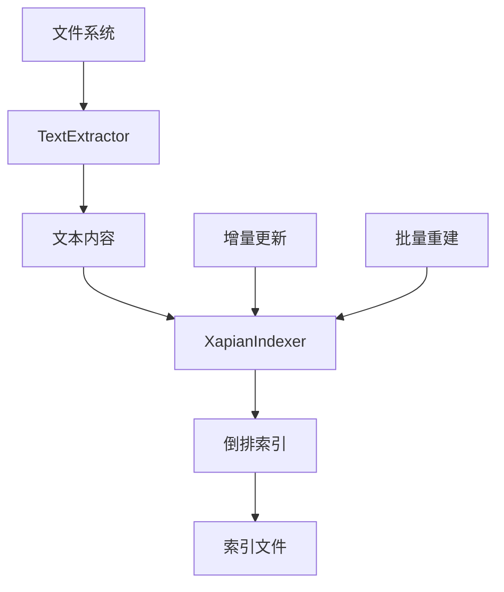
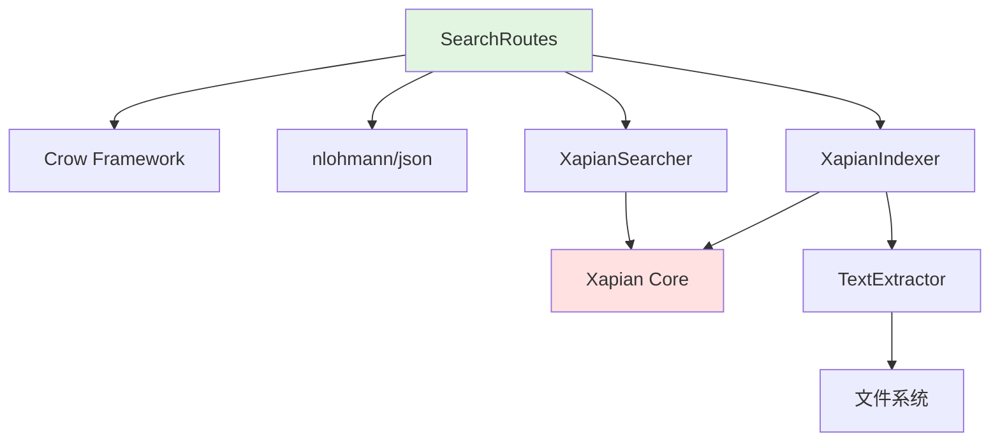
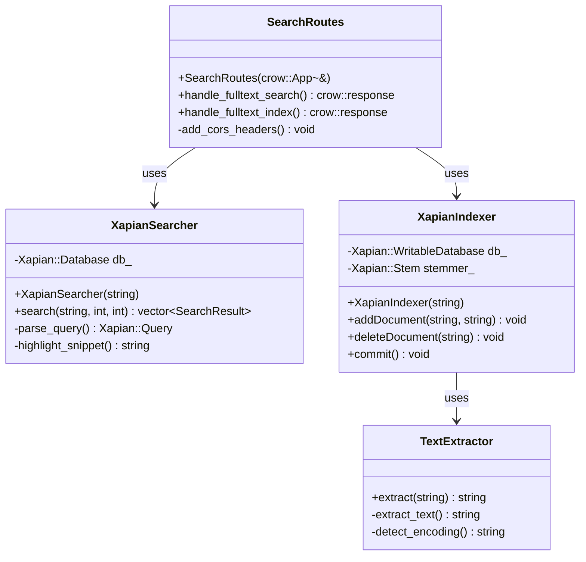
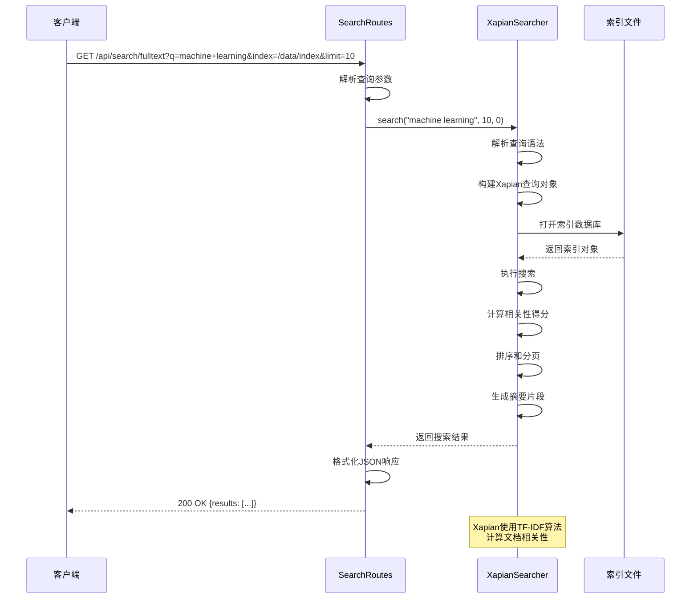
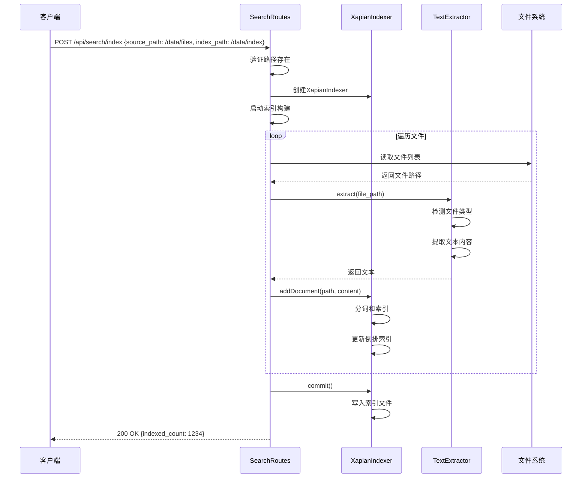

# SearchRoutes 模块文档（C++）

## 1. 模块背景

### 业务背景

在数字取证调查中,从海量文件中快速定位特定内容是关键需求。传统的文件名搜索无法满足内容级检索的要求,而全文搜索技术可以基于文件内容进行快速、精准的定位。SearchRoutes 模块将 Xapian 全文搜索引擎集成到 HTTP API 中,提供基于内容的搜索能力。

**核心需求**：
- **内容搜索**：搜索文件内部文本内容,而非仅文件名
- **快速检索**：在百万级文件中毫秒级返回结果
- **模糊匹配**：支持词干提取、通配符、布尔查询
- **结果高亮**：显示匹配关键词的上下文片段
- **索引管理**：创建、更新和删除搜索索引

**解决挑战**：
- **索引构建**：高效地为大量文件建立倒排索引
- **语言支持**：处理中文、英文等多种语言的分词
- **实时更新**：文件变化时保持索引同步
- **相关性排序**：根据匹配程度和重要性排序结果
- **内存优化**：控制索引和查询的内存占用

### 技术背景

**为什么需要专门的搜索路由？**

| 功能需求 | 技术挑战 | 解决方案 |
|---------|---------|----------|
| **全文搜索** | 文件内容解析 | TextExtractor多格式支持 |
| **中文分词** | 中文字符无空格分隔 | Xapian ICU分词器 |
| **性能优化** | 大数据集搜索 | Xapian倒排索引 |
| **相关性排序** | 结果质量保证 | TF-IDF权重算法 |
| **索引维护** | 增量更新 | 批量索引+差量更新 |

**技术栈选型**：

1. **Xapian 搜索引擎**：
   - 高性能开源全文搜索库
   - 支持布尔查询、短语搜索、通配符
   - 词干提取和多语言支持
   - 内存映射文件访问

2. **TextExtractor 集成**：
   - 支持90+种文件格式
   - 文本内容提取和清理
   - 编码自动检测

3. **异步索引构建**：
   - 后台线程执行索引
   - 进度跟踪和错误处理
   - 增量索引支持

## 2. 模块功能

### 核心功能

#### 1. 全文搜索


**搜索功能特性**：
- **布尔查询**：`AND`, `OR`, `NOT` 操作符
- **短语搜索**：双引号包围的精确短语
- **通配符**：`*` 匹配任意字符
- **字段搜索**：限定特定字段范围
- **相关性排序**：TF-IDF算法计算权重

**查询语法示例**：
```
# 简单搜索
malware

# 布尔查询
malware AND trojan
malware OR virus
malware NOT "safe mode"

# 短语搜索
"advanced persistent threat"

# 通配符
malware*.exe
passw?rd

# 复杂查询
(malware OR trojan) AND NOT "false positive"
```

#### 2. 索引管理



**索引操作**：
- **创建索引**：为目录或文件集合建立新索引
- **增量索引**：添加新文档到现有索引
- **更新索引**：修改已索引文档的内容
- **删除索引**：从索引中移除文档
- **优化索引**：压缩和优化索引文件

**支持的文件类型**（90+）：
- **文档类**：PDF、DOC、DOCX、PPT、PPTX、XLS、XLSX
- **代码类**：C/C++、Python、Java、JavaScript、HTML、CSS
- **配置类**：XML、JSON、YAML、INI、CONF
- **文本类**：TXT、LOG、MD、CSV
- **其他**：Email、压缩包内容等

### 边界与限制

**功能边界**：
- ❌ 不支持图像OCR（需要VisionAnalysis模块）
- ❌ 不支持音频/视频转录
- ❌ 不支持加密文件内容搜索
- ❌ 不支持实时索引更新（需手动触发）

**已知限制**：
| 限制 | 影响 | 缓解方法 |
|------|------|----------|
| 索引大小 | 大型索引占用磁盘空间 | 定期压缩索引 |
| 二进制文件 | 无法索引二进制内容 | 使用文件元数据索引 |
| 中文分词 | 需要ICU支持 | 编译时启用Xapian ICU |
| 并发索引 | 同时索引可能冲突 | 使用索引锁机制 |

**性能指标**（参考配置：100万文件，索引5GB）：
- 索引构建速度：~1000文件/秒
- 搜索响应时间：<100ms（简单查询），<500ms（复杂查询）
- 索引更新：实时增量更新
- 内存占用：~100MB（搜索时），~500MB（索引时）

## 3. 模块使用的库

### 依赖库清单

| 库名称 | 版本 | 用途 | 许可证 |
|--------|------|------|--------|
| **Xapian** | 1.4+ | 全文搜索引擎 | GPL v2 |
| **TextExtractor** | 本地 | 文本内容提取 | 自研 |
| **Crow** | 1.0+ | HTTP 服务器框架 | BSD-2-Clause |
| **nlohmann/json** | 3.11.2+ | JSON 处理 | MIT |

### 依赖关系图



## 4. 模块实现方式

### 架构设计



### 核心类说明

#### SearchRoutes（搜索路由类）

**职责**：
- 注册搜索相关的HTTP路由
- 处理搜索请求和索引管理请求
- 参数验证和错误处理
- CORS支持

**关键方法**：
```cpp
class SearchRoutes {
public:
    explicit SearchRoutes(crow::App<>& app);

    // 全文搜索
    crow::response handle_fulltext_search(const crow::request& req);

    // 索引管理
    crow::response handle_fulltext_index(const crow::request& req);

private:
    void add_cors_headers(crow::response& res);
};
```

#### XapianSearcher（搜索器）

**职责**：
- 执行全文搜索查询
- 解析查询语法
- 高亮匹配片段
- 相关性排序

**关键代码**：
```cpp
class XapianSearcher {
public:
    explicit XapianSearcher(const std::string& index_path)
        : db_(index_path) {}

    struct SearchResult {
        std::string path;      // 文件路径
        double score;          // 相关性得分
        std::string snippet;   // 匹配片段
    };

    std::vector<SearchResult> search(const std::string& query_string,
                                     int limit = 50,
                                     int offset = 0) {
        std::vector<SearchResult> results;

        // 解析查询
        Xapian::QueryParser query_parser;
        query_parser.set_stemmer(Xapian::Stem("english"));
        query_parser.set_stemming_strategy(Xapian::QueryParser::STEM_SOME);
        Xapian::Query query = query_parser.parse_query(query_string);

        // 执行搜索
        Xapian::Enquire enquire(db_);
        enquire.set_query(query);

        // 获取结果
        Xapian::MSet matches = enquire.get_mset(offset, limit);

        // 处理结果
        for (Xapian::MSetIterator it = matches.begin(); it != matches.end(); ++it) {
            Xapian::Document doc = it.get_document();

            SearchResult result;
            result.path = doc.get_data();
            result.score = it.get_percent();

            // 生成摘要片段
            result.snippet = generate_snippet(doc, query_string);

            results.push_back(result);
        }

        return results;
    }

private:
    Xapian::Database db_;

    std::string generate_snippet(const Xapian::Document& doc,
                                  const std::string& query) {
        std::string content = doc.get_data();
        // 实现关键词高亮和上下文提取
        // ...
        return "highlighted snippet...";
    }
};
```

#### XapianIndexer（索引器）

**职责**：
- 创建和更新搜索索引
- 文档添加和删除
- 索引提交和优化

**关键代码**：
```cpp
class XapianIndexer {
public:
    explicit XapianIndexer(const std::string& index_path)
        : db_(index_path, Xapian::DB_CREATE_OR_OPEN),
          stemmer_(Xapian::Stem("english")) {}

    void addDocument(const std::string& path, const std::string& content) {
        // 创建文档
        Xapian::Document doc;
        doc.set_data(path);

        // 分词和索引
        Xapian::TermGenerator term_generator;
        term_generator.set_stemmer(stemmer_);

        // 索引文件名
        term_generator.index_text(path, 1, "F");

        // 索引内容
        term_generator.index_text(content, 1, "C");

        // 添加到数据库
        db_.add_document(doc);
    }

    void commit() {
        db_.commit();
    }

private:
    Xapian::WritableDatabase db_;
    Xapian::Stem stemmer_;
};
```

#### TextExtractor（文本提取器）

**职责**：
- 从各种文件格式中提取文本
- 编码检测和转换
- 文本清理和规范化

**关键代码**：
```cpp
class TextExtractor {
public:
    std::string extract(const std::string& file_path) {
        std::string extension = get_extension(file_path);

        if (extension == ".pdf") {
            return extract_pdf_text(file_path);
        } else if (extension == ".docx") {
            return extract_docx_text(file_path);
        } else if (extension == ".txt") {
            return extract_plain_text(file_path);
        }

        // 其他格式...
        return "";
    }

private:
    std::string extract_pdf_text(const std::string& path) {
        // 使用Poppler提取PDF文本
        // ...
    }

    std::string extract_docx_text(const std::string& path) {
        // 解压DOCX并提取document.xml
        // ...
    }

    std::string extract_plain_text(const std::string& path) {
        // 读取文本文件并检测编码
        std::ifstream file(path, std::ios::binary);
        std::string content((std::istreambuf_iterator<char>(file)),
                           std::istreambuf_iterator<char>());

        // 编码检测和转换
        return convert_to_utf8(content);
    }
};
```

### 关键流程

#### 全文搜索流程



#### 索引构建流程



### 数据结构

#### 搜索请求参数

```json
{
  "q": "machine learning AND deep learning",
  "index": "/data/search_index",
  "limit": 20,
  "offset": 0
}
```

#### 搜索结果

```json
{
  "query": "machine learning",
  "results": [
    {
      "path": "/research/papers/ml_intro.pdf",
      "score": 95,
      "snippet": "This paper provides an introduction to <b>machine learning</b> algorithms and their applications in pattern recognition and artificial intelligence."
    },
    {
      "path": "/code/ml_examples.py",
      "score": 87,
      "snippet": "import <b>machine</b> <b>learning</b> as ml\n\n# Train a classifier\nclassifier = ml.train(data)"
    }
  ],
  "count": 2,
  "limit": 20,
  "offset": 0
}
```

#### 索引请求参数

```json
{
  "source_path": "/extracted/files",
  "index_path": "/data/search_index",
  "recursive": true
}
```

#### 索引响应

```json
{
  "success": true,
  "source_path": "/extracted/files",
  "index_path": "/data/search_index",
  "indexed_count": 1234,
  "failed_count": 5,
  "duration_ms": 2345
}
```

## 5. API 调用

### REST API 端点

#### 全文搜索

**1. 执行全文搜索**

```bash
curl "http://localhost:8080/api/search/fulltext?q=malware&index=/data/index&limit=10&offset=0"
```

**查询示例**：

**简单搜索**：
```bash
curl "http://localhost:8080/api/search/fulltext?q=password"
```

**布尔查询**：
```bash
curl "http://localhost:8080/api/search/fulltext?q=password%20AND%20hack"
curl "http://localhost:8080/api/search/fulltext?q=trojan%20OR%20virus"
curl "http://localhost:8080/api/search/fulltext?q=machine%20NOT%20learning"
```

**短语搜索**：
```bash
curl "http://localhost:8080/api/search/fulltext?q=%22credit%20card%22"
```

**通配符搜索**：
```bash
curl "http://localhost:8080/api/search/fulltext?q=passw%3F"  # ?匹配单个字符
curl "http://localhost:8080/api/search/fulltext?q=machine*"  # *匹配任意字符
```

**响应**：
```json
{
  "query": "password",
  "results": [
    {
      "path": "/Users/John/Documents/passwords.txt",
      "score": 98,
      "snippet": "admin_password: P@ssw0rd123\nuser_password: "
    },
    {
      "path": "/logs/application.log",
      "score": 75,
      "snippet": "ERROR: Invalid <b>password</b> provided. "
    }
  ],
  "count": 2,
  "limit": 10,
  "offset": 0
}
```

#### 索引管理

**2. 创建搜索索引**

```bash
curl -X POST http://localhost:8080/api/search/index \
  -H "Content-Type: application/json" \
  -d '{
    "source_path": "/extracted/files",
    "index_path": "/data/search_index",
    "recursive": true
  }'
```

**索引单个文件**：
```bash
curl -X POST http://localhost:8080/api/search/index \
  -H "Content-Type: application/json" \
  -d '{
    "source_path": "/extracted/files/report.pdf",
    "index_path": "/data/search_index"
  }'
```

**索引整个目录**：
```bash
curl -X POST http://localhost:8080/api/search/index \
  -H "Content-Type: application/json" \
  -d '{
    "source_path": "/extracted/files",
    "index_path": "/data/search_index",
    "recursive": true
  }'
```

**响应**：
```json
{
  "success": true,
  "source_path": "/extracted/files",
  "index_path": "/data/search_index",
  "indexed_count": 1234,
  "failed_count": 5,
  "duration_ms": 2345
}
```

**3. 索引大型数据集**

对于包含数百万文件的目录，建议分批索引：

```bash
# 第一批：文档文件
curl -X POST http://localhost:8080/api/search/index \
  -H "Content-Type: application/json" \
  -d '{
    "source_path": "/extracted/files/documents",
    "index_path": "/data/search_index"
  }'

# 第二批：代码文件
curl -X POST http://localhost:8080/api/search/index \
  -H "Content-Type: application/json" \
  -d '{
    "source_path": "/extracted/files/code",
    "index_path": "/data/search_index"
  }'
```

### API 参数说明

#### 搜索参数

| 参数名 | 类型 | 必填 | 默认值 | 说明 |
|--------|------|------|--------|------|
| `q` | string | ✅ | - | 搜索查询词 |
| `index` | string | ✅ | - | 索引路径 |
| `limit` | integer | ❌ | 50 | 结果数量限制 |
| `offset` | integer | ❌ | 0 | 分页偏移 |

#### 索引参数

| 参数名 | 类型 | 必填 | 默认值 | 说明 |
|--------|------|------|--------|------|
| `source_path` | string | ✅ | - | 源文件或目录路径 |
| `index_path` | string | ✅ | - | 索引保存路径 |
| `recursive` | boolean | ❌ | true | 是否递归索引子目录 |

### 返回值说明

**搜索成功响应**：
```json
{
  "query": "搜索词",
  "results": [
    {
      "path": "文件路径",
      "score": 相关性得分(0-100),
      "snippet": "匹配片段..."
    }
  ],
  "count": 结果数量,
  "limit": 限制数,
  "offset": 偏移量
}
```

**索引成功响应**：
```json
{
  "success": true,
  "source_path": "源路径",
  "index_path": "索引路径",
  "indexed_count": 索引文件数,
  "failed_count": 失败文件数,
  "duration_ms": 执行时间(毫秒)
}
```

**错误响应**：
```json
{
  "success": false,
  "error": "错误消息",
  "error_code": "ERROR_CODE"
}
```

**HTTP 状态码**：
- `200 OK` - 搜索成功
- `400 Bad Request` - 参数错误
- `500 Internal Server Error` - 服务器错误

## 6. 二次开发

### 扩展点

#### 1. 添加新的查询语法

**位置**：扩展 XapianSearcher

**示例**：添加字段限定搜索

```cpp
// XapianSearcher.cpp
std::vector<SearchResult> search(const std::string& query_string,
                                 int limit = 50,
                                 int offset = 0) {
    Xapian::QueryParser query_parser;
    query_parser.set_stemmer(Xapian::Stem("english"));

    // 添加前缀映射
    query_parser.add_prefix("filename", "F");
    query_parser.add_prefix("content", "C");
    query_parser.add_prefix("extension", "E");

    // 解析查询
    Xapian::Query query = query_parser.parse_query(query_string);

    // 执行搜索...
}
```

**使用示例**：
```
# 搜索文件名
filename:report

# 搜索内容
content:machine learning

# 搜索扩展名
extension:pdf

# 组合查询
filename:report AND extension:pdf
```

#### 2. 自定义结果排序

**位置**：扩展 XapianSearcher

**示例**：按文件大小排序

```cpp
class XapianSearcher {
public:
    enum class SortOrder {
        RELEVANCE,  // 相关性（默认）
        DATE,       // 按日期
        SIZE        // 按大小
    };

    std::vector<SearchResult> search(const std::string& query_string,
                                     SortOrder order = SortOrder::RELEVANCE) {
        Xapian::Enquire enquire(db_);
        enquire.set_query(query);

        if (order == SortOrder::SIZE) {
            // 按文档大小排序
            enquire.set_weighting_scheme(Xapian::BoolWeight());
            // 需要在索引时存储文档大小作为值
            enquire.set_sort_by_value_then_relevance(1, false);
        }

        // 执行搜索...
    }
};
```

#### 3. 添加搜索建议/自动完成

**位置**：添加新的API端点

```cpp
// SearchRoutes.cpp
CROW_ROUTE(app, "/api/search/suggest").methods("GET"_method)(
    [](const crow::request& req) {
        std::string prefix = req.url_params.get("prefix");
        std::string index_path = req.url_params.get("index");

        if (prefix.empty() || index_path.empty()) {
            return crow::response(400, R"({"error": "Missing parameters"})");
        }

        // 查询索引中的术语
        Xapian::Database db(index_path);
        Xapian::TermIterator it = db.allterms_begin(prefix);

        json suggestions = json::array();
        int count = 0;
        for (; it != db.allterms_end() && count < 10; ++it) {
            suggestions.push_back(*it);
            count++;
        }

        crow::response res;
        res.set_header("Content-Type", "application/json");
        res.write(suggestions.dump());
        return res;
    }
);
```

### 添加新功能的步骤

#### 完整示例：添加搜索历史记录

**步骤1：创建搜索历史数据库**

```cpp
// 创建数据库表
const char* create_history_sql = R"(
    CREATE TABLE IF NOT EXISTS search_history (
        id INTEGER PRIMARY KEY AUTOINCREMENT,
        query TEXT NOT NULL,
        result_count INTEGER,
        timestamp DATETIME DEFAULT CURRENT_TIMESTAMP
    );

    CREATE INDEX IF NOT EXISTS idx_history_timestamp ON search_history(timestamp);
    CREATE INDEX IF NOT EXISTS idx_history_query ON search_history(query);
)";
```

**步骤2：记录搜索历史**

```cpp
// SearchRoutes.cpp
void save_search_history(const std::string& index_path,
                        const std::string& query,
                        int result_count) {
    std::string history_db = get_history_db_path(index_path);

    sqlite3* db = nullptr;
    sqlite3_open(history_db.c_str(), &db);

    const char* insert_sql = "INSERT INTO search_history (query, result_count) VALUES (?, ?)";
    sqlite3_stmt* stmt = nullptr;
    sqlite3_prepare_v2(db, insert_sql, -1, &stmt, nullptr);
    sqlite3_bind_text(stmt, 1, query.c_str(), -1, SQLITE_TRANSIENT);
    sqlite3_bind_int(stmt, 2, result_count);
    sqlite3_step(stmt);
    sqlite3_finalize(stmt);

    sqlite3_close(db);
}
```

**步骤3：添加历史查询API**

```cpp
CROW_ROUTE(app, "/api/search/history").methods("GET"_method)(
    [](const crow::request& req) {
        std::string index_path = req.url_params.get("index");
        int limit = 10;

        if (const char* limit_str = req.url_params.get("limit")) {
            limit = std::stoi(limit_str);
        }

        std::string history_db = get_history_db_path(index_path);

        sqlite3* db = nullptr;
        sqlite3_open(history_db.c_str(), &db);

        const char* query = "SELECT query, result_count, timestamp FROM search_history ORDER BY timestamp DESC LIMIT ?";
        sqlite3_stmt* stmt = nullptr;
        sqlite3_prepare_v2(db, query, -1, &stmt, nullptr);
        sqlite3_bind_int(stmt, 1, limit);

        json history = json::array();
        while (sqlite3_step(stmt) == SQLITE_ROW) {
            const char* query_text = reinterpret_cast<const char*>(sqlite3_column_text(stmt, 0));
            int result_count = sqlite3_column_int(stmt, 1);
            const char* timestamp = reinterpret_cast<const char*>(sqlite3_column_text(stmt, 2));

            history.push_back({
                {"query", query_text},
                {"result_count", result_count},
                {"timestamp", timestamp}
            });
        }

        sqlite3_finalize(stmt);
        sqlite3_close(db);

        crow::response res;
        res.set_header("Content-Type", "application/json");
        res.write(history.dump());
        return res;
    }
);
```

### 代码示例

#### 高级搜索功能

**1. 模糊搜索**

```cpp
// 使用Xapian的模糊匹配
Xapian::Query fuzzy_query = Xapian::Query(
    Xapian::Query::OP_WILDCARD,
    "passw*rd"  // 匹配 password, passwd, passsword等
);
```

**2. 相似文档搜索**

```cpp
// 查找与给定文档相似的文档
std::vector<SearchResult> find_similar(const std::string& document_path,
                                       int limit = 10) {
    // 读取参考文档
    std::string content = TextExtractor().extract(document_path);

    // 生成查询词（使用TF-IDF）
    Xapian::QueryParser query_parser;
    Xapian::TermGenerator term_generator;
    Xapian::Document ref_doc;
    term_generator.index_text(content, ref_doc);

    // 使用参考文档的术语构建查询
    Xapian::Query query = ref_doc.termlist();

    // 执行搜索并返回相似文档
    return search(query, limit);
}
```

**3. 聚类搜索结果**

```cpp
// 对搜索结果进行聚类分析
std::map<std::string, std::vector<SearchResult>> cluster_results(
    const std::vector<SearchResult>& results) {

    std::map<std::string, std::vector<SearchResult>> clusters;

    for (const auto& result : results) {
        std::string extension = get_extension(result.path);
        clusters[extension].push_back(result);
    }

    return clusters;
}
```

### 最佳实践

#### 性能优化

**1. 批量索引**：
```cpp
// 批量提交，提高索引性能
void XapianIndexer::addDocuments(const std::vector<Document>& docs) {
    for (const auto& doc : docs) {
        db_.add_document(doc);
    }

    // 批量提交
    db_.commit();
}
```

**2. 索引分片**：
```cpp
// 为大型数据集创建多个索引分片
std::vector<Xapian::Database> shards;
for (int i = 0; i < num_shards; ++i) {
    std::string shard_path = "/data/index_shard_" + std::to_string(i);
    shards.emplace_back(shard_path);
}

// 并行搜索所有分片
std::vector<SearchResult> all_results;
for (auto& shard : shards) {
    XapianSearcher searcher(shard);
    auto results = searcher.search(query);
    all_results.insert(all_results.end(), results.begin(), results.end());
}

// 合并和排序结果
std::sort(all_results.begin(), all_results.end(),
    [](const SearchResult& a, const SearchResult& b) {
        return a.score > b.score;
    });
```

**3. 查询缓存**：
```cpp
// 缓存常见查询的结果
class SearchCache {
public:
    std::optional<std::vector<SearchResult>> get(const std::string& query) {
        std::lock_guard<std::mutex> lock(mutex_);
        auto it = cache_.find(query);
        if (it != cache_.end()) {
            return it->second;
        }
        return std::nullopt;
    }

    void put(const std::string& query, const std::vector<SearchResult>& results) {
        std::lock_guard<std::mutex> lock(mutex_);
        cache_[query] = results;
    }

private:
    std::mutex mutex_;
    std::map<std::string, std::vector<SearchResult>> cache_;
};
```

#### 常见陷阱

**1. 索引未及时更新**：
```cpp
// 错误：索引后忘记commit
XapianIndexer indexer("/data/index");
indexer.addDocument(path, content);
// 忘记调用commit()

// 正确：总是记得commit
XapianIndexer indexer("/data/index");
indexer.addDocument(path, content);
indexer.commit();  // 必须调用
```

**2. 内存泄漏**：
```cpp
// 错误：忘记关闭数据库
Xapian::Database* db = new Xapian::Database("/data/index");
// 忘记delete db

// 正确：使用RAII
class DatabaseGuard {
    Xapian::Database* db_;
public:
    explicit DatabaseGuard(const std::string& path) : db_(new Xapian::Database(path)) {}
    ~DatabaseGuard() { delete db_; }
    Xapian::Database* operator->() { return db_; }
};
```

**3. 编码问题**：
```cpp
// 错误：直接处理二进制文件
std::string content = read_file("/path/to/binary");
indexer.addDocument(path, content);  // 可能包含乱码

// 正确：检测编码并转换
std::string content = read_file("/path/to/text");
std::string utf8_content = convert_to_utf8(content);
indexer.addDocument(path, utf8_content);
```

## 7. 其他

### 测试

**单元测试位置**：
```
tests/UnitTest/test_search_routes_gtest.cpp
tests/UnitTest/test_xapian_searcher_gtest.cpp
tests/UnitTest/test_text_extractor_gtest.cpp
```

### 配置

**环境变量**：
```env
# Xapian配置
XAPIAN_INDEX_PATH=/data/search_index
XAPIAN_STEMMER=en
XAPIAN_MAX_RESULTS=1000

# 文本提取配置
TEXT_EXTRACTION_TIMEOUT=30000
TEXT_MAX_SIZE=10485760
```

### 故障排查

| 问题 | 可能原因 | 解决方法 |
|------|----------|----------|
| **搜索无结果** | 索引未建立或损坏 | 重新构建索引 |
| **索引失败** | 文件格式不支持 | 检查TextExtractor支持列表 |
| **内存不足** | 索引过大 | 使用索引分片 |
| **中文分词错误** | 未启用ICU | 重新编译Xapian启用ICU |

### 相关模块

- **[HTTPServer](../HTTPServer.md)** - HTTP服务器核心
- **[TaskRoutes](./TaskRoutes.md)** - 任务管理路由
- **[ForensicsRoutes](./ForensicsRoutes.md)** - 取证分析路由
- **[FullTextSearch](../../core/FullTextSearch/FullTextSearch.md)** - 全文搜索核心
- **[TextExtractor](../../core/FullTextSearch/TextExtractor.md)** - 文本提取器

### 参考资源

- [Xapian 官方文档](https://xapian.org/docs/)
- [全文搜索原理](https://en.wikipedia.org/wiki/Full-text_search)
- [倒排索引](https://en.wikipedia.org/wiki/Inverted_index)

### 变更历史

| 版本 | 日期 | 变更内容 | 作者 |
|------|------|----------|------|
| 1.0.0 | 2024-02-01 | 初始版本 | Forensics Team |
| 1.1.0 | 2024-05-15 | 添加更多文件格式支持 | Forensics Team |
| 1.2.0 | 2024-08-20 | 性能优化和缓存 | Forensics Team |

---

**最后更新**: 2026-03-16
**维护者**: ymj68520
