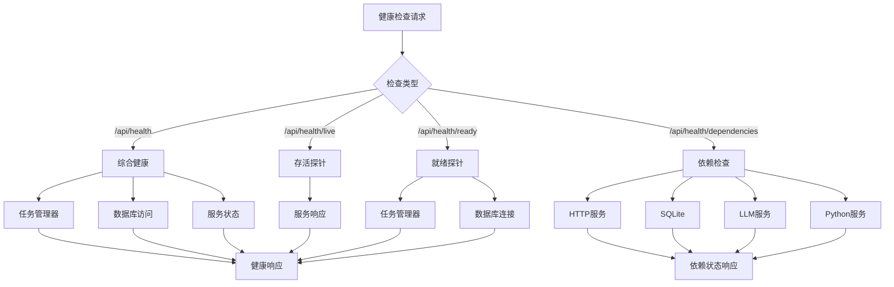
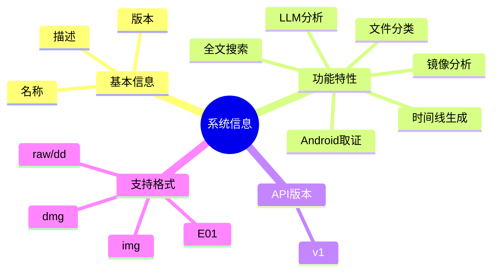
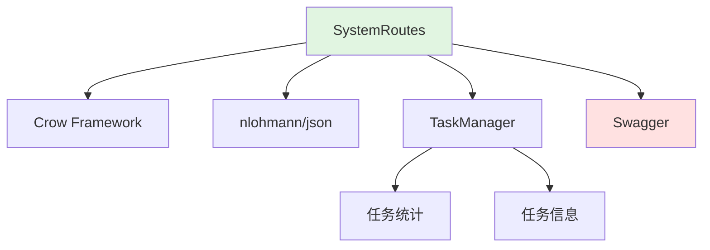
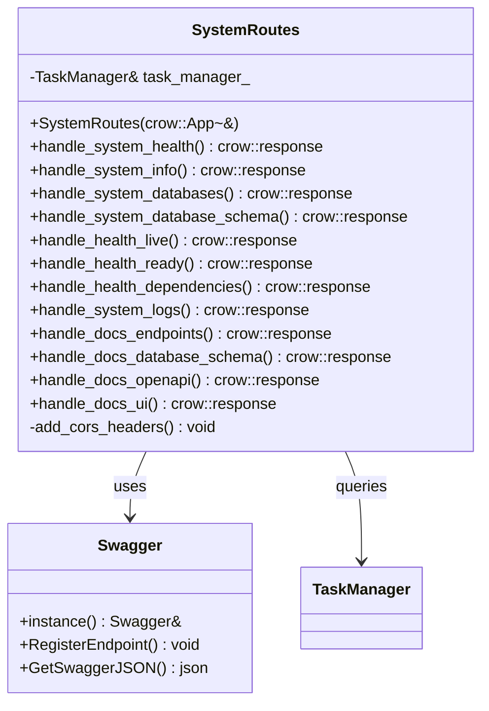
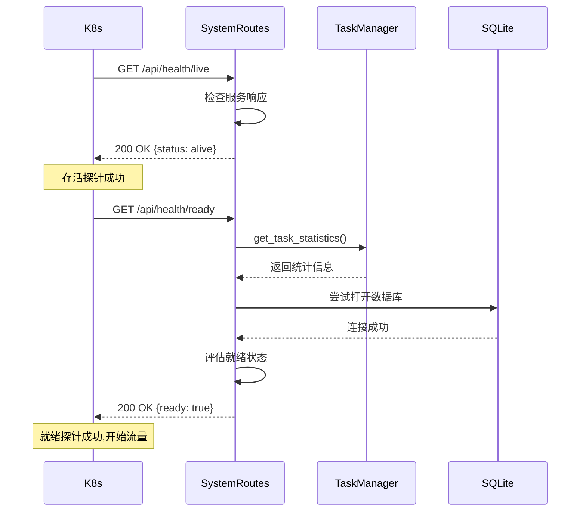
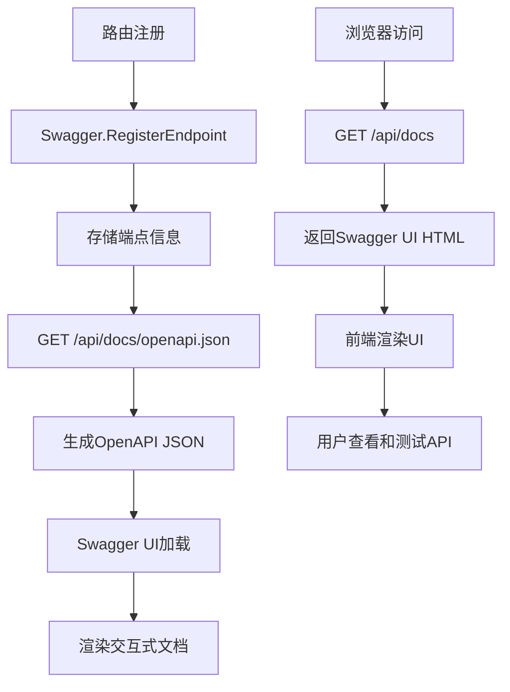

# SystemRoutes 模块文档（C++）

> **注意**: SystemRoutes 已拆分为多个独立的路由文件：
> - `SystemHealthRoutes.cpp` - 健康检查端点
> - `SystemInfoRoutes.cpp` - 系统信息端点
> - `SystemDocsRoutes.cpp` - API 文档端点
> - `SystemEventRoutes.cpp` - 系统事件端点
>
> 完整端点列表请参考 [RouteReference.md](./RouteReference.md)

## 1. 模块背景

### 业务背景

在生产环境中部署的取证分析系统需要完善的监控、健康检查和管理接口。SystemRoutes 模块提供系统级别的 API,用于监控服务状态、查询数据库信息、访问 API 文档等运维管理功能。

**核心需求**：
- **健康检查**：监控服务运行状态,支持 Kubernetes 等容器编排
- **系统信息**：提供版本、功能、配置等基本信息
- **数据库管理**：查询可用数据库、获取数据库Schema
- **文档服务**：自动生成的API文档和OpenAPI规范
- **日志查询**：实时获取服务日志,便于问题诊断

**解决挑战**：
- **容器化部署**：支持 Kubernetes liveness/readiness 探针
- **动态发现**：自动发现任务相关的数据库
- **文档同步**：API文档与代码自动同步
- **跨域支持**：CORS配置支持浏览器访问
- **安全性**：保护系统接口不被滥用

### 技术背景

**为什么需要系统管理路由？**

| 功能需求 | 技术挑战 | 解决方案 |
|---------|---------|----------|
| **健康监控** | 服务状态检测 | 多层次健康检查 |
| **容器编排** | K8s集成 | liveness/readiness端点 |
| **API文档** | 自动生成 | Swagger/OpenAPI集成 |
| **数据库发现** | 动态路径解析 | TaskManager集成 |
| **日志查询** | 实时日志流 | 文件读取和解析 |

**技术栈选型**：

1. **Kubernetes-style Health Checks**：
   - `/api/health/live` - 存活探针
   - `/api/health/ready` - 就绪探针
   - `/api/health/dependencies` - 依赖检查

2. **Swagger/OpenAPI**：
   - 自动生成API文档
   - 交互式文档UI
   - 客户端SDK生成支持

3. **动态路由管理**：
   - 端点自动注册
   - 文档自动更新
   - 版本信息管理

## 2. 模块功能

### 核心功能

#### 1. 健康检查（Health Checks）



**健康检查层次**：

**1. 基础健康检查**（`/api/health`）：
```json
{
  "status": "healthy",
  "timestamp": 1704067200000,
  "version": "1.0.0",
  "task_management": {
    "total_tasks": 156,
    "running_tasks": 4,
    "failed_tasks": 8,
    "system_load": "low"
  },
  "services": {
    "http_server": "running",
    "task_manager": "running",
    "database_access": "available"
  }
}
```

**2. 存活探针**（`/api/health/live`）：
```json
{
  "status": "alive",
  "timestamp": 1704067200000
}
```
- **用途**：Kubernetes liveness probe
- **检查内容**：服务是否响应
- **失败处理**：重启容器

**3. 就绪探针**（`/api/health/ready`）：
```json
{
  "ready": true,
  "checks": {
    "task_manager": {
      "status": "ready",
      "total_tasks": 156
    },
    "database": {
      "status": "ready"
    }
  },
  "timestamp": 1704067200000
}
```
- **用途**：Kubernetes readiness probe
- **检查内容**：服务是否可接受流量
- **失败处理**：从Service中移除

**4. 依赖检查**（`/api/health/dependencies`）：
```json
{
  "dependencies": {
    "http_server": {
      "status": "running",
      "port": 8080
    },
    "task_manager": {
      "status": "running"
    },
    "sqlite": {
      "status": "available"
    },
    "llm_service": {
      "status": "configured",
      "base_url": "http://localhost:1234"
    },
    "python_service": {
      "status": "optional",
      "port": 8090
    }
  },
  "overall_status": "healthy",
  "timestamp": 1704067200000
}
```

#### 2. 系统信息（System Information）



**系统信息端点**（`/api/system/info`）：
```json
{
  "name": "Forensics Analyzer",
  "version": "1.0.0",
  "description": "Digital forensics analysis platform",
  "features": [
    "Image analysis (E01, raw, dd)",
    "Timeline generation",
    "File classification",
    "Android forensics",
    "Full-text search",
    "LLM-powered file descriptions"
  ],
  "api_version": "v1",
  "supported_formats": [
    "E01",
    "raw",
    "dd",
    "img",
    "dmg"
  ]
}
```

#### 3. 数据库管理（Database Management）

**数据库查询功能**：

**1. 可用数据库列表**（`/api/system/databases`）：
```bash
curl "http://localhost:8080/api/system/databases?task_id=task_abc123"
```

**响应**：
```json
{
  "task_id": "task_abc123",
  "databases": [
    {
      "type": "raw",
      "path": "/data/task_abc123_raw.db",
      "size": 536870912
    },
    {
      "type": "events",
      "path": "/data/task_abc123_events.db",
      "size": 234567890
    },
    {
      "type": "files",
      "path": "/data/task_abc123_files.db",
      "size": 123456789
    }
  ]
}
```

**2. 数据库Schema**（`/api/system/database-schema/<type>`）：
```bash
curl "http://localhost:8080/api/system/database-schema/raw"
```

**响应**：
```json
{
  "type": "raw",
  "tables": [
    {
      "name": "files",
      "columns": [
        {"name": "id", "type": "INTEGER"},
        {"name": "path", "type": "TEXT"},
        {"name": "name", "type": "TEXT"},
        {"name": "size", "type": "INTEGER"},
        {"name": "mtime", "type": "INTEGER"},
        {"name": "atime", "type": "INTEGER"},
        {"name": "ctime", "type": "INTEGER"},
        {"name": "inode", "type": "INTEGER"},
        {"name": "deleted", "type": "INTEGER"},
        {"name": "content_hash", "type": "TEXT"}
      ]
    },
    {
      "name": "partitions",
      "columns": [
        {"name": "id", "type": "INTEGER"},
        {"name": "number", "type": "INTEGER"},
        {"name": "start", "type": "INTEGER"},
        {"name": "length", "type": "INTEGER"},
        {"name": "description", "type": "TEXT"},
        {"name": "fs_type", "type": "TEXT"}
      ]
    }
  ]
}
```

#### 4. API文档服务（Documentation）

**Swagger UI集成**：

**1. 文档首页**（`/api/docs`）：
- 渲染 Swagger UI 界面
- 提供交互式API测试
- 自动加载OpenAPI规范

**2. OpenAPI规范**（`/api/docs/openapi.json`）：
```json
{
  "openapi": "3.0.0",
  "info": {
    "title": "Forensics Analyzer API",
    "version": "1.0.0",
    "description": "Digital forensics analysis platform API"
  },
  "paths": {
    "/tasks": {
      "post": {
        "summary": "Create task",
        "requestBody": {
          "content": {
            "application/json": {
              "schema": {
                "$ref": "#/components/schemas/TaskRequest"
              }
            }
          }
        }
      }
    }
  },
  "components": {
    "schemas": { ... }
  }
}
```

**3. 端点列表**（`/api/docs/endpoints`）：
```json
{
  "task_management": {
    "POST /tasks": "Create a new analysis task",
    "GET /tasks/<id>": "Get task status",
    "DELETE /api/tasks/<id>": "Cancel a task"
  },
  "forensics": {
    "GET /api/forensics/timeline/comprehensive": "Get comprehensive timeline",
    "GET /api/forensics/files/largest": "Get largest files"
  },
  "search": {
    "GET /api/search/fulltext": "Full-text search",
    "POST /api/search/index": "Build search index"
  },
  "system": {
    "GET /api/system/health": "System health check",
    "GET /api/system/info": "System information"
  }
}
```

**4. 数据库Schema文档**（`/api/docs/database-schema`）：
```json
{
  "raw_database": {
    "description": "Contains raw extracted data from disk image",
    "tables": ["files", "partitions"]
  },
  "files_database": {
    "description": "Contains classified files with categories",
    "tables": ["classified_files", "file_descriptions"]
  },
  "events_database": {
    "description": "Contains timeline events",
    "tables": ["timeline_events"]
  },
  "android_database": {
    "description": "Contains Android-specific data",
    "tables": ["contacts", "messages", "call_logs", "apps"]
  }
}
```

#### 5. 系统日志（System Logs）

**日志查询功能**（`/api/system/logs`）：

**查询参数**：
- `lines`: 返回行数（默认100，最大1000）

**响应**：
```json
{
  "service": "cpp-backend",
  "logs": [
    {
      "timestamp": "2026-03-16 14:30:25",
      "level": "INFO",
      "message": "Task task_abc123 started"
    },
    {
      "timestamp": "2026-03-16 14:30:26",
      "level": "INFO",
      "message": "Analyzing file system..."
    },
    {
      "timestamp": "2026-03-16 14:30:27",
      "level": "WARNING",
      "message": "Failed to extract file: /path/to/file"
    }
  ],
  "total_count": 3
}
```

### 边界与限制

**功能边界**：
- ❌ 不支持日志流式传输（仅返回快照）
- ❌ 不支持日志级别过滤（需前端处理）
- ❌ 不支持跨服务日志聚合（仅C++后端日志）
- ❌ 不支持日志下载（仅在线查看）

**已知限制**：
| 限制 | 影响 | 缓解方法 |
|------|------|----------|
| 日志文件路径 | 需要预配置 | 支持多个常见路径 |
| 日志行数限制 | 最大1000行 | 分段查询或增加限制 |
| 日志格式 | 假设标准格式 | 自适应解析多种格式 |

## 3. 模块使用的库

### 依赖库清单

| 库名称 | 版本 | 用途 | 许可证 |
|--------|------|------|--------|
| **Crow** | 1.0+ | HTTP 服务器框架 | BSD-2-Clause |
| **nlohmann/json** | 3.11.2+ | JSON 处理 | MIT |
| **Swagger** | 本地 | API文档生成 | 自研 |

### 依赖关系图



## 4. 模块实现方式

### 架构设计



### 核心类说明

#### SystemRoutes（系统路由类）

**职责**：
- 系统监控和健康检查
- API文档生成和服务
- 数据库信息查询
- 系统日志访问

**关键方法**：
```cpp
class SystemRoutes {
public:
    explicit SystemRoutes(crow::App<>& app);

    // 系统信息
    crow::response handle_system_health(const crow::request& req);
    crow::response handle_system_info(const crow::request& req);
    crow::response handle_system_databases(const crow::request& req);
    crow::response handle_system_database_schema(const crow::request& req,
                                                   const std::string& db_type);

    // 健康检查
    crow::response handle_health_live(const crow::request& req);
    crow::response handle_health_ready(const crow::request& req);
    crow::response handle_health_dependencies(const crow::request& req);

    // 日志
    crow::response handle_system_logs(const crow::request& req);

    // 文档
    crow::response handle_docs_endpoints(const crow::request& req);
    crow::response handle_docs_database_schema(const crow::request& req);
    crow::response handle_docs_openapi(const crow::request& req);
    crow::response handle_docs_ui(const crow::request& req);

private:
    TaskManager& task_manager_;

    void add_cors_headers(crow::response& res);
    nlohmann::json generate_openapi_spec();
};
```

### 关键流程

#### 健康检查流程



#### OpenAPI文档生成流程



**Swagger端点注册示例**：
```cpp
// 在各路由模块中注册端点
Swagger::instance().RegisterEndpoint(
    "/tasks", "POST",
    "Create task",
    "Create a new forensic analysis task.",
    {"Tasks"},
    {},
    {{201, "Task created"}, {400, "Invalid request"}}
);
```

### 数据结构

#### 综合健康检查响应

```json
{
  "status": "healthy",
  "timestamp": 1704067200000,
  "version": "1.0.0",
  "task_management": {
    "total_tasks": 156,
    "running_tasks": 4,
    "failed_tasks": 8,
    "system_load": "low"
  },
  "services": {
    "http_server": "running",
    "task_manager": "running",
    "database_access": "available"
  }
}
```

#### 存活探针响应

```json
{
  "status": "alive",
  "timestamp": 1704067200000
}
```

#### 就绪探针响应

```json
{
  "ready": true,
  "checks": {
    "task_manager": {
      "status": "ready",
      "total_tasks": 156
    },
    "database": {
      "status": "ready"
    }
  },
  "timestamp": 1704067200000
}
```

#### 依赖检查响应

```json
{
  "dependencies": {
    "http_server": {
      "status": "running",
      "port": 8080
    },
    "task_manager": {
      "status": "running"
    },
    "sqlite": {
      "status": "available"
    },
    "llm_service": {
      "status": "configured",
      "base_url": "http://localhost:1234"
    },
    "python_service": {
      "status": "optional",
      "port": 8090
    }
  },
  "overall_status": "healthy",
  "timestamp": 1704067200000
}
```

## 5. API 调用

### REST API 端点

#### 健康检查端点

**1. 综合健康检查**

```bash
curl http://localhost:8080/api/system/health
```

**响应**：
```json
{
  "status": "healthy",
  "timestamp": 1704067200000,
  "version": "1.0.0",
  "task_management": {
    "total_tasks": 156,
    "running_tasks": 4,
    "failed_tasks": 8,
    "system_load": "low"
  },
  "services": {
    "http_server": "running",
    "task_manager": "running",
    "database_access": "available"
  }
}
```

**2. 存活探针**

```bash
curl http://localhost:8080/api/health/live
```

**响应**：
```json
{
  "status": "alive",
  "timestamp": 1704067200000
}
```

**Kubernetes配置示例**：
```yaml
livenessProbe:
  httpGet:
    path: /api/health/live
    port: 8080
  initialDelaySeconds: 30
  periodSeconds: 10
  timeoutSeconds: 5
  failureThreshold: 3
```

**3. 就绪探针**

```bash
curl http://localhost:8080/api/health/ready
```

**响应**：
```json
{
  "ready": true,
  "checks": {
    "task_manager": {
      "status": "ready",
      "total_tasks": 156
    },
    "database": {
      "status": "ready"
    }
  },
  "timestamp": 1704067200000
}
```

**Kubernetes配置示例**：
```yaml
readinessProbe:
  httpGet:
    path: /api/health/ready
    port: 8080
  initialDelaySeconds: 10
  periodSeconds: 5
  timeoutSeconds: 3
  failureThreshold: 2
```

**4. 依赖检查**

```bash
curl http://localhost:8080/api/health/dependencies
```

**响应**：
```json
{
  "dependencies": {
    "http_server": {
      "status": "running",
      "port": 8080
    },
    "task_manager": {
      "status": "running"
    },
    "sqlite": {
      "status": "available"
    },
    "llm_service": {
      "status": "configured",
      "base_url": "http://localhost:1234"
    },
    "python_service": {
      "status": "optional",
      "port": 8090,
      "note": "Not required for core functionality"
    }
  },
  "overall_status": "healthy",
  "timestamp": 1704067200000
}
```

#### 系统信息端点

**5. 获取系统信息**

```bash
curl http://localhost:8080/api/system/info
```

**响应**：
```json
{
  "name": "Forensics Analyzer",
  "version": "1.0.0",
  "description": "Digital forensics analysis platform",
  "features": [
    "Image analysis (E01, raw, dd)",
    "Timeline generation",
    "File classification",
    "Android forensics",
    "Full-text search",
    "LLM-powered file descriptions"
  ],
  "api_version": "v1",
  "supported_formats": [
    "E01",
    "raw",
    "dd",
    "img",
    "dmg"
  ]
}
```

#### 数据库管理端点

**6. 查询可用数据库**

```bash
curl "http://localhost:8080/api/system/databases?task_id=task_abc123"
```

**响应**：
```json
{
  "task_id": "task_abc123",
  "databases": [
    {
      "type": "raw",
      "path": "/data/tasks/task_abc123_raw.db",
      "size": 536870912
    },
    {
      "type": "events",
      "path": "/data/tasks/task_abc123_events.db",
      "size": 234567890
    },
    {
      "type": "files",
      "path": "/data/tasks/task_abc123_files.db",
      "size": 123456789
    },
    {
      "type": "android",
      "path": "/data/tasks/task_abc123_android.db",
      "size": 12345678
    }
  ]
}
```

**7. 查询数据库Schema**

```bash
curl http://localhost:8080/api/system/database-schema/raw
curl http://localhost:8080/api/system/database-schema/files
curl http://localhost:8080/api/system/database-schema/events
curl http://localhost:8080/api/system/database-schema/android
```

**响应（raw数据库）**：
```json
{
  "type": "raw",
  "tables": [
    {
      "name": "files",
      "columns": [
        {"name": "id", "type": "INTEGER", "description": "Primary key"},
        {"name": "path", "type": "TEXT", "description": "Full file path"},
        {"name": "name", "type": "TEXT", "description": "File name"},
        {"name": "size", "type": "INTEGER", "description": "File size in bytes"},
        {"name": "mtime", "type": "INTEGER", "description": "Modified time (Unix timestamp)"},
        {"name": "atime", "type": "INTEGER", "description": "Access time (Unix timestamp)"},
        {"name": "ctime", "type": "INTEGER", "description": "Change time (Unix timestamp)"},
        {"name": "inode", "type": "INTEGER", "description": "Inode number"},
        {"name": "deleted", "type": "INTEGER", "description": "Deletion flag"},
        {"name": "content_hash", "type": "TEXT", "description": "MD5 hash"}
      ]
    },
    {
      "name": "partitions",
      "columns": [
        {"name": "id", "type": "INTEGER"},
        {"name": "number", "type": "INTEGER"},
        {"name": "start", "type": "INTEGER"},
        {"name": "length", "type": "INTEGER"},
        {"name": "description", "type": "TEXT"},
        {"name": "fs_type", "type": "TEXT"}
      ]
    }
  ]
}
```

#### 文档端点

**8. 访问Swagger UI**

```bash
# 浏览器访问
open http://localhost:8080/api/docs

# 或使用curl
curl http://localhost:8080/api/docs
```

**返回HTML**：
```html
<!DOCTYPE html>
<html lang="en">
<head>
    <title>Forensics API Documentation</title>
    <link rel="stylesheet" href="https://unpkg.com/swagger-ui-dist@5.11.0/swagger-ui.css" />
</head>
<body>
<div id="swagger-ui"></div>
<script src="https://unpkg.com/swagger-ui-dist@5.11.0/swagger-ui-bundle.js"></script>
<script>
    window.onload = () => {
        window.ui = SwaggerUIBundle({
            url: '/api/docs/openapi.json',
            dom_id: '#swagger-ui',
            presets: [
                SwaggerUIBundle.presets.apis,
                SwaggerUIBundle.SwaggerUIStandalonePreset
            ]
        });
    };
</script>
</body>
</html>
```

**9. 获取OpenAPI规范**

```bash
curl http://localhost:8080/api/docs/openapi.json
```

**响应**：
```json
{
  "openapi": "3.0.0",
  "info": {
    "title": "Forensics Analyzer API",
    "version": "1.0.0",
    "description": "Digital forensics analysis platform REST API"
  },
  "servers": [
    {
      "url": "http://localhost:8080",
      "description": "Development server"
    }
  ],
  "paths": {
    "/tasks": {
      "post": {
        "summary": "Create task",
        "description": "Create a new forensic analysis task",
        "operationId": "createTask",
        "tags": ["Tasks"],
        "requestBody": {
          "required": true,
          "content": {
            "application/json": {
              "schema": {
                "type": "object",
                "required": ["image_path"],
                "properties": {
                  "image_path": {
                    "type": "string",
                    "description": "Path to disk image"
                  },
                  "priority": {
                    "type": "string",
                    "enum": ["low", "normal", "high", "critical"],
                    "default": "normal"
                  }
                }
              }
            }
          }
        },
        "responses": {
          "201": {
            "description": "Task created",
            "content": {
              "application/json": {
                "schema": {
                  "$ref": "#/components/schemas/Task"
                }
              }
            }
          }
        }
      }
    }
  },
  "components": {
    "schemas": { }
  }
}
```

**10. 获取端点列表**

```bash
curl http://localhost:8080/api/docs/endpoints
```

**响应**：
```json
{
  "task_management": {
    "POST /tasks": "Create a new analysis task",
    "GET /tasks/<id>": "Get task status",
    "GET /tasks/<id>/results": "Get task results",
    "GET /api/tasks/list": "List all tasks",
    "DELETE /api/tasks/<id>": "Cancel a task"
  },
  "forensics": {
    "GET /api/forensics/timeline/comprehensive": "Get comprehensive timeline",
    "GET /api/forensics/files/largest": "Get largest files",
    "GET /api/forensics/android/*": "Android forensics endpoints"
  },
  "system": {
    "GET /api/system/health": "System health check",
    "GET /api/system/info": "System information"
  }
}
```

#### 日志端点

**11. 获取系统日志**

```bash
curl "http://localhost:8080/api/system/logs?lines=100"
```

**响应**：
```json
{
  "service": "cpp-backend",
  "logs": [
    {
      "timestamp": "2026-03-16 14:30:25",
      "level": "INFO",
      "message": "Task task_abc123 started with priority HIGH"
    },
    {
      "timestamp": "2026-03-16 14:30:26",
      "level": "INFO",
      "message": "Starting image analysis..."
    },
    {
      "timestamp": "2026-03-16 14:30:27",
      "level": "WARNING",
      "message": "Failed to extract file: /path/to/file (File not found)"
    }
  ],
  "total_count": 3
}
```

### API 参数说明

#### 日志查询参数

| 参数名 | 类型 | 必填 | 默认值 | 说明 |
|--------|------|------|--------|------|
| `lines` | integer | ❌ | 100 | 返回的日志行数（最大1000） |

#### 数据库Schema参数

| 参数名 | 类型 | 必填 | 说明 |
|--------|------|------|------|
| `db_type` | string | ✅ | 数据库类型：raw/events/files/android |

#### 任务相关参数

| 参数名 | 类型 | 必填 | 说明 |
|--------|------|------|------|
| `task_id` | string | ✅ | 任务ID |

### 返回值说明

**健康检查响应**：
- `status`: "healthy" | "unhealthy"
- `timestamp`: Unix时间戳（毫秒）
- `version`: 服务版本号

**存活/就绪探针响应**：
- 存活探针：仅检查服务是否响应
- 就绪探针：检查所有依赖是否可用

**HTTP 状态码**：
- `200 OK` - 服务正常
- `503 Service Unavailable` - 服务未就绪

## 6. 二次开发

### 扩展点

#### 1. 添加自定义健康检查

**位置**：扩展健康检查逻辑

**示例**：添加磁盘空间检查

```cpp
// SystemRoutes.cpp
crow::response handle_health_disk(const crow::request& req) {
    crow::response res;
    add_cors_headers(res);

    try {
        // 检查磁盘空间
        struct statvfs stat;
        if (statvfs("/data", &stat) != 0) {
            throw std::runtime_error("Failed to get disk stats");
        }

        unsigned long total = stat.f_blocks * stat.f_frsize;
        unsigned long available = stat.f_bavail * stat.f_frsize;
        unsigned long used = total - available;

        double usage_percent = (double)used / total * 100;

        json disk_info = {
            {"path", "/data"},
            {"total_bytes", total},
            {"used_bytes", used},
            {"available_bytes", available},
            {"usage_percent", usage_percent},
            {"status", usage_percent > 90 ? "warning" : "ok"}
        };

        res.set_header("Content-Type", "application/json");
        res.write(disk_info.dump());
        return res;

    } catch (const std::exception& e) {
        json error = {{"error", e.what()}};
        res.code = 500;
        res.set_header("Content-Type", "application/json");
        res.write(error.dump());
        return res;
    }
}
```

**添加路由**：
```cpp
CROW_ROUTE(app, "/api/health/disk").methods("GET"_method)(
    [this](const crow::request& req) {
        return handle_health_disk(req);
    }
);
```

#### 2. 添加Prometheus指标导出

**位置**：添加metrics端点

```cpp
// SystemRoutes.cpp
crow::response handle_metrics(const crow::request& req) {
    crow::response res;
    add_cors_headers(res);

    try {
        // 获取任务统计
        auto stats = TaskManager::instance().get_task_statistics();

        // 生成Prometheus格式指标
        std::stringstream metrics;
        metrics << "# HELP forensics_tasks_total Total number of tasks\n";
        metrics << "# TYPE forensics_tasks_total gauge\n";
        metrics << "forensics_tasks_total " << stats["total_tasks"] << "\n\n";

        metrics << "# HELP forensics_tasks_running Number of running tasks\n";
        metrics << "# TYPE forensics_tasks_running gauge\n";
        metrics << "forensics_tasks_running " << stats["by_status"]["running"] << "\n\n";

        metrics << "# HELP forensics_tasks_failed Number of failed tasks\n";
        metrics << "# TYPE forensics_tasks_failed gauge\n";
        metrics << "forensics_tasks_failed " << stats["by_status"]["failed"] << "\n";

        res.set_header("Content-Type", "text/plain");
        res.write(metrics.str());
        return res;

    } catch (const std::exception& e) {
        res.code = 500;
        res.write("Error: " + std::string(e.what()));
        return res;
    }
}
```

**Kubernetes配置**：
```yaml
# ServiceMonitor for Prometheus Operator
apiVersion: monitoring.coreos.com/v1
kind: ServiceMonitor
metadata:
  name: forensics-analyzer
spec:
  selector:
    matchLabels:
      app: forensics-analyzer
  endpoints:
  - port: web
    path: /api/metrics
    interval: 30s
```

#### 3. 添加配置管理端点

**位置**：配置查询和修改

```cpp
// SystemRoutes.cpp
crow::response handle_config_get(const crow::request& req) {
    crow::response res;
    add_cors_headers(res);

    try {
        auto config = ConfigManager::instance().getAll();

        json response = {
            {"llm_base_url", config["llm_base_url"]},
            {"llm_model", config["llm_model"]},
            {"llm_max_tokens", std::stoi(config["llm_max_tokens"])},
            {"max_concurrent_tasks", std::stoi(config["max_concurrent_tasks"])},
            {"log_level", config["log_level"]}
        };

        res.set_header("Content-Type", "application/json");
        res.write(response.dump());
        return res;

    } catch (const std::exception& e) {
        return error_response(res, 500, e.what());
    }
}

crow::response handle_config_update(const crow::request& req) {
    crow::response res;
    add_cors_headers(res);

    try {
        auto body = json::parse(req.body);

        // 更新配置
        if (body.contains("llm_base_url")) {
            ConfigManager::instance().set("llm_base_url", body["llm_base_url"]);
        }

        // 重新加载配置
        ConfigManager::instance().load();

        json response = {
            {"success", true},
            {"message", "Configuration updated"}
        };

        res.set_header("Content-Type", "application/json");
        res.write(response.dump());
        return res;

    } catch (const std::exception& e) {
        return error_response(res, 500, e.what());
    }
}
```

### 添加新功能的步骤

#### 完整示例：添加性能分析端点

**步骤1：实现性能数据收集**

```cpp
// SystemRoutes.cpp
crow::response handle_performance(const crow::request& req) {
    crow::response res;
    add_cors_headers(res);

    try {
        // 获取CPU使用率
        double cpu_usage = get_cpu_usage();

        // 获取内存使用
        size_t memory_usage = get_memory_usage();
        size_t memory_total = get_total_memory();

        // 获取任务统计
        auto stats = TaskManager::instance().get_task_statistics();

        json performance = {
            {"timestamp", std::chrono::duration_cast<std::chrono::milliseconds>(
                std::chrono::system_clock::now().time_since_epoch()).count()},
            {"cpu", {
                {"usage_percent", cpu_usage},
                {"core_count", std::thread::hardware_concurrency()}
            }},
            {"memory", {
                {"used_bytes", memory_usage},
                {"total_bytes", memory_total},
                {"usage_percent", (double)memory_usage / memory_total * 100}
            }},
            {"tasks", {
                {"total", stats["total_tasks"]},
                {"running", stats["by_status"]["running"]},
                {"average_duration_seconds", stats["average_execution_time_seconds"]}
            }}
        };

        res.set_header("Content-Type", "application/json");
        res.write(performance.dump());
        return res;

    } catch (const std::exception& e) {
        return error_response(res, 500, e.what());
    }
}
```

**步骤2：添加路由注册**

```cpp
CROW_ROUTE(app, "/api/system/performance").methods("GET"_method)(
    [this](const crow::request& req) {
        return handle_performance(req);
    }
);
```

**步骤3：注册Swagger文档**

```cpp
Swagger::instance().RegisterEndpoint(
    "/api/system/performance", "GET",
    "Get system performance",
    "Retrieve CPU, memory, and task statistics.",
    {"System"},
    {},
    {{200, "Performance data"}}
);
```

### 代码示例

#### 完整的监控仪表板

```cpp
// SystemRoutes.cpp
crow::response handle_dashboard(const crow::request& req) {
    crow::response res;
    add_cors_headers(res);

    try {
        // 收集所有监控数据
        auto health = get_health_data();
        auto stats = TaskManager::instance().get_task_statistics();
        auto perf = get_performance_data();
        auto disks = get_disk_usage_data();

        json dashboard = {
            {"overview", {
                {"status", health["status"]},
                {"version", "1.0.0"},
                {"uptime_seconds", get_uptime()}
            }},
            {"tasks", {
                {"total", stats["total_tasks"]},
                {"running", stats["by_status"]["running"]},
                {"pending", stats["by_status"]["pending"]},
                {"failed", stats["by_status"]["failed"]}
            }},
            {"performance", {
                {"cpu_usage", perf["cpu"]["usage_percent"]},
                {"memory_usage", perf["memory"]["usage_percent"]}
            }},
            {"storage", disks},
            {"timestamp", std::chrono::duration_cast<std::chrono::milliseconds>(
                std::chrono::system_clock::now().time_since_epoch()).count()}
        };

        res.set_header("Content-Type", "application/json");
        res.write(dashboard.dump());
        return res;

    } catch (const std::exception& e) {
        return error_response(res, 500, e.what());
    }
}
```

### 最佳实践

#### Kubernetes部署优化

**1. 健康检查配置**：
```yaml
livenessProbe:
  httpGet:
    path: /api/health/live
    port: 8080
  initialDelaySeconds: 30
  periodSeconds: 10
  timeoutSeconds: 5
  failureThreshold: 3

readinessProbe:
  httpGet:
    path: /api/health/ready
    port: 8080
  initialDelaySeconds: 10
  periodSeconds: 5
  timeoutSeconds: 3
  failureThreshold: 2
```

**2. 资源限制**：
```yaml
resources:
  requests:
    memory: "512Mi"
    cpu: "500m"
  limits:
    memory: "2Gi"
    cpu: "2000m"
```

**3. 滚动更新策略**：
```yaml
strategy:
  type: RollingUpdate
  rollingUpdate:
    maxSurge: 1
    maxUnavailable: 0
```

#### 日志管理

**1. 日志轮转**：
```cpp
// 配置日志轮转
void setup_log_rotation() {
    // 每天轮转
    Logger::instance().setOutput(LogOutput::FILE, "logs/forensic_analyzer_%Y%m%d.log");

    // 保留最近7天
    // 通过cron任务清理旧日志
}
```

**2. 结构化日志**：
```cpp
// 使用JSON格式日志
LOG_JSON(R"({
    "timestamp": ")" + get_timestamp() + R"(",
    "level": "INFO",
    "component": "SystemRoutes",
    "message": "Health check completed",
    "duration_ms": 45
})");
```

#### 常见陷阱

**1. 健康检查过于复杂**：
```cpp
// 错误：健康检查逻辑复杂，耗时
bool is_healthy() {
    // 检查多个组件
    // 执行复杂查询
    // 可能导致超时
}

// 正确：保持简单快速
bool is_healthy() {
    // 仅检查基本响应能力
    return true;
}
```

**2. 日志文件路径硬编码**：
```cpp
// 错误：硬编码路径
std::string log_path = "/var/log/app.log";

// 正确：配置化路径
std::string log_path = ConfigManager::instance().get("log_path", "/var/log/app.log");
```

**3. 忘记CORS头部**：
```cpp
// 错误：忘记添加CORS
CROW_ROUTE(app, "/api/test").methods("GET"_method)(
    [](const crow::request& req) {
        return crow::response("test");
    }
);

// 正确：始终添加CORS
CROW_ROUTE(app, "/api/test").methods("GET"_method)(
    [](const crow::request& req) {
        crow::response res;
        add_cors_headers(res);
        res.write("test");
        return res;
    }
);
```

## 7. 其他

### 测试

**单元测试位置**：
```
tests/UnitTest/test_system_routes_gtest.cpp
tests/UnitTest/test_health_checks_gtest.cpp
```

### 配置

**环境变量**：
```env
# 健康检查配置
HEALTH_CHECK_INTERVAL=5000
DEPENDENCY_TIMEOUT=3000

# 日志配置
LOG_PATH=/var/log/forensic_analyzer.log
LOG_LEVEL=INFO
LOG_MAX_LINES=1000

# Swagger配置
SWAGGER_ENABLED=true
SWAGGER_UI_PATH=/api/docs
```

### 故障排查

| 问题 | 可能原因 | 解决方法 |
|------|----------|----------|
| **健康检查失败** | 服务未启动或端口占用 | 检查服务状态和端口 |
| **文档页面空白** | OpenAPI生成失败 | 检查Swagger注册 |
| **日志无法读取** | 文件路径错误 | 检查LOG_PATH配置 |
| **就绪探针失败** | 数据库连接失败 | 检查数据库路径 |

### 相关模块

- **[HTTPServer](../HTTPServer.md)** - HTTP服务器核心
- **[TaskRoutes](./TaskRoutes.md)** - 任务管理路由
- **[ForensicsRoutes](./ForensicsRoutes.md)** - 取证分析路由
- **[SearchRoutes](./SearchRoutes.md)** - 搜索路由
- **[Swagger](../../Swagger/Swagger.md)** - API文档生成器

### 参考资源

- [Kubernetes健康检查](https://kubernetes.io/docs/tasks/configure-pod-container/configure-liveness-readiness-startup-probes/)
- [OpenAPI规范](https://swagger.io/specification/)
- [Prometheus指标](https://prometheus.io/docs/concepts/metric_types/)

### 变更历史

| 版本 | 日期 | 变更内容 | 作者 |
|------|------|----------|------|
| 1.0.0 | 2024-02-01 | 初始版本 | Forensics Team |
| 1.1.0 | 2024-05-15 | 添加Kubernetes健康检查 | Forensics Team |
| 1.2.0 | 2024-08-20 | 添加Swagger文档 | Forensics Team |
| 1.3.0 | 2026-03-16 | 添加系统日志查询 | Forensics Team |

---

**最后更新**: 2026-03-16
**维护者**: ymj68520
