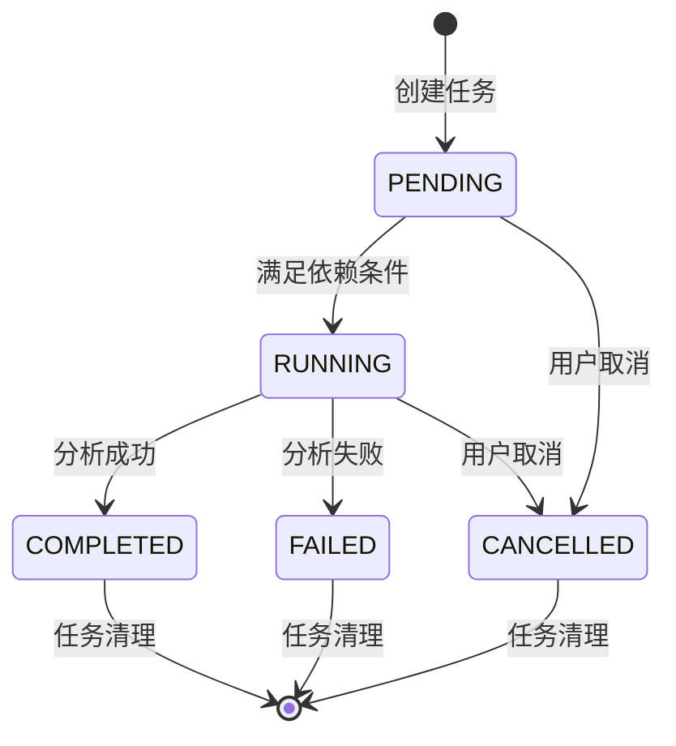
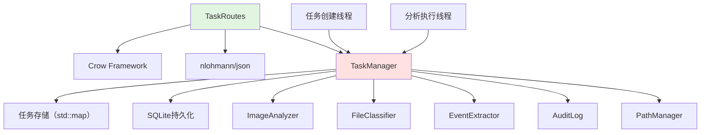
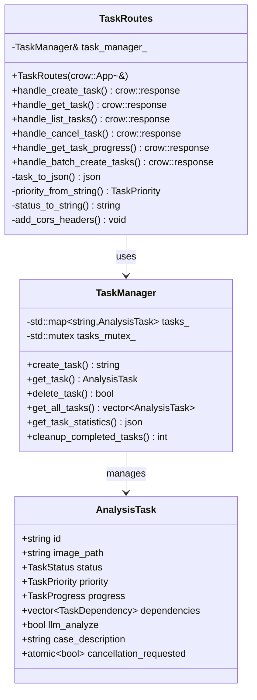
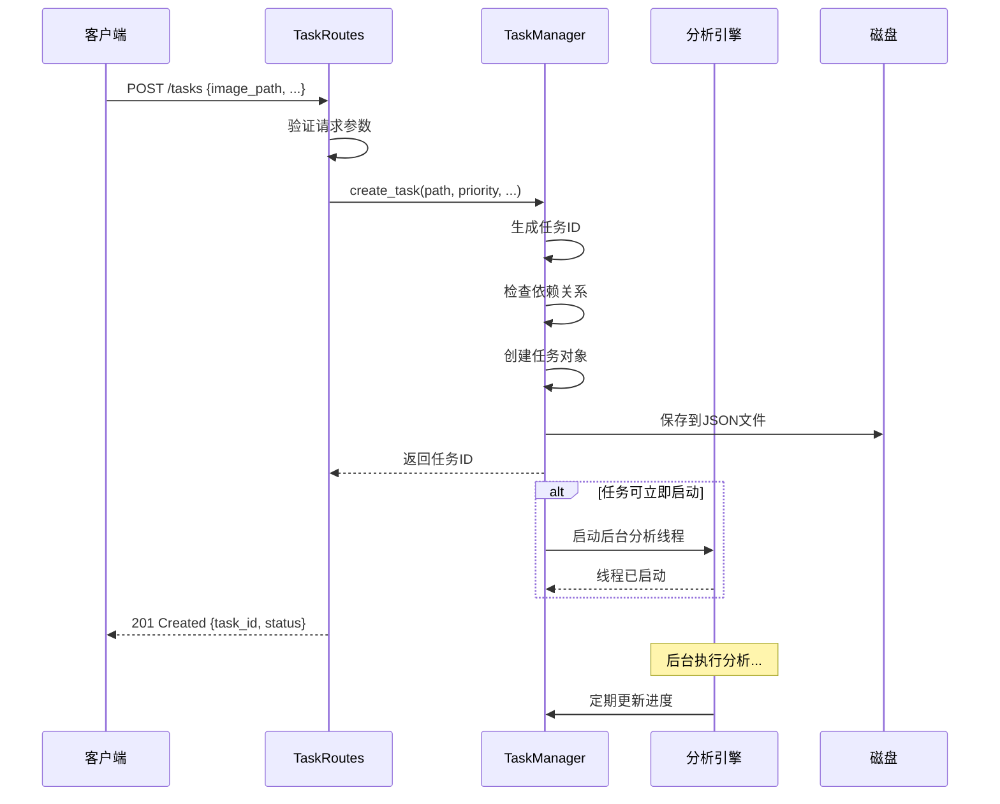
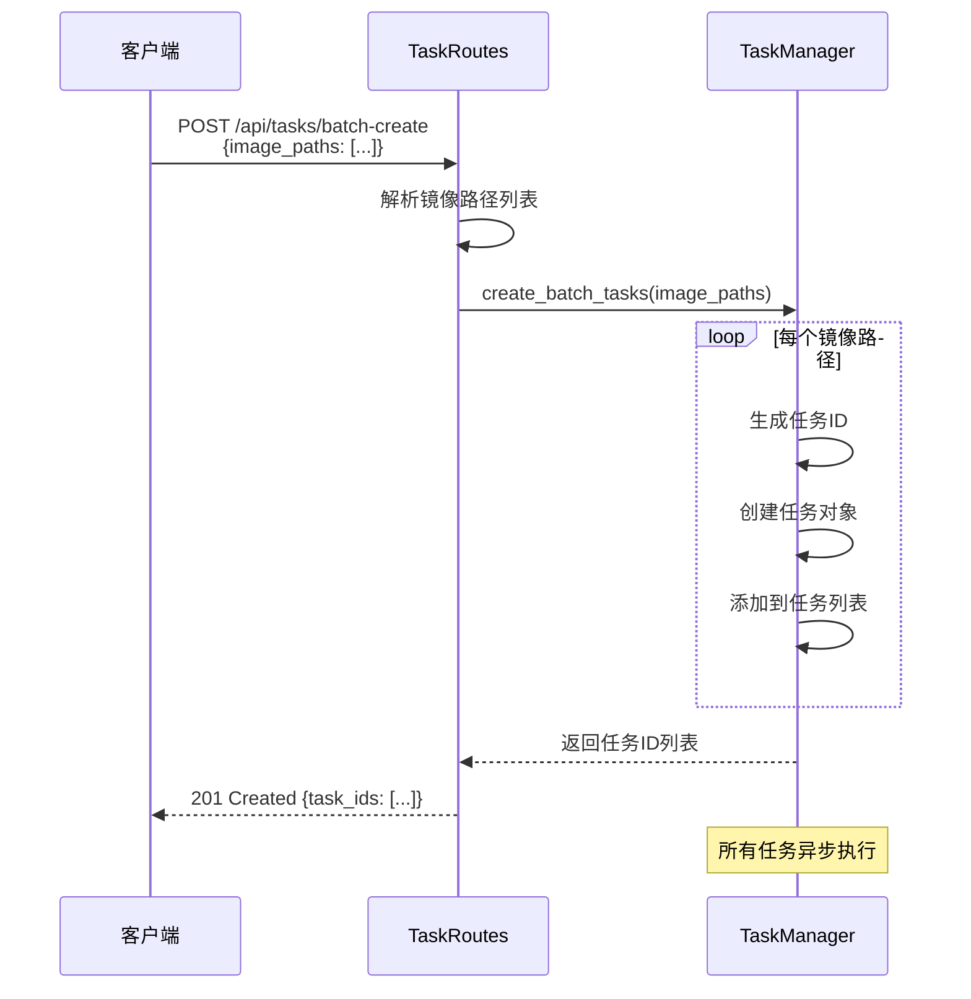

# TaskRoutes 模块文档（C++）

> **注意**: TaskRoutes 已拆分为多个独立的路由文件：
> - `TaskCRUDRoutes.cpp` - 任务 CRUD 端点
> - `TaskBatchRoutes.cpp` - 批量操作端点
> - `TaskMonitoringRoutes.cpp` - 任务监控端点
>
> 完整端点列表请参考 [RouteReference.md](./RouteReference.md)

## 1. 模块背景

### 业务背景

数字取证分析任务的执行时间通常很长（从几分钟到数小时不等），传统的同步HTTP请求无法满足长时间运行任务的实时进度跟踪和状态管理需求。TaskRoutes 模块将任务管理功能封装为 REST API，实现异步任务处理、实时进度跟踪和批量操作管理。

**核心需求**：
- **异步任务执行**：允许长时间运行的分析任务在后台执行，不阻塞HTTP响应
- **实时进度跟踪**：提供任务各阶段的详细进度信息，包括当前阶段、百分比和预计完成时间
- **任务优先级管理**：支持不同优先级的任务调度，确保关键任务优先执行
- **批量操作支持**：允许同时创建、查询和管理多个任务
- **任务依赖关系**：支持任务间的依赖配置，确保依赖任务完成后才执行
- **审计日志**：记录任务生命周期中的所有关键操作

**解决挑战**：
- **并发控制**：多个任务同时运行时的资源竞争和调度
- **状态同步**：前后端状态一致性，确保获取的任务状态是实时的
- **进度估算**：准确估算任务完成时间和剩余工作量
- **错误恢复**：任务失败后的重试机制和错误信息保留
- **资源清理**：已完成任务的自动清理和资源释放

### 技术背景

**为什么需要专门的任务管理路由？**

| 需求 | 挑战 | 解决方案 |
|------|------|----------|
| **长时间运行** | HTTP请求超时 | 异步任务+进度查询 |
| **实时反馈** | 前端需要轮询进度 | 任务状态缓存+REST API |
| **并发执行** | 资源竞争 | 优先级队列+线程池 |
| **任务依赖** | 执行顺序控制 | DAG依赖图+拓扑排序 |
| **批量操作** | 多个任务管理 | 批量API+原子操作 |

**技术栈选型**：

1. **Crow Framework**：
   - 轻量级C++ HTTP框架
   - 类似Flask的路由语法
   - 内置JSON处理支持
   - 线程安全的路由处理

2. **TaskManager 集成**：
   - 单例模式管理任务生命周期
   - 线程安全的任务存储（`std::mutex`保护）
   - SQLite JSON持久化
   - 原子操作的取消标志

3. **CORS 支持**：
   - OPTIONS预检请求处理
   - 跨域资源共享头部配置
   - 支持浏览器前端直接访问

## 2. 模块功能

### 核心功能

#### 1. 任务生命周期管理



**任务状态枚举**：
```cpp
enum class TaskStatus {
    PENDING,    // 等待执行（检查依赖）
    RUNNING,    // 正在执行
    COMPLETED,  // 执行完成
    FAILED,     // 执行失败
    CANCELLED   // 已取消
};
```

#### 2. 任务优先级调度

```cpp
enum class TaskPriority {
    LOW = 0,       // 低优先级（批量分析）
    NORMAL = 1,    // 普通优先级（常规分析）
    HIGH = 2,      // 高优先级（重要案件）
    CRITICAL = 3   // 关键优先级（紧急案件）
};
```

**调度策略**：
- **CRITICAL**任务立即执行，抢占资源
- **HIGH**任务优先于NORMAL和LOW
- **NORMAL**任务按FIFO顺序执行
- **LOW**任务在系统空闲时执行

#### 3. 任务进度跟踪

```cpp
struct TaskProgress {
    TaskPhase current_phase;          // 当前阶段
    int phase_percentage;             // 阶段进度（0-100）
    int overall_percentage;           // 总体进度（0-100）
    std::string phase_description;    // 阶段描述
};

enum class TaskPhase {
    INITIALIZING,         // 初始化（5%权重）
    IMAGE_ANALYSIS,       // 镜像分析（30%权重）
    EVENT_EXTRACTION,     // 事件提取（15%权重）
    FILE_CLASSIFICATION,  // 文件分类（20%权重）
    LLM_ANALYSIS,         // LLM分析（20%权重）
    ANDROID_ANALYSIS,     // Android分析（8%权重）
    FINALIZING            // 完成中（2%权重）
};
```

**进度计算公式**：
```
总体进度 = Σ(已完成的阶段权重) + (当前阶段进度 × 当前阶段权重)
```

**示例**：
- 镜像分析阶段完成50%：`0 × 5% + 50% × 30% = 15%`
- 事件提取阶段完成100%：`5% + 30% + 100% × 15% = 50%`

#### 4. 任务依赖管理

```cpp
struct TaskDependency {
    std::string task_id;    // 依赖的任务ID
    bool required;          // 是否必须成功完成
};
```

**依赖规则**：
- **required=true**：依赖任务必须成功完成，当前任务才能执行
- **required=false**：依赖任务完成后（无论成功或失败）即可执行当前任务
- **循环依赖检测**：任务创建时检测并拒绝循环依赖

#### 5. 批量操作支持

**批量创建**：
```json
POST /api/tasks/batch-create
{
  "image_paths": [
    "/evidence/image1.E01",
    "/evidence/image2.E01",
    "/evidence/image3.E01"
  ],
  "priority": "normal"
}
```

**批量状态查询**：
```json
POST /api/tasks/batch-status
{
  "task_ids": ["task_001", "task_002", "task_003"]
}
```

**批量取消**：
```json
POST /api/tasks/batch-cancel
{
  "task_ids": ["task_001", "task_002"],
  "reason": "Investigation closed"
}
```

### 边界与限制

**功能边界**：
- ❌ 不支持任务暂停/恢复（仅支持取消）
- ❌ 不支持任务重试（失败后需手动重新创建）
- ❌ 不支持分布式任务执行（单机模式）
- ❌ 不支持任务间的数据传递

**已知限制**：
| 限制 | 影响 | 缓解方法 |
|------|------|----------|
| 最大并发任务数 | 默认4个 | 调整 `MAX_CONCURRENT_TASKS` |
| 任务结果缓存大小 | 最多100个 | 定期清理旧任务 |
| 依赖深度 | 最多10层 | 避免深层依赖链 |
| 审计日志保留 | 每任务1000条 | 分页查询历史日志 |

**性能指标**（参考配置：8核 CPU，32GB RAM）：
- API 响应时间：<50ms（查询类），<200ms（创建类）
- 并发任务数：4个（推荐），8个（最大）
- 任务吞吐量：2-3个/小时（取决于镜像大小）
- 内存占用：约500MB/任务

## 3. 模块使用的库

### 依赖库清单

| 库名称 | 版本 | 用途 | 许可证 |
|--------|------|------|--------|
| **Crow** | 1.0+ | HTTP 服务器框架 | BSD-2-Clause |
| **nlohmann/json** | 3.11.2+ | JSON 序列化/反序列化 | MIT |
| **SQLite3** | 3.35.0+ | 任务持久化存储 | Public Domain |

### 依赖关系图



## 4. 模块实现方式

### 架构设计



### 核心类说明

#### TaskRoutes（路由处理类）

**职责**：
- 注册和管理任务相关的HTTP路由
- 处理HTTP请求和响应
- 参数验证和错误处理
- JSON序列化/反序列化

**关键方法**：
```cpp
class TaskRoutes {
public:
    explicit TaskRoutes(crow::App<>& app);

    // 基础任务操作
    crow::response handle_create_task(const crow::request& req);
    crow::response handle_get_task(const crow::request& req, const std::string& task_id);
    crow::response handle_list_tasks(const crow::request& req);
    crow::response handle_cancel_task(const crow::request& req, const std::string& task_id);

    // 进度和统计
    crow::response handle_get_task_progress(const crow::request& req, const std::string& task_id);
    crow::response handle_get_task_statistics(const crow::request& req);

    // 批量操作
    crow::response handle_batch_create_tasks(const crow::request& req);
    crow::response handle_batch_status(const crow::request& req);
    crow::response handle_batch_cancel(const crow::request& req);

    // 高级功能
    crow::response handle_get_task_audit_log(const crow::request& req, const std::string& task_id);
    crow::response handle_update_task_priority(const crow::request& req, const std::string& task_id);
    crow::response handle_cleanup_tasks(const crow::request& req);

private:
    TaskManager& task_manager_;

    // 辅助方法
    nlohmann::json task_to_json(const AnalysisTask& task);
    TaskPriority priority_from_string(const std::string& str);
    std::string priority_to_string(TaskPriority priority);
    std::string status_to_string(TaskStatus status);
    std::string phase_to_string(TaskPhase phase);
    void add_cors_headers(crow::response& res);
};
```

#### TaskManager（任务管理器）

**职责**：
- 任务生命周期管理
- 线程安全的任务存储
- 任务调度和依赖检查
- 进度更新和持久化

**线程安全保证**：
```cpp
class TaskManager {
public:
    static TaskManager& instance();

    // 线程安全的任务操作
    std::string create_task(const std::string& path, TaskPriority priority, ...);
    bool delete_task(const std::string& id);
    AnalysisTask get_task(const std::string& id);
    std::vector<AnalysisTask> get_all_tasks();

    // 进度更新（线程安全）
    void update_progress(const std::string& id, TaskPhase phase,
                        int phase_percentage, const std::string& description);

    // 任务控制
    bool can_start_task(const std::string& id);
    void start_analysis(const std::string& id);

private:
    std::mutex tasks_mutex_;  // 保护 tasks_ 映射
    std::map<std::string, AnalysisTask> tasks_;

    // 任务持久化
    void save_tasks_to_disk();
    void load_tasks_from_disk();
};
```

### 关键流程

#### 任务创建流程



#### 进度更新流程

```cpp
// 在分析线程中更新进度
void TaskManager::update_progress(const std::string& id,
                                  TaskPhase phase,
                                  int phase_percentage,
                                  const std::string& description) {
    std::unique_lock<std::mutex> lock(tasks_mutex_);

    auto& task = tasks_[id];

    // 更新阶段进度
    task.progress.current_phase = phase;
    task.progress.phase_percentage = phase_percentage;
    task.progress.phase_description = description;

    // 计算总体进度
    int overall = calculate_overall_percentage(phase, phase_percentage);
    task.progress.overall_percentage = overall;

    // 异步保存到磁盘
    lock.unlock();
    save_tasks_to_disk();
}

int TaskManager::calculate_overall_percentage(TaskPhase phase, int phase_percent) {
    // 各阶段权重
    static const std::map<TaskPhase, int> weights = {
        {TaskPhase::INITIALIZING, 5},
        {TaskPhase::IMAGE_ANALYSIS, 30},
        {TaskPhase::EVENT_EXTRACTION, 15},
        {TaskPhase::FILE_CLASSIFICATION, 20},
        {TaskPhase::LLM_ANALYSIS, 20},
        {TaskPhase::ANDROID_ANALYSIS, 8},
        {TaskPhase::FINALIZING, 2}
    };

    int total = 0;
    for (const auto& [p, weight] : weights) {
        if (p == phase) {
            total += (phase_percent * weight) / 100;
            break;
        }
        total += weight;  // 已完成的阶段
    }

    return total;
}
```

#### 批量操作流程



### 数据结构

#### 任务创建请求

```json
{
  "image_path": "/path/to/evidence.E01",
  "priority": "high",
  "android_analyze": true,
  "llm_analyze": true,
  "llm_mode": "smart",
  "case_description": "网络欺诈调查案例",
  "xfs_mode": "auto",
  "db_output_dir": "/output/databases",
  "metadata": {
    "case_number": "CASE-2026-001",
    "investigator": "张三",
    "evidence_id": "EV-001"
  },
  "dependencies": [
    {"task_id": "task_001", "required": true}
  ]
}
```

#### 任务响应（task_to_json）

```json
{
  "id": "task_abc123",
  "image_path": "/path/to/evidence.E01",
  "status": "running",
  "priority": "high",
  "message": "正在分析文件系统...",
  "output_files_db": "/output/evidence_files.db",
  "progress": {
    "current_phase": "image_analysis",
    "phase_percentage": 45,
    "overall_percentage": 18,
    "phase_description": "正在分析文件系统..."
  },
  "timestamps": {
    "created": 1704067200000,
    "started": 1704067260000,
    "completed": 0,
    "execution_time_seconds": 0
  },
  "android_analyze": true,
  "llm_analyze": true,
  "llm_mode": "smart",
  "case_description": "网络欺诈调查案例",
  "xfs_mode": "auto",
  "db_output_dir": "/output/databases",
  "extraction_directory": "/data/extracted/task_abc123",
  "cancellation_requested": false,
  "dependencies": [
    {"task_id": "task_001", "required": true}
  ],
  "dependents_count": 0,
  "metadata": {
    "case_number": "CASE-2026-001"
  },
  "error_details": ""
}
```

## 5. API 调用

### REST API 端点

#### 基础任务管理

**1. 创建任务**

```bash
curl -X POST http://localhost:8080/tasks \
  -H "Content-Type: application/json" \
  -d '{
    "image_path": "/evidence/suspect_disk.E01",
    "priority": "high",
    "android_analyze": true,
    "llm_analyze": true,
    "llm_mode": "smart",
    "case_description": "内网入侵调查",
    "xfs_mode": "auto",
    "db_output_dir": "/cases/2026-03/db"
  }'
```

**响应**：
```json
{
  "task_id": "task_a3f8c2d1",
  "status": "created",
  "priority": "high",
  "llm_analyze": true,
  "llm_mode": "smart",
  "dependencies_count": 0
}
```

**2. 查询任务状态**

```bash
curl http://localhost:8080/tasks/task_a3f8c2d1
```

**响应**：
```json
{
  "id": "task_a3f8c2d1",
  "status": "running",
  "progress": {
    "current_phase": "image_analysis",
    "phase_percentage": 67,
    "overall_percentage": 25,
    "phase_description": "正在分析文件系统..."
  }
}
```

**3. 获取任务结果**

```bash
curl http://localhost:8080/tasks/task_a3f8c2d1/results
```

**响应（已完成）**：
```json
{
  "task_id": "task_a3f8c2d1",
  "status": "completed",
  "results": {
    "total_files": 125430,
    "classified_files": 125430,
    "images": 5234,
    "documents": 12456,
    "suspicious_files": 127
  },
  "output_files_db": "/cases/2026-03/db/suspect_disk_files.db"
}
```

**响应（进行中）**：
```json
{
  "status": "running",
  "message": "Task not completed yet",
  "task_id": "task_a3f8c2d1"
}
```

**4. 取消任务**

```bash
curl -X DELETE http://localhost:8080/api/tasks/task_a3f8c2d1
```

**响应**：
```json
{
  "success": true,
  "task_id": "task_a3f8c2d1",
  "message": "Task deleted successfully"
}
```

#### 任务列表和统计

**5. 列出所有任务**

```bash
curl "http://localhost:8080/api/tasks/list?status=running&priority=high&limit=10&offset=0"
```

**响应**：
```json
{
  "tasks": [
    {
      "id": "task_a3f8c2d1",
      "status": "running",
      "priority": "high",
      "progress": {"overall_percentage": 45}
    }
  ],
  "pagination": {
    "total": 23,
    "limit": 10,
    "offset": 0,
    "has_more": true
  },
  "filters": {
    "status": "running",
    "priority": "high"
  }
}
```

**6. 获取任务统计**

```bash
curl http://localhost:8080/api/tasks/statistics
```

**响应**：
```json
{
  "total_tasks": 156,
  "by_status": {
    "pending": 12,
    "running": 4,
    "completed": 128,
    "failed": 8,
    "cancelled": 4
  },
  "by_priority": {
    "low": 45,
    "normal": 89,
    "high": 18,
    "critical": 4
  },
  "average_execution_time_seconds": 3600,
  "success_rate": 0.94
}
```

#### 进度和监控

**7. 获取任务进度**

```bash
curl http://localhost:8080/api/tasks/task_a3f8c2d1/progress
```

**响应**：
```json
{
  "task_id": "task_a3f8c2d1",
  "status": "running",
  "progress": {
    "current_phase": "file_classification",
    "phase_percentage": 75,
    "overall_percentage": 62,
    "phase_description": "正在分类文件..."
  }
}
```

#### 批量操作

**8. 批量创建任务**

```bash
curl -X POST http://localhost:8080/api/tasks/batch-create \
  -H "Content-Type: application/json" \
  -d '{
    "image_paths": [
      "/evidence/disk1.E01",
      "/evidence/disk2.E01",
      "/evidence/disk3.E01"
    ],
    "priority": "normal",
    "android_analyze": false
  }'
```

**响应**：
```json
{
  "success": true,
  "task_ids": [
    "task_b4e9d3f2",
    "task_c5f0e4g3",
    "task_d6g1f5h4"
  ],
  "count": 3
}
```

**9. 批量查询状态**

```bash
curl -X POST http://localhost:8080/api/tasks/batch-status \
  -H "Content-Type: application/json" \
  -d '{
    "task_ids": [
      "task_b4e9d3f2",
      "task_c5f0e4g3",
      "task_d6g1f5h4"
    ]
  }'
```

**响应**：
```json
{
  "statuses": [
    {"task_id": "task_b4e9d3f2", "status": "running", "progress": 45},
    {"task_id": "task_c5f0e4g3", "status": "pending", "progress": 0},
    {"task_id": "task_d6g1f5h4", "status": "failed", "progress": 0}
  ],
  "count": 3
}
```

**10. 批量取消任务**

```bash
curl -X POST http://localhost:8080/api/tasks/batch-cancel \
  -H "Content-Type: application/json" \
  -d '{
    "task_ids": ["task_b4e9d3f2", "task_c5f0e4g3"],
    "reason": "案例已关闭"
  }'
```

**响应**：
```json
{
  "success": true,
  "cancelled_task_ids": [
    "task_b4e9d3f2",
    "task_c5f0e4g3"
  ],
  "cancelled_count": 2
}
```

#### 高级功能

**11. 获取任务审计日志**

```bash
curl "http://localhost:8080/api/tasks/task_a3f8c2d1/audit-log?limit=50&offset=0"
```

**响应**：
```json
{
  "task_id": "task_a3f8c2d1",
  "logs": [
    {
      "timestamp": 1704067200000,
      "action": "task_created",
      "details": "Task created with priority HIGH",
      "user_id": "system"
    },
    {
      "timestamp": 1704067260000,
      "action": "task_started",
      "details": "Analysis started",
      "user_id": "system"
    },
    {
      "timestamp": 1704067320000,
      "action": "phase_changed",
      "details": "Phase changed to IMAGE_ANALYSIS",
      "user_id": "system"
    }
  ],
  "count": 3
}
```

**12. 更新任务优先级**

```bash
curl -X PUT http://localhost:8080/api/tasks/task_a3f8c2d1/priority \
  -H "Content-Type: application/json" \
  -d '{
    "priority": "critical"
  }'
```

**响应**：
```json
{
  "success": true,
  "task_id": "task_a3f8c2d1",
  "new_priority": "critical"
}
```

**13. 清理旧任务**

```bash
curl -X POST http://localhost:8080/api/tasks/cleanup \
  -H "Content-Type: application/json" \
  -d '{
    "max_age_hours": 24
  }'
```

**响应**：
```json
{
  "success": true,
  "removed_count": 45,
  "message": "Cleanup completed"
}
```

### API 参数说明

#### 创建任务参数

| 参数名 | 类型 | 必填 | 默认值 | 说明 |
|--------|------|------|--------|------|
| `image_path` | string | ✅ | - | 磁盘镜像路径 |
| `priority` | string | ❌ | NORMAL | LOW/NORMAL/HIGH/CRITICAL |
| `android_analyze` | boolean | ❌ | false | 是否分析Android数据 |
| `llm_analyze` | boolean | ❌ | false | 是否进行LLM分析 |
| `llm_mode` | string | ❌ | smart | smart/full |
| `case_description` | string | ❌ | - | 案例描述 |
| `xfs_mode` | string | ❌ | auto | auto/native/pure |
| `db_output_dir` | string | ❌ | - | 数据库输出目录 |
| `metadata` | object | ❌ | - | 自定义元数据 |
| `dependencies` | array | ❌ | [] | 任务依赖列表 |

### 返回值说明

**标准成功响应**：
```json
{
  "success": true,
  "data": { /* 响应数据 */ }
}
```

**标准错误响应**：
```json
{
  "success": false,
  "error": "错误消息",
  "error_code": "TASK_NOT_FOUND",
  "timestamp": "2026-03-16T10:00:00Z"
}
```

**HTTP 状态码**：
- `200 OK` - 查询成功
- `201 Created` - 创建成功
- `202 Accepted` - 异步任务已接受
- `400 Bad Request` - 请求参数错误
- `404 Not Found` - 任务不存在
- `500 Internal Server Error` - 服务器内部错误

## 6. 二次开发

### 扩展点

#### 1. 添加新的任务类型

**位置**：扩展 TaskManager 和 TaskRoutes

**示例**：添加专门的视频分析任务

```cpp
// TaskManager.h
enum class TaskType {
    DEFAULT_ANALYSIS,
    VIDEO_ANALYSIS,     // 新增
    EMAIL_ANALYSIS,     // 新增
    NETWORK_FORENSICS   // 新增
};

struct VideoAnalysisTask : public AnalysisTask {
    TaskType task_type = TaskType::VIDEO_ANALYSIS;
    std::string target_directory;   // 分析特定目录
    std::vector<std::string> video_codecs;
    bool extract_frames = false;
    int frame_interval = 10;
};

// TaskManager.cpp
std::string TaskManager::create_video_analysis_task(
    const std::string& imagePath,
    const std::string& targetDirectory,
    const std::vector<std::string>& codecs) {

    std::unique_lock<std::mutex> lock(tasks_mutex_);

    VideoAnalysisTask task;
    task.id = generate_task_id();
    task.task_type = TaskType::VIDEO_ANALYSIS;
    task.image_path = imagePath;
    task.target_directory = targetDirectory;
    task.video_codecs = codecs;
    task.status = TaskStatus::PENDING;

    tasks_[task.id] = task;
    save_tasks_to_disk();

    // 启动专用分析线程
    std::thread([this, task]() {
        run_video_analysis(static_cast<const VideoAnalysisTask&>(task));
    }).detach();

    return task.id;
}
```

**添加API端点**：
```cpp
// TaskRoutes.cpp
CROW_ROUTE(app, "/api/tasks/video").methods("POST"_method)(
    [this](const crow::request& req) {
        try {
            auto body = json::parse(req.body);
            std::string image_path = body["image_path"];
            std::string target_dir = body["target_directory"];
            auto codecs = body["codecs"].get<std::vector<std::string>>();

            std::string task_id = task_manager_.create_video_analysis_task(
                image_path, target_dir, codecs
            );

            json response = {
                {"task_id", task_id},
                {"type", "video_analysis"},
                {"status", "created"}
            };

            crow::response res(201);
            res.set_header("Content-Type", "application/json");
            res.write(response.dump());
            return res;

        } catch (const std::exception& e) {
            return crow::response(400, R"({"error": ")" + std::string(e.what()) + R"("})");
        }
    }
);
```

#### 2. 自定义任务调度策略

**位置**：扩展 TaskManager

**示例**：基于资源使用的动态调度

```cpp
// TaskManager.h
class SchedulingStrategy {
public:
    virtual ~SchedulingStrategy() = default;
    virtual bool should_start_task(const AnalysisTask& task,
                                   const std::vector<AnalysisTask>& running_tasks) = 0;
};

class ResourceAwareScheduler : public SchedulingStrategy {
public:
    bool should_start_task(const AnalysisTask& task,
                          const std::vector<AnalysisTask>& running_tasks) override {
        // 检查CPU和内存使用率
        double cpu_usage = get_cpu_usage();
        double memory_usage = get_memory_usage();

        // 仅在资源充足时启动任务
        if (cpu_usage > 80.0 || memory_usage > 80.0) {
            return false;
        }

        // 根据任务优先级和资源需求决定
        if (task.priority == TaskPriority::CRITICAL) {
            return true;  // 关键任务始终启动
        }

        // 普通任务需要更多资源
        return cpu_usage < 60.0 && memory_usage < 60.0;
    }

private:
    double get_cpu_usage();
    double get_memory_usage();
};

// TaskManager.cpp
class TaskManager {
private:
    std::unique_ptr<SchedulingStrategy> scheduler_;

public:
    TaskManager() : scheduler_(std::make_unique<ResourceAwareScheduler>()) {}

    bool can_start_task(const std::string& id) {
        std::lock_guard<std::mutex> lock(tasks_mutex_);
        auto& task = tasks_[id];

        // 检查依赖
        for (const auto& dep : task.dependencies) {
            auto dep_task = tasks_.find(dep.task_id);
            if (dep_task != tasks_.end()) {
                if (dep.required && dep_task->second.status != TaskStatus::COMPLETED) {
                    return false;  // 依赖任务未完成
                }
            }
        }

        // 使用调度策略判断
        auto running_tasks = get_running_tasks();
        return scheduler_->should_start_task(task, running_tasks);
    }
};
```

#### 3. 添加任务通知机制

**位置**：扩展 TaskManager 和 TaskRoutes

**示例**：WebSocket实时通知

```cpp
// TaskManager.h
class TaskNotifier {
public:
    using Callback = std::function<void(const std::string& task_id, const json& update)>;

    void subscribe(const std::string& task_id, Callback callback) {
        std::lock_guard<std::mutex> lock(mutex_);
        subscribers_[task_id].push_back(callback);
    }

    void notify(const std::string& task_id, const json& update) {
        std::lock_guard<std::mutex> lock(mutex_);
        auto it = subscribers_.find(task_id);
        if (it != subscribers_.end()) {
            for (auto& callback : it->second) {
                callback(task_id, update);
            }
        }
    }

private:
    std::mutex mutex_;
    std::map<std::string, std::vector<Callback>> subscribers_;
};

// TaskManager.cpp
void TaskManager::update_progress(const std::string& id, TaskPhase phase,
                                int phase_percentage, const std::string& description) {
    // ... 更新进度逻辑 ...

    // 发送通知
    json update = {
        {"task_id", id},
        {"phase", phase_to_string(phase)},
        {"percentage", phase_percentage},
        {"description", description}
    };
    notifier_.notify(id, update);
}
```

**添加WebSocket端点**：
```cpp
// TaskRoutes.cpp
CROW_ROUTE(app, "/api/tasks/<string>/ws").methods("GET"_method)(
    [this](const crow::request& req, const std::string& task_id) {
        // 升级到WebSocket连接
        // 需要Crow的WebSocket支持
        // 这里简化为SSE（Server-Sent Events）

        crow::response res;
        res.set_header("Content-Type", "text/event-stream");
        res.set_header("Cache-Control", "no-cache");
        res.set_header("Connection", "keep-alive");

        // 订阅任务更新
        TaskManager::instance().get_notifier().subscribe(task_id,
            [&res](const std::string& id, const json& update) {
                std::string data = "data: " + update.dump() + "\n\n";
                res.write(data);
                res.end();  // 发送数据
            }
        );

        return res;
    }
);
```

### 添加新功能的步骤

#### 完整示例：添加任务暂停/恢复功能

**步骤1：扩展任务状态**

```cpp
// TaskManager.h
enum class TaskStatus {
    PENDING,
    RUNNING,
    PAUSED,     // 新增：已暂停
    COMPLETED,
    FAILED,
    CANCELLED
};

struct AnalysisTask {
    // ... 现有字段 ...
    std::atomic<bool> pause_requested{false};  // 新增
};
```

**步骤2：实现暂停逻辑**

```cpp
// TaskManager.cpp
bool TaskManager::pause_task(const std::string& id) {
    std::lock_guard<std::mutex> lock(tasks_mutex_);
    auto it = tasks_.find(id);
    if (it == tasks_.end() || it->second.status != TaskStatus::RUNNING) {
        return false;
    }

    it->second.pause_requested = true;

    // 记录审计日志
    AuditLog::instance().log(
        "task_paused",
        "Task paused by user",
        id,
        "system"
    );

    return true;
}

bool TaskManager::resume_task(const std::string& id) {
    std::lock_guard<std::mutex> lock(tasks_mutex_);
    auto it = tasks_.find(id);
    if (it == tasks_.end() || it->second.status != TaskStatus::PAUSED) {
        return false;
    }

    it->second.pause_requested = false;
    it->second.status = TaskStatus::RUNNING;

    // 重启分析线程
    std::thread([this, id]() {
        run_analysis(tasks_[id]);
    }).detach();

    return true;
}
```

**步骤3：在分析循环中检查暂停**

```cpp
// ImageAnalyzer.cpp
void ImageAnalyzer::analyze(const std::string& imagePath,
                           AnalysisTask* task) {
    // ... 分析逻辑 ...

    for (const auto& file : files) {
        // 检查暂停请求
        if (task && task->pause_requested.load()) {
            task->status = TaskStatus::PAUSED;
            return;  // 退出分析循环
        }

        // 检查取消请求
        if (task && task->cancellation_requested.load()) {
            return;
        }

        // 分析文件
        analyze_file(file);
    }
}
```

**步骤4：添加API端点**

```cpp
// TaskRoutes.cpp
CROW_ROUTE(app, "/api/tasks/<string>/pause").methods("POST"_method)(
    [this](const crow::request& req, const std::string& task_id) {
        bool success = task_manager_.pause_task(task_id);

        if (success) {
            json response = {
                {"success", true},
                {"task_id", task_id},
                {"message", "Task paused"}
            };
            return crow::response(200, response.dump());
        } else {
            json error = {
                {"success", false},
                {"error", "Task cannot be paused"}
            };
            return crow::response(400, error.dump());
        }
    }
);

CROW_ROUTE(app, "/api/tasks/<string>/resume").methods("POST"_method)(
    [this](const crow::request& req, const std::string& task_id) {
        bool success = task_manager_.resume_task(task_id);

        if (success) {
            json response = {
                {"success", true},
                {"task_id", task_id},
                {"message", "Task resumed"}
            };
            return crow::response(200, response.dump());
        } else {
            json error = {
                {"success", false},
                {"error", "Task cannot be resumed"}
            };
            return crow::response(400, error.dump());
        }
    }
);
```

**步骤5：注册Swagger文档**

```cpp
Swagger::instance().RegisterEndpoint(
    "/api/tasks/{id}/pause", "POST",
    "Pause task",
    "Pause a running analysis task.",
    {"Tasks"},
    {{"id", "path", "Task ID", true}},
    {{200, "Task paused"}, {400, "Cannot pause"}}
);

Swagger::instance().RegisterEndpoint(
    "/api/tasks/{id}/resume", "POST",
    "Resume task",
    "Resume a paused analysis task.",
    {"Tasks"},
    {{"id", "path", "Task ID", true}},
    {{200, "Task resumed"}, {400, "Cannot resume"}}
);
```

### 代码示例

#### 完整的自定义路由模块

```cpp
// routes/CustomTaskRoutes.h
#pragma once
#include <crow.h>
#include "../HTTPserver.h"
#include "TaskManager.h"

class CustomTaskRoutes {
public:
    static void register_routes(crow::SimpleApp& app, HTTPServer* server) {
        // 按案例分组查询任务
        CROW_ROUTE(app, "/api/tasks/by-case/<string>").methods("GET"_method)(
            [](const crow::request& req, const std::string& case_id) {

                auto all_tasks = TaskManager::instance().get_all_tasks();
                std::vector<json> case_tasks;

                for (const auto& task : all_tasks) {
                    if (task.metadata.count("case_id") &&
                        task.metadata.at("case_id") == case_id) {
                        case_tasks.push_back(task_to_json(task));
                    }
                }

                json response = {
                    {"case_id", case_id},
                    {"tasks", case_tasks},
                    {"count", case_tasks.size()}
                };

                crow::response res;
                res.set_header("Content-Type", "application/json");
                res.write(response.dump());
                return res;
            }
        );

        // 任务时间线
        CROW_ROUTE(app, "/api/tasks/<string>/timeline").methods("GET"_method)(
            [](const crow::request& req, const std::string& task_id) {

                auto task = TaskManager::instance().get_task(task_id);
                if (task.id.empty()) {
                    return crow::response(404, R"({"error": "Task not found"})");
                }

                json timeline = {
                    {"created", timestamp_to_ms(task.created_time)},
                    {"started", timestamp_to_ms(task.started_time)},
                    {"completed", timestamp_to_ms(task.completed_time)},
                    {"phases", {
                        {"initializing", {"start", 0, "end", 300}},
                        {"image_analysis", {"start", 300, "end", 1200}},
                        // ... 其他阶段
                    }}
                };

                crow::response res;
                res.set_header("Content-Type", "application/json");
                res.write(timeline.dump());
                return res;
            }
        );
    }

private:
    static json task_to_json(const AnalysisTask& task);
    static int64_t timestamp_to_ms(const std::chrono::system_clock::time_point& tp);
};
```

### 最佳实践

#### 性能优化

**1. 任务查询缓存**：
```cpp
// TaskManager.h
class TaskCache {
public:
    std::optional<AnalysisTask> get(const std::string& id) {
        std::lock_guard<std::mutex> lock(mutex_);
        auto it = cache_.find(id);
        if (it != cache_.end()) {
            return it->second;
        }
        return std::nullopt;
    }

    void put(const std::string& id, const AnalysisTask& task) {
        std::lock_guard<std::mutex> lock(mutex_);
        cache_[id] = task;

        // 限制缓存大小
        if (cache_.size() > MAX_CACHE_SIZE) {
            cache_.erase(cache_.begin());
        }
    }

private:
    static const size_t MAX_CACHE_SIZE = 100;
    std::mutex mutex_;
    std::map<std::string, AnalysisTask> cache_;
};
```

**2. 批量操作优化**：
```cpp
// 使用std::async并行处理
std::vector<json> TaskRoutes::batch_task_to_json(const std::vector<AnalysisTask>& tasks) {
    std::vector<std::future<json>> futures;

    for (const auto& task : tasks) {
        futures.push_back(std::async(std::launch::async, [&task]() {
            return task_to_json(task);
        }));
    }

    std::vector<json> results;
    for (auto& future : futures) {
        results.push_back(future.get());
    }

    return results;
}
```

#### 常见陷阱

**1. 竞态条件**：
```cpp
// 错误：直接访问共享资源
if (task.status == TaskStatus::RUNNING) {
    // 另一个线程可能同时修改task.status
    start_analysis(task.id);
}

// 正确：使用锁
{
    std::lock_guard<std::mutex> lock(tasks_mutex_);
    if (tasks_[id].status == TaskStatus::RUNNING) {
        // 状态检查和操作在锁保护下
        start_analysis(id);
    }
}
```

**2. 死锁**：
```cpp
// 错误：嵌套锁
void TaskManager::method1() {
    std::lock_guard<std::mutex> lock1(mutex1_);
    method2();  // method2也锁mutex1_，导致死锁
}

void TaskManager::method2() {
    std::lock_guard<std::mutex> lock1(mutex1_);
    // ...
}

// 正确：使用递归锁或拆分锁
class TaskManager {
    std::recursive_mutex mutex_;  // 允许同一线程多次加锁
};
```

**3. 内存泄漏**：
```cpp
// 错误：忘记detach线程
std::thread([this, task_id]() {
    run_analysis(task_id);
});  // 线程对象析构，调用std::terminate()

// 正确：detach或join
std::thread([this, task_id]() {
    run_analysis(task_id);
}).detach();  // 分离线程，让其独立运行
```

#### 调试技巧

**1. 任务状态日志**：
```cpp
// 在关键操作处记录状态
void TaskManager::update_progress(...) {
    auto old_status = task.status;
    auto old_progress = task.progress.overall_percentage;

    // 更新进度
    task.progress.overall_percentage = new_percentage;

    LOG_DEBUG("Task " + id + " progress: " +
             std::to_string(old_progress) + " -> " +
             std::to_string(new_percentage));
}
```

**2. 依赖关系可视化**：
```cpp
// TaskRoutes.cpp
CROW_ROUTE(app, "/api/tasks/<string>/dependencies").methods("GET"_method)(
    [](const crow::request& req, const std::string& task_id) {
        auto task = TaskManager::instance().get_task(task_id);

        // 生成依赖图
        json dep_graph = {
            {"task_id", task_id},
            {"dependencies", task.dependencies},
            {"dependents", task.dependents},
            {"can_start", TaskManager::instance().can_start_task(task_id)}
        };

        crow::response res;
        res.write(dep_graph.dump());
        return res;
    }
);
```

## 7. 其他

### 测试

**单元测试位置**：
```
tests/UnitTest/test_task_routes_gtest.cpp
tests/UnitTest/test_task_manager_gtest.cpp
```

**测试用例示例**：
```cpp
TEST(TaskRoutesTest, CreateTask) {
    // 准备测试数据
    json request = {
        {"image_path", "/test/image.E01"},
        {"priority", "high"}
    };

    crow::request req;
    req.body = request.dump();

    TaskRoutes routes(app_);
    crow::response res = routes.handle_create_task(req);

    // 验证响应
    EXPECT_EQ(res.code, 201);

    json response = json::parse(res.body);
    EXPECT_TRUE(response.contains("task_id"));
    EXPECT_EQ(response["status"], "created");
}

TEST(TaskRoutesTest, GetNonExistentTask) {
    TaskRoutes routes(app_);
    crow::response res = routes.handle_get_task(req, "nonexistent");

    EXPECT_EQ(res.code, 404);
}
```

### 配置

**环境变量**：
```env
# 任务配置
MAX_CONCURRENT_TASKS=4
TASK_TIMEOUT_MS=3600000
TASK_CHECK_INTERVAL_MS=5000

# 结果缓存
MAX_CACHED_RESULTS=100
RESULT_CACHE_TTL_MS=3600000

# 审计日志
AUDIT_LOG_ENABLED=true
AUDIT_LOG_MAX_ENTRIES=1000
```

### 故障排查

| 问题 | 可能原因 | 解决方法 |
|------|----------|----------|
| **任务卡在PENDING** | 依赖任务未完成 | 检查依赖任务状态 |
| **任务失败** | 镜像文件损坏 | 验证镜像完整性 |
| **内存不足** | 并发任务过多 | 减少MAX_CONCURRENT_TASKS |
| **进度不更新** | 分析线程崩溃 | 检查日志和异常 |

### 相关模块

- **[HTTPServer](../HTTPServer.md)** - HTTP服务器核心
- **[TaskManager](./TaskManager.md)** - 任务管理核心
- **[ForensicsRoutes](./ForensicsRoutes.md)** - 取证分析路由
- **[SystemRoutes](./SystemRoutes.md)** - 系统管理路由

### 参考资源

- [Crow Framework 文档](https://crow.github.io/)
- [REST API 设计最佳实践](https://restfulapi.net/)
- [异步任务模式](https://en.wikipedia.org/wiki/Asynchronous_I/O)

### 变更历史

| 版本 | 日期 | 变更内容 | 作者 |
|------|------|----------|------|
| 1.0.0 | 2024-02-01 | 初始版本 | Forensics Team |
| 1.1.0 | 2024-05-15 | 添加批量操作 | Forensics Team |
| 1.2.0 | 2024-08-20 | 添加任务依赖 | Forensics Team |
| 1.3.0 | 2026-03-16 | 添加LLM分析支持 | Forensics Team |

---

**最后更新**: 2026-03-16
**维护者**: ymj68520
