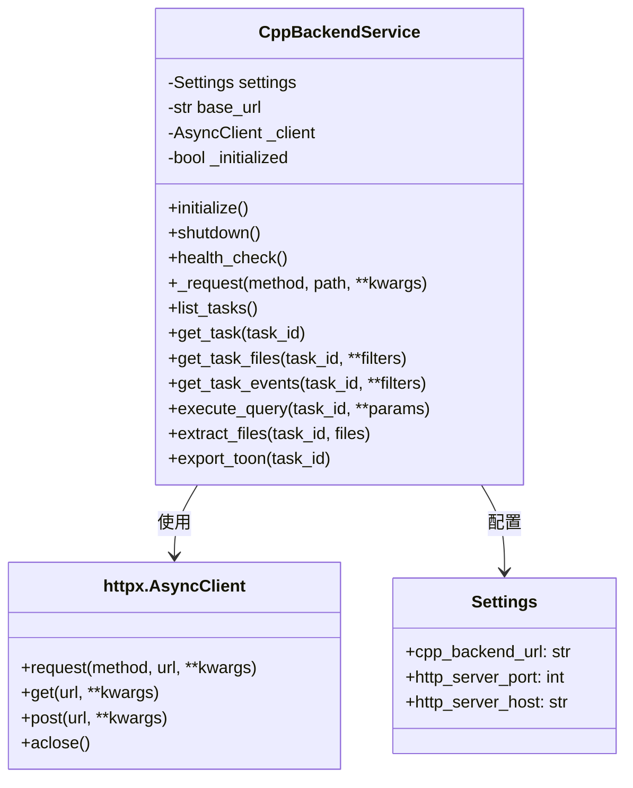
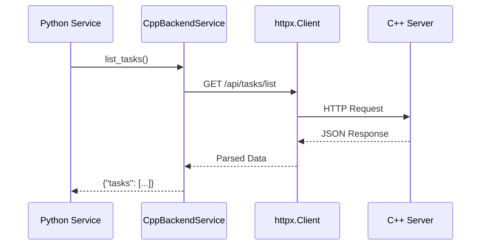

# CppBackendService 模块文档

## 1. 模块背景

### 业务背景

在双服务架构中，Python 服务需要与 C++ 后端频繁通信：

**核心需求**：
- **任务管理**：查询、监控取证分析任务
- **数据库查询**：从 SQLite 数据库获取结构化数据
- **文件操作**：提取、查询文件元数据
- **健康检查**：验证 C++ 服务可用性

**解决挑战**：
- **网络通信**：可靠的 HTTP 请求处理
- **连接管理**：高效的连接池和超时控制
- **错误处理**：重试机制和降级策略
- **协议扩展**：设计支持未来 gRPC/WebSocket

### 技术背景

**HTTP 客户端选择**：

| 库 | 优势 | 劣势 | 选择理由 |
|----|------|------|----------|
| **httpx** | 异步、连接池、HTTP/2 | 相对较新 | ✅ **当前选择** |
| **aiohttp** | 成熟、广泛使用 | API 不一致 | ❌ 迁移成本高 |
| **requests** | 同步、简单 | 阻塞、无原生支持 | ❌ 不适合异步 |

**httpx 特性**：
- **异步支持**：基于 asyncio 的非阻塞 I/O
- **连接池**：自动复用 HTTP 连接
- **超时控制**：精细的请求超时配置
- **重试机制**：内置重试支持
- **HTTP/2**：支持 HTTP/2 协议

## 2. 模块功能

### 核心功能

#### 1. HTTP 客户端管理

**连接池配置**：
```python
async def initialize(self):
    """初始化 HTTP 客户端。"""
    if self._initialized:
        return

    self._client = httpx.AsyncClient(
        base_url=self.base_url,
        timeout=httpx.Timeout(30.0),  # 30 秒超时
        limits=httpx.Limits(
            max_keepalive_connections=10,  # 保持 10 个连接
            max_connections=20,            # 最大 20 个连接
        ),
    )
    self._initialized = True
    logger.info(f"C++ backend service initialized: {self.base_url}")
```

**连接参数说明**：
- `max_keepalive_connections`：保持活跃的连接数（减少握手开销）
- `max_connections`：最大并发连接数（防止资源耗尽）
- `timeout`：默认请求超时（可被单个请求覆盖）

#### 2. 通用请求方法

**带重试的请求**：
```python
async def _request(
    self,
    method: str,
    path: str,
    **kwargs,
) -> Dict[str, Any]:
    """
    发送 HTTP 请求到 C++ 后端。

    特性：
    - 自动重试（最多 3 次）
    - 详细日志记录
    - HTML 检测（404 返回 SPA）
    - JSON 解析
    """
    # 记录请求
    payload_preview = kwargs.get('json') or kwargs.get('params')
    logger.info(f"C++ Request: {method} {path} - Payload: {payload_preview}")

    max_retries = 3
    for attempt in range(max_retries):
        try:
            response = await self.client.request(method, path, **kwargs)

            # 检测 HTML 响应（通常是 404 SPA 回退）
            content_type = response.headers.get("Content-Type", "").lower()
            if "text/html" in content_type:
                logger.error(f"C++ API returned HTML! Status: {response.status_code}")
                return {"success": False, "error": "Backend returned HTML", "status": response.status_code}

            # 错误响应
            if response.status_code >= 400:
                logger.error(f"C++ API Error ({response.status_code}): {response.text}")
                return {"success": False, "error": response.text, "status": response.status_code}

            # 空响应
            if not response.content:
                return {}

            # JSON 解析
            result = response.json()
            logger.info(f"C++ Response from {path}: {str(result)[:200]}...")
            return result

        except Exception as e:
            if attempt == max_retries - 1:
                logger.error(f"C++ backend request failed after {max_retries} attempts: {e}")
                return {"success": False, "error": str(e)}
            # 等待后重试
            await asyncio.sleep(1)

    return {"success": False, "error": "Max retries exceeded"}
```

#### 3. 任务管理 API

**列出所有任务**：
```python
async def list_tasks(
    self,
    status: Optional[str] = None,
    page: int = 1,
    page_size: int = 50,
) -> Dict[str, Any]:
    """
    获取任务列表。

    Args:
        status: 过滤状态（PENDING, RUNNING, COMPLETED 等）
        page: 页码
        page_size: 每页数量

    Returns:
        {
            "tasks": [...],
            "total_count": 100,
            "page": 1,
            "page_size": 50
        }
    """
    params = {"page": page, "page_size": page_size}
    if status:
        params["status"] = status

    return await self._request("GET", "/api/tasks/list", params=params)
```

**获取特定任务**：
```python
async def get_task(self, task_id: str) -> Optional[Dict[str, Any]]:
    """
    获取任务详情。

    注意：当前 C++ API 没有直接的单任务查询接口，
    因此从列表中筛选。
    """
    try:
        result = await self.list_tasks(page_size=1000)
        tasks = result.get("tasks", [])

        for task in tasks:
            if task.get("id") == task_id:
                # 规范化字段名
                if "image_path" in task and "image_name" not in task:
                    task["image_name"] = task["image_path"]
                return task

        return None
    except httpx.HTTPStatusError as e:
        if e.response.status_code == 404:
            return None
        raise
```

**检查任务存在**：
```python
async def check_task_exists(self, task_id: str) -> bool:
    """检查任务是否存在。"""
    task = await self.get_task(task_id)
    return task is not None
```

**获取任务数据库**：
```python
async def get_task_databases(self, task_id: str) -> List[Dict[str, Any]]:
    """
    获取任务关联的所有数据库。

    Returns:
        [
            {"name": "task_123_raw.db", "type": "_raw", "size": 1024000},
            {"name": "task_123_files.db", "type": "_files", "size": 512000},
            ...
        ]
    """
    result = await self._request("GET", f"/api/tasks/{task_id}/databases")
    return result.get("databases", [])
```

#### 4. 文件操作 API

**获取任务文件**：
```python
async def get_task_files(
    self,
    task_id: str,
    file_types: Optional[List[str]] = None,
    limit: int = 100,
) -> List[Dict[str, Any]]:
    """
    获取任务中的文件。

    Args:
        task_id: 任务 ID
        file_types: 文件类型过滤（["documents", "images"]）
        limit: 返回数量限制

    Returns:
        [文件对象列表]
    """
    params = {"limit": limit}
    if file_types:
        params["file_type"] = ",".join(file_types)

    result = await self._request("GET", f"/api/forensics/files/{task_id}", params=params)
    return result.get("data", {}).get("files", [])
```

**分页获取文件**：
```python
async def get_task_files_paginated(
    self,
    task_id: str,
    file_type: Optional[str] = None,
    extension: Optional[str] = None,
    deleted_only: bool = False,
    include_llm: bool = True,
    page: int = 1,
    page_size: int = 50,
) -> Dict[str, Any]:
    """
    分页获取任务文件（支持更多过滤选项）。

    Args:
        task_id: 任务 ID
        file_type: 文件类型过滤
        extension: 扩展名过滤（.txt, .pdf）
        deleted_only: 仅返回已删除文件
        include_llm: 包含 LLM 分析字段
        page: 页码
        page_size: 每页数量

    Returns:
        {
            "files": [...],
            "total_count": 1500
        }
    """
    params = {
        "page": page,
        "page_size": page_size,
        "include_llm": include_llm,
    }
    if file_type:
        params["file_type"] = file_type
    if extension:
        params["extension"] = extension
    if deleted_only:
        params["deleted_only"] = True

    result = await self._request("GET", f"/api/forensics/files/{task_id}", params=params)
    return {
        "files": result.get("data", {}).get("files", []),
        "total_count": result.get("data", {}).get("total_count", 0),
    }
```

#### 5. 事件查询 API

```python
async def get_task_events(
    self,
    task_id: str,
    event_type: Optional[str] = None,
    start_time: Optional[str] = None,
    end_time: Optional[str] = None,
    page: int = 1,
    page_size: int = 50,
) -> Dict[str, Any]:
    """
    获取任务时间线事件。

    Args:
        task_id: 任务 ID
        event_type: 事件类型（CREATED, MODIFIED, DELETED 等）
        start_time: 开始时间（ISO 8601）
        end_time: 结束时间（ISO 8601）
        page: 页码
        page_size: 每页数量

    Returns:
        {
            "events": [...],
            "total_count": 5000
        }
    """
    params = {"page": page, "page_size": page_size}
    if event_type:
        params["event_type"] = event_type
    if start_time:
        params["start_time"] = start_time
    if end_time:
        params["end_time"] = end_time

    result = await self._request("GET", f"/api/forensics/timeline/{task_id}", params=params)
    return {
        "events": result.get("data", {}).get("events", []),
        "total_count": result.get("data", {}).get("total_count", 0),
    }
```

#### 6. 数据库查询 API

```python
async def execute_query(
    self,
    task_id: str,
    database_type: str,
    table: Optional[str] = None,
    sql: Optional[str] = None,
    parameters: Optional[Dict[str, Any]] = None,
    limit: int = 1000,
) -> Dict[str, Any]:
    """
    执行数据库查询。

    Args:
        task_id: 任务 ID
        database_type: 数据库类型（_raw, _files, _events, _android 等）
        table: 表名（与 SQL 二选一）
        sql: 自定义 SQL（与 table 二选一）
        parameters: SQL 参数（防止注入）
        limit: 结果数量限制

    Returns:
        {
            "columns": ["id", "path", "size", ...],
            "rows": [[1, "/file.txt", 1024, ...], ...]
        }
    """
    payload = {
        "task_id": task_id,
        "database_type": database_type,
        "limit": limit,
    }
    if table:
        payload["table"] = table
    if sql:
        payload["sql"] = sql
    if parameters:
        payload["parameters"] = parameters

    result = await self._request("POST", "/api/database/query", json=payload)
    return {
        "columns": result.get("columns", []),
        "rows": result.get("rows", []),
    }
```

#### 7. 文件提取 API

```python
async def extract_files(
    self,
    task_id: str,
    file_paths: List[str],
    output_dir: Optional[str] = None,
    overwrite: bool = False,
) -> Dict[str, Any]:
    """
    提取文件到本地磁盘。

    Args:
        task_id: 任务 ID
        file_paths: 要提取的文件路径列表
        output_dir: 输出目录（默认为 extracted_files）
        overwrite: 是否覆盖现有文件

    Returns:
        {"success": true, "job_id": "extract_job_123"}
    """
    payload = {
        "task_id": task_id,
        "mode": "name",
        "pattern": ",".join(file_paths),  # API 限制：逗号分隔路径
        "output_dir": output_dir or "extracted_files",
        "overwrite": overwrite,
    }

    result = await self._request("POST", "/api/forensics/extract", json=payload)
    return result

async def get_extraction_status(self, job_id: str) -> Dict[str, Any]:
    """
    获取文件提取任务状态。

    Returns:
        {
            "job_id": "...",
            "status": "RUNNING",  # PENDING, RUNNING, COMPLETED, FAILED
            "progress": 50,  # 0-100
            "extracted_files": [...],
            "error": null
        }
    """
    result = await self._request("GET", "/api/forensics/extract/status", params={"job_id": job_id})
    return result
```

#### 8. 导出 API

**TOON 格式导出**：
```python
async def export_toon(
    self,
    task_id: str,
    include_llm: bool = True,
) -> str:
    """
    导出任务数据为 TOON 格式。

    TOON (Token-Oriented Object Notation) 是为 LLM 优化的表格格式。

    Args:
        task_id: 任务 ID
        include_llm: 是否包含 LLM 分析字段

    Returns:
        TOON 格式字符串（文本）
    """
    params = {"include_llm": include_llm}
    response = await self.client.get(
        f"/api/forensics/export/toon",
        params={"task_id": task_id, **params},
    )
    response.raise_for_status()
    return response.text
```

**JSON 格式导出**：
```python
async def export_json(
    self,
    task_id: str,
    database_type: str,
    include_llm: bool = True,
) -> Dict[str, Any]:
    """
    导出任务数据为 JSON 格式。

    Args:
        task_id: 任务 ID
        database_type: 数据库类型
        include_llm: 是否包含 LLM 分析字段

    Returns:
        JSON 数据对象
    """
    params = {
        "task_id": task_id,
        "database_type": database_type,
        "include_llm": include_llm,
    }
    result = await self._request("GET", "/api/forensics/export/json", params=params)
    return result.get("data", {})
```

**TOON 流式处理**：
```python
async def get_files_toon_stream(
    self,
    task_id: str,
    batch_size: int = 100,
    include_llm: bool = False,
) -> Dict[str, Any]:
    """
    获取 TOON 格式的文件数据，支持流式分批处理。

    用于大文件集的 LLM 分析，避免上下文溢出。

    Returns:
        {
            "schema": "TOON.schema: field1 | field2 | field3",
            "data_lines": ["val1 | val2 | val3", ...],
            "total_files": 500,
            "batch_size": 100
        }
    """
    toon_data = await self.export_toon(task_id, include_llm=include_llm)

    lines = toon_data.split('\n')
    schema_line = None
    data_lines = []

    for line in lines:
        line = line.strip()
        if not line:
            continue
        if line.startswith('TOON.schema:'):
            schema_line = line
        else:
            data_lines.append(line)

    return {
        "schema": schema_line,
        "data_lines": data_lines,
        "total_files": len(data_lines),
        "batch_size": batch_size,
    }
```

### 边界与限制

**功能边界**：
- ✅ 支持 HTTP/REST 通信
- ✅ 异步非阻塞请求
- ❌ 不支持 WebSocket（可扩展）
- ❌ 不支持 gRPC（可扩展）
- ❌ 不支持服务发现（静态配置）

**已知限制**：
| 限制 | 影响 | 缓解方法 |
|------|------|----------|
| 单任务查询效率低 | 列表查询所有任务 | 添加 C++ 端点支持 |
| 文件提取 API 限制 | 只支持逗号分隔路径 | 批量调用或扩展 API |
| 无请求缓存 | 重复请求开销 | 在调用层实现缓存 |
| 同步超时固定 | 无法动态调整 | 使用 kwargs 覆盖 |

**性能考虑**：
- **连接池大小**：默认 20 个连接
- **请求超时**：默认 30 秒
- **重试次数**：最多 3 次
- **并发限制**：受连接池限制

## 3. 模块使用的库

### 依赖库清单

```python
# 标准库
import asyncio
import logging
from typing import Any, Dict, List, Optional

# HTTP 客户端
import httpx  # 异步 HTTP 客户端

# 配置
from ..config import Settings
```

### 架构图



### 数据流图



## 4. 模块实现方式

### 核心类

```python
class CppBackendService:
    """
    C++ 后端通信服务。

    特性：
    - 连接池管理
    - 自动重试
    - 详细日志
    - 健康检查
    """

    def __init__(self, settings: Settings):
        self.settings = settings
        self.base_url = settings.cpp_backend_url
        self._client: Optional[httpx.AsyncClient] = None
        self._initialized = False

    # 生命周期
    async def initialize(self): ...
    async def shutdown(self): ...

    # HTTP 客户端访问
    @property
    def client(self) -> httpx.AsyncClient:
        """获取或创建 HTTP 客户端。"""
        if self._client is None:
            self._client = httpx.AsyncClient(
                base_url=self.base_url,
                timeout=httpx.Timeout(30.0),
            )
        return self._client

    # 核心请求方法
    async def _request(self, method: str, path: str, **kwargs) -> Dict[str, Any]: ...

    # API 方法
    async def health_check(self) -> bool: ...
    async def list_tasks(...) -> Dict[str, Any]: ...
    async def get_task_files(...) -> List[Dict[str, Any]]: ...
    # ... 其他 API 方法
```

### 健康检查实现

```python
async def health_check(self) -> bool:
    """
    检查 C++ 后端健康状态。

    Returns:
        True if healthy, False otherwise.
    """
    try:
        response = await self.client.get("/api/health")
        return response.status_code == 200
    except Exception as e:
        logger.warning(f"C++ backend health check failed: {e}")
        return False
```

### 错误处理策略

```python
async def _request(self, method: str, path: str, **kwargs) -> Dict[str, Any]:
    """带完整错误处理的请求方法。"""
    max_retries = 3

    for attempt in range(max_retries):
        try:
            response = await self.client.request(method, path, **kwargs)

            # 1. 检查 HTML 响应（SPA 回退）
            content_type = response.headers.get("Content-Type", "").lower()
            if "text/html" in content_type:
                return {"success": False, "error": "Backend returned HTML"}

            # 2. 检查 HTTP 错误状态
            if response.status_code >= 400:
                return {"success": False, "error": response.text}

            # 3. 处理空响应
            if not response.content:
                return {}

            # 4. 解析 JSON
            result = response.json()
            return result

        except Exception as e:
            # 最后一次尝试失败
            if attempt == max_retries - 1:
                return {"success": False, "error": str(e)}
            # 等待后重试
            await asyncio.sleep(1)

    return {"success": False, "error": "Max retries exceeded"}
```

## 5. API 调用

### FastAPI 路由集成

```python
from fastapi import APIRouter, Depends
from ..services import get_service_manager, ServiceManager

router = APIRouter()

@router.get("/tasks")
async def list_tasks(
    status: Optional[str] = None,
    page: int = 1,
    service_manager: ServiceManager = Depends(get_service_manager)
):
    """获取任务列表。"""
    cpp = service_manager.cpp_backend
    result = await cpp.list_tasks(status=status, page=page)
    return result

@router.get("/tasks/{task_id}/files")
async def get_task_files(
    task_id: str,
    file_type: Optional[str] = None,
    limit: int = 100,
    service_manager: ServiceManager = Depends(get_service_manager)
):
    """获取任务文件。"""
    cpp = service_manager.cpp_backend
    files = await cpp.get_task_files(
        task_id=task_id,
        file_types=[file_type] if file_type else None,
        limit=limit,
    )
    return {"files": files}
```

### 数据库查询示例

```python
async def query_documents(task_id: str):
    """查询文档表。"""
    sm = get_service_manager()
    cpp = sm.cpp_backend

    result = await cpp.execute_query(
        task_id=task_id,
        database_type="_files",
        table="documents",
        limit=100,
    )

    columns = result["columns"]
    rows = result["rows"]

    # 转换为字典列表
    documents = []
    for row in rows:
        doc = dict(zip(columns, row))
        documents.append(doc)

    return documents

async def custom_sql_query(task_id: str):
    """执行自定义 SQL。"""
    sm = get_service_manager()
    cpp = sm.cpp_backend

    result = await cpp.execute_query(
        task_id=task_id,
        database_type="_files",
        sql="SELECT * FROM documents WHERE size > ? LIMIT ?",
        parameters={"1": 10240, "2": 50},
        limit=50,
    )

    return result
```

### 文件提取工作流

```python
async def extract_and_monitor(task_id: str, file_paths: List[str]):
    """提取文件并监控进度。"""
    sm = get_service_manager()
    cpp = sm.cpp_backend

    # 1. 启动提取任务
    extract_result = await cpp.extract_files(
        task_id=task_id,
        file_paths=file_paths,
        output_dir="extracted_files",
        overwrite=False,
    )

    if not extract_result.get("success"):
        return {"error": "Failed to start extraction"}

    job_id = extract_result["job_id"]

    # 2. 轮询提取状态
    while True:
        status = await cpp.get_extraction_status(job_id)

        if status["status"] == "COMPLETED":
            return {
                "success": True,
                "extracted_files": status["extracted_files"],
            }
        elif status["status"] == "FAILED":
            return {"error": status.get("error", "Extraction failed")}

        # 等待后重试
        await asyncio.sleep(2)
```

### TOON 导出和流处理

```python
async def export_toon_batches(task_id: str, batch_size: int = 100):
    """导出 TOON 并分批处理。"""
    sm = get_service_manager()
    cpp = sm.cpp_backend

    # 获取 TOON 数据
    toon_data = await cpp.get_files_toon_stream(
        task_id=task_id,
        batch_size=batch_size,
        include_llm=True,
    )

    schema = toon_data["schema"]
    data_lines = toon_data["data_lines"]
    total_files = toon_data["total_files"]

    # 分批处理
    batches = []
    for i in range(0, len(data_lines), batch_size):
        batch = data_lines[i:i + batch_size]
        batches.append({
            "schema": schema,
            "data": batch,
            "batch_number": len(batches) + 1,
            "total_batches": (len(data_lines) + batch_size - 1) // batch_size,
        })

    return {
        "total_files": total_files,
        "batches": batches,
    }
```

## 6. 二次开发

### 添加 WebSocket 支持

```python
class CppBackendService:
    """扩展 WebSocket 支持。"""

    def __init__(self, settings: Settings):
        # ... 现有代码 ...
        self._ws_client: Optional[websockets.async_client_websocket] = None

    async def connect_websocket(self, path: str):
        """连接 WebSocket 端点。"""
        import websockets

        ws_url = f"{self.base_url.replace('http://', 'ws://')}{path}"
        self._ws_client = await websockets.connect(ws_url)
        logger.info(f"WebSocket connected: {ws_url}")

    async def ws_send(self, message: dict):
        """发送 WebSocket 消息。"""
        if self._ws_client:
            import json
            await self._ws_client.send(json.dumps(message))

    async def ws_receive(self) -> dict:
        """接收 WebSocket 消息。"""
        if self._ws_client:
            import json
            message = await self._ws_client.recv()
            return json.loads(message)
```

### 添加请求缓存

```python
from functools import lru_cache
from hashlib import md5
import json

class CachedCppBackendService(CppBackendService):
    """带缓存的 C++ 后端服务。"""

    def __init__(self, settings: Settings):
        super().__init__(settings)
        self._cache: Dict[str, Any] = {}
        self._cache_ttl = 300  # 5 分钟

    async def _request(self, method: str, path: str, use_cache=True, **kwargs):
        """带缓存的请求。"""
        # 生成缓存键
        if method == "GET" and use_cache:
            cache_key = self._cache_key(method, path, kwargs)

            # 检查缓存
            if cache_key in self._cache:
                cached = self._cache[cache_key]
                if time.time() - cached["timestamp"] < self._cache_ttl:
                    logger.debug(f"Cache hit: {cache_key}")
                    return cached["data"]

        # 调用父类方法
        result = await super()._request(method, path, **kwargs)

        # 缓存 GET 请求
        if method == "GET" and use_cache and result.get("success"):
            cache_key = self._cache_key(method, path, kwargs)
            self._cache[cache_key] = {
                "data": result,
                "timestamp": time.time(),
            }

        return result

    def _cache_key(self, method: str, path: str, kwargs: dict) -> str:
        """生成缓存键。"""
        key_str = f"{method}:{path}:{json.dumps(kwargs, sort_keys=True)}"
        return md5(key_str.encode()).hexdigest()
```

### 添加请求批处理

```python
class BatchCppBackendService(CppBackendService):
    """支持请求批处理。"""

    async def batch_execute_queries(
        self,
        queries: List[Dict[str, Any]],
    ) -> List[Dict[str, Any]]:
        """
        批量执行查询。

        Args:
            queries: [
                {"task_id": "task1", "database_type": "_files", "table": "documents"},
                {"task_id": "task2", "database_type": "_files", "table": "images"},
            ]

        Returns:
            [结果列表]
        """
        # 使用 asyncio.gather 并发执行
        tasks = [
            self.execute_query(**query)
            for query in queries
        ]

        results = await asyncio.gather(*tasks, return_exceptions=True)

        # 处理异常
        processed_results = []
        for i, result in enumerate(results):
            if isinstance(result, Exception):
                processed_results.append({
                    "success": False,
                    "error": str(result),
                    "query": queries[i],
                })
            else:
                processed_results.append(result)

        return processed_results
```

## 7. 其他

### 测试

**单元测试示例**：
```python
import pytest
from httpserver.services import CppBackendService
from httpserver.config import Settings

@pytest.mark.asyncio
async def test_health_check():
    """测试健康检查。"""
    settings = Settings()
    service = CppBackendService(settings)
    await service.initialize()

    is_healthy = await service.health_check()
    assert isinstance(is_healthy, bool)

    await service.shutdown()

@pytest.mark.asyncio
async def test_list_tasks(monkeypatch):
    """测试任务列表（使用 monkeypatch 模拟）。"""
    # 模拟响应
    async def mock_request(*args, **kwargs):
        return {
            "tasks": [
                {"id": "task1", "status": "COMPLETED"},
                {"id": "task2", "status": "RUNNING"},
            ],
            "total_count": 2,
        }

    service = CppBackendService(Settings())
    service._request = mock_request

    result = await service.list_tasks()
    assert len(result["tasks"]) == 2
```

### 配置

**环境变量**：
```env
# C++ Backend
CPP_BACKEND_URL=http://localhost:8080
HTTP_SERVER_PORT=8080
HTTP_SERVER_HOST=0.0.0.0
```

### 故障排查

| 问题 | 可能原因 | 解决方法 |
|------|----------|----------|
| 连接被拒绝 | C++ 服务未启动 | 检查 C++ 服务状态 |
| 请求超时 | 网络延迟或 C++ 服务忙 | 增加 timeout 值 |
| HTML 响应 | API 端点不存在 | 检查路径拼写 |
| 所有请求失败 | base_url 错误 | 验证 CPP_BACKEND_URL |

### 最佳实践

1. **总是使用依赖注入**：
   ```python
   # ✅ 推荐
   async def endpoint(sm: ServiceManager = Depends(get_service_manager)):
       cpp = sm.cpp_backend

   # ❌ 不推荐
   async def endpoint():
       sm = get_service_manager()
   ```

2. **处理分页结果**：
   - 使用 `get_task_files_paginated` 而非 `get_task_files`
   - 遍历所有页直到获取全部数据

3. **监控 API 调用**：
   - 记录慢查询
   - 统计错误率

4. **实现断路器**：
   ```python
   class CircuitBreaker:
       def __init__(self, failure_threshold=5):
           self.failure_count = 0
           self.failure_threshold = failure_threshold
           self.last_failure_time = None
           self.open = False

       async def call(self, func, *args, **kwargs):
           if self.open:
               if self._should_attempt_reset():
                   self.open = False
               else:
                   raise Exception("Circuit breaker is open")

           try:
               result = await func(*args, **kwargs)
               self._on_success()
               return result
           except Exception as e:
               self._on_failure()
               raise
   ```

### 相关模块

- **[ServiceManager](./ServiceManager.md)** - 服务管理器
- **[Main](./Main.md)** - Python HTTP Server
- **[C++ HTTPServer](../cpp/network/HTTPServer.md)** - C++ HTTP 服务器

### 参考资源

- **httpx 文档**: https://www.python-httpx.org/
- **AsyncIO 指南**: https://docs.python.org/3/library/asyncio.html
- **C++ API 文档**: [API_REFERENCE](../../api_reference/)

### 变更历史

| 版本 | 日期 | 变更内容 | 作者 |
|------|------|----------|------|
| 1.0.0 | 2026-03-16 | 初始版本 | ymj68520 |

---

**最后更新**: 2026-03-16
**维护者**: ymj68520
