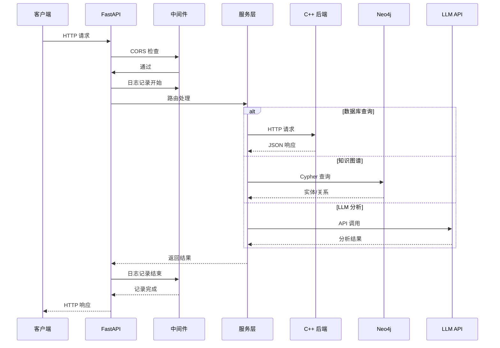

# Python HTTP Server (Main) 模块文档

## 1. 模块背景

### 业务背景

在数字取证分析工具的双服务架构中，Python HTTP Server 作为 C++ 后端的重要补充，提供了：

**核心需求**：
- **知识图谱集成**：通过 Graphiti 提供高级实体关系分析
- **LLM 分析服务**：AI 驱动的文件分析和描述生成
- **数据库导出**：TOON 和 JSON 格式的灵活数据导出
- **健康监控**：服务可用性和就绪状态检查

**架构定位**：
```
┌─────────────────────────────────────────────────────────┐
│                    前端 (Web UI)                       │
└────────────┬──────────────────────┬────────────────────┘
             │                      │
     ┌───────▼────────┐    ┌───────▼────────┐
     │ C++ HTTP Server│    │ Python HTTP    │
     │   (Port 8080)  │    │ Server         │
     │                │    │ (Port 8090)    │
     │ • 磁盘镜像分析 │    │ • Graphiti     │
     │ • 文件系统遍历 │    │ • LLM 分析     │
     │ • 任务管理     │◄──►│ • 数据导出     │
     │ • 数据库查询   │    │ • 健康检查     │
     └────────────────┘    └────────────────┘
```

### 技术背景

**框架选择**：
- **FastAPI**：现代、高性能 Python Web 框架
  - 自动 API 文档（OpenAPI/Swagger）
  - 类型验证（Pydantic）
  - 异步支持（async/await）
  - 依赖注入系统

**技术栈对比**：

| 框架 | 优势 | 劣势 | 选择理由 |
|------|------|------|----------|
| **FastAPI** | 高性能、自动文档、类型安全 | 相对较新 | ✅ **当前选择** |
| **Flask** | 成熟、灵活 | 需手动添加类型验证 | ❌ 性能较低 |
| **Django** | 功能完整 | 过于重量级 | ❌ 不适合微服务 |
| **Tornado** | 异步原生 | 缺少现代特性 | ❌ 生态较弱 |

**依赖技术**：
- **uvicorn**：ASGI 服务器
- **httpx**：异步 HTTP 客户端
- **pydantic-settings**：配置管理
- **Neo4j Driver**：图数据库连接
- **OpenAI SDK**：LLM API 集成

## 2. 模块功能

### 核心功能

#### 1. 应用生命周期管理

**启动和关闭流程**：
```python
@asynccontextmanager
async def lifespan(app: FastAPI):
    # 启动阶段
    logger.info("Starting Python HTTP Service")

    # 初始化服务管理器
    service_manager = get_service_manager()
    await service_manager.initialize()

    yield  # 应用运行中

    # 关闭阶段
    logger.info("Shutting down Python HTTP Service")
    await service_manager.shutdown()
```

**启动事件顺序**：
1. 加载配置（Settings）
2. 初始化服务管理器（ServiceManager）
3. 初始化各个服务：
   - CppBackendService（C++ 后端通信）
   - GraphitiService（知识图谱）
   - LLMService（LLM 分析）
4. 注册路由
5. 启动 uvicorn 服务器

#### 2. 中间件系统

**CORS 中间件**：
```python
app.add_middleware(
    CORSMiddleware,
    allow_origins=["*"],  # 生产环境应限制
    allow_credentials=True,
    allow_methods=["*"],
    allow_headers=["*"],
)
```

**请求日志中间件**：
```python
@app.middleware("http")
async def log_requests(request: Request, call_next):
    start_time = time.time()
    client_ip = request.client.host

    try:
        response = await call_next(request)
        duration = (time.time() - start_time) * 1000

        logger.info(
            f"{request.method} {request.url.path} - "
            f"{response.status_code} - {duration:.2f}ms - {client_ip}"
        )
        return response
    except Exception as e:
        logger.error(f"ERROR: {str(e)}")
        raise
```

**全局异常处理**：
```python
@app.exception_handler(Exception)
async def global_exception_handler(request: Request, exc: Exception):
    logger.error(f"Unhandled exception: {exc}", exc_info=True)

    return JSONResponse(
        status_code=500,
        content={
            "success": False,
            "message": "Internal server error",
            "error": str(exc) if settings.log_level == "DEBUG" else "An error occurred",
            "timestamp": time.strftime("%Y-%m-%d %H:%M:%S"),
        }
    )
```

#### 3. 路由模块

**路由架构**：
```python
def _register_routes(app: FastAPI):
    from .routes import (
        health,       # 健康检查
        graphiti,     # 知识图谱
        llm,          # LLM 分析
        database,     # 数据库查询/导出
        office,       # Office 文档分析
        case_analysis, # 案例分析
        system        # 系统信息
    )

    # 无前缀路由
    app.include_router(health.router, tags=["Health"])

    # API 路由（带前缀）
    app.include_router(graphiti.router, prefix="/api/graphiti", tags=["Graphiti"])
    app.include_router(llm.router, prefix="/api/llm", tags=["LLM"])
    app.include_router(case_analysis.router, prefix="/api/llm", tags=["Case Analysis"])
    app.include_router(database.router, prefix="/api/db", tags=["Database"])
    app.include_router(office.router, prefix="/api/office", tags=["Office"])
    app.include_router(system.router, prefix="/api/system", tags=["System"])
```

**路由模块职责**：

| 路由模块 | 前缀 | 主要功能 | 端点数量 |
|---------|------|----------|----------|
| **health** | 无 | 健康检查、存活探针 | 3 |
| **graphiti** | /api/graphiti | 知识图谱操作 | 6 |
| **llm** | /api/llm | LLM 文件分析 | 5 |
| **database** | /api/db | 数据库查询、导出 | 4 |
| **office** | /api/office | Office 文档提取 | 2 |
| **case_analysis** | /api/llm | 案例综合分析 | 3 |
| **system** | /api/system | 系统信息、日志 | 2 |

#### 4. OpenAPI 文档

**自动生成的文档**：
- **Swagger UI**: http://localhost:8090/docs
- **ReDoc**: http://localhost:8090/redoc
- **OpenAPI Schema**: http://localhost:8090/openapi.json

**文档配置**：
```python
app = FastAPI(
    title="ForensicsProject Python Service",
    description="""
    Python HTTP Service for ForensicsProject digital forensics tool.

    ## Features

    - **Graphiti Integration**: Knowledge graph operations
    - **LLM Analysis**: AI-powered file analysis
    - **Database Access**: Query and export data
    - **Health Monitoring**: Service health checks
    """,
    version="1.0.0",
    docs_url="/docs",
    redoc_url="/redoc",
    openapi_url="/openapi.json",
)
```

### 边界与限制

**功能边界**：
- ✅ 支持 RESTful API（HTTP/JSON）
- ✅ 异步请求处理
- ❌ 不支持 WebSocket（可扩展）
- ❌ 不支持 gRPC（可扩展）
- ❌ 不支持 GraphQL（可扩展）

**已知限制**：
| 限制 | 影响 | 缓解方法 |
|------|------|----------|
| 单进程运行 | 无多进程支持 | 使用 uvicorn workers |
| 无认证 | 无访问控制 | 添加 JWT/OAuth 中间件 |
| CORS 全开 | 跨域安全风险 | 生产环境限制 origins |
| 无速率限制 | 可能被滥用 | 添加 slowapi 中间件 |

**性能特性**：
- **异步处理**：使用 asyncio 实现高并发
- **连接池**：httpx 连接复用
- **类型验证**：Pydantic 自动验证请求数据

## 3. 模块使用的库

### 依赖库清单

```python
# Web 框架
fastapi==0.104.1          # 现代 Web 框架
uvicorn[standard]==0.24.0  # ASGI 服务器

# HTTP 客户端
httpx==0.25.2             # 异步 HTTP 客户端

# 数据验证
pydantic==2.5.0           # 数据验证
pydantic-settings==2.1.0  # 配置管理

# 数据库
neo4j==5.14.0             # Neo4j 驱动

# LLM 集成
openai==1.3.0             # OpenAI SDK

# 工具库
python-multipart==0.0.6   # 文件上传支持
```

### 架构图

```mermaid
classDiagram
    class FastAPI {
        +FastAPI() app
        +add_middleware()
        +include_router()
        +exception_handler()
    }

    class Settings {
        +python_http_port: int
        +cpp_backend_url: str
        +neo4j_uri: str
        +llm_base_url: str
        +get_settings() Settings
    }

    class ServiceManager {
        +cpp_backend: CppBackendService
        +graphiti_service: GraphitiService
        +llm_service: LLMService
        +initialize()
        +shutdown()
        +health_check()
    }

    class Router {
        <<abstract>>
        +router: APIRouter
    }

    class HealthRouter {
        +router: APIRouter
        +/health
        +/health/live
        +/health/ready
    }

    class GraphitiRouter {
        +router: APIRouter
        +/api/graphiti/ingest
        +/api/graphiti/search
    }

    class LLMRouter {
        +router: APIRouter
        +/api/llm/analyze
        +/api/llm/batch-analyze
    }

    class DatabaseRouter {
        +router: APIRouter
        +/api/db/query
        +/api/db/tasks/{id}/export
    }

    FastAPI --> Settings: uses
    FastAPI --> ServiceManager: manages
    FastAPI --> Router: includes
    Router <|-- HealthRouter: extends
    Router <|-- GraphitiRouter: extends
    Router <|-- LLMRouter: extends
    Router <|-- DatabaseRouter: extends
    ServiceManager --> CppBackendService: manages
    ServiceManager --> GraphitiService: manages
    ServiceManager --> LLMService: manages
```

### 数据流图



## 4. 模块实现方式

### 应用工厂模式

```python
def create_app(settings: Optional[Settings] = None) -> FastAPI:
    """
    创建并配置 FastAPI 应用。

    使用工厂模式便于：
    - 测试时创建多个应用实例
    - 不同配置创建不同应用
    - 避免全局状态
    """
    global _app

    if settings is None:
        settings = get_settings()

    # 创建应用实例
    app = FastAPI(
        title="ForensicsProject Python Service",
        version="1.0.0",
        lifespan=lifespan,  # 生命周期管理
    )

    # 配置中间件
    _configure_middleware(app, settings)

    # 注册路由
    _register_routes(app)

    _app = app
    return app

def get_app() -> FastAPI:
    """获取全局应用实例（单例模式）。"""
    global _app
    if _app is None:
        _app = create_app()
    return _app
```

### 服务器启动

```python
def run_server(
    host: Optional[str] = None,
    port: Optional[int] = None,
    reload: bool = False,
    workers: int = 1,
):
    """
    运行 HTTP 服务器。

    Args:
        host: 服务器主机。默认使用 settings。
        port: 服务器端口。默认使用 settings。
        reload: 开发模式自动重载。
        workers: 工作进程数。
    """
    settings = get_settings()

    host = host or settings.python_http_host
    port = port or settings.python_http_port

    logger.info(f"Starting server at http://{host}:{port}")

    app = get_app()

    uvicorn.run(
        app,
        host=host,
        port=port,
        reload=reload,      # 开发模式
        workers=workers,    # 生产模式多进程
    )

# 直接运行
if __name__ == "__main__":
    run_server()
```

### 配置加载

**环境变量支持**：
```python
class Settings(BaseSettings):
    """使用 pydantic-settings 自动加载环境变量。"""

    model_config = SettingsConfigDict(
        env_file=find_env_file(),  # 自动查找 .env
        env_file_encoding="utf-8",
        case_sensitive=False,      # 不区分大小写
        extra="ignore",            # 忽略额外字段
    )

    # 服务器配置
    python_http_port: int = Field(default=8090, alias="PYTHON_HTTP_PORT")
    python_http_host: str = Field(default="0.0.0.0", alias="PYTHON_HTTP_HOST")

    # C++ 后端
    cpp_backend_url: str = Field(default="http://localhost:8080")

    # LLM 配置
    llm_base_url: str = Field(default="http://localhost:1234")
    llm_api_key: str = Field(default="")

    # Neo4j 配置
    neo4j_uri: str = Field(default="neo4j://127.0.0.1:7687")
    neo4j_user: str = Field(default="neo4j")
    neo4j_password: str = Field(default="")

@lru_cache()
def get_settings() -> Settings:
    """缓存的设置实例（单例）。"""
    return Settings()
```

### 中间件配置

```python
def _configure_middleware(app: FastAPI, settings: Settings):
    """配置所有中间件。"""

    # 1. CORS 中间件
    app.add_middleware(
        CORSMiddleware,
        allow_origins=["*"],  # 生产环境应设置具体域名
        allow_credentials=True,
        allow_methods=["*"],
        allow_headers=["*"],
    )

    # 2. 请求日志中间件
    @app.middleware("http")
    async def log_requests(request: Request, call_next):
        start_time = time.time()
        client_ip = request.client.host if request.client else "unknown"

        try:
            response = await call_next(request)
            duration = (time.time() - start_time) * 1000

            logger.info(
                f"{request.method} {request.url.path} - "
                f"{response.status_code} - {duration:.2f}ms - {client_ip}"
            )
            return response
        except Exception as e:
            duration = (time.time() - start_time) * 1000
            logger.error(
                f"{request.method} {request.url.path} - "
                f"ERROR - {duration:.2f}ms - {client_ip}: {str(e)}"
            )
            raise

    # 3. 全局异常处理器
    @app.exception_handler(Exception)
    async def global_exception_handler(request: Request, exc: Exception):
        logger.error(f"Unhandled exception: {exc}", exc_info=True)
        return JSONResponse(
            status_code=500,
            content={
                "success": False,
                "message": "Internal server error",
                "error": str(exc) if settings.log_level == "DEBUG" else "An error occurred",
                "timestamp": time.strftime("%Y-%m-%d %H:%M:%S"),
            }
        )
```

### 路由注册

```python
def _register_routes(app: FastAPI):
    """注册所有路由模块。"""

    # 导入路由模块
    from .routes import health, graphiti, llm, database, office, case_analysis, system

    # 健康检查路由（无前缀）
    app.include_router(health.router, tags=["Health"])

    # API 路由（带 /api 前缀）
    app.include_router(graphiti.router, prefix="/api/graphiti", tags=["Graphiti"])
    app.include_router(llm.router, prefix="/api/llm", tags=["LLM"])
    app.include_router(case_analysis.router, prefix="/api/llm", tags=["Case Analysis"])
    app.include_router(database.router, prefix="/api/db", tags=["Database"])
    app.include_router(office.router, prefix="/api/office", tags=["Office"])
    app.include_router(system.router, prefix="/api/system", tags=["System"])
```

## 5. API 调用

### 启动服务器

**开发模式**（自动重载）：
```bash
# 方法 1：直接运行
cd python_service/httpserver
python main.py

# 方法 2：使用模块
python -m httpserver.main

# 方法 3：使用 uvicorn（自动重载）
uvicorn httpserver.main:app --reload --host 0.0.0.0 --port 8090
```

**生产模式**（多进程）：
```bash
# 4 个工作进程
uvicorn httpserver.main:app \
    --host 0.0.0.0 \
    --port 8090 \
    --workers 4 \
    --log-level info
```

### 环境配置

**.env 文件示例**：
```env
# Python HTTP Server
PYTHON_HTTP_PORT=8090
PYTHON_HTTP_HOST=0.0.0.0

# C++ Backend
CPP_BACKEND_URL=http://localhost:8080
HTTP_SERVER_PORT=8080
HTTP_SERVER_HOST=0.0.0.0

# LLM Configuration
LLM_BASE_URL=http://localhost:1234
LLM_API_KEY=
LLM_TIMEOUT_SECONDS=120

# Neo4j / Graphiti
NEO4J_URI=neo4j://127.0.0.1:7687
NEO4J_USER=neo4j
NEO4J_PASSWORD=password
GRAPHITI_GROUP_ID=forensics_files

# Database
DB_OUTPUT_DIR=./output
DB_NAME=forensics.db

# Logging
LOG_LEVEL=INFO
LOG_FILE=forensics.log

# Performance
THREAD_POOL_SIZE=4
MAX_BATCH_SIZE=100
```

### 健康检查 API

```bash
# 基础健康检查
curl http://localhost:8090/health

# 存活探针（Kubernetes）
curl http://localhost:8090/health/live

# 就绪探针（Kubernetes）
curl http://localhost:8090/health/ready
```

**响应示例**：
```json
{
  "status": "healthy",
  "timestamp": "2026-03-16T14:30:45Z",
  "services": {
    "cpp_backend": "healthy",
    "graphiti": "healthy",
    "llm": "healthy"
  }
}
```

### Graphiti API

```bash
# 摄取数据到知识图谱
curl -X POST http://localhost:8090/api/graphiti/ingest \
  -H "Content-Type: application/json" \
  -d '{
    "task_id": "task_123",
    "include_llm_descriptions": true
  }'

# 搜索知识图谱
curl -X POST http://localhost:8090/api/graphiti/search \
  -H "Content-Type: application/json" \
  -d '{
    "query": "malware documents",
    "limit": 50
  }'

# 获取实体
curl http://localhost:8090/api/graphiti/entities?task_id=task_123

# 获取关系
curl http://localhost:8090/api/graphiti/relationships?task_id=task_123
```

### LLM 分析 API

```bash
# 单文件分析
curl -X POST http://localhost:8090/api/llm/analyze/file \
  -H "Content-Type: application/json" \
  -d '{
    "task_id": "task_123",
    "file_path": "/evidence/suspect.doc",
    "max_content_length": 10000
  }'

# 批量分析
curl -X POST http://localhost:8090/api/llm/batch-analyze \
  -H "Content-Type: application/json" \
  -d '{
    "task_id": "task_123",
    "file_patterns": ["*.doc", "*.pdf"],
    "max_content_length": 5000
  }'

# 获取分析状态
curl http://localhost:8090/api/llm/status/task_123
```

### 数据库导出 API

```bash
# TOON 格式导出
curl http://localhost:8090/api/db/tasks/task_123/export/toon \
  -H "Accept: text/plain"

# JSON 格式导出
curl http://localhost:8090/api/db/tasks/task_123/export/json \
  -H "Accept: application/json"

# 数据库查询
curl -X POST http://localhost:8090/api/db/query \
  -H "Content-Type: application/json" \
  -d '{
    "task_id": "task_123",
    "database_type": "_files",
    "table": "documents",
    "limit": 100
  }'
```

### Python 客户端示例

```python
import httpx
import asyncio

async def analyze_file(task_id: str, file_path: str):
    """使用 Python HTTP Server 分析文件。"""
    async with httpx.AsyncClient() as client:
        response = await client.post(
            "http://localhost:8090/api/llm/analyze/file",
            json={
                "task_id": task_id,
                "file_path": file_path,
                "max_content_length": 10000,
            }
        )
        result = response.json()

        if result["success"]:
            print(f"Summary: {result['data']['summary']}")
            print(f"Keywords: {result['data']['keywords']}")
        else:
            print(f"Error: {result['error']}")

# 运行
asyncio.run(analyze_file("task_123", "/evidence/suspect.doc"))
```

## 6. 二次开发

### 添加新路由模块

**步骤 1：创建路由文件**：
```python
# python_service/httpserver/routes/custom.py
from fastapi import APIRouter, Depends
from ..services import get_service_manager

router = APIRouter()

@router.get("/api/custom/endpoint")
async def custom_endpoint(
    service_manager = Depends(get_service_manager)
):
    """自定义端点。"""
    # 访问服务
    cpp_backend = service_manager.cpp_backend
    tasks = await cpp_backend.list_tasks()

    return {
        "success": True,
        "data": tasks,
    }
```

**步骤 2：注册路由**：
```python
# main.py 中的 _register_routes 函数
def _register_routes(app: FastAPI):
    from .routes import health, graphiti, llm, database, custom  # 导入新路由

    # ... 现有路由 ...

    # 添加新路由
    app.include_router(custom.router, tags=["Custom"])
```

### 添加认证中间件

```python
from fastapi import Security, HTTPException, status
from fastapi.security import HTTPBearer, HTTPAuthorizationCredentials

security = HTTPBearer()

async def verify_token(
    credentials: HTTPAuthorizationCredentials = Security(security)
):
    """验证 JWT Token。"""
    token = credentials.credentials

    # 验证逻辑
    if not is_valid_token(token):
        raise HTTPException(
            status_code=status.HTTP_401_UNAUTHORIZED,
            detail="Invalid authentication credentials",
        )

    return token

# 使用认证
@app.get("/api/protected")
async def protected_endpoint(
    token: str = Depends(verify_token)
):
    return {"message": "Authenticated", "token": token}
```

### 添加速率限制

```python
from slowapi import Limiter, _rate_limit_exceeded_handler
from slowapi.util import get_remote_address
from slowapi.errors import RateLimitExceeded

limiter = Limiter(key_func=get_remote_address)
app.state.limiter = limiter

# 添加速率限制异常处理器
app.add_exception_handler(RateLimitExceeded, _rate_limit_exceeded_handler)

# 应用到路由
@app.get("/api/llm/analyze")
@limiter.limit("10/minute")  # 每分钟 10 次
async def analyze_endpoint(request: Request):
    return {"message": "Rate limited"}
```

### 添加 WebSocket 支持

```python
from fastapi import WebSocket

@app.websocket("/ws/analysis")
async def analysis_websocket(websocket: WebSocket):
    """实时分析进度推送。"""
    await websocket.accept()

    try:
        while True:
            # 接收客户端消息
            data = await websocket.receive_json()

            # 处理分析
            result = await process_analysis(data)

            # 推送进度
            await websocket.send_json({
                "type": "progress",
                "data": result,
            })
    except WebSocketDisconnect:
        logger.info("WebSocket disconnected")
```

## 7. 其他

### 测试

**单元测试示例**：
```python
import pytest
from httpx import AsyncClient
from httpserver.main import create_app

@pytest.mark.asyncio
async def test_health_check():
    """测试健康检查端点。"""
    app = create_app()

    async with AsyncClient(app=app, base_url="http://test") as client:
        response = await client.get("/health")

        assert response.status_code == 200
        data = response.json()
        assert data["status"] == "healthy"

@pytest.mark.asyncio
async def test_graphiti_ingest():
    """测试 Graphiti 摄取。"""
    app = create_app()

    async with AsyncClient(app=app, base_url="http://test") as client:
        response = await client.post(
            "/api/graphiti/ingest",
            json={
                "task_id": "test_task",
                "include_llm_descriptions": False,
            }
        )

        assert response.status_code == 200
        data = response.json()
        assert "entities_count" in data
```

**运行测试**：
```bash
cd python_service
pytest tests/ -v
```

### 部署

**Docker 部署**：
```dockerfile
FROM python:3.10-slim

WORKDIR /app

# 安装依赖
COPY requirements.txt .
RUN pip install --no-cache-dir -r requirements.txt

# 复制代码
COPY . .

# 暴露端口
EXPOSE 8090

# 启动服务
CMD ["uvicorn", "httpserver.main:app", "--host", "0.0.0.0", "--port", "8090"]
```

**Docker Compose**：
```yaml
version: '3.8'

services:
  python-service:
    build: ./python_service
    ports:
      - "8090:8090"
    environment:
      - PYTHON_HTTP_PORT=8090
      - CPP_BACKEND_URL=http://cpp-backend:8080
      - NEO4J_URI=neo4j://neo4j:7687
    depends_on:
      - cpp-backend
      - neo4j
    restart: unless-stopped
```

### 故障排查

| 问题 | 可能原因 | 解决方法 |
|------|----------|----------|
| **服务无法启动** | 端口被占用 | 检查 `PYTHON_HTTP_PORT` 配置 |
| **C++ 后端连接失败** | URL 错误或 C++ 服务未启动 | 验证 `CPP_BACKEND_URL` |
| **Neo4j 连接失败** | 密码错误或服务未运行 | 检查 `NEO4J_URI` 和密码 |
| **LLM API 超时** | 网络问题或模型未加载 | 增加 `LLM_TIMEOUT_SECONDS` |
| **导入错误** | 依赖未安装 | 运行 `pip install -r requirements.txt` |

### 性能优化

1. **连接池调优**：
   ```python
   # httpx.AsyncClient 的连接池配置
   limits=httpx.Limits(
       max_keepalive_connections=20,  # 保持连接数
       max_connections=50,            # 最大连接数
   )
   ```

2. **异步操作**：
   - 所有 I/O 操作使用 `async/await`
   - 并发请求使用 `asyncio.gather()`

3. **缓存策略**：
   ```python
   from functools import lru_cache

   @lru_cache(maxsize=100)
   def get_cached_data(key: str):
       # 缓存频繁访问的数据
       pass
   ```

4. **日志优化**：
   - 生产环境使用 `INFO` 级别
   - 避免在循环中记录日志

### 相关模块

- **[ServiceManager](./ServiceManager.md)** - 服务管理器
- **[CppBackendService](./CppBackendClient.md)** - C++ 后端通信
- **[GraphitiService](./GraphitiService.md)** - 知识图谱服务
- **[LLMService](./LLMService.md)** - LLM 分析服务

### 参考资源

- **FastAPI 文档**: https://fastapi.tiangolo.com/
- **Uvicorn 文档**: https://www.uvicorn.org/
- **Pydantic 文档**: https://docs.pydantic.dev/
- **项目 README**: [Python 服务说明](../../python_service/httpserver/README.md)

### 变更历史

| 版本 | 日期 | 变更内容 | 作者 |
|------|------|----------|------|
| 1.0.0 | 2026-03-16 | 初始版本 | ymj68520 |

---

**最后更新**: 2026-03-16
**维护者**: ymj68520
