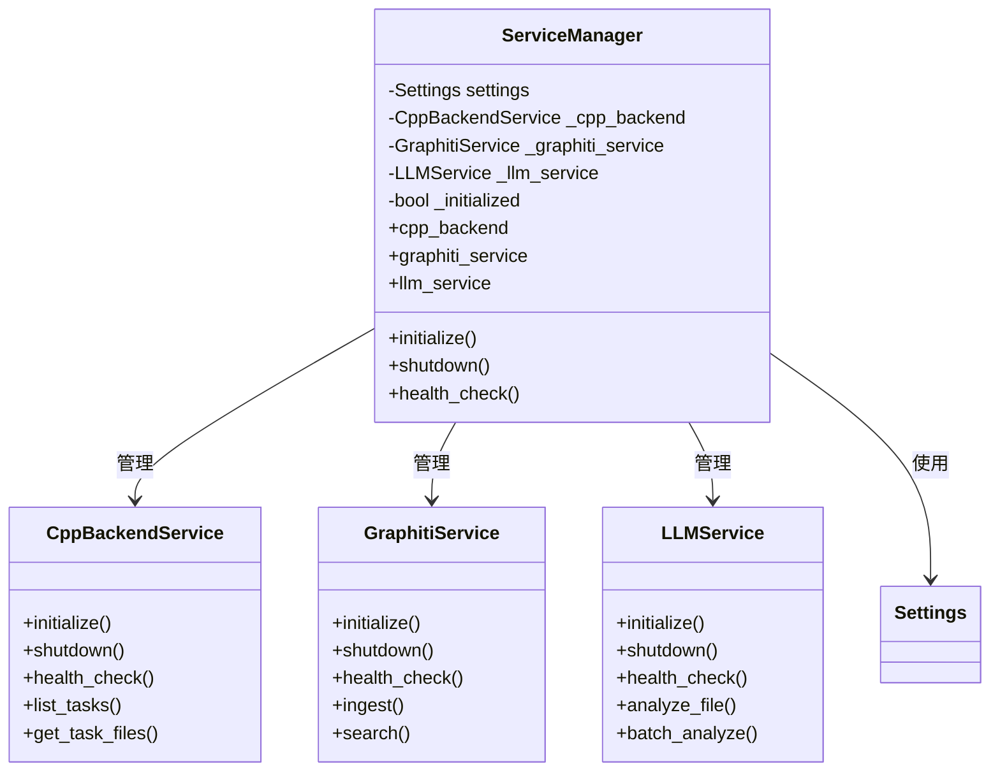
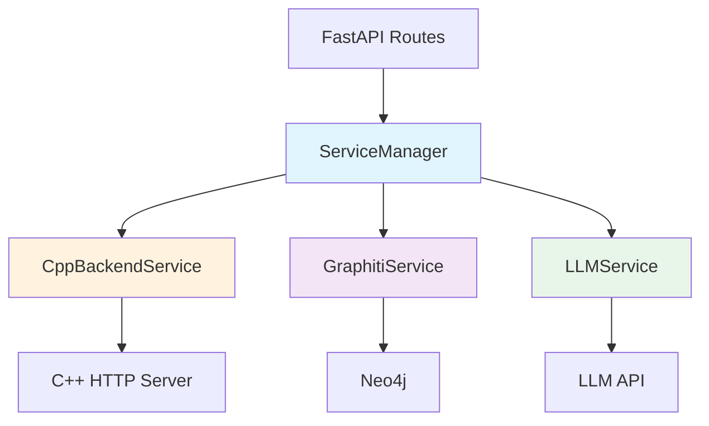

# ServiceManager 模块文档

## 1. 模块背景

### 业务背景

在 Python HTTP Server 的架构中，需要一个中心化的服务协调器来管理所有后端服务：

**核心需求**：
- **统一访问点**：提供对所有服务的单一入口
- **生命周期管理**：协调服务的初始化和关闭
- **依赖管理**：处理服务间的依赖关系
- **健康监控**：集中检查所有服务的健康状态

**解决挑战**：
- **服务耦合**：避免路由直接依赖具体服务实现
- **初始化顺序**：确保服务按正确顺序初始化
- **资源清理**：优雅关闭所有服务
- **协议扩展**：支持未来添加 gRPC、WebSocket 等协议

### 技术背景

**设计模式**：
- **Service Locator Pattern**：集中管理服务实例
- **Singleton Pattern**：全局唯一的服务管理器
- **Facade Pattern**：简化服务访问接口

**架构优势**：
```python
# ❌ 不使用 ServiceManager（紧耦合）
from .services.cpp_backend import CppBackendService
from .services.graphiti_service import GraphitiService

cpp = CppBackendService()  # 每次创建新实例
graphiti = GraphitiService()

# ✅ 使用 ServiceManager（松耦合）
from .services import get_service_manager

sm = get_service_manager()
cpp = sm.cpp_backend  # 共享实例，自动初始化
graphiti = sm.graphiti_service
```

## 2. 模块功能

### 核心功能

#### 1. 服务生命周期管理

**初始化流程**：
```python
async def initialize(self):
    """初始化所有服务。"""
    if self._initialized:
        return  # 避免重复初始化

    logger.info("Initializing services...")

    # 按顺序初始化服务
    try:
        # 1. C++ 后端服务
        from .cpp_backend import CppBackendService
        self._cpp_backend = CppBackendService(self.settings)
        await self._cpp_backend.initialize()
    except Exception as e:
        logger.warning(f"C++ backend service initialization failed: {e}")

    try:
        # 2. Graphiti 服务
        from .graphiti_service import GraphitiService
        self._graphiti_service = GraphitiService(self.settings)
        await self._graphiti_service.initialize()
    except Exception as e:
        logger.warning(f"Graphiti service initialization failed: {e}")

    try:
        # 3. LLM 服务
        from .llm_service import LLMService
        self._llm_service = LLMService(self.settings)
        await self._llm_service.initialize()
    except Exception as e:
        logger.warning(f"LLM service initialization failed: {e}")

    self._initialized = True
    logger.info("All services initialized successfully")
```

**优雅关闭**：
```python
async def shutdown(self):
    """优雅关闭所有服务。"""
    logger.info("Shutting down services...")

    # 按相反顺序关闭服务
    if self._llm_service:
        await self._llm_service.shutdown()

    if self._graphiti_service:
        await self._graphiti_service.shutdown()

    if self._cpp_backend:
        await self._cpp_backend.shutdown()

    self._initialized = False
    logger.info("All services shut down")
```

#### 2. 服务访问（懒加载）

**属性访问器**：
```python
@property
def cpp_backend(self) -> "CppBackendService":
    """获取 C++ 后端服务（懒加载）。"""
    if self._cpp_backend is None:
        from .cpp_backend import CppBackendService
        self._cpp_backend = CppBackendService(self.settings)
    return self._cpp_backend

@property
def graphiti_service(self) -> "GraphitiService":
    """获取 Graphiti 服务（懒加载）。"""
    if self._graphiti_service is None:
        from .graphiti_service import GraphitiService
        self._graphiti_service = GraphitiService(self.settings)
    return self._graphiti_service

@property
def llm_service(self) -> "LLMService":
    """获取 LLM 服务（懒加载）。"""
    if self._llm_service is None:
        from .llm_service import LLMService
        self._llm_service = LLMService(self.settings)
    return self._llm_service
```

**使用示例**：
```python
from ..services import get_service_manager

async def handle_request():
    sm = get_service_manager()

    # 首次访问时自动初始化
    cpp = sm.cpp_backend
    tasks = await cpp.list_tasks()

    # 后续访问使用缓存实例
    cpp2 = sm.cpp_backend  # 返回同一个实例
    assert cpp is cpp2  # True
```

#### 3. 健康检查

**综合健康检查**：
```python
async def health_check(self) -> dict:
    """
    检查所有服务的健康状态。

    Returns:
        {
            "overall": "healthy" | "degraded" | "unhealthy",
            "services": {
                "cpp_backend": {"status": "healthy" | "unhealthy" | "error"},
                "graphiti": {...},
                "llm": {...}
            }
        }
    """
    result = {
        "overall": "healthy",
        "services": {},
    }

    # 检查 C++ 后端
    try:
        cpp_healthy = await self.cpp_backend.health_check()
        result["services"]["cpp_backend"] = {
            "status": "healthy" if cpp_healthy else "unhealthy",
        }
        if not cpp_healthy:
            result["overall"] = "degraded"
    except Exception as e:
        result["services"]["cpp_backend"] = {
            "status": "error",
            "error": str(e),
        }
        result["overall"] = "degraded"

    # 检查 Graphiti
    try:
        graphiti_healthy = await self.graphiti_service.health_check()
        result["services"]["graphiti"] = {
            "status": "healthy" if graphiti_healthy else "unhealthy",
        }
        if not graphiti_healthy:
            result["overall"] = "degraded"
    except Exception as e:
        result["services"]["graphiti"] = {
            "status": "unavailable",
            "error": str(e),
        }

    # 检查 LLM
    try:
        llm_healthy = await self.llm_service.health_check()
        result["services"]["llm"] = {
            "status": "healthy" if llm_healthy else "unhealthy",
        }
        if not llm_healthy:
            result["overall"] = "degraded"
    except Exception as e:
        result["services"]["llm"] = {
            "status": "unavailable",
            "error": str(e),
        }

    return result
```

### 边界与限制

**功能边界**：
- ✅ 管理服务的生命周期
- ✅ 提供懒加载的服务访问
- ✅ 集中式健康检查
- ❌ 不处理服务间的通信（服务直接通信）
- ❌ 不提供服务发现（静态配置）

**已知限制**：
| 限制 | 影响 | 缓解方法 |
|------|------|----------|
| 静态服务注册 | 添加新服务需修改代码 | 实现服务注册机制 |
| 无服务依赖管理 | 初始化顺序固定 | 添加依赖图解析 |
| 单例模式 | 难以单元测试 | 支持依赖注入 |
| 无服务隔离 | 一个服务崩溃可能影响其他 | 添加进程隔离 |

**线程安全**：
- ❌ **不是线程安全的**（设计用于单线程 asyncio）
- 如需多线程访问，应使用锁或每个线程创建实例

## 3. 模块使用的库

### 依赖库清单

```python
# 标准库
import logging
from functools import lru_cache
from typing import Optional

# 项目内部
from ..config import Settings, get_settings
```

**零外部依赖**：仅使用 Python 标准库和项目内部模块。

### 架构图



### 依赖关系图



## 4. 模块实现方式

### 核心类

```python
class ServiceManager:
    """
    中心服务管理器。

    特性：
    - 单例模式（通过 get_service_manager()）
    - 懒加载服务实例
    - 优雅的错误处理
    - 生命周期管理
    """

    def __init__(self, settings: Optional[Settings] = None):
        """
        初始化服务管理器。

        Args:
            settings: 可选的设置覆盖。默认使用全局设置。
        """
        self.settings = settings or get_settings()
        self._cpp_backend: Optional["CppBackendService"] = None
        self._graphiti_service: Optional["GraphitiService"] = None
        self._llm_service: Optional["LLMService"] = None
        self._initialized = False

    # 生命周期方法
    async def initialize(self): ...
    async def shutdown(self): ...

    # 服务访问器（懒加载）
    @property
    def cpp_backend(self) -> "CppBackendService": ...
    @property
    def graphiti_service(self) -> "GraphitiService": ...
    @property
    def llm_service(self) -> "LLMService": ...

    # 健康检查
    async def health_check(self) -> dict: ...
```

### 单例模式

```python
# 全局服务管理器实例
_service_manager: Optional[ServiceManager] = None

@lru_cache()
def get_service_manager() -> ServiceManager:
    """
    获取全局服务管理器实例（单例模式）。

    使用 lru_cache 实现单例：
    - 首次调用创建实例
    - 后续调用返回缓存实例
    - 线程安全（lru_cache 保证）

    Returns:
        ServiceManager 实例。
    """
    global _service_manager
    if _service_manager is None:
        _service_manager = ServiceManager()
    return _service_manager
```

### 懒加载实现

```python
@property
def cpp_backend(self) -> "CppBackendService":
    """
    获取 C++ 后端服务（懒加载）。

    懒加载优势：
    - 延迟创建实例，节省资源
    - 避免循环导入
    - 仅在需要时初始化
    """
    if self._cpp_backend is None:
        # 延迟导入，避免启动时的循环依赖
        from .cpp_backend import CppBackendService
        self._cpp_backend = CppBackendService(self.settings)

    return self._cpp_backend
```

### 错误处理策略

```python
async def initialize(self):
    """初始化所有服务，容忍部分失败。"""
    if self._initialized:
        return

    logger.info("Initializing services...")

    # 初始化 C++ 后端（可选）
    try:
        from .cpp_backend import CppBackendService
        self._cpp_backend = CppBackendService(self.settings)
        await self._cpp_backend.initialize()
        logger.info("✓ C++ backend service initialized")
    except Exception as e:
        logger.warning(f"✗ C++ backend service initialization failed: {e}")
        # 继续初始化其他服务

    # 初始化 Graphiti（可选）
    try:
        from .graphiti_service import GraphitiService
        self._graphiti_service = GraphitiService(self.settings)
        await self._graphiti_service.initialize()
        logger.info("✓ Graphiti service initialized")
    except Exception as e:
        logger.warning(f"✗ Graphiti service initialization failed: {e}")

    # 初始化 LLM（可选）
    try:
        from .llm_service import LLMService
        self._llm_service = LLMService(self.settings)
        await self._llm_service.initialize()
        logger.info("✓ LLM service initialized")
    except Exception as e:
        logger.warning(f"✗ LLM service initialization failed: {e}")

    self._initialized = True
    logger.info("Service initialization complete")
```

## 5. API 调用

### FastAPI 集成

**依赖注入**：
```python
from fastapi import Depends
from ..services import get_service_manager, ServiceManager

# 路由中使用服务管理器
@router.get("/api/endpoint")
async def api_endpoint(
    service_manager: ServiceManager = Depends(get_service_manager)
):
    """自动注入服务管理器。"""
    cpp = service_manager.cpp_backend
    tasks = await cpp.list_tasks()

    return {
        "success": True,
        "data": tasks,
    }
```

**手动获取**：
```python
from ..services import get_service_manager

async def my_function():
    """手动获取服务管理器。"""
    sm = get_service_manager()

    # 访问服务
    llm = sm.llm_service
    result = await llm.analyze_file("task_123", "/path/to/file")

    return result
```

### 生命周期集成

**在 FastAPI lifespan 中使用**：
```python
from fastapi import FastAPI
from ..services import get_service_manager

@asynccontextmanager
async def lifespan(app: FastAPI):
    """应用生命周期管理。"""
    # 启动
    service_manager = get_service_manager()
    await service_manager.initialize()

    yield

    # 关闭
    await service_manager.shutdown()

# 创建应用
app = FastAPI(lifespan=lifespan)
```

### 健康检查集成

```python
@router.get("/health")
async def health_check(
    service_manager: ServiceManager = Depends(get_service_manager)
):
    """综合健康检查端点。"""
    health = await service_manager.health_check()

    status_code = 200
    if health["overall"] == "degraded":
        status_code = 503  # Service Unavailable
    elif health["overall"] == "unhealthy":
        status_code = 503

    return JSONResponse(
        status_code=status_code,
        content=health,
    )
```

### 服务使用示例

**C++ 后端服务**：
```python
async def get_task_files(task_id: str):
    sm = get_service_manager()
    cpp = sm.cpp_backend

    files = await cpp.get_task_files(
        task_id=task_id,
        limit=100,
    )

    return files
```

**Graphiti 服务**：
```python
async def ingest_to_graphiti(task_id: str):
    sm = get_service_manager()
    graphiti = sm.graphiti_service

    result = await graphiti.ingest_task(
        task_id=task_id,
        include_llm_descriptions=True,
    )

    return result
```

**LLM 服务**：
```python
async def analyze_with_llm(task_id: str, file_path: str):
    sm = get_service_manager()
    llm = sm.llm_service

    result = await llm.analyze_file(
        task_id=task_id,
        file_path=file_path,
        max_content_length=10000,
    )

    return result
```

### 组合服务使用

```python
async def analyze_and_ingest(task_id: str, file_path: str):
    """组合多个服务。"""
    sm = get_service_manager()

    # 1. LLM 分析
    llm_result = await sm.llm_service.analyze_file(
        task_id=task_id,
        file_path=file_path,
    )

    # 2. 摄取到知识图谱
    graphiti_result = await sm.graphiti_service.ingest_task(
        task_id=task_id,
        include_llm_descriptions=True,
    )

    return {
        "llm_analysis": llm_result,
        "graphiti_ingestion": graphiti_result,
    }
```

## 6. 二次开发

### 添加新服务

**步骤 1：创建服务类**：
```python
# services/new_service.py
class NewService:
    """新服务示例。"""

    def __init__(self, settings: Settings):
        self.settings = settings
        self._initialized = False

    async def initialize(self):
        """初始化服务。"""
        if self._initialized:
            return

        # 初始化逻辑
        self._initialized = True
        logger.info("New service initialized")

    async def shutdown(self):
        """关闭服务。"""
        self._initialized = False

    async def health_check(self) -> bool:
        """健康检查。"""
        return self._initialized

    async def do_something(self) -> dict:
        """业务逻辑。"""
        return {"result": "success"}
```

**步骤 2：集成到 ServiceManager**：
```python
# services/service_manager.py
class ServiceManager:
    def __init__(self, settings: Optional[Settings] = None):
        # ... 现有代码 ...
        self._new_service: Optional["NewService"] = None

    async def initialize(self):
        # ... 现有代码 ...

        # 初始化新服务
        try:
            from .new_service import NewService
            self._new_service = NewService(self.settings)
            await self._new_service.initialize()
        except Exception as e:
            logger.warning(f"New service initialization failed: {e}")

    async def shutdown(self):
        # ... 现有代码 ...

        if self._new_service:
            await self._new_service.shutdown()

    @property
    def new_service(self) -> "NewService":
        """获取新服务（懒加载）。"""
        if self._new_service is None:
            from .new_service import NewService
            self._new_service = NewService(self.settings)
        return self._new_service

    async def health_check(self) -> dict:
        # ... 现有代码 ...

        # 添加新服务的健康检查
        try:
            new_healthy = await self.new_service.health_check()
            result["services"]["new_service"] = {
                "status": "healthy" if new_healthy else "unhealthy",
            }
            if not new_healthy:
                result["overall"] = "degraded"
        except Exception as e:
            result["services"]["new_service"] = {
                "status": "unavailable",
                "error": str(e),
            }

        return result
```

### 添加服务依赖

```python
class ServiceManager:
    """
    支持服务依赖的管理器。

    示例：LLM 服务依赖 C++ 后端服务
    """

    async def initialize(self):
        """按依赖顺序初始化。"""
        # 第一层：无依赖的服务
        await self._cpp_backend.initialize()

        # 第二层：依赖第一层的服务
        # LLM 服务需要从 C++ 后端获取文件
        await self._llm_service.initialize(
            cpp_backend=self._cpp_backend
        )

        # 第三层：依赖前两层的
        await self._graphiti_service.initialize(
            llm_service=self._llm_service
        )
```

### 添加服务发现

```python
class ServiceManager:
    """支持动态服务注册的管理器。"""

    def __init__(self):
        self._services: Dict[str, Any] = {}
        self._dependencies: Dict[str, List[str]] = {}

    def register_service(
        self,
        name: str,
        service: Any,
        dependencies: List[str] = None
    ):
        """动态注册服务。"""
        self._services[name] = service
        self._dependencies[name] = dependencies or []

    async def initialize(self):
        """按依赖拓扑排序初始化。"""
        # 拓扑排序
        order = self._topological_sort()

        # 按顺序初始化
        for name in order:
            service = self._services[name]
            await service.initialize()

    def _topological_sort(self) -> List[str]:
        """拓扑排序服务依赖。"""
        # Kahn 算法实现
        # ...
        pass
```

## 7. 其他

### 测试

**单元测试示例**：
```python
import pytest
from httpserver.services import ServiceManager, get_service_manager
from httpserver.config import Settings

@pytest.mark.asyncio
async def test_service_manager_initialization():
    """测试服务管理器初始化。"""
    settings = Settings()
    sm = ServiceManager(settings)

    await sm.initialize()
    assert sm._initialized is True

    await sm.shutdown()
    assert sm._initialized is False

@pytest.mark.asyncio
async def test_lazy_loading():
    """测试懒加载。"""
    sm = ServiceManager()

    assert sm._cpp_backend is None

    # 首次访问创建实例
    cpp = sm.cpp_backend
    assert sm._cpp_backend is not None

    # 后续访问返回同一实例
    cpp2 = sm.cpp_backend
    assert cpp is cpp2

@pytest.mark.asyncio
async def test_health_check():
    """测试健康检查。"""
    sm = get_service_manager()
    await sm.initialize()

    health = await sm.health_check()

    assert "overall" in health
    assert "services" in health
    assert "cpp_backend" in health["services"]
```

### 配置

**环境变量**：
```env
# C++ Backend
CPP_BACKEND_URL=http://localhost:8080

# Neo4j
NEO4J_URI=neo4j://127.0.0.1:7687
NEO4J_USER=neo4j
NEO4J_PASSWORD=password

# LLM
LLM_TEXT_BASE_URL=http://localhost:1234
LLM_VISION_BASE_URL=http://localhost:1234
```

### 故障排查

| 问题 | 可能原因 | 解决方法 |
|------|----------|----------|
| 服务未初始化 | 未调用 `initialize()` | 在 lifespan 中调用 |
| 服务初始化失败 | 配置错误或依赖不可用 | 检查日志和配置 |
| 导入错误 | 循环导入 | 使用懒加载 |
| 健康检查失败 | 服务未响应 | 检查服务状态 |

### 最佳实践

1. **总是使用依赖注入**：
   ```python
   # ✅ 推荐
   async def endpoint(sm: ServiceManager = Depends(get_service_manager)):
       pass

   # ❌ 不推荐
   async def endpoint():
       sm = get_service_manager()
   ```

2. **懒加载服务**：
   - 避免在模块级别导入服务
   - 使用 `@property` 实现懒加载

3. **容忍部分失败**：
   - 使用 try-except 包裹初始化
   - 记录警告但继续运行

4. **优雅关闭**：
   - 在 shutdown 中清理资源
   - 按相反顺序关闭服务

### 相关模块

- **[CppBackendService](./CppBackendClient.md)** - C++ 后端通信
- **[GraphitiService](./GraphitiService.md)** - 知识图谱服务
- **[LLMService](./LLMService.md)** - LLM 分析服务
- **[Main](./Main.md)** - Python HTTP Server

### 参考资源

- **Service Locator Pattern**: https://en.wikipedia.org/wiki/Service_locator_pattern
- **Dependency Injection**: https://fastapi.tiangolo.com/tutorial/dependencies/
- **项目架构文档**: [../../architecture/](../../architecture/)

### 变更历史

| 版本 | 日期 | 变更内容 | 作者 |
|------|------|----------|------|
| 1.0.0 | 2026-03-16 | 初始版本 | ymj68520 |

---

**最后更新**: 2026-03-16
**维护者**: ymj68520
