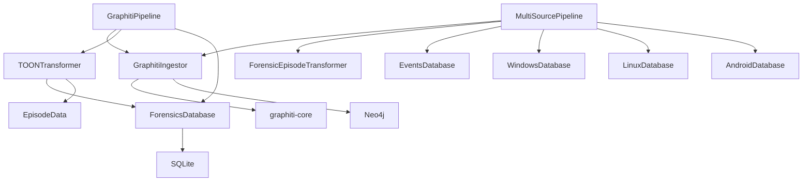
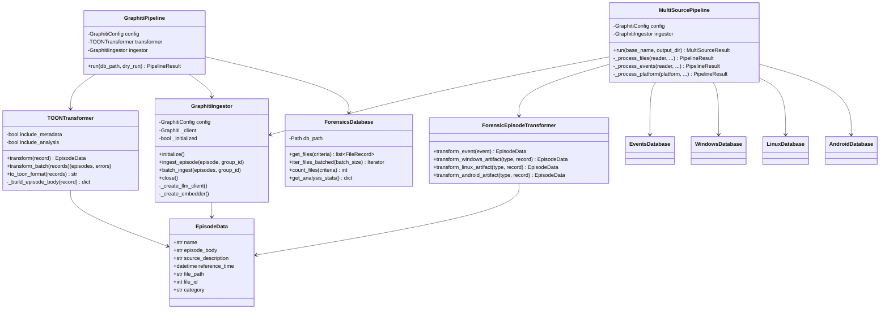
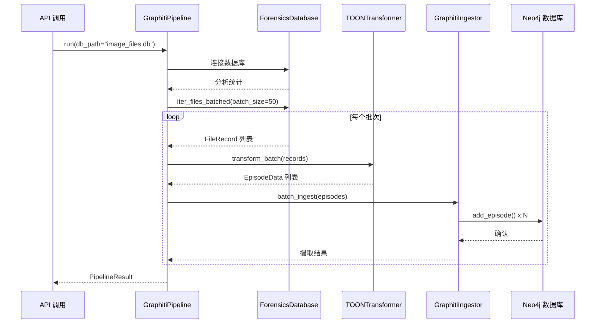
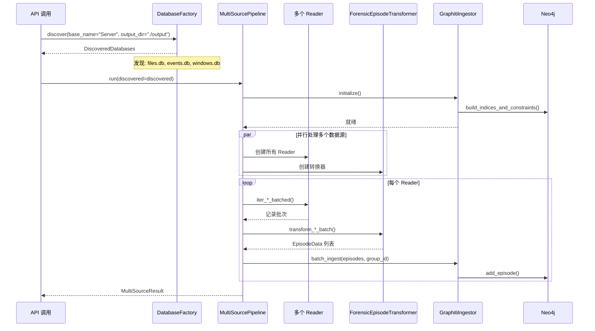
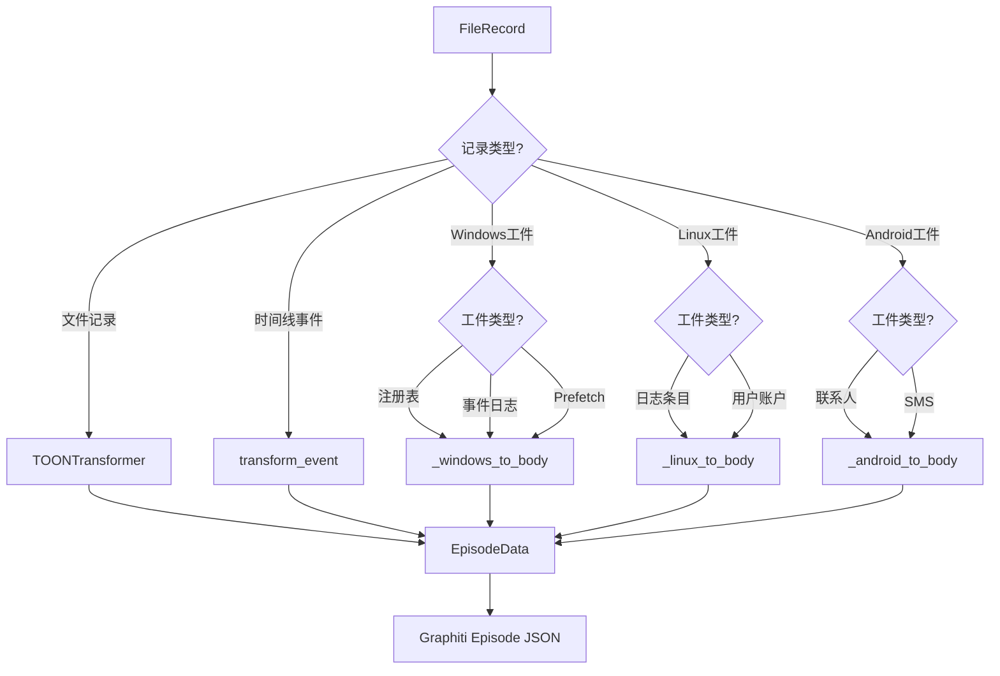

# Graphiti 知识图谱集成模块文档

## 1. 模块背景

### 业务背景

在数字取证分析中，传统的数据库查询方式存在以下局限性：

1. **数据孤岛问题**：文件、事件、平台特定数据（Windows/Linux/Android）分散在不同数据库中
2. **关系挖掘困难**：难以发现跨数据源的隐式关联（如用户、文件、时间、设备之间的关系）
3. **语义理解有限**：基于关键词的搜索无法理解取证数据的语义含义
4. **分析效率低**：需要人工在多个数据库之间切换查询，耗时且容易遗漏

知识图谱技术可以解决这些问题：

- **统一数据建模**：将多源数据映射为统一的实体-关系图
- **关系推理**：自动发现实体之间的隐式关联
- **语义搜索**：支持自然语言查询，理解取证场景的语义
- **可视化分析**：图形化展示证据链和关系网络

### 技术背景

**Graphiti 框架**：
- 由 Baxter AI 开发的知识图谱构建框架
- 基于 Neo4j 图数据库存储
- 使用 LLM 进行实体提取和关系发现
- 支持 Episode（事件序列）的数据组织模式
- 提供向量相似度和重排序（Reranker）能力

**Neo4j 图数据库**：
- 原生图存储，高效遍历关系
- 支持 Cypher 查询语言
- ACID 事务保证数据一致性
- 内建向量索引支持

**本项目集成架构**：
- Python 服务作为数据摄取层
- 从 SQLite 数据库读取取证数据
- 转换为 Graphiti Episode 格式
- 批量摄取到 Neo4j 知识图谱
- 支持多数据源聚合（文件、事件、平台数据）

---

## 2. 模块功能

### 核心功能

#### 1. 数据库读取（database_reader）

- **多数据源支持**：读取 `_files.db`、`_events.db`、`_windows.db`、`_linux.db`、`_android.db`
- **批量迭代**：支持分批读取，避免内存溢出
- **智能过滤**：可按类别、LLM 分析状态、大小范围筛选
- **自动发现**：从镜像基础名称自动发现所有相关数据库

#### 2. 数据转换（toon_transformer）

- **EpisodeData 结构**：将数据库记录转换为 Graphiti Episode
- **多格式支持**：
  - 文件记录（含 LLM 分析）
  - 时间线事件
  - Windows 工件（注册表、事件日志、Prefetch 等）
  - Linux 工件（日志、用户、Shell 历史）
  - Android 工件（联系人、SMS、通话记录、应用数据）
- **TOON 导出**：可选的文本格式输出，兼容 C++ TOONExporter

#### 3. 图谱摄取（graphiti_ingestor）

- **批处理摄取**：高效批量添加 Episode 到知识图谱
- **重试机制**：可配置重试次数和延迟
- **进度跟踪**：支持进度回调函数
- **错误处理**：记录失败项，返回详细结果统计
- **本地 LLM 支持**：可使用本地 LLM（如 LM Studio）进行实体提取

#### 4. 管道编排（pipeline）

- **单源管道（GraphitiPipeline）**：处理单个数据库（默认 `_files.db`）
- **多源管道（MultiSourcePipeline）**：聚合所有数据源到统一知识图谱
- **懒加载初始化**：按需创建 Neo4j 连接
- **Dry-run 模式**：验证转换逻辑而不实际摄取
- **命令行接口**：支持直接从终端运行管道

### 边界与限制

| 限制项 | 说明 | 解决方案 |
|--------|------|----------|
| **LLM 依赖** | 需要配置 LLM 服务进行实体提取 | 支持本地 LLM，无需外部 API |
| **Neo4j 要求** | 需要运行 Neo4j 数据库实例 | 使用 Docker 快速部署 |
| **摄取速度** | 大数据量摄取较慢（受 LLM 处理速度限制） | 批量处理，可配置批次大小 |
| **内存占用** | 批处理时需要缓存多批次数据 | 调整 `batch_size` 参数 |
| **关系准确性** | LLM 提取的关系可能存在误判 | 使用 Graphiti 的 Reranker 优化 |

---

## 3. 模块使用的库

### 依赖库清单

| 库名称 | 版本要求 | 用途 | 安装方式 |
|--------|----------|------|----------|
| **graphiti-core** | 最新 | Graphiti SDK，知识图谱核心 | `pip install graphiti-core` |
| **neo4j** | 5.x+ | Neo4j Python 驱动 | `pip install neo4j` |
| **sqlite3** | 内置 | SQLite 数据库读取 | 标准库 |
| **asyncio** | 内置 | 异步任务编排 | 标准库 |
| **pydantic** | 2.x+ | 数据验证 | `pip install pydantic` |

### 依赖关系图



### Neo4j 数据库架构

```cypher
// Graphiti 自动创建的节点类型
(:Episode)
(:Entity)
(:Community)

// 示例：取证数据映射后的节点
(:File {name: "document.docx", path: "/path/to/file"})
(:Event {type: "CREATED", timestamp: 1234567890})
(:User {username: "analyst"})
(:Process {name: "winword.exe"})
(:Device {vendor_id: "0x0781", product_id: "0x5580"})

// 关系类型
(:File)-[:RELATES_TO]->(:Event)
(:Event)-[:INVOLVES]->(:User)
(:File)-[:OPENED_BY]->(:Process)
(:Device)-[:CONNECTED_TO]->(:System)
```

---

## 4. 模块实现方式

### 架构设计



### 核心类说明

#### EpisodeData 数据结构

```python
@dataclass
class EpisodeData:
    """Graphiti Episode 数据结构"""
    name: str                      # Episode 名称（如 "document:report.docx"）
    episode_body: str              # JSON 格式的 Episode 内容
    source_description: str        # 来源描述（如 "forensics_file_analysis"）
    reference_time: datetime       # 参考时间戳
    file_path: str                 # 原始文件路径
    file_id: int                   # 文件 ID
    category: Optional[str]        # 可选分类
```

#### GraphitiIngestor

```python
class GraphitiIngestor:
    """Graphiti 知识图谱摄取器"""

    def __init__(self, config: GraphitiConfig, graphiti_client: Optional[Graphiti] = None)
    async def initialize(self) -> None
    async def close(self) -> None

    async def ingest_episode(
        self, episode: EpisodeData, group_id: Optional[str] = None
    ) -> bool

    async def batch_ingest(
        self,
        episodes: list[EpisodeData],
        group_id: Optional[str] = None,
        progress_callback: Optional[callable] = None,
    ) -> IngestionResult
```

#### TOONTransformer

```python
class TOONTransformer:
    """文件记录转 Episode 转换器"""

    def __init__(
        self,
        include_metadata: bool = True,
        include_analysis: bool = True,
        source_description: str = "forensics_file_analysis",
    )

    def transform(self, record: FileRecord) -> EpisodeData
    def transform_batch(self, records: list[FileRecord], skip_errors: bool = True) -> tuple
    def to_toon_format(self, records: list[FileRecord]) -> str
```

#### ForensicEpisodeTransformer

```python
class ForensicEpisodeTransformer:
    """扩展转换器，支持所有取证数据源"""

    # 时间线事件
    def transform_event(self, event) -> EpisodeData
    def transform_events_batch(self, events: list, skip_errors: bool = True) -> tuple

    # Windows 工件
    def transform_windows_artifact(self, artifact_type: str, record) -> EpisodeData
    def transform_windows_batch(self, artifact_type: str, records: list, skip_errors: bool = True) -> tuple

    # Linux 工件
    def transform_linux_artifact(self, artifact_type: str, record) -> EpisodeData
    def transform_linux_batch(self, artifact_type: str, records: list, skip_errors: bool = True) -> tuple

    # Android 工件
    def transform_android_artifact(self, artifact_type: str, record) -> EpisodeData
    def transform_android_batch(self, artifact_type: str, records: list, skip_errors: bool = True) -> tuple
```

#### GraphitiPipeline

```python
class GraphitiPipeline:
    """单源管道：处理单个数据库"""

    def __init__(self, config: GraphitiConfig)

    async def run(
        self,
        db_path: Optional[str] = None,
        dry_run: bool = False,
        progress_callback: Optional[callable] = None,
    ) -> PipelineResult
```

#### MultiSourcePipeline

```python
class MultiSourcePipeline:
    """多源管道：聚合所有数据源"""

    def __init__(self, config: GraphitiConfig)

    async def run(
        self,
        base_name: Optional[str] = None,
        output_dir: Optional[str] = None,
        any_db_path: Optional[str] = None,
        group_id: Optional[str] = None,
        dry_run: bool = False,
        progress_callback: Optional[callable] = None,
    ) -> MultiSourceResult
```

### 关键流程

#### 单源摄取流程



#### 多源摄取流程



#### 数据转换流程



### 数据结构

#### FileRecord 结构

```python
@dataclass
class FileRecord:
    # 核心文件元数据
    id: int
    inode: int
    name: str
    path: str
    size: int
    extension: str
    category: str
    file_type: str
    mtime: int          # Unix 时间戳
    ctime: int
    is_deleted: bool
    md5: str

    # LLM 分析字段
    llm_summary: Optional[str]
    llm_description: Optional[str]
    llm_keywords: Optional[str]
    llm_analyzed_at: Optional[int]
    llm_model_used: Optional[str]

    @property
    def has_llm_analysis(self) -> bool

    @property
    def keywords_list(self) -> list[str]
```

#### Episode JSON 结构

```json
{
  "name": "document:report.docx",
  "episode_body": "{
    \"file_name\": \"report.docx\",
    \"file_path\": \"/home/user/Documents/report.docx\",
    \"category\": \"documents\",
    \"file_extension\": \".docx\",
    \"metadata\": {
      \"size_bytes\": 24576,
      \"md5_hash\": \"a1b2c3d4e5f6...\",
      \"is_deleted\": false,
      \"file_type\": \"Microsoft Word Document\",
      \"modified_at\": \"2026-03-15T10:30:00Z\",
      \"created_at\": \"2026-03-14T14:20:00Z\"
    },
    \"analysis\": {
      \"summary\": \"Quarterly financial report with charts and tables\",
      \"description\": \"A detailed quarterly financial report containing revenue breakdown, expense analysis, and projections for Q1 2026. Includes multiple charts and data tables.\",
      \"keywords\": [\"finance\", \"quarterly\", \"report\", \"Q1\", \"revenue\", \"charts\"],
      \"model\": \"gpt-4\"
    }
  }",
  "source_description": "forensics_file_analysis",
  "reference_time": "2026-03-15T10:30:00Z",
  "file_path": "/home/user/Documents/report.docx",
  "file_id": 12345,
  "category": "documents"
}
```

---

## 5. API 调用

### Python API

#### 基本使用

```python
# 示例 1: 使用 GraphitiPipeline 处理文件数据库
import asyncio
from graphiti_integration.pipeline import GraphitiPipeline, run_pipeline
from graphiti_integration.config import GraphitiConfig

async def main():
    # 方法 1: 使用便捷函数
    result = await run_pipeline(
        db_path="/path/to/image_files.db",
        neo4j_uri="neo4j://localhost:7687",
        neo4j_user="neo4j",
        neo4j_password="password",
        batch_size=50,
        dry_run=False,  # 设为 True 只转换不摄取
        filter_analyzed_only=True,  # 只摄取有 LLM 分析的文件
    )

    print(result.summary())
    # 输出:
    # Pipeline Result:
    #   Total files: 1523
    #   Transformed: 1523
    #   Ingested: 1520
    #   Failed: 3
    #   Success rate: 99.8%
    #   Duration: 245.32s

asyncio.run(main())
```

```python
# 示例 2: 使用 MultiSourcePipeline 处理所有数据源
import asyncio
from graphiti_integration.pipeline import MultiSourcePipeline, run_multi_source_pipeline

async def main():
    result = await run_multi_source_pipeline(
        base_name="Server",  # 镜像基础名称
        output_dir="/path/to/output",  # 数据库所在目录
        group_id="forensics_case_001",  # 用于隔离不同案例
        neo4j_uri="neo4j://localhost:7687",
        neo4j_user="neo4j",
        neo4j_password="password",
        batch_size=100,
        dry_run=False,
    )

    print(result.summary())
    # 输出:
    # Multi-Source Pipeline Result:
    #   Sources processed: 4
    #   Total episodes: 8542
    #   Total ingested: 8518
    #   Total failed:   24
    #   Duration: 845.67s
    #   [files] ingested=4521, failed=12
    #   [events] ingested=2134, failed=5
    #   [windows] ingested=1234, failed=4
    #   [android] ingested=629, failed=3

asyncio.run(main())
```

```python
# 示例 3: 使用任何数据库路径自动发现
async def main():
    result = await run_multi_source_pipeline(
        any_db_path="/path/to/output/Server_files.db",  # 从任一数据库推断
        # 等价于设置 base_name="Server", output_dir="/path/to/output"
        group_id="case_001",
    )

    discovered_count = len(result.source_results)
    print(f"Processed {discovered_count} data sources")

asyncio.run(main())
```

```python
# 示例 4: 直接使用 Pipeline 类进行更多控制
from graphiti_integration.config import GraphitiConfig
from graphiti_integration.pipeline import GraphitiPipeline

async def main():
    # 加载配置
    config = GraphitiConfig.from_env()
    config.batch_size = 25
    config.filter_analyzed_only = True
    config.group_id = "my_case"

    # 创建管道
    pipeline = GraphitiPipeline(config)

    # 定义进度回调
    def progress_callback(phase, current, total):
        percentage = (current / total) * 100
        print(f"[{phase}] {current}/{total} ({percentage:.1f}%)")

    # 运行管道
    result = await pipeline.run(
        db_path="/path/to/image_files.db",
        dry_run=False,
        progress_callback=progress_callback,
    )

    # 检查错误
    if result.ingestion_errors:
        print(f"Encountered {len(result.ingestion_errors)} errors:")
        for error in result.ingestion_errors[:5]:  # 打印前 5 个
            print(f"  - {error['file_path']}: {error['error']}")

asyncio.run(main())
```

```python
# 示例 5: Dry-run 模式验证转换
async def main():
    config = GraphitiConfig.from_env()
    pipeline = GraphitiPipeline(config)

    # Dry-run 只转换不摄取
    result = await pipeline.run(
        db_path="/path/to/image_files.db",
        dry_run=True,
    )

    print(f"Would ingest {result.ingested} episodes")
    print(f"Transformation errors: {len(result.transformation_errors)}")

asyncio.run(main())
```

```python
# 示例 6: 直接使用 DatabaseReader 和 Transformer
from graphiti_integration.database_reader import ForensicsDatabase
from graphiti_integration.toon_transformer import TOONTransformer

async def main():
    # 读取数据库
    db = ForensicsDatabase("/path/to/image_files.db")

    # 获取统计
    stats = db.get_analysis_stats()
    print(f"Total files: {stats['total_files']}")
    print(f"Analyzed files: {stats['analyzed_files']}")
    print(f"Analysis percentage: {stats['analysis_percentage']:.1f}%")

    # 创建转换器
    transformer = TOONTransformer(
        include_metadata=True,
        include_analysis=True,
    )

    # 批量转换
    episodes = []
    for batch in db.iter_files_batched(batch_size=100, analyzed_only=True):
        batch_episodes, errors = transformer.transform_batch(batch)
        episodes.extend(batch_episodes)
        if errors:
            print(f"Transformation errors: {len(errors)}")

    print(f"Created {len(episodes)} episodes")

    # 可选：导出为 TOON 格式
    toon_text = transformer.to_toon_format(batch)
    print(toon_text[:500])  # 打印前 500 字符

asyncio.run(main())
```

```python
# 示例 7: 使用 ForensicEpisodeTransformer 转换平台数据
from graphiti_integration.database_reader import WindowsDatabase
from graphiti_integration.toon_transformer import ForensicEpisodeTransformer

async def main():
    # 读取 Windows 数据库
    win_db = WindowsDatabase("/path/to/image_windows.db")

    # 创建取证转换器
    transformer = ForensicEpisodeTransformer()

    # 转换注册表值
    registry_episodes = []
    for batch in win_db.get_registry_values_batched(batch_size=50):
        episodes, errors = transformer.transform_windows_batch("registry_values", batch)
        registry_episodes.extend(episodes)

    print(f"Transformed {len(registry_episodes)} registry episodes")

    # 转换事件日志
    event_episodes = []
    for batch in win_db.get_event_logs_batched(batch_size=50):
        episodes, errors = transformer.transform_windows_batch("event_logs", batch)
        event_episodes.extend(episodes)

    print(f"Transformed {len(event_episodes)} event log episodes")

asyncio.run(main())
```

```python
# 示例 8: 使用上下文管理器自动清理
async def main():
    config = GraphitiConfig.from_env()

    # 使用 async with 自动初始化和清理
    async with GraphitiPipeline(config) as pipeline:
        result = await pipeline.run(db_path="/path/to/image_files.db")
        print(result.summary())

    # 自动调用 pipeline.cleanup()

asyncio.run(main())
```

### 命令行 API

#### Pipeline 模块命令行

```bash
# Dry-run 模式验证转换
python -m graphiti_integration.pipeline \
    --db-path ./data/image_files.db \
    --dry-run

# 完整摄取
python -m graphiti_integration.pipeline \
    --db-path ./data/image_files.db \
    --neo4j-uri neo4j://localhost:7687 \
    --neo4j-user neo4j \
    --neo4j-password yourpassword \
    --batch-size 50 \
    --group-id forensics_case_001

# 只处理已分析的文件
python -m graphiti_integration.pipeline \
    --db-path ./data/image_files.db \
    --analyzed-only \
    --neo4j-uri neo4j://localhost:7687

# 启用详细日志
python -m graphiti_integration.pipeline \
    --db-path ./data/image_files.db \
    --neo4j-uri neo4j://localhost:7687 \
    --verbose
```

### REST API

通过 Python FastAPI 服务暴露的 Graphiti 端点：

```bash
# 摄取任务数据到知识图谱
curl -X POST http://localhost:8090/api/graphiti/ingest \
  -H "Content-Type: application/json" \
  -d '{
    "task_id": "task_123",
    "group_id": "case_001",
    "include_llm_descriptions": true,
    "batch_size": 50
  }'

# 响应示例
{
  "status": "processing",
  "ingestion_id": "ingest_abc123",
  "estimated_episodes": 1523,
  "message": "Started ingestion of 1523 files"
}

# 搜索知识图谱
curl -X POST http://localhost:8090/api/graphiti/search \
  -H "Content-Type: application/json" \
  -d '{
    "query": "financial documents containing quarterly reports",
    "limit": 50,
    "group_id": "case_001"
  }'

# 响应示例
{
  "results": [
    {
      "entity_name": "report.docx",
      "entity_type": "File",
      "relevance_score": 0.95,
      "properties": {
        "path": "/home/user/Documents/report.docx",
        "category": "documents",
        "summary": "Quarterly financial report with charts"
      }
    },
    ...
  ],
  "total": 15
}

# 获取实体信息
curl http://localhost:8090/api/graphiti/entities?group_id=case_001&limit=100

# 响应示例
{
  "entities": [
    {
      "name": "report.docx",
      "type": "File",
      "community": "documents",
      "degree": 12
    },
    {
      "name": "winword.exe",
      "type": "Process",
      "community": "software",
      "degree": 45
    },
    ...
  ],
  "total": 1523
}

# 获取关系
curl http://localhost:8090/api/graphiti/relationships?group_id=case_001&limit=100

# 响应示例
{
  "relationships": [
    {
      "source": "report.docx",
      "target": "winword.exe",
      "type": "OPENED_BY",
      "weight": 0.92
    },
    {
      "source": "report.docx",
      "target": "user@domain.com",
      "type": "OWNED_BY",
      "weight": 0.88
    },
    ...
  ],
  "total": 4521
}

# 摄取状态
curl http://localhost:8090/api/graphiti/status?ingestion_id=ingest_abc123

# 响应示例
{
  "ingestion_id": "ingest_abc123",
  "status": "completed",
  "progress": {
    "total": 1523,
    "processed": 1523,
    "successful": 1520,
    "failed": 3
  },
  "started_at": "2026-03-16T10:00:00Z",
  "completed_at": "2026-03-16T14:05:32Z"
}
```

---

## 6. 二次开发

### 扩展点

#### 1. 自定义 Transformer

扩展 `TOONTransformer` 或 `ForensicEpisodeTransformer` 以支持新的数据类型。

#### 2. 自定义 Episode 格式

修改 `_build_episode_body` 方法以定制 JSON 结构。

#### 3. 批处理优化

调整 `batch_size`、`max_retries`、`retry_delay` 参数优化性能。

#### 4. 进度回调

实现自定义 `progress_callback` 集成到监控系统。

### 添加新数据源的步骤

#### 步骤 1: 创建 DatabaseReader 子类

```python
from graphiti_integration.database_reader import _BaseForensicsReader

class CustomDatabase(_BaseForensicsReader):
    """自定义数据源数据库读取器"""

    def get_custom_artifacts(self, limit=None, offset=0):
        """读取自定义工件"""
        rows = self._query_table("custom_artifacts", limit=limit, offset=offset)
        return [
            CustomArtifact(
                id=r["id"],
                field1=r["field1"],
                field2=r["field2"],
            )
            for r in rows
        ]

    def get_custom_artifacts_batched(self, batch_size=100):
        """批量迭代器"""
        offset = 0
        while True:
            batch = self.get_custom_artifacts(limit=batch_size, offset=offset)
            if not batch:
                break
            yield batch
            offset += len(batch)
```

#### 步骤 2: 扩展 ForensicEpisodeTransformer

```python
from graphiti_integration.toon_transformer import ForensicEpisodeTransformer

class ExtendedTransformer(ForensicEpisodeTransformer):

    def transform_custom_artifact(self, record) -> EpisodeData:
        """转换自定义工件为 Episode"""
        body = {
            "field1": record.field1,
            "field2": record.field2,
            # 添加其他字段
        }

        ref_time = self._extract_timestamp(record, ["timestamp", "created_at"])

        return EpisodeData(
            name=f"custom:{record.field1}",
            episode_body=json.dumps(body, ensure_ascii=False),
            source_description=f"{self.source_description}:custom",
            reference_time=ref_time,
            file_path=getattr(record, "file_path", ""),
            file_id=record.id,
            category="custom_artifact",
        )

    def transform_custom_batch(self, records, skip_errors=True):
        """批量转换"""
        episodes, errors = [], []
        for r in records:
            try:
                episodes.append(self.transform_custom_artifact(r))
            except Exception as e:
                if skip_errors:
                    errors.append((r, e))
                else:
                    raise
        return episodes, errors
```

#### 步骤 3: 集成到 MultiSourcePipeline

```python
# 在 MultiSourcePipeline._process_platform 中添加处理逻辑
async def _process_platform(self, platform, reader, transformer, ...):
    if platform == "custom":
        res = PipelineResult(started_at=datetime.now())

        for batch in reader.get_custom_artifacts_batched(batch_size=self.config.batch_size):
            episodes, errors = transformer.transform_custom_batch(batch)
            res.total_files += len(batch)
            res.transformed += len(episodes)
            res.failed += len(errors)

            if not dry_run and episodes and self.ingestor:
                ingestion_result = await self.ingestor.batch_ingest(episodes, group_id=group_id)
                res.ingested += ingestion_result.successful
                res.failed += ingestion_result.failed

        res.completed_at = datetime.now()
        return res
```

### 实现高级功能

#### 1. 自定义实体提取提示

```python
from graphiti_core.llm_client.config import LLMConfig

class CustomIngestor(GraphitiIngestor):
    """自定义摄取器，使用定制提示"""

    def _create_llm_client(self) -> OpenAIGenericClient:
        llm_config = LLMConfig(
            api_key=self.config.llm_api_key,
            model=self.config.llm_model,
            base_url=self.config.llm_base_url,
        )

        # 自定义提示模板
        custom_system_prompt = """
        You are a digital forensics expert specializing in extracting entities from file metadata.
        Focus on: user identities, file types, relationships, timestamps, and suspicious patterns.
        Always extract: people, organizations, locations, dates, and technical artifacts.
        """

        return OpenAIGenericClient(config=llm_config, system_prompt=custom_system_prompt)
```

#### 2. 增量摄取

```python
class IncrementalPipeline(GraphitiPipeline):
    """增量摄取管道，只处理新数据"""

    async def run(self, db_path, last_ingested_time=None, **kwargs):
        result = PipelineResult(started_at=datetime.now())

        database = ForensicsDatabase(db_path)

        # 获取上次摄取后的新文件
        where_clause = ""
        params = []
        if last_ingested_time:
            where_clause = "WHERE llm_analyzed_at > ?"
            params = [last_ingested_time]

        query = f"""
            SELECT COUNT(*) FROM files {where_clause}
        """

        with database.connect() as conn:
            cursor = conn.execute(query, params)
            result.total_files = cursor.fetchone()[0]

        # 只处理新文件
        # ... 其余逻辑

        result.completed_at = datetime.now()
        return result
```

#### 3. 多语言支持

```python
class MultiLanguageTransformer(TOONTransformer):
    """多语言转换器，支持不同语言的 Episode"""

    def transform(self, record: FileRecord, language: str = "en") -> EpisodeData:
        body = self._build_episode_body(record)

        # 添加语言元数据
        body["metadata"]["language"] = language
        body["metadata"]["original_language"] = self._detect_language(record)

        # 翻译关键字段
        if language != "en":
            body["analysis"]["summary"] = self._translate(
                record.llm_summary, target_lang=language
            )

        return EpisodeData(...)

    def _detect_language(self, record: FileRecord) -> str:
        """检测文件内容的语言"""
        # 实现语言检测逻辑
        return "en"
```

### 代码示例

#### 完整的扩展示例

```python
# custom_integration.py
from graphiti_integration.pipeline import MultiSourcePipeline
from graphiti_integration.config import GraphitiConfig
from graphiti_integration.database_reader import _BaseForensicsReader, DiscoveredDatabases
from graphiti_integration.toon_transformer import ForensicEpisodeTransformer, EpisodeData
from graphiti_integration.graphiti_ingestor import GraphitiIngestor
import json
from datetime import datetime, timezone
from typing import Optional
import asyncio

# -------------------------------------------------------------------------
# 1. 自定义数据源：网络流量日志
# -------------------------------------------------------------------------

class NetworkTrafficDatabase(_BaseForensicsReader):
    """网络流量数据库读取器"""

    def get_traffic_logs(self, limit=None, offset=0):
        """读取网络流量日志"""
        rows = self._query_table("traffic_logs", limit=limit, offset=offset)
        return [
            NetworkLog(
                id=r["id"],
                timestamp=r["timestamp"],
                src_ip=r["src_ip"],
                dst_ip=r["dst_ip"],
                src_port=r["src_port"],
                dst_port=r["dst_port"],
                protocol=r["protocol"],
                bytes_sent=r["bytes_sent"],
                bytes_received=r["bytes_received"],
            )
            for r in rows
        ]

    def get_traffic_logs_batched(self, batch_size=100):
        """批量迭代"""
        offset = 0
        while True:
            batch = self.get_traffic_logs(limit=batch_size, offset=offset)
            if not batch:
                break
            yield batch
            offset += len(batch)

# -------------------------------------------------------------------------
# 2. 自定义转换器：网络流量 Episode
# -------------------------------------------------------------------------

class NetworkTrafficTransformer(ForensicEpisodeTransformer):

    def transform_network_log(self, log) -> EpisodeData:
        """转换网络日志为 Episode"""
        body = {
            "timestamp": log.timestamp,
            "source": {
                "ip": log.src_ip,
                "port": log.src_port,
            },
            "destination": {
                "ip": log.dst_ip,
                "port": log.dst_port,
            },
            "protocol": log.protocol,
            "traffic": {
                "bytes_sent": log.bytes_sent,
                "bytes_received": log.bytes_received,
                "total_bytes": log.bytes_sent + log.bytes_received,
            },
        }

        # 添加安全分析
        body["security_analysis"] = self._analyze_traffic(log)

        ref_time = datetime.fromtimestamp(log.timestamp, tz=timezone.utc)

        return EpisodeData(
            name=f"network:{log.protocol}:{log.src_ip}:{log.dst_ip}",
            episode_body=json.dumps(body, ensure_ascii=False),
            source_description=f"{self.source_description}:network_traffic",
            reference_time=ref_time,
            file_path="",
            file_id=log.id,
            category="network_traffic",
        )

    def _analyze_traffic(self, log):
        """分析网络流量的安全特征"""
        analysis = {}

        # 检测已知恶意端口
        suspicious_ports = [4444, 5555, 6666, 31337]
        if log.dst_port in suspicious_ports:
            analysis["suspicious_port"] = True

        # 检测大流量传输
        if log.bytes_sent + log.bytes_received > 100_000_000:  # 100MB
            analysis["large_transfer"] = True

        # 检测非标准协议
        if log.protocol not in ["TCP", "UDP", "ICMP"]:
            analysis["unusual_protocol"] = True

        return analysis

    def transform_network_batch(self, logs, skip_errors=True):
        """批量转换"""
        episodes, errors = [], []
        for log in logs:
            try:
                episodes.append(self.transform_network_log(log))
            except Exception as e:
                if skip_errors:
                    errors.append((log, e))
                else:
                    raise
        return episodes, errors

# -------------------------------------------------------------------------
# 3. 扩展多源管道：集成网络流量
# -------------------------------------------------------------------------

class ExtendedMultiSourcePipeline(MultiSourcePipeline):

    async def run(self, *args, **kwargs):
        """运行扩展的多源管道"""
        result = await super().run(*args, **kwargs)

        # 处理网络流量数据库
        if "network" in kwargs.get("sources", []):
            from dataclasses import dataclass
            from graphiti_integration.pipeline import PipelineResult

            @dataclass
            class NetworkResult:
                transformed: int = 0
                ingested: int = 0
                failed: int = 0

            net_result = await self._process_network(
                kwargs.get("network_db_path"),
                kwargs.get("group_id"),
                kwargs.get("dry_run", False),
            )

            result.source_results["network"] = net_result
            result.total_episodes += net_result.transformed
            result.total_ingested += net_result.ingested
            result.total_failed += net_result.failed

        return result

    async def _process_network(self, db_path, group_id, dry_run):
        """处理网络流量数据库"""
        from graphiti_integration.pipeline import PipelineResult

        res = PipelineResult(started_at=datetime.now())

        net_db = NetworkTrafficDatabase(db_path)
        transformer = NetworkTrafficTransformer()

        for batch in net_db.get_traffic_logs_batched(batch_size=self.config.batch_size):
            episodes, errors = transformer.transform_network_batch(batch)
            res.total_files += len(batch)
            res.transformed += len(episodes)
            res.failed += len(errors)

            if not dry_run and episodes and self.ingestor:
                ingest_result = await self.ingestor.batch_ingest(episodes, group_id=group_id)
                res.ingested += ingest_result.successful
                res.failed += ingest_result.failed
            elif dry_run:
                res.ingested += len(episodes)

        res.completed_at = datetime.now()
        return res

# -------------------------------------------------------------------------
# 4. 使用示例
# -------------------------------------------------------------------------

async def main():
    config = GraphitiConfig.from_env()

    # 创建扩展管道
    pipeline = ExtendedMultiSourcePipeline(config)

    # 运行管道，包含网络流量
    result = await pipeline.run(
        base_name="Server",
        output_dir="/path/to/output",
        sources=["files", "events", "windows", "network"],  # 指定数据源
        network_db_path="/path/to/network_traffic.db",
        group_id="case_001",
        dry_run=False,
    )

    print(result.summary())
    # Multi-Source Pipeline Result:
    #   Sources processed: 4
    #   [files] ingested=4521, failed=12
    #   [events] ingested=2134, failed=5
    #   [windows] ingested=1234, failed=4
    #   [network] ingested=3456, failed=8

if __name__ == "__main__":
    asyncio.run(main())
```

---

## 7. 其他

### 测试

#### 单元测试示例

```python
import pytest
from graphiti_integration.database_reader import FileRecord
from graphiti_integration.toon_transformer import TOONTransformer
from datetime import datetime

def test_transformer_single_record():
    """测试单个记录转换"""
    record = FileRecord(
        id=1,
        inode=12345,
        name="test.txt",
        path="/home/user/test.txt",
        size=1024,
        extension=".txt",
        category="documents",
        file_type="Plain Text",
        mtime=1678886400,
        ctime=1678886400,
        is_deleted=False,
        md5="abc123",
        llm_summary="A test document",
        llm_description="This is a test file for unit testing",
        llm_keywords="test,unit,document",
        llm_analyzed_at=1678886400,
        llm_model_used="gpt-4",
    )

    transformer = TOONTransformer()
    episode = transformer.transform(record)

    assert episode.name == "documents:test.txt"
    assert episode.category == "documents"
    assert episode.file_path == "/home/user/test.txt"
    assert episode.reference_time.timestamp() == 1678886400

    # 验证 JSON 内容
    import json
    body = json.loads(episode.episode_body)
    assert body["file_name"] == "test.txt"
    assert body["analysis"]["summary"] == "A test document"
    assert "test" in body["analysis"]["keywords"]

def test_transformer_batch_with_errors():
    """测试批量转换和错误处理"""
    records = [
        FileRecord(
            id=1, inode=1, name="valid.txt", path="/valid.txt",
            size=100, extension=".txt", category="documents",
            file_type="Text", mtime=0, ctime=0, is_deleted=False,
            md5="abc123",
        ),
        FileRecord(
            id=2, inode=2, name=None, path=None,  # 无效记录
            size=0, extension="", category="",
            file_type="", mtime=0, ctime=0,
            is_deleted=False, md5="",
        ),
    ]

    transformer = TOONTransformer()
    episodes, errors = transformer.transform_batch(records, skip_errors=True)

    assert len(episodes) == 1
    assert len(errors) == 1
    assert errors[0][0].id == 2

@pytest.mark.asyncio
async def test_ingestor_retry():
    """测试摄取器重试机制"""
    from graphiti_integration.config import GraphitiConfig
    from graphiti_integration.graphiti_ingestor import GraphitiIngestor
    from unittest.mock import AsyncMock, patch

    config = GraphitiConfig(
        neo4j_uri="neo4j://localhost:7687",
        neo4j_user="neo4j",
        neo4j_password="password",
        max_retries=3,
        retry_delay=0.1,  # 短延迟用于测试
    )

    ingestor = GraphitiIngestor(config)

    # Mock Graphiti client
    mock_client = AsyncMock()
    ingestor._client = mock_client
    ingestor._initialized = True

    # 模拟前两次失败，第三次成功
    mock_client.add_episode.side_effect = [
        Exception("Connection error"),
        Exception("Timeout"),
        None,  # 成功
    ]

    from graphiti_integration.toon_transformer import EpisodeData
    episode = EpisodeData(
        name="test",
        episode_body='{"test": "data"}',
        source_description="test",
        reference_time=datetime.now(),
        file_path="/test",
        file_id=1,
    )

    result = await ingestor.ingest_episode(episode)

    assert result is True
    assert mock_client.add_episode.call_count == 3

@pytest.mark.asyncio
async def test_pipeline_dry_run():
    """测试管道 dry-run 模式"""
    from graphiti_integration.pipeline import GraphitiPipeline
    from graphiti_integration.config import GraphitiConfig
    import tempfile
    import sqlite3

    # 创建临时数据库
    with tempfile.NamedTemporaryFile(suffix=".db", delete=False) as f:
        db_path = f.name

    # 创建测试数据
    conn = sqlite3.connect(db_path)
    conn.execute("""
        CREATE TABLE files (
            id INTEGER PRIMARY KEY,
            name TEXT, path TEXT, size INTEGER,
            extension TEXT, category TEXT, type TEXT,
            mtime INTEGER, ctime INTEGER,
            is_deleted INTEGER, md5 TEXT,
            llm_summary TEXT, llm_description TEXT,
            llm_keywords TEXT, llm_analyzed_at INTEGER,
            llm_model_used TEXT
        )
    """)
    conn.execute("""
        INSERT INTO files VALUES
        (1, 'test.txt', '/test.txt', 100, '.txt', 'documents', 'Text',
         1678886400, 1678886400, 0, 'abc123', 'Summary', 'Description',
         'keywords', 1678886400, 'gpt-4')
    """)
    conn.commit()
    conn.close()

    config = GraphitiConfig.from_env()
    pipeline = GraphitiPipeline(config)

    result = await pipeline.run(db_path=db_path, dry_run=True)

    assert result.total_files == 1
    assert result.transformed == 1
    assert result.ingested == 1  # dry-run 模式下也计为已摄取
    assert result.failed == 0

    # 清理
    import os
    os.unlink(db_path)
```

### 配置

#### 环境变量配置

创建 `.env` 文件：

```env
# Neo4j 配置
NEO4J_URI=bolt://localhost:7687
NEO4J_USER=neo4j
NEO4J_PASSWORD=your_neo4j_password
GRAPHITI_GROUP_ID=forensics_project

# 本地 LLM 配置（可选）
USE_LOCAL_LLM=true
LLM_BASE_URL=http://localhost:1234/v1
LLM_MODEL=gpt-4
LLM_API_KEY=local

# 嵌入模型配置
EMBEDDER_MODEL=text-embedding-ada-002
EMBEDDER_DIM=1536
EMBEDDER_API_KEY=

# 管道配置
DEFAULT_BATCH_SIZE=50
MAX_RETRIES=3
RETRY_DELAY=1.0

# 过滤配置
FILTER_ANALYZED_ONLY=true
FILTER_CATEGORIES=documents,images,videos
```

#### 配置类使用

```python
from graphiti_integration.config import GraphitiConfig

# 从环境变量加载
config = GraphitiConfig.from_env()

# 或手动创建
config = GraphitiConfig(
    neo4j_uri="neo4j://localhost:7687",
    neo4j_user="neo4j",
    neo4j_password="password",
    group_id="case_001",
    use_local_llm=True,
    llm_base_url="http://localhost:1234/v1",
    llm_model="gpt-4",
    llm_api_key="local",
    embedder_model="text-embedding-ada-002",
    embedder_dim=1536,
    batch_size=50,
    max_retries=3,
    retry_delay=1.0,
    filter_analyzed_only=True,
)
```

### 故障排查

#### 常见问题

| 问题 | 可能原因 | 解决方法 |
|------|----------|----------|
| Neo4j 连接失败 | Neo4j 未启动或端口错误 | 检查 Neo4j 服务状态，确认 URI 配置 |
| 摄取速度慢 | LLM 处理速度限制 | 减小 `batch_size`，使用本地 LLM |
| 内存溢出 | 批次太大 | 调整 `batch_size` 到较小值（如 25） |
| 转换错误 | 数据库记录格式异常 | 检查数据库架构，使用 `skip_errors=True` |
| Episode 重复 | 多次运行相同数据 | 使用 `group_id` 隔离不同运行 |
| 实体提取不准 | LLM 提示不匹配数据 | 自定义 `system_prompt` |

#### 调试技巧

```python
# 启用详细日志
import logging
logging.basicConfig(level=logging.DEBUG)

# 在 Pipeline 中添加日志
class DebugPipeline(GraphitiPipeline):
    async def run(self, *args, **kwargs):
        logger.info(f"Starting pipeline with args: {args}")

        # 添加更详细的进度日志
        def debug_callback(phase, current, total):
            logger.debug(f"Phase: {phase}, Progress: {current}/{total}")

        kwargs['progress_callback'] = debug_callback

        result = await super().run(*args, **kwargs)

        # 记录详细错误
        if result.ingestion_errors:
            for i, error in enumerate(result.ingestion_errors[:10]):
                logger.error(f"Error {i+1}: {error}")

        return result

# 检查 Episode 内容
def debug_episode(episode: EpisodeData):
    """打印 Episode 调试信息"""
    print(f"Episode: {episode.name}")
    print(f"  Category: {episode.category}")
    print(f"  Reference time: {episode.reference_time}")
    print(f"  Body length: {len(episode.episode_body)} chars")

    import json
    body = json.loads(episode.episode_body)
    print(f"  Body keys: {list(body.keys())}")
    if 'analysis' in body:
        print(f"  Has analysis: {bool(body['analysis'])}")

# 在 Neo4j 中查询摄取的 Episode
# 在 Neo4j Browser 中运行：
MATCH (e:Episode) RETURN e LIMIT 10
```

### 相关模块

| 模块 | 关系 | 说明 |
|------|------|------|
| **Python Service** | 依赖 | FastAPI 服务，暴露 Graphiti API |
| **CppBackendClient** | 协作 | 从 C++ 后端获取任务信息 |
| **DatabaseReader** | 依赖 | 读取 SQLite 数据库 |
| **TOONExporter** (C++) | 对应 | C++ 端的 TOON 导出功能 |

### 参考资源

- [Graphiti 官方文档](https://github.com/getification/graphiti)
- [Neo4j 文档](https://neo4j.com/docs/)
- [Neo4j Python 驱动](https://neo4j.com/docs/python-manual/)
- [知识图谱最佳实践](https://neo4j.com/developer-graph/data-modeling/)

### 变更历史

| 版本 | 日期 | 变更内容 | 作者 |
|------|------|----------|------|
| 1.0.0 | 2026-03-16 | 初始版本，实现 Graphiti 集成核心功能 | Claude Code |

---

**文档版本**: 1.0.0
**最后更新**: 2026-03-16
**维护者**: ymj68520
