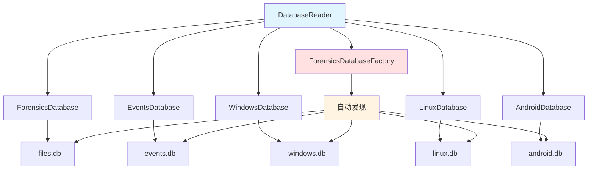

# DatabaseReader 模块文档（Python）

## 1. 模块背景

### 业务背景

取证分析涉及多种数据库（_raw.db, _events.db, _files.db, _windows.db, _linux.db, _android.db），DatabaseReader 模块提供统一的读取接口。

**核心需求**：
- **多数据库支持**：读取 6 种不同的取证数据库
- **批量读取**：高效处理大量记录
- **类型安全**：强类型的记录对象
- **内存优化**：流式读取避免内存溢出

**解决挑战**：
- **数据库发现**：自动发现相关的数据库文件
- **结构差异**：不同数据库表结构不同
- **连接管理**：正确管理 SQLite 连接
- **分页处理**：支持大结果集分页

### 技术背景

**数据库架构**：
```
Server_raw.db        - 原始文件系统元数据
Server_events.db     - 时间线事件
Server_files.db      - 文件分类和 LLM 分析
Server_windows.db    - Windows 取证数据
Server_linux.db      - Linux 取证数据
Server_android.db    - Android 取证数据
```

**SQLite 特性**：
- WAL 模式（Write-Ahead Logging）
- 行级别锁（支持并发读）
- 内存数据库模式（可选）

## 2. 模块功能

### 核心功能

#### 1. 读取文件数据库

```python
from graphiti_integration.database_reader import ForensicsDatabase

# 连接数据库
database = ForensicsDatabase("/output/evidence_files.db")

# 获取统计
stats = database.get_analysis_stats()
print(f"总文件数: {stats['total_files']}")
print(f"已分析文件: {stats['analyzed_files']}")
print(f"分析百分比: {stats['analysis_percentage']:.1f}%")

# 获取文件列表
files = database.get_files(
    analyzed_only=True,  # 仅已分析文件
    categories=["documents", "images"],
    limit=100,
    offset=0
)

for file in files:
    print(f"{file.path}: {file.llm_summary}")
```

#### 2. 批量迭代

```python
# 批量迭代（内存友好）
for batch in database.iter_files_batched(
    batch_size=100,
    analyzed_only=True,
    categories=["documents"]
):
    # 处理这一批
    for file in batch:
        process_file(file)
```

#### 3. 读取事件数据库

```python
from graphiti_integration.database_reader import EventsDatabase

events_db = EventsDatabase("/output/evidence_events.db")

# 获取事件
events = events_db.get_events(
    event_type="MODIFIED",
    limit=100
)

for event in events:
    print(f"{event.timestamp}: {event.event_type} - {event.file_path}")
```

#### 4. 读取 Windows 数据库

```python
from graphiti_integration.database_reader import WindowsDatabase

windows_db = WindowsDatabase("/output/evidence_windows.db")

# 注册表值
registry_values = windows_db.get_registry_values(limit=50)
for value in registry_values:
    print(f"{value.key_path}\\{value.value_name} = {value.value_data}")

# 事件日志
event_logs = windows_db.get_event_logs(limit=50)
for log in event_logs:
    print(f"{log.timestamp}: [{log.level}] {log.message}")

# 用户账号
users = windows_db.get_user_accounts(limit=50)
for user in users:
    print(f"{user.username} ({user.sid}): {user.last_login}")

# Prefetch
prefetch = windows_db.get_prefetch_files(limit=50)
for pf in prefetch:
    print(f"{pf.executable_name}: {pf.run_count} 次运行")

# USB 设备
usb_devices = windows_db.get_usb_devices(limit=50)
for usb in usb_devices:
    print(f"{usb.device_name}: {usb.serial_number}")

# 浏览器历史
browser_history = windows_db.get_browser_history(limit=50)
for history in browser_history:
    print(f"{history.url}: {history.visit_count} 次")

# 服务
services = windows_db.get_services(limit=50)
for service in services:
    print(f"{service.service_name}: {service.state}")
```

#### 5. 读取 Linux 数据库

```python
from graphiti_integration.database_reader import LinuxDatabase

linux_db = LinuxDatabase("/output/evidence_linux.db")

# 日志条目
log_entries = linux_db.get_log_entries(limit=100)
for entry in log_entries:
    print(f"{entry.timestamp}: {entry.process_name}[{entry.pid}] - {entry.message}")

# 用户账号
users = linux_db.get_user_accounts(limit=50)
for user in users:
    print(f"{user.username} (UID: {user.uid}): {user.shell}")

# Shell 历史
shell_history = linux_db.get_shell_history(limit=100)
for cmd in shell_history:
    print(f"{cmd.username}: {cmd.command}")

# 登录记录
logins = linux_db.get_login_records(limit=50)
for login in logins:
    print(f"{login.username} from {login.host} at {login.login_time}")

# 用户组
groups = linux_db.get_groups(limit=50)
for group in groups:
    print(f"{group.group_name} (GID: {group.gid}): {group.members}")
```

#### 6. 读取 Android 数据库

```python
from graphiti_integration.database_reader import AndroidDatabase

android_db = AndroidDatabase("/output/evidence_android.db")

# 联系人
contacts = android_db.get_contacts(limit=100)
for contact in contacts:
    print(f"{contact.display_name}: {contact.phone_number}")

# SMS 消息
sms_messages = android_db.get_sms_messages(limit=100)
for sms in sms_messages:
    print(f"{sms.date}: {sms.address} - {sms.body[:50]}")

# 通话记录
call_logs = android_db.get_call_logs(limit=100)
for call in call_logs:
    print(f"{call.date}: {call.number} ({call.type}) - {call.duration}s")

# 聊天消息（WhatsApp）
whatsapp_msgs = android_db.get_chat_messages(platform="whatsapp", limit=100)
for msg in whatsapp_msgs:
    print(f"{msg.timestamp}: {msg.sender} -> {msg.receiver}")

# Chrome 历史
chrome_history = android_db.get_chrome_history(limit=100)
for history in chrome_history:
    print(f"{history.url}: {history.visit_count} 次")

# 安装的应用
packages = android_db.get_installed_packages(limit=100)
for pkg in packages:
    print(f"{pkg.package_name}: {pkg.version}")

# WiFi 网络
wifi_networks = android_db.get_wifi_networks(limit=50)
for wifi in wifi_networks:
    print(f"{wifi.ssid}: {wifi.key_mgmt}")
```

#### 7. 数据库自动发现

```python
from graphiti_integration.database_reader import ForensicsDatabaseFactory

# 自动发现所有相关数据库
discovered = ForensicsDatabaseFactory.discover(
    base_name="Server",
    output_dir="/output"
)

print(discovered.summary())
# Discovered databases (5 types):
#   - raw: /output/Server_raw.db
#   - files: /output/Server_files.db
#   - events: /output/Server_events.db
#   - windows: /output/Server_windows.db
#   - linux: /output/Server_linux.db

# 创建读取器
readers = ForensicsDatabaseFactory.create_readers(discovered)

# 访问各个数据库
if "files" in readers:
    files_db = readers["files"]
    files = files_db.get_files(limit=10)

if "windows" in readers:
    windows_db = readers["windows"]
    registry = windows_db.get_registry_values(limit=10)
```

### 边界与限制

**功能边界**：
- ❌ 不支持写入操作（只读）
- ❌ 不支持跨数据库查询（需手动联接）
- ❌ 不支持事务（仅单语句查询）

**已知限制**：
| 限制 | 影响 | 缓解方法 |
|------|------|----------|
| 内存占用 | 大结果集占用内存 | 使用 iter_*_batched |
| 连接池 | 无连接池 | 每次查询新建连接 |
| 查询缓存 | 无缓存 | 应用层缓存 |

**性能指标**：
- **查询速度**：~1000 记录/秒
- **批量大小**：推荐 100-500
- **内存占用**：约 50MB/1000 记录

## 3. 模块使用的库

### 依赖库清单

| 库名称 | 版本 | 用途 | 许可证 |
|--------|------|------|--------|
| **sqlite3** | 标准库 | 数据库驱动 | PSF |
| **dataclasses** | 3.7+ | 数据类 | PSF |
| **typing** | 3.7+ | 类型提示 | PSF |

### 架构图



## 4. 模块实现方式

### 核心类

```python
@dataclass
class FileRecord:
    """文件记录"""
    # 核心元数据
    id: int
    inode: int
    name: str
    path: str
    size: int
    extension: str
    category: str
    file_type: str
    mtime: int
    ctime: int
    is_deleted: bool
    md5: str

    # LLM 分析
    llm_summary: Optional[str] = None
    llm_description: Optional[str] = None
    llm_keywords: Optional[str] = None
    llm_analyzed_at: Optional[int] = None
    llm_model_used: Optional[str] = None

    @property
    def has_llm_analysis(self) -> bool:
        """是否有 LLM 分析"""
        return self.llm_analyzed_at is not None and self.llm_analyzed_at > 0

    @property
    def mtime_datetime(self) -> Optional[datetime]:
        """修改时间"""
        if self.mtime and self.mtime > 0:
            return datetime.fromtimestamp(self.mtime)
        return None

    @property
    def keywords_list(self) -> list[str]:
        """关键词列表"""
        if not self.llm_keywords:
            return []
        # 支持 JSON 数组或逗号分隔
        keywords = self.llm_keywords.strip()
        if keywords.startswith("["):
            import json
            try:
                return json.loads(keywords)
            except json.JSONDecodeError:
                pass
        return [k.strip() for k in keywords.split(",") if k.strip()]


class ForensicsDatabase:
    """文件数据库读取器"""

    SELECT_FILES_SQL = """
        SELECT id, inode, name, path, size, extension, category, type,
               mtime, ctime, is_deleted, md5,
               llm_summary, llm_description, llm_keywords,
               llm_analyzed_at, llm_model_used
        FROM files
        {where_clause}
        ORDER BY path
        {limit_clause}
        {offset_clause}
    """

    def __init__(self, db_path: str | Path):
        self.db_path = Path(db_path)
        self._connection = None

    @contextmanager
    def connect(self) -> Generator[sqlite3.Connection, None, None]:
        """上下文管理器：数据库连接"""
        conn = sqlite3.connect(str(self.db_path))
        conn.row_factory = sqlite3.Row
        try:
            yield conn
        finally:
            conn.close()

    def get_files(
        self,
        analyzed_only: bool = False,
        categories: Optional[list[str]] = None,
        limit: Optional[int] = None,
        offset: int = 0,
    ) -> list[FileRecord]:
        """获取文件列表"""

    def iter_files_batched(
        self,
        batch_size: int = 100,
        analyzed_only: bool = False,
        categories: Optional[list[str]] = None,
    ) -> Iterator[list[FileRecord]]:
        """批量迭代文件"""

    def get_analysis_stats(self) -> dict:
        """获取分析统计"""
```

### Windows 数据库读取器

```python
class WindowsDatabase(_BaseForensicsReader):
    """Windows 取证数据库读取器"""

    def get_registry_values(self, limit: Optional[int] = None, offset: int = 0):
        """获取注册表值"""

    def get_event_logs(self, limit: Optional[int] = None, offset: int = 0):
        """获取事件日志"""

    def get_prefetch_files(self, limit: Optional[int] = None, offset: int = 0):
        """获取 Prefetch 文件"""

    def get_user_accounts(self, limit: Optional[int] = None, offset: int = 0):
        """获取用户账号"""

    def get_usb_devices(self, limit: Optional[int] = None, offset: int = 0):
        """获取 USB 设备"""

    def get_browser_history(self, limit: Optional[int] = None, offset: int = 0):
        """获取浏览器历史"""

    def get_services(self, limit: Optional[int] = None, offset: int = 0):
        """获取系统服务"""

    def get_all_artifacts_batched(self, batch_size: int = 100) -> Iterator[tuple]:
        """批量迭代所有工件类型"""
```

### 数据库工厂

```python
class ForensicsDatabaseFactory:
    """取证数据库工厂"""

    DB_SUFFIXES = {
        "_raw.db": "raw_db",
        "_files.db": "files_db",
        "_events.db": "events_db",
        "_windows.db": "windows_db",
        "_linux.db": "linux_db",
        "_android.db": "android_db",
    }

    @classmethod
    def discover(
        cls,
        base_name: Optional[str] = None,
        output_dir: Optional[str] = None,
        any_db_path: Optional[str] = None,
    ) -> DiscoveredDatabases:
        """自动发现所有相关数据库"""

    @classmethod
    def create_readers(cls, discovered: DiscoveredDatabases) -> dict:
        """创建所有数据库读取器"""
```

## 5. API 调用

### Python API

```python
from graphiti_integration.database_reader import (
    ForensicsDatabase,
    EventsDatabase,
    WindowsDatabase,
    LinuxDatabase,
    AndroidDatabase,
    ForensicsDatabaseFactory
)

# 1. 文件数据库
files_db = ForensicsDatabase("/output/Server_files.db")

# 获取统计
stats = files_db.get_analysis_stats()
print(f"分析完成度: {stats['analysis_percentage']:.1f}%")

# 获取已分析的文档
docs = files_db.get_files(
    analyzed_only=True,
    categories=["documents"],
    limit=100
)

for doc in docs:
    print(f"{doc.name}: {doc.llm_summary}")

# 2. 事件数据库
events_db = EventsDatabase("/output/Server_events.db")

modified_events = events_db.get_events(
    event_type="MODIFIED",
    limit=50
)

for event in modified_events:
    print(f"{event.timestamp}: {event.file_path}")

# 3. Windows 数据库
windows_db = WindowsDatabase("/output/Server_windows.db")

# 获取所有工件类型
for artifact_type, batch in windows_db.get_all_artifacts_batched(batch_size=50):
    print(f"处理 {artifact_type}: {len(batch)} 条记录")
    for record in batch:
        process_artifact(artifact_type, record)

# 4. 数据库发现
discovered = ForensicsDatabaseFactory.discover(
    any_db_path="/output/Server_files.db"  # 任意一个数据库
)

print(f"发现 {len(discovered.available_types)} 个数据库")

readers = ForensicsDatabaseFactory.create_readers(discovered)

# 5. 多源读取
for db_type, reader in readers.items():
    print(f"\n=== {db_type.upper()} 数据库 ===")

    if db_type == "files":
        files = reader.get_files(limit=5)
        for file in files:
            print(f"  - {file.path}")

    elif db_type == "events":
        events = reader.get_events(limit=5)
        for event in events:
            print(f"  - {event.event_type}: {event.file_path}")
```

### 与 Pipeline 集合

```python
from graphiti_integration.pipeline import MultiSourcePipeline

# Pipeline 自动使用 DatabaseFactory 发现数据库
pipeline = MultiSourcePipeline(config)

result = await pipeline.run(
    base_name="Server",
    output_dir="/output",
    group_id="case_001",
)

# Pipeline 内部使用 DatabaseFactory 发现和读取所有数据库
```

## 6. 二次开发

### 扩展点

#### 1. 添加新的数据类型

```python
@dataclass
class CustomArtifact:
    """自定义工件类型"""
    id: int
    name: str
    created_at: int
    metadata: str


class CustomDatabase(_BaseForensicsReader):
    """自定义数据库读取器"""

    def get_custom_artifacts(self, limit: Optional[int] = None):
        """获取自定义工件"""
        rows = self._query_table("custom_artifacts", limit=limit)
        return [
            CustomArtifact(
                id=r["id"],
                name=r["name"] or "",
                created_at=r["created_at"] or 0,
                metadata=r["metadata"] or ""
            )
            for r in rows
        ]
```

#### 2. 添加查询缓存

```python
from functools import lru_cache

class CachedForensicsDatabase(ForensicsDatabase):
    """带缓存的数据库读取器"""

    @lru_cache(maxsize=128)
    def get_categories(self) -> list[str]:
        """缓存的类别列表"""
        return super().get_categories()

    def get_files_cached(self, **kwargs) -> list[FileRecord]:
        """使用缓存键的文件查询"""
        cache_key = tuple(sorted(kwargs.items()))
        # 实现缓存逻辑
        pass
```

#### 3. 添加查询优化

```python
class OptimizedForensicsDatabase(ForensicsDatabase):
    """优化的数据库读取器"""

    def get_files_with_index_hints(self, **kwargs):
        """使用索引提示的查询"""
        # 添加 INDEXED BY 提示
        query = self.SELECT_FILES_SQL.format(
            where_clause="INDEXED BY files_category_idx WHERE category = ?",
            limit_clause="LIMIT ?",
            offset_clause=""
        )

        with self.connect() as conn:
            cursor = conn.execute(query, ("documents", 100))
            return [self._row_to_record(row) for row in cursor.fetchall()]
```

### 添加新功能的步骤

#### 完整示例：添加全文搜索支持

```python
class SearchableForensicsDatabase(ForensicsDatabase):
    """支持全文搜索的数据库读取器"""

    def __init__(self, db_path: str | Path):
        super().__init__(db_path)
        self._setup_fts()

    def _setup_fts(self):
        """设置全文搜索"""
        with self.connect() as conn:
            # 创建 FTS 表
            conn.execute("""
                CREATE VIRTUAL TABLE IF NOT EXISTS files_fts
                USING fts5(name, path, category, content='')
            """)

            # 填充数据
            conn.execute("""
                INSERT INTO files_fts(rowid, name, path, category)
                SELECT id, name, path, category FROM files
            """)

    def search_files(
        self,
        query: str,
        limit: int = 100,
    ) -> list[FileRecord]:
        """全文搜索文件"""
        search_sql = """
            SELECT f.*
            FROM files f
            JOIN files_fts fts ON f.id = fts.rowid
            WHERE files_fts MATCH ?
            ORDER BY rank
            LIMIT ?
        """

        with self.connect() as conn:
            cursor = conn.execute(search_sql, (query, limit))
            return [self._row_to_record(row) for row in cursor.fetchall()]

    def search_files_with_snippets(
        self,
        query: str,
        limit: int = 100,
    ) -> list[dict]:
        """搜索并返回片段"""
        search_sql = """
            SELECT
                f.*,
                snippet(files_fts, 1, '<b>', '</b>', '...', 30) as snippet
            FROM files f
            JOIN files_fts fts ON f.id = fts.rowid
            WHERE files_fts MATCH ?
            ORDER BY rank
            LIMIT ?
        """

        with self.connect() as conn:
            cursor = conn.execute(search_sql, (query, limit))
            results = []
            for row in cursor.fetchall():
                file_record = self._row_to_record(row)
                results.append({
                    "file": file_record,
                    "snippet": row["snippet"]
                })
            return results
```

## 7. 其他

### 测试

```bash
cd python_service/graphiti_integration

# 运行测试
pytest tests/test_database_reader.py -v

# 测试特定读取器
pytest tests/test_database_reader.py::TestForensicsDatabase -v
pytest tests/test_database_reader.py::TestWindowsDatabase -v
pytest tests/test_database_reader.py::TestAndroidDatabase -v
```

### 配置

DatabaseReader 无需外部配置，通过构造函数参数控制行为：

```python
# 控制批量大小
database.iter_files_batched(batch_size=50)

# 过滤条件
database.get_files(
    analyzed_only=True,
    categories=["documents", "images"]
)
```

### 故障排查

| 问题 | 可能原因 | 解决方法 |
|------|----------|----------|
| **数据库不存在** | 路径错误 | 检查 db_path 是否正确 |
| **表不存在** | 数据库未初始化 | 使用 _table_exists 检查 |
| **内存溢出** | 一次性读取过多数据 | 使用 iter_*_batched |
| **连接泄漏** | 连接未正确关闭 | 使用 contextmanager |

### 最佳实践

1. **批量处理**：使用 `iter_*_batched` 避免内存问题
2. **连接管理**：使用 `with connect()` 确保连接关闭
3. **类型安全**：使用 dataclass 获得类型提示
4. **错误处理**：捕获 `DatabaseError` 异常
5. **自动发现**：使用 `ForensicsDatabaseFactory.discover()`

### 相关模块

- **[TOONTransformer](./TOONTransformer.md)** - 数据转换
- **[GraphitiIngestor](./GraphitiIngestor.md)** - 图谱摄取
- **[Pipeline](./Pipeline.md)** - 管道编排

---

**最后更新**: 2026-03-11
**维护者**: ymj68520
